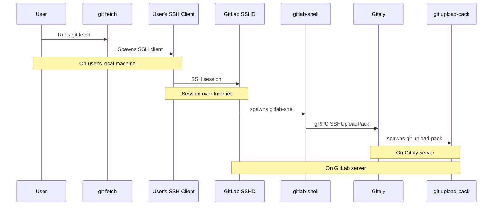
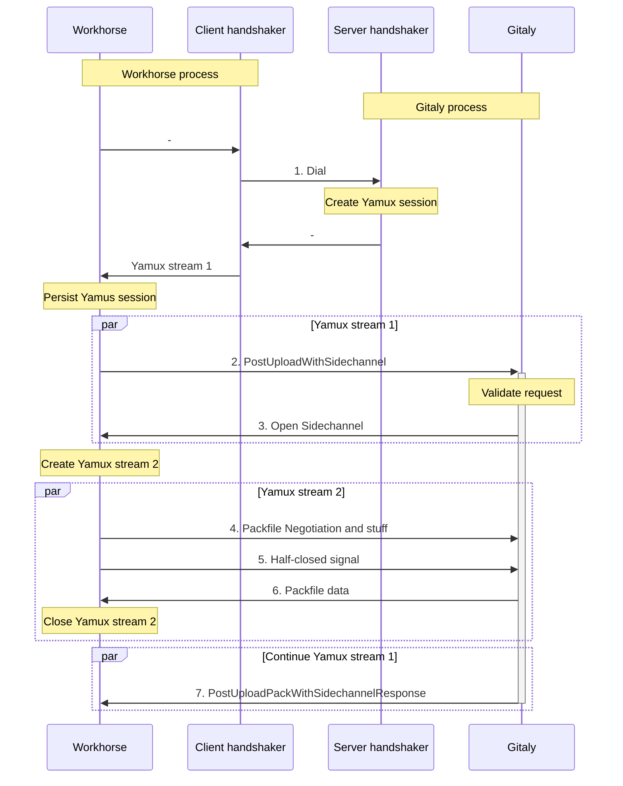
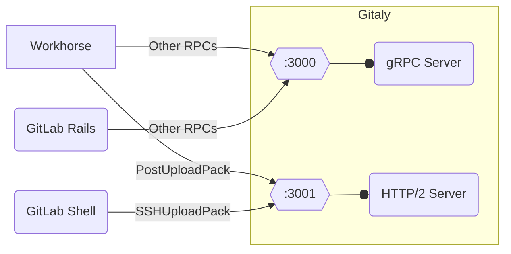
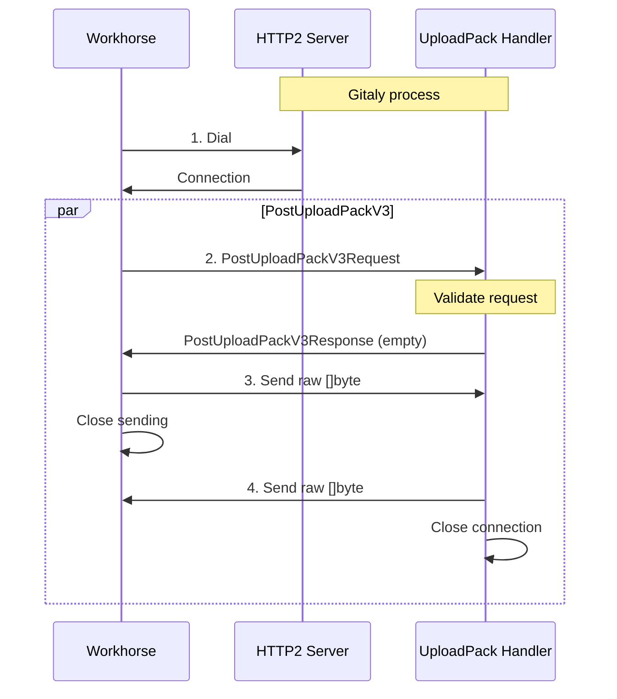

<div class="my-3 border-l-4 border-blue-500 bg-blue-50 px-4 py-3 rounded-r text-sm text-blue-800">
このページには今後予定されている製品・機能・機能性に関する情報が含まれています。ここに示す情報は参考目的のみです。購入・計画の決定にこの情報を使用しないでください。製品・機能・機能性の開発、リリース、タイミングは変更または延期される可能性があり、GitLab Inc. の独自の判断に委ねられています。
</div>

<div class="overflow-x-auto my-4">
<table class="w-full text-sm border-collapse">
<thead>
<tr class="bg-gray-100 text-left">
<th class="px-3 py-2 border border-gray-300">Status</th>
<th class="px-3 py-2 border border-gray-300">Authors</th>
<th class="px-3 py-2 border border-gray-300">Coach</th>
<th class="px-3 py-2 border border-gray-300">DRIs</th>
<th class="px-3 py-2 border border-gray-300">Owning Stage</th>
<th class="px-3 py-2 border border-gray-300">Created</th>
</tr>
</thead>
<tbody>
<tr>
<td class="px-3 py-2 border border-gray-300"><span class="inline-block rounded px-2 py-0.5 text-xs font-medium bg-gray-100 text-gray-700">proposed</span></td>
<td class="px-3 py-2 border border-gray-300"><a href="https://gitlab.com/qmnguyen0711" class="text-blue-600 hover:underline">@qmnguyen0711</a></td>
<td class="px-3 py-2 border border-gray-300"></td>
<td class="px-3 py-2 border border-gray-300"></td>
<td class="px-3 py-2 border border-gray-300"><span class="inline-block rounded px-2 py-0.5 text-xs font-medium bg-gray-100 text-gray-700">~devops::enablement</span></td>
<td class="px-3 py-2 border border-gray-300">2023-06-15</td>
</tr>
</tbody>
</table>
</div>


## サマリー

HTTP/SSH を使用するすべての Git データ転送操作は、Gitaly の upload-pack RPC によって処理されます。

これらの RPC は Sidechannel と呼ばれるユニークなアプリケーションレイヤープロトコルを使用しており、クライアントが Gitaly gRPC サーバーにダイヤルする際のハンドシェイクプロセスを引き継ぎます。このプロトコルは、gRPC 接続を通常通り提供しながら、帯域外接続を通じて大量のデータをクライアントに転送します。

これにより純粋な gRPC ストリーミングコールに比べてパフォーマンスが大幅に向上しますが、このプロトコルは非慣習的で混乱しやすく、洗練されており、Gitaly の次のアーキテクチャへの拡張や統合が難しいです。これに対処するため、このブループリントでは、すべての upload-pack トラフィックを処理するために新しい HTTP/2 サーバーを公開するという「退屈な」新技術ソリューションを提案します。

## 動機

このセクションでは、Git データ転送の仕組みを探り、Sidechannel 最適化の役割に特別な注意を払い、その利点と欠点の両方を説明します。主な目標は、Sidechannel 最適化が提供したパフォーマンス向上を維持しながら、Git データ転送をよりシンプルにすることです。システムを完全に書き直す必要がなく、システムの他の部分や他の RPC に影響を与えないソリューションを探しています。

### Git データ転送の仕組み

GitLab での Git データ転送アーキテクチャに精通している場合は、このパートをスキップしてください。

Git データ転送は、Git サーバーが提供できる重要なサービスの 1 つであることは間違いありません。これは元々 Linux カーネル開発のために開発された Git の基本的な機能です。Git が普及するにつれて、分散システムとして認識され続けました。しかし、GitHub や GitLab のような集中型 Git サービスの出現により、使用パターンが変化しました。その結果、ホスト型 Git サーバーでの Git データ転送の処理が困難になりました。

Git は複数のプロトコル（特に HTTP と SSH）を通じて[パックファイル](https://git-scm.com/book/en/v2/Git-Internals-Packfiles)でデータを転送することをサポートしています。詳細は[pack-protocol](https://git-scm.com/docs/pack-protocol)と[http-protocol](https://git-scm.com/docs/http-protocol)を参照してください。

一般的なフローには以下のステップが含まれます。

1. リファレンスディスカバリ: サーバーが ref をクライアントにアドバタイズする。
1. パックファイルネゴシエーション: クライアントが「haves」、「wants」などのリストを送信して、サーバーとのトランスポートに必要なパックファイルをネゴシエートする。
1. パックファイルデータの転送: サーバーがリクエストされたデータを構成し、Pack プロトコルを使用してクライアントに送り返す。

これらのステップには、さらなる詳細と最適化が基礎にある場合があります。Git サーバーはリファレンスディスカバリとパックファイルネゴシエーションで Issue を抱えたことはありません。プロセスで最も要求が高い側面は、パックファイルデータの転送（実際のデータ交換が行われる場所）です。

GitLab では、Gitaly がすべての Git 操作を管理します。しかし、Workhorse と GitLab Shell がすべての外部通信を処理するため、外部ソースからはアクセスできません。Gitaly は [SmartHTTP](https://gitlab.com/gitlab-org/gitaly/-/blob/master/proto/smarthttp.proto) や [SSH](https://gitlab.com/gitlab-org/gitaly/-/blob/master/proto/ssh.proto) などの特定の RPC を通じて gRPC サーバーを提供します。さらに、GitLab Rails やその他のサービスのための多数の他の RPC を提供します。次の図は SSH を使用したクローンを示しています。



出典: [このドキュメント](https://gitlab.com/gitlab-org/gitaly/-/blob/master/cmd/gitaly-ssh/README.md?plain=0)からの恥知らずなコピー

### Sidechannel を使用した Git データ転送の最適化

過去に、gRPC で大量のデータを転送する際に多くのパフォーマンス上の問題に直面しました。[Epic 463](https://gitlab.com/groups/gitlab-com/gl-infra/-/epics/463) がこの最適化の作業を追跡しています。詳細なコンテキストがありますが、要約すると 2 つの主要な問題があります。

- gRPC の設計方法は、比較的小さなサイズの多くのメッセージを送信するのに理想的です。しかし、中規模のリポジトリをクローンするとギガバイトのデータを転送することになります。Protobuf は大きなデータを扱う際に苦労します（例: <https://protobuf.dev/programming-guides/techniques/#large-data> や <https://github.com/protocolbuffers/protobuf/issues/7968> で確認できます）。これは大幅なオーバーヘッドを追加し、エンコードとデコード中に大量の CPU 使用量を必要とします。さらに、protobuf はメッセージを部分的に読み書きできないため、サーバーが複数のリクエストを同時に受信するとメモリ使用量が急増します。
- 次に、`grpc-go` 実装も同様の目的に向けて最適化されています。gRPC プロトコルは [HTTP/2 上に構築](https://github.com/grpc/grpc/blob/master/doc/PROTOCOL-HTTP2.md)されています。gRPC サーバーがワイヤーに書き込む際、HTTP/2 データフレーム内にデータをラップします。`grpc-go` 実装は非同期コントロールバッファを維持します。新しいメモリを割り当て、データをコピーし、コントロールバッファに追加します（[クライアント](https://github.com/grpc/grpc-go/blob/master/internal/transport/http2_client.go)、[サーバー](https://github.com/grpc/grpc-go/blob/master/internal/transport/http2_server.go)）。そのため、[カスタムコーデック](https://github.com/grpc/grpc-go/blob/master/Documentation/encoding.md)で protobuf の問題を回避できたとしても、`grpc-go` は依然として未解決の問題です。メモリの再利用に関する[アップストリームの議論](https://github.com/grpc/grpc-go/issues/1455)（読み取りパスのみ）はまだ保留中です。[プールされたメモリを追加しようとする試み](https://github.com/grpc/grpc-go/commit/642675125e198ce612ea9caff4bf75d3a4a45667)は、典型的な使用パターンと競合するためリバートされました。

`grpc-go` 実装をバイパスして、帯域外チャネルを通じてクライアントと生のバイナリデータを通信するための Sidechannel というプロトコルを開発しました。Sidechannel の詳細については、[このドキュメント](https://gitlab.com/gitlab-org/gitaly/-/blob/master/doc/sidechannel.md)を参照してください。要約すると、Sidechannel は以下のように機能します。

- gRPC サーバーがクライアント TCP 接続を受け付けるハンドシェイクプロセス中に、[Yamux](https://github.com/hashicorp/yamux) を使用してアプリケーションレイヤーで TCP 接続を多重化します。これにより、gRPC サーバーが Yamux ストリームと呼ばれる仮想多重化接続で動作できます。
- サーバーがデータを転送する必要がある場合、追加の Yamux ストリームを確立します。そのチャネルを使用してデータが転送されます。



Sidechannel はこれまでのところ私たちの元の問題を解決しました。Git 転送の効率が大幅に向上し、CPU とメモリの使用量が大幅に削減されるのを確認しました。もちろん、いくつかのトレードオフがあります。

- これは巧妙なトリックです。おそらく賢すぎます。`grpc-go` は認証目的のみのハンドシェイクフックを提供しています。接続変更には使用されるべきではありません。
- Sidechannel は接続レベルで機能するため、その接続を使用するすべての RPC は、upload-pack をターゲットとしていなくても多重化を確立する必要があります。
- Yamux はアプリケーションレベルのマルチプレクサーです。HTTP/2 に大きく触発されており、特にバイナリフレーミング、フロー制御などです。Yamux の上で gRPC を実行する場合、2 つのフレーミングプロトコルを積み重ねています。
- Sidechannel の詳細な実装は洗練されています。前述のハンドシェイクに加えて、サーバーがダイヤルバックする際、クライアントはハンドラーに返す前にハンドシェイクのために見えない gRPC サーバーを起動する必要があります。また、`pktline` に触発された非対称フレーミングプロトコルを実装しています。このプロトコルは upload-pack RPC に合わせて設計されており、Yamux の「半クローズ」機能の欠如を克服します。

これらすべての複雑さが積み重なって、Gitaly のメンテナンスと将来の進化において負担になっています。Gitaly の将来の Raft ベースのアーキテクチャを見据えると、Sidechannel は常にパズルの 1 ピースです。ルーティング戦略と実装の推論は Sidechannel との互換性を考慮する必要があります。Sidechannel はアプリケーションレイヤープロトコルなので、ほとんどのクライアント側ルーティングライブラリはうまく機能しません。さらに、Sidechannel によって得られたパフォーマンスが保持されることを確認する必要があります。最終的には Sidechannel を組み込む方法を見つけることができますが、選択肢はかなり限られており、別の巧妙なハックにつながる可能性があります。

Sidechannel を同じパフォーマンス特性を維持しながら、よりシンプルで広く採用された技術に置き換えることが有益です。すべての Issue に対処できる潜在的な解決策の 1 つは、すべての upload-pack RPC を純粋な HTTP/2 サーバーに移行することです。

### ゴール

- upload-pack RPC に対して使いやすく、シンプルで、広く採用された Sidechannel の代替を見つける。
- 実装は一般的なライブラリ、フレームワーク、または Go の標準ライブラリのサポートされた API とユースケースを使用する必要がある。トランスポートレイヤーでのハッキングはもうしない。
- 新しいソリューションは Praefect とうまく連携し、将来のルーティングメカニズム、ロードバランサー、プロキシに対して友好的でなければならない。
- Sidechannel と同じパフォーマンスと低いリソース使用率を持つこと。
- 段階的なロールアウトとクライアントとの完全な後方互換性を可能にすること。

### 非ゴール

- 認証、オブザーバビリティ、同時実行制限、メタデータ伝播など、gRPC に投資したすべてを再実装すること。2 つのシステム間で機能を同時にメンテナンスまたは複製したくありません。
- 他の RPC を変更したり、クライアントでの使用方法を変更したりすること。
- すべての RPC を新しい HTTP/2 サーバーに移行すること。

## プロポーザル

このブループリントの大部分は歴史的なコンテキストと前進すべき理由を説明しています。提案されたソリューションは単純明快です。Gitaly はすべての upload-pack RPC を処理するための純粋な HTTP2 サーバーを公開します。その他の RPC はそのまま維持され、既存の gRPC サーバーによって処理されます。



前述のように、Sidechannel は Yamux 多重化プロトコルを利用しており、これは HTTP/2 の合理化されたバージョンと見なすことができます。代わりに HTTP/2 が使用される場合、コア機能（多重化、バイナリフレーミングプロトコル、フロー制御）は変わりません。これは Workhorse などのクライアントが Protobuf のようなカスタムエンコードおよびデコードレイヤーを必要とせずに、同じ TCP 接続で大量のバイナリデータを効率的に交換できることを意味します。これは最初から HTTP/2 の意図したユースケースであり、理論的には Sidechannel と同じレベルのパフォーマンスを提供できます。さらに、この置き換えにより、他の直接 RPC のオーバーヘッドも排除されるため、gRPC over Yamux over TCP の状況がなくなります。

さらに、Gitaly は公式サポートされた API を通じて高度な HTTP/2 機能へのアクセスを提供します。HTTP/2 はファーストクラスの市民であり、Go の標準ライブラリで公式にサポートされています。このプロトコルはオフザシェルフのロードバランサーとプロキシとシームレスに統合され、さまざまなライブラリによってもサポートされています。

最終的に、UploadPack RPC とその他の通常の RPC は、次のセクションで説明される技術を使用して同じポートで共存できます。しかし、パフォーマンスと機能の観点から、一度にすべてを移行するのはリスクがあります。予期しない結果が出る可能性があります。したがって、UploadPack RPC から始めて GitLab.com で段階的に移行を行うことが賢明です。その他の RPC は慎重な検討後に移行できます。セルフマネージドインスタンスは変更なしに既存の単一ポートを使用できるため、この変更はユーザーに透過的です。

次のセクションでは、詳細な実装とそのアプローチの長所と短所を説明します。

## 設計と実装の詳細

### 設計

要約すると、提案は Gitaly が HTTP2 サーバーを公開することです。最初は新しいハンドラーと一連のインターセプターを実装する必要があるように見えます。幸いなことに、gRPC サーバーは [ServeHTTP](https://github.com/grpc/grpc-go/blob/642dd63a85275a96d172f446911fd04111e2c74c/server.go#L1001-L1001) を提供しており、HTTP/2 を gRPC の方法で処理できます。これは HTTP/2 サーバーにプラグインするための `http.Handler` インターフェースを実装します。gRPC プロトコルは HTTP/2 の上に構築されているため、HTTP/2 サーバーはリクエストを受信してハンドラーにルーティングします。リダイレクトにはヘッダーを使用できます。

```go
if r.ProtoMajor == 2 && strings.HasPrefix(
    r.Header.Get("Content-Type"), "application/grpc") {
    grpcServer.ServeHTTP(w, r)
} else {
    yourMux.ServeHTTP(w, r)
}
```

このアプローチには以下の利点があります。

- `ServeHTTP` は Go の HTTP/2 サーバー実装を使用しており、`grpc-go` の HTTP/2 サーバーとは完全に別物です。gRPC と HTTP/2 実装の両方の実装を掘り下げると、組み込みの実装は上記のセクションで言及されたメモリアロケーションの Issue を解決するはずです。
- `ServeHTTP` は Go 標準ライブラリの `http.Handler` インターフェースを実装します。これにより、gRPC ハンドラーとしてハンドラーを書き、生のバイナリデータを転送してステータスコード（エラー詳細を含む）を返すことができます。クライアントは Sidechannel でデータ転送プロセスに何か問題が生じた場合のパイプブロークエラーの代わりに、正確な理由を受け取ることができます。
- ほとんどのインターセプター（すべてではないにしても）は変更なしに再利用できます。stats レポーター、[channelz](https://grpc.io/blog/a-short-introduction-to-channelz/)、クライアント側ロードバランシングなどの他の組み込みツールも動作します。ログとメトリクスなどのオブザーバビリティツールキットもうまく機能します。
- upload-pack リクエストは 1 つの接続での純粋なストリーミングコールになります。帯域外トランスポートをもう 1 つ開く必要はありません。
- クライアント（Workhorse と GitLab Shell）は引き続き gRPC クライアントを使用します。このアプローチを使用したリクエストは通常の gRPC コールとみなされます。したがって、最小限の変更で Praefect とうまく機能するはずです。

もちろん、`ServeHTTP` を使用することはコストがあり、リクエストとレスポンスが Protobuf 構造体になります。カスタムコーデックがこれらのパフォーマンスペナルティを克服できます。理想的な解決策はハンドラーを HTTP ハンドラーとして実装して、接続への生のアクセスができるようにすることです。しかし、そのソリューションはすべての gRPC 固有のコンポーネントを再実装する必要があります。結果として、提案されたソリューションはこのアーキテクチャの進化を容易にするための合理的なトレードオフを行います。



提案されたソリューションは以下の通りです。

- 入力バイナリデータをパススルーする「生のコーデック」を実装する。
- 新しい `PostUploadPackV3` gRPC コールを作成し、他の gRPC ハンドラーと同様の対応するサーバーハンドラーを実装する。
- gRPC の `ServeHTTP` を呼び出す HTTP/2 サーバーを実装する。このサーバーは別の gRPC サーバーとして扱われます。実際、Gitaly は現在、異なるトランスポートチャネルを通じて最大 4 つの gRPC サーバー（内部と外部）を起動します。この HTTP2 サーバーはフリートに溶け込み、Gitaly の既存のプロセス管理、グレースフルシャットダウンとアップグレードを使用できます。

ソリューションを示すために、Gitaly と Workhorse に 2 つの POC マージリクエストを実装しました。

- Gitaly: [マージリクエスト 5885](https://gitlab.com/gitlab-org/gitaly/-/merge_requests/5885)。
- Workhorse: [マージリクエスト 123764](https://gitlab.com/gitlab-org/gitlab/-/merge_requests/123764)。

これらの POC MR は Praefect なしのセットアップのテストをグリーンにします。ローカル環境での早期ベンチマークはこのアプローチが：

- Sidechannel アプローチよりもわずかに速い。
- ピーク CPU 消費量を **10-20%** 削減する。
- 同じメモリ使用量を維持する。

ことを示しています。

POC は完全ではありませんが、「退屈な」技術を使用した単純化を示しています。パフォーマンスの向上は全く予期しないものでした。

既存の Sidechannel ソリューションは新しいものと共存できます。これにより、段階的な採用が実現可能になります。

外部トラフィックに加えて、Gitaly サーバーは内部リクエストも処理します。これらは Gitaly によってスポーンされた Git プロセスから来ます。典型的な例として、パックファイルを生成するために `git-upload-pack(1)` によってトリガーされる `PackObjectsHookWithSidechannel` RPC があります。提案されたソリューションはこれらの内部 RPC にも利点をもたらします。

### 考慮事項

提案されたソリューションの主な Issue は、HTTP/2 を別のポートで公開することです。`ServeHTTP` は gRPC ハンドラーを既存の HTTP/2 サーバーに統合できますが、逆方向はサポートされていません。新しいポートの公開は、制限的な環境でのファイアウォール、NAT などの追加のセットアップにつながります。典型的なセットアップはインフラの変更を必要としません。上述のように、2 ポートの状況は移行中のみ発生します。完了したら、それらを 1 つに統合してセルフマネージドインスタンスにリリースできます。ユーザーは何も変更する必要はありません。

前述のように、新しく導入された HTTP/2 サーバーは Gitaly プロセスによって管理されます。起動、再起動、シャットダウン、アップグレードにおいて、既存の gRPC サーバーと一貫して動作します。これはまた、現在の gRPC サーバーのために設定されているならば、ロードバランシング、サービスディスカバリ、ドメイン管理、その他の設定がシームレスに機能することも意味します。新しいサーバーは TLS と認証を含む現在の gRPC サーバーのほとんどの設定を使用できます。必要な唯一の新しい設定は HTTP サーバーがバインドするアドレスです。したがって、新しいポートを公開することは障害にはなりません。

もう 1 つの懸念は、Workhorse と GitLab Shell が別の接続プールを維持しなければならないことです。現在、それらは各 Gitaly ノードへの 1 つの接続を維持しています。この数は各 Gitaly ノードへの 2 つの接続に倍増します。これは大きな Issue ではないはずです。最終的には、トラフィックが 2 つの接続に分割され、ほとんどの重い操作は HTTP/2 サーバーによって処理されます。GitLab Rails は UploadPack を処理しないため、そのままです。
