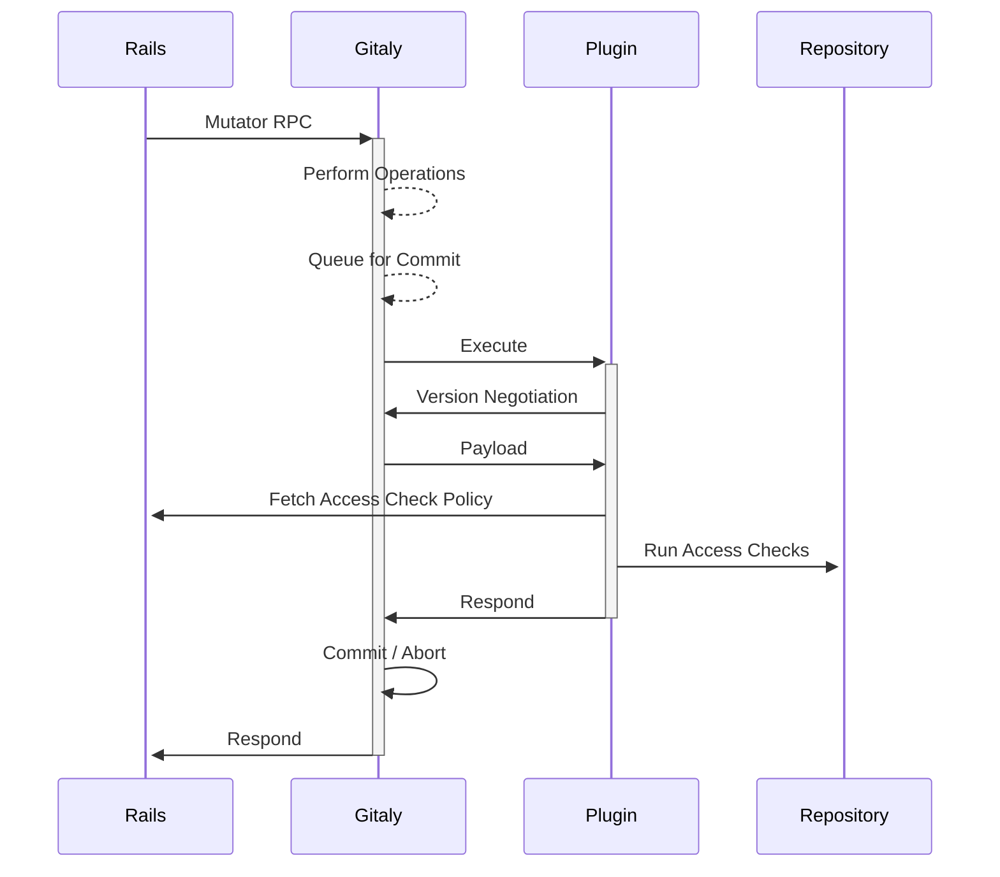

<div class="my-3 border-l-4 border-blue-500 bg-blue-50 px-4 py-3 rounded-r text-sm text-blue-800">
このページには今後予定されている製品・機能・機能性に関する情報が含まれています。ここに示す情報は参考目的のみです。購入・計画の決定にこの情報を使用しないでください。製品・機能・機能性の開発、リリース、タイミングは変更または延期される可能性があり、GitLab Inc. の独自の判断に委ねられています。
</div>

<div class="overflow-x-auto my-4">
<table class="w-full text-sm border-collapse">
<thead>
<tr class="bg-gray-100 text-left">
<th class="px-3 py-2 border border-gray-300">Status</th>
<th class="px-3 py-2 border border-gray-300">Authors</th>
<th class="px-3 py-2 border border-gray-300">Coach</th>
<th class="px-3 py-2 border border-gray-300">DRIs</th>
<th class="px-3 py-2 border border-gray-300">Owning Stage</th>
<th class="px-3 py-2 border border-gray-300">Created</th>
</tr>
</thead>
<tbody>
<tr>
<td class="px-3 py-2 border border-gray-300"><span class="inline-block rounded px-2 py-0.5 text-xs font-medium bg-gray-100 text-gray-700">proposed</span></td>
<td class="px-3 py-2 border border-gray-300"><a href="https://gitlab.com/samihiltunen" class="text-blue-600 hover:underline">@samihiltunen</a></td>
<td class="px-3 py-2 border border-gray-300"></td>
<td class="px-3 py-2 border border-gray-300"></td>
<td class="px-3 py-2 border border-gray-300"><span class="inline-block rounded px-2 py-0.5 text-xs font-medium bg-gray-100 text-gray-700">~devops::enablement</span></td>
<td class="px-3 py-2 border border-gray-300">2023-02-01</td>
</tr>
</tbody>
</table>
</div>


## サマリー

このブループリントは Gitaly のプラグインインターフェースを説明します。プラグインは Gitaly がトランザクションをコミットする前後に呼び出す実行可能ファイルです。

プラグインにより、Gitaly ノード上でローカルにアクセスチェックロジックを実装できます。Gitaly ノード上でローカルにアクセスチェックを実行することでパフォーマンスが向上します。プラグインは現在 Gitaly の API を通じて漏れている内部の詳細を隠蔽することで複雑さを軽減します。

ハードコードされたアクセスチェックロジックとカスタムフックはプラグインに置き換えられます。

## 動機

### 背景

Gitaly は Git リポジトリを格納するデータベースシステムであり、GitLab の残りの部分から切り離されることを目指しています。一般的に関心の分離は良いプラクティスですが、Gitaly は GitLab の外でも使用されています。この切り離しは Gitaly に実装すべき機能の種類についてのガイドラインとして機能します。Gitaly の主な目的であるリポジトリストレージとアクセスの提供をサポートする機能のみを Gitaly に直接実装すべきです。

一部のユースケースは Gitaly の書き込みフローとのより緊密な統合を必要とします。例えば：

- 認可チェックは Gitaly が書き込みを受け付ける前に実行して、無許可の書き込みを拒否する必要があります。
- 書き込み後に通知を送信して、CI ジョブをトリガーする必要があります。

このロジックは関心を分離するために Gitaly に直接組み込まれていません。Gitaly は両方のケースに対して[Rails アプリケーションの内部 API](https://docs.gitlab.com/ee/development/internal_api/index.html) を呼び出します。

- 書き込みを受け付ける前に、Gitaly は `/internal/allowed` を呼び出します。エンドポイントからのレスポンスが Gitaly が書き込みを受け付けるかどうかを決定します。
- 書き込みを受け付けた後、Gitaly は `/internal/post_receive` を呼び出します。

Rails アプリケーションの内部 API を呼び出すことに加えて、Gitaly は[カスタムフック](https://docs.gitlab.com/ee/administration/server_hooks.html)をサポートしています。カスタムフックは Gitaly が書き込みを受け付ける前後に呼び出す実行可能ファイルであり、[Git フック](https://git-scm.com/book/en/v2/Customizing-Git-Git-Hooks)のインターフェースに準拠しています。`pre-receive` フックは書き込みを拒否でき、`update` フックは単一の参照更新を削除でき、`post-receive` は受け付けられた書き込みの通知に使用できます。

「カスタムロジック」は、このブループリントで内部 API コールとカスタムフックの両方を指すために使用されます。

### 問題点

#### 機能の重複

内部 API とカスタムフックは同じ場所で呼び出され、同様の機能を持っています。主な違いはロジックの作者です。

- 内部 API は GitLab が使用します。
- カスタムフックはセルフマネージドインスタンスでカスタムロジックをプラグインするために使用されます。

冗長な機能のメンテナンスは負担です。カスタムフックが GitLab によって使用されていないことは、それらが GitLab.com の本番環境で徹底的にテストされていないことを意味します。内部 API コールは本質的に Gitaly にハードコードされた GitLab 固有のフックです。

#### すべての書き込みにフックできるわけではない

Gitaly は特定の書き込み操作中のみにカスタムロジックを呼び出すようにハードコードされています。これらの操作は GitLab がカスタムロジックを呼び出す必要がある場所によって決まります。大まかに言うと、これらのポイントは：

- カスタムロジックを呼び出すさまざまな `*ReceivePack` バリアント。これらはプッシュ時にカスタムロジックを実行するために使用されます。
- ユーザーがリポジトリで変更を行う際に Rails が呼び出す `OperationService` RPC。カスタムロジックはユーザーが変更を行うことが許可されているかどうかを確認するために認可チェックを実行したい Rails アプリケーションのため、これらの間で呼び出されます。

GitLab がそれを必要としないため、他の書き込みに対してカスタムロジックは呼び出されません。例えば、除外される書き込みにはリポジトリの作成、リポジトリの削除、`WriteRef` を通じた参照更新が含まれます。

これにより GitLab のニーズとの緊密な結合が生まれます。

#### Git によって決定されるカスタムフックインターフェース

カスタムフックは Git フックのインターフェースに準拠しています。これは制限的であり、一貫性のないインターフェースにつながっています。

- 参照更新は標準入力を通じてストリームされます。
- その他の変数は環境変数を通じて渡されます。
- ユーザーへのエラーメッセージを Gitaly を通じて渡すために特別なプレフィックスが必要です。
- 各参照に対して `update` フックを呼び出すことは非効率です。
- 参照更新以外のサポートされた書き込みをカバーするようにペイロードを拡張する自然なポイントがありません。

Gitaly がカスタムフックを実行するため、より良いインターフェースを定義できます。Git がフックに使用するインターフェースに準拠する必要はありません。

#### パフォーマンスの問題

Rails は内部 API でのアクセスチェックを Gitaly のパブリック API を通じてデータをフェッチして実行します。これにより Rails がチェックを実行するために書き込み全体をフェッチする必要がある場合があるため、パフォーマンスの問題が生じます。例えば、[pre-receive シークレット検出](https://docs.gitlab.com/ee/architecture/blueprints/secret_detection/index.html)はそのチェックを実行するために書き込みのすべての新しい blob をフェッチする必要があります。Gitaly ノード上でローカルにチェックを実行する方法があれば、これを避けることができます。

#### 内部の漏れ

書き込みが受け付けられる前に、Gitaly は新しいオブジェクトを隔離ディレクトリに保持します。これらのオブジェクトは他のユーザーの Gitaly API を通じてアクセスできないようにすべきです。しかし、認可チェックはこれらのオブジェクトへのアクセスが必要です。これは隔離ディレクトリのパスを Rails に送ることで処理され、Rails はこれをフォローアップコールで Gitaly に渡します。これにより内部の詳細が漏れます。

- 隔離はパブリック API で公開されます。
- Gitaly Cluster では、隔離ディレクトリは各ノードで異なる場所にあります。これにより Praefect がフォローアップコールで隔離パスが正しい場所を指すようにプライマリレプリカへの強制ルーティングコールをサポートする必要があります。
- これは[トランザクション](https://docs.gitlab.com/ee/architecture/blueprints/gitaly_transaction_management/index.html)でさらに複雑になります。隔離パスはトランザクションのスナップショットに相対的です。隔離パスを適用するためには、リクエストで送られる相対パスはスナップショットリポジトリの相対パスである必要があります。しかし、Praefect はリクエストを正しい Gitaly ノードにルーティングするためにリポジトリの元の相対パスが必要です。

内部の漏れは複雑さを追加し、回避策を必要とします。

#### 複雑さ

パフォーマンスの問題と内部の漏れに加えて、現在のアクセスチェックフローは複雑で理解が難しいことが証明されています。

1. Rails アプリケーションが RPC のために Gitaly を呼び出す。
1. Gitaly がアクセスチェックのために Rails アプリケーションにコールバックする。
1. Rails アプリケーションがアクセスチェックに必要なデータをフェッチするために Gitaly を複数回再び呼び出す。

この複雑さは、特定の RPC から複数の他の RPC を展開せず、代わりにすべてのチェックを現在実行中の RPC のコンテキストに保つことで軽減できます。

## ソリューション

内部の詳細を API に漏らすことなく、効率的なプリコミットチェックの実装を可能にするプラグインインターフェースを Gitaly に定義します。

### ゴール

- 内部 API コールとカスタムフックを置き換える単一のプラグインインターフェース。
- アクセスチェックの効率的な実行を可能にする。
  - Gitaly ノード上のデータに近い場所でチェックを実行できるようにする。
  - 実装を指定せず、プラグイン作者がユースケースに最適な方法でプラグインを実装できるようにする。
- API から GitLab 固有の仮定を削除する。
  - 内部 API への呼び出しのハードコードを削除し、プラグインインターフェースの背後に移動する。
  - すべての書き込みに対してプラグインを呼び出す。
  - Gitaly の API から `gl_repository` や `gl_project_path` などの GitLab 固有のフィールドを削除する。
- 内部の詳細を漏らさない。
  - API から隔離ディレクトリを削除する。
  - プライマリへの強制ルーティングを削除する。
  - トランザクションのスナップショットパスをパブリック API を通じてパイプする必要性を削除する。
- Gitaly とそのユーザーのニーズによって設定された、Git ではないクリーンで明確に定義されたインターフェース。

## プロポーザル

プロポーザルは Gitaly の今後の[トランザクション管理](https://docs.gitlab.com/ee/architecture/blueprints/gitaly_transaction_management/index.html)を念頭に置いて書かれています。

### プラグイン

プラグインは Gitaly がトランザクションの実行中の特定のポイントで呼び出す実行可能ファイルです。プラグインが実行可能ファイルであることにより：

- 保護: プラグインは別のプロセスで実行されます。Gitaly はプラグインのメモリリークやクラッシュから保護されます。
- 柔軟性:
  - プラグインは作者が好むツールを使用して実装できます。
  - プラグインはワンオフの実行可能ファイルとして、またはサーバーデーモンを呼び出すものとして実装できます。
- 関心の分離: Gitaly は実行可能ファイルを実行し、他の責任を委任するだけです。

プラグインはトランザクションの実行中の 2 つのポイントで呼び出されます。

- `before-commit`:
  - トランザクションがコミットされる前に呼び出されます。
  - トランザクションを拒否できます。
- `after-commit`:
  - トランザクションがコミットされた後に呼び出されます。
  - トランザクションはすでにコミットされているため、これは単なる通知です。

名前は Git の `pre-commit` と `post-commit` フックとの区別のために選ばれています。`Plugin` は Git のフックとの区別のためにさらに使用されます。

Gitaly は単一のプラグインの設定を許可します。Gitaly は複数のプラグインを同時実行するか順次実行するか、どの順序で、また 1 つのプラグインが書き込みを失敗させると残りのプラグインの実行が停止するかどうかを決定することから解放されます。これらの決定はプラグインに委任されます。複数のプラグイン実行可能ファイルを実行するサポートは、本当に必要であればプラグインに実装できます。

単一のプラグインはすべてのパーティション/リポジトリをカバーします。リポジトリ固有のロジックはプラグインに実装して、リポジトリ固有のカスタムフックによって以前に提供されたような同様のユースケースをサポートできます。

Gitaly とプラグインはプラグインプロセスの `stdin` と `stdout` を通じて通信します。もう一方のプロセスに書き込まれる各メッセージは、後に続くペイロードの長さを説明する `uint64` でプレフィックスされます。これにより、シンプルなメッセージパッシングプロトコルが作られます。Protocol buffers はスキーマを定義してペイロードをシリアライズするために使用されます。

プラグインが呼び出されると、サポートされているプロトコルバージョンを big-endian エンコードされた `uint16` として `stdout` に書き込みます。これにより Gitaly は複数のバージョンのプロトコルを並列でサポートすることで、後方互換性のない方法で API を進化させることができます。プラグインのプロトコルがサポートされていない場合、Gitaly はプラグインを終了させて書き込みを失敗させます。プロトコルがサポートされている場合、Gitaly は続行します。

プロトコルの初期バージョンを以下に説明します。

バージョンネゴシエーションの後、Gitaly は `stdin` を通じてプラグインにメッセージを送ります。以下はメッセージスキーマです。

```protobuf
// PluginRequest is the payload that describes the transaction being executed.
message PluginRequest {
  // ReferenceChanges describes reference changes of the transaction.
  message ReferenceChanges {
    // Change describes a single reference change made in the transaction.
    message Change {
      // reference_name is the name of the reference being changed.
      bytes  reference_name = 1;
      // old_oid is the reference's previous object ID. Zero OID indicates the reference did not exist.
      string old_oid        = 2;
      // new_oid is the reference's new object ID. Zero OID indicates a reference deletion.
      string new_oid        = 3;
    }

    repeated Change changes = 1;
  }

  // Header contains details of the plugin's execution environment and the transaction.
  message Header {
    // storage is the name of the target storage of the transaction.
    string storage = 1;
    // relative_path is the relative path of the target repository of the transaction.
    string relative_path = 2;
    // push_options contains the push options sent by the client during a push, if any.
    repeated bytes push_options = 3;
    // client_metadata contains a blob sent by the client to Gitaly to pass through to
    // the plugin. It allows the client to send parameters to the plugin transparently
    // through Gitaly. The metadata is sent by the client by setting the gRPC metadata
    // header `gitaly-plugin-metadata-bin` in the request to Gitaly.
    //
    // This can be used to pipe GitLab specific data from Rails to the plugin, such as
    // `gl_project` and `gl_user`.
    bytes plugin_metadata = 4;

    // git_command_path contains the absolute path to the Git command that should be used to
    // access the repository.
    string git_command_path = 5;
    // repository_path contains the absolute path of the transaction's target repository. It
    // points a snapshot of the actual repository.
    string repository_path = 6;
    // git_object_directory is an absolute path to the transaction's quarantine directory
    // where the new objects are written. It must be set for the Git invocations as an
    // environment variable through `GIT_OBJECT_DIRECTORY` for the objects to be readable.
    string git_object_directory = 7;
    // git_alternate_object_directories points to the object database that contains the objects
    // that existed prior to the transaction. It must be set for the Git invocation as an
    // environment variable through `GIT_ALTERNATE_OBJECT_DIRECTORIES` for the objects to be
    // readable.
    //
    // `GIT_ALTERNATE_OBJECT_DIRECTORIES` can be left unset if the Git invocation should only
    // read the new objects introduced in the transaction. This can be useful for some operations
    // that may for example want to scan only new blobs.
    string git_alternate_object_directories = 8;
  }

  oneof message  {
    // header is always the first message sent to the plugin.
    Header header = 1;
    // reference_changes are the reference_changes being performed by this transaction. reference_changes
    // may be chunked over multiple messages.
    ReferenceChanges reference_changes = 2;
  }
```

ヘッダーは常に最初のメッセージで送られます。参照変更はヘッダーに続き、複数のメッセージにわたってチャンクされる場合があります。Gitaly はメッセージの送信が完了するとプラグインの `stdin` を閉じます。

初期プロトコルはフックが現在行うように、単一のリポジトリの参照変更にフックすることのみをサポートします。プロトコルは後で必要に応じて例えば以下をサポートするように拡張できます。

- リポジトリの作成と削除などの他の書き込みタイプ。
- 複数のリポジトリをターゲットとするトランザクション。

ペイロードを受け取った後、プラグインはロジックを実行します。提供された Git コマンドを通じて指定されたパスの Git リポジトリにアクセスし、必要なデータを取得します。完了すると、プラグインはトランザクションをコミットするか中止するかを示す[ステータス](https://github.com/googleapis/googleapis/blob/master/google/rpc/status.proto#L35)を含むレスポンスを stdout に書き込みます。

```protobuf
// PluginResponse is the response message the plugin passes back to Gitaly after finishing.
message PluginResponse {
  // status indicates whether the transaction should succeed or fail.
  google.rpc.Status status = 1
}
```

- ステータスのコードが `OK` の場合、トランザクションはコミットされます。
- ステータスが他のコードの場合、トランザクションは中止されます。ステータスはそのままクライアントに返されます。これにより、プラグインは正確なステータスコード、メッセージ、追加の詳細で拒否の理由を伝えることができます。

プラグインは正常に実行された場合、ゼロの終了コードを返す必要があります。これはトランザクションが拒否された場合でも行う必要があります。

プラグインがゼロ以外の終了コードを返した場合、プラグインは失敗したとみなされます。これはプラグインが書き込みを拒否することとは異なります。プラグインが失敗した場合、`stdout` は無視されてクライアントにエラーが返されます。Gitaly は `stderr` の内容とともにエラーをログし、書き込みを拒否します。

プラグインが時間がかかりすぎる場合（RPC デッドラインによって定義される）、Gitaly はプラグインを終了させます。これは上記で説明したようにプラグインの失敗として処理されます。

#### 互換性の保証

Gitaly は指定されたパスのリポジトリが指定されたパスの `git` コマンドを通じてアクセス可能であることを保証します。リポジトリへのすべてのアクセスは提供された `git` バイナリを通じて行われる必要があります。

リポジトリのレイアウト、場所、ファイル形式、ストレージの詳細は互換性の保証に含まれません。これにより Gitaly はストレージ形式で自由にイテレーションできます。リポジトリの変更はサポートされていません。

ペイロードの形式はプロトコルバージョン内で後方互換性を維持することが保証されるべきです。バージョンをバンプせずに新しいキーを導入できます。

#### カスタムフック

Gitaly は単一のプラグインの設定のみをサポートするため、GitLab プラグインをカスタムプラグインとともに設定する方法について疑問が生じる場合があります。複数のプラグインを直接実行することはサポートされていませんが、カスタムプラグインを設定し、そのプラグインが GitLab プラグインを呼び出すことができます。これにより、GitLab アクセスチェックプラグインと並行してカスタムロジックをプラグインできます。カスタムプラグインは GitLab プラグインを呼び出すことを制御するため、GitLab プラグインの前、後、または同時に実行するかどうかを完全に制御できます。

### 移行

プラグインへの移行はいくつかのステップを踏みます。

1. GitLab アクセスチェックプラグインのプロジェクトを作成する。ここに既存の内部 API ロジックが移行されます。
1. プラグインをディストリビューションにパッケージし、Gitaly ノードにデプロイして設定する。
1. Gitaly からプラグインへの内部 API 呼び出しロジックを移行する。
1. この時点で、既存の内部 API 呼び出しロジックが Gitaly からプラグインとして実行されます。
1. アクセスチェックをプラグインに段階的に移行し始めることができます。

トランザクションの新しいオブジェクトへのすべてのアクセスはプラグインを通じて行われる必要があります。Gitaly は書き込みにフックするためのインターフェースのみを提供します。

アクセスチェックが正確にどのように実行されるかは、アクセスチェックを担当するチームに委ねられています。アクセスチェックが Git データに大きく依存している場合、プラグインは Rails からポリシーのみをフェッチしてチェックをローカルで実行できます。これにより、ループバックコールを削除して Gitaly ノード上のデータに直接アクセスすることで効率が向上します。一部のアクセスチェックロジックは、それに最も適している場合は依然として Rails に残ることができます。

アクセスチェックのすべてのリポジトリアクセスがプラグインを通じて行われるようになると、隔離ディレクトリとプライマリへの強制ルーティング機能を Gitaly の API から削除できます。

#### 最終状態

次の図は望ましい最終状態を示しています。

1. Gitaly は Rails を直接呼び出さなくなります。
1. プラグインは Rails からアクセスチェックポリシーのみをフェッチします。アクセスチェックはリポジトリ上でローカルで実行されます。
1. Gitaly はプラグインの結果に基づいてトランザクションをコミットまたは中止します。



### 考慮事項

#### セキュリティ

プラグインは管理者のみが設定できるようにして、信頼済みとみなします。サンドボックス化の計画はありません。

#### サブプロセス

プラグインがサブプロセスを起動する場合、Gitaly がプラグインを終了させたい場合にプロセスグループ全体を終了できるように、同じプロセスグループに保持する必要があります。Gitaly はすべてのサブプロセスの終了を保証できるように、プラグインを独自の cgroup で実行することを検討すべきです。

#### `update` フックの機能はサポートされていない

プラグインは現在、`update` フックで可能なように特定の参照更新を削除することをサポートしていません。フックのサポートはどれほど有用かが明確でないため省略されました。必要であれば、プラグインが削除する参照についてのメッセージを Gitaly に書き込むことでサポートできます。

### 将来の機会

#### 保証された post-receive 通知デリバリー (#5411)

現在、Gitaly は post-receive 通知のデリバリーを保証しません（[#5411](https://gitlab.com/gitlab-org/gitaly/-/issues/5411)）。デリバリーは任意の理由で失敗する可能性があります。例えば、Gitaly がクラッシュしたり、Rails アプリケーションが利用不能になる場合があります。これにより予期しない動作が発生する可能性があります。

1. 通知は書き込み後に CI パイプラインをトリガーします。デリバリーが失敗すると、パイプラインがトリガーされない可能性があります。
1. コード検索は通知に基づいて新しい変更のインデックスを作成します。デリバリーが失敗すると、インデックスが古くなる可能性があります。

ライトアヘッドログに格納されたトランザクションにより、Gitaly はログからトランザクションを回復し、デリバリーを再試行することで、クラッシュ後の `after-commit` 通知のデリバリーを保証できます。これを容易にするために、すべての必要な情報をログエントリーに格納する必要があります。例えば、プッシュオプションなどです。
