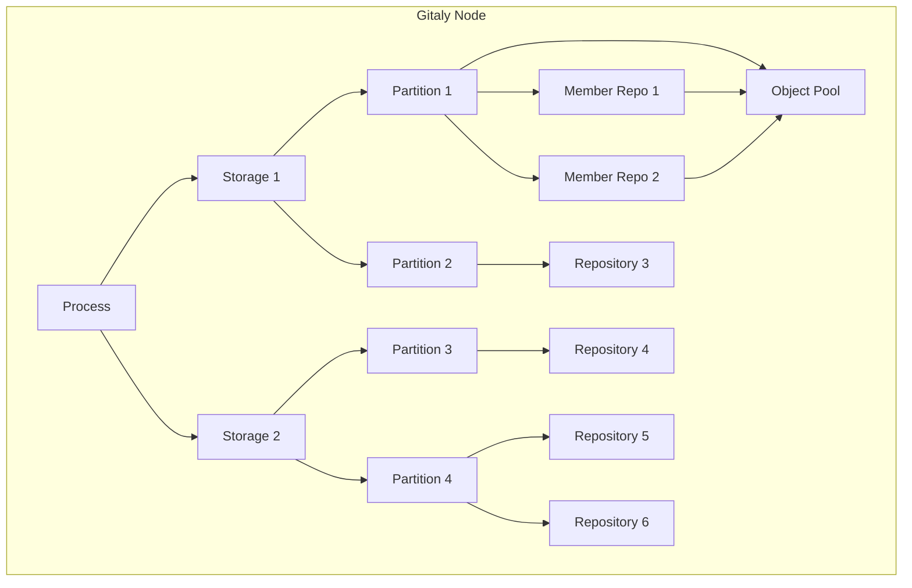
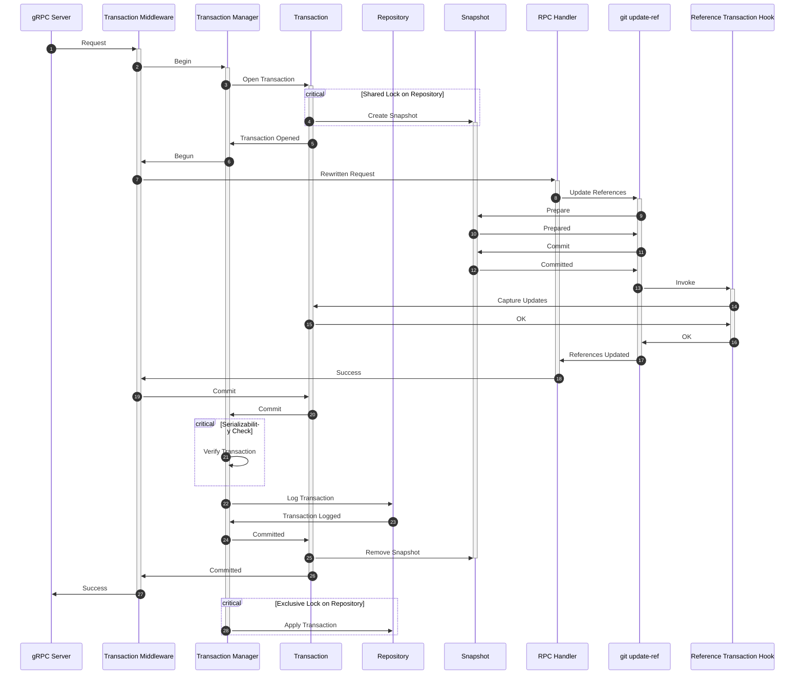

このページには今後予定されている製品・機能・機能性に関する情報が含まれています。ここに示す情報は参考目的のみです。購入・計画の決定にこの情報を使用しないでください。製品・機能・機能性の開発、リリース、タイミングは変更または延期される可能性があり、GitLab Inc. の独自の判断に委ねられています。

<table class="w-full text-sm border-collapse">
<thead>
<tr class="bg-gray-100 text-left">
<th class="px-3 py-2 border border-gray-300">Status</th>
<th class="px-3 py-2 border border-gray-300">Authors</th>
<th class="px-3 py-2 border border-gray-300">Coach</th>
<th class="px-3 py-2 border border-gray-300">DRIs</th>
<th class="px-3 py-2 border border-gray-300">Owning Stage</th>
<th class="px-3 py-2 border border-gray-300">Created</th>
</tr>
</thead>
<tbody>
<tr>
<td class="px-3 py-2 border border-gray-300">ongoing</td>
<td class="px-3 py-2 border border-gray-300"><a href="https://gitlab.com/samihiltunen" class="text-blue-600 hover:underline">@samihiltunen</a></td>
<td class="px-3 py-2 border border-gray-300"><a href="https://gitlab.com/tkuah" class="text-blue-600 hover:underline">@tkuah</a></td>
<td class="px-3 py-2 border border-gray-300"><a href="https://gitlab.com/jcaigitlab" class="text-blue-600 hover:underline">@jcaigitlab</a></td>
<td class="px-3 py-2 border border-gray-300">~devops::enablement</td>
<td class="px-3 py-2 border border-gray-300">2023-05-30</td>
</tr>
</tbody>
</table>

## サマリー

Gitaly は Git リポジトリを格納するためのデータベースシステムです。このブループリントは、以下を導入することで ACID 特性を保証するトランザクション管理を Gitaly に実装することをカバーします。

- 先行書き込みログ（Write-ahead logging）。この作業はすでに進行中で、[Gitaly への先行書き込みログの実装](https://gitlab.com/groups/gitlab-org/-/epics/8911)で追跡されています。
- マルチバージョン並行制御（Multiversion concurrency control）によるシリアライズ可能なスナップショット分離（Serializable snapshot isolation）。

目標は、並行アクセスや中断された書き込みを処理する際の信頼性を向上させることです。トランザクション管理により、トランザクションが並行性と障害関連の異常を処理するため、Gitaly への貢献が容易になります。

これは [Gitaly Cluster のための分散型 Raft ベースのアーキテクチャ](https://gitlab.com/groups/gitlab-org/-/epics/8903)を実装する最初の段階です。

## 動機

Gitaly のトランザクション管理は不十分です。Gitaly は、データベースライクなソフトウェアに通常期待される保証を提供していません。データベースは通常、ACID 特性を保証します。

- 原子性（Atomicity）: トランザクション内のすべての変更は完全に行われるか、まったく行われないかのどちらかです。
- 一貫性（Consistency）: すべての変更はデータを一貫した状態のままにします。
- 分離性（Isolation）: 並行トランザクションは、システム内で唯一のトランザクションであるかのように実行されます。
- 永続性（Durability）: トランザクション内の変更は永続し、確認応答後にシステムクラッシュを乗り越えます。

Gitaly はストレージにトランザクション的にアクセスせず、無数の方法でこれらの特性に違反しています。いくつかの例を挙げます。

- 原子性:
  - 参照は Git によって一つずつ更新されます。操作が中断されると、一部の参照は更新されている一方で他は更新されていないことがあります。
  - オブジェクトがリポジトリに書き込まれたが参照に失敗することがあります。
  - カスタムフックは古いディレクトリを移動させて新しいものを所定の位置に移動することで更新されます。この操作が途中で失敗すると、リポジトリの既存のフックは削除されましたが新しいフックは書き込まれていません。
- 一貫性:
  - Gitaly はオブジェクトをクォランティンディレクトリからメインリポジトリに移行します。この移行中にオブジェクト間の依存関係を考慮しません。このプロセスが中断され、依存関係が欠けているオブジェクトが後で参照された場合、リポジトリは破損します。
  - クラッシュは、それ以降の書き込みを妨げる古いロックをディスクに残すことがあります。
- 分離性:
  - 並行してリポジトリが削除されることにより、どの操作も失敗する可能性があります。
  - 別の操作がそれらを読み取っている間に参照やオブジェクトデータベースの内容を変更することができます。
  - バックアップは、データを変更する並行書き込み操作により一貫性を欠くことがあります。バックアップは、カスタムフックが更新中にバックアップされた場合など、サーバー上に存在しなかった状態を含む可能性さえあります。
  - カスタムフックの変更と実行を並行して行うと、カスタムフックが実行されないことがあります。これは、古いフックが削除されてから新しいフックが設置されるまでの間に実行が発生した場合に起こりえます。
- 永続性: 最近 Gitaly で複数の fsync の欠落が発見されています。

ACID 特性を遵守しないと、以下の問題が発生する可能性があります。

- 一貫性のない読み取り。
- サーバー上に存在しなかった状態を含む一貫性のないバックアップ。
- リポジトリの破損。
- クラッシュ後に失われた書き込み。
- 可用性の低下につながる古いロック。

分離性の欠如により、一部の機能が実現不可能になります。これらは通常、データの検証やオンラインバックアップのためのオンラインチェックサムなど、長時間の読み取り操作です。並行して変更されているデータにより、これらは誤った結果をもたらす可能性があります。

このリストは完全ではありません。並行インタラクションや書き込みの中断により起こりうるさまざまなシナリオが多数あるため、完全なリストを作成することは有益ではありません。しかし、これらの問題を体系的な方法で解決する明確な必要性があります。

## ソリューション

ソリューションは、ACID 特性を保証するトランザクションマネージャーを Gitaly に実装することです。これにより、トランザクションロジックが単一のコンポーネントに集中されます。

ユーザーデータにアクセスするすべての操作は、トランザクションマネージャーがトランザクション保証を維持するトランザクション内で実行されます。これにより、RPC ハンドラーはシステム内で唯一実行されているかのように開発でき、コミット時に変更の永続性と原子性が保証されるため、Gitaly の開発が容易になります。

### 目標

- ACID 特性を保証するトランザクション管理。
- トランザクション保証がすべてのユーザーデータへのアクセスをカバーする:
  - 参照
  - オブジェクト
  - カスタムフック
- 永続性と原子性のための先行書き込みログ（Write-ahead log）。
- シリアライズ可能なスナップショット分離（Serializable Snapshot Isolation, SSI）。ノンブロッキング並行制御のためのマルチバージョン並行制御（MVCC）。
- Gitaly の既存コードへの変更を最小限に抑える。
- Gitaly への貢献を容易にする。
- 将来のユースケースを有効にする:
  - [WAL アーカイブによる継続的なバックアップ](#continuous-backups-with-wal-archiving)。
  - [Raft によるレプリケーション](#raft-replication)。
  - [Gitaly クライアントへのトランザクションインターフェースの公開](#expose-transactions-to-clients)。

## プロポーザル

以下の設計は私たちが目指す最終状態です。Gitaly での実装中は一部の点で異なります。作業の進行とともに徐々に最終状態に近づけていきます。

### パーティショニング

Gitaly のユーザーデータはリポジトリに保存されています。これらのリポジトリは互いに独立してアクセスされます。

各リポジトリは単一のストレージに存在します。Gitaly はリポジトリを `(storage_name, relative_path)` の複合キーで識別します。ストレージ名はユニークです。2 つのストレージが同じ相対パスのリポジトリを含む場合があります。Gitaly はこれら 2 つを別個のリポジトリとみなします。

トランザクション特性を保証するために必要な同期はパフォーマンスに影響を与えます。影響を減らすため、トランザクションは Gitaly ノードに保存されているデータのサブセットのみをカバーします。

最初の境界はストレージです。ストレージは互いに独立しており、異なるリポジトリをホストします。トランザクションはストレージをまたぐことはありません。

ストレージはさらにパーティションに分割されます。

- パーティション内でトランザクション特性が維持されます。トランザクションはパーティションをまたぐことはありません。
- パーティションはいくつかのデータを保存し、トランザクション保証でそのデータへのアクセスを提供します。データは通常リポジトリです。パーティションはまた、将来[新しいクラスターアーキテクチャ](#raft-replication)でクラスターメタデータを保存するために使用されるキーバリューデータも保存することがあります。
- パーティションは [Raft](#raft-replication) でのレプリケーションの単位となります。

リポジトリ:

- ストレージ内では互いに依存している場合があります。これはオブジェクトプールとそれを借用するリポジトリの場合に当てはまります。プール内の変更が借用するリポジトリのオブジェクトデータベースの内容に影響を与えるため、それらの操作は同期される必要があります。
- オブジェクトプールから借用していないリポジトリは互いに独立しています。それらはまた独立してアクセスされます。
- 互いに依存するリポジトリは同じパーティションに入ります。これは通常、オブジェクトプールとそれらの借用者を意味します。ほとんどのリポジトリは独自のパーティションを持ちます。

論理データ階層は次のようになります。

### トランザクション管理

トランザクション特性はパーティション内で保証されます。ここで説明するすべては単一のパーティションのスコープ内にあります。

各パーティションには、パーティション内のデータを操作するトランザクションを管理するトランザクションマネージャーがあります。トランザクション管理で使用される高レベルの概念を以下で説明します。

#### シリアライズ可能なスナップショット分離

トランザクション以前、Gitaly は並行操作を互いに分離していませんでした。書き込みが並行して実行されることにより、読み取りが中間状態を読む可能性がありました。同じデータを複数回読み取ると、並行操作がその間にデータを変更した場合、異なる結果が生じることがありました。その他の異常も可能でした。

トランザクションマネージャーはトランザクションにシリアライズ可能なスナップショット分離（SSI）を提供します。各トランザクションは開始時に読み取りスナップショットが割り当てられます。読み取りスナップショットにはリポジトリの最新のコミット済みデータが含まれます。データは並行して変更がコミットされても同じままです。

マルチバージョン並行制御（MVCC）はノンブロッキング並行制御に使用されます。MVCC は常に更新を新しい場所に書き込み、古いバージョンはそのままにしておくことで機能します。複数のバージョンが維持されることで、読み取りは古いバージョンを読み続けることができるため、更新から分離されます。古いバージョンは、それらを読んでいるトランザクションがなくなった後にガベージコレクションされます。

スナップショットはすべてのユーザーデータをカバーします。

- 参照
- オブジェクト
- カスタムフック

Git はスナップショット分離を実装するためのツールをネイティブに提供していません。したがって、リポジトリスナップショットはファイルシステム上でリポジトリのディレクトリ構造を一時ディレクトリにコピーし、リポジトリの内容をハードリンクすることで実装されます。Git は参照やオブジェクトをその場で更新せず、常に新しいファイルを書き込むため、ハードリンクされたファイルはスナップショット内で変更されたままになります。読み取りスナップショットのための正しいバージョンのカスタムフックも所定の位置にリンクされます。パフォーマンスに関する懸念については、[パフォーマンスへの考慮事項](#performance-considerations)を参照してください。

スナップショットは通常の Git リポジトリであるため、読み取りと書き込みの両方に機能します。スナップショットで実行された Git 書き込みは参照トランザクションフックを通じてキャプチャされます。トランザクションがコミットした後、実行された変更は先行書き込みログに記録され、最終的にログからリポジトリに適用されます。トランザクションがコミットまたは中断した後、スナップショットを含むトランザクションの一時状態は削除されます。古いファイルは、リポジトリやどのトランザクションのスナップショットにもリンクされていない場合、ファイルシステムによって自動的に削除されます。

一貫性を維持するために、スナップショットが取得されている間、実際のリポジトリへの書き込みがブロックされます。トランザクションマネージャーはリポジトリへの単一の書き込み者であるため、スナップショットが取得されている間にブロックされるのはログの適用のみです。

#### シリアライザビリティ

シリアライザビリティは強い正確性保証です。並行トランザクションの結果がそれらの何らかのシリアル実行と等しいことを保証します。シリアライザビリティを保証することで、トランザクションのユーザーの生活が楽になります。彼らはシステムの唯一のユーザーであるかのように変更を実行でき、並行するアクティビティに関わらず結果が正しいと信頼できます。

トランザクションマネージャーは楽観的ロッキングを通じてシリアライザビリティを提供します。

各読み取りと書き込みはリポジトリのスナップショットで操作されます。Git が取得するロックは異なるスナップショットリポジトリを対象としており、共有リソースで操作していないため、すべてのトランザクションが変更をステージングしながら並行して進行できます。

トランザクションをコミットする際、トランザクションマネージャーは更新または読み取られているリソースがコミットされた重複するトランザクションによって変更されたかどうかを確認します。変更されていた場合、後のトランザクションはシリアライゼーション違反のため拒否されます。競合がなければ、トランザクションはログに追加されます。トランザクションがログに記録されると、正常にコミットされます。トランザクションは最終的にログからリポジトリに適用されます。このロックメカニズムにより、すべてのトランザクションはコミットまでブロックされることなく進行できます。これは任意のリソースの書き込み競合を識別するのに十分汎用的です。

真のシリアライザビリティのためには、実行された読み取りも追跡する必要があります。これは書き込みスキューを防ぐためで、トランザクションが並行トランザクションによって更新された別の値の古い読み取りに基づいて更新を行う場合です。Git はコマンドの一部としてどの参照が読み取られたかを追跡する方法を提供していません。トランザクションが読み取った参照を追跡する一般的な方法がないため、書き込みスキューは許可されます。

述語ロックはトランザクション内で明示的に取得できます。これらはトランザクションマネージャーへのヒントを提供し、それらが使用される範囲で書き込みスキューを防ぐことができます。

#### 先行書き込みログ

トランザクション以前、書き込みはディスク上のターゲットデータを直接更新していました。これにより、書き込みが実行中に中断された場合に問題が発生します。

例えば、次の書き込みがあるとします。

- `ref-a new-oid old-oid`
- `ref-b new-oid old-oid`

`ref-a` を更新した後、`ref-b` をまだ更新していない状態でプロセスがクラッシュした場合、状態には部分的に適用されたトランザクションが含まれます。これは原子性に違反します。

トランザクションマネージャーは先行書き込みログを使用して原子性と永続性を提供します。トランザクションの変更は、ログのプロジェクションに適用される前に、コミット時に先行書き込みログに書き込まれます。クラッシュが発生した場合、トランザクションはログから回復されて完了まで実行されます。

パーティションへのすべての書き込みは先行書き込みログを通じて行われます。トランザクションがログに記録されると、ログから以下に適用されます。

- Git リポジトリ。リポジトリの現在の状態はログに記録されたトランザクションから構築されます。
- ストレージ上のすべてのパーティション間で共有される組み込みデータベース。先行書き込みログ関連のブックキーピング状態がここに保持されます。

ほとんどの書き込みはログエントリ内で完全に自己完結しています。新しいオブジェクトを含む参照更新はそうではありません。新しいオブジェクトはパックファイルにログされます。パックファイル内のオブジェクトはリポジトリ内の既存のオブジェクトに依存している場合があります。これは 2 つの理由で問題となります。

- 依存関係は、パックファイルがログで適用を待っている間にガベージコレクションされる可能性があります。
- 実際のリポジトリのオブジェクトデータベース内の依存関係は、トランザクションがスナップショットに対して新しいオブジェクトの接続性を検証している間にガベージコレクションされる可能性があります。

これらの問題はどちらも、ログエントリをコミットする前にパックファイルの依存関係への内部参照を書き込むことで解決できます。これらの内部参照はログエントリがプルーニングされるときにクリアできます。詳細については、GitLab の Git フォークの [Issue 154](https://gitlab.com/gitlab-org/git/-/issues/154) を参照してください。

### インテグレーション

Gitaly には 150 以上の RPC が含まれています。これらすべてを変更することなく、トランザクション管理をプラグインしたいと考えています。これは、各ハンドラーの前にトランザクションを開いてコミットする gRPC インターセプターをプラグインすることで実現できます。インターセプターは以下を行います。

1. トランザクションを開始する。
1. リクエスト内のリポジトリをトランザクションのスナップショットリポジトリを指すように書き換える。
1. 書き換えられたリポジトリで RPC ハンドラーを呼び出す。
1. ハンドラーが正常に戻るかどうかによって、トランザクションをコミットまたはロールバックする。

ハンドラーの既存コードはすでにリクエストからリポジトリにアクセスする方法を知っています。リポジトリをスナップショットを指すように書き換えるため、操作がスナップショットを対象とするため、自動的にスナップショット分離されます。

`SetCustomHooks` などの非 Git 書き込みを実行する RPC は、参照トランザクションフックのような書き込みにフックする方法がないため、適応が必要です。ただし、これらは少数派であり、具体的には以下です。

- カスタムフックの更新。
- リポジトリの作成。
- リポジトリの削除。

これらのインテグレーションをサポートするために、トランザクションにデータを含めるためのヘルパー関数を提供します。トランザクションはリクエストコンテキストを通じてパイプされます。

トランザクション管理のインテグレーションに関する最大の懸念は、トランザクションロジックを尊重せずにリポジトリに書き込む場所を見逃すことです。リクエストのリポジトリをスナップショットリポジトリに書き換えているため、これは問題ではありません。RPC ハンドラーはリポジトリの実際の場所を知らないため、誤ってそこに書き込むことはできません。トランザクションに含まれていないスナップショットリポジトリへの書き込みは破棄されます。これはテストを失敗させて私たちに問題を警告するはずです。

Gitaly には実際のリポジトリの相対パスを利用できる場所がいくつかある可能性があります。例えば、相対パスをキャッシュキーとして使用するパックオブジェクトキャッシュなどのキャッシュです。各トランザクションが独自のスナップショットリポジトリを持ち、したがって異なる相対パスを持つ場合、これは問題になる可能性があります。必要に応じて、実際の相対パスをリクエストコンテキストを通じてパイプすることができます。スナップショットは複数の読み取り専用トランザクション間で共有できるため、相対パスが安定します。これはデータが変更されたときにキャッシュが期限切れになるべき少なくともいくつかのケースでは機能するはずです。

pre-receive フックは書き換えられたリポジトリを `internal/allowed` の認証エンドポイントに送信します。エンドポイントから Gitaly へのフォローアップリクエストには、既にクォランティンが設定されたスナップショットリポジトリを指す相対パスが含まれています。トランザクションミドルウェアはこれを検出し、別のトランザクションを開始しません。

Praefect との後方互換性を維持するために、トランザクションマネージャーはトランザクションをコミットする際に Praefect に投票します。参照トランザクションフックは、その変更がトランザクションにのみキャプチャされており、実際にはまだコミットされていないため、投票しません。

ハウスキーピングはトランザクション処理と統合される必要があります。一時ファイルや古いロックの削除など、クリーンアップ関連のハウスキーピングタスクのほとんどはもはや必要ありません。失敗時に Git が残すゴミはすべてスナップショットに含まれ、トランザクションが終了するとともに削除されます。

残るのは参照とオブジェクトの再パック、オブジェクトのプルーニング、および各種インデックスの構築です。これらはすべてトランザクション内で行うことができます。例えば、新しいパックはスナップショット内で計算できます。コミット時に、トランザクションマネージャーは変更が並行してコミットされた他のトランザクションと競合するかどうかを確認できます。例えば、スナップショットでプルーニングされたオブジェクトが別のトランザクションから並行して参照される可能性があります。競合がある場合、トランザクションマネージャーは以下のいずれかを行います。

- 可能であれば競合を解決する。
- トランザクションを中断してハウスキーピングタスクを再試行する。

トランザクションマネージャーはリポジトリ内のパックファイルとゆるい参照の数を追跡し、必要なときに再パックをトリガーする必要があります。

上記により、Gitaly の既存コードとのほぼ完全に透過的なインテグレーションが可能になります。データをトランザクションに含めるために、いくつかの書き込み RPC を更新するだけでよいです。これにより、コードベース全体に広がる条件ロジックを最小限に抑えた移行期間が管理可能になります。

### パフォーマンスへの考慮事項

最も明らかな懸念はリポジトリのスナップショットコストです。リクエストが処理される前に、リポジトリのディレクトリ構造をコピーしてファイルをハードリンクしています。これは最初に聞こえるほど問題ではないかもしれません。なぜなら:

- スナップショットは本質的にディレクトリエントリを作成するだけです。これらは高速なシステムコールです。リポジトリ内のファイルの数により、スナップショット内で作成するディレクトリエントリとリンクの数が増えます。これはオブジェクトや参照を再パックすることでリポジトリを良好な状態に保つことで緩和できます。Reftables も最終的にゆるい参照の数を減らすのに役立ちます。先行書き込みログはオブジェクトをリポジトリにパックファイルとしてのみ書き込むため、将来はゆるいオブジェクトは問題になりません。
- これらはメモリ内操作です。ページキャッシュを対象とし、fsync する必要はありません。
- スナップショットは読み取り専用トランザクション間で共有できます。それらはスナップショット内で変更を実行しないためです。これは、書き込みのみでスナップショットを作成する必要があり、以前の読み取り専用スナップショットが作成された後に新しいバージョンがコミットされた場合の読み取りについてはスナップショットが必要ですが、書き込みは比較的まれです。
- 隔離レベルはパフォーマンスのためにトランザクションごとに設定可能です。RPC が単一の blob をフェッチする場合、スナップショット分離は必要ありません。

書き込みをシリアライズするには、それらを一つずつコミットする必要があり、ボトルネックになる可能性があります。しかし:

- データのパーティショニングはこのボトルネックを最小化します:
  - パーティション内の書き込みをシリアライズするだけで済みます。
  - ほとんどのリポジトリは独自のパーティションを持ちます。
  - オブジェクトプールとそれらの借用者は同じパーティションに入る必要があります。これにより大きなパーティションが生じ、パフォーマンスの低下につながる可能性があります。しかし:
    - オブジェクトプールは現在再設計中です。詳細については[ブループリント](../object_pools/)を参照してください。
    - オブジェクトプール、オリジンリポジトリ、フォークのパーティション割り当ては、オブジェクト重複排除設計のコンテキストで処理される方が良いです。可能なアプローチには以下が含まれます:
      - オリジンリポジトリを独自のパーティションに保持する。これにより、リポジトリをフォークしてもフォーク先のリポジトリのパフォーマンスが低下しないことが保証されます。
      - フォークを複数のパーティションに分割し、各パーティションが独自のオブジェクトプールのコピーを持つ。これにより、オブジェクトプールの重複によるストレージ使用量の増加はありますが、フォークは許容できるパフォーマンスを維持できます。
- 書き込み競合の確認は、トランザクションマネージャーが並行トランザクションによって変更されたリソースを追跡できるため、完全にメモリ内で行うことができます。これにより、特に参照削除に関して、Git がサポートするよりも細かい粒度のロッキングが可能になります。

スナップショット分離にはデータの複数のバージョンを維持する必要があります。これによりストレージ使用量が増加します。実際の影響は、書き込まれた新しいデータの量と古いデータを保持しているオープントランザクションに依存します。

一方、スナップショット分離はパフォーマンス上のメリットをもたらします。

- ほとんどの書き込みはスナップショットを対象としているため、`fsync` をオフにできます。実際のリポジトリにコミットされる書き込みはトランザクションマネージャーによって `fsync` されます。
- トランザクションは独自のスナップショットにロックを書き込むため、互いにブロックすることはありません。例えば、各トランザクションが独自の `packed-refs` ファイルを持つため、トランザクションは並行して参照を削除できます。
- メインリポジトリへの書き込みをバッチ処理できます。例えば、複数の参照削除が同じ時期にコミットされた場合、それらを単一の書き込みでリポジトリに適用でき、`packed-refs` ファイルの書き換えが一度で済みます。

スナップショット分離はまた、以前は実現不可能だった機能を可能にします。これらは通常、長時間の読み取り操作です。

- オンラインチェックサムはチェックサム操作中にデータが変更されないことを要求します。これは以前はリポジトリのロックを必要としていました。チェックサムはスナップショットから計算できるため、ブロッキングなしで行うことができます。
- 一貫したオンラインバックアップがスナップショットから構築できるため可能になります。

## トランザクションのライフサイクル

以下の図は、いくつかの参照を更新する書き込みトランザクションのフローをモデル化しています。図はトランザクションの処理方法の主要なポイントを示しています。

- 各トランザクションはリポジトリのスナップショットを持ちます。
- RPC ハンドラーはリポジトリ自体で操作することはありません。
- スナップショットで実行された変更はトランザクションにキャプチャされます。
- 変更は RPC が正常に返った後にコミットされます。
- トランザクションはログからリポジトリに非同期で適用されます。

トランザクションの開始とコミットは他のトランザクションをブロックすることがあります。オープントランザクションはブロックなしに並行して進行します。

1. スナップショットが作成される際にリポジトリの共有ロックが取得されます。同時に複数のスナップショットが取得できますが、リポジトリへの変更の書き込みはできません。
1. トランザクションはシリアライザビリティチェックが行われるコミットコールまで、ブロックなしに並行して実行されます。
1. ログの適用はリポジトリに排他的ロックを取得し、スナップショットをブロックします。

## 将来の機会

### クライアントへのトランザクションの公開

Gitaly が内部的にトランザクションを持つようになったら、次の自然なステップはそれらをクライアントに公開することです。例えば、Rails は単一のトランザクション内で複数の操作を実行できます。これにより ACID 保証がクライアントに拡張され、多くの問題が解決されます。

- クライアントはトランザクションをアトミックにコミットする能力を持ちます。行われるすべての変更が実行されるか、まったく実行されないかのどちらかです。
- 操作はシリアライザビリティ保証を通じて自動的にレースから保護されます。

Gitaly メンテナーにとって、クライアントへのトランザクションの拡張により API サーフェスを削減できます。Gitaly には同じ操作を実行する複数の RPC があります。例えば、参照は複数の RPC で更新されます。これにより複雑さが増します。クライアントがトランザクションを開始し、変更をステージングし、コミットできるなら、より少ない、より細かい粒度の RPC を持つことができます。例えば、`UserCommitFiles` はより細かいコマンドでモデル化できます。

- `Begin`
- `WriteBlob`
- `WriteTree`
- `WriteCommit`
- `UpdateReference`
- `Commit`

これにより API はコンポーザブルになり、クライアントは単一目的の RPC を使用してより複雑な操作を構成できます。これにより各操作が複数の RPC 呼び出しを必要とし、往復によりレイテンシが増加するという懸念が生じるかもしれません。これはコマンドのバッチ処理を可能にする API を提供することで緩和できます。

他のデータベースは明示的なトランザクションとクエリ言語を通じてこれらの機能を提供します。

### WAL アーカイブによる継続的なバックアップ

インクリメンタルバックアップは現在、常に以前のバックアップとリポジトリの現在の状態の間の変更を計算する必要があるため、非常に遅いです。パーティションへのすべての書き込みが先行書き込みログを通じて行われるため、先行書き込みログエントリをストリーミングしてリポジトリを増分的にバックアップすることが可能です。詳細については、[リポジトリバックアップ](../repository_backups/)を参照してください。

### Raft レプリケーション

トランザクションは単一パーティションでのシリアライザビリティを提供します。パーティションの先行書き込みログは Raft などのコンセンサスアルゴリズムを使用してレプリケートできます。Raft はログエントリコミットのリニアライザビリティを保証し、トランザクションマネージャーはログに記録する前にトランザクションのシリアライザビリティを確保するため、レプリカ全体のすべての操作でシリアライザビリティ保証が得られます。詳細については、[エピック 8903](https://gitlab.com/groups/gitlab-org/-/epics/8903)を参照してください。

## 代替ソリューション

トランザクション管理に対する代替案は提案されていません。並行性や書き込みの中断に関連するバグを一つずつ潰していく現状はスケールしません。

### Reftables によるスナップショット分離

スナップショット分離のための私たちの予備設計は reftable に依存していました。reftable は Git の新しい参照バックエンドです。reftable は長年作業中であり、Git に実際にいつ導入されるかの明確なタイムラインがないようです。ここで提案するソリューションと比較して、多くの欠点があります。

- Reftable はスナップショット内の参照のみをカバーします。ここで提案するスナップショット設計はリポジトリ全体をカバーし、最も重要なのはオブジェクトデータベースの内容です。
- Reftable は、各 Git 呼び出しが reftable の正しいバージョンを読み取るためにワイヤリングされる必要があるため、重い統合が必要です。ここで提案するファイルシステムベースのスナップショット設計は、既存の Git 呼び出しへの変更を必要としません。
- ここで提案する設計は、リポジトリの完全なスナップショットを提供し、トランザクションの状態がトランザクション中にディスクに保存されるため、同じトランザクション上で複数の RPC を実行できます。各 RPC はトランザクションの以前の書き込みを読み取ることができますが、他のトランザクションからは分離されたままです。これが reftable でどのように実装されるかは不明で、特にオブジェクト分離に関してはそうです。これはトランザクションインターフェースをクライアントに拡張したい場合に必要です。
- スナップショットは互いに独立しています。これにより各トランザクションが他のトランザクションにブロックされることなく変更をステージングして進行できるため、同期が減ります。これにより楽観的ロッキングが可能になりパフォーマンスが向上します。

reftable はより効率的な参照バックエンドとして依然として有用ですが、スナップショット分離には必要ありません。
