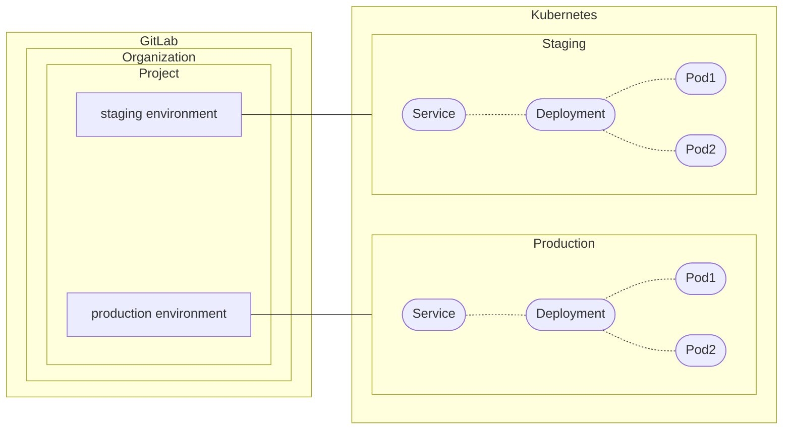
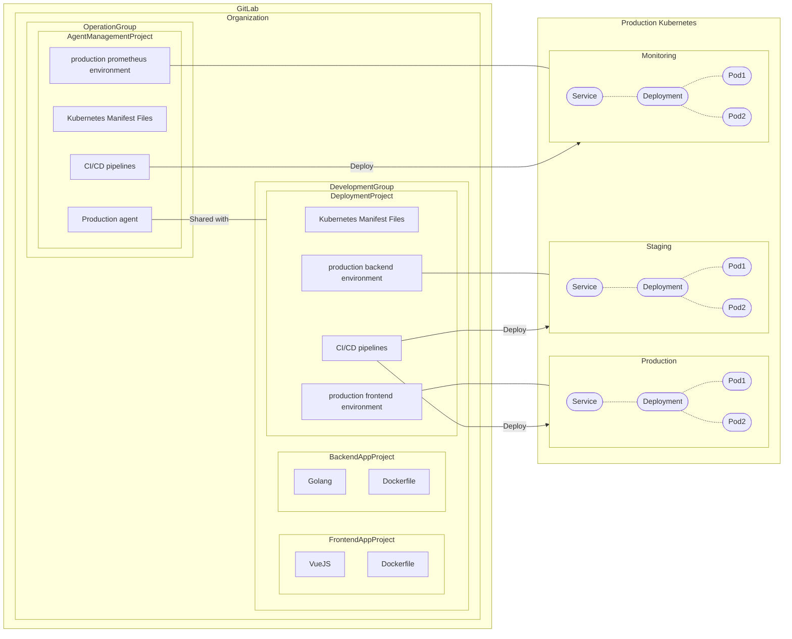
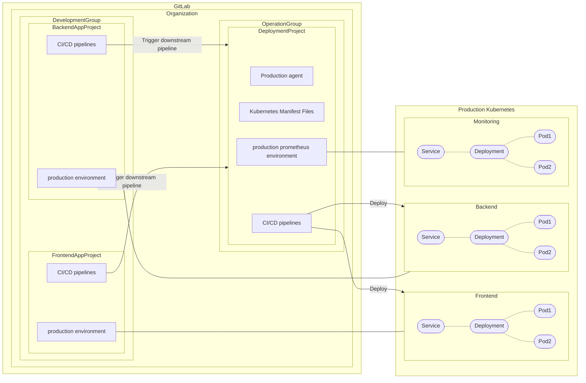




## サマリー

[GitLab Kubernetes Dashboard](https://gitlab.com/groups/gitlab-org/-/epics/2493) エピックの一環として、ユーザーは GitLab agent For Kubernetes によってデプロイされたリソースを表示および管理したいと考えています。ユーザーは Environment のインデックス/詳細ページなどの GitLab UI を通じてリソースと対話できる必要があります。

このブループリントでは、関連付けがどのように確立され、これらのドメインモデルが互いにどのように相互作用するかを説明します。

## 動機

### 目標

- 提案されたアーキテクチャを [GitLab Kubernetes Dashboard](https://gitlab.com/groups/gitlab-org/-/epics/2493) で使用できる。
- 提案されたアーキテクチャを [Organization レベルの Environment ダッシュボード](https://gitlab.com/gitlab-org/gitlab/-/issues/241506)で使用できる。
- クラスターリソースとイベントを [GitLab Environment](https://docs.gitlab.com/ee/ci/environments/index.html) ごとに視覚化できる。デプロイコミットによって直接または間接的に管理されたリソースにスコープされた Environment 固有のビュー。
- GitOps モードと [CI Access モード](https://docs.gitlab.com/ee/user/clusters/agent/ci_cd_workflow.html#authorize-the-agent)の両方をサポートする。

### 対象外

- [GitLab Kubernetes Dashboard](https://gitlab.com/groups/gitlab-org/-/epics/2493) と [Organization レベルの Environment ダッシュボード](https://gitlab.com/gitlab-org/gitlab/-/issues/241506)の設計詳細。
- [保護された Environment](https://docs.gitlab.com/ee/ci/environments/protected_environments.html)、[デプロイ承認](https://docs.gitlab.com/ee/ci/environments/deployment_approvals.html)、[デプロイ安全性](https://docs.gitlab.com/ee/ci/environments/deployment_safety.html)、[Environment ロールバック](https://docs.gitlab.com/ee/ci/environments/index.html#environment-rollback)など、GitLab CI/CD パイプラインに依存する Environment/デプロイ機能のサポート。これらの機能は CI Access モードではすでに利用可能ですが、GitOps モードでは利用できません。

## プロポーザル

### 概要

- GitLab Environment と GitLab agent For Kubernetes は 1 対 1 の関係を持ちます。
- GitLab Environment は接続された [agent](https://docs.gitlab.com/ee/user/clusters/agent/index.html) が作成したすべてのリソースを追跡します。これにはマニフェストファイルに記述されたリソースだけでなく、その後生成されたリソース（例: `Deployment` マニフェストファイルによって作成された `Pod`）も含まれます。
- GitLab Environment は `Deployment` => `ReplicaSet` => `Pod` のような依存関係グラフをレンダリングします。これは ArgoCD スタイルのリソースビューを提供するためです。
- GitLab Environment は `Healthy`、`Progressing`、`Degraded` などのリソースステータスの概要を表す Resource Health ステータスを持ちます。



### 既存のコンポーネントと関係

- [GitLab プロジェクト](https://docs.gitlab.com/ee/user/project/working_with_projects.html)と GitLab Environment は 1 対多の関係を持ちます。
- GitLab プロジェクトと Agent は 1 対多の**直接**関係を持ちます。特定の agent を所有できるプロジェクトは 1 つだけです。
- GitOps モード
  - GitLab プロジェクトと Agent はまだ多対多の**間接**関係を持ちません。これは [Agent 設定プロジェクト外のマニフェストプロジェクト](https://gitlab.com/groups/gitlab-org/-/epics/7704)でサポートされる予定です。
- [CI Access モード](https://docs.gitlab.com/ee/user/clusters/agent/ci_cd_workflow.html#authorize-the-agent)
  - GitLab プロジェクトと Agent は多対多の**間接**関係を持ちます。agent を所有するプロジェクトは[他のプロジェクトとアクセスを共有](https://docs.gitlab.com/ee/user/clusters/agent/ci_cd_workflow.html#authorize-the-agent-to-access-projects-in-your-groups)できます。（注意: 技術的には、ジョブトークン認証のため、プロジェクト内で実行中のジョブのみがクラスターへのアクセスを許可されます。）

### Issues

- GitLab Environment は外部キーとして GitLab agent For Kubernetes の ID を持つべきです。
- GitLab Environment は関連するクラスター内のリソースをグループ化する方法のパラメーター、例えば `namespace`、`label`、`inventory-id`（GitOps モードのみ）を持つべきです。
- GitLab Environment はデフォルトのリソース種類と他の[カスタムリソース](https://kubernetes.io/docs/concepts/extend-kubernetes/api-extension/custom-resources/)を含む、すべての関連リソースをフェッチできる必要があります。
- GitLab Environment は依存関係グラフを認識すべきです。
- GitLab Environment は関連するリソースから Resource Health ステータスを計算できる必要があります。

### 例

これはプッシュベースのデプロイでアーキテクチャがどのように機能するかの例です。この機能は [CI access モード](https://docs.gitlab.com/ee/user/clusters/agent/ci_cd_workflow.html)としてドキュメント化されています。



### 詳細

#### マルチプロジェクトデプロイパイプライン

マイクロサービスプロジェクトのセットアップは[マルチプロジェクトデプロイパイプライン](https://gitlab.com/groups/gitlab-org/-/epics/8483)によって改善できます。

- デプロイメントプロジェクトは上流のアプリケーションプロジェクトと Environment の共有デプロイエンジンとして機能できます。
- Environment はアプリケーションプロジェクト内に作成できます。これにより開発者の Environment への可視性が高まります。
- デプロイメントプロジェクトは Operator グループの下で管理できます。より明確な職務分離。
- ユーザーは [CI/CD ジョブを制限するための RBAC](https://docs.gitlab.com/ee/user/clusters/agent/ci_cd_workflow.html#restrict-project-and-group-access-by-using-impersonation) をセットアップする必要がありません。
- これは[動的 Environment](https://docs.gitlab.com/ee/ci/environments/index.html#create-a-dynamic-environment) に特に役立ちます。



## 設計と実装の詳細

### Environment と Agent の関連付け

ユーザーは設定 UI で GitLab agent For Kubernetes を GitLab Environment に明示的に設定できます。フロントエンドはこの関連付けられた agent を使用して、後述するセクションで説明するユーザーアクセスの認証/認可を行います。

外部プロジェクト（Agent 管理プロジェクトとも呼ばれる）が共有する agent をサポートするために、DeclarativePolicy の `read_cluster_agent` 権限を調整する必要があります。

### `user_access` を通じたリソースのフェッチ

ユーザーが Environment ページを訪問すると、GitLab フロントエンドは GraphQL で Environment をフェッチします。フロントエンドは追加で関連する agent ID と名前空間をフェッチします。

GraphQL クエリの例を示します。

```graphql
{
  project(fullPath: "group/project") {
    id
    environment(name: "<environment-name>") {
      slug
      kubernetesNamespace
      clusterAgent {
        id
        name
        project {
          name
        }
      }
    }
  }
}
```

GitLab フロントエンドは[ブラウザクッキー](https://gitlab.com/gitlab-org/cluster-integration/gitlab-agent/-/blob/master/doc/kubernetes_user_access.md#browser-cookie-on-gitlab-frontend)でユーザーアクセスを認証/認可します。アクセスが禁止されている場合、フロントエンドは `この Environment にデプロイした agent へのアクセス権がありません。agent の設定ファイルの "user_access" で許可されているかどうか、agent 管理者に問い合わせてください。<トラブルシューティングドキュメントリンク>を参照` というエラーメッセージを表示します。

ユーザーが agent へのアクセスを取得したら、GitLab フロントエンドは以下のパラメーターで Kubernetes 内の特定のリソース種類（例: `Deployment`、`Pod`）をフェッチします。

- `namespace` ... `#{environment.kubernetesNamespace}`

リソースが見つからない場合、これはユーザーがリソースにこれらのラベルを埋め込んでいない可能性が高いです。この場合、フロントエンドは `Environment のリソースが見つかりませんでした。リソースに GitLab の予約済みラベルが付いていますか？<トラブルシューティングドキュメントリンク>を参照` という警告メッセージを表示します。

### 依存関係グラフ

- GitLab フロントエンドは [Owner References](https://kubernetes.io/docs/concepts/overview/working-with-objects/owners-dependents/) を使用してリソース間の依存関係を識別します。これらはリソースに `metadata.ownerReferences` フィールドとして埋め込まれます。
- Owner References を持たないリソースの場合、[Well-Known Labels, Annotations and Taints](https://kubernetes.io/docs/reference/labels-annotations-taints/) を補完として使用できます。例えば、`EndpointSlice` は `metadata.ownerReferences` を持ちませんが、親 `Service` リソースへの参照として `kubernetes.io/service-name` を持ちます。

### リソースの Health ステータス

- GitLab フロントエンドはフェッチしたリソースからステータスの概要を計算します。例えば ArgoCD の [Resource Health](https://argo-cd.readthedocs.io/en/stable/operator-manual/health/) に似た `Healthy`、`Progressing`、`Degraded`、`Suspended` などのステータスです。計算式は TBD です。
