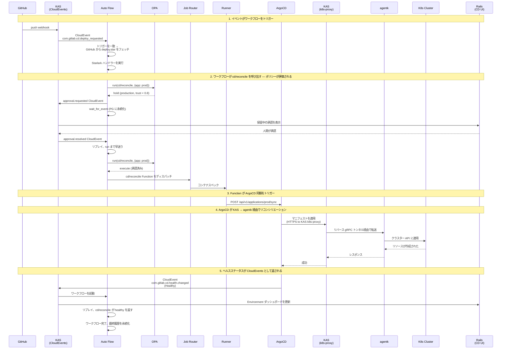




## 概要

この設計は GitLab の継続的デプロイ（CD）プロダクトを説明しています。これはスタンドアロンプロダクトであり、GitLab SCM や CI を必要としませんが、両方が存在する場合はインテグレーションします。

システムは **Auto Flow**（KAS で実行される耐久性のあるワークフローエンジン）の上に構築されています。Auto Flow はデプロイの決定をオーケストレーションします。**GitLab Functions** は Runner でデプロイアクションを実行します。**OPA** はどこで何が実行されるかを管理します。**GitOps リコンサイラー**（ArgoCD がゴールデンパス）はクラスターを望ましい状態に収束させます。KAS を通じて流れる **CloudEvents** がすべてを接続します。

## 問題

GitLab には CD プロダクトがありません。今日私たちが CD と呼ぶものは、`environment:` アノテーションを持つ CI ジョブです。私たち自身の Delivery チームは、gitlab.com のデプロイに私たちのツールよりも ArgoCD を選択しました。CI はオーケストレーションを処理し、ArgoCD はリコンシリエーションを処理し、ArgoCD の UI が運用サーフェスです。その分割は機能しますが、プロダクトではありません。

3 つのものが欠けています。

1. **デプロイエンジンがない。** CI はデプロイスクリプトを実行できますが、リコンシリエーション、ドリフト検出、ヘルスベースの完了、またはライブ状態の概念がありません。デプロイジョブはワークロードが正常なときではなく、スクリプトが 0 で終了したときに成功します。

2. **耐久性のあるオーケストレーションがない。** CD ワークフローは待機します。ソーク期間、デプロイウィンドウ、人間の承認を待ち、最初からやり直さずに失敗を乗り越える必要があります。CI パイプラインはループに人間が入る仕組みがなく、SCM と深く結合しています。GitLab には人間規模の時間にわたるプロセスのための汎用ワークフローエンジンがありません。Auto Flow はこのエンジンになるよう設計されましたが、Temporal への依存や投資不足などにより停滞しました。

3. **AI 駆動のデプロイのためのガバナンスがない。** AI エージェントはデプロイの決定を下す能力が増しています。彼らは現在、CD ワークフローに安全に参加する方法がありません。アイデンティティモデルなし、信頼蓄積なし、エージェントがどの環境で何ができるかを管理するポリシーフレームワークなし。

## アーキテクチャ

### Auto Flow

Auto Flow は KAS のモジュールとして実行される耐久性のあるワークフローエンジンです。ワークフローは任意の Git サーバーからフェッチされた Starlark スクリプトです。3 つのプリミティブ:

- **`run`** — GitLab Function を呼び出す。作業を行う唯一のプリミティブ。すべての呼び出しで OPA ポリシーの対象となる。
- **`sleep`** — ワークフローを一定時間中断する。
- **`wait_for_event`** — 一致する CloudEvent が到着するまで中断する。

Auto Flow は可能な限りメモリ内で実行されます。goroutine は Starlark スクリプトを最初から最後まで実行します。組み込み Functions（`builtin://`）は KAS のインプロセスで実行されます。カタログと Agent Functions はジョブルーター経由で Runner にディスパッチされます。状態は実行されたアクティビティの累積結果であり、各アクティビティの完了は自動的に PostgreSQL に永続化されます。再開時、スクリプトは先頭からリプレイされます。完了したアクティビティは即座にキャッシュされた結果を返します。スクリプトは中断した場所まで早送りされます。

Auto Flow はトリガー登録を所有します。トリガーはCloudEvent タイプ（オプションのフィルター付き）をワークフロー定義（Git URL、パス、ref、認証情報）にバインドします。一致するイベントが KAS に到着すると、Auto Flow はスクリプトをフェッチし、ロードし、一致する `on_event` ハンドラーを実行します。トリガーは Auto Flow の API を通じて作成されます。Rails の CD UI はクライアントの 1 つですが、将来の Auto Flow コンシューマーも同じ API でトリガーを登録できます。

Auto Flow は CD 固有ではありません。それは汎用の耐久性のあるワークフローエンジンです。CD はその上に構築された最初のプロダクトです。

Argo Rollouts を使用した MVC デプロイパスは [Kubernetes Deployment via Argo Rollouts](argo_rollouts_mvc.md) サブドキュメントで説明されています。

### Functions

ワークフロー内のすべての作業は `run` を介した Function の呼び出しです。Functions は既存の GitLab Functions テクノロジーで、バージョン管理されており、宣言された入力と出力を持ち、Step Runner によって Runner で実行されます。今日 CI ジョブが参照するのと同じ方法で Git URL とバージョンで参照されます。

3 つの Functions ソース:

- **組み込み**（`builtin://`）— KAS が提供し、インプロセスで実行されます。イベントの送信などの軽量操作。
- **コンポーネントカタログ** — 再利用のための公開済み Functions。リコンシリエーション、メトリクス、コンプライアンス用の CD 固有の Functions。また顧客が公開した Functions も含まれます。
- **AI カタログ** — Agent Functions。同じディスパッチモデル、異なるカタログソース。信頼スコアと認証はここに存在します。

Functions はジョブルーター経由で Runner にディスパッチされます。CI と CD で同じパスです。Runner はソースを知りません。KAS 認証はプラグ可能です（CI の場合は GitLab Rails、スタンドアロン CD の場合は OIDC または静的トークン）。そのため、Runner は CI ランナー登録なしに CD システムにアタッチできます。

### ポリシー

OPA はすべての `run` 呼び出しを評価します。ポリシー入力には以下が含まれます。

- **Function アイデンティティ** — `run` 呼び出しからの参照と入力
- **信頼スコア** — Function がそこに登録されている場合、コンポーネントカタログまたは AI カタログから
- **環境** — CD 設定から、呼び出しコンテキストによって解決される
- **呼び出し元** — ワークフローアイデンティティ、トリガーソース、イニシエーター

ポリシーは **execute**、**hold**、または **reject** を返します。

```rego
package gitlab.functions

default decision := "execute"

decision := "hold" {
    input.environment.tier == "production"
    input.function.trust_score < 0.8
}

decision := "reject" {
    input.environment.tier == "production"
    in_change_freeze(input)
    not input.caller.emergency_bypass
}
```

Execute は直接進みます。Reject は Starlark スクリプトにエラーを返します。Hold は `approval.requested` CloudEvent を発行し、ワークフローは `wait_for_event` に入ります（スクリプトに対して透過的です）。人間または信頼されたエージェントから承認が到着すると、Function がディスパッチされます。ワークフローの作者は、どのポリシーが適用されるかに関わらず同じコードを書きます。

OPA は GitLab 全体の Function 実行のためのポリシーエンジンです。CD はデプロイガバナンスポリシーを書きます。CI はパイプラインセキュリティポリシーを書けます。異なるルール、同じフレームワーク。

ポリシールールはバージョン管理されてレビューされます。Git は 1 つのソースであり、バージョン管理されていて MR でレビューできます。OCI ポリシーバンドルは別のソースであり、署名をサポートしており、Git だけよりも強い整合性保証を提供し、GitLab レジストリはすでに OCI メディアタイプをサポートしています。環境設定（ティア、リスクレベル、ラベル）は CD API を通じて管理され、CD 独自のテーブルに保存されます。信頼スコアはカタログに存在します。これらすべてがデータとして OPA に供給されます。

### 環境

環境は名前付きポリシースコープです。ティア（production、staging、development）、リスクレベル、ラベル、および関連するデプロイターゲットを持ちます。環境は CD が所有するコアドメインオブジェクトです。

Function がデプロイワークフローのコンテキストで実行されると、環境はどのポリシーが適用されるかを決定します。「Production は信頼スコアが 0.8 未満の AI エージェントが呼び出した Functions の承認を必要とする」は、環境プロパティを参照するポリシールールです。

環境は Rails の CD API を通じて管理され、CD テーブルに保存されます。Auto Flow は環境が何かを知りません。OPA は環境プロパティをデータとして評価します。

### リコンシリエーション

GitOps リコンサイラーはクラスターを宣言的な望ましい状態に収束させます。Git、OCI、またはその他のサポートされたオリジンから取得されます。ArgoCD がゴールデンパスです。リコンサイラーは Auto Flow の一部ではなく、CD Functions が対話するデプロイターゲットです。

CD Functions はリコンサイラーをトリガーし、ヘルスを照会し、差分をプレビューし、ロールバックを開始します。これらの Functions はコンポーネントカタログで公開されています。リコンサイラーの API を呼び出します。リコンサイラーは KAS を通じて流れる CloudEvents でステータスをレポートします。異なるリコンサイラー（Flux またはカスタム）は異なる Function 実装を意味します。ワークフローは変わりません。

ArgoCD は KAS の k8s プロキシを通じてリモートクラスターに接続し、agentk が透過的な Kubernetes API ブリッジを提供します。ArgoCD は KAS が存在することを知りません。

### CloudEvents

KAS がイベントバスです。イベントは Rails、ArgoCD、agentk、agentw、外部 Webhook（GitHub、Jenkins、任意の CI システム）から流れ込みます。イベントは Auto Flow（トリガーとウェイクアップ）と Rails（ダッシュボードの更新）に流れ出ます。

CloudEvents は CI が CD とインテグレーションする方法です。CI パイプラインが完了すると → CloudEvent → Auto Flow トリガー → デプロイワークフローが実行されます。共有ワークフローエンジンは必要ありません。イベントがインテグレーションポイントです。

### Rails における CD

CD プロダクトサーフェスは Rails の Organization レベルの UI です。CD としてラベルされたワークフロー実行のために gRPC で Auto Flow を照会します。環境設定のために独自のテーブルを読みます。信頼スコアのためにカタログデータを読みます。これらのソースからビューを組み立てます。

- **Environment ダッシュボード** — どこに何がデプロイされているか、ヘルス状態、ドリフトステータス。CloudEvents からのライブ更新。
- **ワークフロー実行** — アクティブなデプロイ、その履歴、決定の証跡。Auto Flow から。
- **承認** — コンテキスト付きの保留中の決定、承認/拒否。Auto Flow に書き戻す。
- **コンプライアンス** — フレームワーク、環境、期間別の監査証跡。ワークフロー履歴から。
- **信頼** — エージェントのアクティビティ、信頼スコア、認証ステータス。AI カタログから。

CD 設定（環境、トリガー、ポリシー参照）は Rails を通じて管理され、CD テーブルに保存されます。トリガーの作成は Auto Flow の API を呼び出します。環境データはポリシーデータとして OPA にロードされます。

## 例: カナリアから本番へ

```python
# deploy.star — KAS が任意の Git サーバーからフェッチ

def canary_to_production(w, ev):
    service = ev["data"]["service"]
    version = ev["data"]["version"]

    # カナリアをデプロイ。Runner にディスパッチ。
    w.run(step="gitlab.com/cd/reconcile@v1", inputs={
        "app": "%s-canary" % service,
        "revision": version,
        "wait_healthy": True,
    })

    # ソーク。
    w.sleep(minutes=30)

    # カナリアのヘルスを確認。Runner にディスパッチ。
    metrics = w.run(step="gitlab.com/cd/metrics-query@v1", inputs={
        "query": "rate(http_errors_total{service='%s',canary='true'}[10m])" % service,
        "threshold": 0.01,
    })
    if metrics["breached"]:
        w.run(step="gitlab.com/cd/rollback@v1", inputs={"app": "%s-canary" % service})
        return

    # 本番にプロモート。Runner にディスパッチ。
    # この環境でポリシーが "hold" と言う場合、ワークフローは
    # 承認が到着するまで透過的に中断されます。
    w.run(step="gitlab.com/cd/reconcile@v1", inputs={
        "app": "%s-production" % service,
        "revision": version,
        "wait_healthy": True,
    })

on_event(type="com.gitlab.cd.deploy_requested", handler=canary_to_production)
```

このワークフローには 4 つのアクティビティがあります。Runner にディスパッチする 2 つの `run` 呼び出し、1 つの `sleep`、および本番 `run` での潜在的なポリシーホールドです。各完了後に状態が永続化されます。ポリシーが自動承認する場合、2 番目のリコンシリエーションは即座にディスパッチされます。ポリシーが保留する場合、ワークフローは中断されます。スクリプトはそれを知らず、気にしません。`run` を呼び出し、最終的に結果を得ます。

## 構築が必要なもの

| コンポーネント | ステータス |
|---|---|
| **Auto Flow リプレイエンジン** | 新規。Temporal を置き換える。PostgreSQL バックドのアクティビティ履歴、リプレイ/再開ライフサイクル、タイマーサービス。コアビルド。 |
| **Auto Flow トリガー登録** | 新規。CloudEvent タイプをワークフロー定義にバインドする API。 |
| **Auto Flow スクリプトフェッチ** | 新規。KAS が HTTPS/SSH で任意の Git サーバーから Starlark をフェッチ。 |
| **KAS の Starlark インタープリター** | 既存（AutoFlow PoC）。`run`、`sleep`、`wait_for_event` で拡張。 |
| **KAS の CloudEvent ルーティング** | 部分的に存在（AutoFlow PoC、Rails → KAS パス）。ArgoCD、agentk、外部 Webhook で拡張。 |
| **KAS の OPA インテグレーション** | 新規。組み込み OPA がすべての `run` でポリシーを評価。 |
| **ジョブルーター** | 構築中（ジョブルーターブループリント）。Auto Flow からのディスパッチを受け入れるよう拡張。 |
| **KAS プラグ可能認証** | 新規。OIDC、静的トークン、Vault 用の go-plugin インターフェース。 |
| **K8s プロキシ強化** | 既存。ArgoCD 用のパスベースのルーティングとウォッチストリームの信頼性が必要。 |
| **CD Functions** | 新規。`cd/reconcile`、`cd/metrics-query`、`cd/rollback`、`cd/compliance` など。コンポーネントカタログで公開。 |
| **Rails の CD テーブル** | 新規。環境、ポリシー参照、デプロイターゲットマッピング。 |
| **Rails の CD UI** | 新規。Organization レベルのダッシュボード、承認、コンプライアンス、信頼の視覚化。 |
| **カタログの信頼スコア** | 新規。コンポーネントカタログと AI カタログの Function/エージェントごとのスコープ別スコア。 |
| **Runner** | 既存。変更なし — 新しいジョブソースは透過的。 |
| **ArgoCD** | 外部、変更なし。K8s プロキシと CloudEvents で接続。 |
| **PostgreSQL** | 既存。Auto Flow 状態と CD 設定のための新しいテーブル。 |

## シーケンス



## オープンクエスチョン

**ワークフローのシリアライゼーション。** GitLab Delivery は環境ごとに 1 つのアクティブなデプロイが必要です（CI の `resource_group` が解決するのと同じ問題）。Auto Flow には同等のものが必要です。環境またはカスタムキーでスコープされたワークフロー実行の並行制約。

**スタンドアロンデプロイトポロジー。** SCM なしで GitLab CD を購入する顧客のために: 正確に何をデプロイしますか？KAS、PostgreSQL、Runner、ArgoCD、Rails CD UI — ただし Gitaly なし、Sidekiq なし？最小フットプリントを指定する必要があります。

**リプレイエンジンの正確性。** Starlark リプレイは決定論を必要とします。非決定論的なもの（クロックアクセス、RNG など）はすべて、結果が永続化されてリプレイされるアクティビティです。リプレイのセマンティクスは形式的な仕様と徹底的なテストが必要です。

**ビジュアルデプロイキャンバス。** プロダクト要件はデプロイワークフローを生成するビジュアルエディターを説明しています。このキャンバスは Starlark を生成します。キャンバスの設計とリポジトリ分析から `deploy.star` を生成する Duo AI のインテグレーションは別の設計作業が必要です。
