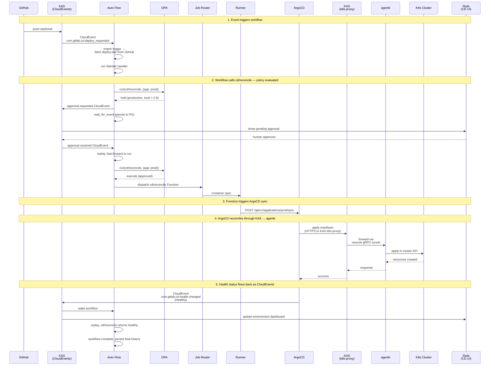



## 概要

この設計は、GitLab の継続的デプロイメント（Continuous Deployment）製品について記述します。これはスタンドアロンの製品であり、GitLab SCM や CI を必要としません。ただし、どちらかが存在する場合はそれらと統合します。

このシステムは、KAS 上で動作する耐久性のあるワークフローエンジン **Auto Flow** をベースに構築されています。Auto Flow はデプロイメントの判断をオーケストレーションします。**GitLab Functions** は Runner 上でデプロイメントアクションを実行します。**OPA** は何をどこで実行するかを統制します。**GitOps リコンサイラー**（ゴールデンパスは ArgoCD）はクラスターを望ましい状態へと収束させます。KAS を流れる **CloudEvents** がすべてを接続します。

## 課題

GitLab には CD 製品がありません。今日 CD と呼んでいるものは、`environment:` アノテーションが付いた CI ジョブです。私たち自身の Delivery チームは、gitlab.com のデプロイに私たちのツールではなく ArgoCD を選びました。CI がオーケストレーションを担い、ArgoCD がリコンサイルを担い、ArgoCD の UI が運用上のサーフェスになっています。この分担は機能しますが、製品ではありません。

3 つのものが欠けています。

1. **デプロイメントエンジンがない。** CI はデプロイメントスクリプトを実行できますが、リコンサイル、ドリフト検出、ヘルスベースの完了判定、ライブ状態という概念を持ちません。デプロイメントジョブは、ワークロードが正常になったときではなく、スクリプトが 0 で終了したときに成功します。

2. **耐久性のあるオーケストレーションがない。** CD ワークフローは待機します。ソーク期間、デプロイメントウィンドウ、人による承認のために待ち、そして最初からやり直すことなく障害を生き延びる必要があります。CI パイプラインには human-in-the-loop の仕組みがなく、SCM と深く結合しています。GitLab には、人間のスケールの時間にまたがるプロセスのための汎用ワークフローエンジンがありません。Auto Flow はまさにこのエンジンとして設計されましたが、停滞しました。一部は Temporal への依存のため、一部は投資の不足のためです。

3. **AI 駆動のデプロイメントに対する統制がない。** AI エージェントは、デプロイメントの判断を下す能力をますます高めています。これらは現在、CD ワークフローに安全に参加する手段を持っていません。アイデンティティモデルも、信頼の蓄積も、エージェントがどの環境で何をできるかを統制するポリシーフレームワークもありません。

## アーキテクチャ

### Auto Flow

Auto Flow は、KAS のモジュールとして動作する耐久性のあるワークフローエンジンです。ワークフローは、任意の Git サーバーから取得される Starlark スクリプトです。3 つのプリミティブがあります。

- **`run`** — GitLab Function を呼び出します。実際の作業を行う唯一のプリミティブです。呼び出しのたびに OPA ポリシーの対象となります。
- **`sleep`** — ワークフローを一定時間サスペンドします。
- **`wait_for_event`** — 一致する CloudEvent が到着するまでサスペンドします。

Auto Flow は可能な限りインメモリで実行します。1 つの goroutine が Starlark スクリプトを最初から最後まで実行します。組み込み Functions（`builtin://`）は KAS 内のプロセス内で実行されます。Catalog Functions と Agent Functions は、Job Router 経由で Runner にディスパッチされます。状態とは、実行されたアクティビティの累積された結果です。各アクティビティの完了は自動的に PostgreSQL に永続化されます。再開時には、スクリプトは先頭から再生されます。完了したアクティビティはキャッシュされた結果を即座に返します。スクリプトは中断したところまで早送りされます。

Auto Flow はトリガーの登録を所有します。トリガーは、CloudEvent タイプ（オプションのフィルター付き）をワークフロー定義（Git URL、パス、ref、認証情報）にバインドします。一致するイベントが KAS に到着すると、Auto Flow はスクリプトを取得し、ロードし、一致する `on_event` ハンドラーを実行します。トリガーは Auto Flow の API を通じて作成されます。Rails の CD UI はそのクライアントの 1 つですが、将来の Auto Flow コンシューマーはどれも同じ API を通じてトリガーを登録できます。

Auto Flow は CD 専用ではありません。これは汎用の耐久性のあるワークフローエンジンです。CD はその上に構築される最初の製品です。

デプロイメント実行レイヤー（Deploy Driver、パイプライン設定、Argo Rollouts Beta）は、サブドキュメント [GitLab CD: デプロイメント実行](cd_execution.md) で記述します。

### Functions

ワークフロー内のすべての作業は、`run` を介した Function の呼び出しです。Functions は既存の GitLab Functions テクノロジーであり、バージョン管理され、入力と出力が宣言され、Step Runner によって Runner 上で実行されます。これらは Git URL とバージョンによって参照されます。今日 CI ジョブが Functions を参照するのと同じ方法です。

Functions には 3 つのソースがあります。

- **組み込み**（`builtin://`）— KAS が提供し、プロセス内で実行されます。イベント送信のような軽量な操作です。
- **Component Catalog** — 再利用のために公開された Functions。リコンサイル、メトリクス、コンプライアンスのための CD 固有の Functions。顧客が公開した Functions も含みます。
- **AI Catalog** — Agent Functions。同じディスパッチモデルですが、カタログのソースが異なります。信頼スコアと認証はここに存在します。

Functions は Job Router を通じて Runner にディスパッチされます。CI と CD で同じ経路です。Runner はソースを知りません。KAS の認証はプラガブルなので（CI には GitLab Rails、スタンドアロン CD には OIDC または静的トークン）、Runner は CI runner の登録なしに CD システムにアタッチできます。

### ポリシー

OPA はすべての `run` 呼び出しを評価します。ポリシーの入力には次が含まれます。

- **Function アイデンティティ** — `run` 呼び出しからの参照と入力
- **信頼スコア** — Function が登録されていれば、Component Catalog または AI Catalog から
- **環境** — CD 設定から、呼び出しのコンテキストによって解決される
- **呼び出し元** — ワークフローアイデンティティ、トリガーソース、開始者

ポリシーは **execute**、**hold**、**reject** のいずれかを返します。

```rego
package gitlab.functions

default decision := "execute"

decision := "hold" {
    input.environment.tier == "production"
    input.function.trust_score < 0.8
}

decision := "reject" {
    input.environment.tier == "production"
    in_change_freeze(input)
    not input.caller.emergency_bypass
}
```

Execute は直接進行します。Reject は Starlark スクリプトにエラーを返します。Hold は `approval.requested` CloudEvent を発行し、ワークフローは `wait_for_event` に入ります。これはスクリプトからは透過的です。人間または信頼されたエージェントから承認が到着すると、Function がディスパッチされます。ワークフローの作成者は、どのポリシーが適用されるかにかかわらず、同じコードを書きます。

OPA は、GitLab 全体にわたる Function 実行のためのポリシーエンジンです。CD はデプロイメント統制ポリシーを書きます。CI はパイプラインセキュリティポリシーを書けます。異なるルール、同じフレームワークです。

ポリシールールはバージョン管理されレビューされます。Git はソースの 1 つで、バージョン管理され MR でレビューできます。OCI ポリシーバンドルはもう 1 つのソースで、署名を標準でサポートし、Git 単独よりも強い整合性保証を提供します。また GitLab Registry はすでに OCI メディアタイプをサポートしています。環境設定（tier、リスクレベル、ラベル）は CD API を通じて管理され、CD 独自のテーブルに保存されます。信頼スコアはカタログに存在します。これらすべてがデータとして OPA に供給されます。

### 環境

環境とは、名前付きのポリシースコープです。tier（production、staging、development）、リスクレベル、ラベル、関連するデプロイメントターゲットを持ちます。環境は CD が所有する中核のドメインオブジェクトです。

Function がデプロイメントワークフローのコンテキストで実行されると、環境がどのポリシーを適用するかを決定します。「Production では、信頼が 0.8 未満の AI エージェントが呼び出す Function には承認が必要」— これは環境のプロパティを参照するポリシールールです。

環境は Rails の CD API を通じて管理され、CD テーブルに保存されます。Auto Flow は環境が何であるかを知りません。OPA は環境のプロパティをデータとして評価します。

### リコンサイル

GitOps リコンサイラーは、クラスターを宣言的な望ましい状態へと収束させます。状態のソースは Git、OCI、またはその他のサポートされる任意のオリジンです。ArgoCD はゴールデンパスです。リコンサイラーは Auto Flow の一部ではありません。これは CD Functions がやり取りするデプロイメントターゲットです。

CD Functions はリコンサイラーをトリガーし、ヘルスをクエリし、差分をプレビューし、ロールバックを開始します。これらの Functions は Component Catalog で公開されます。これらはリコンサイラーの API を呼び出します。リコンサイラーは KAS を流れる CloudEvents を通じてステータスを報告します。異なるリコンサイラー（Flux やカスタムのもの）は、異なる Function 実装を意味します。ワークフローは変わりません。

ArgoCD は KAS の k8s-proxy を通じてリモートクラスターに接続します。そこでは agentk が透過的な Kubernetes API ブリッジを提供します。ArgoCD は KAS の存在を知りません。

### CloudEvents

KAS はイベントバスです。イベントは Rails、ArgoCD、agentk、agentw、外部 Webhook（GitHub、Jenkins、任意の CI システム）から流入します。イベントは Auto Flow（トリガーとウェイクアップ）と Rails（ダッシュボードの更新）へと流出します。

CloudEvents は CI が CD と統合する方法です。CI パイプラインが完了する → CloudEvent → Auto Flow トリガー → デプロイメントワークフローが実行される。共有のワークフローエンジンは不要です。イベントが統合ポイントです。

### GitLab Rails 内の CD

CD 製品のサーフェスは、Rails の組織レベルの UI です。CD としてラベル付けされたワークフロー実行を gRPC 経由で Auto Flow にクエリします。環境設定のために自身のテーブルを読み取ります。信頼スコアのためにカタログデータを読み取ります。これらのソースからビューを組み立てます。

- **環境ダッシュボード** — 何がどこにデプロイされているか、ヘルス状態、ドリフトステータス。CloudEvents からのライブ更新。
- **ワークフロー実行** — アクティブなデプロイメント、その履歴、判断の経緯。Auto Flow から。
- **承認** — コンテキスト付きの保留中の判断、承認/拒否。Auto Flow に書き戻されます。
- **コンプライアンス** — フレームワーク、環境、期間別の監査証跡。ワークフロー履歴から。
- **信頼** — エージェントのアクティビティ、信頼スコア、認証ステータス。AI Catalog から。

CD 設定（環境、トリガー、ポリシー参照）は Rails を通じて管理され、CD テーブルに保存されます。トリガーの作成は Auto Flow の API を呼び出します。環境データはポリシーデータとして OPA にロードされます。

Rails のドメインモデル、API、永続化、ライフサイクルは、サブドキュメント [GitLab CD: Rails](rails.md) で記述します。

## 例: カナリアから Production へ

```python
# deploy.star — 任意の Git サーバーから KAS が取得する

def canary_to_production(w, ev):
    service = ev["data"]["service"]
    version = ev["data"]["version"]

    # Deploy canary. Dispatches to Runner.
    w.run(step="gitlab.com/cd/reconcile@v1", inputs={
        "app": "%s-canary" % service,
        "revision": version,
        "wait_healthy": True,
    })

    # Soak.
    w.sleep(minutes=30)

    # Check canary health. Dispatches to Runner.
    metrics = w.run(step="gitlab.com/cd/metrics-query@v1", inputs={
        "query": "rate(http_errors_total{service='%s',canary='true'}[10m])" % service,
        "threshold": 0.01,
    })
    if metrics["breached"]:
        w.run(step="gitlab.com/cd/rollback@v1", inputs={"app": "%s-canary" % service})
        return

    # Promote to production. Dispatches to Runner.
    # If policy says "hold" for this environment, the workflow
    # transparently suspends until approval arrives.
    w.run(step="gitlab.com/cd/reconcile@v1", inputs={
        "app": "%s-production" % service,
        "revision": version,
        "wait_healthy": True,
    })

on_event(type="com.gitlab.cd.deploy_requested", handler=canary_to_production)
```

このワークフローには 4 つのアクティビティがあります。Runner にディスパッチする 2 つの `run` 呼び出し、1 つの `sleep`、そして production の `run` における潜在的なポリシー hold です。状態は各完了後に永続化されます。ポリシーが自動承認すれば、2 つ目の reconcile は即座にディスパッチされます。ポリシーが hold すれば、ワークフローはサスペンドされます。スクリプトはそれを知らず、気にもしません。`run` を呼び出し、やがて結果が返ってくるだけです。

## 構築が必要なもの

| コンポーネント | ステータス |
|---|---|
| **Auto Flow リプレイエンジン** | 新規。Temporal を置き換え。PostgreSQL ベースのアクティビティ履歴、リプレイ/再開ライフサイクル、タイマーサービス。中核の構築。 |
| **Auto Flow トリガー登録** | 新規。CloudEvent タイプをワークフロー定義にバインドする API。 |
| **Auto Flow スクリプト取得** | 新規。KAS が HTTPS/SSH 経由で任意の Git サーバーから Starlark を取得。 |
| **KAS 内の Starlark インタープリター** | 存在（AutoFlow PoC）。`run`、`sleep`、`wait_for_event` で拡張。 |
| **KAS 内の CloudEvent ルーティング** | 部分的に存在（AutoFlow PoC、Rails → KAS 経路）。ArgoCD、agentk、外部 Webhook で拡張。 |
| **KAS 内の OPA 統合** | 新規。埋め込み OPA がすべての `run` でポリシーを評価。 |
| **Job Router** | 構築中（Job Router ブループリント）。Auto Flow からのディスパッチを受け付けるよう拡張。 |
| **KAS プラガブル認証** | 新規。OIDC、静的トークン、Vault のための go-plugin インターフェース。 |
| **K8s プロキシの拡張** | 存在。ArgoCD のためのパスベースのルーティングと watch ストリームの信頼性が必要。 |
| **CD Functions** | 新規。`cd/reconcile`、`cd/metrics-query`、`cd/rollback`、`cd/compliance` など。Component Catalog で公開。 |
| **Rails 内の CD テーブル** | 新規。環境、ポリシー参照、デプロイメントターゲットのマッピング。 |
| **Rails 内の CD UI** | 新規。組織レベルのダッシュボード、承認、コンプライアンス、信頼の可視化。 |
| **カタログ内の信頼スコア** | 新規。Component Catalog と AI Catalog における Function/エージェントごと・スコープごとのスコア。 |
| **Runner** | 存在。変更なし。新しいジョブソースは透過的。 |
| **ArgoCD** | 外部、変更なし。K8s プロキシと CloudEvents 経由で接続。 |
| **PostgreSQL** | 存在。Auto Flow 状態と CD 設定のための新しいテーブル。 |

## シーケンス



## 未解決の問い

**ワークフローの直列化。** GitLab Delivery では、1 つの環境につき一度に 1 つのアクティブなデプロイメントが必要です（CI の `resource_group` が解決するのと同じ問題です）。Auto Flow にはそれに相当するもの、つまり環境またはカスタムキーでスコープされたワークフロー実行の並行性制約が必要です。

**スタンドアロンのデプロイメントトポロジー。** SCM なしで GitLab CD を購入する顧客の場合、彼らは正確に何をデプロイするのでしょうか。KAS、PostgreSQL、Runner、ArgoCD、そして Rails の CD UI、しかし Gitaly はなく、Sidekiq もない? 最小フットプリントを規定する必要があります。

**リプレイエンジンの正しさ。** Starlark のリプレイには決定論性が必要です。非決定論的なもの（クロックへのアクセス、RNG など）はすべて、結果が永続化されリプレイされるアクティビティです。リプレイのセマンティクスには形式的な仕様と徹底的なテストが必要です。

**ビジュアルデプロイメントキャンバス。** 製品要件では、デプロイメントワークフローを生成するビジュアルエディターが記述されています。このキャンバスは Starlark を生成します。キャンバスの設計と、リポジトリ分析から `deploy.star` を生成するための Duo AI 統合は、別個の設計作業が必要です。
