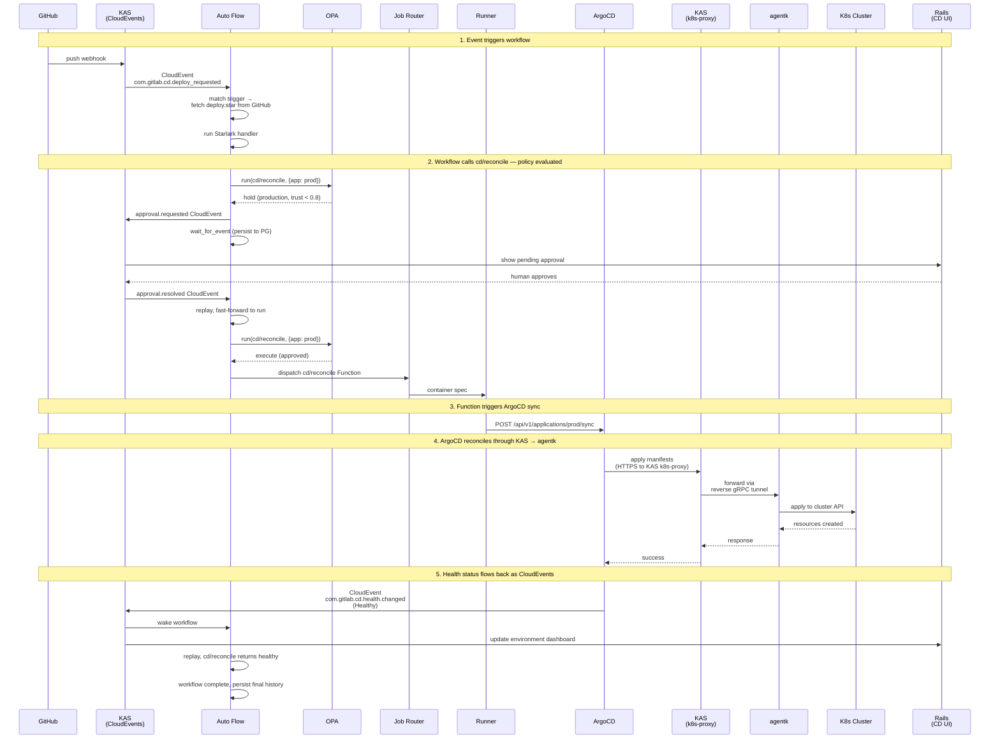



## 概要 {#overview}

この設計は GitLab の継続的デプロイ（CD）プロダクトを説明しています。これはスタンドアロンプロダクトであり、GitLab SCM や CI を必要としませんが、両方が存在する場合はインテグレーションします。

システムは **Auto Flow**（KAS で実行される耐久性のあるワークフローエンジン）の上に構築されています。Auto Flow はデプロイの決定をオーケストレーションします。**GitLab Functions** は Runner でデプロイアクションを実行します。**OPA** はどこで何が実行されるかを管理します。**GitOps リコンサイラー**（ArgoCD がゴールデンパス）はクラスターを望ましい状態に収束させます。KAS を通じて流れる **CloudEvents** がすべてを接続します。

## 課題 {#the-problem}

GitLab には CD プロダクトがありません。今日私たちが CD と呼んでいるものは、`environment:` アノテーションを持つ CI ジョブです。私たち自身の Delivery チームは、gitlab.com をデプロイするために、私たちのツールよりも ArgoCD を選びました — CI がオーケストレーションを処理し、ArgoCD がリコンシリエーションを処理し、ArgoCD の UI が運用上の画面となっています。その分担はうまく機能していますが、プロダクトではありません。

3 つのものが欠けています:

1. **デプロイエンジンがない。** CI はデプロイスクリプトを実行できますが、リコンシリエーション、ドリフト検出、ヘルスベースの完了、ライブ状態といった概念を持ちません。デプロイジョブは、ワークロードが健全になったときではなく、スクリプトが 0 で終了したときに成功します。

2. **耐久性のあるオーケストレーションがない。** CD ワークフローは待機します — ソーク期間、デプロイウィンドウ、人間の承認を — そして最初からやり直すことなく障害を乗り越える必要があります。CI パイプラインには human-in-the-loop の仕組みがなく、SCM と深く結合しています。GitLab には、人間のスケールの時間にわたるプロセスのための汎用ワークフローエンジンがありません。Auto Flow はこのエンジンとなるように設計されましたが、停滞しました — 一部は Temporal への依存により、一部は投資の不足により。

3. **AI 駆動のデプロイのためのガバナンスがない。** AI エージェントは、デプロイの決定を下すことにますます長けてきています。それらは現在、CD ワークフローに安全に参加する方法を持っていません — アイデンティティモデルも、信頼の蓄積も、エージェントがどの環境で何ができるかを管理するポリシーフレームワークもありません。

## アーキテクチャ {#architecture}

### Auto Flow {#auto-flow}

Auto Flow は、KAS 内のモジュールとして実行される耐久性のあるワークフローエンジンです。ワークフローは、任意の Git サーバーから取得される Starlark スクリプトです。3 つのプリミティブ:

- **`run`** — GitLab Function を呼び出す。作業を行う唯一のプリミティブ。呼び出しのたびに OPA ポリシーの対象となります。
- **`sleep`** — ワークフローを一定時間サスペンドする。
- **`wait_for_event`** — 一致する CloudEvent が到着するまでサスペンドする。

Auto Flow は可能な限りメモリ内で実行されます。goroutine が Starlark スクリプトを最初から最後まで実行します。組み込み Function（`builtin://`）は KAS 内のプロセス内で実行されます。Catalog および Agent の Function は Job Router を介して Runner にディスパッチされます。状態は、実行されたアクティビティの累積結果です — 各アクティビティの完了は自動的に PostgreSQL に永続化されます。再開時、スクリプトは先頭から再生（replay）されます。完了したアクティビティは、キャッシュされた結果を即座に返します。スクリプトは中断した場所まで早送りされます。

Auto Flow はトリガー登録を所有します。トリガーは、CloudEvent タイプ（オプションのフィルター付き）をワークフロー定義（Git URL、パス、ref、認証情報）にバインドします。一致するイベントが KAS に到着すると、Auto Flow はスクリプトを取得し、ロードし、一致する `on_event` ハンドラーを実行します。トリガーは Auto Flow の API を通じて作成されます — Rails の CD UI は 1 つのクライアントですが、将来の任意の Auto Flow コンシューマーが同じ API を通じてトリガーを登録できます。

Auto Flow は CD 固有ではありません。それは汎用の耐久性のあるワークフローエンジンです。CD は、その上に構築された最初のプロダクトです。

デプロイ実行レイヤー — Deploy Driver、パイプライン設定、Argo Rollouts Beta — は、[GitLab CD: Deployment Execution](cd_execution.md) サブドキュメントで説明されています。

### Functions {#functions}

ワークフロー内のすべての作業は、`run` を介した Function の呼び出しです。Function は既存の GitLab Functions テクノロジーです — バージョン管理され、入力と出力が宣言され、Step Runner によって Runner 上で実行されます。これらは、今日 CI ジョブが Function を参照するのと同じ方法で、Git URL とバージョンによって参照されます。

Function の 3 つのソース:

- **Built-in**（`builtin://`）— KAS が提供し、プロセス内で実行されます。イベント送信のような軽量な操作です。
- **Component Catalog** — 再利用のために公開された Function。リコンシリエーション、メトリクス、コンプライアンスのための CD 固有の Function。顧客が公開した Function も含みます。
- **AI Catalog** — Agent Function。同じディスパッチモデル、異なるカタログソース。信頼スコアと認証はここに存在します。

Function は Job Router を通じて Runner にディスパッチされます — CI と CD で同じパスです。Runner はソースを知りません。KAS の認証はプラガブル（CI には GitLab Rails、スタンドアロン CD には OIDC または静的トークン）であるため、Runner は CI ランナー登録なしで CD システムにアタッチできます。

### ポリシー {#policy}

OPA はすべての `run` 呼び出しを評価します。ポリシーの入力には以下が含まれます:

- **Function アイデンティティ** — `run` 呼び出しからの参照と入力
- **信頼スコア** — Function が登録されている場合、Component Catalog または AI Catalog から
- **環境** — CD 設定から、呼び出しのコンテキストによって解決される
- **呼び出し元** — ワークフローのアイデンティティ、トリガーソース、開始者

ポリシーは **execute**、**hold**、または **reject** を返します。

```rego
package gitlab.functions

default decision := "execute"

decision := "hold" {
    input.environment.tier == "production"
    input.function.trust_score < 0.8
}

decision := "reject" {
    input.environment.tier == "production"
    in_change_freeze(input)
    not input.caller.emergency_bypass
}
```

Execute は直接進行します。Reject は Starlark スクリプトにエラーを返します。Hold は `approval.requested` CloudEvent を発行し、ワークフローは `wait_for_event` に入ります — スクリプトに対して透過的です。人間または信頼されたエージェントから承認が到着すると、Function がディスパッチされます。ワークフローの作者は、どのポリシーが適用されるかに関わらず同じコードを書きます。

OPA は、GitLab 全体での Function 実行のためのポリシーエンジンです。CD はデプロイガバナンスポリシーを書きます。CI はパイプラインセキュリティポリシーを書けます。異なるルール、同じフレームワークです。

ポリシールールはバージョン管理され、レビューされます。Git は 1 つのソースです — バージョン管理され、MR でレビュー可能です。OCI ポリシーバンドルは別のソースです — それらは署名を標準でサポートし、Git 単体よりも強い完全性の保証を提供し、GitLab Registry はすでに OCI メディアタイプをサポートしています。環境設定（ティア、リスクレベル、ラベル）は CD API を通じて管理され、CD 自身のテーブルに格納されます。信頼スコアはカタログに存在します。これらはすべてデータとして OPA に供給されます。

### 環境 {#environments}

環境は名前付きのポリシースコープです。ティア（production、staging、development）、リスクレベル、ラベル、関連するデプロイターゲットを持ちます。環境は CD が所有する中核的なドメインオブジェクトです。

Function がデプロイワークフローのコンテキストで実行されると、環境がどのポリシーを適用するかを決定します。「production は、信頼が 0.8 未満の AI エージェントによって呼び出される Function に対して承認を必要とする」 — これは環境のプロパティを参照するポリシールールです。

環境は Rails の CD API を通じて管理され、CD テーブルに格納されます。Auto Flow は環境が何であるかを知りません。OPA は環境のプロパティをデータとして評価します。

### リコンシリエーション {#reconciliation}

GitOps リコンサイラーは、クラスターを宣言的な望ましい状態に収束させます — ソースは Git、OCI、その他のサポートされる起点です。ArgoCD がゴールデンパスです。リコンサイラーは Auto Flow の一部ではありません — それは CD Function がやり取りするデプロイターゲットです。

CD Function はリコンサイラーをトリガーし、ヘルスをクエリし、差分をプレビューし、ロールバックを開始します。これらの Function は Component Catalog で公開されます。それらはリコンサイラーの API を呼び出します。リコンサイラーは、KAS を通じて流れる CloudEvents を通じてステータスを報告し返します。異なるリコンサイラー（Flux やカスタムのもの）は、異なる Function 実装を意味します。ワークフローは変わりません。

ArgoCD は KAS の k8s-proxy を通じてリモートクラスターに接続し、そこでは agentk が透過的な Kubernetes API ブリッジを提供します。ArgoCD は KAS が存在することを知りません。

### CloudEvents {#cloudevents}

KAS はイベントバスです。イベントは Rails、ArgoCD、agentk、agentw、外部 Webhook（GitHub、Jenkins、任意の CI システム）から流れ込みます。イベントは Auto Flow（トリガーとウェイクアップ）と Rails（ダッシュボード更新）へ流れ出ます。

CloudEvents は、CI が CD とインテグレーションする方法です。CI パイプライン完了 → CloudEvent → Auto Flow トリガー → デプロイワークフロー実行。共有のワークフローエンジンは不要です。イベントがインテグレーションポイントです。

### GitLab Rails における CD {#cd-in-gitlab-rails}

CD プロダクトの画面は、Rails の組織レベルの UI です。これは、CD としてラベル付けされたワークフロー実行を gRPC 経由で Auto Flow にクエリします。環境設定のために自身のテーブルを読み取ります。信頼スコアのためにカタログデータを読み取ります。これらのソースからビューを組み立てます:

- **環境ダッシュボード** — 何がどこにデプロイされているか、ヘルス状態、ドリフトステータス。CloudEvents からのライブ更新。
- **ワークフロー実行** — アクティブなデプロイ、その履歴、決定の証跡。Auto Flow から。
- **承認** — コンテキスト付きの保留中の決定、承認/拒否。Auto Flow へ書き戻します。
- **コンプライアンス** — フレームワーク、環境、期間ごとの監査証跡。ワークフロー履歴から。
- **信頼** — エージェントのアクティビティ、信頼スコア、認証ステータス。AI Catalog から。

CD 設定（環境、トリガー、ポリシー参照）は Rails を通じて管理され、CD テーブルに格納されます。トリガーの作成は Auto Flow の API を呼び出します。環境データはポリシーデータとして OPA にロードされます。

## 例: Canary から Production へ {#example-canary-to-production}

```python
# deploy.star — fetched by KAS from any Git server

def canary_to_production(w, ev):
    service = ev["data"]["service"]
    version = ev["data"]["version"]

    # Deploy canary. Dispatches to Runner.
    w.run(step="gitlab.com/cd/reconcile@v1", inputs={
        "app": "%s-canary" % service,
        "revision": version,
        "wait_healthy": True,
    })

    # Soak.
    w.sleep(minutes=30)

    # Check canary health. Dispatches to Runner.
    metrics = w.run(step="gitlab.com/cd/metrics-query@v1", inputs={
        "query": "rate(http_errors_total{service='%s',canary='true'}[10m])" % service,
        "threshold": 0.01,
    })
    if metrics["breached"]:
        w.run(step="gitlab.com/cd/rollback@v1", inputs={"app": "%s-canary" % service})
        return

    # Promote to production. Dispatches to Runner.
    # If policy says "hold" for this environment, the workflow
    # transparently suspends until approval arrives.
    w.run(step="gitlab.com/cd/reconcile@v1", inputs={
        "app": "%s-production" % service,
        "revision": version,
        "wait_healthy": True,
    })

on_event(type="com.gitlab.cd.deploy_requested", handler=canary_to_production)
```

このワークフローには 4 つのアクティビティがあります: Runner にディスパッチする 2 つの `run` 呼び出し、1 つの `sleep`、そして production の `run` での潜在的なポリシー hold です。状態は各々の完了後に永続化されます。ポリシーが自動承認すれば、2 つ目のリコンサイルは即座にディスパッチされます。ポリシーが hold すれば、ワークフローはサスペンドします — スクリプトはそれを知らず、気にもしません。それは `run` を呼び出し、最終的に結果を受け取り返します。

## 構築が必要なもの {#what-needs-to-be-built}

| Component | Status |
|---|---|
| **Auto Flow replay engine** | New. Replaces Temporal. PostgreSQL-backed activity history, replay/resume lifecycle, timer service. Core build. |
| **Auto Flow trigger registration** | New. API for binding CloudEvent types to workflow definitions. |
| **Auto Flow script fetching** | New. KAS fetches Starlark from any Git server via HTTPS/SSH. |
| **Starlark interpreter in KAS** | Exists (AutoFlow PoC). Extend with `run`, `sleep`, `wait_for_event`. |
| **CloudEvent routing in KAS** | Partially exists (AutoFlow PoC, Rails → KAS path). Extend with ArgoCD, agentk, external webhooks. |
| **OPA integration in KAS** | New. Embedded OPA evaluates policy on every `run`. |
| **Job Router** | Being built (Job Router blueprint). Extend to accept dispatches from Auto Flow. |
| **KAS pluggable auth** | New. go-plugin interface for OIDC, static tokens, Vault. |
| **K8s proxy enhancements** | Exists. Needs path-based routing and watch stream reliability for ArgoCD. |
| **CD Functions** | New. `cd/reconcile`, `cd/metrics-query`, `cd/rollback`, `cd/compliance`, etc. Published in Component Catalog. |
| **CD tables in Rails** | New. Environments, policy references, deployment target mappings. |
| **CD UI in Rails** | New. Organization-level dashboard, approvals, compliance, trust visualization. |
| **Trust scores in catalogs** | New. Per-function/agent per-scope scores in Component Catalog and AI Catalog. |
| **Runner** | Exists. No changes — new job source is transparent. |
| **ArgoCD** | External, unchanged. Connected via K8s proxy and CloudEvents. |
| **PostgreSQL** | Exists. New tables for Auto Flow state and CD configuration. |

## シーケンス {#sequence}



## 未解決の問い {#open-questions}

**ワークフローのシリアライズ。** GitLab Delivery は、環境ごとに一度に 1 つのアクティブなデプロイを必要とします（CI の `resource_group` が解決するのと同じ問題です）。Auto Flow には同等のものが必要です — 環境またはカスタムキーでスコープされた、ワークフロー実行に対する並行性の制約です。

**スタンドアロンのデプロイトポロジー。** SCM なしで GitLab CD を購入する顧客にとって: 彼らは正確に何をデプロイするのでしょうか? KAS、PostgreSQL、Runner、ArgoCD、そして Rails の CD UI — しかし Gitaly も Sidekiq もなし? 最小限のフットプリントを仕様化する必要があります。

**replay エンジンの正しさ。** Starlark の replay は決定論を必要とします。決定論的でないもの（クロックアクセス、RNG など）はすべて、結果が永続化され replay されるアクティビティです。replay のセマンティクスは形式的な仕様化と徹底的なテストを必要とします。

**ビジュアルデプロイキャンバス。** プロダクト要件は、デプロイワークフローを生成するビジュアルエディターを記述しています。このキャンバスは Starlark を生成します。キャンバスの設計と、リポジトリ分析から `deploy.star` を生成するための Duo AI インテグレーションは、別個の設計作業を必要とします。
