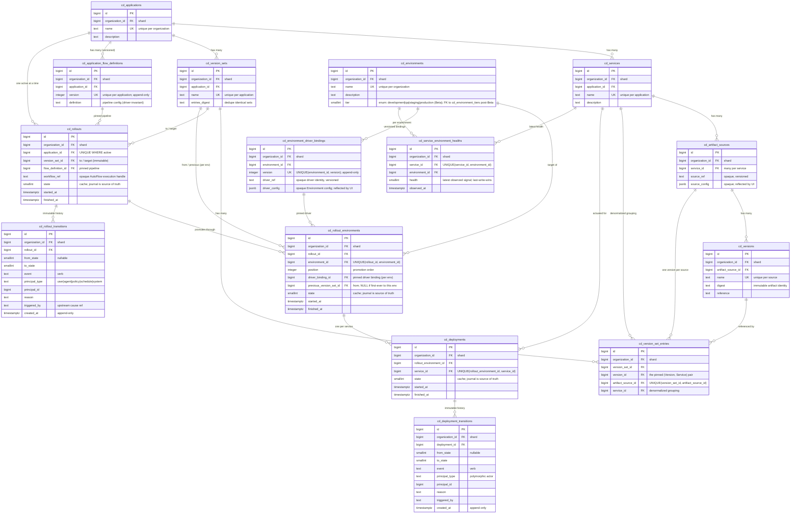

このドキュメントは、[GitLab CD](_index.md) の Rails レイヤーについて記述します。ドメインモデル、API、デプロイメントの永続化とライフサイクル、そしてそれを構成する UI です。Rails はデプロイメントの *データ* を所有します。何を、どこにデプロイしているか、そして何が起きたかの不変な記録です。Rails はデプロイメントを実行せず、デプロイメントがどのように実行されるかを知りません。

その最後の点がすべての肝です。GitLab CD は今日 Kubernetes へ、そして明日には Cloud Run、Lambda、あるいはまだ誰も発明していない何かへとデプロイしなければなりません。GitLab CI でビルドされたアーティファクトから、あるいは ECR、Artifactory、私たちが聞いたこともないレジストリから取得されたアーティファクトから。もし Rails が Kubernetes との通信方法を知っていたり、アーティファクトが GitLab パイプライン由来だと仮定したりしたら、その時点ですでに破綻しています。そこでこの設計は、Rails をその両方について意図的に無知に保ちます。

## スコープ

このドキュメントは次をカバーします。

- CD ドメインエンティティとそれらの関係。
- デプロイメントがどのように構成され、記録され、再現可能にされるか。
- Rollout のライフサイクルと、その状態がどのように追跡され監査されるか。
- GraphQL のサーフェス。

**非要件** — 他のチームと他のドキュメントが所有し、ここではその接合部でのみ参照します。

- 耐久性のあるワークフローエンジン。これは [AutoFlow](https://gitlab.com/groups/gitlab-org/-/work_items/21235) です。
- デプロイメントの *メカニズム* — デプロイを実行する `Starlark` プログラムとその設定スキーマ。これは Deployment Execution チームの Deploy Driver です。
- パイプラインの *データ構造*。これも Deployment Execution です。
- ワークロード定義の内容 — コンテナの引数、メモリ上限、レプリカ数、マニフェスト。これらはドライバーの背後、Rails の外に存在します。
- 認可とポリシー。[GitLab CD auth](https://gitlab.com/gitlab-com/content-sites/handbook/-/merge_requests/19551) ドキュメントで別途カバーされます。
- シークレット。デプロイ時に参照によってライブで解決され、CD によって保存もピン留めもされません。後のドキュメントで扱います。

## 設計原則

3 つの不変条件がここでのすべての判断を駆動します。何かが回りくどく見えるとき、それはほぼ常にこのうちのいずれかが役目を果たしているのです。

1. **デプロイメカニズム非依存。** Rails はデプロイメントがどのように実行されるかに結合してはなりません。`cluster_agent_id` も `platform_type` も Kubernetes 形のカラムもありません。メカニズムは Deploy Driver であり、不透明な参照によってアドレス指定され、不透明な blob によって構成されます。
2. **ソース非依存。** Rails はアーティファクトが GitLab CI 由来だと仮定してはならず、したがって `Project` に結合してはなりません。アーティファクトがどこから来るかは、あらゆる種類のソースを指す不透明なポインターです。
3. **Rollout の不変性。** Rollout は再現可能なスナップショットです。すべての入力は不変であるか、不変なレコードへの参照によってピン留めされます。ロールバックは新しい Rollout であり、決して古いものの変更ではありません。

## ドメインモデル



このグラフはすべてを 1 つの絵に接続するため、一度で読み取るのは困難です。同じモデルが以下でテーブルとして書き出されています。2 つのビューは同一のフィールドと関係を持ちます。

### エンティティ

- **Application** — 一緒に出荷される Services の名前付きグループ（バックエンド、ワーカー、フロントエンド）。GitLab Project を必要とせず、完全に外部アーティファクトから構成できます。Organization が所有します。
- **Service** — Application の単一のデプロイ可能なユニット。
- **Artifact Source** — Service のアーティファクトがどこから来るかを指す汎用ポインター。このポインターは、コンテナイメージ、マシンイメージなど、あらゆる種類のソースを不透明にアドレス指定できます。1 つの Service は *多数* を持ちます（3 つのコンテナを持つ Pod は 3 箇所から取得することがあります）。
- **Version** — ソース上の特定のアーティファクトで、`digest`（不変なアイデンティティ）によってピン留めされます。
- **Version Set** — `(Version, Service)` ペアのキュレーションされたセット、ソースごとに 1 エントリ。これがデプロイされる *対象* です。例えば「Payments 2.0 = api@v7 + worker@v3 + web@v9」。同じ Version が多数の Version Set にわたって再利用されるため、エントリは中間テーブル（結合）です。
- **Environment** — [ティア](#environment-tiers)を持つ名前付きのデプロイメントターゲット（staging、production-eu、…）。Deploy Driver をバインドします。Organization が所有します。
- **Rollout** — Version Set を 1 つ以上の Environment にわたってプロモートすること。変更と監査のユニットです。1 つの Rollout は、Version Set を環境から環境へと完了するまで移動させる 1 つの AutoFlow ワークフローによって駆動されます。詳細は[後述](#rollouts-are-immutable-change-records)。
- **Rollout Environment** — Rollout 内の *1 つの* Environment に Version Set が着地すること。その環境のピン留めされたドライバーバインディング、その移行元の Version Set、そしてプロモーション順序におけるその位置を保持します。
- **Deployment** — Rollout Environment 内の 1 つの Service をアクチュエートすること。その Service の M ソースの M バージョン（Pod の M コンテナ）を担います。Service ごとの状態とヘルスのユニットです。
- **Flow Definition** — パイプライン。Application ごとのバージョン管理されたドキュメントで、キャンバスで作成されます。

注: どこにも `Project` 外部キーはなく、Kubernetes を名指すものは何もありません。これが不変条件 #1 と #2 が保たれていることです。

### テーブル

シャーディングキーはすべてのテーブルで `organization_id` です（[テナンシー](#tenancy-sharding-and-retention)を参照）。`id` / `created_at` / `updated_at` はどこにでも存在し、以下では省略します。

**`cd_applications`**

| カラム | 型 | 備考 |
|---|---|---|
| `organization_id` | bigint FK | シャードキー |
| name | text | Organization ごとに一意 |
| description | text | |

**`cd_services`**

| カラム | 型 | 備考 |
|---|---|---|
| `organization_id` | bigint FK | シャードキー |
| `application_id` | bigint FK | → `cd_applications` |
| name | text | Application ごとに一意 |
| description | text | |

**`cd_artifact_sources`**

| カラム | 型 | 備考 |
|---|---|---|
| `organization_id` | bigint FK | シャードキー |
| `service_id` | bigint FK | → `cd_services`; Service ごとに多数 |
| `source_ref` | text | 不透明、バージョン管理されたソースポインターのアイデンティティ |
| `source_config` | `jsonb` | 不透明; UI がリフレクション |

**`cd_versions`**

| カラム | 型 | 備考 |
|---|---|---|
| `organization_id` | bigint FK | シャードキー |
| `artifact_source_id` | bigint FK | → `cd_artifact_sources` |
| name | text | Source ごとに一意 |
| digest | text | 不変なアーティファクトのアイデンティティ |
| reference | text | |

**`cd_version_sets`**

| カラム | 型 | 備考 |
|---|---|---|
| `organization_id` | bigint FK | シャードキー |
| `application_id` | bigint FK | → `cd_applications` |
| name | text | Application ごとに一意 |
| `entries_digest` | text | 同一セットの重複排除 |

**`cd_version_set_entries`**

| カラム | 型 | 備考 |
|---|---|---|
| `organization_id` | bigint FK | シャードキー |
| `version_set_id` | bigint FK | → `cd_version_sets` |
| `version_id` | bigint FK | → `cd_versions`; ピン留めされた (Version, Service) ペア |
| `artifact_source_id` | bigint FK | → `cd_artifact_sources`; UNIQUE(`version_set_id`, `artifact_source_id`) |
| `service_id` | bigint FK | → `cd_services`; 非正規化; Service ごとのグループ化 |

**`cd_environments`**

| カラム | 型 | 備考 |
|---|---|---|
| `organization_id` | bigint FK | シャードキー |
| name | text | Organization ごとに一意 |
| description | text | |
| tier | `smallint` | Beta では enum（`development`、`qa`、`staging`、`production`）。Beta 後に `cd_environment_tiers` への外部キー `tier_id` に置き換えます。[Environment のティア](#environment-tiers)を参照してください |

**`cd_environment_driver_bindings`**

| カラム | 型 | 備考 |
|---|---|---|
| `organization_id` | bigint FK | シャードキー |
| `environment_id` | bigint FK | → `cd_environments` |
| version | integer | UNIQUE(`environment_id`, version); 追記専用 |
| `driver_ref` | text | 不透明なドライバーのアイデンティティ、バージョン管理 |
| `driver_config` | `jsonb` | 不透明な Environment 設定; UI がリフレクション |

**`cd_rollouts`**

| カラム | 型 | 備考 |
|---|---|---|
| `organization_id` | bigint FK | シャードキー |
| `application_id` | bigint FK | → `cd_applications`; UNIQUE WHERE active — Application ごとに 1 つのアクティブな Rollout のみ |
| `version_set_id` | bigint FK | → `cd_version_sets`; *移行先* / ターゲット（不変） |
| `flow_definition_id` | bigint FK | → `cd_application_flow_definitions`; ピン留めされたパイプラインバージョン |
| `workflow_ref` | text | 不透明な AutoFlow 実行ハンドル |
| state | `smallint` | 非正規化キャッシュ; ジャーナルが信頼できる唯一の情報源 |
| `started_at` | `timestamptz` | |
| `finished_at` | `timestamptz` | |

**`cd_rollout_environments`**

| カラム | 型 | 備考 |
|---|---|---|
| `organization_id` | bigint FK | シャードキー |
| `rollout_id` | bigint FK | → `cd_rollouts` |
| `environment_id` | bigint FK | → `cd_environments`; UNIQUE(`rollout_id`, `environment_id`) |
| position | integer | プロモーション順序 |
| `driver_binding_id` | bigint FK | → `cd_environment_driver_bindings`; この環境のためのピン留めされたドライバーバインディング |
| `previous_version_set_id` | bigint FK | → `cd_version_sets`; *移行元*; この環境への初回のみ NULL |
| state | `smallint` | キャッシュ; ジャーナルが信頼できる唯一の情報源 |
| `started_at` | `timestamptz` | |
| `finished_at` | `timestamptz` | |

**`cd_deployments`**

| カラム | 型 | 備考 |
|---|---|---|
| `organization_id` | bigint FK | シャードキー |
| `rollout_environment_id` | bigint FK | → `cd_rollout_environments` |
| `service_id` | bigint FK | → `cd_services`; UNIQUE(`rollout_environment_id`, `service_id`); M バージョンはセットから導出 |
| state | `smallint` | キャッシュ; ジャーナルが信頼できる唯一の情報源 |
| `started_at` | `timestamptz` | |
| `finished_at` | `timestamptz` | |

**`cd_application_flow_definitions`**

| カラム | 型 | 備考 |
|---|---|---|
| `organization_id` | bigint FK | シャードキー |
| `application_id` | bigint FK | → `cd_applications` |
| version | integer | Application ごとに一意; 追記専用 |
| definition | text | パイプライン設定（ドライバー不変） |

**`cd_rollout_transitions`**

| カラム | 型 | 備考 |
|---|---|---|
| `organization_id` | bigint FK | シャードキー |
| `rollout_id` | bigint FK | → `cd_rollouts` |
| `from_state` | `smallint` | NULL 可（作成時） |
| `to_state` | `smallint` | |
| event | text | 動詞: start, pause, resume, `request_approval`, approve, reject, complete, fail, cancel |
| `principal_type` | text | user / agent / policy / schedule / system |
| `principal_id` | bigint | |
| reason | text | NULL 可 |
| `triggered_by` | text | NULL 可; 上流の原因の参照 |
| `created_at` | `timestamptz` | 追記専用 |

**`cd_deployment_transitions`**

| カラム | 型 | 備考 |
|---|---|---|
| `organization_id` | bigint FK | シャードキー |
| `deployment_id` | bigint FK | → `cd_deployments` |
| `from_state` | `smallint` | NULL 可 |
| `to_state` | `smallint` | |
| event | text | 動詞 |
| `principal_type` | text | 多態なアクター |
| `principal_id` | bigint | |
| reason | text | NULL 可 |
| `triggered_by` | text | NULL 可 |
| `created_at` | `timestamptz` | 追記専用 |

**`cd_service_environment_healths`**

| カラム | 型 | 備考 |
|---|---|---|
| `organization_id` | bigint FK | シャードキー |
| `service_id` | bigint FK | → `cd_services`; UNIQUE(`service_id`, `environment_id`) |
| `environment_id` | bigint FK | → `cd_environments` |
| health | `smallint` | 最新の観測シグナル; 後勝ち（履歴ではない） |
| `observed_at` | `timestamptz` | |

### Version Set、エントリ、そしてマルチコンテナのケース

Artifact Source は *独立したバージョニング* のユニットであり、物理的な配置のユニットではありません。3 つのコンテナを持つ Pod を考えてみましょう。そのうち 2 つは同じイメージを異なる設定で使っているとします。

同じイメージは **1 つ** の Artifact Source → 1 つの Version → Version Set 内の 1 つのエントリです。ドライバーがその 1 つのソースを 2 つ（または N 個）のコンテナスロットにマッピングします。そのマッピングは事前に構成され、Rails ではなくドライバーの背後に存在します。2 つ目のエントリを強制する唯一のものは、*独立して* バージョン管理されるスロットです。それは定義上 2 つ目のソースです。したがってルールは **セットごと・ソースごとに 1 つの Version**（`UNIQUE(version_set_id, artifact_source_id)`）であり、1 つのソースがいくつのスロットに着地するかはドライバーの問題です。

### Environment のティア {#environment-tiers}

各 Environment には、UI でのフィルタリングと表示のためにグループ化する **ティア** があります。Beta では、ティアは GitLab が提供する固定セット（production、staging、QA、development）です。Beta 後は、他の Organization とは独立して Organization ごとにユーザーが定義できるようになります。

Beta では、値を `cd_environments.tier` の `smallint` enum として保存します（`development: 0, qa: 1, staging: 2, production: 3`）。Beta 後は、ユーザー定義のセットを新しい `cd_environment_tiers` テーブルに格納し、`cd_environments.tier`（smallint）を `cd_environments.tier_id`（bigint FK）に置き換えます。

**Beta で enum を使用する理由**:

1. ユーザー定義ティアの管理 UI は Beta のスコープ外です。`cd_environment_tiers` テーブルには、Organization ごとに同じ 4 つのハードコードされたデフォルト値しか格納されないため、enum なら挿入なしで直接表現できます。
1. Organization ごとにこれら 4 つのデフォルト値をシードするには、複数のエントリーポイント（`ai_native_deploy` の有効化、Environment の一覧表示またはティアによるフィルタリング、Environment の作成）があり、それぞれに複雑なロジックが追加されます。enum ならシードの問題を完全に回避できます。
1. ユーザー定義の形は Beta と Beta 後の UI 作業の間にまだ変わる可能性があるため、今テーブル構造を確定するとバックフィルを 2 回実行するリスクがあります。

**Beta 後の移行**:

`cd_environment_tiers` の提供時に、Beta でティア値を使用した各 Organization に 4 つのデフォルト行をバックフィルし（Beta 参加者に限定されるため、少数になる見込みです）、`cd_environments.tier`（smallint）を `cd_environments.tier_id`（bigint FK）に移行し、ユーザーがティアを定義、編集、並べ替えできる管理操作を追加します。バックフィルのコストが発生するのは 1 回だけで、Beta で CD を実際に使用した Organization のみが対象です。

## Deploy Driver

Deploy Driver はデプロイメントの *メカニズム* であり、不透明な接合部の背後に完全に保たれます。これは 3 つのデータの断片です。

1. **`Starlark` デプロイメントワークフロー** — AutoFlow 上で実行され、デプロイを実行します。Rails はその内部を決して見ません。
2. **Environment 設定スキーマ** — ドライバーが環境とやり取りするために必要なもの。Argo ドライバーの場合はクラスターエージェント id です。
3. **Application-Environment 設定スキーマ** — 特定のアプリケーションを特定の環境にデプロイするとは何を意味するか。Argo ドライバーの場合は、Argo CD Application のアイデンティティ（namespace と name）、ロールアウト戦略、ロードバランシングの詳細です。1 つのアプリケーションが複数の環境にデプロイされ得るため、(application, environment) ペアごとに収集されます。

Beta ではドライバーはちょうど **1 つ**、Deployment Execution チームによって構築され monolith にインポートされる **Ruby gem** として出荷される Argo Rollouts ドライバーです。gem がドライバーです。GitLab CD モデルから厳密に分離されたままです。Rails は `driver_ref`（どのドライバー、どのバージョン）と 2 つの設定を不透明な blob として保存します。それらのスキーマを汎用的に満たすこと以外、内省することは決してありません。それが次のセクションです。

### ドライバーマニフェスト

ドライバー gem はマニフェストで自身を宣言します。gem のエントリポイントです。ドライバーに名前を付け、ドライバーが実行できるパイプラインステップ、そして 2 つのスキーマとワークフローのためのファイルを名指します。

```json
{
  "ref": "argo-rollouts",
  "supported_pipeline_steps": ["deploy", "pause", "approval", "analysis"],
  "environment_schema": "v1/environment.json",
  "application_environment_schema": "v1/application_environment.json",
  "workflow": "v1/deploy.star"
}
```

Rails は `supported_pipeline_steps` を読み取ってパイプラインを事前に検証します。Flow Definition 内のすべてのステップは、ドライバーが実行できるものでなければならず、パイプラインが作成されるときと Rollout が開始するときに再びチェックされ、デプロイの途中で発見されることは決してありません。ステップタイプそのものは、どのドライバーからも分離された独自の gem で 1 度定義されます。ドライバーは、そのワークフローがあるステップを実行できるようになった時点でそれをリストすることでオプトインします。ステップタイプの追加は加算的です。

### ドライバーのバージョニング

ドライバーのアーティファクトは gem 内でメジャーバージョン管理されます。`v1/deploy.star`、`v1/environment.json`、というように。マイナーアップグレードは後方互換でなければなりません。メジャーアップグレードは自動的に適用されてはならず、Environment を新しいメジャーに強制するものは何もないので、古いメジャーは gem に無期限に残ります。それが、ピン留めされた `driver_ref` を再現可能に保つものです。それが名指した正確なワークフローとスキーマはまだそこにあります。

## リフレクションによる構成

Rails は、ドライバーの 2 つのスキーマの設定フォームを、それらを **リフレクション** することでレンダリングします。「cluster agent」や「rollout strategy」が何であるかを知りません。スキーマを読み取り、フォームをレンダリングし、入力を検証し、blob を保存します。新しいドライバーは新しいスキーマを出荷し、Rails はコード変更ゼロでそれらをレンダリングします。

これが機能するために、スキーマは **UI アノテーション** を担います。パイプライン設定スキーマとこのアノテーション語彙が、Rails と Deployment Execution の間のインターフェースのすべてです。

### アノテーションの規約

アノテーションは、任意のスキーマノード上の単一のカスタムキーワード **`gitlabUi`** に存在します。JSON Schema は認識しないキーワードを無視するので、スキーマは有効なままです。アノテーションを意識しないバリデーターは型を検証し、`gitlabUi` を決して見ません。分担は明快です。**JSON Schema が型と制約を担い**（`type`、`enum`、`required`、`if`/`then`）— Rails が検証し保存するもの。**`gitlabUi` が `widget` を担います** — フォームがどのコントロールをレンダリングするか。フィールドは常に（型）+（ウィジェット）です。`"type": "integer"` は *それが何であるか* を言い、`gitlabUi.widget: "agent_picker"` は *それをどう収集するか* を言います。未知のウィジェットは、その型のデフォルトコントロールにフォールバックします。

表示用のコピー（ラベル、選択肢のテキスト、ヘルプ）は gem の中には **ありません**。スキーマはセマンティックな識別子を担います。フィールド名、`widget`、そして意味のあるトークンである `enum` 値（`canary`、`blue_green`）です。Rails が人間が読めるコピーを所有し、それらのトークンをそれにマッピングします。したがってラベルの修正はフロントエンドの変更であり、Deployment Execution の gem リリースではありません。2 つのチームが UI コピーを修正するために gem をカットすることはありません。JSON Schema の `description` は、存在する場合は開発者のコメントです。UI はそれを決してレンダリングしません。

### アノテーションの種類（Beta）

Rails がコミットするウィジェット語彙 — 意図的に小さく、両方の Argo スキーマをレンダリングするのにちょうど十分です。

| 種類 | JSON Schema 型 | `gitlabUi.widget` | UI のレンダリング |
|---|---|---|---|
| 参照ピッカー | 基底のスカラー（例えば `integer`） | `agent_picker` | スカラー id に解決される型付きリソースピッカー。Beta は 1 つのターゲット `agent_picker` を出荷。新しいターゲット = 新しいウィジェット名、Rails 変更なし。 |
| 文字列入力 | `string` | `text`（デフォルト） | 単一行テキスト; UI がラベルとプレースホルダーを供給。 |
| 数値入力 | `integer` / `number` | `number`（デフォルト） | 数値入力; `minimum`/`maximum` を尊重。 |
| ブール値トグル | `boolean` | `checkbox`（デフォルト） | チェックボックス; 条件付きフィールドを駆動。 |
| 単一選択 enum | `string` + `enum` | `select`（デフォルト） | ドロップダウンリスト; `enum` 値はトークン、選択肢ラベルは UI が供給。 |
| 条件付きフィールド | 任意、JSON Schema `if`/`then` でゲート | フィールドのウィジェットを継承 | その条件が成立するときのみ表示/適用。検証と可視性が 1 つの信頼できる唯一の情報源を読む。 |

唯一の `gitlabUi` プロパティは `widget` です。ラベル、選択肢のテキスト、ヘルプは UI に存在し、フィールドとその `enum` トークンでキー付けされます。**Beta のスコープ外:** `secret` 型のフィールド — シークレットは参照によってライブで解決され、決して設定 blob に収集されません。後で独自のウィジェットと解決経路を得ます。

### 例: Environment 設定スキーマ（Argo ドライバー）

```json
{
  "$schema": "https://json-schema.org/draft/2020-12/schema",
  "type": "object",
  "title": "Argo Rollouts — Environment configuration",
  "required": ["cluster_agent_id"],
  "additionalProperties": false,
  "properties": {
    "cluster_agent_id": {
      "type": "integer",
      "description": "GitLab agent for Kubernetes used to reach this environment's cluster (developer note; the UI supplies the label).",
      "gitlabUi": { "widget": "agent_picker" }
    }
  }
}
```

`cluster_agent_id` はプレーンな `integer` として型付けされます。Rails は `Clusters::Agent` への FK を持たず、ただ数値を保存します。`agent_picker` ウィジェットがフォームにエージェントセレクターをレンダリングするよう伝えます。ドライバーを交換すれば、フィールド全体がそれとともに消えます。

### 例: Application-Environment 設定スキーマ（Argo ドライバー）

```json
{
  "$schema": "https://json-schema.org/draft/2020-12/schema",
  "type": "object",
  "title": "Argo Rollouts — Application-Environment configuration",
  "required": ["namespace", "application", "rollout_strategy", "use_load_balancing"],
  "additionalProperties": false,
  "properties": {
    "namespace": {
      "type": "string",
      "default": "argocd",
      "description": "Namespace where the Argo CD Application objects live.",
      "gitlabUi": { "widget": "text" }
    },
    "application": {
      "type": "string",
      "description": "The Argo CD Application to sync for this (application, environment) pair.",
      "gitlabUi": { "widget": "text" }
    },
    "rollout_strategy": {
      "type": "string",
      "enum": ["canary", "blue_green"],
      "default": "canary",
      "description": "Progressive delivery strategy used by Argo Rollouts.",
      "gitlabUi": { "widget": "select" }
    },
    "use_load_balancing": {
      "type": "boolean",
      "default": false,
      "gitlabUi": { "widget": "checkbox" }
    },
    "load_balancer_type": {
      "type": "string",
      "enum": ["istio", "nginx", "alb"],
      "gitlabUi": { "widget": "select" }
    }
  },
  "if": {
    "properties": { "use_load_balancing": { "const": true } },
    "required": ["use_load_balancing"]
  },
  "then": { "required": ["load_balancer_type"] },
  "else": { "properties": { "load_balancer_type": false } }
}
```

条件は実際の JSON Schema に存在します。`use_load_balancing` が `true` のとき `load_balancer_type` が必須となり、`false` のときそのプロパティは拒否されます。フォームは同じ `if`/`then`/`else` を読み、トグルがオンのときのみフィールドを表示するので、検証と可視性が決してずれません。

### 設定がどこに着地するか

Environment 設定は、Environment を構成するときに収集され、ドライバーバインディング上の `driver_config` として保存されます。Application-Environment 設定は、(application, environment) ペアごとに収集され、パイプラインの deploy ノード内に不透明な blob として埋め込まれます。パイプライン設定にはそのためのスロットがあります。Rails はそれを通します。ドライバーがそれを読みます。Argo ドライバーの場合、ここは Service ごとのソース配置（Argo が各 Service を同期する Git 内のファイルとパス）が存在する場所でもあります。ドライバー固有なので、同じ不透明な blob に乗ります。Rails はそれをモデル化しません。

**パイプラインキャンバス** はリフレクションによっては構成 *されません*。パイプライン設定のデータ構造は 1 つの形で、Deployment Execution が 1 度定義し、すべてのパイプラインとすべてのドライバーで同じです。そのためキャンバスはその固定された構造に対して直接作成します。リフレクションは 2 つのドライバーごとの設定スキーマのためだけのものです。

## Rollout は不変な変更記録である {#rollouts-are-immutable-change-records}

監査、ロールバック、再現可能性はすべて、不変な Rollout から自然に導かれます。Rollout を正しく設計すれば、残りは無料で手に入ります。

Rollout は **Version Set** を 1 つ以上の **Environment** にわたってプロモートします。staging、次に production-eu、次に production-us というように。これは、Version Set を 1 つの環境から次へと完了するまで移動させる単一の AutoFlow ワークフローによって駆動されます。Version Set は *移行先* です（`version_set_id`、不変）。それが着地する各環境は **Rollout Environment** であり、その環境について次を記録します。

- `previous_version_set_id` — *移行元*、その環境で置き換えられるライブセット。その環境への初回の Rollout の場合のみ NULL。
- `driver_binding_id` — そこで使われた正確なドライバー + 設定。
- `position` — プロモーション順序のどこに位置するか。

したがって各 Rollout Environment は自己完結した声明です。「Environment E は、ドライバーバインディング D を通じて、Version Set A から Version Set B へと移行した」。

### Application ごとに 1 つのアクティブな Rollout

`UNIQUE(application_id) WHERE state is active`。同じ Application の 2 つの Rollout を同時に進行させることはできません。2 つ目が同じ環境にわたって 1 つ目とレースしてしまいます。**単一の Environment への並行 Rollout は問題ありません**。それらが異なる Application に属する限り（別々のアプリが独立して production に出荷する）。制約は Environment ではなく Application にあります。

### ロールバックは新しい Rollout である

ロールバック *状態* もロールバック *エンティティ* もありません。ロールバックするには、ターゲット Version Set が以前のものである新しい Rollout を作成します。

Application が `VS1 → VS2 → VS3` と進み、VS2 が問題だったと判明したとします。ロールバックは VS1 をターゲットとする新しい Rollout です。各環境で、その Rollout Environment は `from: VS3, to: VS1` を記録します。これは通常の Rollout です。パイプラインとドライバーバインディングをピン留めし、pause でき、承認を要求でき、監査されます。「これはロールバックか?」は **導出されます**（ターゲットがより早期の、以前ライブだったセットである）。フラグではありません。`cause` enum もありません。理由は永遠に増殖します（ユーザーがエージェント評価をトリガーし、それがメトリクスを見つけ、それがポリシーに違反し、それがロールバックを要求する）。その連鎖はプロベナンスであり、プロベナンスは遷移ジャーナルに存在します。

## Rollout の不変性がどう維持されるか

Rollout は、それが依存するすべてが凍結されている場合にのみ再現可能です。私たちは blob をコピーしません。変化し得ないレコードへの参照によってピン留めします。

- **Version Set** — 一度作成されると不変。そのエントリは `(Version, Service)` ペアの固定されたセットで、Version は `digest` によってピン留めされます。
- **Flow Definition** — Rollout は `flow_definition_id`、特定のバージョンをピン留めします。新しいパイプライン編集は新しいバージョンを作成します。ピン留めされたものは決して変わりません。
- **ドライバーバインディング** — 各 Rollout Environment は `driver_binding_id`、特定の追記専用 `cd_environment_driver_bindings` 行をピン留めします。明日 Environment のドライバー設定を編集すれば新しいバインディングバージョンが書かれます。過去の Rollout が使ったものを書き換えることはできません。
- **デプロイメントワークフロー** — バインディングの `driver_ref` は、メジャーバージョン管理された不変な gem アーティファクト（`deploy.star` とそのスキーマ）を名指します。古いメジャーは決して削除されないので、Rollout が実行した正確なワークフローは常に復元可能です。create-workflow リクエストは、AutoFlow の実行履歴が古くなって消えた後でも再現します。

したがって Rollout がピン留めするすべては、不変であるか追記専用です。ライブの設定を編集すると新しいレコードが生成されます。Rollout が指すレコードを変更することは決してありません。それが不変条件 #3 のすべてであり、ロールバックが新しい Rollout でなければならない理由です。何かを変更する唯一の方法は、その時点の現在の状態を新鮮で不変なレコードにキャプチャすることです。

## ライフサイクル、ゲート、そして遷移ジャーナル

### 状態は運用上のものであり、承認は状態ではない

ライフサイクル状態は運用上の現実を記述します。それ以上の何ものでもありません。

```text
Rollout:    pending → in_progress ⇄ paused → { completed | failed | cancelled }
Deployment: pending → deploying          → { healthy | degraded | failed | cancelled }
```

`paused` は、承認以外の理由で *文字通り動いていない* ことを意味します。オペレーターのホールド、またはドライバーが表面化させる時限的な pause です。注: これは Argo CR の pause のミラーではありません。私たちのワークフローがプログラム的に進める無期限の Argo pause は、ワークフローが *機能している* ことです。それは `in_progress` です。ドライバーが「停止した、再開する」として表面化させることを選んだ pause のみが、Rails の `paused` になります。

意図的に `awaiting_approval` 状態はありません。承認は状態ではなく、前進に対する **ゲート** です。AutoFlow はほぼ任意のステップを human-in-the-loop のためにサスペンドできるので、ゲートは汎用でなければなりません。それぞれを状態として焼き込むと、すべての承認擬似状態からの遷移を列挙することになり、しかも誰がなぜ承認したかを記録できません。

### 遷移ジャーナルが信頼できる記録元である

すべての状態変更、そして状態を変更するすべての *リクエスト* が、遷移ジャーナル — `cd_rollout_transitions` と `cd_deployment_transitions` — に行を書きます。追記専用。不変。各行は `from_state`/`to_state`、`event`（動詞）、行動した `principal`、`reason`、そして上流の原因への `triggered_by` リンクを記録します。

**ゲート** はジャーナルイベントです。`request_approval` 行が、`approve`/`reject` 行がそれを解決するまで前進をサスペンドします。2 つのルールがこれを明快にします。

- ゲートは **前進** のみをサスペンドします。**中止遷移 — `cancel`、およびシステム駆動の `fail` — は常にそれをバイパスします。** 承認を待っている Rollout をキャンセルできます。
- 解決は **ルーティングします**。`approve` は次の前進遷移を発火させます。`reject` は代替（通常は `cancel`）を発火させます。

したがって「承認待ち」は **導出されます** — 未解決の `request_approval` です。2 つの短いジャーナル（ハッピーパス、それから待機中のキャンセル）:

```text
start            pending → in_progress       (user)
request_approval [gate opens]                 (policy)
approve          [gate resolved]              (release-manager)
complete         in_progress → completed
```

```text
start            pending → in_progress
request_approval [gate open]
cancel           in_progress → cancelled      ← never satisfied the gate
```

Rollout / Deployment 上の `state` カラムは、最新の適用された `to_state` の非正規化キャッシュであり、高速なクエリと Application ごとに 1 つアクティブのインデックスのために保持されます。**ジャーナルが真実です。**

そして: **イベントは一時的なトランスポート; CD テーブルが信頼できる記録元です。** AutoFlow、ドライバー、またはポリシーがイベントプラットフォーム上で変更をシグナルすると、Rails はそれをジャーナル行として *永続化* します。イベントプラットフォームが履歴のためにリプレイされることは決してありません。CD は自身の過去を再構築するために外部システムに依存することは決してありません。

### PRD の状態がどうマッピングされるか

PRD はより豊かな状態のセットを記述します。それらは運用状態 + ゲートのモデルと次のように整合します。

| PRD 状態 | このモデル |
|---|---|
| Pending / In Progress / Paused | `pending` / `in_progress` / `paused` |
| Awaiting Approval | `in_progress` + オープンな `request_approval` ゲート（導出） |
| Completed / Failed / Canceled | 対応する終端状態 |
| Pending Rollback Approval | **新しい** ロールバック Rollout、`pending` + オープンな承認ゲート |
| Rolling Back | そのロールバック Rollout、`in_progress` |
| Rolled Back | そのロールバック Rollout、`completed`（元のものは置き換えられる; 「rolled back」は導出） |

PRD が求める望ましい挙動はすべてそこにあります。それは、広い状態 enum ではなく、運用状態、汎用ゲート、新しい Rollout としてのロールバックとして表現されているだけです。ゲートは AutoFlow がサスペンドするところならどこにでも現れます。カナリアステップの承認（前進に対するゲート）、人間が再開する必要のある pause（`paused → in_progress` に対するゲート）、またはデプロイフリーズ（ポリシーの `hold` がゲート）です。

### 実行のハンドオフ

Rails は Rollout を作成し、それから AutoFlow にそれを実行するよう依頼します。`StartWorkflow` で、Version Set、エンティティグラフ、ピン留めされたドライバー設定とワークフロー、そしてピン留めされたパイプラインを引き渡します。AutoFlow は不透明な実行ハンドルを返し、それが `workflow_ref` として保存されます。そのハンドルは、Rails が後でワークフローにシグナルする方法（ゲートの解決が承認をそれに送り返す）であり、受信イベントが相関される方法です。

## Service ヘルス

Deployment は変更記録です。*デプロイ時* に終端状態に達し、凍結します。その後 Service に何が起こるかは追跡しません。

しかし Service は、デプロイとは無関係な理由で production で劣化します。依存先が失敗する、負荷が急増する。私たちは各 Service について環境からの **最新のヘルスシグナル** を `cd_service_environment_healths` に保持し、Rollout が起きているかどうかにかかわらず継続的に更新します。これは観測されたシグナルの後勝ちキャッシュです。クラスターが信頼できる唯一の情報源であり、Rails ではありません。これは履歴 **ではなく**、Deployment の状態 **でもありません**。

ヘルスとメトリクスを *時系列で* 見ることは Observability の問題空間であり、まだ取り組んでいません。ヘルスが行動すべきほど劣化したとき、その行動は新しい Rollout（ロールバックまたはロールフォワード）であり、エージェントやポリシーによってトリガーされる可能性があります。古い Deployment は決して再オープンされません。

## 新しいバージョンがどう到着するか

新しいアーティファクトが利用可能になると、何かが CD に伝えます。Beta では、GitLab CI が内部イベントシステム `Gitlab::EventStore` を通じてイベントを公開し、CD ワーカーがそれを 1 つ以上の `cd_versions` に変換します。イベントは汎用です — CI 形ではありません — ので、同じ形が後で外部ソースからイベントプラットフォーム経由で到着できます。

```ruby
class Cd::ArtifactPublishedEvent < Gitlab::EventStore::Event
  def schema
    {
      'type' => 'object',
      'required' => %w[image digest],
      'properties' => {
        'image'        => { 'type' => 'string' },
        'digest'       => { 'type' => 'string' },
        'tag'          => { 'type' => 'string' },
        'published_at' => { 'type' => 'string', 'format' => 'date-time' }
      }
    }
  end
end
```

CD は、イメージをそれを指すすべての Artifact Source（複数あり得て、異なる Application やチームが所有する）に一致させるワーカーをサブスクライブし、それぞれに Version を挿入します。ソースがどう一致され発見されるかはここではスコープ外です。これは接合部の形を示すためだけのものです。

## API

CD は GraphQL で、Organization レベルで公開されます。エンティティの読み書き（Applications、Environments、Version Sets、Rollouts、…）に加えて、UI がリフレクションのためにドライバーの設定スキーマを取得するために必要なエンドポイントです。ライフサイクルのミューテーション（Rollout を要求する、ゲートを解決する）は、上記の実行ハンドオフとジャーナル書き込みに変換されます。ステータスフィールドは（ジャーナルとヘルスキャッシュから）導出され、クライアントによって作成されることは決してありません。

## テナンシー、シャーディング、保持 {#tenancy-sharding-and-retention}

**所有権は Organization です。** Applications と Environments は Organization が所有します。私たちは Organization のみから始めます。Group レベルの所有権は、顧客が必要とするまで延期されます（[未解決の問い](#open-questions)を参照）。

**シャーディングキーは `organization_id` で、どこでも同じです。** すべてのエンティティは Organization に属するので、`organization_id` はすべてのテーブルに、上から下まで存在します。1 つのキーが最後まで貫きます。二重シャーディングキーも、Group のみの子テーブルもありません。

**保持はコンプライアンス駆動です。** Rollouts、Deployments、そして 2 つの遷移ジャーナルが監査証跡です — 不変条件 #3 が存在する理由です。保持は長く、ポリシー駆動です。私たちはパージではなくアーカイブします。短いローテーションウィンドウは、規制を受ける顧客が保持を義務付けられているまさにその履歴を削除してしまいます。

高成長テーブル（`cd_deployments` と journal）がスケールのために物理的なパーティショニングを必要とするとき、そのスキームは [`partition_id` による LIST](https://docs.gitlab.com/development/database/partitioning/list/) です — 高書き込みの追記専用テーブルに対する GitLab の慣用的なパターンで、アーカイブはパーティションのデタッチです。`created_at` *ではありません*。これらはエンティティ（`rollout_id`、`deployment_id`）で読まれ、日付では読まれないので、時間範囲パーティションはクエリが持たない時間述語を強制してしまいます。パーティショニングは `organization_id` シャーディングキーとは別個で、モデルを作り直すことなく後で追加できるので、ボリュームが正当化するまで延期されます。

## 未解決の問い {#open-questions}

- **ワークフローのトポロジー。** Service ごとの各 Deployment は別個の子ワークフローか、それとも 1 つの Rollout ワークフローがそれらを協調するのか? これはデータモデルをどちらの形でも構築するのに十分に固まっていますが、Deployment が自身の実行ハンドルを必要とするかどうかに影響します。
- **複数の並行ゲート。** ゲートは「最新の未解決の `request_approval`」です。もし単一のステップが一度に 2 つの承認を必要とするようになった場合（例えばセキュリティのサインオフ *と* 変更管理のサインオフ）、`approve` が曖昧になるので、各解決をそのリクエストにリンクする相関 id を追加します。一度に最大 1 つのゲートしか開いていないなら不要です。
- **アクセスのデフォルト。** CD リソースのデフォルトオープン対デフォルトクローズは製品の判断です（Artifact Registry も検討中のもの）。
- **Group の所有権。** 延期されています。後で追加することは、Group が所有するレコードが Organization 間で移転されるときに Group とともに移動するかどうかを決定することを意味します。もしそうなら、それは二重シャーディングキー — すべてのテーブルに `group_id` — であり、ここでの単一の `organization_id` キーではありません。
