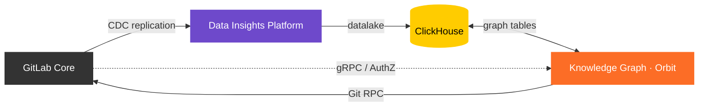

このページには今後予定されている製品・機能・機能性に関する情報が含まれています。ここに示す情報は参考目的のみです。購入・計画の決定にこの情報を使用しないでください。製品・機能・機能性の開発、リリース、タイミングは変更または延期される可能性があり、GitLab Inc. の独自の判断に委ねられています。

<table class="w-full text-sm border-collapse">
<thead>
<tr class="bg-gray-100 text-left">
<th class="px-3 py-2 border border-gray-300">Status</th>
<th class="px-3 py-2 border border-gray-300">Authors</th>
<th class="px-3 py-2 border border-gray-300">Coach</th>
<th class="px-3 py-2 border border-gray-300">DRIs</th>
<th class="px-3 py-2 border border-gray-300">Owning Stage</th>
<th class="px-3 py-2 border border-gray-300">Created</th>
</tr>
</thead>
<tbody>
<tr>
<td class="px-3 py-2 border border-gray-300">ongoing</td>
<td class="px-3 py-2 border border-gray-300"><a href="https://gitlab.com/michaelangeloio" class="text-blue-600 hover:underline">@michaelangeloio</a>, <a href="https://gitlab.com/michaelusa" class="text-blue-600 hover:underline">@michaelusa</a>, <a href="https://gitlab.com/jgdoyon1" class="text-blue-600 hover:underline">@jgdoyon1</a>, <a href="https://gitlab.com/bohdanpk" class="text-blue-600 hover:underline">@bohdanpk</a></td>
<td class="px-3 py-2 border border-gray-300"><a href="https://gitlab.com/ahegyi" class="text-blue-600 hover:underline">@ahegyi</a>, <a href="https://gitlab.com/shekharpatnaik" class="text-blue-600 hover:underline">@shekharpatnaik</a>, <a href="https://gitlab.com/andrewn" class="text-blue-600 hover:underline">@andrewn</a>, <a href="https://gitlab.com/dgruzd" class="text-blue-600 hover:underline">@dgruzd</a></td>
<td class="px-3 py-2 border border-gray-300"><a href="https://gitlab.com/michaelangeloio" class="text-blue-600 hover:underline">@michaelangeloio</a></td>
<td class="px-3 py-2 border border-gray-300">~devops::analytics</td>
<td class="px-3 py-2 border border-gray-300">2025-10-12</td>
</tr>
</tbody>
</table>

## 概要

GitLab Knowledge Graph（Orbit）は、GitLab インスタンスのデータ（SDLC メタデータおよびコード構造）からプロパティグラフを構築し、ClickHouse SQL にコンパイルされる JSON ベースの Cypher 風 DSL を通じて公開する Rust サービスです。AI システム（MCP 経由）および人間のユーザー向けの統一コンテキスト API を提供します。

このサービスは 2 種類のデータをプロパティグラフ形式でインデックスします:

- **SDLC メタデータ**: Issue、マージリクエスト、CI パイプライン、ワークアイテム、グループ、プロジェクト、その他の GitLab エンティティを、Siphon CDC によって PostgreSQL から NATS を経由して ClickHouse にストリーミングする。
- **コード**: コールグラフ、定義、参照、リポジトリメタデータを Gitaly から取得し、ClickHouse のグラフテーブルにパースする。

## アーキテクチャ

## 設計ドキュメント

完全な設計ドキュメントは [knowledge-graph リポジトリ](https://gitlab.com/gitlab-org/orbit/knowledge-graph/-/tree/main/docs/design-documents) のコードと並べて配置されています:

- [概要とアーキテクチャ](https://gitlab.com/gitlab-org/orbit/knowledge-graph/-/blob/main/docs/design-documents/README.md)
- [インデックス作成](https://gitlab.com/gitlab-org/orbit/knowledge-graph/-/tree/main/docs/design-documents/indexing)（SDLC およびコード）
- [クエリ](https://gitlab.com/gitlab-org/orbit/knowledge-graph/-/tree/main/docs/design-documents/querying)（グラフエンジン、クエリ言語）
- [データモデル](https://gitlab.com/gitlab-org/orbit/knowledge-graph/-/blob/main/docs/design-documents/data_model.md)
- [スキーマ管理](https://gitlab.com/gitlab-org/orbit/knowledge-graph/-/blob/main/docs/design-documents/schema_management.md)
- [セキュリティ](https://gitlab.com/gitlab-org/orbit/knowledge-graph/-/blob/main/docs/design-documents/security.md)
- [可観測性](https://gitlab.com/gitlab-org/orbit/knowledge-graph/-/blob/main/docs/design-documents/observability.md)

## リソース

| リソース | 場所 |
|---|---|
| リポジトリ | [gitlab-org/orbit/knowledge-graph](https://gitlab.com/gitlab-org/orbit/knowledge-graph) |
| メインエピック | [#19744](https://gitlab.com/groups/gitlab-org/-/work_items/19744) |
| プログラムページ | [内部ハンドブック](https://internal.gitlab.com/handbook/engineering/r-and-d-pmo/programs/knowledge-graph-ga/) |
