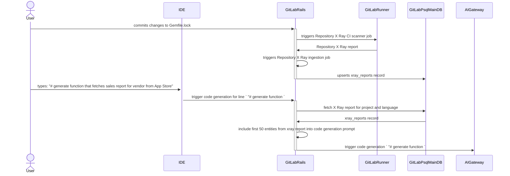

Elasticsearch は検索エンジンおよびデータストアであり、ベクトルの生成・保存・クエリ、またキーワード検索とセマンティック検索を大規模に実行できます。

Elasticsearch は分散アーキテクチャを採用しており、データは複数のノードに分散して保存されます。これによりクエリの並列処理が可能になり、大規模なデータセットでも高速な結果を保証します。

## ベクトルストアとしての Elasticsearch の利用

Elasticsearch は最大 4096 次元の埋め込みベクトルを保存でき、与えられた埋め込みに対して最近傍を探索できます。


### ライセンス

有償ライセンスは不要です。

### 埋め込みのインデックス化

ドキュメントタイプ（例: `gitlab_documentation`）ごとにインデックスが作成され、元のソース、埋め込み、および URL などのオプションのメタデータが保存されます。現在のすべてのドキュメントをインデックス化するための初期バックフィルと、ソースが変更された際にドキュメントをアップサートまたは削除するプロセスが必要です。

GitLab Duo ドキュメントの場合、埋め込みを生成して埋め込みデータベースに保存する既存の非同期プロセスを変更して Elasticsearch にインデックス化することができます。

Advanced Search フレームワークを使用すると、データベースレコードは自動的に Elasticsearch と同期されます。[Issue 442197](https://gitlab.com/gitlab-org/gitlab/-/issues/442197) では、他のデータセットもインデックス化できるよう Elasticsearch フレームワークを変更することを提案しています。

大きなソースを複数のチャンクに分割する必要があるドキュメントの場合、[ネスト kNN 検索](https://www.elastic.co/guide/en/elasticsearch/reference/8.12/knn-search.html#nested-knn-search)を使用できます。この方法では、単一のトップレベルドキュメントに、各々ソースと埋め込みを持つネストされたオブジェクトが含まれます。これにより、最も関連性の高いチャンクを持つ上位 K ドキュメントを検索できます。単一ドキュメント内で上位 k チャンクを検索する必要がある場合には適していません。そのような場合は、各チャンクを別々のドキュメントとして保存すべきです。

### コンテキスト関連情報のクエリ

特定の質問がモデルに渡されて埋め込みが生成されます。そのベクトルが Elasticsearch に送られ、最も関連性の高いドキュメントを見つけます。

### 生成

最も関連性の高い N 件のドキュメントがプロンプトに追加され、元の質問に対する回答を生成するために LLM に送られます。

## ホストモデルを使用した Elasticsearch での RAG

上記と同様ですが、質問の埋め込みは Elasticsearch 内部から生成されます。


### ライセンス

すべてのクラスターで有償ライセンスが必要です。

### モデルホスティング

使用するモデルをすべてのクラスターでホストする必要があり、これにより追加の作業とコストが発生します。

Elasticsearch は以下のモデルをサポートしています:

- ELSER（Elastic Learned Sparse Encoder）: セマンティック検索のためのテキスト埋め込みを生成するために Elasticsearch が提供する組み込みモデル。
- TensorFlow モデル: ML API を使用してセマンティック検索にカスタム TensorFlow モデルをデプロイできます。
- サードパーティモデル: Elasticsearch は Hugging Face やその他のプロバイダーのモデルのデプロイをサポートしています。より幅広い事前学習済みモデルへのアクセスを提供しますが、デプロイとメンテナンスには追加の作業が必要です。

## ハイブリッド検索

ハイブリッド検索はテキスト検索とセマンティック検索を組み合わせて、最も関連性の高いソースを返します。再ランカーを使用して両方の方法の結果を組み合わせることができます。


### Elasticsearch の高度なテキスト検索機能

1. 転置インデックス: Elasticsearch のコアには、転置インデックスと呼ばれる強力なデータ構造があります。このインデックスは従来のアプローチ（各ドキュメントに単語のリストが含まれる）を本質的に逆転させます。代わりに、転置インデックスはすべてのドキュメントにわたるすべてのユニークな単語をカタログ化し、各ドキュメントでそれが出現する場所を追跡します。これにより、一致する単語に基づいて関連ドキュメントを即座に見つけることで、高速な検索が可能になります。

1. 高度なテキスト分析: Elasticsearch は単純に単語全体を一致させるだけではありません。テキストアナライザーを活用して、テキストの複雑さを分解して理解します。これには以下の処理が含まれます:

   - ステミングとレンマ化: 単語を語根形に縮約（例: "running" と "ran" の両方が "run" に一致）。
   - 同義語と関連語: 同義語や類似語を認識して検索結果を拡大。
   - ストップワード: 意味にあまり貢献しない "the" や "a" などの一般的な単語を無視。
   - カスタム分析: 特定のドメインや言語のための独自のルールを定義。

1. 強力なクエリ機能: Elasticsearch は基本的なキーワード検索にとどまりません。ブール演算子（AND、OR、NOT）を使用した複雑なクエリ、近接検索（近くにある単語を見つける）、ファジー検索（タイプミスに対応）などをサポートしています。テキスト一致とともに他の条件に基づいて結果をフィルタリングすることもできます。

### 再ランキング

Elasticsearch は現在、そのまま使える [Reciprocal rank fusion (RRF)](https://www.elastic.co/guide/en/elasticsearch/reference/current/rrf.html) をサポートしています。また、ML を使用してランキングを改善する [Learning to Rank](https://elasticsearch-learning-to-rank.readthedocs.io/en/latest/) もリリースしています。

## Elasticsearch の実行

Elasticsearch は GitLab.com で利用可能であり、Dedicated および Self-Managed インスタンスに統合できます。ベクトルストアとして使用する場合のみ:

- [Elasticsearch バージョン `8.12` をインストール](https://docs.gitlab.com/ee/integration/advanced_search/elasticsearch.html#install-elasticsearch-or-aws-opensearch-cluster)するか、少なくともバージョン `8.12` にアップグレードします。
- Advanced Search 設定ページで URL、ユーザー名、パスワードを追加します: `admin/application_settings/advanced_search`

統合が設定された後、インスタンス管理者はベクトルストアとして使用するために追加の作業を行う必要はありません。GitLab Elasticsearch フレームワークがマッピング、設定、データのインデックス化を処理します。

## サポートされている次元数

Elasticsearch は最大 4096 次元を保存でき、OpenSearch は最大 16000 次元を保存できます。これは最大 2000 次元を保存できる `pg_vector` と比較したものです。

## 制限事項

### ライセンス

Elastic が提供する ML 機能を使用するには、すべてのクラスターに有効なライセンスが必要です。

Elastic がベクトルストアとしてのみ使用され、すべての埋め込みが Elastic の外部で生成される場合は、ライセンスは不要です。

### 採用

Elastic 統合はすべての GitLab インスタンスで Advanced Search を有効にするために利用可能ですが、すべてのインスタンスが統合の実行を選択しているわけではありません。また、統合をホストするためにすべてのインスタンスに追加コストがかかります。

## パフォーマンスとスケーラビリティ

Elasticsearch は水平方向にスケーラブルで、大規模な保存とクエリを処理します。Elasticsearch クラスターは、各々がリソースを提供する複数のノードで構成されます。

## コスト

GitLab ドキュメントベクトルストレージの Elastic Cloud 料金は月額約 38 ドルで、ストレージ要件に応じてスケールします。

## Elasticsearch vs. OpenSearch

### 機能

両方ともベクトル埋め込みの保存と類似検索（kNN）を提供しています。

Elasticsearch はカスタム TensorFlow モデルをサポートしていますが、OpenSearch はこれを提供していません。両方とも事前学習済みモデルを提供しています。

kNN 検索の API は 2 つのプラットフォーム間でわずかに異なりますが、同じ方法で動作します。

### サポートされているプラットフォーム

現在 GitLab はテキスト検索 API のパリティにより、Elasticsearch と OpenSearch の両方に Advanced Search を提供しています。両方が AI 機能でサポートされる場合、2 つの異なる AI API に対応する必要があります。

## PoC: Repository X Ray

Elasticsearch の埋め込み生成の実現可能性をテストするために、Repository X Ray プロジェクトで PoC が実施されました。

Repository X Ray はまだセマンティック検索を実装しておらず、このセクションは[プロトタイプ実装](https://gitlab.com/gitlab-org/gitlab/-/merge_requests/144715)のみに基づいています。

- 統計（2024年2月時点）:
  - データタイプ: 自然言語でのソースコードライブラリの説明を含む JSON ドキュメント
  - データアクセスレベル: レッド（各 JSON ドキュメントは特定のプロジェクトに属し、データアクセスルールはそのプロジェクトに設定されたデータアクセスルールに準拠する必要があります）
  - データソース: Repository X Ray レポート CI アーティファクト
  - データサイズ: 該当なし
  - ユーザー入力の例: "# generate function that fetches sales report for vendor from App Store"
  - 期待される AI 生成レスポンスの例:

  ```python
  def sales_reports(vendor_id)\n  app_store_connect.sales_reports(\n  filter: {\n    report_type: 'SALES',\n    report_sub_type: 'SUMMARY',\n    frequency: 'DAILY',
    vendor_number: '123456'\n  }\n)\nend
    ```

### データソースとの埋め込みの同期

[ドキュメントの例](https://docs.gitlab.com/ee/architecture/blueprints/gitlab_duo_rag/elasticsearch.html#retrieve-gitlab-documentation)と同様に、Repository X Ray レポートデータは派生データです。基底のリポジトリソースコードをベースとして使用しており、ソースコードに変更が発生するたびに同期する必要があります。

現在、埋め込みとベクトルストレージを含む同期メカニズムはありません。ただし、Repository X Ray レポートを生成して保存する既存のパイプラインがあります。

インジェストパイプラインは以下の手順で実行されます:

1. CI X Ray スキャナージョブがトリガーされます。ドキュメントの[ページ](https://docs.gitlab.com/ee/user/project/repository/code_suggestions/repository_xray.html#enable-repository-x-ray)では、このジョブをメインリポジトリブランチへの変更が発生した場合のみ実行するよう制限することを推奨しています。ただし、リポジトリのメンテナーはトリガールールを異なる方法で設定することがあります。
   - X Ray [スキャナー](https://gitlab.com/gitlab-org/code-creation/repository-x-ray)が、サポートされている[依存関係ファイル](https://docs.gitlab.com/ee/user/project/repository/code_suggestions/repository_xray.html#supported-languages-and-package-managers)の一つを特定して処理し、JSON レポートファイルを生成します。
1. X Ray スキャナージョブが正常に終了した後、GitLab Rails モノリスで[バックグラウンドジョブ](https://gitlab.com/gitlab-org/gitlab/-/blob/c6b2f18eaf0b78a4e0012e88f28d643eb0dfb1c2/ee/app/workers/ai/store_repository_xray_worker.rb#L18)がトリガーされ、JSON レポートを [`Projects::XrayReport`](https://gitlab.com/gitlab-org/gitlab/-/blob/bc2ad40b4b026dd359e289cf2dc232de1a2d3227/ee/app/models/projects/xray_report.rb#L22) にインポートします。
   - プログラミング言語のスコープ内でプロジェクトごとに Repository X Ray レポートは 1 つしか存在できません。重複したレコードはインポートプロセス中にアップサートされます。

現時点で、GitLab.com の `xray_reports` テーブルには 84 行があります。

### 取得

Repository X Ray レポートがインポートされた後、IDE 拡張機能が[コード生成](https://docs.gitlab.com/ee/user/project/repository/code_suggestions/index.html)のリクエストを送信すると、Repository X Ray レポートは以下の手順で取得されます:

1. GitLab Rails モノリスがメインデータベースから対応する `xray_reports` レコードを取得します。`xray_reports` レコードは `project_id` 外部キーと `lang` カラムに基づいてフィルタリングされます。
1. 取得したレコードから最初の 50 件の依存関係が、AI Gateway に転送されるプロンプトに追加されます。

### 現在の状態の概要



### 埋め込みの将来的な応用

上記の取得セクションで説明したように、現在 Repository X Ray レポートは非常にナイーブなアプローチに従っており、Repository X Ray レポートの内容とユーザー指示の間の関連性を評価する指標を含んでいません。そのため、X Ray レポートに埋め込みとセマンティック検索を適用することは、ユーザー指示に基づいて Repository X Ray レポートから限定された関連エントリを選択することで結果を改善する大きな可能性があります。

これを実現するには、Repository X Ray インジェスト中に埋め込みを生成する必要があります。さらに、取得プロセス中に保存された Repository X Ray レポートデータに対してセマンティック検索を実行するために、ユーザー指示を埋め込みベクトルに変換する必要があります。

### Elasticsearch と PGVector の比較

以下の段落は [PoC](https://gitlab.com/gitlab-org/gitlab/-/merge_requests/144715) 作業の結果です。

製品機能の実装の観点から、両方のソリューションは現時点で製品機能の要件をサポートするために必要なすべてのツールを提供する実現可能なソリューションと思われます。
Elasticsearch の組み込み機能を考慮すると、将来的には `pg_vector` ベースのソリューションよりも優れた長期サポートを提供し、より強力な RAG ソリューションを可能にする可能性があることが認識されています。

現在の Elasticsearch 統合は `ActiveRecord` モデルと Git リポジトリのソースコードのみをインデックス化しています。他のデータ（例: X-Ray レポート）をインデックス化するためのより汎用的な抽象化を構築するためのさらなる作業は [Issue 442197](https://gitlab.com/gitlab-org/gitlab/-/issues/442197) で定義されています。
既存の制限の次善策的な回避策が技術的負債を生み出すことを防ぐために、Elasticsearch を RAG の主要なベクトルストレージとして選択する前に [Issue 442197](https://gitlab.com/gitlab-org/gitlab/-/issues/442197) が完了することが推奨されます。
