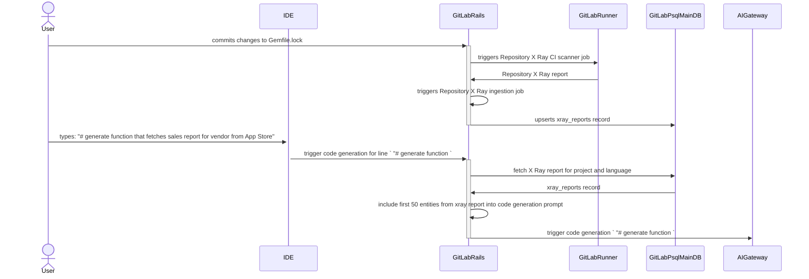

このページでは、[RAG](index.md) のために PostgreSQL からデータを取得する方法を説明します。

## セマンティック検索

### 概要

1. PostgreSQL データベースに [PgVector 拡張機能](#pgvector-を使用したベクトルストア) をインストールします。
1. 新規または既存のテーブルに `vector` カラムを追加します。
1. データ <=> 埋め込みの同期
   1. 検索対象のデータを読み込みます。
   1. データを埋め込みモデルに渡してベクトルを取得します。
   1. ベクトルを `vector` カラムに設定します。
1. 取得
   1. ユーザー入力を埋め込みモデルに渡してベクトルを取得します。
   1. ユーザー入力ベクトルの最近傍を取得します。例: `SELECT * FROM a_table ORDER BY vector_column <-> '<user-input-vector>' LIMIT 5;`

### PgVector を使用したベクトルストア

セマンティック検索のための埋め込みを保存するには、GitLab PostgreSQL にベクトルストアを追加する必要があります。
このベクトルストアは [PgVector 拡張機能](https://github.com/pgvector/pgvector)をインストールすることで追加できます（Postgres 12 以上が必要）。
現在、ベクトルストアは GitLab.com で稼働しており、メイン/CI データベースとは別にホストされています。

埋め込み専用の別データベースを持つ現在のアーキテクチャはおそらく理想的です。これらを組み合わせてもあまりメリットはなく、PGVector はすべて新しく、スケール時のパフォーマンスを確認するために多くの実験が必要になる可能性があります（現在は非常に少量のデータしかありません）。別のデータベース（PGVector が別データベースにある場合）であれば、GitLab.com 全体の安定性に影響を与えることなく実験する選択肢がより多くあります。別のデータベースを持つことが推奨されます。これにより、メインデータベースのパフォーマンスに影響を与えることなく実験できます。

### 制限事項

- ベクトルカラムの次元数を指定する必要があるため、特定の埋め込みモデルに縛られる可能性があります。
- 最大 2,000 次元のベクトルをインデックス化できます。

### パフォーマンスとスケーラビリティへの影響

- PostgreSQL に追加できるデータ量（ベクトルデータか通常データかに関わらず）に関するガイダンスはありますか?
  - 特にありません。私たちは通常、データベースにデータを追加するのではなく、インスタンスの使用によってデータが生成されます。特定の[ストレージ要件](https://docs.gitlab.com/ee/install/requirements.html#storage)は見当たりません。既存の `vertex_gitlab_docs` テーブルのサイズが良い指標であれば、大きな問題なく追加できると思われますが、オプトインまたはオプトアウトのオプションを持つことが望ましいです。

### 可用性

- PostgreSQL はすべての GitLab インストール（CNG と Omnibus の両方）で利用可能です。
- ほとんどの主要なクラウドプロバイダーが PgVector を提供に追加しています: Google Cloud SQL と Alloy DB、DigitalOcean、AWS RDS と Aurora、Azure Flexible と Cosmos など。PGVector をサポートするバージョンにアップグレードが必要なケースがある可能性があります。

## ID 検索

### 概要

1. ユーザー入力からリソース識別子を抽出するためにフューショットプロンプトを実行します。
    - 例: ユーザーが `Can you summarize #12312312?` と尋ねた場合、ResourceIdentifier は GitLab-Issue としての `12312312` です。
1. PostgreSQL からレコードを取得します。例: `Issue.find(12312312)`
1. ユーザーがリソースを読み取れるか確認します。
1. 取得したデータでプロンプトを構築し、LLM に渡して AI 生成レスポンスを取得します。

## PoC: Repository X Ray

Repository X Ray はまだセマンティック検索を実装しておらず、このセクションは[プロトタイプ実装](https://gitlab.com/gitlab-org/gitlab/-/merge_requests/142912)のみに基づいています。

- 統計（2024年2月時点）:
  - データタイプ: 自然言語でのソースコードライブラリの説明を含む JSON ドキュメント
  - データアクセスレベル: レッド（各 JSON ドキュメントは特定のプロジェクトに属し、データアクセスルールはそのプロジェクトに設定されたデータアクセスルールに準拠する必要があります）
  - データソース: Repository X Ray レポート CI アーティファクト
  - データサイズ: 該当なし
  - ユーザー入力の例: "# generate function that fetches sales report for vendor from App Store"
  - 期待される AI 生成レスポンスの例:
  
  ```python
  def sales_reports(vendor_id)\n  app_store_connect.sales_reports(\n  filter: {\n    report_type: 'SALES',\n    report_sub_type: 'SUMMARY',\n    frequency: 'DAILY',
    vendor_number: '123456'\n  }\n)\nend
    ```

### データソースとの埋め込みの同期

[ドキュメントの例](https://docs.gitlab.com/ee/architecture/blueprints/gitlab_duo_rag/postgresql.html#retrieve-gitlab-documentation)と同様に、Repository X Ray レポートデータは派生データです。基底のリポジトリソースコードをベースとして使用しており、ソースコードに変更が発生するたびに同期する必要があります。

現在、埋め込みとベクトルストレージを含む同期メカニズムはありません。ただし、Repository X Ray レポートを生成して保存する既存のパイプラインがあります。

インジェストパイプラインは以下の手順で実行されます:

1. CI X Ray スキャナージョブがトリガーされます。ドキュメントの[ページ](https://docs.gitlab.com/ee/user/project/repository/code_suggestions/repository_xray.html#enable-repository-x-ray)では、このジョブをメインリポジトリブランチへの変更が発生した場合のみ実行するよう制限することを推奨しています。ただし、リポジトリのメンテナーはトリガールールを異なる方法で設定することがあります。
   1. X Ray [スキャナー](https://gitlab.com/gitlab-org/code-creation/repository-x-ray)が、サポートされている[依存関係ファイル](https://docs.gitlab.com/ee/user/project/repository/code_suggestions/repository_xray.html#supported-languages-and-package-managers)の一つを特定して処理し、JSON レポートファイルを生成します。
1. X Ray スキャナージョブが正常に終了した後、GitLab Rails モノリスで[バックグラウンドジョブ](https://gitlab.com/gitlab-org/gitlab/-/blob/c6b2f18eaf0b78a4e0012e88f28d643eb0dfb1c2/ee/app/workers/ai/store_repository_xray_worker.rb#L18)がトリガーされ、JSON レポートを [`Projects::XrayReport`](https://gitlab.com/gitlab-org/gitlab/-/blob/bc2ad40b4b026dd359e289cf2dc232de1a2d3227/ee/app/models/projects/xray_report.rb#L22) にインポートします。
   1. プログラミング言語のスコープ内でプロジェクトごとに Repository X Ray レポートは 1 つしか存在できません。重複したレコードはインポートプロセス中にアップサートされます。

現時点で、GitLab.com の `xray_reports` テーブルには 84 行があります。

### 取得

Repository X Ray レポートがインポートされた後、IDE 拡張機能が[コード生成](https://docs.gitlab.com/ee/user/project/repository/code_suggestions/index.html)のリクエストを送信すると、Repository X Ray レポートは以下の手順で取得されます:

1. `textembedding-gecko` モデル（768 次元）からユーザー入力の埋め込みを取得します。
1. `vertex_gitlab_docs` テーブルに対して最近傍を検索するクエリを実行します。例:

   ```sql
   SELECT *
   FROM vertex_gitlab_docs
   ORDER BY vertex_gitlab_docs.embedding <=> '[vectors of user input]'               -- nearest neighbors by cosine distance
   LIMIT 10
   ```

1. GitLab Rails モノリスがメインデータベースから対応する `xray_reports` レコードを取得します。`xray_reports` レコードは `project_id` 外部キーと `lang` カラムに基づいてフィルタリングされます。
1. 取得したレコードから最初の 50 件の依存関係が、AI Gateway に転送されるプロンプトに追加されます。

### 現在の状態の概要



### 埋め込みの将来的な応用

上記の取得セクションで説明したように、現在 Repository X Ray レポートは非常にナイーブなアプローチに従っており、Repository X Ray レポートの内容とユーザー指示の間の関連性を評価する指標を含んでいません。そのため、X Ray レポートに埋め込みとセマンティック検索を適用することは、ユーザー指示に基づいて Repository X Ray レポートから限定された関連エントリを選択することで結果を改善する大きな可能性があります。

これを実現するには、Repository X Ray インジェスト中に埋め込みを生成する必要があります。さらに、取得プロセス中に保存された Repository X Ray レポートデータに対してセマンティック検索を実行するために、ユーザー指示を埋め込みベクトルに変換する必要があります。
