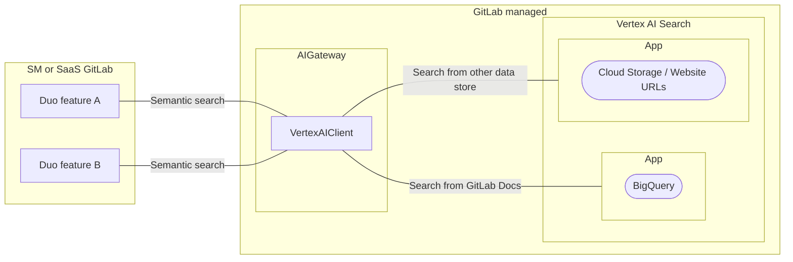

このページでは、[RAG](index.md) のために Google Vertex AI Search からデータを取得する方法を説明します。

## 概要

私たちのデータの一部は、取得時に[データアクセスチェック](index.md#data-access-policy)を必要としないパブリックリソースです。
これらのデータは GitLab インスタンス間で同一であることが多く、すべての単一データベースに同じデータをインジェストすることは冗長です。
単一サービスからデータを提供する方が効率的です。

このような場合、[Vertex AI Search](https://cloud.google.com/products/agent-builder?hl=en) を使用できます。
これにより、高いクエリ毎秒（QPS）、高リコール、低レイテンシ、そしてコスト効率で大規模な検索が可能になります。

このアプローチにより、顧客の代わりに更新できないコードを最小化できます。つまり、AI 関連のロジックを GitLab モノリスコードベースにハードコーディングすることを避けることができます。顧客に GitLab バージョンのアップグレードを求めることなく、製品に変更を加える柔軟性を維持できます。
これは [AI Gateway](https://docs.gitlab.com/ee/architecture/blueprints/ai_gateway/index.html) の設計原則と同じです。

## 制限事項

- データは**必ず** [GREEN レベル](index.md#data-access-policy)で、公開共有可能でなければなりません。
  - 例:
  - GitLab ドキュメント（`gitlab-org/gitlab/doc`、`gitlab-org/gitlab-runner/docs`、`gitlab-org/omnibus-gitlab/doc` など）
  - [Example selectors](https://python.langchain.com/v0.1/docs/modules/model_io/prompts/example_selectors/) を使用してフューショットプロンプトテンプレートを動的に構築する。

**重要: 私たちは顧客データを Vertex AI Search に保持しません。顧客データの保持については他のソリューションを参照してください。**

## パフォーマンスとスケーラビリティへの影響

- GitLab 側: Vertex AI Search は[高いクエリ毎秒（QPS）、高リコール、低レイテンシ、コスト効率で大規模な検索](https://cloud.google.com/vertex-ai/docs/vector-search/overview)が可能です。
- GitLab 側: Vertex AI Search は[グローバルおよびマルチリージョンデプロイメント](https://cloud.google.com/generative-ai-app-builder/docs/locations)をサポートしています。
- 顧客側: GitLab Self-managed インスタンスからのアウトバウンドリクエストは、ローカルのベクトルストアから取得する場合よりもネットワーク遅延が大きくなる可能性があります。
  この遅延の問題はマルチリージョンデプロイメントで対処できます。

## 可用性

- 顧客側: AI Gateway（`cloud.gitlab.com`）へのアクセスが必要なため、エアギャップソリューションはサポートできません。
  GitLab Duo がすでにそのアクセスを必要としているため、この懸念は無視できます。
- 顧客側: このサービスは単一障害点であるため、サービスがダウンすると取得機能が停止します。

## コストへの影響

- GitLab 側: [Vertex AI Search の料金](https://cloud.google.com/generative-ai-app-builder/pricing)を参照してください。
- 顧客側: 追加コストは不要です。

## メンテナンス

- GitLab 側: GitLab はデータストア（例: BigQuery の構造化データや Cloud Storage の非構造化データ）を維持する必要があります。Google は自動的にスキーマを検出し、保存されたデータをインデックス化します。
- 顧客側: メンテナンスは不要です。
