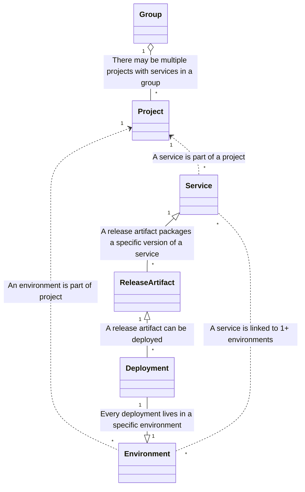



## 概要

現代のサービス指向のデプロイメントと環境管理を直交的に把握するために、
GitLab は[サービス](https://about.gitlab.com/direction/delivery/glossary.html#service)をファーストクラスの概念として持つ必要があります。
このブループリントは、GitLab CD ソリューションにおいてサービスと関連エンティティをどのように構築すべきかを概説します。

## 動機

GitLab が DevSecOps サイクル全体をカバーする単一プラットフォームの提供に向けて取り組む中で、
その提供はパイプラインにとどまらず、デプロイメントとリリース管理、
さらにユーザーが開発したアプリケーションやサードパーティアプリケーションの可観測性も含む必要があります。

GitLab は GitLab パイプラインの `environment` 構文などのいくつかのコンセプトを提供していますが、
特定の環境で何が実行されているかというコンセプトは提供していません。環境が何かが実行されている「どこ」に答えるかもしれませんが、「何」が実行されているかという問いには答えません。この問いに答えるために[サービス](https://about.gitlab.com/direction/delivery/glossary.html#service)と[リリースアーティファクト](https://about.gitlab.com/direction/delivery/glossary.html#release)を導入すべきです。[Delivery 用語集](https://about.gitlab.com/direction/delivery/glossary.html#service)では、サービスを次のように定義しています。

> アプリケーションの特定の機能を提供するために他のサービスと疎結合されている、（ほぼ）独立してデプロイ可能なアプリケーションの論理的なコンセプト。

サービスはリリースアーティファクトを通じて SCM、レジストリ、Issue に接続し、特定のリリースアーティファクトのバージョンがデプロイされている（またはデプロイ中の）[環境](https://about.gitlab.com/direction/delivery/glossary.html#environment)への焦点を絞ったビューになります。

サービスのコンセプトを持つことで、ユーザーは CI/CD パイプラインだけでなく、本番環境でのアプリケーションを追跡できます。これによりコスト管理などの可能性が開かれます。
[Analyze:Observability](/handbook/product/categories/#platform-insights-group) での現在の作業は、サービスをサポートすることで GitLab に統合できます。

### 目標

- サービスはプロジェクトレベルで定義されます。
- 1 つのプロジェクトが複数のサービスを持つことができます。
- グループおよび組織レベルでサービスを一覧表示できるようにする必要があります。アーキテクチャが最初からグループレベルの機能をサポートできるように確認する必要があります。「グループレベルの環境ビュー」は、顧客が何年もの間求めている機能です。
- サービスは環境に紐付けられています。すべてのサービスが複数の環境に存在し、すべての環境が複数のサービスをホストする可能性があります。すべてのサービスがすべての環境に存在することは期待されておらず、どの環境もすべてのサービスをホストすることは期待されていません。
- サービスは複数のリソースをグループ化する論理的なコンセプトです。
- サービスは通常、他のサービスとは独立してデプロイされます。サービスは通常、全体としてデプロイされます。
  - ユーザーインタビューでのデプロイメントは、`Helm`、`helmfiles`、または Flux と `HelmRelease` を使用した CI 経由で行われていました。
  - Kubernetes でも、サービスをデプロイするために他のツール（Kustomize、バニラマニフェスト）が使用される場合があります。
  - Kubernetes 以外では、他のツールが使用される場合があります。例: Runway は Terraform を使用してデプロイします。
- サービスの[デプロイメント](https://about.gitlab.com/direction/delivery/glossary.html#deployment)を、[リリースアーティファクト](https://about.gitlab.com/direction/delivery/glossary.html#release)に含まれる MR、コンテナ、パッケージ、リンターの結果に接続したいと思います。
- サービスには外部（または内部）ページへのリンクのまとまりが含まれています。

[アーキテクチャ図のソース](https://docs.google.com/drawings/d/1TJinpfqc48jXZEw7rxe6mB-8AwDOW7o58wTAB_ljSNM/edit?usp=sharing)

（Deployment の点線の枠は Target Infrastructure への投影を表しています）

### 非目標

- サービスに関連するメトリクスはプロジェクトメンテナー（開発者?）がカスタマイズおよび設定可能にする必要があります。メトリクスはサービスごとにクエリと意味の両方で異なる場合があります（例: トラフィックはキューには意味をなしません）。
- メトリクスは OpenTelemetry/Prometheus、Datadog などのさまざまな外部ツールと統合する必要があります。
- [Analyze:Observability](/handbook/product/categories/#platform-insights-group) が構築した GitLab 可観測性ソリューションには取り組みません。ここでの提案は、それを 1 つの可観測性統合バックエンドとして扱う必要があります。
- アラート、SLO、SLA、インシデント管理はカバーしません。
- 一部のインフラは GitLab 内で他よりも優れたサポートを持つ場合があります（Kubernetes は純粋な AWS よりもサポートが充実しています）。Kubernetes に対して提供しているまたは提供予定の機能や、他のインフラとの機能パリティの達成方法については議論する必要はありません。
- サービスはメタデータ（例: テナント、リージョン）でフィルタリングできます。これらは顧客やグループによって異なる場合があります。

## 提案

サービスモデルを導入します。これは以下のパラメーターを含む浅いモデルです:

- **名前**: サービスの名前（例: `Awesome API`）
- **説明**: Markdown フィールド。外部（または内部）ページへのリンクを含めることができます。
- （TBD）**メタデータ**: サービスにラベルを付けるユーザー定義のキーと値のペア。後でグループまたはプロジェクトレベルでのフィルタリングに使用できます。
  - フィールドの例:
  - `Tenant: northwest`
  - `Component: Redis`
  - `Region: us-east-1`
- （TBD）**デプロイメントシーケンス**: 開発から本番への昇格を可能にします。
- （TBD）**サービス固有の環境変数**: 環境内の変数。変数はサービスにも定義できる必要があります。

### DORA メトリクス

ユーザーはサービスを通じて DORA メトリクスを観察できます:

- 現在、デプロイメント頻度は `environment_tier=production` のデプロイメント、またはジョブ名が `prod` または `production` のデプロイメントをカウントしています。
- エンドユーザーに明確である必要があります。これは規約にできます。例えば、パイプラインを単一の `environment_tier=production` ジョブに制限するか、環境ごとの最初の `environment_tier=production` に制限するなど。後で定義される予定です。

### グループレベルでの環境とサービスの集計

グループレベルでは、GitLab は特定のグループ配下のすべてのプロジェクトレベルの環境を取得し、
環境の**名前**でグループ化します。例えば:

|                   | Frontend service        | Backend service       |
| ------            | ------                  | ------                |
| dev               |  Release Artifact v0.x  |                       |
| development       |  Release Artifact v0.y  |                       |
| production        |  Release Artifact v0.z  | Release Artifact v1.x |

### エンティティの関係

- サービスと環境は多対多の関係です。
- デプロイメントとリリースアーティファクトは多対一の関係です（アーティファクトの特定バージョンに対して）。特定の環境に焦点を当てると、デプロイメントとリリースアーティファクトは一対一の関係です。
- 環境とデプロイメントは一対多の関係です。これにより、環境ごとのデプロイメント履歴（過去と実行中のもの、ロールアウトのステータスを含む可能性あり）を表示できます。
- 環境とリリースアーティファクトはデプロイメントを通じた多対多の関係です。
- サービスとリリースアーティファクトは多対多の関係です。これにより、サービスごとのリリース履歴（過去、実行中、未完了）を表示できます。
- リリースアーティファクトとアーティファクトは一対多の関係です（例: チャートがアーティファクト => 値がアーティファクト => イメージがアーティファクト）。

詳細については[用語集](https://about.gitlab.com/direction/delivery/glossary.html)を参照してください。

**議論:** [`Deployment`](https://gitlab.com/gitlab-org/gitlab/-/blob/master/app/models/deployment.rb) や [`Environment`](https://gitlab.com/gitlab-org/gitlab/-/blob/master/app/models/environment.rb) モデルなどの既存のエンティティを再利用すべきかどうかは TBD です。既存のエンティティを再利用すると長期的に制限が生じる可能性がありますが、ユーザーは既存の CI/CD ワークフローを大幅に変更せずに新しいアーキテクチャをシームレスに採用できる必要があります。この決定は、エンティティの理想的な構造と動作についてより明確な答えが得られた時点で行うべきです。それにより、既存のエンティティとの差異がどの程度かを理解し、移行の実現可能性を評価できます。

## 代替ソリューション

- [組織レベルの動的な環境ページを追加する](https://gitlab.com/gitlab-org/gitlab/-/issues/241506)。
  このアプローチは、サービスコンセプトを優先して不採用と結論付けられました。
- [グループレベルの環境ビュー](#グループレベルでの環境とサービスの集計)のために、[Group Environment エンティティを導入する](https://gitlab.com/gitlab-org/gitlab/-/merge_requests/129696#note_1557477581)代替提案があります。
