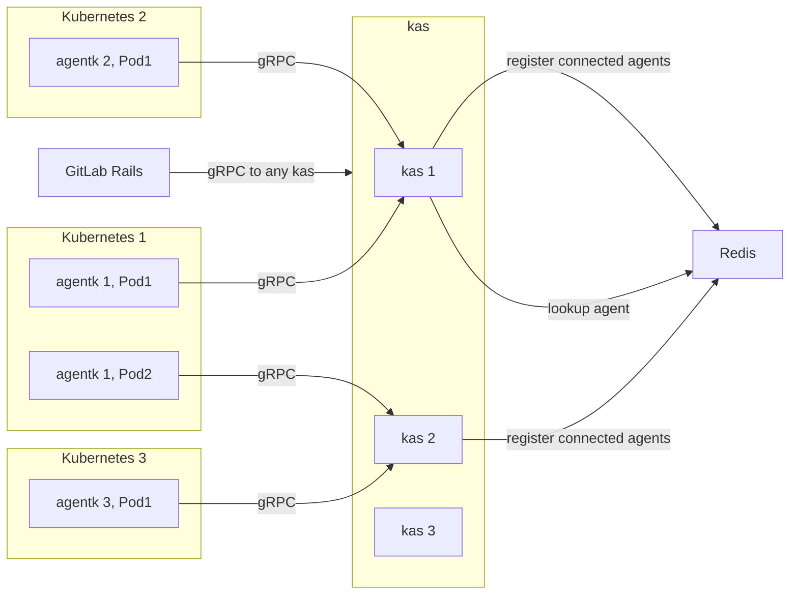



このドキュメントの目的は、GitLab が GitLab エージェントを通じて Kubernetes およびクラスター内サービスとどのように通信できるかを定義することです。

## 課題

### ネットワーク接続の欠如

現在存在するさまざまな機能において、GitLab は Kubernetes の API エンドポイントを直接または間接的に呼び出すことで Kubernetes と通信しています。この方法は、GitLab からクラスターへのネットワークパスが存在する限り正常に機能しますが、常にそうであるとは限りません:

- GitLab.com とセルフマネージドクラスター（クラスターがインターネットに公開されていない場合）。
- GitLab.com とクラウドベンダーが管理するクラスター（クラスターがインターネットに公開されていない場合）。
- セルフマネージド GitLab とクラウドベンダーが管理するクラスター（クラスターがインターネットに公開されておらず、クラウドネットワークとお客様のネットワーク間にプライベートピアリングがない場合）。

  この最後の項目は最も対処が難しく、ネットワークパスを作るためには何らかの妥協が必要です。この機能により、お客様は既存のオプション（ネットワークのピアリング、または一方のサイドを公開する）に加え、新たなオプション（GitLab 全体ではなく `gitlab-kas` ドメインのみを公開する）を得ることができます。

技術的に可能であっても、セキュリティ上の理由から Kubernetes クラスターの API をインターネットに公開することはほぼ常に望ましくありません。その結果、お客様はこれを好まず、GitLab が提供する接続クラスター向けの機能とセキュリティのどちらかを選択しなければならない状況に直面しています。

この選択は Kubernetes の API だけでなく、GitLab がアクセスする必要があるお客様のクラスター上で実行されているサービスが公開するすべての API にも当てはまります。例えば、クラスター内で実行されている Prometheus は、GitLab とのインテグレーションがアクセスするために公開される必要があります。

### クラスター管理者権限

現在の 2 つのインテグレーション（独自クラスターの構築（証明書ベース）とクラウドの GitLab マネージドクラスター）では、どちらも GitLab に完全な `cluster-admin` アクセスを付与する必要があります。認証情報は GitLab 側に保存され、これはお客様にとってさらなるセキュリティ上の懸念事項となっています。

これらの問題についての詳細な議論は、[Issue #212810](https://gitlab.com/gitlab-org/gitlab/-/issues/212810) をご覧ください。

## GitLab エージェント Epic

これらの課題に対処し、新機能を提供するために、Configure グループは通信の方向を逆転させるアクティブなクラスター内コンポーネントを構築しています:

1. お客様がクラスターにエージェントをインストールします。
1. エージェントが GitLab.com またはセルフマネージド GitLab インスタンスに接続し、そこからコマンドを受信します。

お客様は GitLab に認証情報を提供する必要はなく、エージェントが持つ権限を完全に制御できます。

詳細については、[GitLab エージェントリポジトリ](https://gitlab.com/gitlab-org/cluster-integration/gitlab-agent) または
[Epic](https://gitlab.com/groups/gitlab-org/-/epics/3329) をご覧ください。

### リクエストルーティング

エージェントはサーバーサイドコンポーネントである GitLab エージェントサーバー（`gitlab-kas`）に接続し、コマンドを待つオープン接続を維持します。このアプローチの難しさは、GitLab から正しいエージェントへリクエストをルーティングすることにあります。
各クラスターには複数の論理エージェントが含まれる場合があり、それぞれが任意の `gitlab-kas` インスタンスに接続した複数のレプリカ（`Pod`）として実行される場合があります。

既存および新しい機能では、クラスターの API や（オプションで）クラスター内で実行されているコンポーネントの API へのリアルタイムアクセスが必要です。その結果、より伝統的なポーリングアプローチを使用して情報をやり取りすることは困難です。

リアルタイムのニーズを示す良い例として Prometheus インテグレーションがあります。リアルタイムグラフを描画したい場合、クエリを実行して素早く結果を返すために Prometheus API に直接アクセスする必要があります。`gitlab-kas` は Prometheus API を GitLab に公開し、その時点で接続されている正しいエージェントの 1 つに透過的にトラフィックをルーティングできます。エージェントはリクエストを Prometheus にストリームし、レスポンスをストリームバックします。

## 提案

`gitlab-kas` にリクエストルーティングを実装します。Kubernetes やエージェントとの連携において、クリーンな API を提供することで、すべての関連する複雑さをメインアプリケーションからカプセル化して隠蔽します。

上記は必ずしも Kubernetes の API を直接プロキシすることを意味しませんが、必要であればそれも可能です。

`gitlab-kas` が提供する API は開発される機能によって決まりますが、まずリクエストルーティングの問題を解決する必要があります。これは、エージェント、Kubernetes、またはクラスター内サービスとの直接通信を必要とするあらゆる機能をブロックしています。

すべての技術的詳細を含む詳細な実装提案は [`kas_request_routing.md`](https://gitlab.com/gitlab-org/cluster-integration/gitlab-agent/-/blob/master/doc/kas_request_routing.md) にあります。

### イテレーション

イテレーションは[専用 Epic](https://gitlab.com/groups/gitlab-org/-/epics/4591) で追跡されています。
