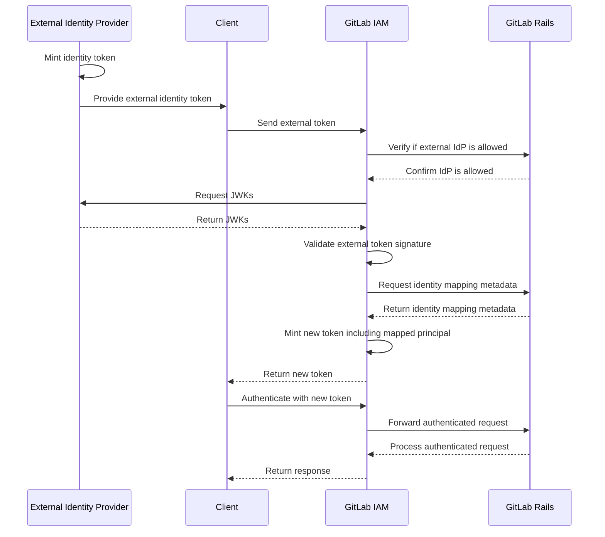

このページには今後予定されている製品・機能・機能性に関する情報が含まれています。ここに示す情報は参考目的のみです。購入・計画の決定にこの情報を使用しないでください。製品・機能・機能性の開発、リリース、タイミングは変更または延期される可能性があり、GitLab Inc. の独自の判断に委ねられています。

<table class="w-full text-sm border-collapse">
<thead>
<tr class="bg-gray-100 text-left">
<th class="px-3 py-2 border border-gray-300">Status</th>
<th class="px-3 py-2 border border-gray-300">Authors</th>
<th class="px-3 py-2 border border-gray-300">Coach</th>
<th class="px-3 py-2 border border-gray-300">DRIs</th>
<th class="px-3 py-2 border border-gray-300">Owning Stage</th>
<th class="px-3 py-2 border border-gray-300">Created</th>
</tr>
</thead>
<tbody>
<tr>
<td class="px-3 py-2 border border-gray-300">proposed</td>
<td class="px-3 py-2 border border-gray-300"><a href="https://gitlab.com/grzesiek" class="text-blue-600 hover:underline">@grzesiek</a></td>
<td class="px-3 py-2 border border-gray-300"></td>
<td class="px-3 py-2 border border-gray-300"><a href="https://gitlab.com/maw" class="text-blue-600 hover:underline">@maw</a></td>
<td class="px-3 py-2 border border-gray-300">~devops::sec</td>
<td class="px-3 py-2 border border-gray-300">2025-03-21</td>
</tr>
</tbody>
</table>

## 概要

現在、マシンタイプのアイデンティティが GitLab とやり取りする主な方法は、Personal Access Token（PAT）を通じてです。PAT は比較的長期間有効なため、悪意のある者によって漏洩または盗難されるリスクが高くなります。

ユーザーは短期間の認証情報として OAuth アクセストークンを使用することもありますが、このアプローチは理想的ではありません。業界で広く採用されている代替手段は[ワークロード ID フェデレーション](https://cloud.google.com/iam/docs/workload-identity-federation)であり、これは OpenID Connect（OIDC）の上に構築されています。GitLab ユーザーはすでに Google Cloud Platform や AWS などのプラットフォームへの認証にこの方法を使用していますが、ID フェデレーションを使用して GitLab に認証する方法はありません。

このデザインドキュメントは、GitLab ワークロード ID フェデレーションを実装するための道筋を説明しています。これにより、GitLab ユーザーは外部のプリンシパルを GitLab のアイデンティティにマッピングし、その認証と認可のルールを定義することで、外部のアイデンティティに GitLab インスタンスへのアクセスを付与できるようになります。

## ゴール

主なゴールは、外部の ID プロバイダーからの OIDC ID トークンを使用して、GitLab が外部のアイデンティティを認識し、GitLab プリンシパルにマッピングするサポートを追加することです。

## 要件

1. GitLab ユーザーは、設定されたグループとプロジェクト内で GitLab リソースへのアクセスを許可された外部 ID プロバイダーのリストを定義できます。
1. GitLab ユーザーは外部のアイデンティティを GitLab サービスアカウントにマッピングできます。
1. GitLab ユーザーは外部の ID トークンからのクレームを使用してマッピングのルールを定義できます。
1. GitLab ユーザーは監査ログを通じて外部のアイデンティティに付与されたアクセスを監査できます。
1. 外部 ID プロバイダーが GitLab で適切に設定されている場合、外部 ID トークンを GitLab API の認証に使用できます。

## 提案

提案されているソリューションは、GitLab API から GitLab ワークロード ID フェデレーションルールを読み取るトークン交換サービスを構築することです。このメタデータに基づいて、サービスは外部 ID プロバイダーからの ID トークンを認識・検証します。これらのトークンのクレームは、外部のアイデンティティを GitLab プリンシパルにマッピングするために使用されます。マッピングが成功した後、GitLab Secure Token Service（STS）はクライアント SDK が GitLab API とやり取りするために使用できる新しいトークンを生成します。

## 依存関係

GitLab ワークロード ID フェデレーションにはいくつかの依存関係があり、特に[新しい認証スタック](../new_auth_stack/)に依存しています。

1. **IAM サービス**: 外部 ID プロバイダーの設定、ID マッピングルール、サービスアカウントのメタデータを保存・取得するために必要です。
1. **Secure Token Service（STS）**: API アクセスのために外部 ID トークンに基づいてアクセストークンを生成する責任を持つコアコンポーネント。
1. **サービスアカウント**: 外部のアイデンティティは認可のために GitLab サービスアカウントにマッピングする必要があります。

## Cells アーキテクチャとの関係

GitLab ワークロード ID フェデレーションは [Cells アーキテクチャ](../cells/)と互換性があるよう設計されています。外部 ID トークンの交換は適切な GATE レイヤーで行われ、ID プロバイダーの設定はクロスセルのアクセスパターンを可能にするために IAM データベース階層全体にレプリケートされます。

## 決定事項

1. [STS-001: GCP インテグレーション向けに構築された GLGO サービスをオープンソース化](decisions/001_open_source_glgo.md)
1. [STS-002: GLGO を IAM サービスにマージ](decisions/002_merge_glgo_into_iam_service.md)
1. STS-003: 外部のアイデンティティから GitLab サービスアカウントへのマッピングを実装
1. STS-004: GitLab STS が生成した JWT で GitLab API へのアクセスをサポートに追加
