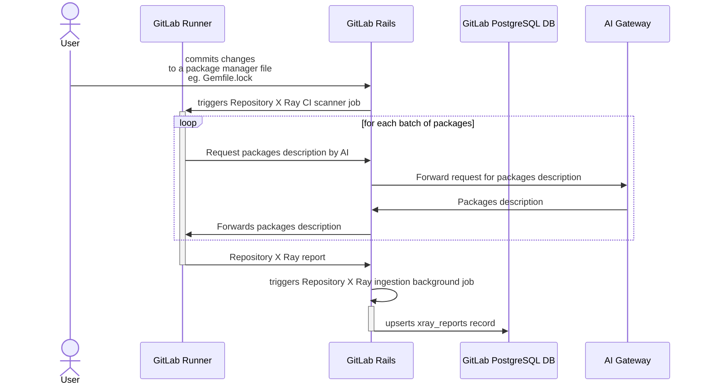
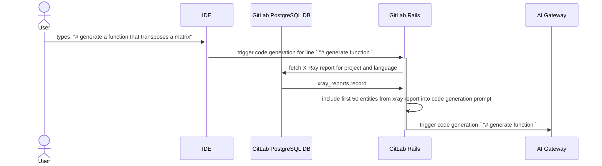
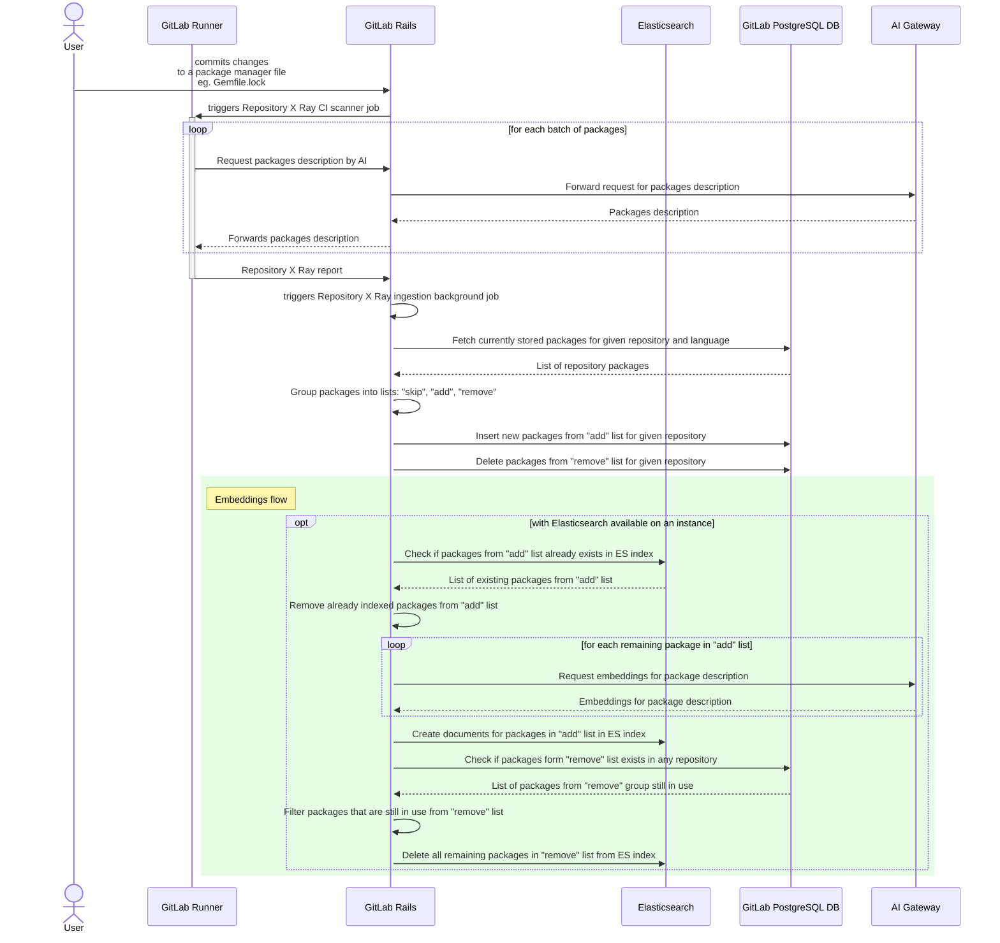
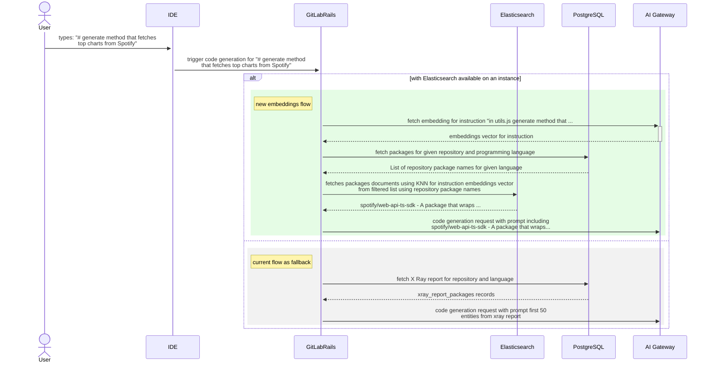

<div class="my-3 border-l-4 border-blue-500 bg-blue-50 px-4 py-3 rounded-r text-sm text-blue-800">
このページには今後予定されている製品・機能・機能性に関する情報が含まれています。ここに示す情報は参考目的のみです。購入・計画の決定にこの情報を使用しないでください。製品・機能・機能性の開発、リリース、タイミングは変更または延期される可能性があり、GitLab Inc. の独自の判断に委ねられています。
</div>

<div class="overflow-x-auto my-4">
<table class="w-full text-sm border-collapse">
<thead>
<tr class="bg-gray-100 text-left">
<th class="px-3 py-2 border border-gray-300">Status</th>
<th class="px-3 py-2 border border-gray-300">Authors</th>
<th class="px-3 py-2 border border-gray-300">Coach</th>
<th class="px-3 py-2 border border-gray-300">DRIs</th>
<th class="px-3 py-2 border border-gray-300">Owning Stage</th>
<th class="px-3 py-2 border border-gray-300">Created</th>
</tr>
</thead>
<tbody>
<tr>
<td class="px-3 py-2 border border-gray-300"><span class="inline-block rounded px-2 py-0.5 text-xs font-medium bg-gray-100 text-gray-700">ongoing</span></td>
<td class="px-3 py-2 border border-gray-300"><a href="https://gitlab.com/mikolaj_wawrzyniak" class="text-blue-600 hover:underline">@mikolaj_wawrzyniak</a></td>
<td class="px-3 py-2 border border-gray-300"></td>
<td class="px-3 py-2 border border-gray-300"><a href="https://gitlab.com/jprovaznik" class="text-blue-600 hover:underline">@jprovaznik</a>, <a href="https://gitlab.com/maddievn" class="text-blue-600 hover:underline">@maddievn</a>, <a href="https://gitlab.com/mkaeppler" class="text-blue-600 hover:underline">@mkaeppler</a></td>
<td class="px-3 py-2 border border-gray-300"><span class="inline-block rounded px-2 py-0.5 text-xs font-medium bg-gray-100 text-gray-700">~devops::create</span></td>
<td class="px-3 py-2 border border-gray-300">2024-04-23</td>
</tr>
</tbody>
</table>
</div>


~"group::global search" グループは [GitLab での RAG](../gitlab_rag/) 構築の取り組みをリードしています。これはグローバルな取り組みであるため、効率性とコラボレーションの価値観の精神から、~"group::code creation" がその取り組みに参加し、[Repository X-Ray](https://gitlab.com/gitlab-org/code-creation/repository-x-ray#repository-x-ray) データを GitLab RAG に統合することが適切です。これにより、リソースのより効率的な割り当てが実現されるだけでなく、他の AI 機能が Repository X-Ray データを統合・再利用することも可能になります。例えば、ユーザーが X-Ray レポートデータで回答できる質問を GitLab Duo Chat に投げることができます。

## ゴール

既存の Repository X-Ray スキャンフローを RAG プラットフォームと統合します。

## 概念実証

概念実証は[マージリクエスト 144715](https://gitlab.com/gitlab-org/gitlab/-/merge_requests/144715) で構築されています。この MR には実装時に役立つ大量の情報が含まれています。

## 実装

### 現在の状態

現在、Repository X-Ray はセマンティック検索を使用していません。MVC アプローチは X-Ray レポートから最初の 50 エンティティを単純に選択し、コード生成リクエストに含めます。
詳細については、以下の図を参照してください。

<details><summary> <bold>Repository X-Ray の現在の状態の図</bold> </summary>

Repository X-Ray スキャンは以下の図に示すように処理されます:



レポートはその後、以下の図に示すように使用されます:



</details>

### 期待される成果

この取り組みが完了すると、Repository X-Ray スキャンは以下の方法で処理されます:



その後、Repository X-Ray レポートは以下のように使用されます:



### 必要な変更

#### X Ray 書き込みパスにおける変更

##### 1. エンベディングを生成する新しい AI Gateway エンドポイントを作成する

GitLab ドキュメントのエンベディングは GitLab Rails から直接リクエストされています。このアプローチはエンベディングの可用性を GitLab.com のみに制限し、AI Gateway を GitLab 機能の AI サービスプロバイダーとして位置づけるアーキテクチャブループリントとも一致していません（詳細については関連する [AI Gateway Epic 13024](https://gitlab.com/groups/gitlab-org/-/epics/13024) を参照）。Repository X-Ray で同様の問題を避けるため、文字列のバッチを受け取り、エンベディングベクトルで応答する新しいエンドポイントを AI Gateway API に追加する必要があります。

以降のイテレーションでは、AI Gateway エンドポイント（接続されているすべてのインスタンストラフィックの完全な概要を持つ中央ポイントとして）がレート制限を実施し、トークン消費を管理することが期待されています。ただし、最初からクライアントはレート制限とトークン枯渇タイプのエラーを適切に処理する責任を負います。

**オープンクエスチョン:**

[エンベディング](../gitlab_rag/postgresql.md)は `textembedding-gecko` モデル（768 次元）で生成されます。新しい API エンドポイントを追加する際、必要であればモデルを変更できる可能性があります。その場合、どのモデルを選択するかを決定する必要があります。
Repository X Ray レポートデータは量も大きさも小さいため（現時点で GitLab.com には 379 レポートがあります）、モデルを切り替えてエンベディングデータを再構築するという決断はコストが低く、イテレーションのブロックを解除するために延期できます。

##### 2. Repository X-Ray レポートのエンベディングベクトルを保存する

現在の Elasticsearch フレームワークは ActiveRecord を使用してインデックスを最新の状態に保っています。作成/更新/削除のコールバックを使用して Elasticsearch 内の対応するレコードを操作します。
PostgreSQL メインデータベースの `xray_reports` テーブルはレポート全体を JSON ブロブとして保存しているため、レポートの各アイテム（指定されたリポジトリで使用されているライブラリを表す）の生成されたエンベディングベクトルを永続化するには、以下のいずれかを行う必要があります:

- [Issue 442197](https://gitlab.com/gitlab-org/gitlab/-/issues/442197) で定義されているように現在の Elastic フレームワークを変更する。
- より高い緊急性のために、`xray_reports` テーブルを各レコードが Repository X-Ray レポートの単一エンティティ（パッケージ/ライブラリ）を表す新しい構造に移行する。これは現在の Elasticsearch アップロードパイプラインと互換性があります。

Repository X-Ray パッケージを保存する Elasticsearch インデックスは以下の形式になります:

```json
index: xray-packages
document: {
  id:
  name:
  language:
  description:
  embedding:
}
```

このインデックスは以下を保存します:

- 説明
- 名前
- パッケージ名と説明を連結して生成されたエンベディング
- プログラミング言語

このインデックスは指定された GitLab インスタンスのすべてのリポジトリ間で共有されます。ただし、検索時は関連するパッケージのリストが、指定されたリポジトリの指定されたプログラミング言語に属するパッケージの名前のプリフェッチされたリストを使用してフィルタリングされます。このアプローチにより:

- 必要なストレージ容量が削減されます。
- 検索パフォーマンスが向上します。
- エンベディング生成に使用される AI 消費が削減されます。

###### オープンクエスチョン

バージョンによって説明が大きく異なるかどうかを確認し、パッケージとそのバージョンごとにレコードを保存するか、パッケージごとに 1 つだけ保存するかを決定する必要があります。

##### 3. GitLab Rails レイヤーのストレージを変更する

現在、Repository X-Ray パッケージはメイン PostgreSQL DB の `xray_reports` テーブルに保存されています。

```sql
CREATE TABLE xray_reports (
    id bigint NOT NULL,
    project_id bigint NOT NULL,
    created_at timestamp with time zone NOT NULL,
    updated_at timestamp with time zone NOT NULL,
    lang text NOT NULL,
    payload jsonb NOT NULL,
    file_checksum bytea NOT NULL,
);
```

リポジトリ間でエンベディングを共有しながら、Elasticsearch から古いデータを削除する方法を提供するために、新しいテーブル `xray_report_packages` を作成する必要があります。

```sql
CREATE TABLE xray_report_packages (
    id bigint NOT NULL,
    project_id bigint NOT NULL,
    created_at timestamp with time zone NOT NULL,
    updated_at timestamp with time zone NOT NULL,
    lang text NOT NULL,
    name text NOT NULL,
    version text NOT NULL,
    description text, --nullable filed as with Elasticsearch available this file will not be in use
);
```

新しいテーブルが作成されたら、`xray_reports` のすべてのレポートをそこに移行し、`xray_reports` を削除する必要があります。

##### 4. Repository X-Ray インポートパイプラインを変更する

Repository X-Ray レポートは CI ジョブ中に生成された後、バックグラウンドジョブを使用してインポートされます。
そのジョブは [`Ai::StoreRepositoryXrayService`](https://gitlab.com/gitlab-org/gitlab/blob/c6b2f18eaf0b78a4e0012e88f28d643eb0dfb1c2/ee/app/services/ai/store_repository_xray_service.rb#L4) を使用してレポートファイルを解析し、メイン PostgreSQL DB の `xray_reports` テーブルに保存します。

Repository X-Ray のセマンティック検索をサポートするために、以下の変更を適用する必要があります:

1. スキャナーから新しい Repository X-Ray レポートを `current_report_packages` のリストにロードします。
1. `xray_report_packages` に保存されている指定プロジェクトの前のレポートで報告されたパッケージのリストを `previous_report_packages` のリストにロードします
   （例: `SELECT * FROM xray_report_packages WHERE lang = 'ruby' AND project_id = 123`）。
1. 新しい X-Ray レポートからパッケージを 3 つのグループにフィルタリングします:
   1. `skip` - アクションを必要としない変更のないパッケージのコレクション。
   1. `add` - `xray_report_packages` に追加する必要がある新しいパッケージのコレクション。
   1. `remove` - 古いレポートには存在したが新しいレポートには存在しないパッケージのコレクション（`previous_report_packages` - `current_report_packages`）。
1. `add` リストのパッケージの新しいレコードを PostgreSQL `xray_report_packages` に挿入します。
1. `add` リストから Elasticsearch にすでに存在するパッケージをフィルタリングします。これらは他のリポジトリでも使用されているパッケージであり、この場合エンベディングと説明は共有されます。
1. `add` リストに残っているすべてのパッケージを Elasticsearch で更新・挿入します。
1. 指定プロジェクトの PostgreSQL `xray_report_packages` から `remove` リストのパッケージを削除します。
1. `remove` リストから、他のプロジェクトで使用されていない同じ `name` と `lang` のものを選択して `orphaned` リストを作成します
   （例: `SELECT 1 FROM xray_report_packages WHERE name = 'kaminari' AND lang = 'ruby' LIMIT  1`）。
1. Elasticsearch から `orphaned` パッケージを削除します。

#### X-Ray 読み取りパスにおける変更

1. コード生成命令を以下のいずれかから取得します:
   1. IDE:
      1. IDE / LS は生成を検出すると、コード生成命令（例: コード生成をトリガーしたコメントの内容）を送信する必要があります。
      1. GitLab Rails コードサジェスト API にはオプションの文字列パラメーター `instruction` を追加する必要があります。
   1. GitLab Rails: 優先順位の違いにより IDE が時間内に命令を提供できない場合、初期イテレーションのために GitLab Rails もコード生成命令を取得できます。
1. GitLab Rails は Elasticsearch が利用可能かどうかを検出し、以下のように動作します:
   1. Elasticsearch が利用可能な場合:
      1. 指定プロジェクトと言語の PostgreSQL データベース `xray_report_packages` に保存されているパッケージの `names` リストを取得します。
      1. プロジェクトのパッケージの `names` リストでフィルタリングされた Elasticsearch の k-最近傍（kNN）検索を使用して、最も関連性の高いコンテキストを取得します。
   1. Elasticsearch が利用できない場合:
      1. [現在の状態](#current-state)の図に沿って、PostgreSQL データベースの `xray_report_packages` から最初の 50 レコードを選択します。
