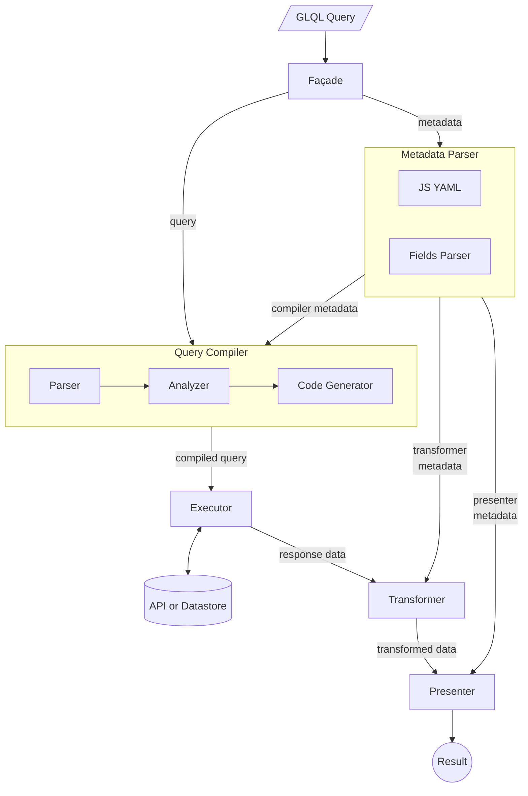

<!-- Design Documents often contain forward-looking statements -->
<!-- vale gitlab.FutureTense = NO -->





## 概要

GitLab クエリ言語（GLQL）は、GitLab プラットフォーム全体でデータをクエリし、提示するための統一された強力でユーザーフレンドリーな方法の必要性から生まれました。GitLab が進化し機能セットを拡張するにつれて、ユーザーがワークフローを効果的に管理するために、情報に効率的にアクセスし、フィルタリングし、可視化する能力がますます重要になっています。

## 動機

GLQL は、GitLab プラットフォーム全体でデータにアクセスし可視化するための統一された強力な方法の高まるニーズに対応します。GitLab の機能セットが拡張するにつれて、GLQL は複雑なデータ取得タスクを簡素化し、ユーザーの生産性を高め、一貫したクエリ体験を提供することを目指しています。この取り組みにより、GitLab は DevOps エコシステム内の包括的なデータ管理ソリューションとして位置付けられ、大規模プロジェクトを管理する開発者や組織の進化するニーズに応えます。

## ゴール

GLQL の主な動機は以下のとおりです:

1. **統一クエリインターフェース**: GLQL は、Issue から始まりワークアイテムへと拡張する、さまざまな GitLab オブジェクトをクエリするための単一の一貫した構文を提供することを目指しています。

1. **データアクセシビリティの向上**: GitLab 全体のテキストエディターのどこにでも GLQL ブロックを埋め込むことで、GLQL はユーザーが必要な時に必要な情報に正確にアクセスできるようにします。これは複雑なワークフローを管理する大規模プロジェクトにとって特に重要です。

1. **可視化の改善**: GLQL のデータ非依存のプレゼンテーションレイヤーにより、ユーザーはクエリ結果の表示方法をカスタマイズでき、より効果的なデータ分析が可能になります。

1. **AI インテグレーション**: 構造化された構文により、GLQL は GitLab の AI サービスとシームレスに統合されるよう位置付けられており、自然言語クエリ機能への道を開き、ユーザーの生産性を向上させます。

1. **拡張性**: 最初は Issue とワークアイテムに焦点を当てていますが、GLQL は将来を見越して設計されており、プラットフォームの成長に合わせてより多くの GitLab オブジェクトとユースケースをカバーするよう拡張できます。

## 提案

GLQL はさまざまなオブジェクトを取得するための単一クエリ構文を適応させ、それらを均一に表示するように設計された汎用モデルを導入しています。GLQL クエリはクエリ式とメタデータの 2 つのコンポーネントで構成されています。モデルは以下のコンポーネントで構成されています:

1. **ファサード**: GLQL クエリの処理のエントリポイントとして機能し、システムのさまざまなコンポーネント間のフローを調整します。
1. **クエリコンパイラ**: GLQL クエリを解析して実行可能なコードに変換する責任を持ちます。3 つのサブコンポーネントで構成されています:
    - パーサー: 生のクエリ文字列を AST（抽象構文木）に分解します。
    - アナライザー: 解析されたクエリを検証し、意味論的な正確性を確認します。
    - コードジェネレーター: 分析されたクエリをエクゼキューター向けの実行可能なコードに変換します。
1. **メタデータパーサー**: クエリに関連するメタデータを処理します。メタデータには変換（または集計）とプレゼンテーションの指示が含まれます。2 つのサブコンポーネントがあります:
    - JS YAML: YAML 形式のメタデータを解析します。
    - フィールドパーサー: メタデータで指定されたフィールドと適用する変換を解釈します。
1. **エクゼキューター**: コンパイルされたクエリを API またはデータストアに対して実行し、要求されたデータを取得します。現在、GraphQL がデータストアとして使用されています。
1. **トランスフォーマー**: エクゼキューターから返されたレスポンスデータを処理し、メタデータで指定された変換を適用します。
1. **プレゼンター**: データ非依存の Vue コンポーネントを使用して最終的な変換済みデータを提示します。

GLQL クエリの例:

````md
```glql
display: list
fields: title, health, due, labels("workflow::*"), labels
limit: 5
query: project = "gitlab-org/gitlab" AND assignee = currentUser() AND state = opened
```
````

上記の例では、`---` で囲まれたフロントマターブロックにメタデータが含まれています。
`display` はプレゼンターメタデータの例であり、`fields` と `limit` はコンパイラメタデータの例です。メタデータの値に関数を使用することで、`fields` をトランスフォーマーメタデータとして使用できます。

## 設計と実装の詳細



### ファサード

GLQL クエリの解析、実行、提示のエントリポイントとして機能するファサードコンポーネントは、[モデル](https://gitlab.com/gitlab-org/gitlab/-/blob/master/app/assets/javascripts/glql/core/index.js)と[ビュー](https://gitlab.com/gitlab-org/gitlab/-/blob/master/app/assets/javascripts/glql/components/common/facade.vue)の 2 つの部分で構成されています。
モデル部分がすべての重要な処理を行い、ビュー部分はロードとエラー状態を処理し、成功時に適切なルートプレゼンターコンポーネントを使用してデータを提示するための抽象化です。

### クエリコンパイラ

クエリコンパイラは Rust で構築されており、[こちら](https://gitlab.com/gitlab-org/gitlab-query-language/glql-rust)でホストされています。
Rust スタックを使用して構築され、WASM にコンパイルされた後、NPM の [@gitlab/query-language-rust](https://www.npmjs.com/package/@gitlab/query-language-rust) にデプロイされます。

**構文:**

クエリ構文は主に論理式で構成されています。これらの式は `[fieldName] [<|>|=|!=|in] [value|function] [AND] [anotherExpression]` という構文に従います。

現在サポートされているクエリ可能なフィールド名には、`assignee`、`author`、`label`、`epic` などが含まれます。より多くのフィールドのサポートは後のステージで追加されます。

- **サポートされている比較演算子:** `<`、`>`、`=`、`!=`、`in`。
- **サポートされている論理演算子:** 現在は `AND` 演算子のみがサポートされています。
- **サポートされているオペランド:** 現在は `currentUser()` と `today()` のみがサポートされています。`milestone` や `iteration` などの一部のフィールドは `none`、`any`、`current`、または `upcoming` などの動的値をサポートしています。

**コンポーネント**:

クエリコンパイラは複数の出力ターゲットをサポートするためにゼロから構築されています。コンポーネントには以下が含まれます:

1. パーサー: クエリを含む文字列を抽象構文木に変換するコンビネーターパーサーが含まれます。AST は `project` や `group` などのグローバル属性を抽出することで最適化されます。
1. アナライザー: クエリの意味論的な正確性を分析する静的アナライザー。
1. コードジェネレーター: 分析されたクエリをターゲットに応じてエクゼキューター向けの実行可能なコードに変換します。GraphQL ターゲットの場合、GraphQL クエリを生成します。

**例:**

1. 過去 28 日間に自分のステージに対して作成されたすべてのバグ

   `label = ("devops::plan", "type::bug") and created > -28d`

2. 1 週間更新されていない自分にアサインされているオープン Issue

   `status = "opened" and assignee = currentUser() AND updated < -7d`

3. 次のマイルストーンのビルドステージで遅延している Issue

   `milestone = upcoming and label in ("workflow::in review", "workflow::verification")`

### メタデータパーサー

GLQL クエリのメタデータは YAML と、クエリ結果に変換を適用できる特別な構文の組み合わせで記述されます。メタデータパーサーは以下で構成されています:

1. JS YAML: YAML ブロックを JSON 設定に変換します。
1. [フィールドパーサー](https://gitlab.com/gitlab-org/gitlab/-/blob/master/app/assets/javascripts/glql/core/parser/fields.js):
   後のトランスフォーマーで新しいフィールドを動的に作成できるコンビネーターパーサー。

**構文**: 現在サポートされているオプション:

- `display`: データの表示方法。現在サポートされているオプション: `table`、`list`、または `orderedList`。デフォルト: `table`。
- `limit`: 表示するアイテムの数。
- `fields`: フィールドのカンマ区切りの値。指定されていない場合、デフォルトでは `title` フィールドのみが含まれます。

フィールドオプションには、新しい列を導出する関数も含めることができます。例えば:
`labels("workflow::*")` を使用して、ワークフローラベルだけを抽出した新しい列を導出できます。

派生列を生成するこの機能により、将来的には既存のカスタムフィールドの関数であるカスタムの計算列を導出することができます。例えば:
`div(mult(reach, impact, confidence), effort) as "RICE Score"`.

### エクゼキューター

[エクゼキューター](https://gitlab.com/gitlab-org/gitlab/-/blob/master/app/assets/javascripts/glql/core/executor.js)
は、クエリコンパイラによってコンパイルされたクエリをターゲットプラットフォーム（現在は GraphQL）向けに実行するシンプルなモジュールです。

最終的に、エクゼキューターは GraphQL クエリを実行し、レスポンスデータと解析された YAML フロントマター設定を返します。

### トランスフォーマー

[トランスフォーマー](https://gitlab.com/gitlab-org/gitlab/-/blob/master/app/assets/javascripts/glql/core/transformer/data.js)モジュールは以下の 2 つの役割を担います:

- プレゼンター向けにデータを正規化します。
- ユーザーのリクエストに応じてデータを変換します（例: 新しい列の導出）。

将来のイテレーションでは、トランスフォーマーモジュールをデータの集計にも使用できます。

トランスフォーマーはエクゼキューターが返したレスポンスデータといくつかのメタデータを受け取り、プレゼンターに渡せる変換済みの出力を生成します。

### プレゼンター

[プレゼンター](https://gitlab.com/gitlab-org/gitlab/-/blob/master/app/assets/javascripts/glql/core/presenter.js)
はトランスフォーマーによって変換されたクエリの出力を受け取り、適切なプレゼンターコンポーネントを選択して提示します。

プレゼンターは提供された display パラメーター（テーブルまたはリスト）に従ってルートオブジェクトを提示し、エクゼキューターが返したフィールドの値を適切なオブジェクトプレゼンターを使用して表示します。各プレゼンターは提示するデータと、オプションでプレゼンテーションオプションを含む設定オブジェクトを受け取る Vue コンポーネントです。プレゼンターモジュールはすべてのデータとフィールドが適切なプレゼンターを使用して提示されることを確認します。

GraphQL クエリの結果は再帰的にプレゼンターにマッピングされます。

現在サポートされているプレゼンター:

**データプレゼンター**: [リスト](https://gitlab.com/gitlab-org/gitlab/-/blob/master/app/assets/javascripts/glql/components/presenters/list.vue)と[テーブル](https://gitlab.com/gitlab-org/gitlab/-/blob/master/app/assets/javascripts/glql/components/presenters/table.vue)プレゼンターが含まれます。これらは Issue などのコレクションをリストまたはデータのテーブルとして表示します。

どちらのプレゼンターもフィールドとキャプションを含む設定プロップを持ち、表示するフィールドと提示されるデータとともにオプションでレンダリングするキャプションをプレゼンターに伝えます。

**オブジェクトプレゼンター:** 2 種類あります:

1. **汎用オブジェクトプレゼンター:** [Null](https://gitlab.com/gitlab-org/gitlab/-/blob/master/app/assets/javascripts/glql/components/presenters/null.vue)、[Text](https://gitlab.com/gitlab-org/gitlab/-/blob/master/app/assets/javascripts/glql/components/presenters/text.vue)、[Bool](https://gitlab.com/gitlab-org/gitlab/-/blob/master/app/assets/javascripts/glql/components/presenters/bool.vue)、[Time](https://gitlab.com/gitlab-org/gitlab/-/blob/master/app/assets/javascripts/glql/components/presenters/time.vue)、[Link](https://gitlab.com/gitlab-org/gitlab/-/blob/master/app/assets/javascripts/glql/components/presenters/link.vue)、[Collection](https://gitlab.com/gitlab-org/gitlab/-/blob/master/app/assets/javascripts/glql/components/presenters/collection.vue) などの汎用データ型のプレゼンターが含まれます。
    1. **Null**: null 値を _None_ として表示します。`health` や `due` など、データが設定されていないフィールドに有用です。
    2. **Text**: `title` や `weight` などのすべてのテキストまたは数値フィールド向け。
    3. **Bool**: 真偽値を _Yes_ または _No_ として表示します。`confidential` などのフィールドに適用されます。
    4. **Time**: `created` や `updated` などの null でない時間フィールドの値を _X days ago_ または _in X days_ として表示します。
    5. **Link**: まだプレゼンターはないが `title` フィールドと `webUrl` または `webPath` フィールドを持つオブジェクトに対して、リンクとして表示します。
    6. **Collection**: フィールドが他のオブジェクトのコレクションを含む場合（例: `assignees` や `labels`）、スペース区切りのプレゼンターリストとして表示します。
1. **GitLab 参照プレゼンター:** [Label](https://gitlab.com/gitlab-org/gitlab/-/blob/master/app/assets/javascripts/glql/components/presenters/label.vue)、[Issue](https://gitlab.com/gitlab-org/gitlab/-/blob/master/app/assets/javascripts/glql/components/presenters/issue.vue)、[Milestone](https://gitlab.com/gitlab-org/gitlab/-/blob/master/app/assets/javascripts/glql/components/presenters/milestone.vue)、[State](https://gitlab.com/gitlab-org/gitlab/-/blob/master/app/assets/javascripts/glql/components/presenters/state.vue)、[User](https://gitlab.com/gitlab-org/gitlab/-/blob/master/app/assets/javascripts/glql/components/presenters/user.vue)、[Health](https://gitlab.com/gitlab-org/gitlab/-/blob/master/app/assets/javascripts/glql/components/presenters/health.vue) などのさまざまな GitLab オブジェクトのプレゼンターが含まれます。
    1. **Label**: GitLab グループまたはプロジェクトのラベルを適切な色で表示し、現在のプロジェクト内のそのラベルの Issue へのリンクを付けます。
    2. **Issue**: Markdown でレンダリングされるように Issue を表示します。タイトル、リンク、Issue ID、および Issue の追加情報を含むポップオーバーが含まれます。
    3. **Milestone**: Issue プレゼンターと同様に、マイルストーンのタイトル、リンク、および追加情報を含むポップオーバーを表示します。
    4. **State**: Issue のステータス（オープンまたはクローズ）をバッジとして表示します。
    5. **User**: ユーザーのユーザー名をプロフィールへのリンクとともに表示し、ユーザーに関する詳細情報を含むポップオーバーを付けます。
    6. **Health**: Issue のヘルスステータス（`on track`、`needs attention`、または `at risk` のいずれか）をバッジとして表示します。

## 拡張性

GLQL のアーキテクチャは拡張性をコア原則として設計されており、新しい機能を seamlessly に統合できます。このモジュール型設計により、GitLab の成長するニーズに合わせてシステムが進化しながら、一貫性と信頼性を維持できます。

### 主な拡張性の特徴

1. **新しいデータソース**
   - 新しい API またはデータストアをサポートするには:
     - 特定のデータソースに合わせた新しいコードジェネレーターを実装します。
     - API が返すデータを正規化するための対応するトランスフォーマーを開発します。
   - 既存のパーサーとプレゼンターコンポーネントは再利用できるため、クエリ入力と出力形式の一貫性が確保されます。

1. **新しいクエリオブジェクト**
   - 新しい GitLab オブジェクトのクエリサポートを追加するには:
     - オブジェクト固有のクエリセマンティクスを検証するための新しいアナライザーを作成します。
     - 新しい API またはデータソース向けの専用コードジェネレーターを実装します。
     - 新しいオブジェクトタイプを処理するための専門的なトランスフォーマーを開発します。
     - 独自の表示形式が必要な場合、新しいプレゼンターを拡張または作成します。

1. **コンポーネントのモジュール性**
   - 各コンポーネント（パーサー、アナライザー、コードジェネレーター、トランスフォーマー、プレゼンター）はスタンドアロンモジュールとして設計されています。
   - このモジュール性により以下が可能になります:
     - 個々のコンポーネントへの独立した更新と改善。
     - システム全体に影響を与えずにコンポーネントを簡単に交換または追加できます。

1. **メタデータの拡張性**
   - メタデータパーサーは新しいメタデータフィールド、表示形式、または関数をサポートするよう拡張できます。
   - これにより、コアのクエリ言語を変更せずに新しいクエリオプションやプレゼンテーションスタイルを導入できます。

## 移植性

現在のフロントエンドのみのソリューションとしての GLQL の実装は、ユーザーインタラクションと迅速なプロトタイピングへの当初の焦点を示しています。ただし、システムのアーキテクチャは移植性を念頭に置いて設計されており、将来の適応と最適化を可能にします。

### 現在の実装

- **コンパイラ**: 強力な型システムとパターンマッチングを活用した Rust で記述されています。
- **その他のモジュール（例: トランスフォーマー）**: フロントエンドインテグレーションのために JavaScript で実装されています。

### 将来の移植性オプション

1. **言語移行**

   - システムを Rust や Go などのより広く採用されている言語に移植できます。
   - メリット:
     - パフォーマンスとメモリ管理の向上。
     - メンテナンスと貢献のための広い開発者エコシステム。
     - フロントエンド（WASM 使用）とバックエンドの両方の実装の可能性。

2. **バックエンドインテグレーション**

   - GLQL は GitLab の Ruby on Rails バックエンドと統合できます。
   - メリット:
     - GitLab のデータモデルとビジネスロジックへの直接アクセス。
     - 複雑なクエリのネットワークオーバーヘッドの削減。
     - セキュリティとアクセス制御管理の強化。

3. **クロスプラットフォーム互換性**

   - モジュール型設計により、さまざまなプラットフォームでの実装が可能です:
     - Web ブラウザ（現在の実装）
     - コマンドラインインターフェース
     - IDE プラグイン

移植性を設計の優先事項とすることで、GLQL は長期的な柔軟性と適応性を確保し、GitLab のアーキテクチャとともに進化して新興のパフォーマンスとインテグレーションの要件に応えることができます。
