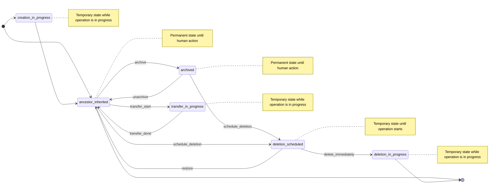

## コンテキスト

[設計ドキュメントの現在の問題点セクション](../index.md#モチベーション)に詳述されているように、グループとプロジェクトは現在、ユーザー体験の低下、サポート負担の増大、監査とコンプライアンスの困難、および重複コードによるメンテナンスオーバーヘッドを引き起こす一貫性のない状態管理実装を持っています。

## 決定事項

すべてのネームスペースタイプのための統一状態管理システムを以下を使用して実装します：

1. **コア状態モデル**：

   - `namespaces.state`（SMALLINT）- 状態識別子
   - `namespace_details.state_metadata`（JSONB）- 関連するメタデータ

2. **標準化された状態**：

   - `0` - active（デフォルト状態で制限なし、ancestor_inherited とも呼ばれる）
   - `1` - archived（アーカイブ済みだが回復可能）
   - `2` - deletion_scheduled（猶予期間付きで削除にマーク済み）
   - `3` - creation_in_progress（現在作成中）
   - `4` - deletion_in_progress（現在削除中）
   - `5` - transfer_in_progress（現在移転中）
   - `6` - maintenance（メンテナンスモード。アーカイブに似ているが、ある時点で以前の状態に戻すべき一時的な状態）

3. **状態メタデータ構造：**

    ```json
    {
      "last_updated_at": "2025-05-26T10:00:00Z",
      "last_changed_by_user_id": 12345,
      "last_error": "Transfer failed: insufficient permissions"
    }
    ```

    JSON スキーマはデータの一貫性とメンテナビリティを確保するためにバリデーションされます：

    ```ruby
    validates :state_metadata, json_schema: { filename: "namespace_state_metadata" }
    ```

### 状態遷移



### 実装アプローチ

```ruby
module Namespaces
  module Stateful
    extend ActiveSupport::Concern

    included do
      STATES = {
        ancestor_inherited: 0,
        archived: 1,
        deletion_scheduled: 2,
        creation_in_progress: 3,
        deletion_in_progress: 4,
        transfer_in_progress: 5,
        maintenance: 6
      }.with_indifferent_access.freeze

      state_machine :state, initial: :ancestor_inherited, initialize: false do
        event :creation_done do
          transition creation_in_progress: :ancestor_inherited
        end

        event :archive do
          transition :ancestor_inherited => :archived
        end

        event :unarchive do
          transition archived: :ancestor_inherited
        end

        event :schedule_deletion do
          transition [:ancestor_inherited, :archived] => :deletion_scheduled
        end

        event :restore do
          transition deletion_scheduled: :ancestor_inherited
        end

        event :deletion_start do
          transition deletion_scheduled: :deletion_in_progress
        end

        event :transfer_start do
          transition ancestor_inherited: :transfer_in_progress
        end

        event :transfer_done do
          transition transfer_in_progress: :ancestor_inherited
        end

        event :maintain do
          transition ancestor_inherited: :maintenance
        end

        event :unmaintain do
          transition maintenance: any
        end

        state :ancestor_inherited, value: STATES[:ancestor_inherited]
        state :archived, value: STATES[:archived]
        state :deletion_scheduled, value: STATES[:deletion_scheduled]
        state :creation_in_progress, value: STATES[:creation_in_progress]
        state :deletion_in_progress, value: STATES[:deletion_in_progress]
        state :transfer_in_progress, value: STATES[:transfer_in_progress]
        state :maintenance, value: STATES[:maintenance]
      end
    end
  end
end
```

## 結果

### ポジティブな結果

- **一貫性**：すべてのネームスペースタイプにわたる統一された動作
- **パフォーマンス**：子孫への状態伝播により、祖先ルックアップなしに高速読み取りが可能
- **メンテナビリティ**：状態管理の単一コードベースにより重複が削減
- **スケーラビリティ**：重い状態変更のための非同期操作をサポート

### 技術的な結果

- **データベースの変更**：既存テーブルへの新しいカラムとインデックスの追加が必要
- **移行の複雑さ**：履歴データのバックフィルに段階的な移行アプローチが必要
- **API の互換性**：移行期間中に後方互換性を維持する必要がある
- **ステートマシンの実装**：バリデーションガードを持つ状態遷移の実装が必要

## 代替案

### 代替案 1：タイプごとの個別状態テーブル

- **メリット**：関心の明確な分離、タイプ固有の最適化
- **デメリット**：現在の一貫性のなさを維持、重複したロジック、統一されたクエリが不可能

### 代替案 2：イベントソーシングアプローチ

- **メリット**：完全な監査証跡、タイムトラベル機能
- **デメリット**：大幅な複雑性の増加、パフォーマンスオーバーヘッド、急な学習曲線

### 代替案 3：何もしない

- **メリット**：開発努力不要、移行リスクなし
- **デメリット**：パフォーマンス問題が継続、一貫性のなさが続く、技術的負債が蓄積
