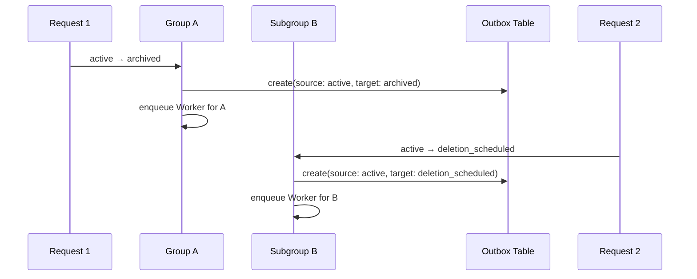
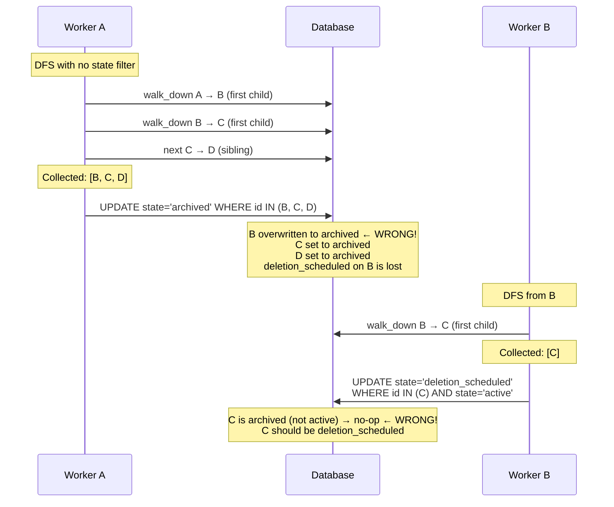
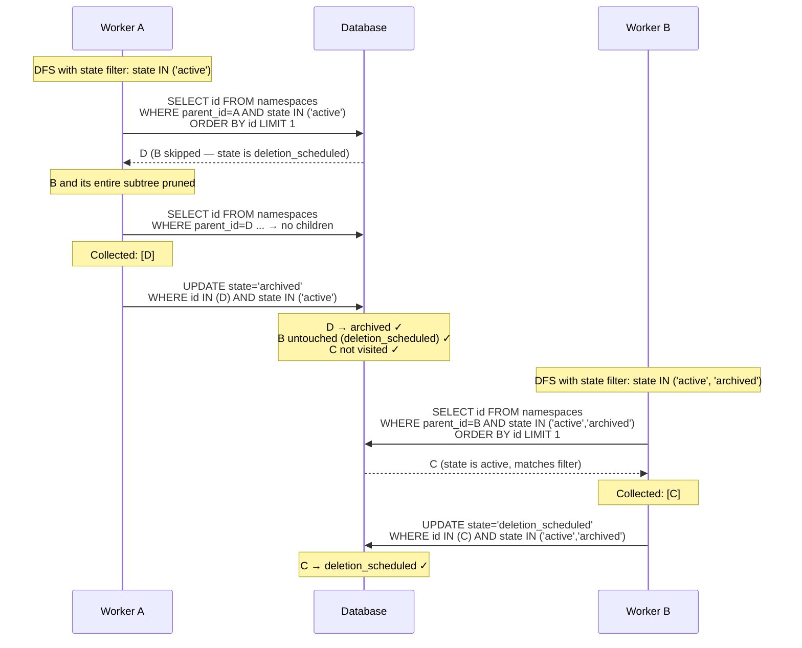
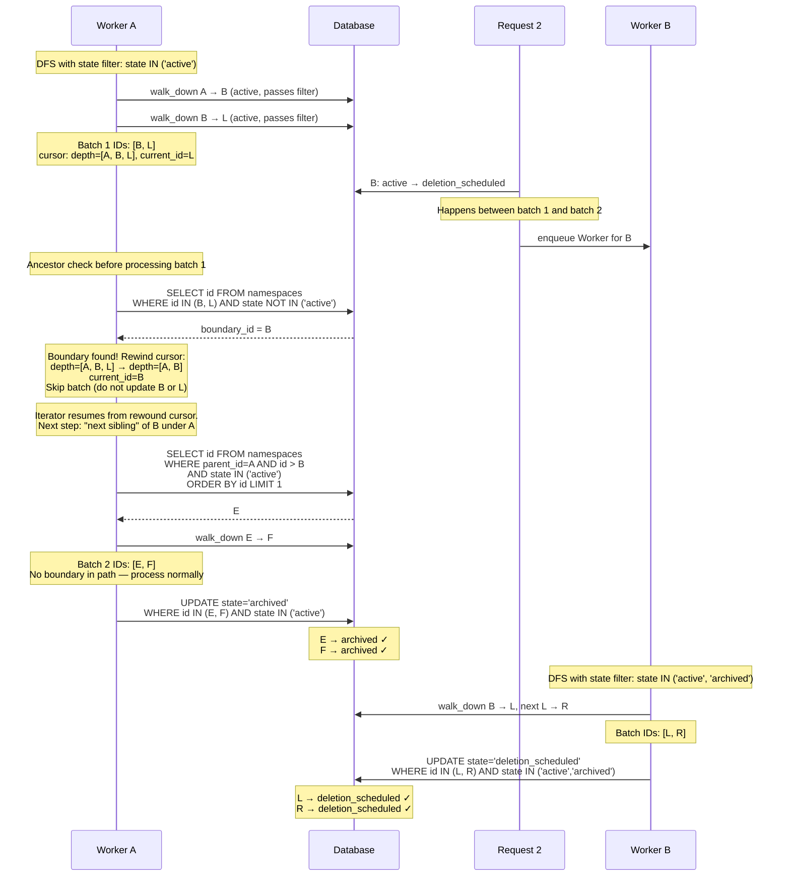

## コンテキスト

GitLab の階層的なネームスペース構造（Organization > Group > Subgroup > Project）において、状態管理は継承を効率的に処理する必要があります。現在のアプローチにはいくつかの問題があります：

- 子孫の状態が祖先から一貫性なく推論されることがある
- 階層を通じて状態がどのように伝播すべきかの明確なルールがない
- すべての子孫に状態変更を伝播することのパフォーマンス上の懸念
- 大規模な階層全体で状態の一貫性を維持することの複雑さ

一貫性、パフォーマンス、シンプルさのバランスをとる、状態伝播がどのように機能するかの明確なモデルが必要です。

## 決定事項

以下のルールを持つ**状態伝播モデル**を実装します：

### 状態の分類

状態は伝播動作に基づいて 2 つのカテゴリに分類されます：

1. **伝播される状態**：`active`、`archived`、`deletion_scheduled` — これらの状態はネームスペースに設定されるとすべての子孫に伝播されます。ネームスペースがこれらの状態のいずれかに移行すると、すべての子孫ネームスペースとプロジェクトが同じ状態を受け取ります。`active` 状態（`ancestor_inherited` とも呼ばれる）は制限が適用されていないデフォルト状態を表します。
2. **伝播されない状態**：`creation_in_progress`、`deletion_in_progress`、`transfer_in_progress` — これらの状態は短命な操作を表し、子孫には伝播されません。操作を実行しているネームスペースのみに適用されます。

### 状態伝播ルール

1. **遷移時の伝播**：ネームスペースが伝播される状態（`active`、`archived`、または `deletion_scheduled`）に移行すると、その状態はすべての子孫ネームスペースとプロジェクトに書き込まれます。例えば、グループをアーカイブするとすべての子孫がアーカイブされ、アーカイブ解除（`active` への移行）するとすべての子孫が復元されます。
2. **伝播境界**：伝播は、すでに異なる伝播状態を持つ子孫に遭遇すると停止します。例えば、`archived` の祖先の中に `deletion_scheduled` のネームスペースがある場合、祖先のアーカイブ解除は `deletion_scheduled` ネームスペースまで — ただしそれを通り越しては — `active` を伝播します。`deletion_scheduled` ネームスペースとその子孫は自身の状態を保持します。これにより、階層内で明示的に設定された状態が保持されます。
3. **トランザクショナルアウトボックスによる信頼性の高い非同期伝播**：伝播はデリバリーを保証するために[トランザクショナルアウトボックスパターン](https://microservices.io/patterns/data/transactional-outbox.html)を使用します。ネームスペースが伝播される状態に移行すると、状態変更と**同じデータベーストランザクション**で `namespace_state_propagation` レコードが作成されます。このレコードは `source_state`（遷移前の状態）と `target_state`（遷移後の状態）を `status: pending` とともにキャプチャします。これにより、プロセスが Sidekiq ジョブのエンキュー前にクラッシュしても、伝播リクエストが失われないことが保証されます。その後、`Namespaces::StatePropagationWorker` がエンキューされ、[ツリーイテレーター](https://docs.gitlab.com/development/database/poc_tree_iterator/)を使用して子孫をバッチ処理する実際の伝播を行います。ツリーイテレーターは `parent_id` カラムを使用したカーソルベースのバッチ処理と深さ優先探索の再帰的 CTE を使用し、非常に大規模な階層でもタイムアウトなしに安全に処理できます（大規模グループでタイムアウトする可能性がある `traversal_ids` ベースのクエリとは異なります）。ワーカーは開始時にアウトボックスレコードを `processing` に移行し、完了時に削除します。
4. **CRON ベースの調整**：`Namespaces::StatePropagationCronWorker` が数分ごとに実行され、ピックアップされなかったか実行中に停止した伝播をキャッチします。`processing` レコードについては、Sidekiq の重複排除ロックをチェックして、ワーカーがまだアクティブに実行中かどうかを判断します。ロックが期限切れの場合（つまり、そのネームスペースとターゲット状態に対してジョブが実行中またはキューに入っていない場合）、レコードは `pending` にリセットされます。その後、すべての `pending` レコードが再エンキューされます。伝播ワーカーは Sidekiq `deduplicate :until_executed` を使用するため、同じネームスペースとターゲット状態のジョブがすでにキューに入っているか実行中の場合、重複したエンキューは安全にドロップされます。このアプローチにより、固定時間の閾値を避けられます — ジョブが経過時間に基づいて古いかどうかを推測する代わりに、実際の Sidekiq ジョブの状態を確認します。
5. **伝播後の副作用**：子孫が新しい状態にあることに依存するアクションは、伝播が完了した後にのみ発生する必要があります。これにはドメインイベント（例：`GroupArchivedEvent`、`ProjectArchivedEvent`）、コールバック、Webhook、および任意のダウンストリーム処理が含まれます。例えば、`GroupArchivedEvent` は、すべての子孫ネームスペースとプロジェクトがアーカイブされた後にのみ公開されるべきで、イベントに反応するサブスクライバーがイベント発生時に階層全体がすでに期待される状態にあると仮定できるようにします。伝播が完了する前に副作用をトリガーすると、コンシューマーが階層全体で一貫性のない状態を観測する競合状態を引き起こす可能性があります。
6. **書き込み時の祖先バリデーション**：伝播により読み取り時の祖先ルックアップが不要になりますが、書き込み時には祖先の状態をバリデーションする必要があります。状態遷移ガードは遷移を許可する前に親の状態を確認する必要があります。例えば、親がまだアーカイブされている場合、子孫をアーカイブ解除することはできません。これにより、すべての読み取り操作での祖先走査を必要とせずに階層の一貫性が維持されます。
7. **ツリーイテレーターでの境界強制**：伝播された状態は優先順位があります：`deletion_scheduled`（最高）> `archived` > `active`（最低）。伝播ワーカーはルール 2（伝播境界）を 3 つのレイヤーで強制します：
    - **走査の刈り込み**：[`Gitlab::Database::NamespaceEachBatch`](https://gitlab.com/gitlab-org/gitlab/-/blob/master/lib/gitlab/database/namespace_each_batch.rb) のサブクラス（`Namespaces::StatePropagationIterator`）が `walk_down` と `next_elements` メソッドをオーバーライドして、再帰的 CTE の LATERAL サブクエリに状態フィルター（`AND state IN (overwritable_states)`）を追加します。これにより、DFS が同等以上の優先度を持つネームスペースをスキップし、サブツリー全体を走査から刈り込みます。
    - **カーソル巻き戻しを伴うバッチごとの祖先チェック**：各バッチ更新の前に、ワーカーはカーソルの `depth` パスにあるネームスペースが上書き不可能な状態に同時に変更されたかどうかをチェックします。パスの途中で境界が見つかった場合、ワーカーはバッチをスキップし、**カーソルを巻き戻します** — 深さを境界の親にトリミングし、`current_id` を境界ネームスペースに設定します。これにより、ツリーイテレーターの次のバッチが境界ネームスペースの次の兄弟から再開し、境界サブツリー全体を効果的にスキップします。その後、イテレーターは残りの影響を受けていないサブツリーへの DFS を継続します。
    - **条件付き UPDATE**：バッチ UPDATE には、祖先チェックと更新の間の同時変更に対する最終的な安全ネットとして `WHERE state IN (overwritable_states)` 句が含まれます。
8. **伝播中の状態保持**：伝播が子孫の状態を上書きする場合、子孫の以前の状態が `state_metadata` に保持されます（[ADR 006: 状態保持](006_state_preservation.md) を参照）。これにより、親操作がキャンセルされた場合、子孫をデフォルト状態ではなく元の状態に復元できます。例えば、サブグループ B が `archived` で、親 A が削除をスケジュールした場合、伝播は B を `deletion_scheduled` に設定しながら B の `state_metadata` に `archived` を保持します。A が後で削除をキャンセルした場合、B は（`active` ではなく）`archived` に復元されます。`active`（復元/アーカイブ解除）を伝播する場合、子孫はデフォルト状態に復元されるため、保持された状態はクリアされます。

#### 同時伝播 — 競合状態と解決策

Group A が Subgroup B、Project D を含み、Subgroup B が Project C を含むこの階層を考えます：

```plaintext
         Group A (active)
         ├── Subgroup B (active)
         │   └── Project C (active)
         └── Project D (active)
```

2 つの同時操作が発生します — Group A がアーカイブされる一方、Subgroup B は独立して削除スケジュールされます：



##### 境界強制なし（不正な動作）

A のワーカーがすべての子孫を無条件に反復して更新します：



B の状態と C の状態の両方が不正な結果になります。

##### ツリーイテレーター境界強制あり（正しい動作）

A のワーカーは「ウォークダウン」と「次の兄弟」のステップに状態フィルター `AND state IN ('active')`（`archived` より低い優先度の状態のみ）を含むツリーイテレーターを使用します。DFS が B（`deletion_scheduled`、優先度 2 > 1）に遭遇すると、状態フィルターが B を除外します — イテレーターは B の中に降りず、次の兄弟に直接スキップします：



最終的な階層状態（正しい結果）：

```plaintext
         Group A (archived)
         ├── Subgroup B (deletion_scheduled)  ← preserved, DFS skipped over B
         │   └── Project C (deletion_scheduled)  ← propagated by B's worker
         └── Project D (archived)  ← propagated by A's worker
```

ツリーイテレーターの状態フィルターは DFS 走査中の自然な境界強制として機能します。イテレーターが同等以上の優先度を持つネームスペースに遭遇すると、そのサブツリーに降りません — 代わりに次の兄弟に移動します。各伝播ワーカーは自身が所有するサブツリーのみに触れ、カーソルベースのバッチ処理により大規模な階層がタイムアウトなしに安全に処理されます。

##### 走査中の境界（カーソル巻き戻し）

走査の刈り込みは、A のワーカーが B を訪問する前に B の状態がすでに変更されているケースを処理します。しかし、A のワーカーがすでに B のサブツリーに入った**後**に B が状態を変更したらどうなるでしょうか？より大きな階層を考えます：

```plaintext
         Group A (active)
         ├── Subgroup B (active)
         │   ├── Project L (active)
         │   └── Project R (active)
         └── Subgroup E (active)
             └── Project F (active)
```



最終的な階層状態（正しい結果）：

```plaintext
         Group A (archived)
         ├── Subgroup B (deletion_scheduled)  ← changed concurrently
         │   ├── Project L (deletion_scheduled)  ← propagated by B's worker
         │   └── Project R (deletion_scheduled)  ← propagated by B's worker
         └── Subgroup E (archived)  ← propagated by A's worker
             └── Project F (archived)  ← propagated by A's worker
```

カーソル巻き戻しにより両方の問題を回避します：有効なサブツリー（E と F はバッチ 2 で処理）をスキップせず、B のサブツリーへの冗長な書き込みも行いません。カーソル深度を `[A, B]` にトリミングし `current_id=B` に設定することで、ツリーイテレーターの「次の兄弟」ステップが自然に E（B の後の A の次の子）を見つけ、そこから DFS を継続します。

### 状態バリデーションガード

バリデーションガードは、ユーザーにとって混乱を招く状態の組み合わせを防ぎます。これらのバリデーションルールは、親状態、自己状態、子状態の 3 つのレイヤーにわたる状態遷移を管理します。

以下のテーブルはすべての可能な状態遷移と、それが許可されているか拒否されているかを示します：

#### すべての状態遷移

| **新しい状態**           | **古い状態: active**     | **古い状態: archived**    | **古い状態: creation_in_progress** | **古い状態: deletion_in_progress** | **古い状態: deletion_scheduled** | **古い状態: transfer_in_progress** |
|--------------------------|--------------------------|---------------------------|-------------------------------------|-------------------------------------|-----------------------------------|-------------------------------------|
| **active**               | -                        | :white_check_mark: 許可   | :white_check_mark: 許可             | :white_check_mark: 許可             | :white_check_mark: 許可           | :white_check_mark: 許可             |
| **archived**             | :white_check_mark: 許可  | -                         | :x: 拒否                            | :white_check_mark: 許可             | :white_check_mark: 許可           | :white_check_mark: 許可             |
| **creation_in_progress** | :x: 拒否                 | :x: 拒否                  | -                                   | :x: 拒否                            | :x: 拒否                          | :x: 拒否                            |
| **deletion_in_progress** | :x: 拒否                 | :x: 拒否                  | :white_check_mark: 許可             | -                                   | :white_check_mark: 許可           | :x: 拒否                            |
| **deletion_scheduled**   | :white_check_mark: 許可  | :white_check_mark: 許可   | :x: 拒否                            | :white_check_mark: 許可             | -                                 | :x: 拒否                            |
| **transfer_in_progress** | :white_check_mark: 許可  | :white_check_mark: 許可   | :x: 拒否                            | :x: 拒否                            | :x: 拒否                          | -                                   |

#### 有効な状態遷移

| 許可された遷移                              | 注記/理由                                                                                          |
|---------------------------------------------|----------------------------------------------------------------------------------------------------|
| archived → active                           | アーカイブ解除                                                                                     |
| creation_in_progress → active               | 作成完了                                                                                           |
| deletion_in_progress → active               | 削除失敗。無限リトライループを避けるため deletion_scheduled をスキップ                             |
| deletion_scheduled → active                 | 削除からの復元                                                                                     |
| transfer_in_progress → active               | 移転完了                                                                                           |
| active → archived                           | アーカイブ                                                                                         |
| deletion_in_progress → archived             | アーカイブされたネームスペースからトリガーされた削除が失敗した。リトライループを防ぐため deletion_scheduled をスキップ |
| deletion_scheduled → archived               | アーカイブされたネームスペースからトリガーされた削除                                               |
| transfer_in_progress → archived             | アーカイブされたアイテムの移転完了を許可                                                           |
| creation_in_progress → deletion_in_progress | 致命的な作成失敗                                                                                   |
| deletion_scheduled → deletion_in_progress   | ネームスペースの削除を開始                                                                         |
| active → deletion_scheduled                 | 削除スケジュール                                                                                   |
| archived → deletion_scheduled               | アーカイブされたネームスペースの削除スケジュール                                                   |
| deletion_in_progress → deletion_scheduled   | 削除失敗。リトライのためにキューに再追加                                                           |
| active → transfer_in_progress               | ネームスペースを移転                                                                               |
| archived → transfer_in_progress             | アーカイブされたネームスペースを移転                                                               |

#### 無効な状態遷移

| 拒否された遷移                              | 注記/理由                                                                                 |
|---------------------------------------------|-------------------------------------------------------------------------------------------|
| creation_in_progress → archived             | アーカイブ前に active に遷移する必要がある                                                |
| active → creation_in_progress               | active になった後は creation_in_progress に戻せない。creation_in_progress は新規のみに使用 |
| archived → creation_in_progress             | creation_in_progress に戻せない                                                           |
| deletion_in_progress → creation_in_progress | creation_in_progress に戻せない                                                           |
| deletion_scheduled → creation_in_progress   | creation_in_progress に戻せない                                                           |
| transfer_in_progress → creation_in_progress | creation_in_progress に戻せない                                                           |
| active → deletion_in_progress               | 最初に deletion_scheduled を経由する必要がある                                            |
| archived → deletion_in_progress             | 最初に deletion_scheduled を経由する必要がある                                            |
| transfer_in_progress → deletion_in_progress | 永続削除前に移転を完了する必要がある                                                      |
| creation_in_progress → deletion_scheduled   | 削除スケジュールは作成成功後のみ許可                                                      |
| transfer_in_progress → deletion_scheduled   | 削除スケジュールは移転成功後のみ許可                                                      |
| creation_in_progress → transfer_in_progress | 移転は作成成功後のみ許可                                                                  |
| deletion_in_progress → transfer_in_progress | 削除進行中は移転不可                                                                      |
| deletion_scheduled → transfer_in_progress   | 削除スケジュール中は移転不可                                                              |

#### 状態遷移の概要

許可された各遷移について、状態階層全体の依存関係を検証しました。以下は、満たす必要がある親と子の状態要件とともに許可された遷移を示します：

| 遷移                                        | 親チェック                                                                               | 親チェックの注記                                                                                | 子チェック                                         | 子チェックの注記                                                                          |
|---------------------------------------------|------------------------------------------------------------------------------------------|-------------------------------------------------------------------------------------------------|----------------------------------------------------|-------------------------------------------------------------------------------------------|
| archived → active                           | NOT archived, NOT deletion_in_progress, NOT deletion_scheduled                           | 親はアーカイブ、deletion_in_progress、または deletion_scheduled であってはならない              | -                                                  | 子はアーカイブ解除を継承するか active になる                                              |
| creation_in_progress → active               | -                                                                                        | 親状態は作成完了を制限しない                                                                    | N/A（まだ子が存在しない）                          | creation_in_progress 中は子が存在しない                                                   |
| deletion_in_progress → active               | -                                                                                        | ユーザーが削除してアクセスを失うなど致命的なケースで許可                                        | -                                                  | 回復シナリオで許可                                                                        |
| deletion_scheduled → active                 | -                                                                                        | 復元アクション - 親制限なし                                                                     | -                                                  | 子は以前の状態に復元される                                                                |
| transfer_in_progress → active               | -                                                                                        | 移転成功完了                                                                                    | -                                                  | 移転完了 - 子は自身の状態を維持                                                           |
| active → archived                           | NOT archived, NOT deletion_in_progress, NOT deletion_scheduled, NOT transfer_in_progress | 親はアーカイブ、deletion_in_progress、deletion_scheduled、transfer_in_progress であってはならない | NOT creation_in_progress, NOT transfer_in_progress | creation_in_progress または transfer_in_progress の子は親のアーカイブをブロックする       |
| deletion_in_progress → archived             | NOT archived                                                                             | 親はすでにアーカイブ済み、代わりに active を使用                                                | -                                                  | アーカイブ状態への復元として許可                                                          |
| deletion_scheduled → archived               | NOT archived                                                                             | 親はすでにアーカイブ済み、代わりに active を使用                                                | -                                                  | アーカイブ状態への復元として許可                                                          |
| transfer_in_progress → archived             | -                                                                                        | アーカイブされたネームスペースの移転成功完了                                                    | -                                                  | 移転完了 - 子は自身の状態を維持                                                           |
| creation_in_progress → deletion_in_progress | -                                                                                        | 致命的な作成失敗時のクリーンアップ                                                              | -                                                  | creation_in_progress 中は子が存在しない                                                   |
| deletion_scheduled → deletion_in_progress   | -                                                                                        | 猶予期間後に削除プロセスを開始                                                                  | -                                                  | すべての子状態が許可                                                                      |
| active → deletion_scheduled                 | NOT deletion_in_progress, NOT deletion_scheduled, NOT transfer_in_progress               | 親は deletion_in_progress、deletion_scheduled、transfer_in_progress であってはならない          | NOT creation_in_progress, NOT transfer_in_progress | creation_in_progress または transfer_in_progress の子は親の削除スケジュールをブロックする |
| archived → deletion_scheduled               | NOT deletion_in_progress, NOT deletion_scheduled, NOT transfer_in_progress               | 親は deletion_in_progress、deletion_scheduled、transfer_in_progress であってはならない          | NOT creation_in_progress, NOT transfer_in_progress | creation_in_progress または transfer_in_progress の子は親の削除スケジュールをブロックする |
| deletion_in_progress → deletion_scheduled   | -                                                                                        | リトライのための削除失敗ロールバック                                                            | -                                                  | ロールバックシナリオ - すべての子状態が許可                                               |
| active → transfer_in_progress               | NOT deletion_in_progress, NOT deletion_scheduled, NOT transfer_in_progress               | 親は active または archived である必要がある                                                    | すべての子は active または archived のみ           | すべての子は active または archived である必要がある                                      |
| archived → transfer_in_progress             | NOT deletion_in_progress, NOT deletion_scheduled, NOT transfer_in_progress               | 親は active または archived である必要がある                                                    | すべての子は active または archived のみ           | すべての子は active または archived である必要がある                                      |

### 実装アプローチ

#### アウトボックステーブル

`namespace_state_propagations` テーブルはトランザクショナルアウトボックスとして機能します：

```sql
CREATE TABLE namespace_state_propagations (
  id BIGSERIAL PRIMARY KEY,
  namespace_id BIGINT NOT NULL REFERENCES namespaces(id) ON DELETE CASCADE,
  source_state SMALLINT NOT NULL,
  target_state SMALLINT NOT NULL,
  status SMALLINT NOT NULL DEFAULT 0, -- 0: pending, 1: processing
  started_at TIMESTAMPTZ,
  created_at TIMESTAMPTZ NOT NULL DEFAULT NOW(),
  updated_at TIMESTAMPTZ NOT NULL DEFAULT NOW()
);

CREATE INDEX idx_propagations_pending ON namespace_state_propagations (status, created_at);
CREATE UNIQUE INDEX idx_propagations_unique ON namespace_state_propagations (namespace_id, target_state)
  WHERE status IN (0, 1);
```

#### アウトボック書き込みを伴うステートマシン

```ruby
module Namespaces
  module Stateful
    extend ActiveSupport::Concern

    PROPAGATED_STATES = %i[active archived deletion_scheduled].freeze
    NON_PROPAGATED_STATES = %i[creation_in_progress deletion_in_progress transfer_in_progress].freeze

    included do
      ...

      state_machine :state, initial: :active, initialize: false do
        ...

        before_transition any => :active do |namespace|
          if namespace.ancestor_archived?
            raise StateMachine::InvalidTransition, "Cannot unarchive when ancestor is archived"
          end
        end

        before_transition any => :archived do |namespace|
          if namespace.ancestor_deletion_scheduled?
            raise StateMachine::InvalidTransition, "Cannot archive when ancestor is scheduled for deletion"
          end
        end

        after_transition any => PROPAGATED_STATES do |namespace, transition|
          Namespaces::StatePropagation.create!(
            namespace_id: namespace.id,
            source_state: transition.from,
            target_state: transition.to,
            status: :pending
          )

          Namespaces::StatePropagationWorker.perform_async(namespace.id, transition.to)
        end

        ...
      end
    end
  end
end
```

#### 伝播ワーカー

伝播ワーカーは冪等であり、`until_executed` を使用して重複排除されているため、ネームスペースとターゲット状態ごとに 1 つのジョブのみが同時に実行されます。カーソルベースの DFS バッチ処理に [`Gitlab::Database::NamespaceEachBatch`](https://gitlab.com/gitlab-org/gitlab/-/blob/master/lib/gitlab/database/namespace_each_batch.rb) のサブクラスを使用し、状態フィルターで伝播境界を強制します（ルール 7 を参照）。

`walk_down` と `next_elements` メソッドをオーバーライドして LATERAL サブクエリに `AND state IN (overwritable_states)` を追加するサブクラスを作成します。これにより DFS が同等以上の優先度状態を持つネームスペースをスキップし、サブツリー全体を走査から刈り込みます：

```ruby
module Namespaces
  class StatePropagationIterator < Gitlab::Database::NamespaceEachBatch
    def initialize(namespace_class:, cursor:, state_filter:)
      super(namespace_class: namespace_class, cursor: cursor)
      @state_filter = state_filter
    end

    private

    attr_reader :state_filter

    def walk_down
      lateral_query = namespace_class
        .select(*lateral_query_columns)
        .where('parent_id = cte.current_id')
        .where(state: state_filter)
        .order(:id)
        .limit(1)

      base_namespace_class.select(
        base_namespace_class.arel_table[:id].as('current_id'),
        Arel.sql("cte.depth || #{base_namespace_table}.id::bigint").as('depth'),
        Arel.sql(type_filtered_ids_append).as('ids'),
        Arel.sql('cte.count + 1').as('count'),
        Arel.sql('1::bigint AS index')
      ).from("cte, LATERAL (#{lateral_query.to_sql}) #{base_namespace_table}")
    end

    def next_elements
      lateral_query = namespace_class
        .select(*lateral_query_columns)
        .where("#{base_namespace_table}.parent_id = cte.depth[array_length(cte.depth, 1) - 1]")
        .where("#{base_namespace_table}.id > cte.depth[array_length(cte.depth, 1)]")
        .where(state: state_filter)
        .order(:id)
        .limit(1)

      base_namespace_class.select(
        base_namespace_class.arel_table[:id].as('current_id'),
        Arel.sql("cte.depth[:array_length(cte.depth, 1) - 1] || #{base_namespace_table}.id::bigint").as('depth'),
        Arel.sql(type_filtered_ids_append).as('ids'),
        Arel.sql('cte.count + 1').as('count'),
        Arel.sql('2::bigint AS index')
      ).from("cte, LATERAL (#{lateral_query.to_sql}) #{base_namespace_table}")
    end
  end
end
```

伝播ワーカーはこのイテレーターを使用します：

```ruby
module Namespaces
  class StatePropagationWorker
    include ApplicationWorker

    idempotent!
    deduplicate :until_executed, including_scheduled: true

    STATE_PRECEDENCE = { active: 0, archived: 1, deletion_scheduled: 2 }.freeze

    def perform(namespace_id, target_state)
      propagation = Namespaces::StatePropagation.find_by!(
        namespace_id: namespace_id,
        target_state: target_state,
        status: :pending
      )

      propagation.update!(status: :processing, started_at: Time.current)

      overwritable = overwritable_states(propagation.source_state, propagation.target_state)

      iterator = Namespaces::StatePropagationIterator.new(
        namespace_class: Namespace,
        cursor: { current_id: namespace_id, depth: [namespace_id] },
        state_filter: overwritable
      )

      iterator.each_batch(of: 500) do |ids, cursor|
        # 祖先チェック：カーソルの depth 配列は伝播元から
        # 現在の位置への DFS パスを保持します。イテレーターが
        # サブツリーに入った後に、パスにある祖先が同時に
        # 上書き不可能な状態に遷移したかどうかを確認します
        # （例：deletion_scheduled がイテレーターがサブツリーに
        # 入った後に出現した場合など）。
        ancestors_in_path = cursor[:depth] - [namespace_id]
        boundary_id = Namespace.where(id: ancestors_in_path)
                               .where.not(state: overwritable)
                               .order(:id).pick(:id)

        if boundary_id
          # カーソルを巻き戻す：深さを境界の親にトリミングし、
          # current_id を境界に設定します。ツリーイテレーターの
          # 「次の兄弟」ステップは境界の次の兄弟から再開し、
          # 境界サブツリー全体をスキップします。
          boundary_index = cursor[:depth].index(boundary_id)
          cursor[:depth] = cursor[:depth][0..boundary_index]
          cursor[:current_id] = boundary_id
          next
        end

        # 条件付き更新：祖先チェックとこの更新の間の
        # 同時変更に対する安全ネットとして、依然として
        # 低い優先度の状態にあるネームスペースのみを上書きします。
        Namespace.where(id: ids, state: overwritable)
                 .update_all(state: propagation.target_state)
      end

      propagation.destroy!
    end

    private

    def overwritable_states(source_state, target_state)
      target = STATE_PRECEDENCE.fetch(target_state.to_sym)
      source = STATE_PRECEDENCE.fetch(source_state.to_sym)

      if target == 0
        # active を伝播：どの子孫を上書きするかはソース状態
        # （親が何から遷移したか）に依存します。
        #
        # アーカイブ解除（archived → active）：アーカイブされた
        # 子孫のみを上書きします。deletion_scheduled で停止
        #（伝播境界、ルール 2）— それらは明示的にスケジュールされており、
        # 暗黙的に復元すべきではありません。
        #
        # 復元（deletion_scheduled → active）：削除スケジュールと
        # アーカイブの子孫の両方を上書きします。サブツリー全体が
        # 復元されるべきだからです。
        STATE_PRECEDENCE.select { |_, v| v > 0 && v <= source }.keys
      else
        # アーカイブまたは deletion_scheduled を伝播：厳密に
        # 低い優先度のすべての状態を上書きします。
        STATE_PRECEDENCE.select { |_, v| v < target }.keys
      end
    end
  end
end
```

#### CRON 調整ワーカー

CRON ワーカーは失われたか停止した伝播ジョブをキャッチします：

```ruby
module Namespaces
  class StatePropagationCronWorker
    include ApplicationWorker
    include CronjobQueue

    def perform
      # processing レコードを確認：Sidekiq の重複排除ロックが
      # 期限切れの場合、ワーカーはもはや実行中ではありません —
      # 再エンキューできるよう pending にリセットします。
      # これにより、経過時間ではなく実際のジョブ状態を
      # 確認することで固定時間の閾値を避けられます。
      Namespaces::StatePropagation.where(status: :processing).find_each do |propagation|
        unless job_deduplicated?(propagation)
          propagation.update!(status: :pending, started_at: nil)
        end
      end

      # すべての pending 伝播を再エンキューします。Sidekiq の
      # 重複排除により、同時に重複したジョブが実行されないことが
      # 保証されます。
      Namespaces::StatePropagation.where(status: :pending).find_each do |propagation|
        Namespaces::StatePropagationWorker.perform_async(
          propagation.namespace_id,
          propagation.target_state
        )
      end
    end

    private

    def job_deduplicated?(propagation)
      Gitlab::SidekiqMiddleware::DuplicateJobs::DuplicateJob.new(
        { 'class' => 'Namespaces::StatePropagationWorker',
          'args' => [propagation.namespace_id, propagation.target_state] },
        'default'
      ).duplicate?
    end
  end
end
```

## 結果

### ポジティブな結果

- **高速読み取り**：状態は各ネームスペースに直接格納されます — 実効状態の判定に祖先の走査は不要
- **一貫性**：子孫は常に親の伝播された状態を反映し、古いまたは一貫性のない読み取りを排除
- **クエリのシンプルさ**：状態チェックは単純なカラム比較（例：`WHERE state = 'archived'`）であり、結合や再帰的ルックアップは不要
- **一時状態の分離**：進行中の操作は操作を行うネームスペースにスコープされ、不必要な伝播を避ける
- **信頼性の高いデリバリー**：トランザクショナルアウトボックスパターンにより、伝播が静かに失われることがないことを保証します — アウトボックスレコードは状態変更とアトミックにコミットされ、CRON 調整ワーカーはエンキューに失敗したり実行中に停止したジョブをキャッチします
- **観測可能性**：`namespace_state_propagations` テーブルにより、保留中と進行中の伝播のクエリ可能なレコードが提供され、監視とデバッグが可能。完了時にレコードが削除されるため、テーブルを小さく保てます

### 技術的な結果

- **書き込み増幅**：状態変更の伝播にはすべての子孫の更新が必要であり、大規模な階層では高コストになりえる
- **一時状態の保持**：伝播は進行中の操作を中断しないよう、伝播されない状態（`_in_progress`）にある子孫をスキップする必要がある
- **バリデーションの複雑さ**：状態遷移ガードは祖先と子孫の状態を確認する必要がある
- **移行の複雑さ**：既存の状態データは新しいモデルへの慎重な移行が必要

## 代替案

### 代替案 1：ルックアップベースの継承

読み取り時に祖先階層を上向きに走査することで実効状態を判断します。

- **メリット**：伝播書き込みが不要、シンプルな状態遷移
- **デメリット**：読み取り時のクエリオーバーヘッド、キャッシングが必要、すべての状態チェックで祖先ルックアップが必要

### 代替案 2：継承なし

各ネームスペースが独自に状態を管理します。

- **メリット**：シンプルな実装、継承の複雑さなし
- **デメリット**：一貫性のないユーザー体験、組織全体のポリシーを適用する方法がない

### 代替案 3：イベント駆動型継承

イベントを使用して子孫に状態変更を通知します。

- **メリット**：疎結合のアーキテクチャ、結果整合性
- **デメリット**：複雑なイベント処理、一時的な不整合の可能性
