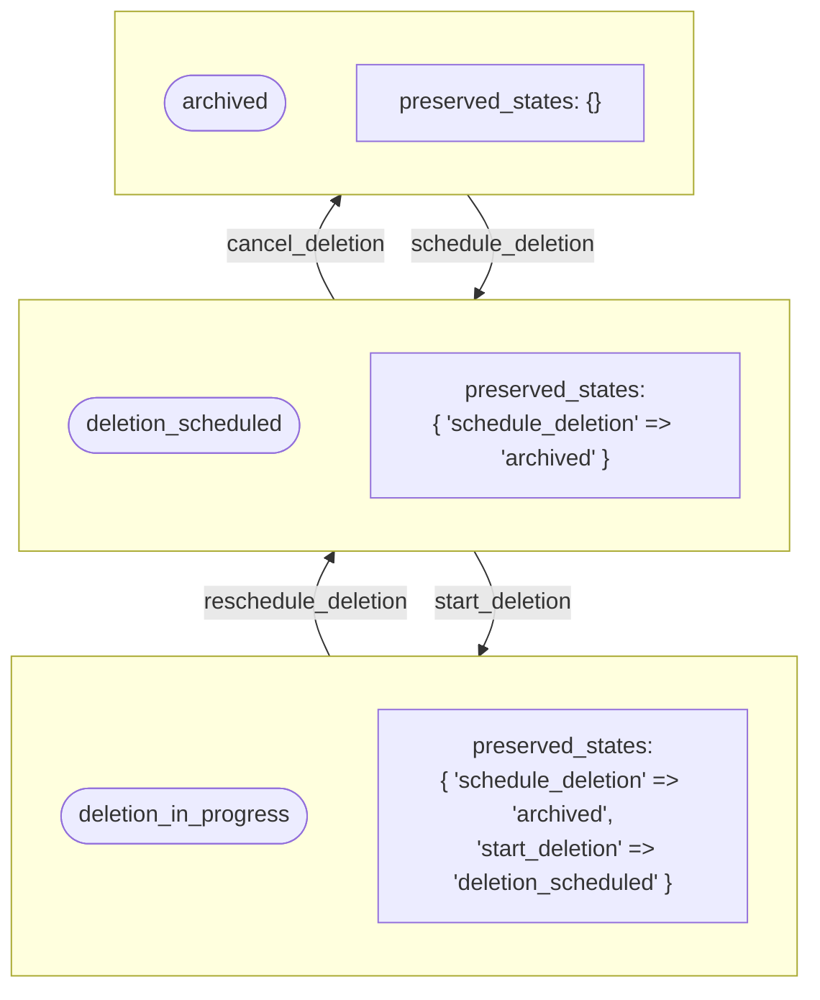
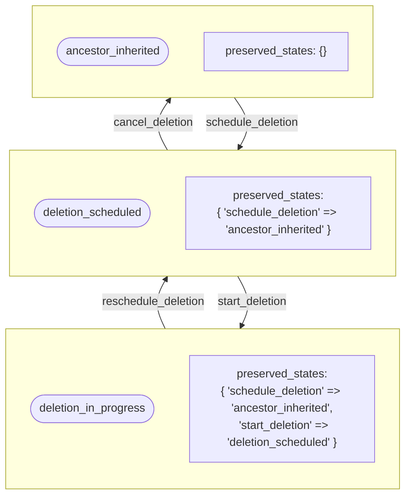

## コンテキスト

状態遷移を実行する際、特にキャンセルや障害回復のシナリオでは、システムは遷移が発生する前に名前空間がどの状態にあったかを記憶する必要があります。この機能がなければ、操作を逆転させる際に重要なコンテキストが失われます。

例えば:

1. 名前空間が `:archived` 状態にある
2. ユーザーが削除をスケジュール → 状態が `:deletion_scheduled` になる
3. ユーザーが削除をキャンセル → 保存なしでは、状態は常に `:ancestor_inherited` に戻り、アーカイブされていたという事実が失われます

これにより、アーカイブされた名前空間の削除をキャンセルすると、予期せずアーカイブが解除されるという貧弱なユーザーエクスペリエンスが生じます。

## 決定

特定の遷移中に以前の状態を自動的に保存し、対応する逆遷移が発生したときにそれを復元する**状態保存メカニズム**を実装します。

### 状態メモリの設定

どのイベントが状態を保存すべきか、および対応する復元イベントを定義します:

```ruby
STATE_MEMORY_CONFIG = {
  schedule_deletion: :cancel_deletion,
  start_deletion: :reschedule_deletion
}.freeze
```

この設定は以下をマップします:

- **保存イベント**（キー）: 状態保存をトリガーするイベント
- **復元イベント**（値）: 状態復元をトリガーするイベント

### 保存フロー

1. **保存イベント時**（例: `schedule_deletion`）:
   - 現在の状態が `state_metadata['preserved_states'][event_name]` に保存されます
   - 遷移は通常通りに進行します

2. **復元イベント時**（例: `cancel_deletion`）:
   - 保存された状態が `state_metadata` から取得されます
   - ステートマシンはガード条件を使用して正しいターゲット状態を決定します
   - 復元後、保存された状態が `state_metadata` からクリアされます

### 実装の詳細

`StatePreservation` モジュールは以下を提供します:

- **save_preserved_state(event, state_name)**: 遷移前に現在の状態を永続化します
- **clear_preserved_state(event)**: 復元後に保存された状態を削除します
- **preserved_state(event)**: 指定されたイベントに対して保存された状態を取得します
- **should_restore_to?(event, target_state)**: 保存された状態がターゲットと一致するかチェックします
- **ガードメソッド**: `restore_to_archived_on_cancel_deletion?`、`restore_to_ancestor_inherited_on_reschedule_deletion?` など

### 状態メタデータの構造

保存された状態は `state_metadata` JSONB カラムに格納されます:

```json
{
  "preserved_states": {
    "schedule_deletion": "archived",
    "start_deletion": "deletion_scheduled"
  },
  "last_updated_at": "2025-05-26T10:00:00Z",
  "last_changed_by_user_id": 12345
}
```

### ステートマシンのガード条件

ステートマシンは復元中に正しいターゲット状態を決定するためにガード条件を使用します:

```ruby
event :cancel_deletion do
  transition %i[deletion_scheduled deletion_in_progress] => :archived,
    if: :restore_to_archived_on_cancel_deletion?
  transition %i[deletion_scheduled deletion_in_progress] => :ancestor_inherited
  transition ancestor_inherited: :archived, if: :restore_to_archived_on_cancel_deletion?
  transition ancestor_inherited: :ancestor_inherited
end
```

ガード `restore_to_archived_on_cancel_deletion?` は、`schedule_deletion` から保存された状態が `:archived` であるかどうかをチェックし、ステートマシンが正しいターゲット状態にルーティングできるようにします。

## 結果

### ポジティブな結果

- **ユーザーエクスペリエンス**: 操作をキャンセルすると元の状態が保存され、予期しない状態変更を防ぎます
- **データ整合性**: コンテキストを失うことなく正確な状態履歴を維持します
- **柔軟性**: 適切な復元を伴う複雑な状態遷移をサポートします
- **監査可能性**: 保存された状態は監査証跡のための追加コンテキストを提供します

### 技術的な結果

- **メタデータの複雑性**: `state_metadata` 構造に複雑性を追加します
- **ガード条件**: ステートマシンの定義に複数のガード条件が必要です
- **テスト**: 保存と復元フローのための追加テストシナリオが必要です
- **移行**: 保存された状態を入力するために既存データの移行が必要です

## 代替案

### 代替案 1: 常にデフォルト状態に復元する

- **長所**: よりシンプルな実装、メタデータの追跡が不要
- **短所**: 貧弱なユーザーエクスペリエンス、コンテキストの喪失、予期しない状態変更

### 代替案 2: 完全な状態履歴を保存する

- **長所**: 完全な監査証跡、以前の状態に復元する能力
- **短所**: ストレージの増加、より複雑なクエリ、潜在的なパフォーマンスへの影響

### 代替案 3: 手動での状態指定

- **長所**: 復元ターゲットの明示的な制御
- **短所**: ユーザー入力が必要、貧弱な UX、エラーが発生しやすい

## 例

### 例 1: archived → deletion_scheduled → deletion_in_progress → deletion_scheduled → archived



### 例 2: active → deletion_scheduled → deletion_in_progress → deletion_scheduled → active


