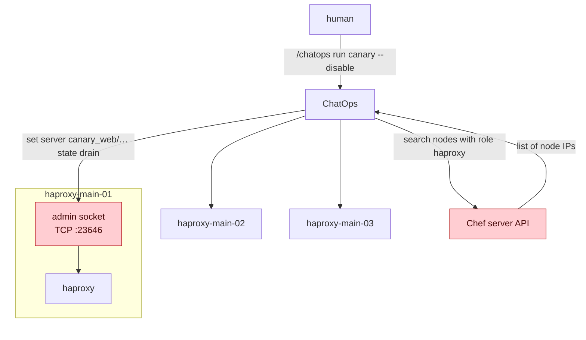
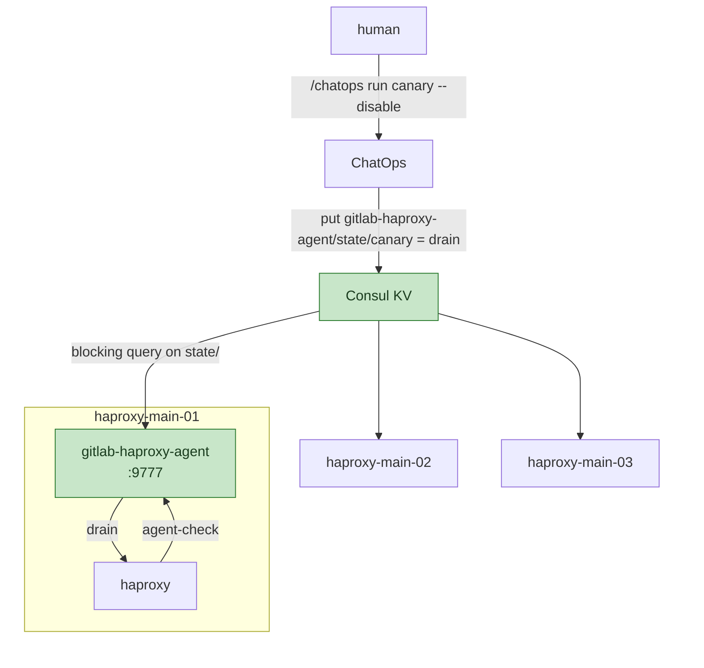

<!-- vale gitlab.FutureTense = NO -->



## ステータス {#status}

実装済みです。GitLab.com の HAProxy サーバーの状態は、Consul KV に保存された望ましい状態として管理し、
[gitlab-haproxy-agent](https://gitlab.com/gitlab-com/gl-infra/gitlab-haproxy-agent)が
HAProxy の `agent-check` を通じて各ロードバランサーに適用します。ChatOps、SRE ツール、デプロイヤーは、
状態を変更するためにロードバランサーへ接続することがなくなりました。
`gstg`、`gprd`、`pre` のすべてのノードから、TCP 管理リスナーとサーバー状態ファイルを削除しました。
作業の記録は
[production-engineering#29645](https://gitlab.com/gitlab-com/gl-infra/production-engineering/-/work_items/29645)にあります。
運用ドキュメントは[エージェントのランブック](https://runbooks.gitlab.com/frontend/agent/)にあります。

## 概要 {#summary}

この変更前は、HAProxy 群に対するカナリアのドレインとゾーン単位のサーバードレインは、
外部からすべてのロードバランサーに接続して実行していました。各ノードは自分の IP に管理ソケットをバインドし、
ChatOps は Chef サーバー API でノードのアドレスを検索して、それぞれに TCP 接続を開き、
`set server ... state` を発行していました。状態は各 HAProxy プロセスのメモリ内にしか存在しないため、
リロードするとリセットされ、新しいノードはその状態を持たずに起動します。
リロードをまたいで状態を保持するためのサーバー状態ファイル自体も、インシデントの原因になっていました。

この変更では、望ましい状態を HAProxy プロセスから Consul KV に移し、HAProxy が `agent-check` を通じて
取得するようにします。各 server 行は、KV を読み取り `ready`、`drain`、`maint` のいずれかを返す
小さなローカルレスポンダーを参照します。プル方式で状態を収束させるため、リロード、アップグレード、
ノードの置き換え後も、1 回のチェック間隔以内に現在の状態を取得できます。
カナリアのドレインは、ノードの検出や Chef API を使わず、1 回の KV 書き込みで 80 台のロードバランサーに
2 秒以内に適用されるようになります。

[HAProxy の Kubernetes 移行](https://gitlab.com/gitlab-com/gl-infra/production-engineering/-/work_items/29644)でも
同じエージェントがサイドカーとして動作するため、HAProxy を VM から移しても、制御の仕組みを再び変更する必要はありません。

## 動機 {#motivation}

GitLab.com の HAProxy は Chef で管理する VM 群です。main、ci、pages、registry の各ロールにわたり、
`gprd` に 80 台、`gstg` に 10 台のロードバランサーがあります。
3 つのツールがサーバーの状態を変更しており、いずれも管理ソケットと通信します:

- **ChatOps `canary`**: `/chatops run canary --gprd --disable|--enable` は、
  人がカナリアをトラフィックの振り分け対象から外し、再び戻すために使います。
  Chef サーバー API に各ノードの IP を問い合わせ、それぞれの `ipv4@<node-ip>:23646` に接続し、
  名前に `-cny-` を含むサーバーを照合して、`set server <backend>/<server> state ...` を発行します。
- **chef-repo の `set-server-state`**: クラスターのメンテナンス中にゾーン単位でバックエンドを
  ドレインする SRE ツールで、`knife ssh` 経由で同じソケットを操作します。
- **デプロイヤーの `ha-ctl`**: VM のデプロイに合わせて VM ベースのバックエンドサーバーをドレインし、
  検証します。また、デプロイ開始前に DRAIN 状態のサーバーがないことを事前確認します。

### 課題 {#pain-points}

- **状態がプロセスのメモリ内にしか存在しません。** HAProxy は、リロード後に復元できるように
  状態をサーバー状態ファイルに出力しますが、そのファイルはバックエンドのアドレスもキャッシュします。
  アドレスが古くなり、インシデントを引き起こしてきました
  （[production-engineering#12152](https://gitlab.com/gitlab-com/gl-infra/production-engineering/-/issues/12152)、
  [haproxy#3296](https://github.com/haproxy/haproxy/issues/3296)、
  [gitlab-haproxy!439](https://gitlab.com/gitlab-cookbooks/gitlab-haproxy/-/merge_requests/439)）。
  対策として永続化を無効にした箇所では、無人のパッケージアップグレードを含むリロードのたびに、
  誰も気付かないままカナリアの状態がリセットされます。
- **新しいノードは進行中のドレインを認識しません。** ドレイン中に起動または置き換えられたノードは、
  デフォルトの状態で起動してカナリアにトラフィックを振り分けます
  （[production-engineering#27563](https://gitlab.com/gitlab-com/gl-infra/production-engineering/-/issues/27563)）。
- **ドレインの解除で重みが一度に全量に戻ります**が、カナリア群が再びスケールアップするには時間が必要です。
- **呼び出し元はすべてのノードに到達する必要があります。** 状態変更のたびに、呼び出し元から
  ロードバランサーごとに 1 本の TCP 接続を確立します。ノードの検索は Chef API に依存し、
  到達できないノードがあると変更は一部にしか適用されません。
- **内部ネットワークに認証のない管理リスナーがあります。** TCP ソケットは `level admin` で動作し、
  ノードに到達できるものからのコマンドをすべて受け付けます。
- **Kubernetes に移行する道筋がありません。** VM を列挙して stats ポートに接続する方法は、Pod では機能しません。

### 目標 {#goals}

- リロード、アップグレード、ノードの置き換えをまたいで維持されるサーバー状態
- ノードを検出せずに、1 回の書き込みですべてのロードバランサーに適用
- VM と Kubernetes で同じ仕組みを使用
- TCP 管理リスナーの削除
- サーバー状態ファイルの削除: 望ましい状態が KV にあれば、プロセスがリロードをまたいで永続化する必要のあるものはありません

### 対象外 {#non-goals}

- HAProxy による状態の報告方法の変更。`haproxy_backend_up` やその他の exporter メトリクスには
  影響しません。変更するのは状態の設定方法であり、観測方法ではありません。
- HAProxy のアップグレード。サーバー群は、2028 年 4 月までサポートされる 2.8 のままです。
  アップグレードは別途追跡しています
  （[production-engineering#27726](https://gitlab.com/gitlab-com/gl-infra/production-engineering/-/work_items/27726)）。
- Consul ACL。[リスク](#risks)を参照してください。
- カナリアの振り分け判断を HAProxy の外に移すこと。
  [代替案](#alternative-solutions)を参照してください。

## 提案 {#proposal}

望ましい状態を HAProxy プロセスから Consul KV に移し、各 HAProxy プロセスが
`agent-check` を通じて取得するようにします。

- **ChatOps が Consul KV に望ましい状態を書き込みます。** ChatOps はすでに Consul KV クライアントを持ち、
  Consul はすべての環境で動作しています。
- **HAProxy の [`agent-check`](https://docs.haproxy.org/2.8/configuration.html#5.2-agent-check)
  が適用します。** ドレイン可能にしたいすべてのサーバーに対して、KV を読み取り、`ready`、`drain`、
  `maint`、または重みのパーセンテージを返す小さなレスポンダーへのエージェントチェックを設定します。
  各 server 行は [`agent-send`](https://docs.haproxy.org/2.8/configuration.html#5.2-agent-send)
  に自分の名前を設定するため、1 つのレスポンダーがすべてのサーバーについて応答できます。
- **レスポンダーは各 HAProxy プロセスの隣で動作します**: VM では systemd ユニット、Pod ではサイドカーとして、
  localhost で応答し、ローカルの Consul エージェントを通じて望ましい状態を読み取ります。
  新たなコードは、KV を読み取り 1 行出力するという小さなものです。レスポンダーが停止すると、
  隣の HAProxy だけが更新を受信できなくなり、systemd または kubelet がレスポンダーを再起動します。
- **プル方式で状態を収束させます。** 各プロセスは
  [`agent-inter`](https://docs.haproxy.org/2.8/configuration.html#5.2-agent-inter)
  （デフォルトは 2 秒）でポーリングするため、リロード、無人アップグレード、ノードの置き換え後も
  数秒以内に現在の状態を取得します。エージェントへの接続失敗はエラーとして扱わないことが文書化されており、
  状態はそれまでのまま維持されます。
- **ドレイン解除は `maint` を経由します。** ChatOps は `drain` を設定し、接続の終了を 60 秒待ってから
  `maint` を設定します。ドレイン解除は `maint` から `ready` への遷移で、HAProxy の
  [`slowstart`](https://docs.haproxy.org/2.8/configuration.html#5.2-slowstart)を起動し、重みを段階的に戻します
  （統合テストで検証済みです。
  [gitlab-haproxy-agent!4](https://gitlab.com/gitlab-com/gl-infra/gitlab-haproxy-agent/-/merge_requests/4)）。
  DRAIN の解除時には、サーバーが動作上はずっと UP のままなので、`slowstart` は起動しません。
  これが、ドレインで `maint` を経由する理由です。エージェントは重みのパーセンテージも受け付けるため、
  必要になれば KV の書き込み側で重みを段階的に変更できます。

エージェントチェックが状態を適用するようになれば、サーバー状態ファイルと TCP 管理ソケットの両方を削除でき、
ChatOps はこの経路での Chef API 依存を解消できます。

stats UI または Unix ソケットによる手動の状態変更は、次のエージェントチェックで上書きされます。
エージェントチェックを設定したサーバーでは、オーバーライドをソケットではなく KV に書き込みます。

これは Kubernetes 移行には依存しません。クックブックの変更として Chef の VM に導入し、そこでの問題を解決します。
Kubernetes 移行が進めば、Pod は同じレスポンダーを実行するため、制御の仕組みを再び変更する必要はありません。

### 維持すべき動作 {#what-must-keep-working}

- `/chatops run canary --gprd|--gstg --disable|--enable` は、実行する人にとって同じままです。
- SRE のゾーン単位のドレインワークフロー（`set-server-state -z`）には、KV のオーバーライド名前空間を通じて
  同等の機能を提供します。
- ChatOps の `canary_active_deployment` チェックは引き続き機能します。
- `haproxy_backend_up` と関連メトリクスには影響しません。
- デプロイヤーの `ha-ctl` 事前チェックは、デプロイ前に関連するすべてのサーバーが UP または MAINT であることを
  確認しますが、登録済みバックエンドには確認対象のサーバーが残っていません。そのため、`ha-ctl` は変換せずに削除します。
  [ha-ctl](#ha-ctl)を参照してください。

### リスク {#risks}

- **レスポンダーの停止。** レスポンダーが停止すると、HAProxy はエージェントに到達できません。
  HAProxy はこれをエラーとして扱わず、最後の状態を維持します。その間に発行されたドレインは、そのノードに届きません。
  エージェントが 15 分間 Consul の読み取りを完了していないとアラートが発生します。
  HAProxy からエージェントへの到達失敗に対するアラートはありません。
  [監視](#monitoring-and-observability)を参照してください。
- **認証のない KV 書き込み。** Consul は内部ネットワークのどこからでも KV 書き込みを受け付けるため、
  到達できるものはすべて、登録済みサーバーをドレインできます。
  これは許容しています。置き換え対象の `level admin` TCP リスナーにも、同じ露出があります。
  解決策は Consul ACL ですが、`gprd` の Consul はすべての利用側に対してデフォルトで許可するため、組織全体の移行になります。
  エージェントは 1 つの KV プレフィックスと 2 つの書き込みツールを使うため、後からトークンの範囲を限定する変更は小さく済みます。
  Kubernetes では、ACL がなくてもネットワークポリシーで Consul への到達元を制限します。
- **ロールアウト中に 2 つの制御経路が存在します。** ソケットと KV の両方で状態を設定したサーバーについて、
  片方だけで解除すると、ドレインが完全には解除されません。各書き込みツールは、実行中の HAProxy 設定の該当行に
  `agent-check` があるかどうかによって、サーバーごとに経路を切り替えます。また、`ready` は両方の設定元を解除します。
  全サーバーの登録後、ツールからソケットへの書き込み経路を削除します。
- **サーバー状態ファイルとの相互作用。** このファイルは各サーバーのエージェントポートを記録し、
  リロード時に設定値を上書きして復元します。ファイルは無効にします。
  [サーバー状態ファイル](#the-server-state-file)を参照してください。

## 設計と実装の詳細 {#design-and-implementation-details}

### アーキテクチャの概要 {#architecture-overview}

#### 変更前 {#before}

人がカナリアを無効にします。ChatOps は Chef サーバーにすべてのロードバランサーのアドレスを問い合わせ、
それぞれの管理ソケットに接続して状態を設定します。

#### 変更後 {#after}

同じコマンドで Consul KV に 1 つのキーを書き込みます。各ロードバランサーで、gitlab-haproxy-agent が
状態プレフィックスに対するブロッキングクエリを維持し、メモリ内にコピーを保持します。
HAProxy は、登録済みのすべてのサーバーについて 2 秒ごとにエージェントに問い合わせ、応答を適用します。

### エージェント {#the-agent}

[gitlab-haproxy-agent](https://gitlab.com/gitlab-com/gl-infra/gitlab-haproxy-agent)は、
各 HAProxy プロセスの隣で動作する Go バイナリで、Consul KV の望ましい状態をもとにエージェントチェックに応答します。

**ウォッチャー。** ローカルの Consul エージェントに対し、`gitlab-haproxy-agent/state/` プレフィックスへの
ブロッキングクエリを行います。環境内のどこでそのプレフィックスに変更があってもクエリが返り、エージェントは
メモリ内のコピーを置き換えます。エージェントが読み取る場所はここだけです。
動作中に Consul に到達できなくなると、エージェントは最後に保持したコピーから応答し続け、
データの経過時間を示すメトリクスがカウントを開始します。起動時に Consul に到達できない場合は、
エージェントが終了し、systemd または kubelet がエージェントを再起動します。

**レスポンダー。** localhost の `:9777` で待ち受ける TCP リスナーです。HAProxy はチェックごとに 1 回接続し、
`agent-send` 文字列を送信して、1 行の応答を読み取ります。この文字列はスペース区切りのキーのリストで、
最初にサーバー自身の行キー、続いて所属するグループを指定します。
たとえば、`agent-send "web/gke-cny-web canary\n"` です。
レスポンダーはメモリ内のコピーで各キーを検索し、最初に値が見つかったキーに基づいて応答します:

| KV の値 | 応答 | HAProxy の状態 |
| --- | --- | --- |
| キーなし | `ready` | UP、重みは設定値 |
| `ready` | `ready` | UP、重みは設定値 |
| `drain` | `drain` | DRAIN (agent): 既存の接続を完了させ、新しい接続は受け付けません |
| `maint` | `maint` | MAINT: トラフィックの振り分け対象外 |
| `N%` (0-256) | `N%` | UP、設定された重みの N% に調整 |
| その他 | `ready` | キーが存在しない場合と同じ動作をし、ログに記録してカウントします |

ヘルス状態（`up`、`down`、`stopped`、`fail`）は受け付けません。サーバーのヘルスは HAProxy 自身の
チェックが担当し、コントロールプレーンは管理状態だけを設定します。

エージェントは、それ以外の処理を行いません。重みの段階的な変更、Consul への書き込み、データの永続化は行わず、
どのサーバーが存在するかも把握しません。チェックのたびに、HAProxy が検索するキーを伝えます。
これにより、ノードごとの設定なしで 1 つのバイナリがすべてのノードのすべてのバックエンドに対応でき、
`canary` のようなグループキーを、クックブックがそのキーを付けて生成する任意のサーバー集合に適用できます。

**収束。** HAProxy は `agent-inter`（2 秒）の間隔でチェックを実行します。KV への書き込みは、
ブロッキングクエリの 1 往復以内にすべてのエージェントから見えるようになり、1 回のチェック間隔以内に
すべての HAProxy に適用されるため、サーバー群全体で約 2 秒です。リロード、パッケージアップグレード、新しいノードの
いずれによる新規プロセスも、最初のチェックで現在の状態を取得します。HAProxy はエージェントへの接続失敗を
エラーとして扱わず最後の状態を維持するため、エージェントが停止または再起動しても、それ自体ではそのノードの状態は変わりません。

**オブザーバビリティ。** メトリクス、ヘルス、pprof は 1 つの HTTP ポートで提供します。
readiness エンドポイントは最初の Consul 同期が完了するまで 503 を返します。これは Kubernetes サイドカーに
必要な readiness プローブです。Prometheus が各ノードのエージェントをスクレイプします。

**テスト。** エージェントには、実際の HAProxy と Consul に対して実行する自動化された統合テストがあります。

**VM へのデプロイ。** gitlab-haproxy クックブックがインストールする systemd ユニットです。
エージェントのインストールが gitlab.com に依存しないよう、クックブックは ops.gitlab.net のミラーから
リリースアーカイブをインストールします。

### KV スキーマ {#kv-schema}

行ごとのキーとグループキーを使います:

- `gitlab-haproxy-agent/state/<backend>/<server>`: 1 台のサーバー。ゾーン単位のドレインで
  `set-server-state` が使用するほか、単一サーバーのオーバーライドにも使用します。
- `gitlab-haproxy-agent/state/canary`: カナリアプールから生成されるすべてのサーバー。ChatOps が使用します。

すべてのカナリアサーバーは、自分の行キーと `canary` の両方を、この順序で送信します
（[gitlab-haproxy-agent!31](https://gitlab.com/gitlab-com/gl-infra/gitlab-haproxy-agent/-/merge_requests/31)）。
そのため、行キーはそのサーバーについてグループの設定を上書きします（`gstg` で検証済み:
`canary = drain` と並べて `web/gke-cny-web = ready` を設定すると、その行だけがトラフィックの振り分け対象に残りました）。
カナリアグループに属するサーバーは、クックブックのプール定義の隣で定義し
（`agent.groups.canary`、
[gitlab-haproxy!485](https://gitlab.com/gitlab-cookbooks/gitlab-haproxy/-/merge_requests/485)）、
ドレイン時にサーバー名の `-cny-` で照合するのではありません。

キーを削除すると、次のポーリングでサーバーは `ready` に戻ります。行ごとのキーにより、部分的な更新と
バックエンド単位のロールアウトが可能になります。代替案として環境ごとに 1 つのドキュメントを使えば、
すべての変更がアトミックになりますが、アトミックである必要のある唯一の操作はすでにグループキーで対応でき、
行ごとのキーなら単一サーバーのオーバーライドをそれ以外から独立させられます。

### 登録 {#enrollment}

`server` 行に `agent-check` があるサーバーは登録済みです。クックブックは、`agent.enable` ロール属性で
制御される 1 つのヘルパーを通じてこの設定を生成し、生成されるすべてのサーバーを登録します
（[gitlab-haproxy!484](https://gitlab.com/gitlab-cookbooks/gitlab-haproxy/-/merge_requests/484)）。

登録しないバックエンドが 2 つあります。`asset_proxy` と `packhorse` は、単一の server 行をインラインで記述して
1 つの外部ターゲットを参照するため、ドレインしてもフェイルオーバー先がありません。
エージェントは `pre`、`gstg`、`gprd` で動作します。

### 書き込みツール {#writer-tools}

- **ChatOps `canary`** は `gitlab-haproxy-agent/state/canary` に書き込み、KV から状態を表示し、
  トラフィックについてはフロントエンド概要ダッシュボードへのリンクを提供します。Chef API での検索や
  `show stat` は使いません
  （[chatops!768](https://gitlab.com/gitlab-com/chatops/-/merge_requests/768)、
  [chatops!777](https://gitlab.com/gitlab-com/chatops/-/merge_requests/777)、
  [chatops!780](https://gitlab.com/gitlab-com/chatops/-/merge_requests/780)）。
- **`set-server-state`** は `<backend>/<server>` キーに書き込みます。`agent-check` のないサーバーには
  ソケットコマンドを送る代わりに、その旨を報告します
  （[chef-repo!7889](https://gitlab.com/gitlab-com/gl-infra/chef-repo/-/merge_requests/7889)、
  [chef-repo!7949](https://gitlab.com/gitlab-com/gl-infra/chef-repo/-/merge_requests/7949)）。
- **緊急時の操作**には、コンソールノードから `consul kv put` を使います。

### ha-ctl {#ha-ctl}

`ha-ctl` は 3 つのことを行います。状態の書き込み、`show stat` で接続数をポーリングしてドレインを検証すること、
VM デプロイの順序制御（ドレイン、待機、maint、コマンド実行、ready、待機）です。エージェントが置き換えるのは最初の機能だけです。
このツールは VM デプロイのためにデプロイ対象 VM で実行されますが、どちらの環境でも、登録済みバックエンドには
操作対象となる VM サーバーが残っていません。そのためだけにエージェントから観測した状態を Consul に書き戻す仕組みを
追加するのではなく、Delivery と協力して `ha-ctl` をサーバー群
（[chef-repo!7977](https://gitlab.com/gitlab-com/gl-infra/chef-repo/-/merge_requests/7977)、
[gitlab-server!458](https://gitlab.com/gitlab-cookbooks/gitlab-server/-/merge_requests/458)）と
deploy-tooling から削除します。事前チェックもデプロイヤーに引き継ぎません。
このチェックが働くのは登録済みバックエンドの背後にある VM サーバーに対してだけであり、その集合は空だからです。

### サーバー状態ファイル {#the-server-state-file}

HAProxy のサーバー状態ファイルは、ソケット経由で設定されたドレインをリロード後も維持するために存在します。
この作業のきっかけとなったインシデントを引き起こしたものであり、登録とも相性が悪いものです。
ファイルは各サーバーのエージェントポートを記録し、リロード時にその記録値が設定された `agent-port` を上書きします。
望ましい状態が KV にあれば、プロセスが永続化する必要のあるものはありません。
リロード、再起動、新しいノードのいずれの場合も、エージェントの 1 回のチェック間隔以内に KV の状態が再適用されます。

状態ファイルはすべての環境で無効にしています。失われるのは、リロードをまたぐヘルス状態です。
DOWN 状態のサーバーが再びチェックに失敗するまで約 9 秒かかります。HAProxy 3.1 にはこのための `init-state down` が
ありますが、この作業は HAProxy のアップグレードに依存しません。クックブックは引き続き状態ファイルをサポートしますが、
デフォルトでは無効です。Kubernetes 上の HAProxy も状態ファイルを使用しません。

### 監視とオブザーバビリティ {#monitoring-and-observability}

エージェントは独自のメトリクスをエクスポートし、Prometheus が各ノードでスクレイプします。
HAProxy はエージェントが適用したドレインを `show stat` で `DRAIN (agent)` と表示し、CLI や設定によるドレインと区別します。
MAINT には接尾辞がありません。アラートと運用者向けランブックは、
[エージェントのランブック](https://runbooks.gitlab.com/frontend/agent/)にあります。

**許容している不足点:** HAProxy がエージェントに到達できるかどうかは、何も監視していません。
2.8 のネイティブ exporter にはヘルスチェックのメトリクス群がすべてありますが、エージェントチェック用のものはなく、
`agent_status` は `show stat` にしか存在しません。この種の問題を検出するには、エージェントが HAProxy から
問い合わせを受ける行を追跡するか、外部の `show stat` コレクターを使う必要があります。未実装です。

### Kubernetes 移行に向けた考慮事項 {#input-for-the-kubernetes-migration}

起動直後の HAProxy 2.8 は、最初のヘルスチェックが完了するまで、すべてのバックエンドサーバーを UP と見なします。
2.8 には `init-state` がありません。VM 群では、この期間が生じるのはノードの起動時だけです。
HPA 環境では、スケールアップとローリングデプロイのたびに発生し、バックエンド ILB が停止しているときに問題になります。
そのようなときこそ、HPA がスケーリングしている可能性も最も高くなります。
ヘルスチェック 1 周分の時間をカバーする startup プローブまたは `minReadySeconds` を使えば、この期間を解消できます。
管理状態に追加の対応は不要です。新しい Pod は 1 回のチェック間隔以内にエージェントから取得します。

### ロールアウト {#rollout}

ロールアウトはバックエンド単位で進めます。バックエンドを登録しない状態でエージェントをサーバー群全体にインストールし、
その後、環境ごとにロール属性でバックエンドを登録します。順序は、ドレイン状態が失われたときの影響が大きいものからです。
最初に canary、次にインシデント中の Chef によるリロードでソケットのドレインが失われる可能性がある web、api、kas、
その後に pages と registry を登録します。書き込みツールは実行中の設定から登録状態を読み取り、サーバーごとに経路を
切り替えるため、半分のノードで設定が反映されたサーバー群でも、同じドレインコマンドが登録済みノードでは KV を、
残りではソケットを使用します。代わりに、`agent-check` を生成するノードをノード属性で選び、ノード単位で移行すると、
ChatOps がノードの一覧を把握する必要があります。これは、この作業で取り除く依存関係です。

2026-08-28 から 2026-09-10 までのロールアウトの記録:

1. `gstg`: エージェントを 1 台のノードに導入し、その後 10 台すべてに導入しました。`canary_web` を登録し、
   初の KV によるドレインを実施しました（2026-08-28）。すべてのカナリアバックエンドを登録し、次にメインバックエンドを登録しました。
   `web-gke-us-east1-b` のゾーン単位のドレインを 2 回の KV 書き込みで実施しました。
1. `gprd`: 何も登録しない状態で 80 台すべてのノードにエージェントを導入しました。カナリアバックエンド、続いてメインバックエンドを
   登録しました（2026-09-02）。同日、本番カナリアのドレインを実施しました。1 つの ChatOps コマンド、14 個の KV キー、
   80 個のエージェントにより、数秒以内にトラフィックがカナリアから離れました。
1. 5 日間は両方の経路を利用可能にしました。2026-09-04 に 2 回目の本番ドレインを実施し、919 行すべてのサーバーを
   DRAIN、MAINT、そして UP に戻しました。
1. 両方の環境で pages と registry を登録しました。
1. `set-server-state`、ChatOps、`ha-ctl` からソケットへの書き込みを削除しました。
1. グループキー: エージェント 1.2.0、`agent.enable`、`canary` キー、ChatOps による 1 つのキーへの書き込みを導入しました。
   2026-09-09 にグループキーを通じた本番ドレインを実施しました。
1. サーバー群から `ha-ctl` を削除しました。
1. `gstg`、続いて `gprd` で TCP 管理リスナーを無効にしました
   （[chef-repo!7984](https://gitlab.com/gitlab-com/gl-infra/chef-repo/-/merge_requests/7984)、
   [chef-repo!7985](https://gitlab.com/gitlab-com/gl-infra/chef-repo/-/merge_requests/7985)）。
   その後、各環境でドレインとドレイン解除を行って検証しました。クックブックから該当行を削除しました
   （[gitlab-haproxy!489](https://gitlab.com/gitlab-cookbooks/gitlab-haproxy/-/merge_requests/489)）。
1. `gstg`、`gprd`、`pre` でサーバー状態ファイルを無効にしました。

各段階の**ロールバック**は、ロールの編集で行います。登録リストからバックエンドを削除して設定を反映すると、
次のリロードでその `agent-check` 行がなくなり、該当行にエージェントが適用した状態も解除されます。
リスナーが存在する間は、`:23646` 経由の `set server ... state drain` が手動の代替手段として残ります。
最終的に削除するまでは、リスナーはクックブックの属性です。

### 決定事項 {#decisions}

- KV スキーマ: 行ごとのキーとグループキーを使用します。[KV スキーマ](#kv-schema)を参照してください。
- ChatOps CI ジョブからの Consul アクセス: Runner は、環境ごとの Consul エンドポイントにそのまま到達できます。
  ACL は後回しにしています。[リスク](#risks)を参照してください。
- 停滞したレスポンダーの検出: エージェントの Consul 同期の経過時間に対してアラートを設定します。
  HAProxy がエージェントに到達しているかどうかを把握できないことは、許容している不足点です。
- 段階的なドレイン解除: エージェントは重みを段階的に変更しません。`maint` から `ready` への遷移で `slowstart` を使用します。
- ソケット削除後の読み取り経路: ChatOps は KV の状態を表示し、トラフィックについては Mimir ダッシュボードへのリンクを提供します。
  `ha-ctl` のドレイン待機は、`ha-ctl` とともになくなります。

### 今後の作業 {#future-work}

- KV 書き込み経路に対する Consul ACL、または Kubernetes 上のワークロード ID とネットワークポリシーの導入。

## 代替案 {#alternative-solutions}

### 各ノードの監視デーモン {#watcher-daemon-on-each-node}

デーモンが KV を監視し、ローカルの Unix ソケットを通じて状態を適用します。保存先は同じですが、
ソケットを操作する独自コードに加えて、`agent-check` が標準で提供する収束と起動時の処理が必要です。
エージェントチェックを選び、この案は採用しませんでした。

### ヘルスチェックを失敗させることによるドレイン {#draining-by-failing-health-checks}

GCP LB ドレインスクリプトがノード全体に対して使用する方式です。サーバーを DRAIN や MAINT ではなく DOWN にするため、
カナリアバックエンドでの Kubernetes の readiness 処理と競合し、MAINT をデプロイ可能、DOWN を阻害要因とする
デプロイヤーの事前チェックも機能しなくなります。採用しませんでした。

### Cloudflare cells http-router でのカナリアの振り分け判断 {#canary-decision-in-the-cloudflare-cells-http-router}

このルーターは、すでに gitlab.com のすべての HTTP リクエストで動作しています。ルーターでヘッダーを設定し、
HAProxy がそれに基づいてステートレスに振り分ければ、HTTP カナリアの実行時の状態を完全に取り除けます。
この部分の長期的な配置先としては妥当ですが、ssh と kas（HTTP パイプラインのない Spectrum のダイレクトアプリ）にも
ゾーン単位のドレインにも対応しません。また、ルーターはまだ新しく、POP 間のドレイン伝播も実証されていません。
現時点では進めません。KV スキーマは、将来 HTTP の振り分け判断をそこに移すことを妨げません。

### GCP Application Load Balancer でのカナリア {#canary-at-a-gcp-application-load-balancer}

HTTP のみで、ssh は扱えません。gitlab.com の規模でインラインのデータ処理を行うと、月額費用は HAProxy 群全体よりも
1 桁大きくなります。また、URL マップの変更伝播は、運用者がカナリアを無効にするには遅すぎます。採用しませんでした。

### 設定管理だけでカナリアの重みを管理 {#canary-weights-in-config-management-only}

MR のマージと設定の反映には数分から数時間かかります。カナリアの無効化には数秒で対応する必要があります。
唯一の仕組みとしては採用しませんでした。デフォルト値は引き続き設定に保持します。

### レスポンダーのその他の配置先 {#other-responder-placements}

エージェントプロトコルは生の TCP（接続ごとに ASCII の 1 行）なので、それを提供するものが必要です。
環境ごとに ILB の背後に中央レスポンダーを置けば、デプロイ対象は 1 つとなり、サーバー群全体で一貫性を保てますが、
レスポンダー自体の高可用性が必要になります。consul-template でファイルを生成し、ソケットで起動するユニットから提供する方式なら
コードは一切不要ですが、重みの段階的変更のロジックは KV の書き込み側に移ります。
どちらも採用せず、ローカルのサイドカーを選びました。高可用性のための追加作業が不要で、Kubernetes の Pod でも
結局同じものを実行するためです。
