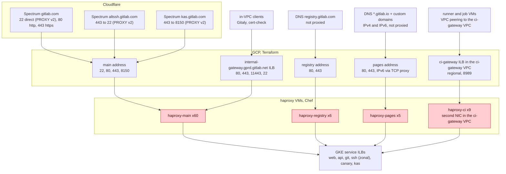
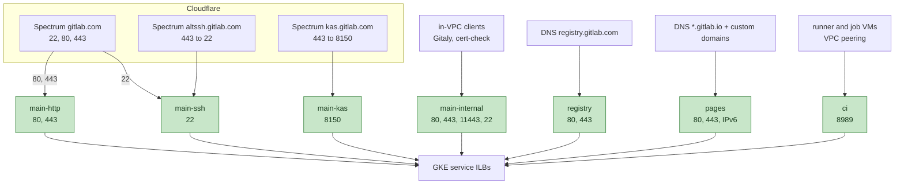

<!-- vale gitlab.FutureTense = NO -->



## ステータス {#status}

提案中です。追跡用の Issue は [production-engineering#29644](https://gitlab.com/gitlab-com/gl-infra/production-engineering/-/work_items/29644) です。この設計が依存するコントロールプレーンは完成しており、[HAProxy のコントロールプレーン](https://gitlab.com/gitlab-com/content-sites/handbook/-/merge_requests/21054)に記載されています。切り替えは、まず `gstg` で観測する必要がある GCP の動作に依存します。[未解決の質問](#open-questions)を参照してください。

## 概要 {#summary}

GitLab.com の Cloudflare の背後にあるイングレスは、`gprd` 上の HAProxy 2.8 VM 80 台で構成され、Chef で管理されています。ピーク時のトラフィックに予備の 1 ゾーン分を加えた容量で、終日稼働しています。このドキュメントは、プロキシ技術を変更せず、同じ HAProxy 設定を HPA を備えた GKE Deployment に移行することを提案します。ゾーンごとに 1 つの Deployment を配置し、argocd/apps を通じてデプロイします。ランタイム状態はすでに Consul KV 内の宣言された状態であり、`gitlab-haproxy-agent` が適用しています。Pod でも同じエージェントをサイドカーとして実行するため、制御の仕組みは変わりません。

主な課題は、3 種類の異なるエントリーポイントをまたいで、中断なく、すぐに元に戻せる状態で、トラフィックを VM 層から Pod 層に移すことです。`gitlab.com` の HTTP には、すでに私たちの前段に cells の http-router があり、リクエスト単位でトラフィックを分割できます。ssh と kas の生の TCP では、GCP アドレスの前段にプログラムで制御できるものがないため、ポート単位で切り替えます。お客様は DNS の参照先を pages のアドレスにしているため、そのアドレスをそのまま移す必要があります。それぞれに固有の仕組みが必要です。

## 動機 {#motivation}

HAProxy 群は、GitLab.com に残る最後の大規模なステートレスの Chef 管理サーバー群です。Postgres、Redis、Gitaly は VM に残ります。アプリケーション層、Runner Manager、ほとんどの補助サービスは、すでに Kubernetes で稼働しています。VM 群の運用コストを高くしている 2 つの問題は、ランタイム状態の制御経路と VM 自体です。コントロールプレーンの作業で前者は解決しました。このドキュメントは後者を扱います。

### そもそも HAProxy に投資する理由 {#why-invest-in-haproxy-at-all}

GitLab.com から HAProxy を取り除く計画は何年も前から存在しています。2022 年には Kubernetes への移行を評価しました（[production-engineering#15064](https://gitlab.com/gitlab-com/gl-infra/production-engineering/-/work_items/15064)）。現在、その後継にあたるのが [Envoy Gateway への移行](https://gitlab.com/groups/gitlab-com/gl-infra/-/epics/1641)です。いずれの取り組みも本番導入まで資金が投入されず、HAProxy は依然として gitlab.com へのすべてのリクエストの前段にあります。このことから、次の 3 点が導かれます。

- ミッションクリティカルなインフラには、廃止予定であっても、稼働している限り投資します。イングレスは、信頼性の問題が最も大きなコストを生む場所です。「いずれ置き換えられる」は、Chef で管理し手動でアップグレードする固定規模のサーバー群を、さらに何年になるか分からない期間、その位置に放置する理由にはなりません。
- このサーバー群ではインシデントが発生しており、変更コストも高くなっています。server-state ファイルが古いバックエンドアドレスをキャッシュしていました（[production-engineering#12152](https://gitlab.com/gitlab-com/gl-infra/production-engineering/-/work_items/12152)）。リロードで canary の状態がリセットされ、再起動したノードはドレイン状態を失っていました（[production-engineering#27563](https://gitlab.com/gitlab-com/gl-infra/production-engineering/-/work_items/27563)）。コントロールプレーンの作業でこれらは解決しました。しかし、変更には依然としてロール JSON の編集と 80 ノード全体での Chef converge が必要で、レビューできるレンダリング済みの差分も、ローリングロールアウトもなく、ロールバックには再度 converge する以外の方法がありません。このため、ブロックリストのエントリ、canary の重み、バージョンの更新は、どれもまれでリスクの高い作業になります。これは実行するプロキシの種類とは関係ありません。
- 最新化されたサーバー群は、取り除くのも容易です。Pod 向けのイングレスアドレス、切り替え手順、オブザーバビリティの接続が整えば、内部のプロキシを置き換える変更は、VM 群全体を置き換えるよりもはるかに小さくなります。Envoy Gateway にも、それらの要素は必要です。

[GitLab Runner](/handbook/engineering/architecture/design-documents/runner_managers_kubernetes/)でも同じ理屈が当てはまりました。docker-machine は非推奨化され、削除が予定されていましたが、何年も投資されていなかったものを Kubernetes 上で適切に動作させる作業には、それでも価値がありました。信頼性の面でも、Executor の移行が大幅に簡単になったという面でも同様です。

### 問題点 {#pain-points}

- **プロビジョニングの信頼性が低い。** 新しいノードは、Terraform apply の後、パッケージのインストール、リポジトリのクローン、ロールの converge を行う Chef bootstrap で作成します。どの段階でもマシンイメージを使用しません。bootstrap は、その時点で Chef サーバー、パッケージミラー、ops の Git ミラーにアクセスでき、最新であることに依存します。失敗の頻度が高いため、ノードの追加は人が予定を組み、監視する作業になっています。記録された障害訓練では、成功する場合でも、代替ノードのプロビジョニングに 9 〜 30 分、bootstrap にさらに 13 〜 24 分かかっています（[復旧時間の測定](https://gitlab.com/gitlab-com/runbooks/-/blob/master/docs/disaster-recovery/recovery-measurements.md#haproxytraffic-routing-zonal-outage-dr-process-time)）。
- **オートスケーリングがない。** `gprd` には `haproxy-main` が 60 台、`haproxy-pages` が 5 台、`haproxy-registry` が 6 台、`haproxy-ci` が 9 台あり、すべて `t2d-standard-8` です。ピークと 1 ゾーンの喪失に対応する規模で、終日稼働しています。`gstg` は 10 台、`pre` は 3 台で、ci 群はありません。
- **Chef と Ubuntu Pro。** サーバー群は Chef converge、Chef サーバー、有償の OS サポートに依存しています。ステートレスサービスは、すでにこの 3 つすべてから移行済みです。
- **手動アップグレード。** バイナリのアップグレードには調整されたドレインが必要なため、`haproxy` パッケージは自動アップグレードの対象外となっており、バージョン更新は手動です。ノードの OS パッチ適用も、繰り返し発生する手作業です（[production-engineering#29158](https://gitlab.com/gitlab-com/gl-infra/production-engineering/-/work_items/29158)）。
- **あらゆる場所で VM ごとの識別情報を使用。** ダッシュボード、アラート、ドレインスクリプト、Terraform のインスタンスグループ制約は、すべて名前の付いた固定のマシン群を前提としています。
- **5 か所から来る設定。** chef-repo 内のロール JSON、cookbook の属性とテンプレート、deny リストと captcha リストのために各ノードへクローンする 2 つの Git リポジトリ、URL で取得する Cloudflare の IP 範囲、Vault からのシークレットです。それぞれ更新経路と頻度が異なります。
- **ゾーン障害からの復旧。** ゾーンを失うとサーバー群の 3 分の 1 が失われ、復旧手順では他のゾーンに代替 VM をプロビジョニングします。`gstg` で四半期ごとに実施する障害訓練は、この手順だけを試します。最も弱い部分である上記のプロビジョニング経路を測定するもので、トラフィックの経路を測定することはありません。`gprd` では実施していません。

### 目標 {#goals}

- すべての HAProxy の種類を HPA 付きの GKE 上の Pod として実行し、現在のロール JSON に対応する Helm の値から設定をレンダリングします。シークレットとリストは External Secrets を通じて Vault から取得します。
- サービス単位、ポート単位でトラフィックを VM から Pod に移し、各段階でテスト済みの単一コマンドによるロールバックを用意します。本番での切り替え後も、それぞれ 2 週間はロールバックを利用可能にします。
- `haproxy_backend_up` と関連メトリクスの名前、および `type=frontend`、`tier=lb` ラベルを維持し、release-tools の昇格チェックとダッシュボードが引き続き動作するようにします。
- HAProxy のリクエストログが、現在と同じフィールドで Cloud Logging と BigQuery の `haproxy_logs` テーブルに届き続けるようにします。
- 種類ごとに、ロールバック可能期間が終了した後、VM 群、その Chef ロール、Terraform モジュール、chef-repo のヘルパースクリプトを削除します。

### 対象外 {#non-goals}

- プロキシの変更。Envoy、Cloudflare Load Balancer、GCP Application Load Balancer は導入しません。設定はそのまま移植します。
- コントロールプレーンの変更。ChatOps とエージェントは現状のままとします。
- HAProxy の役割の変更。ブロックリスト、origin-pull の検証、proxy-protocol の処理はそのままです。残っている 2 つのプロセス単位のレート制限を、アプリケーションや Cloudflare で置き換えるものを作ることは対象外です。
- ssh の cells ルーティングの解決。これはグローバルな gitlab-shell の設計が HAProxy の背後で行うことで、この作業とは独立しています。

## 提案 {#proposal}

HAProxy 2.8 の設定をそのまま GKE に移行します。以下は現時点での考えです。それぞれ確定した時点で、検討した代替案とともに[決定ログ](#decision-log)へ記録します。

- [gl-infra/charts](https://gitlab.com/gitlab-com/gl-infra/charts) に独自の Helm チャートを用意し、argocd/apps を通じてデプロイします。現在のロール JSON に対応する値から `haproxy.cfg` をレンダリングします。ci-images に軽量なイメージを用意し、Artifact Registry から取得します。
- プロトコルグループとアドレスごとに 1 リリース、環境ごとに `main-http`、`main-ssh`、`main-kas`、`main-internal`、`registry`、`pages`、`ci` の 7 リリースとします。各リリースは固有のアドレスと Service を持ち、リージョンクラスター内の専用ノードプールで稼働します。
- リリースの各ゾーンに 1 つの Deployment を配置し、現在の VM と同様、自ゾーンのバックエンドをプライマリ、他の 2 ゾーンを `backup` としてレンダリングします。
- 証明書、認証情報、deny リスト、Cloudflare の IP 範囲は、External Secrets を通じて Vault から取得します。
- メトリクスのラベルを VM 群に合わせて両方のサーバー群が同じように見えるようにし、ログは JSON として stdout に出力して既存の Cloud Logging シンクに送ります。
- 起動プローブを自動停止の仕組みとするローリングアップデートを行い、必要に応じて Argo Rollouts で安定性を確認する待機時間とメトリクスのチェックを追加します。
- Terraform で予約したアドレス上の GKE `LoadBalancer` Service を通じてイングレスを提供し、現在と同様に前段へ Cloudflare Spectrum を置きます。トラフィックはエントリーポイントごとに移行します。http-router はリクエスト単位で HTTP を分割し、各 Spectrum アプリのオリジンはポート単位で移行します。pages と registry は公開済みのアドレスを維持して 1 段階で引き渡し、内部クライアントは DNS と設定によって移行します。2 つの層は GCP オブジェクトを共有しません。
- Runner のネットワークを `gprd` とピアリングし、ci-gateway の ILB をそこの `ci` Pod の前段へ移動します。ただし、分離に関する質問の解決が必要です。`ci` は最後に移行するか、今回のイテレーションでは移行しません。

### 継続して動作する必要があるもの {#what-must-keep-working}

- `/chatops run canary` と SRE のゾーンドレインのワークフロー。変更はなく、KV に書き込み、エージェントが適用します。Pod は、エージェントを実行するノードが増えるだけです。
- release-tools の昇格チェック。`haproxy_backend_up{backend=~"canary_.*"}` と `type=frontend`、`tier=lb` を使用します。ネイティブの prometheus exporter がメトリクス名を維持し、スクレイプ設定がラベルを維持します。
- ゾーンの局所性。各 VM は自ゾーンのバックエンドにルーティングし、他の 2 ゾーンへフォールバックします。これにより大半のトラフィックを 1 つのゾーン内に保ち、ゾーンドレインをそのゾーンのロードバランサーのドレインにします。各ゾーンに 1 つの Deployment を置き、自ゾーンのサーバーをプライマリ、他の 2 ゾーンを `backup` としてレンダリングすることで、この両方を維持します。
- クライアント IP の処理。22 と kas 8150 での Spectrum からの proxy-protocol v2、80 と 443 での `CF-Connecting-IP`、Cloudflare のみを許可する送信元 ACL、443 での origin-pull クライアント証明書の検証です。
- プロセス単位のレート制限。HAProxy には、registry の送信元 IP ごとの制限（10 秒あたり 4000 リクエスト）と ssh の `rate-limit sessions 110` の 2 つが残っています。実効的な制限値はその値にインスタンス数を掛けたもので、インスタンス数は現在は固定ですが HPA の下では変動します。registry と ssh のリリースを構築する前に、それぞれまだ必要かどうかを見直します。必要であれば、リリースの最小レプリカ数からプロセス単位の値を導出します。
- pages と registry のアドレス。お客様はカスタムドメインの DNS を pages のアドレスに向けており、registry のアドレスは許可リスト用に GitLab.com の設定ドキュメントで公開されています。両方とも Pod 層へ移行し、どちらのアドレスも変更しません。それ以外に外部から見えるアドレスはありません。Spectrum のポートには Cloudflare のアドレスが表示され、内部ゲートウェイと ci-gateway のクライアントはホスト名を使用します。
- ci-gateway。Runner Manager は `ci-gateway` VPC への VPC ピアリングを通じて `*.ci-gateway.int.gprd.gitlab.net:8989` にアクセスし、フロントエンドでは送信元の範囲を許可リストに登録しています。VM を何で置き換えるとしても、ピアリング経路と送信元アドレスを維持する必要があります。

### 変更すること {#what-changes}

設定はそのまま移植します。その周囲では、次のことが変わります。

- VM ごとに 1 プロセスですべてのフロントエンドを処理する構成から、プロトコルグループとアドレスごとに 1 リリース、環境ごとに 7 リリースへ変わります。内部ゲートウェイのクライアントには専用の Pod を用意します。
- 固定規模のサーバー群から、ゾーンとリリースごとの HPA へ変わります。ゾーンを失った場合は再構築ではなく、他の 2 ゾーンでスケールアップします。
- 変更は、ロール JSON の編集と converge ではなく、レンダリング済みの差分を持つ MR とローリングデプロイになり、revert でロールバックします。バージョン更新は、手動ドレインではなく Renovate の MR になります。
- deny リスト、recaptcha リスト、Cloudflare の IP 範囲を所有するリポジトリのパイプラインが、それらを Vault に発行し、External Secrets が Pod 内にマウントします。各ノードでの Git クローンと URL からの取得を置き換えます。
- HAProxy バイナリは、Ubuntu Pro 上の PPA ビルドではなく、Artifact Registry から取得する公式の 2.8 ビルドになります。
- HAProxy は JSON を stdout に書き込みます。Cloud Logging のシンクと BigQuery のテーブルは維持します。

### リスク {#risks}

- **クラスターへの循環依存。** Pod は自分が動作するクラスターの ILB（canary、kas）にルーティングするため、クラスター全体のインシデントではイングレスも停止します。これは受け入れます。専用の LB クラスターを設けても、そのインシデントではどのみち canary と kas が停止するため、イングレスを維持できるのはゾーンクラスターのバックエンドに対してだけです。また、統合の方向性に反して、運用するクラスターがもう 1 つ増えることになります。
- **HPA と長時間接続。** CPU は TLS 負荷を反映しますが、websocket、kas トンネル、ssh セッションはスケールイン時に解放されません。慎重なスケールダウン、リクエストに合わせた Pod ごとの `maxconn`、VM と同じ `hard-stop-after` による 30 分の打ち切りを使用します。`gstg` で、強制スケールインとデプロイの間 websocket、kas、ssh 接続を開いたままにして検証します。接続は 30 分の打ち切り時に終了し、それより前には終了しないことを確認します。
- **起動時の期間。** HAProxy 2.8 は、最初のヘルスチェックが完了するまで、すべてのバックエンドを UP と見なします。VM では起動時だけですが、HPA の下ではスケールアップとデプロイのたびに発生します。バックエンド ILB が停止している場合に最も重要になり、まさにそのとき HPA がスケーリングする可能性が高くなります。起動プローブの初期遅延をヘルスチェック 1 回分（`inter × fall` に `spread-checks` を加えたもの）とし、それまでは Pod がトラフィックを受けないようにします。`pre` で 1 つのバックエンドにアクセスできない状態にしてスケールアップし、新しい Pod の最初の接続が他のバックエンドに向かうことを検証します。
- **オブザーバビリティにおけるインスタンス識別情報。** Pod 名は入れ替わり、インスタンス数は変動します。VM 名を指定するすべてのダッシュボード、アラート、ランブックの手順を更新する必要があります。`gstg` でトラフィックを移す前に、`pre` 向けに実施します。Pod のメトリクスカタログサービスに、Deployment 用の `provisioning.kubernetes` と `kubeResources` を設定し、HAProxy のダッシュボードと並んで Kubernetes のダッシュボードを生成します。また、HAProxy のダッシュボードでは 2 層を分け、両方が稼働している間に比較できるようにします。
- **ロードバランサーから離脱するノード。** cordon された GKE ノードは、削除されるまでロードバランサーのバックエンドリストに残る場合があります。そこに送られた新しい接続は Pod を見つけられず、開いている接続はタイムアウトするまでハングします。これが [production-engineering#29764](https://gitlab.com/gitlab-com/gl-infra/production-engineering/-/work_items/29764) で kas の ILB において Runner Manager が 1 時間ハングした原因です。`externalTrafficPolicy: Local` では、最後の Pod がなくなると直ちにヘルスチェックがノードを除外するはずです。cordon されたノードでも同様になるかを `gstg` で確認し、GCP に問い合わせます。

## 設計と実装の詳細 {#design-and-implementation-details}

### アーキテクチャの概要 {#architecture-overview}

ランタイム状態（Consul KV、`gitlab-haproxy-agent`、`agent-check`）は、これらの図では省略しています。VM と Pod で同じです。

#### 変更前 {#before}

4 つのサーバー群と 4 種類のエントリーポイントがあります。各 GCP アドレスには、VM のターゲットプールを指すポートごとの Terraform 転送ルールがあります。

#### 変更後 {#after}

すべてのアドレスを Terraform で予約します。各転送ルールとバックエンドサービスは、`LoadBalancer` Service のために GKE が作成します。Spectrum と DNS は新しいアドレスを指します。pages と registry はアドレスを維持します。

### 運用 {#operations}

- すべての変更で Pod を置き換え、実行中のプロセスをリロードすることはありません。設定変更とイメージ更新はローリングアップデートで行い、起動プローブが壊れた設定を最初の Pod で停止させます。`gprd` より先に `pre` と `gstg` に適用し、revert でロールバックします。リストの変更では、Reloader を通じてそれらをマウントする Pod を再起動します。それでは不十分な場合、Argo Rollouts が安定性を確認する待機時間とメトリクスのチェックを追加します。
- HPA のスケールダウンを遅くし（15 分のウィンドウ、5 分あたり 10%）、長時間接続を一斉に切断するのではなくドレインさせます。ゾーンごとの Deployment に PodDisruptionBudget を設定し、ノードのドレインでゾーンのレプリカ数が下限を下回らないようにします。
- GKE ノードプールのアップグレードはデフォルトのサージ戦略を使用します。PDB と 30 分の猶予期間で十分です。

### 関係者との調整 {#alignment}

各決定記録には、レビューが必要なチームを記載します。`gstg` での観測結果がそろった後、GCP のアカウントチームがアドレスの引き渡しとロードバランサーのノード所属の動作をレビューします。

### ロールアウト {#rollout}

1. `pre` で、各種類 1 台の VM、ci 群なしの構成を対象に、次の順に実施します。ノードプール、イメージ、チャート、レンダリング済みの設定を含む `main-http` リリース、Vault からの証明書とリスト、ログシンク、メトリクスカタログとダッシュボードの変更、リリースの有効化、アドレスと切り替えです。ここが Pod を初めて実行する場所になります。
2. `gstg` のすべてのサーバー群で Chef 群と並行稼働させます。http-router の分割、ポートごとのオリジン切り替えとロールバック、registry と pages のアドレス引き渡しの中断時間測定、Pod に対する `/chatops run canary --gstg` を実施します。
3. 観測した動作と計画を、GCP のアカウントチームとレビューします。
4. `gprd` の main の 80 と 443 を http-router 経由で移行します。リクエストの小さな割合から始め、1 サービスずつ実施し、Worker の設定変更でロールバックします。
5. `gprd` の registry、続いて pages でアドレスを引き渡します。それぞれ測定済みの中断を伴う 1 段階の操作のため、Pod 層が本番の HTTP をしばらく処理してから実施します。
6. `gprd` の main の 80、22、443 と kas の 8150 で、ポートごとに Spectrum のオリジンを切り替えます。443 の切り替えにより http-router のルールも終了します。
7. `gprd` の内部ゲートウェイを、重み付き DNS で `main-internal` に移行します。
8. `gprd` の ci はネットワーク配置が決まった後、最後に Runner のシャードごとに移行します。
9. サーバー群ごとに、最後の切り替えから 2 週間後に、Chef ロール、Terraform モジュール、chef-repo のヘルパースクリプト、残っている ChatOps の Chef-API 検索を廃止します。

VM 群はロールバック可能期間が終了するまでフル容量を維持するため、各サーバー群の最後の切り替え後も 2 週間、両方の層が稼働します。定価では gprd の VM 80 台の費用は月額約 2 万ドルなので、重複期間の費用は約 1 万ドルです。

### 未解決の質問 {#open-questions}

本番作業期間に入る前に `gstg` で観測すること:

- Spectrum のオリジン変更が新しい接続に反映されるまでの時間と、古いオリジンで進行中の接続がどうなるか。
- registry と pages のサーバー群での、アドレス引き渡しの中断時間の分布とロールバック時間。
- `externalTrafficPolicy: Local` の場合に、ノードが cordon されていても Ready であるときの、バックエンドサービスベースの L4 ロードバランサーにおけるノードの所属。Pod がなくなった時点で `healthCheckNodePort` のチェックがノードを除外するか、それにどの程度の時間がかかるか。

`gstg` の観測結果を添えて GCP のアカウントチームに尋ねることは、アドレスの引き渡しとノード所属の動作、およびお客様が固定して使用するアドレスの場合に別の方法を取るとすれば何かです。

未決定の事項:

- サイジング。HPA がレプリカ数を管理するようになった後、インスタンスグループの台数を 3 の倍数にする制約と、必要容量の 2 倍で稼働させるルールを何に置き換えるか。
- HAProxy ログを Elasticsearch または OTel/ClickHouse パイプラインにも送るべきか。
- `ci` の分離に関する質問。
- Cloudflare の IP 範囲の更新方法。Vault に発行するスケジュールジョブか、Renovate の MR か。
- Pod のメトリクスカタログサービス。既存の `frontend` サービスに層を区別するラベルを付けるか、移行期間中は別のサービスにするか。前者は Runner Manager の移行時に採用した方法で、すべてのダッシュボードを動作させ続けられます。`gstg` でトラフィックを移す前に決定します。

## 決定ログ {#decision-log}

決定ごとに 1 件の記録を作成します。

## 代替案 {#alternative-solutions}

### プロキシの置き換え {#replace-the-proxy}

Envoy Gateway への移行が長期的な解決策であり、現在は非本番の段階にあります。この作業がそれを妨げることはありません。上記の問題点はプロキシ技術とは独立しており、はるかに小さな範囲で解決できます。

### Kubernetes Ingress または Gateway API {#kubernetes-ingress-or-gateway-api}

Ingress コントローラーは設定ファイルではなくルートリソースで設定します。現在の設定ファイルが行うことの大半（ACL、レート制限、proxy protocol を扱う TCP フロントエンド、origin-pull の検証、コントロールプレーン用のエージェントチェック）には Ingress で対応するものがなく、Gateway API でも一部しか対応していません。そのため、これは移植ではなく、設定の書き直しと新しいコントロールプレーンの構築になります。また、Envoy Gateway が長期的な解決策である一方、別のプロキシスタックにも同じ労力を投入することになります。代わりに HAProxy の前段に Ingress コントローラーを置くと、HAProxy がすでに行っているルーティングに対して、プロキシの経由段階とコストが増えます。この設計では、リリースごとに 1 つの `LoadBalancer` Service を置き、HAProxy を唯一のプロキシとします。

### 何もしない {#do-nothing}

プロキシが置き換えられるまで VM 群を現状のまま維持します。そうしない理由は[動機](#why-invest-in-haproxy-at-all)に記載しています。置き換えは何年も前から計画されているものの本番導入に至っておらず、サーバー群のプロビジョニング、変更プロセス、ゾーン復旧は、現在すでにリスクとなっています。
