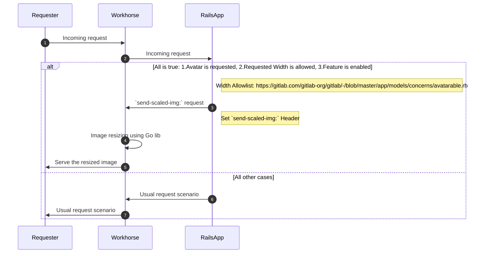



現在、アップロードされたすべての画像を 1:1 で表示していますが、これは理想的ではありません。
パフォーマンスを大幅に改善するために、バックエンドに画像リサイズを追加します。画像リサイズには大きく分けて
アバターとコンテンツ画像の 2 つの領域があります。この実装の MVC はアバターに焦点を当てています。
アバターのリクエストは総画像リクエストの約 70% を占めています。サポートを意図するサイズが特定されており、
この最初の MVC の範囲を非常に狭くしています。コンテンツ画像のリサイズには、サイズと機能に関して
さらに多くの考慮事項があります。画像リサイズによるパフォーマンス向上という同じ目標を持ちながら、
2 つの独立した開発取り組みを行う可能性があります。

## MVC アバターリサイズ

動的な画像リサイズソリューションを実装する際は、後で新しいターゲットサイズを定義した場合に
動的に追加できるように、画像をオンザフライでリサイズして最適化する必要があります。これにより、
パフォーマンスが大幅に改善されます。測定によると、現在のロードサイズの最大 95% を節約できる可能性があります。
初期調査では、約 80 GB のサイズの約 165 万個のアバターがアップロードされており、
平均して約 48 KB であることがわかっています。初期測定では、最も一般的なアバターのサイズを
1〜3 KB に削減でき、90% 以上のサイズ削減が実現できることが示されています。MVC ではアプリケーションレベルの
キャッシュを考慮せず、CDN およびブラウザに実装された HTTP ベースのキャッシュのみに依存しますが、
この決定は後で再検討する可能性があります。アバターリサイズのパフォーマンスの問題、特にセルフマネージドの場合を
軽減するために、動的な画像リサイズを無効にするための運用フィーチャーフラグが実装されています。

## コンテンツ画像のリサイズ

コンテンツ画像のリサイズはより複雑な問題です。サイズ制限が設定されておらず、
追加の機能や要件を考慮する必要があります。

- 動的な WebP サポート - WebP 形式は通常、画質を損なうことなく JPEG よりも平均 30% 以上の圧縮を実現します。
  詳細は [この Google の比較研究](https://developers.google.com/speed/webp/docs/c_study) を参照してください
- 10 MB のピクセルの読み込みを防ぐために最初の GIF 画像を抽出する
- 高 DPI スクリーンで美しい画像を提供するためにデバイスのピクセル比を確認する
- [プログレッシブ画像ローダーの構築方法に関するこの記事](https://www.sitepoint.com/how-to-build-your-own-progressive-image-loader/) で説明されているようなプログレッシブ画像読み込み
- リサイズの推奨事項（サイズと明瞭さなど）
- ストレージ

MVC のアバターリサイズの実装は Workhorse に統合されています。コンテンツ画像リサイズの
追加要件を考えると、GraphicsMagik（GM）や類似のライブラリをさらに使用し、
Workhorse から切り離す必要があるかもしれません。

## イテレーション

1. ✓ さまざまな画像リサイズソリューションの POC
1. ✓ セキュリティチームとのソリューションのレビュー
1. ✓ アバターリサイズ MVC の実装
1. デプロイ、測定、監視
1. コンテンツ画像リサイズの機能の明確化
1. 現在の画像リサイズ実装と新しいソリューションの間でのオプションの検討
1. コンテンツ画像リサイズ MVC の実装
1. デプロイ、測定、監視

## 担当者

提案:

<!-- vale gitlab.Spelling = NO -->

| 役割 | 担当者 |
|------------------------------|-----|
| 著者 | Craig Gomes |
| アーキテクチャエボリューションコーチ | Kamil Trzciński |
| エンジニアリングリーダー | Tim Zallmann |
| ドメインエキスパート | Matthias Kaeppler |
| ドメインエキスパート | Aleksei Lipniagov |

<!-- vale gitlab.Spelling = YES -->

DRI:

<!-- vale gitlab.Spelling = NO -->

| 役割 | 担当者 |
|-------------|-----|
| プロダクト | Josh Lambert |
| リーダーシップ | Craig Gomes |
| エンジニアリング | Matthias Kaeppler |

<!-- vale gitlab.Spelling = YES -->
