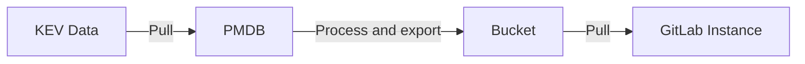
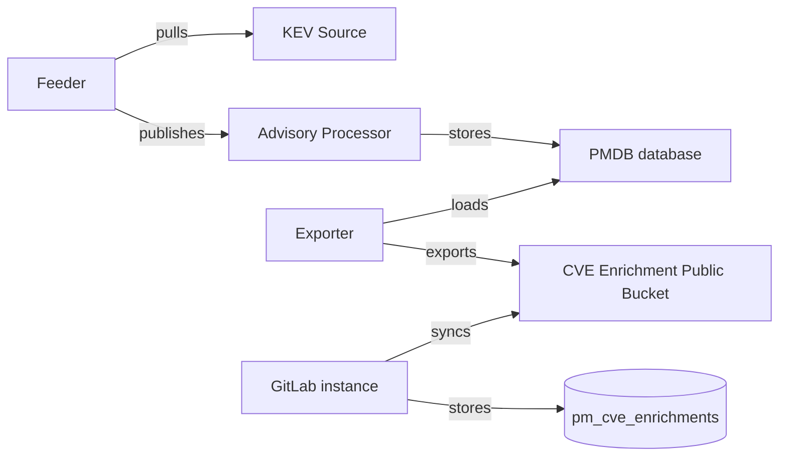

<!-- This renders the design document header on the detail page, so don't remove it-->



## 概要

[KEV（Known Exploited Vulnerabilities、既知の悪用された脆弱性）](https://www.cisa.gov/known-exploited-vulnerabilities-catalog) は、
実際に悪用されている脆弱性を識別する [CISA](https://www.cisa.gov) が管理するカタログです。
GitLab での KEV サポートは、これらの高リスク脆弱性をハイライトすることで、脆弱性の優先順位付けと
修正の取り組みを強化することを目的としています。
KEV サポートの要件は [KEV epic](https://gitlab.com/groups/gitlab-org/-/epics/11912) に概説されています。
このドキュメントは KEV サポートの技術的な実装に焦点を当てています。

KEV データは、[CISA ウェブサイトの JSON ファイル](https://www.cisa.gov/sites/default/files/feeds/known_exploited_vulnerabilities.json)として
入手できる CISA KEV カタログから取得されます。
このファイルは CISA によって定期的に更新されており、ダウンロードして処理することで最新の KEV 情報を抽出できます。
目標は、GitLab GraphQL API を通じて KEV 情報にアクセス可能にし、脆弱性レポートと詳細ページに表示し、
フィルタリングとポリシー設定に使用できるようにすることです。
実装は、アドバイザリの取得とエンリッチメントのための既存の Package Metadata Database（PMDB、
license-db とも呼ばれる）インフラストラクチャを活用します。
フローは以下の通りです:

## モチベーション

脆弱性の優先順位付けの古典的なアプローチは、CVSS に基づく重大度を使用することです。
このアプローチはある程度のガイダンスを提供しますが、洗練されていません - 公開されているすべての CVE の半数以上が
高または重大なスコアを持っています。
修正疲れを軽減し、開発者が作業をよりよく優先できるように、他のメトリクスを使用する必要があります。
KEV は実際に悪用されている脆弱性の集中したリストを提供します。
これらの脆弱性には、攻撃者が再現できる文書化された悪用技術がある可能性があります。
多くの重大としてマークされた脆弱性は決して悪用されませんが、KEV は悪用されており、再び悪用される可能性が
高いものを定義しています。
既存の優先順位付け方法と組み合わせると、KEV は最も緊急の脅威に修正の取り組みを集中させ、
全体的な修正作業を減らすのに役立ちます。
GitLab プラットフォームに KEV データを追加することで、ユーザーに提示される情報にこれらの利点を提供し、
より効果的かつ効率的な脆弱性管理を可能にします。

さらに、FCEB（連邦民間行政機関）は [BOD 22-01](https://www.cisa.gov/news-events/directives/bod-22-01-reducing-significant-risk-known-exploited-vulnerabilities) の下で
KEV カタログの脆弱性に対処する必要があります。
この指令は他の政府レベルや産業には適用されませんが、連邦のサイバーセキュリティガイダンスに従うことが多く、
より広い対象に関連します。

### 目標

- GitLab で KEV データを別のメトリクスとして使用し、脆弱性の優先順位付けの取り組みに活用できるようにします。

#### フェーズ 1（MVC）

- GraphQL API を通じて KEV ステータスへのアクセスを有効にします。

#### フェーズ 2

- 脆弱性レポートと詳細ページに KEV 情報を表示します。

#### フェーズ 3

- KEV ステータスに基づいて脆弱性をフィルタリングできるようにします。
- KEV ステータスに基づいてポリシーを作成できるようにします。

### 非目標

- KEV（または他のメトリクス）に基づいてユーザーに優先度を指示することはしません。

## 提案

GitLab プラットフォームで KEV をサポートします。

[KEV epic](https://gitlab.com/groups/gitlab-org/-/epics/11912) での議論の後、提案されたフローは以下の通りです:

1. PMDB データベースが新しいテーブルで拡張されて KEV データを保存します。
1. PMDB インフラストラクチャが KEV フィーダーを毎日実行して KEV データを取得、処理、公開します。
1. アドバイザリプロセッサーが KEV データを受け取り、PMDB DB に保存します。
1. エクスポーターが KEV と EPSS データを単一の CVE エンリッチメントデータセットに結合し、専用バケットにエクスポートします。
1. GitLab インスタンスがバケットから CVE エンリッチメントデータを取得します。
1. GitLab インスタンスが KEV と EPSS データを新しい `pm_cve_enrichments` テーブルに保存します。
1. GitLab インスタンスが GraphQL API を通じて KEV ステータスを公開し、脆弱性レポートと詳細ページにデータを表示します。

## 設計と実装の詳細

### 決定

- [001: KEV と EPSS を CVE エンリッチメントとして統合](decisions/001_unify_kev_and_epss_as_cve_enrichments.md)

### 重要な注意事項

- KEV カタログは新しいエントリで更新されますが、悪用された脆弱性のステータスが変更されることはほとんどありません。
  ただし、[脆弱性はカタログから削除される可能性があり](https://www.cisa.gov/news-events/alerts/2023/12/01/cisa-removes-one-known-exploited-vulnerability-catalog#:~:text=CISA%20Removes%20One%20Known%20Exploited%20Vulnerability%20From%20Catalog,-Release%20Date&text=As%20a%20result%20of%20this,816L%20Remote%20Code%20Execution%20Vulnerability)、
  CISA はここで不変性を保証しません。したがって、このエッジケースもサポートする必要があります。

### PMDB

- アドバイザリ識別子を持つ新しい KEV テーブルを [PMDB](https://gitlab.com/gitlab-org/security-products/license-db) に作成します。
  これには [スキーマ](https://gitlab.com/gitlab-org/security-products/license-db/schema) と
  必要な移行の変更が含まれます。
- KEV データをこの新しい PMDB テーブルに取り込みます。JSON に存在せず、カタログから削除されたアドバイザリを削除するようにします。
- EPSS データとともに KEV データを統合 CVE エンリッチメントデータセットとしてエクスポートします。
- 既存の terraform モジュールを使用して、PMDB コンポーネントが使用するデプロイメントに新しい pubsub トピックを追加します。

### GitLab Rails バックエンド

- GitLab データベースに統合された KEV および EPSS データを保存するための新しい `pm_cve_enrichments` テーブルを作成します。
- Rails シンクを設定して統合 CVE エンリッチメントデータを取り込み、新しいテーブルに保存します。
- `pm_cve_enrichments` テーブルからクエリして、GraphQL API Occurrence オブジェクトに KEV ステータス属性を含めます。

### GitLab UI

- 脆弱性レポートページに KEV ステータスを追加します。
- 脆弱性詳細ページに KEV ステータスを追加します。
- KEV ステータスによるフィルタリングを許可します。
- KEV ステータスに基づいてポリシーを作成できるようにします。

## 用語集

- **PMDB**（Package metadata database、License DB とも呼ばれる）: PMDB は、Rails アプリケーションの外部にある
  独立したサービス（単なるデータベースではない）で、GitLab インスタンスが使用するためにパッケージのメタデータを
  収集、保存、エクスポートします。
  [完全なドキュメント](https://gitlab.com/gitlab-org/security-products/license-db/deployment/-/blob/main/docs/DESIGN.md?ref_type=heads)を参照してください。
  PMDB コンポーネントには以下が含まれます:
  - **フィーダー**: PMDB デプロイメントによって呼び出されるスケジュールジョブで、PMDB プロセッサーが
    消費する pub/sub メッセージに関連するソースからデータを公開します。
  - **アドバイザリプロセッサー**: Cloud Run インスタンスとして実行され、アドバイザリ関連データを含む
    アドバイザリフィーダーによって公開されたメッセージを消費し、PMDB データベースに保存します。
  - **PMDB データベース**: ライセンスとアドバイザリデータを保存する PostgreSQL インスタンス。
  - **エクスポーター**: PMDB データベースから公開 GCP バケットにライセンス/アドバイザリデータをエクスポートします。
- **GitLab データベース**: GitLab インスタンスが使用するデータベース。
- **CVE**（Common Vulnerabilities and Exposures）: 公に知られている情報セキュリティの脆弱性のリスト。
  「CVE」は通常、特定の脆弱性とその CVE ID を指します。
- **CISA**（Cybersecurity and Infrastructure Security Agency）: サイバーセキュリティとインフラ保護に焦点を当てた米国機関。
- **KEV**（Known Exploited Vulnerabilities）: CISA が管理する積極的に悪用されている脆弱性のカタログ
