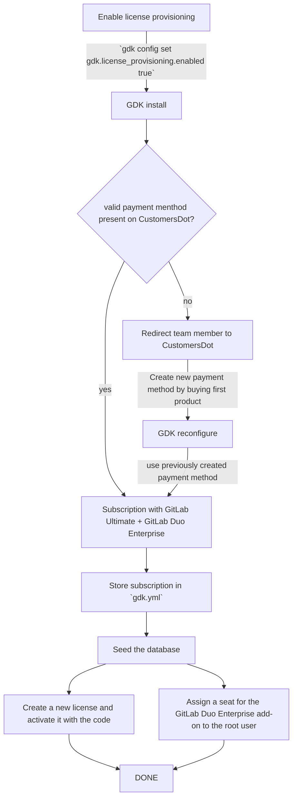
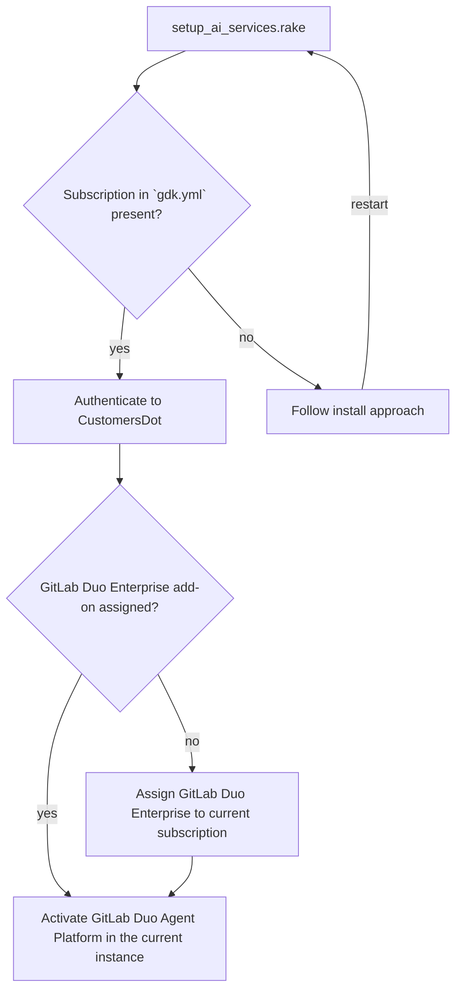
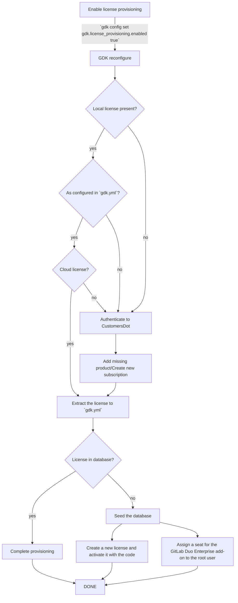

<!-- Design Documents often contain forward-looking statements -->
<!-- vale gitlab.FutureTense = NO -->

<!-- This renders the design document header on the detail page, so don't remove it-->


## 用語集

| 用語 | 意味 |
| ---- | ------- |
| AI コンポーネント | ローカルで AI 機能を使用できるようにするために実行する必要がある、AI gateway や GitLab Duo workflow service などのコンポーネント。 |
| AI 機能 | GitLab Agent Platform や GitLab Duo Chat などの GitLab 機能。 |
| [CustomersDot](https://gitlab.com/gitlab-org/customers-gitlab-com) | GitLab サブスクリプション、請求先連絡先、支払い、ライセンスの詳細を管理するための Customers Portal。 |
| GDK | ローカルの GitLab インスタンスをセットアップするための開発ツール、[GitLab Development Kit](https://gitlab.com/gitlab-org/gitlab-development-kit/)。 |
| GitLab EE | GitLab Enterprise Edition はアクティベーションコードを使用してアクティベートでき、エンタープライズ機能を有効にします。 |
| GitLab ライセンス | GitLab ライセンスは、Premium や Ultimate のようなティアを持ちながら、self-managed または dedicated インスタンスをサポートできます。 |
| GitLab サブスクリプション | GitLab サブスクリプションは、プロダクトを保持するバケツと見なせます。プロダクトの 1 つは GitLab ライセンス、もう 1 つは GitLab Duo Enterprise アドオンになります。 |
| GitLab サブスクリプション名 | サブスクリプション購入後に CustomersDot が提供する名前。たとえば 'A-S00012345'。 |
| Team members | チームメンバーは GitLab Inc. で働く GitLab の従業員およびスタッフです。 |
| [Zuora](https://www.zuora.com/) | GitLab が購入、請求、サブスクリプションを管理するために使用するアプリケーション。 |

## サマリー

GitLab AI 機能の開発には、GitLab Ultimate ライセンスと GitLab Duo Enterprise アドオンを持つ GitLab サブスクリプションが必要です。
GitLab Duo Enterprise アドオンは現在、手動のプロセスでプロビジョニングされており、これがチームの生産性を低下させ、機能開発のワークフローを遅らせています。

この提案するソリューションは、GitLab Duo Enterprise アドオン付きの GitLab ライセンスの自動プロビジョニングを GDK のセットアッププロセスに統合し、チームメンバーが手動の介入なしに開発とテストのためのライセンスに即座にアクセスできるようにします。

## 動機

ステージング AI gateway を使用して GitLab プロダクト向けの GitLab AI 機能を開発またはレビューする際、チームメンバーは GitLab Development Kit (GDK) を使用したローカル開発環境で、GitLab Duo Enterprise アドオン付きの GitLab ライセンスを必要とします。
2025 年 10 月 27 日時点では、GitLab Duo Enterprise アドオンは Fulfillment チームによる手動の介入を通じてのみ取得でき、開発ワークフローにおいて大きなボトルネックを生み出しています。

GitLab の顧客ポータルである CustomersDot にはセルフサービスのプロビジョニングフローがないため、チームメンバーはリクエストを送信し、手動のアドオン割り当てを待たなければならず、これには数時間かかることがあります。

この手動プロセスが存在するのは、Subscription Management チームが、GitLab Duo Enterprise アドオンの CustomersDot への統合を、[購入フローを統一するより大きな取り組み](https://gitlab.com/groups/gitlab-org/-/epics/12199)によってブロックされていると特定したためです。
GitLab Duo Enterprise アドオンを CustomersDot に追加する見積もりのタイムラインは、FY27-Q1 以降です。

現在の[手動プロビジョニングプロセス](https://docs.gitlab.com/development/ai_features/ai_development_license/#duo-enterprise)は、いくつかの問題を生み出しています。

- **開発者の生産性:** チームメンバーはアドオンのプロビジョニングを待つ間、数時間の遅延を経験し、環境のセットアップと作業開始の能力がブロックされます。
- **レビューの品質:** 摩擦が大きいため、レビュアーが AI 機能をローカルでテストするのを思いとどまらせます。
レビュアーが変更をテストするために環境を簡単にセットアップできない場合、コードレビューだけに頼りがちになり、見落とされる欠陥の可能性が高まります。
- **チームの負荷:** Fulfillment チームは、個々のアドオンリクエストを処理する運用負担を負い、リクエスト側とプロビジョニング側の双方にとって非効率を生み出します。

内部開発目的のためのセルフサービスのライセンスプロビジョニングを可能にすることで、私たちは次のことができます。

- チームメンバーに必要なライセンスとアドオンへの即座のアクセスを提供することで、**開発速度を向上**させます。
- GDK を使用した開発環境内での AI 機能のテストを簡素化することで、**逃した欠陥の比率を削減**します。
- 内部開発アドオンに対する Fulfillment チームのボトルネックを排除することで、**運用上のオーバーヘッドを削減**します。

この統合は、開発者体験を改善する長期的なソリューションとして機能します。

### ゴール

- GDK のチームメンバー向けに、GitLab Duo アドオン付きの GitLab サブスクリプションをプロビジョニングする、統合された自動セルフサービスプロセスを作成します。

### 非ゴール

- コミュニティコントリビューターはステージング CustomersDot にアクセスできず、[ここ](/handbook/marketing/developer-relations/engineering/community-contributors-workflows/#contributing-to-the-gitlab-enterprise-edition-ee)で概説されているようにライセンスを取得するために[リクエスト](https://gitlab.com/gitlab-org/developer-relations/contributor-success/team-task/-/issues/new?issuable_template=contributor_ee_license_request)の作成が必要なため、コミュニティコントリビューター向けの自動ライセンス生成。
- 顧客向けの購入フローの効率化。

## 提案

GDK での AI コンポーネントのセットアップ中、チームメンバーは AI gateway をどのようにセットアップしたいかを指定するよう求められます。
ローカル AI gateway ではなくステージング AI gateway を使用することを決定した場合、ステージングの self-managed GitLab Ultimate ライセンスと GitLab Duo Enterprise アドオンを持つサブスクリプションが必要です。
ステージング CustomersDot 上でステージングの self-managed GitLab Ultimate ライセンスを持つ新しいサブスクリプションを手動で購入し、Fulfillment チームに GitLab Duo Enterprise アドオンのプロビジョニングをリクエストする代わりに、
GDK が前述のプロダクトを持つ新しいサブスクリプションの購入を引き受け、それをローカルインスタンスでアクティベートします。
これにより、チームメンバーは Fulfillment チームによる手動のアドオンプロビジョニングを待つことなく、AI 機能をローカルでテストできるようになります。

GDK は次に以下を行います。

- GitLab ステージングを通じてステージング CustomersDot に認証します。
- ステージングの self-managed GitLab Ultimate ライセンスを持つ新しいサブスクリプションを作成します。
- デフォルトまたは指定された数のシートで、GitLab Duo Enterprise アドオンをサブスクリプションに自動的にアタッチします。
- GitLab サブスクリプションの暗号化されたコピーを `gdk.yml` ファイルに保存します。
- GitLab サブスクリプションをローカルの GDK インスタンスに割り当てます。
- 以前に購入したシートの 1 つを root ユーザーに割り当てます。

### 利点

- ライセンスのプロビジョニングが自動的に行われます。
- 開発者の手動ステップの削減。
- 容易な再現。
- ステージング Zuora インスタンスが定期的にリフレッシュされ、すべてのサブスクリプションデータがリセットされる際、不整合なく新しいサブスクリプションをプロビジョニングできます。

### 欠点

- CustomersDot プラットフォームへの新たな依存。CustomersDot が利用できない場合、自動ライセンスプロビジョニングはブロックされます。

### 成功指標

- **エンドツーエンドのプロビジョニング時間:** 開発者のリクエスト開始からライセンスのアクティベーションまでの時間。
- **手動介入率:** Fulfillment チームによる手動介入を必要とするプロビジョニングリクエストの割合。

## 設計と実装の詳細

自動ライセンスプロビジョニングはチームメンバーのみが利用できるため、手動で有効にする必要があります。
したがって、サブスクリプションのプロダクトのさまざまな組み合わせをサポートする設定を追加します。

```yaml
gdk:
  license_provisioning:
    edition: ['self_managed', 'saas'] # 'self_managed' as default since this supports the configuration with the staging AI gateway
    enabled: false # false by default so team members can opt in
    duo:
      seats: 150 # this should be a reasonable number, the default seed creates 68 users
      tier: ['enterprise', 'pro'] # 'enterprise' as default since this supports the configuration with the staging AI gateway
    gitlab:
      seats: 150 # this should be a reasonable number, the default seed creates 68 users
      tier: ['ultimate', 'premium'] # 'ultimate' as default as it covers most use cases
```

### GDK から CustomersDot への認証

チームメンバーを GDK から CustomersDot へ直接認証するには、
すべてのチームメンバーが GDK インスタンスにステージングの [JWT 署名キー](https://gitlab.com/gitlab-org/gitlab/-/blob/68d9fb11446cbfe156a8ac437d99ea6ef9c2e510/ee/lib/gitlab/customers_dot/jwt.rb#L37)を設定する必要があります。
これは安全な方法ではありません。なぜなら、1 つの機密の認証情報を複数のチームメンバーとステージングの間で共有することを意味するからです。

チームメンバーをより安全に CustomersDot に認証するため、GDK はチームメンバーの GitLab ステージング認証情報を使用して GitLab ステージングに GraphQL リクエストを行います。
GitLab ステージングはその後、リクエストをステージング CustomersDot に転送できます。

1. チームメンバーは、パーソナルアクセストークンなどの GitLab ステージング認証情報を GDK に提供します。
1. GDK は GitLab ステージング認証情報を使用して、`staging.gitlab.com/-/customers_dot/proxy/graphql` エンドポイントに GraphQL リクエストを行います。
1. GitLab ステージングサーバー（`staging.gitlab.com`）は、リクエストをステージング CustomersDot（`customers.staging.gitlab.com`）に転送します。
1. リクエストは、[JWT 署名キー](https://gitlab.com/gitlab-org/gitlab/-/blob/68d9fb11446cbfe156a8ac437d99ea6ef9c2e510/ee/lib/gitlab/customers_dot/jwt.rb#L37)を使用し、GitLab ユーザー ID を設定して転送されます。

完全な認証プロセスに関するより詳細な回答については、この [Issue](https://gitlab.com/gitlab-org/fulfillment/meta/-/issues/2499) を参照してください。

### 新規 GDK インスタンスのインストール

1. `gdk config set gdk.license_provisioning.enabled true` でライセンスプロビジョニングを有効にします。
1. CustomersDot に認証して、有効でアクティブな支払い方法があるか確認します。
支払い方法は[請求アカウント設定](https://customers.staging.gitlab.com/billing_accounts)で設定でき、通常は[テスト用クレジットカード](https://gitlab.com/gitlab-org/customers-gitlab-com/#testing-credit-card-information)を使用して作成されます。
支払い方法がない場合、チームメンバーはブラウザにリダイレクトされ、支払い方法を作成して最初のライセンスを購入します。支払い方法の作成は UI を通じてのみ可能なため、これは必須です。
1. CustomersDot GraphQL API を使用して、以前に作成された支払い方法の支払い方法 ID を取得します。
1. self-managed GitLab Ultimate ライセンスを持つ新しいサブスクリプションを作成し、デフォルトまたは指定された数のシートで GitLab Duo Enterprise アドオンを追加します。
1. 新しいサブスクリプションを暗号化して `gdk.yml` ファイルに保存します。
1. データベースをシードする際、新しいサブスクリプションを使用します。データベース内で:
   1. アクティベーションコードを使用して新しいライセンスを作成します。これにより self-managed GitLab Ultimate ライセンスが保存されます。
   1. GitLab Duo Enterprise アドオンに関連するアドオン購入を見つけます。
   1. GitLab Duo Enterprise アドオンのシートを root ユーザーに割り当てます。
1. これにより、チームメンバーは GDK をセットアップする際に、GitLab Duo Enterprise アドオン付きの self-managed GitLab Ultimate ライセンスを自動的に持つことが保証されます。

`gdk.yml` ファイル内の GitLab サブスクリプションの構造は、サブスクリプションの詳細を含む次のキーバリューペアになります。

```yml
gitlab_subscription:
  activation_code: "activation_code",
  expiration_date: "2026-11-12",
  edition: "self_managed",
  gitlab_tier: "ultimate",
  duo_tier: "enterprise"
```



### ステージング AI gateway を使用したローカル AI 開発環境のセットアップ

1. サブスクリプション名を使用して CustomersDot に認証し、以前に作成したサブスクリプションに GitLab Duo Enterprise アドオンを追加します。
  これは `lib/tasks/setup_ai_services.rake` タスク内で行われます。
1. GitLab Duo Enterprise アドオンを追加する際、シート数にはデフォルト値を使用します。
1. GitLab Duo Enterprise アドオンが設定されたら、GitLab Duo Agent Platform をアクティベートし、必要に応じてローカル AI 開発に必要なその他の設定を行います。



### 既存の GDK インスタンス

すでに GDK を使用しているチームメンバーも、GitLab Duo Enterprise アドオン付きの self-managed GitLab Ultimate ライセンスを取得できるようにするには:

1. `gdk config set gdk.license_provisioning.enabled true` でライセンスプロビジョニングを有効にします。
1. すでにデータベースが存在するため、ライセンスがあるかどうかを確認します。
1. ライセンスがある場合:
   1. `gdk.yml` で設定された構成をすでに満たしているか確認します。
   1. クラウドライセンス `License.current.cloud?` かどうかを確認します。
   1. 前のチェックを満たしている場合、暗号化された GitLab ライセンスを `gdk.yml` に抽出し、プロビジョニングを完了します。
   1. 前のチェックを満たしていない場合、CustomersDot に認証し、チームメンバーが現在のライセンスを所有しているか確認します。
   1. チームメンバーが現在のライセンスを所有している場合:
      1. CustomersDot に認証し、不足しているプロダクトを GitLab サブスクリプションに追加します。
      1. 暗号化された GitLab ライセンスを `gdk.yml` に抽出します。
      1. 現在のライセンスが `gdk.yml` に保存されているものと同じであることを確認するため、簡単なデータベースチェックを行います。
      これは、現在のライセンスのデータを `gdk.yml` に保存されている `activation_code` と比較することで行えます。
      1. 現在のライセンスが `gdk.yml` に保存されているライセンスと一致する場合、目的のライセンスはすでに使用されており、プロビジョニングは完了です。
      1. 現在のライセンスが `gdk.yml` に保存されているライセンスと一致しない場合、新しいプロダクトを使用します。データベース内で:
         1. アクティベーションコードを使用して新しいライセンスを作成します。これにより self-managed GitLab Ultimate ライセンスが保存されます。
         1. GitLab Duo Enterprise アドオンに関連するアドオン購入を見つけます。
         1. GitLab Duo Enterprise アドオンのシートを root ユーザーに割り当てます。
   1. チームメンバーが現在のライセンスを所有していない場合、ライセンスを含む GitLab サブスクリプションにプロダクトを追加することはできません。ライセンスがなかったかのように続行します。
1. ライセンスがない場合:
   1. CustomersDot に認証して、有効でアクティブな支払い方法があるか確認します。
   支払い方法は[請求アカウント設定](https://customers.staging.gitlab.com/billing_accounts)で設定でき、通常は[テスト用クレジットカード](https://gitlab.com/gitlab-org/customers-gitlab-com/#testing-credit-card-information)を使用して作成されます。
   支払い方法がない場合、チームメンバーはブラウザにリダイレクトされ、支払い方法を作成して最初のライセンスを購入します。支払い方法の作成は UI を通じてのみ可能なため、これは必須です。
   1. CustomersDot GraphQL API を使用して、以前に作成された支払い方法の支払い方法 ID を取得します。
   1. self-managed GitLab Ultimate ライセンスを持つ新しいサブスクリプションを作成し、デフォルトまたは指定された数のシートで GitLab Duo Enterprise アドオンを追加します。
   1. 新しいサブスクリプションを暗号化して `gdk.yml` に保存します。
   1. 新しいサブスクリプションを使用します。データベース内で:
      1. アクティベーションコードを使用して新しいライセンスを作成します。これにより self-managed GitLab Ultimate ライセンスが保存されます。
      1. GitLab Duo アドオンに関連するアドオン購入を見つけます。
      1. GitLab Duo Enterprise アドオンのシートを root ユーザーに割り当てます。



### ステージング AI gateway とセルインフラストラクチャを使用したローカル AI 開発環境のセットアップ

セルインフラストラクチャを有効にして GDK を実行するには、各セルでライセンスをアクティベートする必要があります。
これは、ライセンスのデータベーステーブルが各セルに固有であるためです。

1. 現在の設定を確認して、GDK がセルを有効にして実行されているかどうかを判断します: `GDK.config.cells.enabled`。
1. `gdk config set gdk.license_provisioning.enabled true` でライセンスプロビジョニングを有効にします。
1. 最初のセルについて:
   1. すでにデータベースが存在する場合、ライセンスがあるかどうかを確認します。
   1. ライセンスがある場合:
      1. `gdk.yml` で設定された構成をすでに満たしているか確認します。
      1. クラウドライセンス `License.current.cloud?` かどうかを確認します。
      1. 前のチェックを満たしている場合、暗号化されたライセンスを `gdk.yml` に抽出し、このセルのプロビジョニングを完了し、ライセンスを他のすべてのセルに対して有効としてマークします。
      1. 前のチェックを満たしていない場合、チームメンバーが現在のライセンスを所有しているか確認します。
      1. チームメンバーが現在のライセンスを所有している場合、CustomersDot に認証し、不足しているプロダクトを GitLab サブスクリプションに追加します。
      1. チームメンバーが現在のライセンスを所有していない場合、ライセンスを含む GitLab サブスクリプションにプロダクトを追加することはできません。ライセンスがなかったかのように続行します。
   1. ライセンスがない場合:
      1. CustomersDot に認証して、有効でアクティブな支払い方法があるか確認します。
      支払い方法は[請求アカウント設定](https://customers.staging.gitlab.com/billing_accounts)で設定でき、通常は[テスト用クレジットカード](https://gitlab.com/gitlab-org/customers-gitlab-com/#testing-credit-card-information)を使用して作成されます。
      支払い方法がない場合、チームメンバーはブラウザにリダイレクトされ、支払い方法を作成して最初のライセンスを購入します。支払い方法の作成は UI を通じてのみ可能なため、これは必須です。
      1. CustomersDot GraphQL API を使用して、以前に作成された支払い方法の支払い方法 ID を取得します。
      1. self-managed GitLab Ultimate ライセンスを持つ新しいサブスクリプションを作成し、デフォルトまたは指定された数のシートで GitLab Duo Enterprise アドオンを追加します。
      1. 新しいサブスクリプションを暗号化して `gdk.yml` に保存します。
      1. 新しいサブスクリプションを使用し、このセルに追加して、ライセンスを他のすべてのセルに対して無効としてマークします。
1. その他のすべてのセルについて:
   1. ライセンスが有効としてマークされている場合:
      1. 現在のライセンスが `gdk.yml` に保存されているものと同じであることを確認するため、簡単なデータベースチェックを行います。
      これは、現在のライセンスのデータを `gdk.yml` に保存されている `activation_code` と比較することで行えます。
      1. 現在のライセンスが `gdk.yml` に保存されているライセンスと一致する場合、目的のライセンスはすでに使用されています。
      1. 現在のライセンスが `gdk.yml` に保存されているライセンスと一致しない場合、ライセンスが無効としてマークされていたかのように続行します。
   1. ライセンスが無効としてマークされている場合:
      1. データベース内の現在のライセンスを、`gdk.yml` に保存されているものに置き換える必要があります。
      1. データベース内で:
         1. 現在のライセンスを削除します。
         1. アクティベーションコードを使用して新しいライセンスを作成します。これにより self-managed GitLab Ultimate ライセンスが保存されます。
         1. GitLab Duo アドオンに関連するアドオン購入を見つけます。
         1. GitLab Duo Enterprise アドオンのシートを root ユーザーに割り当てます。

## 代替ソリューション

### 単一の GitLab サブスクリプションを共有する

パスワードボルトを使用して、organization 内のすべてのエンジニアリングチームメンバーで共有される単一の GitLab サブスクリプションを持ちます。
ステージング AI gateway を使用して AI 機能を開発するユースケースをカバーするため、self-managed GitLab Ultimate ライセンスと GitLab Duo Enterprise アドオンを持つサブスクリプションを提供します。

1Password ボルトが用意されている場合、実装にはいくつかの選択肢があります。

1. チームメンバーは GitLab サブスクリプションを手動でコピーし、ローカルの GDK インスタンスに追加できます。
1. GDK から到達できる GitLab サブスクリプションをホストする小さな Auth サービスを作成します。
1. GDK で 1Password CLI ツールを使用して、ボルトから GitLab サブスクリプションを取得します。

GitLab サブスクリプションが GDK で利用可能になったら、メインの提案で定義されたステップに従って、それぞれのアドオン付きのローカル GitLab ライセンスをローテーションまたは直接アクティベートします。

**注**: 単一の GitLab サブスクリプションを共有することは中間的なソリューションとして機能し、[AI 開発環境セットアップの効率化](https://gitlab.com/groups/gitlab-org/quality/tooling/-/epics/86)の取り組みの一環として、3 で説明したアプローチに従って実装されます。
詳細はこの[関連 Issue](https://gitlab.com/gitlab-org/gitlab-development-kit/-/issues/3096) で説明されています。

**欠点**:

- 共有サブスクリプションへの変更は、同じサブスクリプションを使用するすべてのインスタンスに影響します。
- 新しいバージョンが確立された場合、サブスクリプションをローテーションする手動作業。
- ボルト内のサブスクリプションに最も一般的なプロダクトの組み合わせを提供する一度きりの労力。

回答付きの質問、または今後明確にすべき質問:

- Q: 誰がサブスクリプションを所有しますか？
A: AI チームがそれぞれのサブスクリプションを所有します。
<br>

- Q: サブスクリプションはどのように生成されますか？
- A: まず、AI チームは確立された手動パスを使用し、作成したサブスクリプションをボルトに保存できます。
<br>

- Q: サブスクリプションが期限切れになるとき、どのようにスムーズなローテーションを保証しますか？
- A: CustomersDot 経由で購入されたサブスクリプションは、すでに自動更新に設定されています。これは、支払い方法が存在し有効である限り、サブスクリプションのローテーションは不要であることを意味します。
- A: 新しいバージョンのサブスクリプションの場合、チームメンバーは `gdk.yml` に保存されたローカルコピーを削除し、`gdk reconfigure` を再実行できます。
<br>

- Q: 複数のチームメンバー間で単一のサブスクリプションを共有することに懸念はありますか？
- A: Fulfillment チームによると、単一のサブスクリプションを共有することは問題ないはずです。
<br>

- Q: GitLab Duo Enterprise アドオンに使用されるクラウドサブスクリプションのシートは、インスタンス間で共有されますか？
- A: Fulfillment チームによると、シートはインスタンス間で共有されません。

### CustomersDot 上の購入フロー

最も簡単な代替案は、CustomersDot 上に購入フローができたら可能になります。
チームメンバーは手動のステップに従って、GitLab Duo Enterprise アドオンを GitLab サブスクリプションに追加できます。
同様のアプローチは、[GitLab サブスクリプション](/handbook/support/internal-support/#unlock-premiumultimate-features-on-self-managed--gdk-for-team-members)を取得するためにハンドブックですでに文書化されています。
これは実装に最も労力がかかりませんが、それでもチームメンバーにとってかなりの量の手動ステップを伴います。
