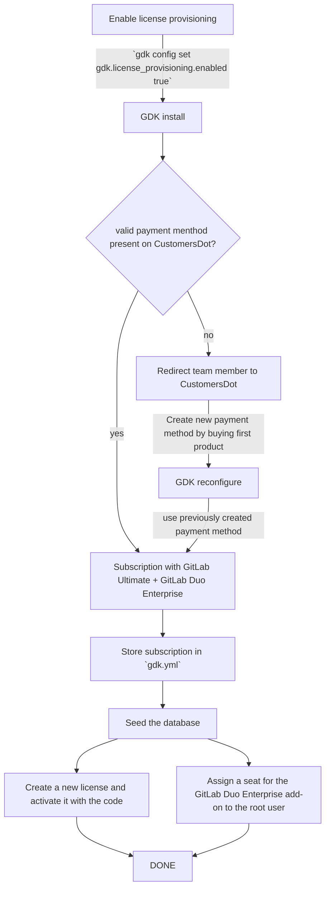
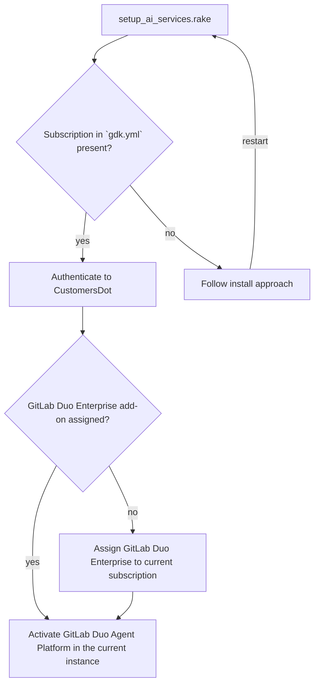
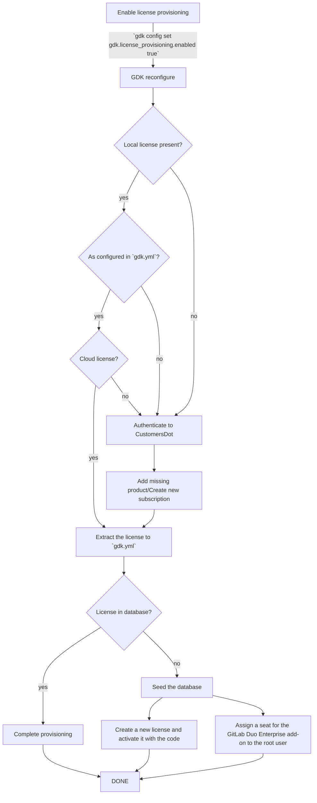

<!-- Design Documents often contain forward-looking statements -->
<!-- vale gitlab.FutureTense = NO -->

<!-- This renders the design document header on the detail page, so don't remove it-->

<div class="my-3 border-l-4 border-blue-500 bg-blue-50 px-4 py-3 rounded-r text-sm text-blue-800">
このページには今後予定されている製品・機能・機能性に関する情報が含まれています。ここに示す情報は参考目的のみです。購入・計画の決定にこの情報を使用しないでください。製品・機能・機能性の開発、リリース、タイミングは変更または延期される可能性があり、GitLab Inc. の独自の判断に委ねられています。
</div>

<div class="overflow-x-auto my-4">
<table class="w-full text-sm border-collapse">
<thead>
<tr class="bg-gray-100 text-left">
<th class="px-3 py-2 border border-gray-300">Status</th>
<th class="px-3 py-2 border border-gray-300">Authors</th>
<th class="px-3 py-2 border border-gray-300">Coach</th>
<th class="px-3 py-2 border border-gray-300">DRIs</th>
<th class="px-3 py-2 border border-gray-300">Owning Stage</th>
<th class="px-3 py-2 border border-gray-300">Created</th>
</tr>
</thead>
<tbody>
<tr>
<td class="px-3 py-2 border border-gray-300"><span class="inline-block rounded px-2 py-0.5 text-xs font-medium bg-gray-100 text-gray-700">proposed</span></td>
<td class="px-3 py-2 border border-gray-300"><a href="https://gitlab.com/M_Alvarez" class="text-blue-600 hover:underline">@M_Alvarez</a></td>
<td class="px-3 py-2 border border-gray-300"></td>
<td class="px-3 py-2 border border-gray-300"><a href="https://gitlab.com/mgamea" class="text-blue-600 hover:underline">@mgamea</a></td>
<td class="px-3 py-2 border border-gray-300"><span class="inline-block rounded px-2 py-0.5 text-xs font-medium bg-gray-100 text-gray-700">~devops::developer experience</span></td>
<td class="px-3 py-2 border border-gray-300">2025-10-24</td>
</tr>
</tbody>
</table>
</div>


## 用語集

| 用語 | 意味 |
| ---- | ------- |
| AIコンポーネント | AIゲートウェイや GitLab Duo ワークフローサービスなど、AIフィーチャーをローカルで使用するために稼働する必要があるコンポーネント。 |
| AIフィーチャー | GitLab Agent Platform や GitLab Duo Chat などの GitLab フィーチャー。 |
| [CustomersDot](https://gitlab.com/gitlab-org/customers-gitlab-com) | GitLab サブスクリプション、請求先情報、支払い、ライセンス詳細を管理するカスタマーポータル。 |
| GDK | [GitLab Development Kit](https://gitlab.com/gitlab-org/gitlab-development-kit/)。ローカル GitLab インスタンスをセットアップするための開発ツール。 |
| GitLab EE | GitLab Enterprise Edition。アクティベーションコードを使用して有効化でき、エンタープライズフィーチャーを利用可能にする。 |
| GitLab ライセンス | GitLab ライセンスは、Premium や Ultimate などのティアを持ちながら、セルフマネージドまたは Dedicated インスタンスをサポートできる。 |
| GitLab サブスクリプション | GitLab サブスクリプションは、複数の製品を保持するバケットとして捉えることができる。製品の 1 つが GitLab ライセンスであり、別の製品が GitLab Duo Enterprise アドオンとなる場合がある。 |
| GitLab サブスクリプション名 | サブスクリプション購入後に CustomersDot が提供する名称。例: 'A-S00012345'。 |
| チームメンバー | GitLab Inc. で働く GitLab の従業員およびスタッフ。 |
| [Zuora](https://www.zuora.com/) | GitLab が購入、請求、サブスクリプション管理に使用するアプリケーション。 |

## 概要

GitLab AI フィーチャーの開発には、GitLab Duo Enterprise アドオンを含む GitLab Ultimate ライセンスを持つ GitLab サブスクリプションが必要です。
GitLab Duo Enterprise アドオンは現在、手動プロセスを通じてプロビジョニングされており、チームの生産性を低下させ、フィーチャー開発ワークフローを遅延させています。

この提案では、GDK セットアッププロセスに GitLab Duo Enterprise アドオンを含む GitLab ライセンスの自動プロビジョニングを統合し、チームメンバーが手動介入なしに開発・テスト用ライセンスに即座にアクセスできるようにします。

## 動機

ステージング AI ゲートウェイを使用して GitLab 製品の GitLab AI フィーチャーを開発またはレビューする際、チームメンバーは GitLab Development Kit (GDK) を使用したローカル開発環境に、GitLab Duo Enterprise アドオンを含む GitLab ライセンスが必要です。
2025 年 10 月 27 日時点では、GitLab Duo Enterprise アドオンは Fulfillment チームによる手動介入によってのみ取得可能であり、開発ワークフローに大きなボトルネックが生じています。

GitLab のカスタマーポータルである CustomersDot にはセルフサービスのプロビジョニングフローが存在しないため、チームメンバーはリクエストを提出して手動によるアドオン割り当てを待つ必要があり、数時間かかることがあります。

この手動プロセスが存在するのは、Subscription Management チームが、CustomersDot への GitLab Duo Enterprise アドオンの統合を[購入フローの統合という大きなイニシアチブ](https://gitlab.com/groups/gitlab-org/-/epics/12199)によってブロックされていると判断しているからです。
GitLab Duo Enterprise アドオンを CustomersDot に追加する予定タイムラインは FY27-Q1 以降です。

現在の[手動プロビジョニングプロセス](https://docs.gitlab.com/development/ai_features/ai_development_license/#duo-enterprise)はいくつかの問題を引き起こしています:

- **開発者の生産性:** チームメンバーはアドオンプロビジョニングを数時間待つ遅延を経験し、環境のセットアップと作業開始の能力がブロックされます。
- **レビュー品質:** 高い摩擦によって、レビュアーがローカルで AI フィーチャーをテストすることが抑制されます。レビュアーが変更をテストするために環境を容易にセットアップできない場合、コードレビューのみに頼ることになり、欠陥の見逃しリスクが高まります。
- **チームの負担:** Fulfillment チームが個々のアドオンリクエストを処理する運用上の負担を負い、リクエスト者とプロビジョナー双方に非効率を生じさせます。

内部開発目的のセルフサービスライセンスプロビジョニングを有効化することで:

- チームメンバーが必要なライセンスとアドオンに即座にアクセスできるようにすることで**開発速度を向上**させます。
- GDK を使用した開発環境内での AI フィーチャーのテストを簡略化することで**エスケープ欠陥率を低減**します。
- 内部開発アドオンに関する Fulfillment チームのボトルネックを排除することで**運用オーバーヘッドを削減**します。

この統合は開発者エクスペリエンスを改善する長期的なソリューションとして機能します。

### 目標

- GDK においてチームメンバー向けに GitLab Duo アドオンを含む GitLab サブスクリプションをプロビジョニングする、統合された自動セルフサービスプロセスを作成する。

### 対象外

- コミュニティコントリビューターはステージング CustomersDot にアクセスできず、[こちら](/handbook/marketing/developer-relations/engineering/community-contributors-workflows/#contributing-to-the-gitlab-enterprise-edition-ee)に概要が記載されているとおり、ライセンスを取得するための[リクエスト](https://gitlab.com/gitlab-org/developer-relations/contributor-success/team-task/-/issues/new?issuable_template=contributor_ee_license_request)を作成する必要があるため、コミュニティコントリビューター向けの自動ライセンス生成は対象外とする。
- 顧客向けの購入フローの効率化

## 提案

GDK で AI コンポーネントをセットアップする際、チームメンバーは AI ゲートウェイのセットアップ方法を指定するよう求められます。
ローカル AI ゲートウェイではなくステージング AI ゲートウェイを使用することを選択した場合、ステージングのセルフマネージド GitLab Ultimate ライセンスと GitLab Duo Enterprise アドオンを含むサブスクリプションが必要です。
ステージング CustomersDot からステージングのセルフマネージド GitLab Ultimate ライセンスを含む新しいサブスクリプションを手動で購入し、Fulfillment チームに GitLab Duo Enterprise アドオンのプロビジョニングを依頼する代わりに、GDK が前述の製品を含む新しいサブスクリプションの購入とローカルインスタンスへのアクティベーションを引き受けます。
これにより、チームメンバーは Fulfillment チームによる手動アドオンプロビジョニングを待つことなく、ローカルで AI フィーチャーをテストできるようになります。

GDK は以下を実行します:

- GitLab のステージングを通じてステージング CustomersDot に認証する。
- ステージングのセルフマネージド GitLab Ultimate ライセンスを含む新しいサブスクリプションを作成する。
- デフォルトまたは指定されたシート数で、サブスクリプションに GitLab Duo Enterprise アドオンを自動的に添付する。
- GitLab サブスクリプションの暗号化されたコピーを `gdk.yml` ファイルに保存する。
- GitLab サブスクリプションをローカル GDK インスタンスに割り当てる。
- 以前に購入したシートの 1 つをルートユーザーに割り当てる。

### 利点

- ライセンスプロビジョニングが自動的に行われる。
- 開発者の手動ステップが削減される。
- 容易に再現できる。
- ステージング Zuora インスタンスが定期的にリフレッシュされ、すべてのサブスクリプションデータがリセットされる際、矛盾なく新しいサブスクリプションをプロビジョニングできる。

### 欠点

- CustomersDot プラットフォームへの新しい依存関係が生まれる。CustomersDot が利用できない場合、自動ライセンスプロビジョニングがブロックされる。

### 成功指標

- **エンドツーエンドのプロビジョニング時間:** 開発者のリクエスト開始からライセンスのアクティベーションまでの時間。
- **手動介入率:** Fulfillment チームによる手動介入が必要なプロビジョニングリクエストの割合。

## 設計と実装の詳細

自動ライセンスプロビジョニングはチームメンバーのみが利用できるため、手動で有効化する必要があります。
そのため、サブスクリプションの製品のさまざまな組み合わせをサポートする設定を追加します:

```yaml
gdk:
  license_provisioning:
    edition: ['self_managed', 'saas'] # 'self_managed' as default since this supports the configuration with the staging AI gateway
    enabled: false # false by default so team members can opt in
    duo:
      seats: 150 # this should be a reasonable number, the default seed creates 68 users
      tier: ['enterprise', 'pro'] # 'enterprise' as default since this supports the configuration with the staging AI gateway
    gitlab:
      seats: 150 # this should be a reasonable number, the default seed creates 68 users
      tier: ['ultimate', 'premium'] # 'ultimate' as default as it covers most use cases
```

### GDK から CustomersDot への認証

GDK からチームメンバーを CustomersDot に直接認証するためには、すべてのチームメンバーがそれぞれの GDK インスタンスにステージングの [JWT 署名キー](https://gitlab.com/gitlab-org/gitlab/-/blob/68d9fb11446cbfe156a8ac437d99ea6ef9c2e510/ee/lib/gitlab/customers_dot/jwt.rb#L37)を設定する必要があります。
これは、複数のチームメンバーとステージングの間で単一の機密認証情報を共有することを意味するため、セキュアな実践ではありません。

チームメンバーをより安全に CustomersDot に認証するために、GDK はチームメンバーの GitLab ステージング認証情報を使用して GitLab ステージングへの GraphQL リクエストを行います。
GitLab ステージングはその後、リクエストをステージング CustomersDot に転送します。

1. チームメンバーは GDK に GitLab ステージング認証情報（例: パーソナルアクセストークン）を提供します。
1. GDK は GitLab ステージング認証情報を使用して `staging.gitlab.com/-/customers_dot/proxy/graphql` エンドポイントへの GraphQL リクエストを行います。
1. GitLab ステージングサーバー（`staging.gitlab.com`）がリクエストをステージング CustomersDot（`customers.staging.gitlab.com`）に転送します。
1. リクエストは [JWT 署名キー](https://gitlab.com/gitlab-org/gitlab/-/blob/68d9fb11446cbfe156a8ac437d99ea6ef9c2e510/ee/lib/gitlab/customers_dot/jwt.rb#L37)を使用し、GitLab ユーザー ID を設定することで転送されます。

完全な認証プロセスの詳細については、この [Issue](https://gitlab.com/gitlab-org/fulfillment/meta/-/issues/2499) を参照してください。

### 新規 GDK インスタンスのインストール

1. `gdk config set gdk.license_provisioning.enabled true` でライセンスプロビジョニングを有効化します。
1. CustomersDot に認証して、有効で有効なお支払い方法があるか確認します。
お支払い方法は[請求アカウント設定](https://customers.staging.gitlab.com/billing_accounts)で設定でき、通常は[テスト用クレジットカード](https://gitlab.com/gitlab-org/customers-gitlab-com/#testing-credit-card-information)を使用して作成されます。
お支払い方法がない場合、チームメンバーはお支払い方法を作成して最初のライセンスを購入するためにブラウザにリダイレクトされます。これは、お支払い方法の作成が UI からのみ可能なため、必須の手順です。
1. CustomersDot GraphQL API を使用して、以前に作成したお支払い方法の ID を取得します。
1. セルフマネージド GitLab Ultimate ライセンスを含む新しいサブスクリプションを作成し、デフォルトまたは指定されたシート数で GitLab Duo Enterprise アドオンを追加します。
1. 新しいサブスクリプションを暗号化して `gdk.yml` ファイルに保存します。
1. データベースのシードには新しいサブスクリプションを使用します。データベースでは:
   1. アクティベーションコードを使用して新しいライセンスを作成します。これによりセルフマネージド GitLab Ultimate ライセンスが保存されます。
   1. GitLab Duo Enterprise アドオンの関連アドオン購入を検索します。
   1. GitLab Duo Enterprise アドオンのシートをルートユーザーに割り当てます。
1. これにより、チームメンバーが GDK をセットアップする際に、GitLab Duo Enterprise アドオン付きのセルフマネージド GitLab Ultimate ライセンスを自動的に取得できます。

`gdk.yml` ファイル内の GitLab サブスクリプションの構造は、サブスクリプションの詳細を含む以下のキーと値のペアになります:

```yml
gitlab_subscription:
  activation_code: "activation_code",
  expiration_date: "2026-11-12",
  edition: "self_managed",
  gitlab_tier: "ultimate",
  duo_tier: "enterprise"
```



### ステージング AI ゲートウェイを使用したローカル AI 開発環境のセットアップ

1. サブスクリプション名を使用して CustomersDot に認証し、GitLab Duo Enterprise アドオンを以前に作成したサブスクリプションに追加します。
  これは `lib/tasks/setup_ai_services.rake` タスク内で実行できます。
1. GitLab Duo Enterprise アドオンを追加する際は、シート数にデフォルト値を使用します。
1. GitLab Duo Enterprise アドオンが設定されたら、GitLab Duo Agent Platform をアクティベートし、ローカル AI 開発に必要なその他の設定を行います。



### 既存 GDK インスタンス

GDK をすでに使用しているチームメンバーが GitLab Duo Enterprise アドオン付きのセルフマネージド GitLab Ultimate ライセンスを取得できるよう:

1. `gdk config set gdk.license_provisioning.enabled true` でライセンスプロビジョニングを有効化します。
1. データベースが既存であるため、ライセンスが存在するか確認します。
1. ライセンスが存在する場合:
   1. `gdk.yml` の設定を既に満たしているか確認します。
   1. クラウドライセンスかどうか `License.current.cloud?` を確認します。
   1. 前の確認条件が満たされている場合、GitLab ライセンスを暗号化して `gdk.yml` に抽出し、プロビジョニングを完了します。
   1. 前の確認条件が満たされていない場合、CustomersDot に認証してチームメンバーが現在のライセンスを所有しているか確認します。
   1. チームメンバーが現在のライセンスを所有している場合:
      1. CustomersDot に認証して GitLab サブスクリプションに欠けている製品を追加します。
      1. GitLab ライセンスを暗号化して `gdk.yml` に抽出します。
      1. 現在のライセンスが `gdk.yml` に保存されているものと同じか、データベースのクイックチェックを行います。
      これは、現在のライセンスのデータと `gdk.yml` に保存されている `activation_code` を比較することで実行できます。
      1. 現在のライセンスが `gdk.yml` に保存されているライセンスと一致する場合、目的のライセンスはすでに使用中であり、プロビジョニングは完了です。
      1. 現在のライセンスが `gdk.yml` に保存されているライセンスと一致しない場合、新しい製品を使用します。データベースでは:
         1. アクティベーションコードを使用して新しいライセンスを作成します。これによりセルフマネージド GitLab Ultimate ライセンスが保存されます。
         1. GitLab Duo Enterprise アドオンの関連アドオン購入を検索します。
         1. GitLab Duo Enterprise アドオンのシートをルートユーザーに割り当てます。
   1. チームメンバーが現在のライセンスを所有していない場合、ライセンスを含む GitLab サブスクリプションに製品を追加することはできません。ライセンスが存在しないものとして続行します。
1. ライセンスが存在しない場合:
   1. CustomersDot に認証して、有効で有効なお支払い方法があるか確認します。
   お支払い方法は[請求アカウント設定](https://customers.staging.gitlab.com/billing_accounts)で設定でき、通常は[テスト用クレジットカード](https://gitlab.com/gitlab-org/customers-gitlab-com/#testing-credit-card-information)を使用して作成されます。
   お支払い方法がない場合、チームメンバーはお支払い方法を作成して最初のライセンスを購入するためにブラウザにリダイレクトされます。これは、お支払い方法の作成が UI からのみ可能なため、必須の手順です。
   1. CustomersDot GraphQL API を使用して、以前に作成したお支払い方法の ID を取得します。
   1. セルフマネージド GitLab Ultimate ライセンスを含む新しいサブスクリプションを作成し、デフォルトまたは指定されたシート数で GitLab Duo Enterprise アドオンを追加します。
   1. 新しいサブスクリプションを暗号化して `gdk.yml` に保存します。
   1. 新しいサブスクリプションを使用します。データベースでは:
      1. アクティベーションコードを使用して新しいライセンスを作成します。これによりセルフマネージド GitLab Ultimate ライセンスが保存されます。
      1. GitLab Duo アドオンの関連アドオン購入を検索します。
      1. GitLab Duo Enterprise アドオンのシートをルートユーザーに割り当てます。



### ステージング AI ゲートウェイと Cells インフラを使用したローカル AI 開発環境のセットアップ

Cells インフラを有効にして GDK を実行する場合、各 Cell でライセンスをアクティベートする必要があります。
これは、ライセンスデータベーステーブルが各 Cell 固有であるためです。

1. GDK が Cells を有効にして実行されているか確認するために現在の設定を確認します: `GDK.config.cells.enabled`。
1. `gdk config set gdk.license_provisioning.enabled true` でライセンスプロビジョニングを有効化します。
1. 最初の Cell の場合:
   1. データベースが既存であるため、ライセンスが存在するか確認します。
   1. ライセンスが存在する場合:
      1. `gdk.yml` の設定を既に満たしているか確認します。
      1. クラウドライセンスかどうか `License.current.cloud?` を確認します。
      1. 前の確認条件が満たされている場合、ライセンスを暗号化して `gdk.yml` に抽出し、この Cell のプロビジョニングを完了して、そのライセンスを他のすべての Cell に対して有効とマークします。
      1. 前の確認条件が満たされていない場合、チームメンバーが現在のライセンスを所有しているか確認します。
      1. チームメンバーが現在のライセンスを所有している場合、CustomersDot に認証して GitLab サブスクリプションに欠けている製品を追加します。
      1. チームメンバーが現在のライセンスを所有していない場合、ライセンスを含む GitLab サブスクリプションに製品を追加することはできません。ライセンスが存在しないものとして続行します。
   1. ライセンスが存在しない場合:
      1. CustomersDot に認証して、有効で有効なお支払い方法があるか確認します。
      お支払い方法は[請求アカウント設定](https://customers.staging.gitlab.com/billing_accounts)で設定でき、通常は[テスト用クレジットカード](https://gitlab.com/gitlab-org/customers-gitlab-com/#testing-credit-card-information)を使用して作成されます。
      お支払い方法がない場合、チームメンバーはお支払い方法を作成して最初のライセンスを購入するためにブラウザにリダイレクトされます。これは、お支払い方法の作成が UI からのみ可能なため、必須の手順です。
      1. CustomersDot GraphQL API を使用して、以前に作成したお支払い方法の ID を取得します。
      1. セルフマネージド GitLab Ultimate ライセンスを含む新しいサブスクリプションを作成し、デフォルトまたは指定されたシート数で GitLab Duo Enterprise アドオンを追加します。
      1. 新しいサブスクリプションを暗号化して `gdk.yml` に保存します。
      1. 新しいサブスクリプションを使用し、この Cell に追加して、ライセンスを他のすべての Cell に対して無効とマークします。
1. 他のすべての Cell の場合:
   1. ライセンスが有効とマークされている場合:
      1. 現在のライセンスが `gdk.yml` に保存されているものと同じか、データベースのクイックチェックを行います。
      これは、現在のライセンスのデータと `gdk.yml` に保存されている `activation_code` を比較することで実行できます。
      1. 現在のライセンスが `gdk.yml` に保存されているライセンスと一致する場合、目的のライセンスはすでに使用中です。
      1. 現在のライセンスが `gdk.yml` に保存されているライセンスと一致しない場合、ライセンスが無効とマークされているものとして続行します。
   1. ライセンスが無効とマークされている場合:
      1. データベース内の現在のライセンスを `gdk.yml` に保存されているものに置き換える必要があります。
      1. データベースでは:
         1. 現在のライセンスを削除します。
         1. アクティベーションコードを使用して新しいライセンスを作成します。これによりセルフマネージド GitLab Ultimate ライセンスが保存されます。
         1. GitLab Duo アドオンの関連アドオン購入を検索します。
         1. GitLab Duo Enterprise アドオンのシートをルートユーザーに割り当てます。

## 代替ソリューション

### 単一の GitLab サブスクリプションの共有

組織内のすべてのエンジニアリングチームメンバーがパスワードボールトを使用して共有できる、単一の GitLab サブスクリプションを保持します。
ステージング AI ゲートウェイを使用した AI フィーチャーの開発というユースケースをカバーするために、セルフマネージド GitLab Ultimate ライセンスと GitLab Duo Enterprise アドオンを含むサブスクリプションを提供します。

1Password ボールトが導入されれば、実装するいくつかのオプションがあります:

1. チームメンバーが GitLab サブスクリプションを手動でコピーし、ローカル GDK インスタンスに追加できる。
1. GitLab サブスクリプションをホストし GDK からアクセスできる小さな Auth サービスを作成する。
1. GDK で 1Password CLI ツールを使用してボールトから GitLab サブスクリプションを取得する。

GitLab サブスクリプションが GDK で利用可能になったら、メイン提案で定義されたステップに従い、それぞれのアドオンでローカル GitLab ライセンスをローテーションまたは直接アクティベートします。

**注意**: 単一の GitLab サブスクリプションの共有は中間的なソリューションとして機能し、[Streamline AI development environment setup](https://gitlab.com/groups/gitlab-org/quality/tooling/-/epics/86) イニシアチブの一部として、3 番のアプローチを使用して実装されます。
詳細はこの[関連 Issue](https://gitlab.com/gitlab-org/gitlab-development-kit/-/issues/3096) に記載されています。

**欠点:**

- 共有サブスクリプションへの変更は、同じサブスクリプションを使用しているすべてのインスタンスに影響する。
- 新しいバージョンが確立された場合、サブスクリプションをローテーションする手動作業が発生する。
- ボールト内のサブスクリプションに最も一般的な製品の組み合わせを提供するための一回限りの作業が必要。

質問とその回答、または将来の明確化のための質問:

- Q: サブスクリプションの所有者は誰ですか？
A: AI チームはそれぞれのサブスクリプションを所有します。
<br>

- Q: サブスクリプションはどのように生成されますか？
- A: まず、AI チームは既存の手動パスを使用し、作成されたサブスクリプションをボールトに保存できます。
<br>

- Q: サブスクリプションが期限切れになった際のスムーズなローテーションをどのように保証しますか？
- A: CustomersDot を通じて購入されたサブスクリプションはすでに自動更新に設定されています。これは、お支払い方法が存在して有効である限り、サブスクリプションのローテーションは不要であることを意味します。
- A: 新しいバージョンのサブスクリプションの場合、チームメンバーは `gdk.yml` に保存されているローカルコピーを削除して `gdk reconfigure` を再実行できます。
<br>

- Q: 複数のチームメンバー間で単一のサブスクリプションを共有することに懸念はありますか？
- A: Fulfillment チームによると、単一のサブスクリプションの共有は問題ありません。
<br>

- Q: クラウドサブスクリプションの GitLab Duo Enterprise アドオンのシートはインスタンス間で共有されますか？
- A: Fulfillment チームによると、シートはインスタンス間で共有されません。

### CustomersDot での購入フロー

最も簡単な代替手段は、CustomersDot に購入フローが設けられた時点で可能になります。
チームメンバーは手動ステップに従い、GitLab サブスクリプションに GitLab Duo Enterprise アドオンを追加できます。
同様のアプローチが、[GitLab ライセンス](/handbook/support/internal-support/#gitlab-plan-or-license-for-team-members)の取得に関してハンドブックにすでに文書化されています。
これは実装するためのコストが最も少ないですが、チームメンバーにとってはまだかなりの手動ステップが伴います。
