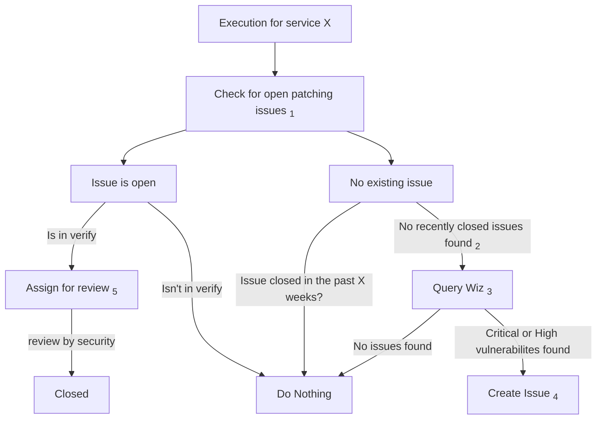

このページには今後予定されている製品・機能・機能性に関する情報が含まれています。ここに示す情報は参考目的のみです。購入・計画の決定にこの情報を使用しないでください。製品・機能・機能性の開発、リリース、タイミングは変更または延期される可能性があり、GitLab Inc. の独自の判断に委ねられています。

<table class="w-full text-sm border-collapse">
<thead>
<tr class="bg-gray-100 text-left">
<th class="px-3 py-2 border border-gray-300">Status</th>
<th class="px-3 py-2 border border-gray-300">Authors</th>
<th class="px-3 py-2 border border-gray-300">Coach</th>
<th class="px-3 py-2 border border-gray-300">DRIs</th>
<th class="px-3 py-2 border border-gray-300">Owning Stage</th>
<th class="px-3 py-2 border border-gray-300">Created</th>
</tr>
</thead>
<tbody>
<tr>
<td class="px-3 py-2 border border-gray-300">ongoing</td>
<td class="px-3 py-2 border border-gray-300"><a href="https://gitlab.com/mattmi" class="text-blue-600 hover:underline">@mattmi</a></td>
<td class="px-3 py-2 border border-gray-300"><a href="https://gitlab.com/jarv" class="text-blue-600 hover:underline">@jarv</a></td>
<td class="px-3 py-2 border border-gray-300"></td>
<td class="px-3 py-2 border border-gray-300"></td>
<td class="px-3 py-2 border border-gray-300">2024-09-12</td>
</tr>
</tbody>
</table>

このドキュメントは作業中であり、GitLab.com SaaS のアーキテクチャ変更を提案するものです。
このドキュメントの目的は、GitLab.com をサポートする主要な Linux フリートへのセキュリティパッチ適用プロセスを定義することです。

このドキュメントは、既存のプロセスとパッチ適用ケイデンスが定義されている Linux OS パッチ適用の[ランブック](https://gitlab.com/gitlab-com/runbooks/-/blob/master/docs/security-patching/linux-os/linux-os-patching.md?ref_type=heads)を拡張することを意図しています。スコープ定義については、そのドキュメントを参照してください。

## 現在の状態

前述のランブックの[サービス](https://gitlab.com/gitlab-com/runbooks/-/blob/master/docs/security-patching/linux-os/linux-os-patching.md?ref_type=heads#services)セクションで説明されているとおり、現在スコープ内のほとんどのシステムには、セキュリティパッチを最新の状態に保つための有意義な自動化が欠けています。これは、現在行われているほとんどのパッチ適用が本質的にリアクティブであり、手動で実施されることを意味します。これは時間がかかり、SRE チームにとって相当な負担を表しています。

## スコープ

この提案は、GitLab.com で実行されているサービスを直接サポートする VM インスタンスで見つかったカーネルおよび OS パッケージの脆弱性を対象とします。対象とする主要なフリートは以下のとおりです:

| サービス | オーナー | エクスポージャー | メンテナンス影響 | 自動化 |
| ------- | ----- | -------- | :----------------: | :--------: |
| Runner Managers | scalability:practices | internal | low | no |
| HAProxy | production_engineering_networking_and_incident_management | external | low | no |
| Gitaly | gitaly | internal | high | no |
| Patroni | reliability_database_reliability | internal | low | no |
| PGBouncer | reliability_database_reliability | internal | low | no |
| Redis | scalability_practices | internal | low | no |
| Console | none | internal | low | no |
| Deploy | none | internal | medium | no |
| Bastions | none | external | low | no |

*追加の詳細については[ランブックのテーブル](https://gitlab.com/gitlab-com/runbooks/-/blob/master/docs/security-patching/linux-os/linux-os-patching.md?ref_type=heads#services)を参照してください*

## 提案

この提案は以下を行うプロセスを実装しようとするものです:

1. Linux OS パッチ適用[ランブック](https://gitlab.com/gitlab-com/runbooks/-/blob/master/docs/security-patching/linux-os/linux-os-patching.md?ref_type=heads#services)で以前に定義されたパッチ適用ケイデンスに基づき、パッチ適用の期限が近づいたときにシステムオーナーに通知する。通知にはこれらの最新の脆弱性発見を含める必要があります。
1. パッチ自動化ツールを実装するための共通の場所を提供する。可能な限りシステム全体で共通のツールセットを使用することで、作業の重複とプロセスのメンテナンスオーバーヘッドを避けます。
1. パッチ適用が実行されたら、特定された問題が解決されたかどうかを確認する新しい脆弱性レポートをシステムに提供します。
1. 結果をセキュリティおよびコンプライアンスチームに提供します。

### 通知

*以下の提案は、[VulnMapper](https://gitlab.com/gitlab-com/gl-security/threatmanagement/vulnerability-management/vulnerability-management-internal/vulnmapper) 内で恒久的なソリューションが構築される間、機能するシステムパッチ適用通知を導入するためのストップギャップソリューションとして計画されています。*

適切なサービスオーナーチームに割り当てられた GitLab Issue を作成する責任を担うスクリプトを作成することを提案します。

このワークフローの一般的な流れは以下のようになります:

1. スクリプトはパッチ適用と再起動のケイデンスを定義するサービス設定を検索します。
    1. これは [service-catalog](https://gitlab.com/gitlab-com/runbooks/-/blob/master/services/service-catalog.yml) から取得するか、スクリプトに対してローカルな設定から取得することができます。
1. 各サービスの以前にクローズ（またはオープン）されたパッチ適用通知 Issue を検索します。
1. 各サービスに関連する脆弱性について [Wiz](../../../business-technology/tech-stack/#wizio) にクエリします。
1. システムに Critical または High 重大度の脆弱性が見つかり、以前のパッチ適用 Issue のクローズ時間に基づいてパッチ適用期限が来ている場合、脆弱性の発見を添付した新しい Issue を作成します。
1. パッチ適用が完了したら（ワークフローラベルによって指定）、更新された発見を Issue に添付して Wiz に再度クエリします。
1. セキュリティ/コンプライアンスチームに最終承認のために通知（または割り当て）します。

この提案がどのように機能するかのフローチャート:

1. スクリプト実行に関連する `~Service::` ラベルを含むすべてのパッチ適用 Issue を検索します。オープンなものがなければ、最後にパッチ適用 Issue がクローズされた時刻を記録します。
2. 最近クローズされたとは、現在日付からサービス固有のパッチ適用ケイデンスを差し引いたものとして定義されます。これは主に、合意されたパッチ適用ケイデンス内に単一の Issue のみを作成するためのメカニズムとして行われ、Issue のスパムと SRE の相当な負担を防ぎます。
3. 見つかったすべての脆弱性について Wiz にクエリし、共通ラベルでグループ化します。現在これは GCP から取り込まれた `gitlab_com_service` ラベルです。
4. 新しい Issue を作成する際は以下を行います:
    1. CVE でグループ化されたフリートで見つかった脆弱性の要約を追加します。
    1. 期限を設定します。
    1. Issue をチーム（またはそのチームのマネージャー）に割り当てます。
5. Issue が `workflow-infra::verify` に移動したら、更新された脆弱性リストを Issue に添付し、レビューを担当するユーザー/チームに割り当てます。

### パッチ自動化

#### 提案

セキュリティパッチの適用を自動化するために、中央リポジトリに保存された Ansible プレイブックを使用することを提案します。CI パイプラインを使用して、適用可能な場所でパッチの適用を自動化します。

当初、CI パイプラインは各サービスの定義されたパッチ適用ケイデンスに基づいて作成されるパッチ適用通知 Issue に応じて手動で実行される可能性が高いです。プロセスへの信頼が構築されるにつれ、これらのパイプラインはスケジュールで実行されるよう設定でき、SRE の介入は不要になります。

プレイブックの例:

- [HAProxy](https://gitlab.com/gitlab-com/gl-infra/ops-team/toolkit/patch-automation/-/blob/main/haproxy.yaml?ref_type=heads)
- [Bastion ホスト](https://gitlab.com/gitlab-com/gl-infra/ops-team/toolkit/patch-automation/-/blob/main/bastion.yaml?ref_type=heads)

メリット:

- 以下のような共通タスクを簡単に再利用できます:
  - アラートのサイレンス/アンサイレンス
  - Chef の有効化/無効化
  - Apt パッケージのアップグレード
- 変数で並行性と更新の順序を容易に制御できます。
- GCP インベントリプラグインによってシステムの検出が簡単です。
- CI パイプラインからログを保持することで、共通の場所で完全な Ansible プレイブックの出力を「無料で」保持できます。

デメリット:

- すべてのシステムに完全な `sudo` 権限を持つユーザーのインストールが必要です。
  - ログインが許可される場所を特定のシステムに限定することで、ある程度軽減できます。
- これは Chef で管理しているシステムでのみ機能する可能性があります。

##### Ansible の実行

フリートの大部分で Ansible を実行するために必要な昇格した権限を考えると、実行元とログインを許可するプライベートキーへのアクセス権を持つユーザーについて注意が必要です。以下のリスク軽減技術を使用します:

1. プライベートキーは限られた読み取りアクセスで Vault に保存されます。
1. キーは ops.gitlab.net GitLab インスタンスの単一プロジェクトからのみ使用され、Vault から取得されます。
1. このプロジェクトへの Git コミットとパイプライン実行は、パッチ適用オペレーションを担当するインフラ SRE に限定されます。
1. この目的のためにプロビジョニングされたユーザーは、us-central1 で実行される Ops GitLab インスタンスのランナーが作成される単一のネットワークへのログインに制限されます。
1. GPRD 環境でのパイプライン実行前に、複数の資格のある SRE による複数の承認を要求するために保護された環境が使用されます。
1. リポジトリは、[Security Compliance Intake](https://gitlab.com/gitlab-com/gl-security/security-assurance/security-compliance-commercial-and-dedicated/security-compliance-intake/-/issues/new?issue%5Btitle%5D=System%20Intake:%20%5BSystem%20Name%20FY2%23%20Q%23%5D&issuable_template=intakeform) Issue の完了によって定期的なコンプライアンス監査の対象となります。

#### 検討した代替案

##### Ansible Pull

メリット:

- [ansible-pull](https://docs.ansible.com/ansible/latest/cli/ansible-pull.html) はプルベースであるため、パッチ適用を調整するためにフリート全体に昇格した認証情報をインストールする必要がありません。
- 共通タスクはノード間で再利用できる可能性があります。

デメリット:

- ansible-pull は cron を使用するため、各ノードでパッチがいつ適用されるかを制御することが難しい（または不可能な）場合があります。
- これは Chef で管理しているシステムでのみ機能する可能性があります。

##### 内部開発のパッチ適用スクリプト

Ansible と同じアクションを実行するが、自分たちで維持するスクリプトを開発することも検討されました。

メリット:

- システムに限られた権限を持つユーザーをプロビジョニングできます。
  - パッチ適用に必要なコマンドのみへの `sudo` 権限を持つユーザーをインストールできます。
- スクリプトは CI パイプラインからリモートインスタンスに対して呼び出すことができます。
- 並行性と更新の順序を引き続き制御できます。
- Chef で管理されていない VM のシステムに対応するスクリプトを作成できます。

デメリット:

- メンテナンスのオーバーヘッドが大きくなる可能性があります。
- プロセスは Ansible のような既存のツールと比べて脆弱になります。
- ログインアクセスを持つユーザーは引き続き各システムにインストールする必要があります。この方法ではユーザーのアクセスを制限するだけです。
