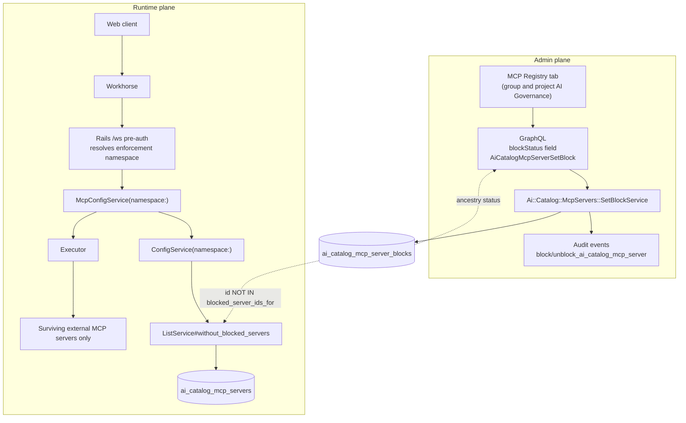
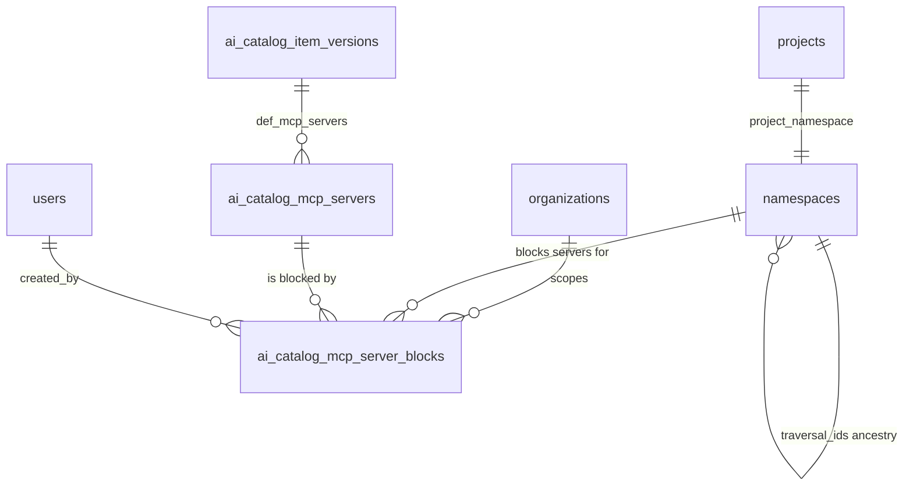

<!-- Design Documents often contain forward-looking statements -->
<!-- vale gitlab.FutureTense = NO -->



## はじめに {#introduction}

Duo Agent Platform（DAP）を導入する組織は、Agentic Chat、Flows、IDE/CLI の各環境で、
Jira、ServiceNow、社内 API などの外部 MCP サーバーに接続します。
これらのサーバーは、エージェントがユーザーに代わって呼び出せるツールを公開しますが、
この作業以前は、どのサーバーを組織が許容するかを namespace 単位で制御する手段がありませんでした。

このドキュメントは、
[外部 MCP サーバーのブロック（ベータ）](https://gitlab.com/groups/gitlab-org/-/work_items/21377)（社内）の設計です。
namespace ごとのブロックモデル、その GraphQL API と MCP Registry UI、Web Agentic Chat 向けの
構成時の強制、およびそれを支える監査証跡を扱います。この作業以前は、
グループまたはプロジェクトの Owner が、その階層内のエージェントから
特定の外部サーバーに到達できないようにする方法はありませんでした。

このドキュメントでは、提供済みの機能を説明します。後続作業であるツールの分類、
ツールごとの制御、環境横断の強制は、意図的にここでは設計しません。
「今後の検討事項」に列挙し、着手時に独自の設計イテレーションを行います。

## 提案 {#proposal}

ブロックを `(namespace, MCP server)` 行としてモデル化し、`traversal_ids` による
namespace の祖先関係を通じて解決します。AI Gateway でツール呼び出しごとに確認するのではなく、
**Rails が Duo Workflow エグゼキューター向けの MCP サーバー構成を組み立てる際に、
ブロックされたサーバーを除外する**ことで強制します。管理者は、グループとプロジェクトの
AI Governance 領域にある MCP Registry タブからブロックを管理し、GraphQL のフィールドとミューテーションがそれを支えます。
ブロックとブロック解除の操作は、namespace にスコープされた監査イベントを出力します。

## ゴール {#goals}

1. サーバーごとの正確なブロック: サーバー A をブロックしても、サーバー B や組み込みの
   GitLab/Orbit ツールには影響しません。
2. ブロックは namespace の階層を下へ継承します。プロジェクトのブロックはプロジェクト内に留まり、
   祖先グループのブロックを緩めることはできません。
3. ガバナンス操作について、管理者が確認でき、ストリーミング可能な監査証跡を提供します。
4. すべての DAP 環境で一貫した動作を実現します。

## 非ゴール {#non-goals}

1. MCP Catalog へのデータ登録。カタログはインベントリの情報源として利用し、ここで構築するものではありません。
2. ツールごとのガバナンスマトリクスの置き換え。サーバーのブロックはそれに優先しますが、日常の
   ガバナンスはそのマトリクスで行います。
3. エピックに挙げられた AI Governance SKU の拡張。エージェントごとの例外付きのデフォルト拒否ポリシー、
   承認ワークフロー、ツールごとのレート制限、ユーザーごとのオーバーライド、
   MCP ガバナンスダッシュボードです。

## スコープ {#scope}

### スコープ内 {#in-scope}

提供済みの基盤である、ブロックのデータモデル、`blockStatus` フィールド、ブロック/許可のミューテーションと
ポリシー、MCP Registry UI、Web Agentic Chat での強制、監査イベントを扱います。項目ごとの
内訳とマージリクエストは、以下の「提供と展開の計画」にあります。

### スコープ外 {#out-of-scope}

1. **インスタンスレベルの「外部 MCP サーバー: 有効 / 無効」スイッチ。** 不要と
   決定しました。インスタンス管理者は MCP サーバーをカタログから削除でき、
   それによりすべてのグループとプロジェクトから削除されるためです。スコープを限定したインスタンスレベルのブロックは、
   顧客から要望があれば再検討できます。
2. ローカル設定の `mcp.json` サーバーを含む、Flows、IDE、CLI での強制。
3. MCP Catalog、ツールごとのガバナンスマトリクス、プロジェクトレベルのオーバーライドへの変更。

## 用語集 {#terminologyglossary}

1. **DAP**: Duo Agent Platform。Agentic Chat、Flows、
   IDE/CLI 環境にまたがる GitLab のエージェントランタイムです。
2. **HITL**: human-in-the-loop。ユーザー承認を待って一時停止するツール呼び出しです。
3. **キルスイッチとブロック**: 「ブロック」は、namespace にスコープされたサーバーごとの制御です。
   エピックの「キルスイッチ」という表現は、外部 MCP の利用全体に対する、
   影響範囲を制御するオン/オフの切り替えを指します。
4. **強制対象の namespace**: 特定のリクエストでサーバーがブロックされるかを判断するために、
   その祖先をたどる単一の namespace です。
5. **プロジェクト namespace**: プロジェクトを支える `Namespaces::ProjectNamespace` レコードです。
   プロジェクトレベルのブロックはこれに対して保存するため、グループとプロジェクトのブロックを
   統一的に解決できます。

## 設計の概要 {#design-overview}

### 中核となるアプローチ {#core-approach}

1. ブロックは `(namespace_id, ai_catalog_mcp_server_id)` をキーとする行です。
   「許可」の行は存在せず、許可すると namespace 自身のブロックを削除します。
2. 状態の解決では `namespace.self_and_ancestor_ids` をたどります。これは
   `traversal_ids` から得られるため、クエリではなくメモリ内の配列です。
3. グループのブロックは、そのグループ、サブグループ、それらのプロジェクトを対象にします。
   プロジェクト namespace のブロックはそのプロジェクトだけを対象とし、上位には伝播しません。
4. Rails がエグゼキューターの MCP 構成を構築する箇所で強制するため、
   呼び出し時に拒否するのではなく、ブロックされたサーバーのツールをエージェントに
   提示しません。
5. 信頼するファーストパーティーの `gitlab` と `orbit` サーバーは、`McpConfigService#execute` 内の
   別のコードパスで組み立てるため、構造上フィルターの対象外です。

### 現在のアーキテクチャ {#current-architecture}

この作業以前は、`/api/v4/ai/duo_workflows/ws` 事前認可エンドポイントが、
エージェントのバージョンに関連付けられたすべてのカタログサーバーから、エグゼキューターの MCP 構成を構築していました。
このパスのガバナンス制御は、カタログの MCP 全体をオフにするルート namespace の
`duo_workflow_mcp_enabled` 設定と、サーバーを認識しない
ツールごとのガバナンスマトリクスだけでした。

### 提案するアーキテクチャ {#proposed-architecture}

追加するのは 2 つです。ブロック行を書き込む管理系統と、それを読み取る、既存の
構成構築処理内のフィルターです。



### 強制時のリクエストフロー {#enforcement-request-flow}

1. ユーザーメッセージ、ツール承認、新しいチャットセッションのたびに新しい WebSocket を開きます。
   Workhorse は、Rails の `/api/v4/ai/duo_workflows/ws` エンドポイントに対して事前認可を行います。
2. Rails は強制対象の namespace を解決します。プロジェクトがスコープ内ならプロジェクト namespace、
   それ以外なら検証済みのルートに紐付けたリクエストの namespace を使用します。
3. `Ai::Catalog::McpServers::ListService` は、インデックスを使う 1 つの
   サブクエリ（`namespace.self_and_ancestor_ids` のブロックに対する `id NOT IN`）で、ブロックされたサーバーを除外します。
4. Workhorse は残ったサーバーの MCP セッションだけを構築します。エージェントには、
   ブロックされたサーバーのツールは見えません。

[!251329](https://gitlab.com/gitlab-org/gitlab/-/merge_requests/251329) で実装しました。

### ツール呼び出しごとではなく構成時に行う理由 {#why-configuration-time-and-not-per-tool-call}

当初の計画は、AI Gateway でツール呼び出しごとに確認するものでした。その方法では、
4 つのリポジトリをまたいですべてのツールメッセージに安定したサーバー識別情報が必要になり、ツール呼び出しごとに
GraphQL の往復が追加され、クライアントがサーバー識別情報を省略すると、外部ツールを*すべて*ブロックする
動作に退行しました。Product は次のメッセージからの強制を受け入れ、Web クライアントは
メッセージや承認のたびに再接続するため、構成時のフィルタリングで、
無効化の仕組みなしに最新の状態を強制できます。

記録のため、以前の計画にあった前提を 1 つ訂正します。`/ws` の構成ペイロードは
すべての DAP 環境に供給されると考えられており、その場合、このフィルターは
本質的に環境横断となるはずでした。しかし、実装中の検証で、これを利用するのは Web
Agentic Chat だけと分かりました。Flows は Rails から MCP 構成を構築せず、IDE/CLI は
ローカルファイルを読み込みます。そのため、環境横断の強制は独立した後続作業です。

## データモデル {#data-model}

既存テーブルの変更はありません。テーブルを 1 つ追加します
（[!243019](https://gitlab.com/gitlab-org/gitlab/-/merge_requests/243019)）。

### 新しいテーブル {#new-table}

```sql
CREATE TABLE ai_catalog_mcp_server_blocks (
  id                       bigserial PRIMARY KEY,
  created_at               timestamptz NOT NULL,
  updated_at               timestamptz NOT NULL,
  organization_id          bigint NOT NULL REFERENCES organizations(id),
  namespace_id             bigint NOT NULL REFERENCES namespaces(id),
  ai_catalog_mcp_server_id bigint NOT NULL REFERENCES ai_catalog_mcp_servers(id),
  created_by_id            bigint NULL REFERENCES users(id)
);

CREATE UNIQUE INDEX idx_ai_catalog_mcp_server_blocks_on_org_ns_server
  ON ai_catalog_mcp_server_blocks (organization_id, namespace_id, ai_catalog_mcp_server_id);
CREATE INDEX idx_ai_catalog_mcp_server_blocks_on_ns_and_server
  ON ai_catalog_mcp_server_blocks (namespace_id, ai_catalog_mcp_server_id);
CREATE INDEX idx_ai_catalog_mcp_server_blocks_on_mcp_server_id
  ON ai_catalog_mcp_server_blocks (ai_catalog_mcp_server_id);
```

テーブルメタデータ（`db/docs/ai_catalog_mcp_server_blocks.yml`）は、`gitlab_schema: gitlab_main_org`、
`feature_categories: [workflow_catalog]`、`table_size: small`、シャーディングキー
`organization_id` です。

シャーディングキーの宣言は誤っています。行は namespace が所有し、`organization_id` は
MCP サーバーから取得した非正規化されたコピーです。複数カラムの
`(namespace_id, organization_id)` シャーディングキーへの修正は、
[#627496](https://gitlab.com/gitlab-org/gitlab/-/work_items/627496)（社内）で追跡しています。変更するのは
宣言だけで、スキーマではありません。

### エンティティの関係 {#entity-relationships}



状態カラムはありません。行の存在はブロック、存在しないことは許可を意味します。これにより、
許可の効果を namespace 内に厳格に限定できます。プロジェクト自身の行を削除しても、
祖先グループの行は取り消せません。

## 主要なワークフロー {#core-workflows}

### グループでサーバーをブロックする {#block-a-server-for-a-group}

1. グループに対して `block_ai_catalog_mcp_server` を持つユーザーが **AI Governance > MCP
   registry** を開き、サーバーの行で **Block** を選択します。
2. フロントエンドは、`groupFullPath` と `blocked: true` を指定して `AiCatalogMcpServerSetBlock` を呼び出します。
3. ミューテーションはサーバーを認可し、グループを解決して認可した後、
   `Ai::Catalog::McpServers::SetBlockService` に委任します。
4. サービスは権限を再確認し、サーバーとコンテナーが同じ organization に属することを検証して、
   `McpServerBlock.block!` を呼び出します。これは `RecordNotUnique` を rescue する
   `find_or_create_by!` であり、同時挿入に対して競合を安全に扱え、冪等です。
5. 実際に行を作成した場合にのみ、`block_ai_catalog_mcp_server` 監査イベントを
   出力します。
6. ミューテーションは `blockStatus` を再計算したサーバーを返します。行はブロック済みとして表示され、
   すべての子孫サブグループとプロジェクトには `BLOCKED_BY_ANCESTOR` が表示されます。

### プロジェクトでサーバーをブロックする {#block-a-server-for-a-project}

ミューテーションを `projectFullPath` で呼び出し、サービスが
`container.project_namespace` に対して行を保存する以外は同じです。プロジェクトではなく
プロジェクト namespace に対して保存することで、1 回の祖先走査でグループとプロジェクト両方のブロックを扱えます。

### サーバーを許可する {#allow-a-server}

1. `blocked: false` を指定した `AiCatalogMcpServerSetBlock` は、`McpServerBlock.unblock!` を呼び出します。
   これは、その namespace とサーバーにスコープされた `delete_all` です。
2. 削除件数がゼロでない場合のみ、`unblock_ai_catalog_mcp_server` 監査イベントを
   出力します。そのため、何も変更しないブロック解除で架空のコンプライアンス記録を作ることはありません。
3. 祖先グループもサーバーをブロックしている場合、プロジェクトは引き続き
   `BLOCKED_BY_ANCESTOR` を表示し、強制も維持します。下位レベルで許可しても、
   上位レベルのブロックは上書きできません。

### 表示用にブロック状態を解決する {#resolve-block-status-for-display}

1. `AiCatalogMcpServer.blockStatus` は、`groupFullPath` と
   `projectFullPath` のどちらか 1 つだけを受け取ります。両方を渡すと引数エラーになり、どちらも渡さない場合は
   `ACTIVE` を返すため、イントロスペクションや生成されたクエリは失敗しません。
2. コンテナーを検索して認可し（`read_group` / `read_project`）、GraphQL リクエストごとに
   `context[:mcp_block_status_containers]` へメモ化します。
3. `Ai::Catalog::McpServerBlockStatusBatchLoader` は、クエリ内のすべてのサーバーをまとめ、
   コンテナーの namespace をキーとする 1 回のブロック検索で処理します。
4. 返された行の `namespace_id` がコンテナーの namespace と一致すれば状態は `BLOCKED`、
   祖先に行があれば `BLOCKED_BY_ANCESTOR`、それ以外は `ACTIVE` です。

### セッション構成の構築時に強制する {#enforce-at-session-configuration-build}

1. `ee/lib/api/ai/duo_workflows/workflows.rb` は強制対象の namespace を解決し、
   `McpConfigService` に渡します。そこから `ConfigService`、さらに
   `ListService` へ引き渡します。
2. `ListService#without_blocked_servers` は、関連付けられたサーバーがない場合、
   namespace が渡されなかった場合、または namespace のルート祖先に対する
   `mcp_server_block_enforcement` 展開フラグが無効な間は、
   フィルタリングせずに結果を返します。
3. それ以外の場合は、`self_and_ancestor_ids` に対するサブクエリである
   `id_not_in(McpServerBlock.blocked_server_ids_for(namespace, server_ids))` を適用します。

### Namespace の解決 {#namespace-resolution}

2 つのルールがあり、どちらも不可欠です。

1. **プロジェクト namespace を優先します。** プロジェクトレベルのブロックはプロジェクト
   namespace に対して保存するため、プロジェクトがスコープ内にある場合は、その namespace を優先します。
   グループだけを解決すると、すべてのプロジェクトレベルのブロックが暗黙に省略されてしまいます。
2. **検証済みのルートに紐付けます。** プロジェクトがない場合、リクエスト内の最も具体的な
   namespace を使用するのは、その `root_ancestor` が検証済みのルートと一致する場合だけです。それ以外は、
   強制対象をルートにフォールバックします。リクエストの namespace は、
   未検証の `X-Gitlab-Namespace-Id` ヘッダーに由来する可能性があるため、この紐付けはセキュリティ制御です。
   脅威モデルを参照してください。

```ruby
enforcement_namespace =
  if most_specific_namespace.root_ancestor.id == root_namespace.id
    most_specific_namespace
  else
    root_namespace
  end

McpConfigService.new(..., namespace: project&.project_namespace || enforcement_namespace)
```

### 強制の意味 {#enforcement-semantics}

| 状況 | ブロックは適用されるか？ |
|---|---|
| ブロック後の新しいセッション | はい |
| 既存のセッションでの次のユーザーメッセージ | はい |
| ブロック時に承認待ちだったツール呼び出し | はい。呼び出しは実行されません |
| すでに実行中のツール呼び出し | 完了します。次の操作でツールが除外されます |

すべての外部 MCP ツール呼び出しは承認を必要とし、承認のたびに再接続するため、
実質的にはツール呼び出しごとの強制となります。状態の新しさは、Web クライアントがメッセージや
承認のたびに新しいソケットを開くことに依存します。永続的なソケットにすると、強制は暗黙に
セッション単位に退行するため、このクライアント動作は文書化だけでなく、契約の spec
または展開時のシグナルで守る必要があります。

ブロックは設計上、通知しません。ポリシーメッセージで拒否するのではなく、エージェントのツールセットから
ツールを削除するため、エージェントは使えないツールについて自分の言葉で説明します。
また、ブロック解除後も、既存の会話にいるエージェントが以前の「ブロックされている」という
説明を繰り返す場合があります。これは
[文書化されたユーザー向けの動作](https://docs.gitlab.com/user/duo_agent_platform/agents/tool-governance/)であり、
強制の欠落ではありません。

## API 設計 {#api-design}

### GraphQL

```graphql
enum AiCatalogMcpServerBlockStatus {
  ACTIVE               # Allowed for the group or project
  BLOCKED              # Blocked directly on the group or project
  BLOCKED_BY_ANCESTOR  # Blocked by an ancestor group; cannot be allowed here
}

extend type AiCatalogMcpServer {
  """Provide exactly one of groupFullPath or projectFullPath."""
  blockStatus(
    groupFullPath: ID
    projectFullPath: ID
  ): AiCatalogMcpServerBlockStatus!
}

extend type Mutation {
  """Blocks or allows an external MCP server for a group or project (kill-switch)."""
  aiCatalogMcpServerSetBlock(input: {
    id: AiCatalogMcpServerID!
    groupFullPath: ID
    projectFullPath: ID
    blocked: Boolean!
  }): AiCatalogMcpServerSetBlockPayload  # { mcpServer, errors }
}
```

注:

1. `groupFullPath` と `projectFullPath` は、フィールドとミューテーションのどちらでも
   相互に排他的です。`ArgumentError` を発生させる XOR チェックで強制します。
2. 存在しないコンテナーと、呼び出し元が読み取れないコンテナーは同じ
   エラーを返すため、このミューテーションを非公開のグループやプロジェクトの列挙に使用することはできません。
3. ミューテーションは `group` と `project` の境界で
   `authorize_granular_token permissions: :block_ai_catalog_mcp_server` を宣言するため、細粒度のアクセストークンで利用できます。

### 削除対象のフィールド {#removed-field}

`DuoWorkflow.externalMcpBlocked` は、Gateway での呼び出しごとのチェックの Rails 側の実装として、19.3 で追加しました
（[!243396](https://gitlab.com/gitlab-org/gitlab/-/merge_requests/243396)）。Gateway 側の実装は
マージされませんでした。このフィールド、そのバッチローダー、
`McpServerBlock.blocked_namespace_server_pairs` は、
[!253156](https://gitlab.com/gitlab-org/gitlab/-/merge_requests/253156)
（[#623367](https://gitlab.com/gitlab-org/gitlab/-/work_items/623367)、社内）で削除します。
このフィールドは実験段階で、デフォルトでオフのフィーチャーフラグの背後にあるため、
非推奨化のサイクルは適用しません。

### REST

新しい REST エンドポイントはありません。既存の `GET /api/v4/ai/duo_workflows/ws` 事前認可
エンドポイントに、内部の namespace 解決手順を追加します。リクエストとレスポンスの契約は
変更しません。

## 認可モデル {#authorization-model}

### 権限 {#permission}

`block_ai_catalog_mcp_server` は、「グループまたはプロジェクトに対して AI Catalog 内の MCP サーバーを
ブロックまたは許可する」権限です。`config/authz/permissions/ai_catalog_mcp_server/block.yml` で宣言し、
`group` と `project` の境界を持つ、割り当て可能な細粒度トークン権限として公開します。

権限はロール定義で付与します。`config/authz/roles/owner.yml` はグループとプロジェクトの
両方のスコープで、`config/authz/roles/maintainer.yml` はプロジェクトスコープのみで付与します。
下記の注を参照してください。その後 `GroupPolicy` と
`ProjectPolicy` は、対象で Duo 機能が利用できない場合、または
`gitlab_duo_governance_settings` フィーチャーフラグがオフの場合に、
`read_ai_tool_rule`、`update_ai_tool_rule` とともにこの権限を与えません。

```ruby
rule { ~(duo_features_enabled & duo_governance_enabled) }.policy do
  prevent :read_ai_tool_rule
  prevent :update_ai_tool_rule
  prevent :block_ai_catalog_mcp_server
end
```

レジストリの読み取りには、既存の `read_ai_catalog_mcp_server` 権限を使用します。これは、
`Ai::Catalog::McpServers::NamespacePolicy`（`read_ai_catalog_item_consumer` と
namespace の `duo_workflow_mcp_enabled` 設定が必要）および
`Ai::Catalog::McpServers::OrganizationPolicy` で定義しています。両方とも、MCP サーバーが
利用できない場合はこの権限を禁止します。

### 権限マトリクス {#permission-matrix}

| ロール | MCP Registry の読み取り | サーバーのブロック / 許可 |
|---|---|---|
| Guest、Planner、Reporter、Developer | `read_ai_catalog_mcp_server` 経由（ロールの付与ではなく、namespace/organization ポリシー） | 不可 |
| Maintainer | 可 | プロジェクトスコープのみ。`maintainer.yml` はグループではなく、プロジェクトの節でこの権限を付与します |
| Owner（グループとプロジェクト） | 可 | 可 |
| 細粒度アクセストークン | トークンのスコープに従う | `group` または `project` の境界があれば可 |

すべての行で、さらに対象に対して Duo 機能と `gitlab_duo_governance_settings` が
有効になっている必要があります。

> **注:** ユーザードキュメントでは、ブロックには Owner が必要とされています。グループについては
> ロール定義も一致しますが、プロジェクトスコープでは Maintainer にも付与されています。
> 意図しない可能性が高く、
> [#627667](https://gitlab.com/gitlab-org/gitlab/-/work_items/627667)（社内）で追跡しています。

## ユーザーインターフェイス {#user-interfaces}

[!243397](https://gitlab.com/gitlab-org/gitlab/-/merge_requests/243397)
（[#604025](https://gitlab.com/gitlab-org/gitlab/-/work_items/604025)、社内）で提供しました。

1. グループとプロジェクトの **AI
   Governance** 領域に、新しい **MCP registry** タブ（`?tab=mcp-registry`）を追加します。既存のツールガバナンスと監査イベントの
   タブと並び、遅延ロードされます。
2. `aiCatalogMcpServers` 接続を利用する、ページ分割された外部 MCP サーバーの表（名前、説明、接続、種類、
   状態）を、Block/Allow アクション付きで表示します。
3. スコープはページによって暗黙に決まります。プロジェクトページではコンポーネントが `projectFullPath` を、
   それ以外では `groupFullPath` を送信します。API 契約に従い、常にどちらか一方だけを送信します。
4. `BLOCKED_BY_ANCESTOR` の行ではアクションを操作不可にし、
   「親グループによりブロックされており、ここでは変更できません」というツールチップを表示するため、下位レベルで
   継承したブロックを上書きしようとすることはできません。

既知の使いやすさの問題: Description 列と Connection 列は省略表示され、展開する方法がありません。
[#627489](https://gitlab.com/gitlab-org/gitlab/-/work_items/627489)（社内）で追跡しています。

## 実装上の注意 {#implementation-notes}

1. **監査イベントのスコープ。** `block_ai_catalog_mcp_server` / `unblock_ai_catalog_mcp_server`
   監査タイプは、`[Instance]` にスコープされる MCP サーバーの CRUD
   イベントとは異なり、`[Group, Project]` にスコープされます。ブロックは namespace レベルの操作であるため、イベントはその namespace
   自身の監査ログに記録し、その送信先にストリーミングする必要があります。プロジェクトのブロックは内部的には
   プロジェクト namespace に対して保存しますが、コンプライアンス管理者が参照する場所に表示されるよう、イベントは
   意図的に `Project` にスコープします。監査にフラグはありません。`SetBlockService` は稼働中で
   フラグがなく、コンプライアンスの可視性をフラグの背後に置くと、その目的が損なわれるためです。
2. **祖先関係の注意点。** 状態の解決では、`self_and_ancestors` リレーションではなく、意図的に `self_and_ancestor_ids`
   （traversal_ids）を使用します。プロジェクト namespace では、そのリレーションは
   `type = 'Project'` にスコープされて祖先グループを除外するため、
   グループレベルのすべてのブロックを見落としてしまいます。
3. **spec の期待値の反転。** 強制用フィルターの追加により、ブロックされたサーバーも一覧に残るという既存の spec の期待値を
   反転させました。その期待値は、置き換えられた呼び出しごとの設計を反映したものでした。

## 非機能面の検討事項 {#non-functional-considerations}

### パフォーマンス {#performance}

1. **クエリの追加なし。** フィルターは、`/ws` リクエストがすでに実行するクエリにサブクエリとして
   組み込み、`(namespace_id, ai_catalog_mcp_server_id)` インデックスを使用します。リクエストの
   クエリ数は変わりません。
2. 祖先関係はメモリ内の `traversal_ids` から取得し、祖先を取得するクエリは発行しません。
3. 外部サーバーが関連付けられていないエージェントは、`blank?` チェックでフィルターを省略します。
4. `blockStatus` フィールドはコンテナーの namespace ごとにバッチロードするため、N 個のサーバーの
   一覧表示に必要なブロッククエリは N 回ではなく 1 回です。コンテナーの検索は GraphQL リクエストごとにメモ化します。

### スケーラビリティ {#scalability}

テーブルは `table_size: small` と宣言し、明示的な管理者操作によってのみ書き込みます。
読み取り量は、ユーザーメッセージと承認ごとに 1 回発生する `/ws` 事前認可に応じて増えます。
この作業で、そのリクエストの主要なコストは変わりません。

### セキュリティ {#security}

以下の「初期脅威モデル」を参照してください。

### オブザーバビリティ {#observability}

1. 強制のパスは、1 つのリクエストコンテキストで観測できます。
   `caller_id: GET /api/:version/ai/duo_workflows/ws` と
   `feature_category: duo_agent_platform` です。展開中のログ、エラー、ダッシュボードのフィルターを
   これらでスコープします。
2. ガバナンスの操作は、グループまたはプロジェクトの監査ログと
   ストリーミング送信先で、監査イベントとして確認できます。
3. 強制パスのメトリクスはまだなく、「フィルタリングしたサーバー数」のカウンターもありません。
   誤ったフィルタリングでも、誤ったサーバー一覧を含む成功レスポンスが返るため、
   エラー率の監視では検出できません。
   [ai-assist#2742](https://gitlab.com/gitlab-org/modelops/applied-ml/code-suggestions/ai-assist/-/work_items/2742)（社内）で追跡しています。

### 後方互換性 {#backward-compatibility}

1. 既存テーブルのスキーマ変更やデータマイグレーションはありません。新しいテーブルは空で開始するため、
   フラグがオフの場合の動作は、以前とバイト単位で同一です。
2. `namespace:` は 3 つのサービスすべてで任意のキーワードであり、渡さない既存の
   呼び出し元は以前の動作を維持します。
3. `externalMcpBlocked` は、実験段階でデフォルトがオフのフラグの背後にあるため、非推奨化のサイクルなしで
   削除できます。既知の利用元は存在しません。
4. 19.3 より前の Self-Managed インスタンスはブロックを保存できません。19.4 より前では、ブロックは保存、
   表示されますが強制されません。ユーザードキュメントで明示しています。

## 初期脅威モデル {#preliminary-threat-model}

1. **セキュリティ境界。** 強制はすべてサーバー側の Rails の構成
   構築処理内で行います。エグゼキューターがその構成から構築するセッションのツール一覧に、
   クライアントがフィルタリング済みのサーバーを追加し直すことはできません。
2. **攻撃経路 - namespace の誘導。** 強制対象の namespace は、一部を
   リクエスト入力（`namespace_id`、`X-Gitlab-Namespace-Id`）から導出します。別の階層を指す、
   紐付けを検証していないヘッダーによって、呼び出し元の階層のブロックが省略される可能性がありました。この設計では
   namespace を検証済みのルートに紐付け、リクエストの指定が分かれるケースを対象にした
   リグレッション spec を設けます。
3. **攻撃経路 - リソースの列挙。** `blockStatus` とミューテーションのどちらも、存在しないコンテナーと認可されないコンテナーに
   同じ「見つからない、または権限がない」エラーを返すため、
   非公開のグループやプロジェクトを探るためには使えません。
4. **攻撃経路 - organization をまたぐ書き込み。** `SetBlockService` は、
   `organization_id` の値が異なるコンテナー/サーバーの組を拒否するため、
   別の organization のサーバーに対してブロックを書き込むことはできません。
5. **攻撃経路 - 下位 namespace による権限昇格。** 「許可」の行がないため、
   プロジェクトの Owner は祖先グループのブロックを取り消すものを書き込めません。UI でも
   継承したブロックを読み取り専用で表示し、API は継承のケースではローカルな削除を
   無視します。
6. **残存リスク。** IDE/CLI のローカル `mcp.json` サーバーは、この境界の完全に外側にあります
   （「提供と展開の計画」で追跡）。ブロックはエンドユーザーに通知されないため、
   機能が使えない原因を、ポリシーではなくモデルに誤って帰属させる場合があります。
   環境横断の一貫性は明記したゴールですが、まだ実現していません。

### フェイルオープンの動作 {#fail-open-behavior}

> **注:** これは意図的なセキュリティ方針の決定です。今後のレビューで
> 見落とされないよう、ここに記録します。

namespace を渡さない呼び出し元には、**フィルタリングされていない**構成を返します。
`mcp_server_block_enforcement` 展開フラグがまだ有効でない namespace も同様です。これにより、
強制機能の障害によってツール呼び出しが壊れることを防ぎ、ベータの制御として受け入れています。
展開後にフラグを削除すると、フラグに起因するフェイルオープンはなくなりますが、
namespace が nil の場合の素通しは残ります。終了条件: 一般提供の前に、すべての呼び出し元が namespace を渡し、
素通し処理を不要なコードとして削除するか、フェイルオープンを GA の方針として
コンプライアンスの承認を得て明示的に再承認する必要があります。

## 提供と展開の計画 {#delivery-and-rollout-plan}

### フェーズ {#phases}

| フェーズ | 子項目 | マージリクエスト | ステータス |
|---|---|---|---|
| デモ用の垂直スライス | [#599056](https://gitlab.com/gitlab-org/gitlab/-/work_items/599056) - 社内 | - | クローズ済み |
| バックエンド計画 | [#601159](https://gitlab.com/gitlab-org/gitlab/-/work_items/601159) - 社内 | [!249704](https://gitlab.com/gitlab-org/gitlab/-/merge_requests/249704) （ドキュメント） | オープン |
| A1 - スキーマとモデル | [#603572](https://gitlab.com/gitlab-org/gitlab/-/work_items/603572) - 社内 | [!243019](https://gitlab.com/gitlab-org/gitlab/-/merge_requests/243019) | マージ済み |
| A2 - 一覧 API | [#603573](https://gitlab.com/gitlab-org/gitlab/-/work_items/603573) - 社内 | [!243395](https://gitlab.com/gitlab-org/gitlab/-/merge_requests/243395) | マージ済み |
| A3 - `blockStatus` フィールド | [#603574](https://gitlab.com/gitlab-org/gitlab/-/work_items/603574) - 社内 | [!243395](https://gitlab.com/gitlab-org/gitlab/-/merge_requests/243395) | マージ済み |
| A4 - ミューテーション、サービス、ポリシー | [#603575](https://gitlab.com/gitlab-org/gitlab/-/work_items/603575) - 社内 | [!243396](https://gitlab.com/gitlab-org/gitlab/-/merge_requests/243396) | マージ済み |
| B1 - 実行時の強制 | [#603576](https://gitlab.com/gitlab-org/gitlab/-/work_items/603576) - 社内 | [!243396](https://gitlab.com/gitlab-org/gitlab/-/merge_requests/243396), [!251329](https://gitlab.com/gitlab-org/gitlab/-/merge_requests/251329) | マージ済み |
| B2 - フロントエンド | [#604025](https://gitlab.com/gitlab-org/gitlab/-/work_items/604025) - 社内 | [!243397](https://gitlab.com/gitlab-org/gitlab/-/merge_requests/243397) | マージ済み |
| B3 - 監査イベント | [ai-assist#2742](https://gitlab.com/gitlab-org/modelops/applied-ml/code-suggestions/ai-assist/-/work_items/2742) - 社内 | [!251763](https://gitlab.com/gitlab-org/gitlab/-/merge_requests/251763) | マージ済み |
| C1 - `externalMcpBlocked` の削除 | [#623367](https://gitlab.com/gitlab-org/gitlab/-/work_items/623367) - 社内 | [!253156](https://gitlab.com/gitlab-org/gitlab/-/merge_requests/253156) | オープン |
| C2 - フラグの展開 | [#607552](https://gitlab.com/gitlab-org/gitlab/-/work_items/607552) - 社内 | - | オープン |
| C3 - シャーディングキーの修正 | [#627496](https://gitlab.com/gitlab-org/gitlab/-/work_items/627496) - 社内 | - | オープン |
| C4 - レジストリの使いやすさ | [#627489](https://gitlab.com/gitlab-org/gitlab/-/work_items/627489) - 社内 | - | オープン |
| D - 環境横断の強制 | [ai-assist#2741](https://gitlab.com/gitlab-org/modelops/applied-ml/code-suggestions/ai-assist/-/work_items/2741) - 社内 | - | オープン |
| E - 分類と再分類 | エピックで追跡 | - | 未着手 |

### マイグレーション {#migrations}

マイグレーションは 5 つあり、すべてマイルストーン 19.3 です。`create_table` が 1 つ、個別の外部キーが 4 つです。
テーブルは空で作成し、バックフィルもデータマイグレーションもありません。ロールバックは、
単純なテーブル削除です。

## リスクとトレードオフ {#risks-and-trade-offs}

1. **強制する状態の新しさは、クライアントの再接続動作に依存します。** 構成時の
   フィルタリングがツール呼び出しごとになるのは、Web クライアントがメッセージや
   承認のたびに新しいソケットを開くためです。将来、永続ソケットを使う最適化を行うと、
   強制は暗黙にセッション単位に弱まります。対策は、再接続動作を確認する契約の spec、または
   「検討した代替案」で説明する Workhorse 側の呼び出しごとのチェックです。
2. **通知なしの削除と明示的な拒否。** ツールを削除すると、モデルへのポリシーの詳細の
   漏えいを避けられ、Gateway 契約も不要ですが、ユーザーには説明がなく、
   エージェントが説明を作り上げる可能性があります。文書化された動作として受け入れています。
3. **フェイルオープン。** 上記で説明しています。強制されない時間帯が生じることと引き換えに、
   強制機能の障害によってツール呼び出しが壊れないことを保証します。
4. **まだすべての環境でブロックが強制されるわけではありません。** MCP Registry はブロックを
   絶対的なものとして表示しますが、強制するのは Web Agentic Chat だけです。UI でブロックされたサーバーにも、
   [ai-assist#2741](https://gitlab.com/gitlab-org/modelops/applied-ml/code-suggestions/ai-assist/-/work_items/2741)（社内）が
   反映されるまで IDE と CLI から到達できます。したがって、提供済みの設計は
   ゴール 4 を満たしていません。この不足は、脅威モデルでも
   残存リスクとして記録しています。

## 検討した代替案 {#alternatives-considered}

1. **AI Gateway でのツール呼び出しごとのチェック。** マージせずにクローズしました
   （[ai-assist!6445](https://gitlab.com/gitlab-org/modelops/applied-ml/code-suggestions/ai-assist/-/merge_requests/6445)、社内。
   決定は
   [ai-assist#2694](https://gitlab.com/gitlab-org/modelops/applied-ml/code-suggestions/ai-assist/-/work_items/2694)、社内に記録）。
   4 つのリポジトリ（gRPC 契約、Gateway、Rails/Workhorse、Language Server）で連携した変更が必要となり、
   ローカルで設定されたサーバーを識別できず、ツール呼び出しごとに
   GraphQL の往復が追加され、クライアントがサーバー識別情報を省略すると、
   外部ツールをすべてブロックする動作に退行しました。Rails 側の実装である `externalMcpBlocked` は
   削除を進めています。
2. **Workhorse 側の呼び出しごとのチェック。** エグゼキューターはすでにすべてのツールをサーバーセッションに対応付けているため、
   セッション中の厳格な強制を実現する将来の選択肢として有効です。ただし、
   承認に伴う再接続で呼び出しごとの新しさが得られる間は不要です。
   リスク 1 が現実になれば、再検討する価値があります。
3. **namespace/サーバーの設定行に真偽値の `blocked` カラムを置く。** 行の存在で表すモデルによって
   暗黙に却下されています。明示的に 3 状態を持たせると、子孫が
   `blocked: false` を書き込んで祖先のブロックを取り消せてしまい、ゴール 2 に反するためです。
4. **カタログ UI で一覧表示するときだけフィルタリングする。** 却下しました。管理者からサーバーを
   隠すだけで、エージェントによる使用を防げないためです。

## 未解決の問い {#open-questions}

1. **一般提供時のフェイルオープン。** GA の方針として許容するか、それともすべての呼び出し元が namespace を渡すようになったら
   フェイルクローズに切り替えるか？ 「フェイルオープンの動作」を参照してください。

## 今後の検討事項 {#future-considerations}

これらは追跡中の後続作業であり、このドキュメントでは意図的に設計しません。それぞれ
着手時に独自の設計イテレーションを行い、後続のマージリクエストで
提案します。

1. **ツールごとの制御。** エピックの MVC では、サーバー上の個々のツールの許可や
   ブロックを説明していますが、提供済みの制御単位はサーバー全体です。そのため、危険なツールを 1 つ除去するために
   サーバーをブロックすると、安全なツールも除去されます。ツールレベルの制御は、
   分類と同時に導入する予定です。
2. **ツール分類パイプライン。** 登録された各サーバーのツールを
   Read/Write/Destroy に分類し、ロールにスコープされた承認ポリシーを適用できるようにします。未分類の
   ツールは、最も制限の厳しいカテゴリ（Destroy）をデフォルトとし、どの MCP ツールも
   許容的なポリシーのもとで暗黙に利用可能になることを防ぎます。Destroy をデフォルトとすることは、
   すでに関連付けられたサーバーに対する破壊的な方針変更です。マイグレーションと顧客への周知も、
   この作業に含みます。
3. **サーバー更新時の再分類。** 承認済みサーバーがツールを追加したり、
   既存ツールの動作を変更したりする場合、その機能が利用可能になる前に
   再分類が必要です。それまでは、対象ツールはデフォルトの Destroy に
   フォールバックします。
4. **内部 GitLab MCP サーバーのガバナンス。** 外部の
   IDE が GitLab MCP サーバーを通じて GitLab のツールにアクセスする場合にも同じ制御を適用します。
   [&21113](https://gitlab.com/groups/gitlab-org/-/epics/21113)（社内）で追跡しています。

提供計画で追跡している後続作業（環境横断の強制、強制パスのメトリクス、
シャーディングキーの修正、レジストリの使いやすさ）は、「提供と展開の計画」に列挙しています。
