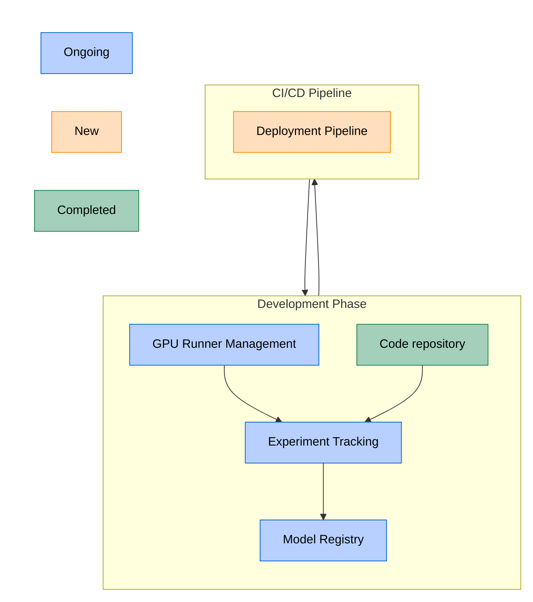

このページには今後予定されている製品・機能・機能性に関する情報が含まれています。ここに示す情報は参考目的のみです。購入・計画の決定にこの情報を使用しないでください。製品・機能・機能性の開発、リリース、タイミングは変更または延期される可能性があり、GitLab Inc. の独自の判断に委ねられています。

<table class="w-full text-sm border-collapse">
<thead>
<tr class="bg-gray-100 text-left">
<th class="px-3 py-2 border border-gray-300">Status</th>
<th class="px-3 py-2 border border-gray-300">Authors</th>
<th class="px-3 py-2 border border-gray-300">Coach</th>
<th class="px-3 py-2 border border-gray-300">DRIs</th>
<th class="px-3 py-2 border border-gray-300">Owning Stage</th>
<th class="px-3 py-2 border border-gray-300">Created</th>
</tr>
</thead>
<tbody>
<tr>
<td class="px-3 py-2 border border-gray-300">proposed</td>
<td class="px-3 py-2 border border-gray-300"><a href="https://gitlab.com/a_akgun" class="text-blue-600 hover:underline">@a_akgun</a>, <a href="https://gitlab.com/fdegier" class="text-blue-600 hover:underline">@fdegier</a></td>
<td class="px-3 py-2 border border-gray-300"><a href="https://gitlab.com/igor.drozdov" class="text-blue-600 hover:underline">@igor.drozdov</a></td>
<td class="px-3 py-2 border border-gray-300"><a href="https://gitlab.com/sean_carroll" class="text-blue-600 hover:underline">@sean_carroll</a></td>
<td class="px-3 py-2 border border-gray-300">~devops::modelops</td>
<td class="px-3 py-2 border border-gray-300">2025-01-30</td>
</tr>
</tbody>
</table>

このブループリントは、GitLab のエンドツーエンド MLOps プラットフォームアーキテクチャを説明しており、実験から本番環境へのデプロイメントまでの完全な機械学習ライフサイクルをサポートするように設計されています。このイニシアチブは、「シングルアプリケーション」哲学を維持しながら、SaaS インスタンスとセルフマネージドインスタンスの両方をサポートします。

## 概要

GitLab MLOps は、GitLab のシングルアプリケーション内でエンドツーエンドの機械学習ライフサイクル管理機能を提供する統合プラットフォームです。実験から本番環境および可観測性までの ML ワークフローをサポートするために、GitLab の既存の CI/CD とレジストリ機能を拡張します。

## 動機

組織は ML を運用化する際にいくつかの主要な課題に直面しています:

1. **再現性**: データサイエンティストは実験を追跡し、結果を再現することに苦労しています
1. **コラボレーション**: データサイエンス、エンジニアリング、およびガバナンスチーム間の断絶が開発を遅らせます
1. **デプロイメント**: モデルを本番環境に移行するための手動でエラーが発生しやすいプロセス
1. **ガバナンス**: モデルの開発、デプロイメント、および影響の監視の維持が困難

これらの課題はしばしば以下をもたらします:

- ML モデルの本番環境への時間の延長
- 開発プラクティスの一貫性の欠如
- セキュリティおよびコンプライアンスリスク
- リソースの非効率性

### 目標

- 既存の GitLab DevOps ワークフローと統合されたエンドツーエンドの ML ライフサイクル管理を提供する
- モデルバージョン、実行、メタデータ、アーティファクトを保存する場所であるモデルレジストリを提供する
- CI/CD パイプラインを使用してモデルレジストリからモデルバージョンをデプロイできるようにする
- Vertex と Huggingface から GitLab モデルレジストリへのモデルインポートを可能にする
- モデル実験とレジストリのための MLflow クライアントとの限定的な互換性

### 対象外

- GPU ランナーを超えたモデルトレーニングのための広範なコンピューティングリソースの提供
- モデルサービングインフラの提供
- フィーチャーストアの実装
- データストアの実装とデータオプスプラットフォームになること
- 100% MLflow API 互換性を達成することによるフル機能の MLflow サーバーの開発
- モデルのモニタリングとトレーシング

## 提案

GitLab は、既存の GitLab インフラの上に構築された包括的な MLOps プラットフォームを提供します。CI/CD 機能とアーティファクトストレージのためのパッケージレジストリを活用・拡張します。このプラットフォームは、GitLab シングルアプリケーション哲学を維持しながら、専用コンポーネントによって ML ライフサイクル全体をサポートします。

## 設計と実装の詳細

### コンポーネントアーキテクチャ

#### 図の注記

- **コードリポジトリ**: リモートまたはローカルの Git リポジトリです。
- **実験追跡**: コードが実行、アーティファクト、メトリクスなどを生成し、メタデータは実験追跡に集中して保存されます。
- **モデルレジストリ**: アーティファクトを保存するためにパッケージレジストリを使用します。
- **デプロイメントパイプライン**: モデルレジストリまたは Git トリガーのいずれかによってトリガーされます。

### コアコンポーネント

#### 1. 実験追跡（既存フィーチャー）

実験管理システムは ML トレーニングの実行とそのパラメーターを追跡します:

- メタデータストレージを備えた[実験追跡](https://docs.gitlab.com/ee/user/project/ml/experiment_tracking/)
- [メトリクスのログと視覚化](https://docs.gitlab.com/ee/user/project/ml/experiment_tracking/#view-logged-metrics)
- [アーティファクトの保存](https://docs.gitlab.com/ee/user/project/ml/model_registry/#add-artifacts-to-a-model-version)
- [MLflow クライアントとの互換性](https://docs.gitlab.com/ee/user/project/ml/experiment_tracking/mlflow_client.html)
- 既存のロール、カスタムロール、モデルレジストリの読み取りおよび書き込み権限に基づくモデル実験のアクセスコントロールとセキュリティポリシー。[モデルレジストリと実験のロールと権限](https://docs.gitlab.com/user/permissions/#machine-learning-model-registry-and-experiment)を参照してください。
- 小さなデータセットには git を使用し、大きなセットには git LFS を使用して、コードリポジトリ内にデータを保存します。

#### 2. モデルレジストリ（既存フィーチャー）

ML モデル管理のための中央リポジトリ: [モデルレジストリドキュメント](https://docs.gitlab.com/ee/user/project/ml/model_registry/)。

- モデルのバージョニングとタグ付け（[ドキュメント](https://docs.gitlab.com/ee/user/project/ml/model_registry/#model-versions-and-semantic-versioning)へのリンク）
- モデルのメタデータと系譜追跡
- モデルとバージョンに GitLab ラベルを使用したモデル承認ワークフロー
- トレーニングとデプロイメントを可能にする CI/CD パイプラインとの統合
- 既存のロール、カスタムロール、モデルレジストリの読み取りおよび書き込み権限に基づくモデルレジストリのアクセスコントロールとセキュリティポリシー。
- MLflow クライアントとの互換性
- 自由形式のマークダウン説明を持つモデルカード
- ガバナンス手段
- ユーザーはモデルバージョンのアーティファクトの隣に大きなデータファイルもモデルレジストリに保存できます。
- GCP Vertex AI [モデルレジストリ](https://gitlab.com/gitlab-org/modelops/mlops/gitlab-mlops/-/tree/main/gitlab_mlops/provider/gcp?ref_type=heads)との統合

#### 3. GPU リソースへの接続（既存フィーチャー）

[GPU ランナードキュメント](https://docs.gitlab.com/ee/ci/runners/hosted_runners/gpu_enabled.html)へのリンク。

- GitLab ランナーとの互換性を維持する
- GPU ランナーの使いやすさを確保する

#### 4. モデルデプロイメント

自動モデルデプロイメントパイプライン:

- コンテナベースのデプロイメント
- 多変量テストのサポート
- カナリアデプロイメント
- ロールバック機能
- 環境管理
- GCP Vertex AI とのデプロイメント統合

#### 5. API クライアント

- [Python 向け GitLab MLOps クライアント](https://gitlab.com/gitlab-org/modelops/mlops/gitlab-mlops)
- [限定的な MLflow クライアントサポート](https://docs.gitlab.com/user/project/ml/experiment_tracking/mlflow_client/#supported-mlflow-client-methods-and-caveats): メトリクス、アーティファクトのロギング。モデル、バージョン、実行の作成。
- 既存の [API](https://docs.gitlab.com/development/documentation/restful_api_styleguide/#curl-examples) を使用したコマンドライン（cURL）サポート

### 統合ポイント

1. **GitLab CI/CD 統合**

    - GitLab（GPU）ランナーを使用した ML ワークフロー向けのトレーニング、評価、バリデーション CI/CD テンプレートを提供する。
    - ML オペレーションのための定義済み変数
    - ML 固有の CI/CD ステージ

2. **Issue トラッキング統合**

    - モデル開発の Issue
    - 承認ワークフロー

3. **GitLab パッケージレジストリ**

   - モデルアーティファクトの保存に使用

### デプロイメントオプション

MLOps は、エアギャップ環境のサポートを含むセルフマネージドインストール、GitLab.com デプロイメント、および GitLab Dedicated をサポートします。

### 開発ガイドライン

GDK 以外の追加の要件はありません。MLflow クライアントと [GitLab MLOps Python クライアント](https://pypi.org/project/gitlab-mlops/)が必要になる場合があります。

## スコープ外

- 完全な MLflow クライアント互換性
- LLMOps
- AgentOps
- モデルガバナンス、セキュリティ、コンプライアンス
- コンテナレジストリ統合

## 結論

このテクニカルブループリントは、GitLab 内に包括的な MLOps プラットフォームを実装するためのフレームワークを提供します。提案されたアーキテクチャは GitLab の既存の強みを活用しながら、組織がスケールで ML ワークフローを効果的に管理できるようにする ML 固有の機能を追加します。
