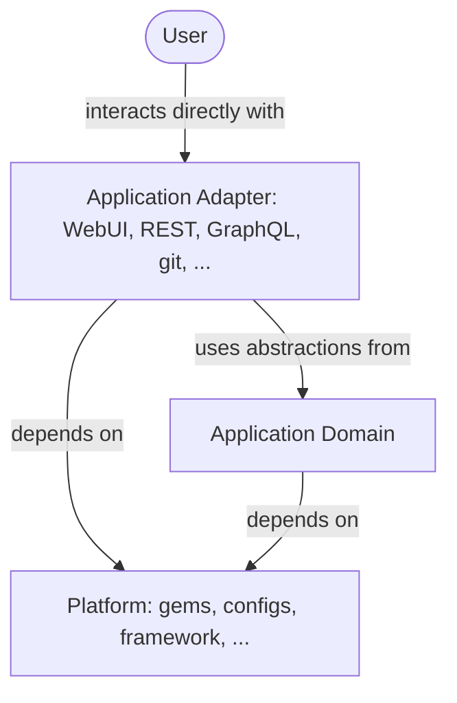

## 背景 {#background}

この設計ドキュメントは、コードベースを技術的なランタイムプロファイルへ分離するという
アイデアを探求した、以前の
[Composable GitLab Codebase](../../composable_codebase_using_rails_engines/)
を引き継ぎます。たとえば、モノリスを Sidekiq ノードとしてのみ実行する、といったものです。
モジュラーモノリスとヘキサゴナルアーキテクチャの利用により、ドメインの分離と
アプリケーションアダプターの分離の両方を達成でき、これには engine やさまざまな
ランタイムプロファイルの利用が含まれる場合があります。

## 概要

**TL;DR:** Rails モノリスを [big ball of mud](https://en.wikipedia.org/wiki/Big_ball_of_mud)
の状態から、[ヘキサゴナルアーキテクチャ](https://en.wikipedia.org/wiki/Hexagonal_architecture_(software))
（またはポートとアダプターのアーキテクチャ）を用いる
[モジュラーモノリス](https://www.thereformedprogrammer.net/my-experience-of-using-modular-monolith-and-ddd-architectures/)
へと変えます。
ドメイン駆動設計のプラクティスを用いて、凝集した機能ドメインを別個のディレクトリ構造へ
切り出します。
インフラストラクチャのコード（ロギング、データベースツール、計装など）を gem へ切り出し、
本質的に `lib/` ディレクトリの必要性をなくします。
機能ドメインのどの部分（たとえばアプリケーションサービス）が統合のために公開利用される
もの（ポート）であり、どの部分が代わりにプライベートにカプセル化された詳細であるかを
定義します。
Web、Sidekiq、REST、GraphQL、そして Action Cable を、アーキテクチャの外側のレイヤーに
おけるアダプターとして定義します。


## 詳細



### アプリケーションドメイン {#application-domain}

アプリケーションコア（機能ドメイン）は、GitLab 製品に固有のビジネスロジック、ポリシー、
データを記述するすべてのコードで構成されます。これは別個のトップレベルの
[境界づけられたコンテキスト](../bounded_contexts.md)に分割され、それぞれが自身のデータを
所有し、小さくよく文書化された公開インターフェースを公開するモジュールとして表現されます。

アプリケーションドメインは、アプリケーションアダプターのような外側のレイヤーについての
知識を持たず、プラットフォームコードのみに依存します。これにより、ドメインコードは
ビジネスロジックの SSoT となり、リクエストが WebUI から来たか REST API から来たかに
かかわらず、再利用可能でテスト可能になります。内側のレイヤーが外側のレイヤーから何かを
必要とする場合、それは制御の反転、とりわけ依存性注入で解決されます。

ドメインの分離 — 排他的なデータ所有、境界の強制、共有モデルの分離、そしてそこへどう
たどり着くか — は、単一の信頼できる情報源である専用のページに完全に文書化されています。
[ドメインレイヤーを分離する](../domain_layer.md)を参照してください。

### トランスポートレイヤー {#transport-layer}

アプリケーションアダプターはトランスポートレイヤーに存在し、外の世界とドメインの公開 API
の間の薄い接着剤です。これらは Web（コントローラーとビュー）、REST、GraphQL、そして
Sidekiq です。
これらはリクエストを解釈し、パラメーターをパースし、アプリケーションドメインから適切な
抽象を呼び出し、必要に応じて結果を提示します — それ自体はビジネスロジックを一切
持ちません。

[トランスポートレイヤーをアダプターに分解する](../transport_layer.md)が、これを詳しく
説明しています。

### プラットフォームコード

プラットフォームコードは 3 番目のレイヤーです。アプリケーションドメインおよび／または
アプリケーションアダプターが動作するために必要なクラスとモジュールで、それ自体は
ビジネスロジックを一切持ちません。これらは、ロギング、エラーレポート、メトリクス、
レートリミッター、パーサー、そして `Banzai` のような汎用ユーティリティといった横断的
関心事です。Rails フレームワークのコードを除いて、プラットフォームコードは、モノリス内の
`gems/` ディレクトリ配下の単一目的の gem へ切り出されます。

詳しくは[横断的なライブラリを gem に切り出す](../library_extraction.md)を参照してください。

### 境界の強制

Ruby には、あるモジュールにおける定数のプライバシーという概念がありません。他の
プログラミング言語とは異なり、よく文書化された gem を切り出してさえも、Ruby ではすべての
定数が public であるため、他の開発者がコードを実装の詳細へ結合することを防げません。

ヘキサゴナルアーキテクチャに完璧に組織化されたコードベースを持っていても、コードベースの
最大の部分であるアプリケーションドメインが、モジュール化されていない
[big ball of mud](https://en.wikipedia.org/wiki/Big_ball_of_mud) であることはあり得ます。

境界の強制は、構造を長期的に維持するためにも不可欠です。大きなモジュール化の取り組みの
あとで、境界を侵犯することによってゆっくりと big ball of mud へ戻ってしまうことは
避けたいのです。

私たちは、モジュール境界を強制するために
[概念実証で Packwerk を使う](../proof_of_concepts.md#use-packwerk-to-enforce-module-boundaries)
というアイデアを探求しました。

[Packwerk](https://github.com/Shopify/packwerk) は静的アナライザーで、コードベースへ
段階的にパッケージを導入し、プライバシーと明示的な依存関係を強制できます。Packwerk は、
ある Ruby コードが別のパッケージのプライベートな実装の詳細を使っていないか、または
依存関係として明示的に宣言されていないパッケージを使っていないかを検出できます。

静的アナライザーであるため、コードの実行には影響しません。つまり、Packwerk の導入は
安全であり、段階的に行えます。

Gusto のような企業は、Packwerk を中心とした Rails モジュラーモノリスへの移行を望む組織の
ために、[開発・エンジニアリングツール](https://github.com/rubyatscale)のリストを開発・
維持してきました。

### EE と JH 拡張

GitLab コードベースをモジュール化することのユニークな課題の 1 つは、EE 拡張（GitLab が
管理）と JH 拡張（JiHu が管理）の存在です。

関連するドメインコード（たとえば `Ci::`）を同じ境界づけられたコンテキストと Packwerk
パッケージの下へ移すことで、`ee/` 拡張もそこへ移す必要が出てきます。

トップレベルの境界づけられたコンテキストを Packwerk パッケージにも一致させるということは、
特定のドメインに関連するすべてのコードを、たとえば EE 拡張を含めて、同じパッケージ
ディレクトリの下に置く必要があることを意味します。

以下は、あり得るディレクトリ構造の一例にすぎません。

```shell
domains
├── ci
│   ├── package.yml       # パッケージ定義。
│   ├── packwerk.yml      # このパッケージ向けのツール設定。
│   ├── package_todo.yml  # 既存の違反。
│   ├── core              # Community Edition で利用でき、常に autoload されるコア機能。
│   │   ├── app
│   │   │   ├── models/...
│   │   │   ├── services/...
│   │   │   └── lib/...   # ドメイン固有の `lib` を他のクラスとともに `app` の中へ移動。
│   │   └── spec
│   │       └── models/...
│   ├── ee                # 境界づけられたコンテキストに固有の EE 拡張。条件付きで autoload される。
│   │   ├── models/...
│   │   └── spec
│   │       └── models/...
│   └── public            # 他のパッケージから参照できるよう、public な定数をここに置く。
│       ├── core
│       │   ├── app
│       │   │   └── models/...
│       │   └── spec
│       │       └── models/...
│       └── ee
│           ├── app
│           │   └── models/...
│           └── spec
│               └── models/...
├── merge_requests/
├── repositories/
└── ...
```

## 課題

- このような変更は、モジュラーアーキテクチャのメリットを理解し、レガシーなプラクティスへ
  逆戻りしないために、開発のマインドセットの転換を必要とします。
- アプリケーションアーキテクチャを変えることは困難なタスクです。時間、リソース、
  コミットメントを要しますが、何より重要なのはエンジニアの賛同を必要とすることです。
- これには、アーキテクチャ進化計画を前進させ、さまざまなエンジニアリングチャンネルでの
  議論を促し、採用上の課題を解決する、中長期的なエンジニアチームまたはワーキンググループが
  必要になるかもしれません。
- サイロではなく標準とガイドラインを構築することを確実にする必要があります。
- 新しいコードをどこに置くべきかについて明確なガイドラインを持つことを確実にする必要が
  あります。`lib/` のようなガラクタ入れの引き出しフォルダーを再び作ってはなりません。

## 機会

モジュラーモノリスアーキテクチャへの移行は、将来探求できる多くの機会を可能にします。

- ドメインエキスパートの概念を、モノリスの特定のモジュールを明示的に所有することと
  整合させられるかもしれません。
- 静的解析ツール（Packwerk、RuboCop など）の利用により、開発と CI で設計上の違反を
  捕捉でき、ベストプラクティスが守られることを確実にできます。
- モジュール間の依存関係を明示的に定義することで、変更の影響を受ける部分だけをテストして
  CI を高速化できるかもしれません。
- このようなモジュラーアーキテクチャは、必要に応じてモジュールをさらに別個のサービスへ
  分解する助けになるかもしれません。
