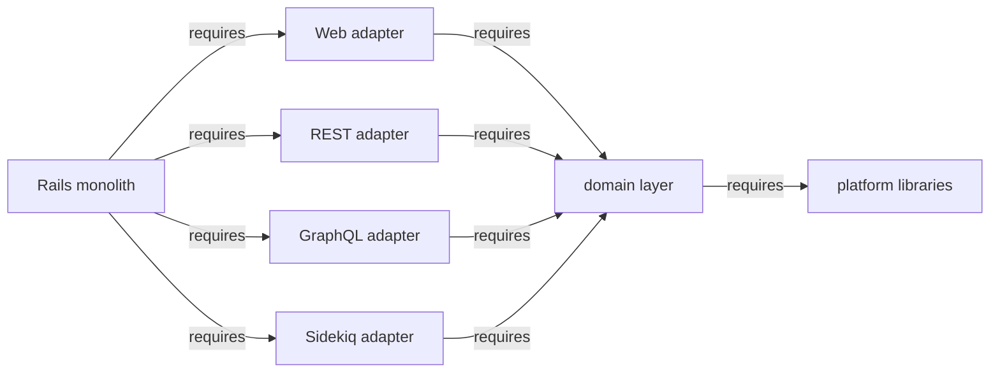

## トランスポートレイヤーとは何か

トランスポートレイヤーは、[ヘキサゴナルモノリス](hexagonal_monolith/index.md) が
[アダプター](hexagonal_monolith/index.md#transport-layer)と呼ぶものです。すなわち、
ポートとアダプターのアーキテクチャの最も外側のレイヤーであり、外の世界をドメインの
公開インターフェースに接続します。用語の一貫性を保つため、このページの残りでは
一貫して **トランスポートレイヤー** という語を使います。

トランスポートレイヤーは次のものから構成されます。

- Web UI（Rails のコントローラー、ビュー、JS と Vue クライアント）
- REST API エンドポイント（Grape）
- GraphQL エンドポイント（型、リゾルバー、ミューテーション）
- Sidekiq（バックグラウンドジョブ）

各部分は、外の世界とのやり取りに責任を持ちます。リクエストを解釈し、パラメーターを
パースし、ドメインレイヤーから適切な抽象を呼び出し、必要に応じて結果を提示します。
プレゼンテーションロジック、そして場合によっては認証は、トランスポートレイヤーに
存在します。

### トランスポートレイヤーは薄い

トランスポートレイヤーはリクエストをパースし、ドメインの公開 API を呼び出し、結果を
提示します。ActiveRecord モデルやビジネスロジックを所有することは **ありません** —
それらはドメインレイヤーに存在します。コントローラーはドメインの公開 API への呼び出しを
オーケストレーションします。

```ruby
# コントローラーはドメインの公開 API への呼び出しをオーケストレーションする。
project = Projects.authorized_find_by_id!(id: params[:id], current_user: @current_user) # Projects ドメイン
response = Ci::CreatePipelineService.new(project, @current_user).execute(:push)          # CI ドメイン

if response.success?
  render_ok(response.payload)
else
  render_bad_request(response.message)
end
```

トランスポートレイヤーは自身のビジネスルールを一切持ちません。トランスポート（HTTP
パラメーター、GraphQL 引数、ジョブ引数）とドメインの公開インターフェースの間を変換し、
その後レスポンスを整形するだけです。単一の利用者しか持たないサービスをどこに置くべきかに
ついての対立する見解は、[オープンな論点](#open-questions)を参照してください。

## 4 つのトランスポートアダプター

トランスポートレイヤーは、トランスポートの種類ごとに 1 つ、**4 つのアダプター** に
分解されます。これを定義づけるルールは、各アダプターが **ドメインレイヤーのみに依存する**
ことです — 別のアダプターには決して依存せず、ドメインがアダプターに依存し返すことも
決してありません。これは機械的なリファクタリングです。ファイルの移動であり、ロジックの
変更ではありません。

| アダプター | 含むもの | 依存先 |
| --- | --- | --- |
| Web | すべての Rails コントローラーとビュー（`app/controllers/`, `app/views/`） | ドメインレイヤー |
| REST | すべての Grape API エンドポイント（`lib/api/`） | ドメインレイヤー |
| GraphQL | すべての GraphQL の型、リゾルバー、ミューテーション（`app/graphql/`） | ドメインレイヤー |
| Sidekiq | キューとランタイムの設定（[Sidekiq は特殊なケース](#sidekiq-is-a-special-case)を参照） | ドメインレイヤー |

各アダプターは必要とするフレームワーク（Action View、Grape、GraphQL、または Sidekiq）
だけをブートし、ビジネスロジックのためにドメインレイヤーを呼び出します。各アダプターを
*どのように* パッケージングするか — gem として、それとも Rails Engine として — は別の、
まだ未解決の意思決定です。[戦術的な選択肢](#tactical-options-gems-or-rails-engines)を
参照してください。

## ランタイムプロファイル {#runtime-profiles}

トランスポートレイヤーを独立したアダプターへ分離することこそが、**ランタイム
プロファイル** を可能にします。アプリケーションは、あるノードが必要とするアダプター
だけをブートできます。

- **API 専用ノード** は REST アダプターとドメインレイヤーを読み込みますが、GraphQL や
  Web（コントローラー／ビュー）のスタックは読み込みません。
- **Sidekiq 専用ノード** は Sidekiq のランタイム設定とドメインレイヤーを読み込みますが、
  Grape、GraphQL、Action View は読み込みません。

これによる見返りは、ノードごとのメモリフットプリントとブート時間の削減、そして web
ワークロードとバックグラウンドワークロードの独立したスケーリングです。

これは、私たちが長年抱えてきたゴールを実現するものです。コードベースを技術的な
ランタイムプロファイルへ分離するという以前の
[Composable GitLab Codebase](../composable_codebase_using_rails_engines/) のアイデア
— [ヘキサゴナルモノリスの背景](hexagonal_monolith/index.md#background)で言及されています
— と、[ADR-001](decisions/001_modular_application_domain/) に記された Sidekiq ノードの
ゴールを引き継ぎます。独立したトランスポートアダプターは、それらのランタイム
プロファイルを可能にする具体的な仕組みです。

## Sidekiq は特殊なケース {#sidekiq-is-a-special-case}

Sidekiq は REST や GraphQL のトランスポートよりも慎重な扱いを必要とします。素朴な
移動 — `app/workers/` のすべてを Sidekiq アダプターへ移すこと — はうまくいきません。
worker がスケジュールされる仕組みのためです。

worker は **ドメインレイヤーの内部から** スケジュールされます。ドメインのサービス
オブジェクトが `SomeWorker.perform_async` を呼びます。worker は実行されると、ドメインの
サービスオブジェクトを呼び戻します。したがって、すべての worker コードを Sidekiq
アダプターへ切り出すと、**循環依存** が生じます。

```text
domain service --schedules--> worker (Sidekiq adapter) --executes--> domain service
```

worker の本体 *は* ドメインロジックであり、そのドメインに属します。Sidekiq の
*ランタイムプロファイル* が実際に切り出す必要があるのは、**キュー設定とランタイム設定**
（たとえば cron スケジュール）であって、worker のビジネスロジックではありません。

循環依存を断ち切る補完的な方法が 2 つあります。どちらも適用されます。

1. **`Gitlab::EventStore`。** ドメインが具体的な worker を直接スケジュールする代わりに、
   ドメインは **イベント** を発行します。モノリス／イベントストアが、購読側のドメインで
   具体的な Sidekiq worker をスケジュールします。購読の登録は Rails のイニシャライザーへ
   移ります。これは依存をクリーンに反転させます。発行側のドメインは、購読側のドメインの
   worker をもはや一切参照しません。

2. **生成された Sidekiq クライアント。** 小さな生成済みのコンポーネント（たとえば
   `gitlab-sidekiq-client` gem）が、最小限のスタブとメタデータ — worker のクラス名、
   引数のシグネチャ、キュー名 — を、実行可能な worker コードや worker 定数への参照
   **なしに** 公開できます。ドメインは、完全な Sidekiq ランタイムや別のドメインに存在する
   worker の実装に依存することなく、クライアントに依存することでジョブをスケジュール
   できます。

どちらのアプローチでも、worker のビジネスロジックはそのドメインに残ります。トランスポート
レイヤーへ切り出されるのは、スケジューリングの面（イベント、またはスタブのメタデータ）と、
キュー／ランタイムの設定だけです。

## 依存の方向 {#dependency-direction}

アダプターはドメインレイヤーに依存し、その逆は決してなく、互いに依存することも決して
ありません。目標とする依存グラフは厳密に一方向です。



[ランタイムプロファイル](#runtime-profiles)にとっての鍵となる不変条件は、**どの
アダプターも別のアダプターに依存しない** ことです。各アダプターはドメインレイヤー
（それ自体はプラットフォームライブラリに依存します）のみに依存し、兄弟のアダプターには
決して依存しません。それが保たれている限り、ノードは不要なトランスポートを引きずり
込むことなく、アダプターの任意の部分集合（API 専用、Sidekiq 専用）をブートできます。
この不変条件を確立すること — アダプター間の依存関係をゼロまで減らすこと — が本当の
作業であり、それはアダプターが最終的にどうパッケージングされるかとはおおむね独立しています。

## 戦術的な選択肢: gem か Rails Engine か {#tactical-options-gems-or-rails-engines}

上記の 4 つのアダプターと一方向の依存ルールがアーキテクチャです。各アダプターを
*どのように* パッケージングするかは別の、戦術的な意思決定であり、**確定していません**。
実行可能な選択肢が 2 つあります。どちらもアダプターの境界を保ち、どちらもランタイム
プロファイルを可能にします。

### 選択肢 A — アダプターを gem に切り出す

各アダプターは `adapters/` 配下の gem になり、Gemfile では `path:` 経由で参照されます。

- **長所:** 最も強い分離。gem は自身の依存関係を明示的に宣言し、独立した CI スイートを
  実行し、依存していないコードに手を伸ばすことができません。
- **短所:** ドメインレイヤー自体が gem になる *前に* アダプター gem を切り出すと、
  サイクルが生じます — モノリスは REST アダプターを require し、それはまだモノリスに
  存在するドメインコードを require し、それがアダプターを require します。Bundler は
  循環依存を禁じるので、それは読み込まれません。依存性注入でサイクルを断ち切れますが、
  トランスポートレイヤーはドメインの非常に多くの部分に触れるので、注入すべき依存関係の
  数は膨大です。実際には、この選択肢は、グラフをほどくために、ドメインレイヤーを先に
  切り出すか、最も依存の少ないコンポーネント（認証／認可、設定、
  [ライブラリ](library_extraction.md)）を先に取り出すことを求めます。

### 選択肢 B — アダプターを Rails Engine として分離する

各アダプターは `engines/` 配下の Rails Engine になり、gem として公開されるのではなく、
**モノリスの内部に留まります**。

- **長所:** Engine は同じコードベースに存在するので、解決すべき **Bundler の依存
  サイクルがありません** — 選択肢 A の難しい部分が消えます。各 engine は依然として
  トランスポートごとに分離され、自身のルートとミドルウェアをマウントし、**選択的に
  有効化** できます。これはまさにランタイムプロファイルが必要とするものです。
- **短所:** 分離は、ハードな gem の依存宣言ではなく、Rails の engine 境界と規約によって
  強制されるので、結合が再び入り込みやすくなります。gem のように各アダプターへ完全に
  独立した依存グラフを与えるものではありません。

## ドメインスコープのレイヤーへの進化

上記の 4 つのアダプターは **水平的** です。トランスポートの種類ごとに 1 つで、すべての
ドメインにまたがります。いったんドメインが分離されれば（来たるべきドメインレイヤー）、
各水平アダプターは **ドメインごとに** 分割できます。

```text
ci-api            # CI の REST エンドポイントのみ
ci-graphql        # CI の GraphQL リゾルバーのみ
packages-api      # Packages の REST エンドポイントのみ
packages-graphql  # Packages の GraphQL リゾルバーのみ
...
```

そのとき水平アダプターは、ドメインごとのものを **集約** します。REST アダプターは
`ci-api`、`packages-api` などを含みます — その逆ではありません。各ドメインごとの
アダプターは、ビジネスロジックのためにドメインレイヤー内の自身のドメインに依存します。

## オープンな論点 {#open-questions}

- **アダプターを gem か Rails Engine のどちらでパッケージングするか？** 中心的な未解決の
  戦術的選択です（[戦術的な選択肢](#tactical-options-gems-or-rails-engines)を参照）。
  gem は最もハードな分離を与えますが、ドメインレイヤーより前に切り出すと Bundler の
  依存サイクルにぶつかります。Rails Engine はモノリスに留まり、各トランスポートを
  分離して選択的有効化をサポートしつつ、そのサイクルを避けます。
  [提案 MR での議論](https://gitlab.com/gitlab-com/content-sites/handbook/-/merge_requests/18906#note_3449483874)
  を参照してください。
- **単一の利用者しか持たないサービスはどこに存在するか？** このドキュメントの立場は、
  トランスポートレイヤーは薄いままであり、ビジネスロジックはドメインレイヤーに属する、
  というものです。対立する見解は、*1 つの* アダプターによってのみ使われ — 他に利用者の
  ない — サービスは、そのアダプターの内部に存在しても妥当だ、と主張します。ここでは
  その緊張を、解決するのではなく、書き留めておきます。
- **トランスポートの相互依存をマッピングしてほどくために、まず Packwerk を使うか？**
  いかなるハードな切り出しよりも前に、[Packwerk](https://github.com/Shopify/packwerk) を
  使ってトランスポートコンポーネント間の相互依存を特定し、その場でそれらを減らしていく
  ことができるでしょうか。コードがまだモノリスに存在するうちにそれらの依存関係を段階的に
  取り除くことで、いずれかのパッケージング選択肢に踏み切る前に、
  [どのアダプターもアダプターに依存しないという不変条件](#dependency-direction)を確立
  できるでしょう。

## 関連

- [ヘキサゴナル Rails モノリス](hexagonal_monolith/index.md) — これが収まる 3 レイヤー
  モデル（ドメイン、トランスポート、プラットフォーム）。
- [横断的なライブラリを gem に切り出す](library_extraction.md) — プラットフォーム
  レイヤーにおける対をなす取り組み。
- [境界づけられたコンテキストを定義する](bounded_contexts.md) — トランスポートアダプターが
  依存するドメインレイヤーがどう構造化されるか。
