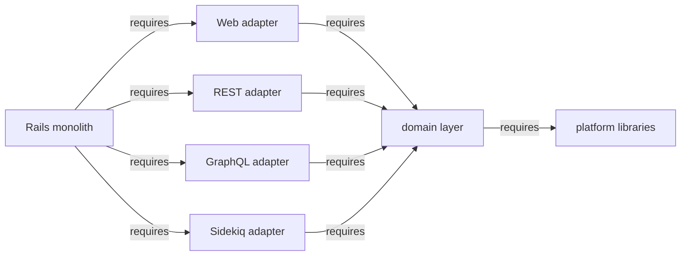

## トランスポート層とは何か？ {#what-is-the-transport-layer}

トランスポート層は、[六角形モノリス](hexagonal_monolith/index.md)が[アダプター](hexagonal_monolith/index.md#transport-layer)と呼ぶものです。つまり、外部世界をドメインのパブリックインターフェイスへ接続する、ポートとアダプターのアーキテクチャの外側の層です。用語の一貫性を保つため、このページの残りでは一貫して **トランスポート層** を使います。

トランスポート層は次で構成されます:

- Web UI（Rails コントローラー、ビュー、JS、Vue クライアント）
- REST API エンドポイント（Grape）
- GraphQL エンドポイント（types、resolvers、mutations）
- Sidekiq（バックグラウンドジョブ）

各部分は外部世界とのインタラクションを担当します。リクエストを解釈し、パラメーターを解析し、ドメイン層から適切な抽象化を呼び出し、任意で結果を返します。
プレゼンテーションロジック、そして場合によっては認証も、トランスポート層に存在します。

### トランスポート層は薄い {#the-transport-layer-is-thin}

トランスポート層はリクエストを解析し、ドメインのパブリック API を呼び出し、結果を返します。ActiveRecord モデルやビジネスロジックは **所有しません**。それらはドメイン層に存在します。コントローラーはドメインのパブリック API への呼び出しを調整します:

```ruby
# A controller orchestrates calls to domain public APIs.
project = Projects.authorized_find_by_id!(id: params[:id], current_user: @current_user) # Projects domain
response = Ci::CreatePipelineService.new(project, @current_user).execute(:push)          # CI domain

if response.success?
  render_ok(response.payload)
else
  render_bad_request(response.message)
end
```

トランスポート層は自身のビジネスルールを持ちません。トランスポート（HTTP パラメーター、GraphQL 引数、ジョブ引数）とドメインのパブリックインターフェイスの間を変換し、その後レスポンスを整形するだけです。単一コンシューマーのサービスがどこに存在すべきかについての反対意見は、[未解決事項](#open-questions)を参照してください。

## 4 つのトランスポートアダプター {#four-transport-adapters}

トランスポート層は、トランスポート種別ごとに 1 つ、**4 つのアダプター** へ分解されます。定義上のルールは、各アダプターが **ドメイン層にのみ依存する** ことです。他のアダプターには決して依存せず、ドメインがそれに依存し返すこともありません。これは機械的なリファクタリングです。ファイル移動であり、ロジック変更ではありません。

| アダプター | 含むもの | 依存先 |
| --- | --- | --- |
| Web | すべての Rails コントローラーとビュー（`app/controllers/`, `app/views/`） | ドメイン層 |
| REST | すべての Grape API エンドポイント（`lib/api/`） | ドメイン層 |
| GraphQL | すべての GraphQL types、resolvers、mutations（`app/graphql/`） | ドメイン層 |
| Sidekiq | キューとランタイム設定（[Sidekiq は特別なケース](#sidekiq-is-a-special-case)を参照） | ドメイン層 |

各アダプターは必要なフレームワーク（Action View、Grape、GraphQL、または Sidekiq）だけを起動し、ビジネスロジックについてはドメイン層を呼び出します。各アダプターを _どのように_ パッケージ化するか、gem としてか Rails Engine としてかは、別の未解決の決定事項です。[戦術的な選択肢](#tactical-options-gems-or-rails-engines)を参照してください。

## ランタイムプロファイル {#runtime-profiles}

トランスポート層を独立したアダプターへ分離することで、**ランタイムプロファイル** が可能になります。アプリケーションは、特定のノードに必要なアダプターだけを起動できます。

- **API 専用ノード** は REST アダプターとドメイン層をロードしますが、GraphQL や Web（コントローラー / ビュー）スタックはロードしません。
- **Sidekiq 専用ノード** は Sidekiq ランタイム設定とドメイン層をロードしますが、Grape、GraphQL、Action View はロードしません。

見返りは、ノードごとのメモリフットプリントと起動時間の削減、そして Web ワークロードとバックグラウンドワークロードの独立したスケーリングです。

これは、私たちが長い間持ち続けてきた目標を実現します。これは、[六角形モノリスの背景](hexagonal_monolith/index.md#background)で参照されている、コードベースを技術的なランタイムプロファイルへ分離する以前の [Composable GitLab Codebase](../composable_codebase_using_rails_engines/) のアイデアと、[ADR-001](decisions/001_modular_application_domain/) で言及された Sidekiq node の目標を置き換えるものです。独立したトランスポートアダプターは、それらのランタイムプロファイルを可能にする具体的な仕組みです。

## Sidekiq は特別なケース {#sidekiq-is-a-special-case}

Sidekiq は REST や GraphQL のトランスポートよりも慎重に扱う必要があります。単純な移動、つまり `app/workers/` 全体を Sidekiq アダプターへ移すことは、worker のスケジュール方法のため機能しません。

Worker は **ドメイン層の内側から** スケジュールされます。ドメインサービスオブジェクトが `SomeWorker.perform_async` を呼び出します。worker は実行時に、ドメインサービスオブジェクトを呼び返します。そのため、すべての worker コードを Sidekiq アダプターへ抽出すると、**循環依存** が作られます:

```text
domain service --schedules--> worker (Sidekiq adapter) --executes--> domain service
```

worker の本体はドメインロジックであり、そのドメインに属します。Sidekiq **ランタイムプロファイル** が実際に抽出を必要とするのは、worker のビジネスロジックではなく、**キュー設定とランタイム設定**（例えば cron schedules）です。

循環依存を断つ補完的な方法が 2 つあります。両方を適用します:

1. **`Gitlab::EventStore`。** ドメインが具体的な worker を直接スケジュールする代わりに、ドメインは **イベント** を公開します。モノリス / event store が、購読側ドメインにある具体的な Sidekiq worker をスケジュールします。サブスクリプション登録は Rails initializer へ移動します。これにより依存関係はきれいに反転します。公開元ドメインは購読側ドメインの worker をまったく参照しなくなります。

2. **生成された Sidekiq クライアント。** 小さな生成コンポーネント（例えば `gitlab-sidekiq-client` gem）は、実行可能な worker コードや worker 定数への参照 **なしで**、最小限のスタブとメタデータ、つまり worker クラス名、引数シグネチャ、キュー名を公開できます。ドメインはクライアントに依存してジョブをスケジュールでき、完全な Sidekiq ランタイムや別ドメインに存在する worker 実装には依存しません。

どちらのアプローチでも、worker のビジネスロジックはそのドメインに残ります。抽出されるのはスケジューリング面（イベント、またはスタブメタデータ）とキュー / ランタイム設定だけです。

## 依存関係の方向 {#dependency-direction}

アダプターはドメイン層に依存し、その逆はありません。また、アダプター同士も依存しません。目標とする依存関係グラフは、厳密に一方向です:



[ランタイムプロファイル](#runtime-profiles)の重要な不変条件は、**どのアダプターも別のアダプターに依存しない** ことです。各アダプターはドメイン層（そしてドメイン層はプラットフォームライブラリ）にのみ依存します。兄弟アダプターには決して依存しません。これが成り立つ限り、ノードは不要なトランスポートを引きずり込まずに、任意のアダプターのサブセット（API 専用、Sidekiq 専用）を起動できます。この不変条件を確立すること、つまりアダプター間依存をゼロまで下げることが実際の作業であり、アダプターが最終的にどのようにパッケージ化されるかとは大きく独立しています。

## 戦術的な選択肢: gems か Rails Engines か {#tactical-options-gems-or-rails-engines}

上記の 4 つのアダプターと一方向依存ルールがアーキテクチャです。各アダプターを _どのように_ パッケージ化するかは別の戦術的決定であり、**まだ決まっていません**。実行可能な選択肢は 2 つあります。どちらもアダプター境界を保持し、ランタイムプロファイルを可能にします。

### 選択肢 A — アダプターを gem へ抽出する {#option-a--extract-adapters-into-gems}

各アダプターは `adapters/` 配下の gem になり、Gemfile から `path:` で参照されます。

- **メリット:** 最も強い分離です。gem は依存関係を明示的に宣言し、独自の CI スイートを実行し、依存していないコードへ手を伸ばせません。
- **デメリット:** ドメイン層自体が gem になる前にアダプター gem を抽出すると、循環が作られます。モノリスが REST アダプターを読み込み、REST アダプターはまだモノリス内にあるドメインコードを読み込み、そのドメインコードがアダプターを読み込みます。Bundler は循環依存を禁止するため、これはロードできません。依存性注入は循環を断てますが、トランスポート層はドメインの非常に広い範囲に触れるため、注入すべき依存関係の数は多くなります。実際には、この選択肢はドメイン層を先に抽出するか、最も依存の少ないコンポーネント（認証 / 認可、設定、[ライブラリ](library_extraction.md)）を先に取り出してグラフをほどくことを求めます。

### 選択肢 B — アダプターを Rails Engines として分離する {#option-b--isolate-adapters-as-rails-engines}

各アダプターは `engines/` 配下の Rails Engine になり、gem として公開されるのではなく **モノリス内に留まります**。

- **メリット:** Engine は同じコードベース内に存在するため、解決すべき **Bundler 依存サイクルがありません**。選択肢 A の難しい部分が消えます。各 engine は依然としてトランスポートごとに分離され、独自のルートとミドルウェアをマウントし、**選択的に有効化** できます。これはまさにランタイムプロファイルが必要とするものです。
- **デメリット:** 分離は厳密な gem 依存宣言ではなく、Rails の engine 境界と慣習によって強制されます。そのため結合は再導入しやすく、gem のように各アダプターに完全に独立した依存関係グラフを与えるものではありません。

## ドメインスコープのレイヤーへの進化 {#evolution-to-domain-scoped-layers}

上記の 4 つのアダプターは **水平** です。トランスポート種別ごとに 1 つで、すべてのドメインをまたぎます。ドメインが分離されると（今後のドメイン層）、各水平アダプターは **ドメインごと** に分割できます:

```text
ci-api            # CI REST endpoints only
ci-graphql        # CI GraphQL resolvers only
packages-api      # Packages REST endpoints only
packages-graphql  # Packages GraphQL resolvers only
...
```

その後、水平アダプターはドメインごとのものを **集約** します。REST アダプターは `ci-api`、`packages-api` などを include します。その逆ではありません。各ドメイン別アダプターは、ビジネスロジックのためにドメイン層内の自身のドメインに依存します。

## 未解決事項 {#open-questions}

- **アダプターを gem としてパッケージ化するか Rails Engines としてパッケージ化するか？** 中心的な未解決の戦術的選択です（[戦術的な選択肢](#tactical-options-gems-or-rails-engines)を参照）。gem は最も強い分離を提供しますが、ドメイン層の前に抽出すると Bundler 依存サイクルにぶつかります。Rails Engines はモノリス内に留まり、そのサイクルを避けつつ、各トランスポートを分離し、選択的な有効化をサポートします。[提案 MR での議論](https://gitlab.com/gitlab-com/content-sites/handbook/-/merge_requests/18906#note_3449483874)を参照してください。
- **単一コンシューマーのサービスはどこに置くか？** このドキュメントの立場は、トランスポート層は薄く保ち、ビジネスロジックはドメイン層に属するというものです。反対意見として、1 つのアダプターだけが使い、他のコンシューマーがないサービスは、そのアダプターの中に存在しても合理的だという見方があります。ここでは解決せず、この緊張関係を記録します。
- **Packwerk を先に使ってトランスポートの相互依存をマッピングしてほどくか？** 本格的な抽出の前に、[Packwerk](https://github.com/Shopify/packwerk) を使ってトランスポートコンポーネント間の相互依存を特定し、その場で減らしていけるでしょうか。コードがまだモノリス内にある間にそれらの依存関係を段階的に取り除くことで、どちらのパッケージ化オプションにコミットする前にも、[アダプターがアダプターに依存しない不変条件](#dependency-direction)を確立できます。

## 関連 {#related}

- [六角形 Rails モノリス](hexagonal_monolith/index.md) — これが組み込まれる 3 層モデル（ドメイン、トランスポート、プラットフォーム）。
- [横断的ライブラリを gem に抽出する](library_extraction.md) — プラットフォーム層の並行した取り組み。
- [バウンデッドコンテキストを定義する](bounded_contexts.md) — トランスポートアダプターが依存するドメイン層がどのように構造化されるか。
