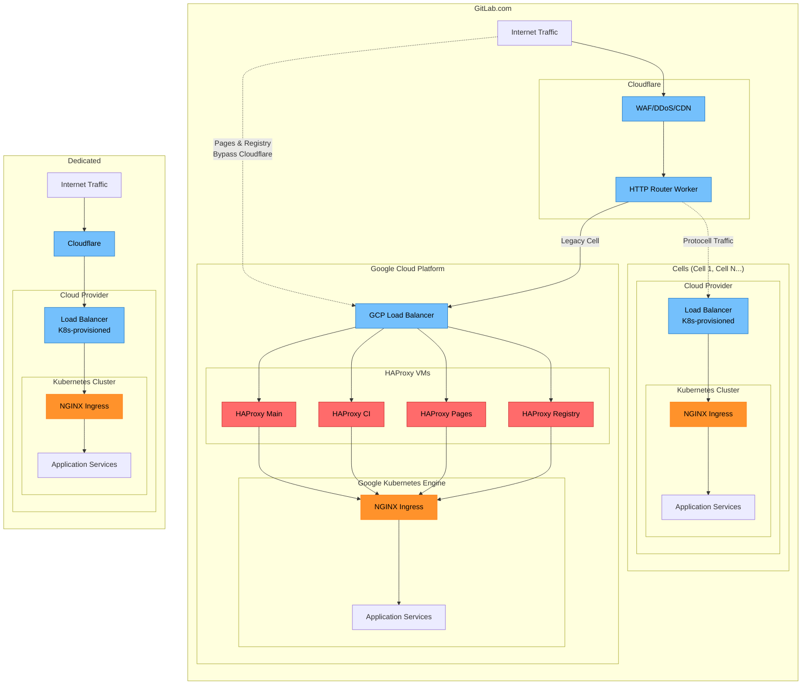
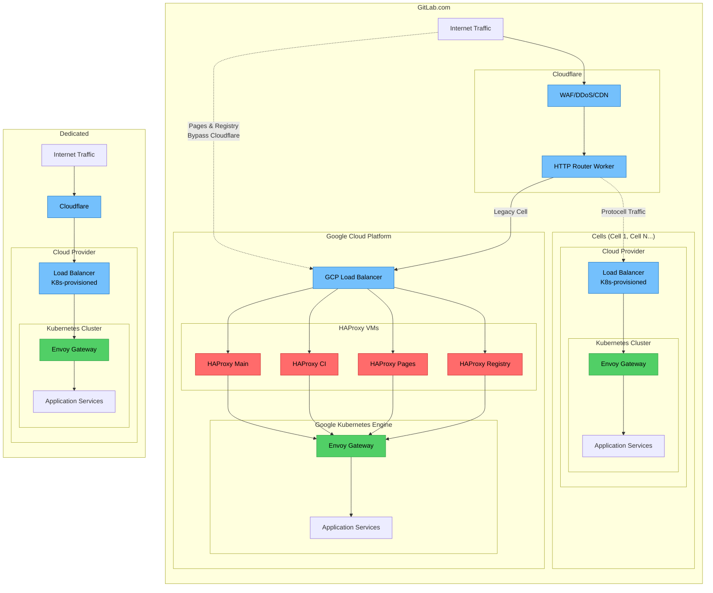
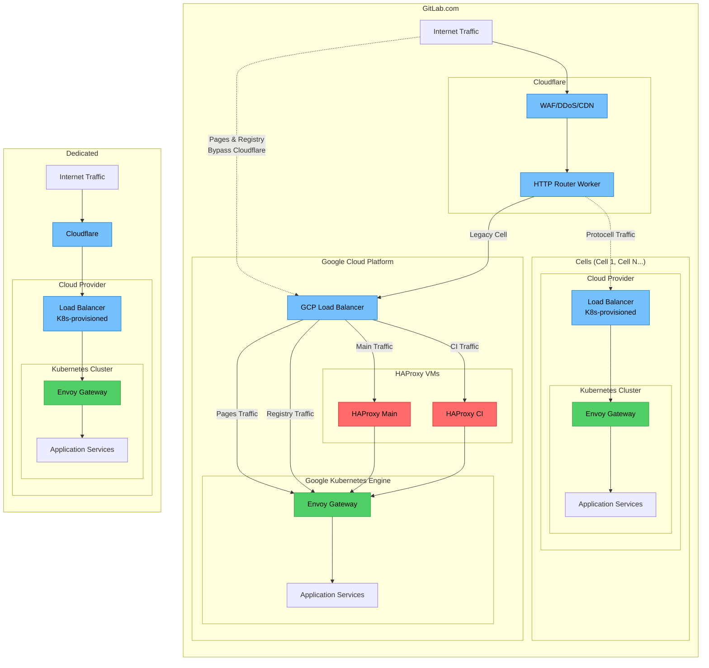
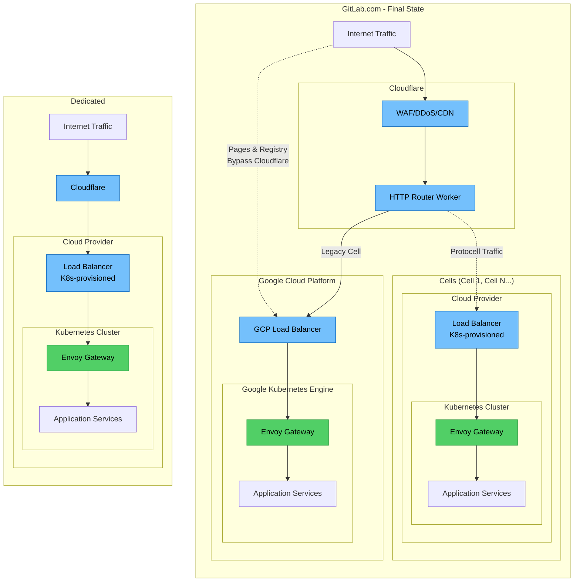

<!-- This renders the design document header on the detail page, so don't remove it-->

このページには今後予定されている製品・機能・機能性に関する情報が含まれています。ここに示す情報は参考目的のみです。購入・計画の決定にこの情報を使用しないでください。製品・機能・機能性の開発、リリース、タイミングは変更または延期される可能性があり、GitLab Inc. の独自の判断に委ねられています。

<table class="w-full text-sm border-collapse">
<thead>
<tr class="bg-gray-100 text-left">
<th class="px-3 py-2 border border-gray-300">Status</th>
<th class="px-3 py-2 border border-gray-300">Authors</th>
<th class="px-3 py-2 border border-gray-300">Coach</th>
<th class="px-3 py-2 border border-gray-300">DRIs</th>
<th class="px-3 py-2 border border-gray-300">Owning Stage</th>
<th class="px-3 py-2 border border-gray-300">Created</th>
</tr>
</thead>
<tbody>
<tr>
<td class="px-3 py-2 border border-gray-300">ongoing</td>
<td class="px-3 py-2 border border-gray-300"><a href="https://gitlab.com/donnaalexandra" class="text-blue-600 hover:underline">@donnaalexandra</a></td>
<td class="px-3 py-2 border border-gray-300"><a href="https://gitlab.com/andrewn" class="text-blue-600 hover:underline">@andrewn</a></td>
<td class="px-3 py-2 border border-gray-300"><a href="https://gitlab.com/andrewn" class="text-blue-600 hover:underline">@andrewn</a>, <a href="https://gitlab.com/swiskow" class="text-blue-600 hover:underline">@swiskow</a></td>
<td class="px-3 py-2 border border-gray-300">~devops::platforms</td>
<td class="px-3 py-2 border border-gray-300">2025-12-09</td>
</tr>
</tbody>
</table>

## サマリー

Dedicated、Cells、[クラウドネイティブのセルフマネージドインストール](../selfmanaged_segmentation/) に向けたアーキテクチャの方向性に沿った、GitLab.com の標準化されたゲートウェイ層を確立します。

このイニシアチブは、2026年3月の [NGINX Ingress 廃止](#nginx-retirement) に対応するソリューションとして `Delivery::Operate` が提案した [パッケージ化された Envoy Gateway ソリューション](https://gitlab.com/gitlab-org/charts/gitlab/-/blob/master/doc/architecture/decisions.md?ref_type=heads#bundling-envoy-gateway) の本番規模のドッグフーディングを提供し、すべての GitLab デプロイメントモデルにわたるプラットフォームの標準化を実現します。

バンドルされたゲートウェイソリューションを使用することの影響について詳しくは、[Gateway API とセルフマネージドに関する考慮事項](#gateway-api-and-self-managed-considerations) を参照してください。

> [!important] 主要な価値
>
> すべてのプラットフォームに統一されたゲートウェイ層を確立することで、アーキテクチャの乖離と運用の複雑さを軽減します。

## ビジネス目標

1. **アーキテクチャの整合**: GitLab.com、Dedicated、Cells、クラウドネイティブのセルフマネージドで単一のゲートウェイパターンに収束し、メンテナンスの負担と知識のサイロを削減して、複数プラットフォームにわたるイノベーションを促進します。
1. **本番環境での検証**: GitLab.com 規模で `Delivery::Operate` チームのゲートウェイソリューションをドッグフードし、お客様がこのソリューションを採用する前に、pre-production、ステージング、本番環境での問題を特定します。
1. **Cells への準備**: GitLab.com、Dedicated、Cells にわたって統一されたルーティングインフラを確立し、Cells への移行中のプラットフォームの乖離を削減します。
1. **オペレーショナルエクセレンス**: すべてのデプロイメントタイプにわたって一貫したゲートウェイ動作を持つことで、インシデント対応とメンテナンスの複雑さを軽減し、より迅速なトラブルシューティングとインシデント対応のための優れた可観測性（メトリクス、ロギング、トレーシング）を提供します。

## 動機

### 機能の高速デリバリーとプラットフォームの標準化

標準化されたゲートウェイは、GitLab.com、Dedicated、Cells、セルフマネージドを支える単一の ingress 設定をサポートすることで、プラットフォームオファリングを簡素化します。これにより組織全体での重複作業が削減され、すべてのデプロイメントモデルにわたって一貫したインフラパターンが実現します。これはクロスプラットフォームのイノベーションのための集中化されたメカニズムを提供します。

HAProxy の複雑な設定モデルを Envoy Gateway の宣言的な Kubernetes ネイティブアプローチに置き換えることで、インフラ以外のチームがルーティングの変更や新機能を事前定義されたインターフェイスを使用して貢献するための障壁も低くなります。これにより、ゲートウェイレベルの変更を実装するために必要な運用の複雑さと専門知識が削減され、お客様への機能デリバリーが高速化されます。

### 運用コストと複雑さの削減

ingress の単一ゲートウェイパターンに統合することで、HAProxy、NGINX、複数のロードバランサーの専門知識が不要になります。これにより運用コスト（分析については [内部 Issue](https://gitlab.com/gitlab-com/gl-infra/production-engineering/-/issues/28064) を参照）とこれらのシステムの管理に関連する複雑さが削減され、統一されたランブックと可観測性を通じてサポートされるプラットフォーム全体でより迅速なインシデント対応が可能になります。

### 信頼性とカスタマーエクスペリエンスの向上

[クラウドネイティブ GitLab Helm チャート](https://gitlab.com/gitlab-org/charts/gitlab) によって提供されるゲートウェイソリューションのドッグフーディングにより、スケールでのゲートウェイの回復性を検証し、セルフマネージドのお客様に信頼性が高く、パフォーマンスが良く、安全な ingress 層を提供できます。

## オーナーシップ

執筆時点で、すべてのプラットフォームに Envoy Gateway をデプロイすることに関心を持つ GitLab のグループが 3 つあります:

- **Production Engineering / Dedicated** - 本番環境のネットワーキングを担当し、GitLab.com、Dedicated テナント、Cells アーキテクチャにわたる GitLab のネットワークアーキテクチャの簡素化に関心があります。
- **Auth グループ** - 認証コンポーネントを担当します。Envoy Proxy は NewAuth スタック（GATE）の必須コンポーネントであり、このゲートウェイイニシアチブとは別にデプロイされます。
- **Operate** - GitLab Helm チャートを担当します。すぐに使える保守された本番対応のゲートウェイソリューションをお客様に提供することに関心があります。

## 用語集

- **Ingress** - ネットワークに入ってくるトラフィック。
- **Ingress リソース** - 大文字の I で始まる Kubernetes Ingress リソース。HTTP および HTTPS ルートがどのように公開されるかを定義します。汎用の TCP や SSH は定義しません。
- **Ingress Controller** - Ingress リソースを読み取り、リバースプロキシとロードバランサーを通じてインターネットに公開するコントローラーの実装。
- **Ingress NGINX** - Ingress Controller の特定の実装。これはオープンソースの NGINX プロジェクトを使用する Kubernetes SIG プロジェクトであり、2026年3月に [廃止予定](https://kubernetes.io/blog/2025/11/11/ingress-nginx-retirement/) です。
- **Gateway API**（ブループリント）- 高度なトラフィックルーティングがどのように機能すべきかを定義し、ロール指向の設計原則を強制するオープンソースの [Kubernetes 標準](https://kubernetes.io/docs/concepts/services-networking/gateway/)。
- **Envoy Gateway**（コントロールプレーン）- Gateway API 標準と Envoy 固有の補完的な拡張機能の実装。Kubernetes リソースを使用して Envoy Proxy の設定を宣言的に管理します。ルーティングルールを Envoy Proxy が実行する命令に変換する「マネージャー」と考えてください。
- **Envoy Proxy**（データプレーン）- リクエストを傍受し、ポリシー（認証など）を適用し、バックエンドサービスにトラフィックをプロキシする実際のプロキシ。

## 現状

**プラットフォーム全体のゲートウェイアーキテクチャ:**

- **GitLab.com**: トラフィックは Cloudflare（WAF/DDoS/CDN）と HTTP Router Worker を経由して GCP ロードバランサーに流れ、HAProxy VM（メイン、CI、Pages、レジストリ）を通って、GKE（Google Kubernetes Engine）の一部（すべてではない）の重要コンポーネントの NGINX Ingress に到達します。
- **Cells**: トラフィックは Cloudflare HTTP Router Worker からクラウドがプロビジョニングしたロードバランサーを経由して Kubernetes クラスター内の NGINX Ingress に流れます。
- **Dedicated**: トラフィックは Cloudflare からクラウドがプロビジョニングしたロードバランサーを経由して Kubernetes クラスター内の NGINX Ingress に流れます。
- **セルフマネージド**: GitLab Helm チャートは現在、お客様が管理する Kubernetes クラスターで 3 つのプロキシオファリング（NGINX Ingress、Traefik、HAProxy）をサポートしていますが、お客様は**常に**独自のプロキシ設定を持ち込むことができます。

**主な課題:**

- 複数の ingress テクノロジーが異なる専門知識と運用手順を必要とします。
- プラットフォームごとに独立したランブック、監視ダッシュボード、インシデント対応プロセスが存在します。
- プロキシレベルの機能はプラットフォームごとに個別に実装・保守する必要があり、機能リリースの遅延と市場投入までの時間を遅らせる可能性があります。
- アーキテクチャの乖離が知識のサイロを生み出し、クロスプラットフォームの協力を制限します。

## 実装フェーズ

### フェーズ 1: GitLab.com 非本番環境での検証（推定 1 クォーター）

- **目的**: GitLab.com の非本番環境に Envoy Gateway をデプロイして検証し、本番環境の準備ができており NGINX Ingress の代替要件を満たしていることを確認します。
- **主な活動**:
  - pre-production およびステージング環境にパッケージ化された Envoy Gateway をデプロイします。
  - Delivery::Operate チームの Envoy Gateway オファリングをスケールでテストします。
  - 新しいゲートウェイの可観測性（メトリクス、ロギング、トレーシング）を開発・実装します。
  - パフォーマンスと信頼性のテストを実施します。
  - 既存の GitLab.com トラフィックパターンとワークロードとの互換性を検証します。
  - フィードバックを収集し、設定と運用手順を改善します。
- **成功基準**:
  - Envoy Gateway が非本番環境で正常に検証されます。
  - 包括的な可観測性と監視が整備されます。
  - パフォーマンスと信頼性が現在の NGINX Ingress のベースラインを満たすか上回ります。
  - 運用ランブックとドキュメントが作成されます。
  - 優雅な劣化の検証 - Envoy Gateway が障害のあるバックエンドにトラフィックを送信しないことを確認します。

### フェーズ 2: GitLab.com 本番環境へのロールアウト（推定 1 クォーター）

- **目的**: GitLab.com 本番環境に Envoy Gateway をロールアウトし、[2026年3月に廃止される](#nginx-retirement) NGINX Ingress を完全に置き換えます。
- **主な活動**:
  - トラフィックセグメントを段階的に Envoy Gateway に移行します。
  - GitLab.com の NGINX Ingress インスタンスを廃止します。
  - ゲートウェイの運用手順とインシデント対応を改善します。
  - 本番環境のパフォーマンスと安定性を検証します。
- **成功基準**:
  - NGINX Ingress が GitLab.com 本番環境から完全に廃止されます。
  - すべてのトラフィックが Envoy Gateway 経由でルーティングされます。
  - 本番環境のパフォーマンスが NGINX Ingress のベースラインを満たすか上回ります。
  - 以前の NGINX Ingress と比較して運用オーバーヘッドが削減されます。

### フェーズ 3: HAProxy の廃止（推定 1 クォーター）

- **目的**: ストラングラーパターンを使用して、GitLab.com インフラから HAProxy VM を廃止・削除します。
- **主な活動**:
  - ストラングラーパターンを使用して HAProxy 固有の機能を段階的に Envoy Gateway に移行します。
  - HAProxy をフォールバックとして維持しながら、Envoy Gateway 経由でルーティングされるトラフィックの割合を増やします。
  - トラフィックの移行が完了したら HAProxy VM（メイン、CI、Pages、レジストリ）を順次廃止します。
  - GitLab.com の ingress スタックを簡素化します。
  - 運用手順とランブックを更新します。
- **成功基準**:
  - HAProxy が GitLab.com から完全に廃止・削除されます。
  - 簡素化された統一ゲートウェイアーキテクチャが整備されます。
  - 移行中にパフォーマンスや信頼性のリグレッションがありません。
  - 移行中にお客様への影響がゼロです。

### ゴール状態

- **統一されたプラットフォームの基盤**: GitLab.com、Cells、Dedicated、セルフマネージドにわたって Envoy Gateway を活用することで、一貫したクラウドネイティブの ingress 層が実現し、運用が簡素化されてクロスプラットフォームのイノベーションが促進されます。
- **オペレーショナルエクセレンス**: レガシーインフラ（Chef を通じて VM にデプロイされた HAProxy）を排除し、設定の複雑さを削減し、オートスケーリングを可能にし、より迅速なインシデント対応とトラブルシューティングのための優れた可観測性を提供します。
- **機能の高速デリバリー**: ゲートウェイレベルの機能を一度実装して全環境にデプロイすることで、Auth アーキテクチャなどの戦略的イニシアチブをアンブロックし、セキュリティとパフォーマンスの改善を迅速にイテレーションできます。

#### ターゲット

- **プラットフォームの収束** - GitLab.com、Cells、Dedicated プラットフォームで同一のゲートウェイ設定を達成します。
- **手動スケーリングの排除** - Envoy Gateway ポッドの 100% オートスケーリングカバレッジを達成します。
- **Auth アーキテクチャとの統合** - 新 Auth フローの 100% が Envoy Gateway 経由でルーティングされます。
- **設定ロールアウト時間の短縮** - 現在の HAProxy の 2〜6 時間から 30 分未満に短縮します。
- **可観測性の向上** - リクエストレイテンシ、エラーレート、接続状態の基準メトリクスを確立します。

## 依存プロジェクト

- **レート制限の機会**: GitLab.com、Dedicated、Cells のゲートウェイ層での [レート制限設定](../rate_limiting_simplification/) を検討します。ゲートウェイレベルのレート制限はアプリケーションレベルの制御（すべてのデプロイメントモデルで機能する必要がある）の代替にはなりませんが、統一されたゲートウェイにより認証済みと未認証のトラフィックを区別するプラットフォーム固有の戦略を実装し、既存のアプリケーションレート制限を補完する機会があります。
- **独自のプラットフォームアプローチ**: 新しいコンポーネントのロールアウトを容易で一貫したものにし、運用負担を軽減し機能デリバリーを加速する独自のプラットフォームアプローチを確立します。
- **高度な機能**: 高度なゲートウェイ機能（例: 高度なルーティング機能、リクエストとレスポンスのフィルタリング、改善されたカナリアデプロイのための重み付きルーティングなど）を検討・実装します。

## 考慮事項

### HAProxy の廃止 - なぜこれが検討されているのか?

HAProxy は、いくつかの運用上および戦略上の課題をもたらすクリティカルなレガシーインフラです:

**インフラとメンテナンス:**

- **Chef 管理の設定**: [HAProxy](https://gitlab.com/gitlab-cookbooks/gitlab-haproxy) は設定管理のために [Chef](https://gitlab.com/gitlab-com/gl-infra/chef-repo) に依存しており、これは十分にメンテナンスされていないレガシーインフラです。HAProxy を削除することで Chef への重要な依存関係がなくなり、技術的負債が削減されます。
- **設定ロールアウトの遅さ**: HAProxy の設定変更は緊急度に応じて 89 ノード全体にロールアウトするのに 2〜6 時間かかります。すべての変更に 2 つの MR が必要で、各レビューで可変の承認時間がかかり、手動の Chef 実行または 30〜60 分ごとの自動 Chef 実行に依存して変更を全ノードに適用します。このフィードバックループの遅さが運用ニーズへの迅速な対応を制限します。
- **手動スケーリング**: HAProxy はオートスケーリングができず、容量を調整するには手動の MR、レビュー、ロールアウトが必要です。これは多くの場合、過剰プロビジョニングとなりインフラリソースを無駄にし、最終的に年間数十万ドル規模のコスト増加につながります（詳細については [この内部分析](https://gitlab.com/gitlab-com/gl-infra/production-engineering/-/issues/28064) を参照）。
- **Gameday とディザスタリカバリ**: HAProxy は [SRE が主導する四半期ごとの Gameday](https://runbooks.gitlab-static.net/disaster-recovery/recovery-measurements/#haproxytraffic-routing-zonal-outage-dr-process-time) でフェイルオーバーシナリオを練習する必要があります。Envoy Gateway の Kubernetes ネイティブのオートスケーリングと自動トラフィック再ルーティングにより、**このタイプ**の手動ディザスタリカバリ演習の必要性が減ります。

**運用と信頼性の課題:**

- **プラットフォームの不整合**: VM にデプロイされた HAProxy は GitLab.com でのみ使用されており、Dedicated、Cells、セルフマネージドのデプロイメントとルーティングロジックの不整合を生じさせています。この乖離が運用の複雑さを増し、チーム間の知識移転を制限します。
- **インシデントの発生源**: HAProxy はしばしば予期しない動作とインシデントの原因となっています（執筆時点で [過去数年間に 122 件のインシデントが HAProxy を参照](https://gitlab.com/gitlab-com/gl-infra/production/-/issues/?sort=updated_desc&state=all&label_name%5B%5D=incident&search=haproxy&first_page_size=100)）。定常的な運用でさえ複雑でリスクがあり、[最近のノードアップグレードには 4 時間かかり、大規模な調整が必要で、最終的に複雑さのために切り戻さざるを得ませんでした](https://gitlab.com/gitlab-com/gl-infra/production/-/work_items/21109)。注目すべきインシデントの例には、主要なトラフィックソースとしての [Canary の予期しないアンドレーニング](https://app.incident.io/gitlab/incidents/4457) があり、[カスケード障害](https://app.incident.io/gitlab/incidents/4485) とお客様への影響を引き起こす可能性があります。
- **可観測性の限界**: HAProxy の可観測性は限られています。[一部のメトリクス](https://dashboards.gitlab.net/goto/ff6lqokvqvnr4e?orgId=1) と [ログ](https://runbooks.gitlab-static.net/frontend/haproxy-logging/) は存在しますが、調査には役立ちません。ログは GCS バケットに出力されて解析が難しく、インシデント対応とネットワーキング問題のトラブルシューティングに時間がかかります。

**戦略的整合:**

HAProxy の廃止は、すべてのプラットフォームの基盤となる単一の統一ベースを確立するという戦略的目標に沿っています。この GitLab.com 固有のコンポーネントを削除することで、アーキテクチャの収束を実現し、複数プラットフォームにわたるイノベーションの基盤を作ります。この統一アプローチにより、メンテナンスの負担が軽減され、機能デリバリーが加速し、プラットフォーム固有のソリューションを管理するのではなく一貫したプラットフォーム上でチームがイノベーションを起こせます。

#### Gameday への影響 - 自動リカバリー

現在、HAProxy のゾーン障害からのリカバリ能力を練習するために四半期ごとの Gameday を実施しており、手動のフェイルオーバー手順と SRE の調整が必要です。Envoy Gateway への移行により、代わりに自動リカバリーメカニズムの検証に重点を移すことができます。

手動フェイルオーバーのテストの代わりに、代替演習は Envoy Gateway が Kubernetes ネイティブのメカニズムを通じてゾーン障害から自動的に回復することを検証することに焦点を当てます: 手動介入なしでポッドの再スケジューリングとトラフィックの再ルーティングが発生することの検証、ロードバランサーのヘルスチェックと Network Endpoint Group（NEG）のフェイルオーバーが期待どおりに機能することの確認、高負荷下での優雅な劣化のテスト。このアプローチにより、ゾーン障害に耐えられるインフラを確保しながら、手動の SRE 主導の手順ではなく実証済みの Kubernetes オートメーションに依存することで運用オーバーヘッドが削減されます。

### Dedicated のタイムライン

Dedicated は GitLab Helm チャートの NGINX Ingress 廃止に合わせて、2026年5月に本番環境で NGINX Ingress から Envoy Gateway に移行することを目標としています。このタイムラインは、HTTPS と SSH トラフィックの両方に対する IP 許可リスト、Cloudflare 統合、FIPS コンプライアンスサポートなどの複雑な要件に対応する必要性によって決定されています。GitLab.com のロールアウトとこの移行を調整することで、複数のデプロイメントモデルにわたってゲートウェイソリューションを検証し、すべてのお客様に一貫した本番対応のエクスペリエンスを確保できます。詳細については [Dedicated Issue](https://gitlab.com/groups/gitlab-com/gl-infra/gitlab-dedicated/-/work_items/858)（社内限定）と [Dedicated Envoy 移行ブループリント](https://gitlab.com/gitlab-com/gl-infra/gitlab-dedicated/team/-/merge_requests/1850)（社内限定）を参照してください。

### 当初の検討: Auth アーキテクチャとの統合

当初、このイニシアチブは Auth アーキテクチャの要件、NGINX Ingress の廃止、プラットフォーム間のゲートウェイテクノロジーの統合を同時に対応するスコープとしていました。その根拠は説得力がありました: Auth は GATE のために Envoy Proxy を必要とし、Envoy Gateway は Envoy Proxy の管理を簡素化し、Operate は Helm チャートで Envoy Gateway を提供しており、Production Engineering は GitLab.com のネットワーキングを Dedicated と Cells に合わせたいと考えていました。

しかし、さらなる分析により、根本的な結合の問題を特定しました: インフラゲートウェイの置き換え + Auth 固有の Envoy Proxy という二重目的で Envoy Gateway をデプロイすることは、お客様が独自のゲートウェイサーバーを選択できるという Gateway API の原則と衝突することになります。これによりセルフマネージドのお客様に Envoy Gateway が必須となり、私たちのプラットフォーム戦略と合致しません。

**決定**: これらの懸念を切り離しました。Auth チームは [GATE 要件のための独立した必須の Envoy Proxy デプロイメント](https://gitlab.com/gitlab-org/architecture/auth-architecture/design-doc/-/blob/main/decisions/005_adopt_envoy.md) を所有し、Infrastructure Platforms はゲートウェイの選択とデプロイ戦略を独立して所有します。これにより以下が可能になります:

- Gateway API がセルフマネージドのお客様にとってオプションのままであること
- Auth が必要な Envoy Proxy の保証を持って GATE を提供できること
- インフラチームが特定のゲートウェイを強制することなく、独自のタイムラインで NGINX/HAProxy を廃止できること
- 懸念事項とオーナーシップのよりクリーンな分離

この決定と根拠の詳細については [gitlab-org#588561](https://gitlab.com/gitlab-org/gitlab/-/work_items/588561) を参照してください。

### NGINX の廃止

[NGINX Ingress は 2026年3月に廃止されます](https://kubernetes.io/blog/2025/11/11/ingress-nginx-retirement/) が、現在は GitLab のすべてのプラットフォーム（GitLab.com、Cells、Dedicated）で何らかの形で使用されています。`Delivery::Operate` チームは GitLab Helm チャートで [Envoy Gateway を代替として出荷することにコミット](https://gitlab.com/gitlab-org/charts/gitlab/-/merge_requests/4666) しており、[Dedicated](https://gitlab.com/gitlab-com/gl-infra/software-delivery/operate/team-tasks/-/work_items/15) にとってこれが何を意味するかについて継続的に議論されています。このイニシアチブは、GitLab.com で NGINX Ingress を Envoy Gateway に置き換えるための本番検証へのパスを確保することで、それらの廃止作業に沿い支援します。

[関連するブレイキングチェンジ例外リクエスト - Gateway API への移行](https://gitlab.com/gitlab-com/Product/-/work_items/14384)

### 早期なネットワーク終了

2025年8月に GKE クラスターを Google Dataplane V2 にアップグレードしたことで、API と Git の転送が早期に終了する[重大な問題が発生](https://gitlab.com/gitlab-com/gl-infra/production/-/issues/20469) し、一部のお客様のジョブが無限に実行され続けました。readiness probe が失敗すると（Puma ワーカーが遅いリクエストで過負荷になることが原因）、NGINX がレスポンスを送信する前に Cilium がインフライトの接続を終了させます。これは CI ランナーにとって特に問題であり、GitLab はジョブが実行中であると認識しますが、ネットワーク接続が終了したためランナーは HTTP レスポンスを受信しません。

`/api/jobs/v4/requests` を別の `ci-jobs-api` デプロイメントに移動することで部分的な解決策が実装されましたが、根本的な原因は残っています: Puma ワーカーが過負荷になると readiness probe が失敗します。Envoy Gateway はより堅牢なソリューションを提供します:

- **より良いロードバランシング**: Envoy Gateway は、単純な readiness probe に頼るのではなく、利用可能なワーカーにトラフィックを向けるインテリジェントなロードバランシングを実装できます。
- **接続管理**: 長命な接続と優雅な接続ドレーニングの優れた処理。
- **ロードシェディング**: 接続が終了する前に負荷をシェディングする組み込みのメカニズム。
- **可観測性**: 接続の状態と終了イベントへのより良い可視性。

Envoy Gateway の採用は、[このアーキテクチャ上の問題に対処](https://gitlab.com/groups/gitlab-com/gl-infra/-/epics/1773) し、すべてのプラットフォームにわたる早期接続終了を防ぐのに役立ちます。

根本的な原因は複数の方法で対処する必要があります:

- **最適化**: より良いキャッシングやスマートな実装を通じて一般的に使用されるエンドポイントを高速化する
- **レート制限**: 過負荷を防ぐためにこれらの呼び出しの一部を制限する
- **ロードシェディング**: 接続が終了する前に負荷をシェディングするメカニズムを実装する
- **インテリジェントなロードバランシング**: シンプルなラウンドロビンではなく、空きスレッド/ワーカーにトラフィックを向ける
- **Cilium の改善**: アップストリームのパッチが接続終了の問題を解決するかどうかを検証する

### Gateway API とセルフマネージドに関する考慮事項

Envoy Gateway をバンドルすることは、インフラプロバイダー（アプリケーションではない）がコントローラーをインストールし、クラスターオペレーターがアプリケーションデプロイメントとは別にゲートウェイをプロビジョニングする [Gateway API](https://gateway-api.sigs.k8s.io/) の意図するペルソナ分離から意図的に逸脱します。

GitLab のお客様に対して Envoy Gateway をバンドルすることは以下の理由から正当化されます:

- 多くのクラウドプロバイダーの Gateway 実装は TCPRoute をサポートしておらず、SSH トラフィック用に GitLab を公開するために必要です。
- FIPS 準拠のお客様（政府向け Dedicated を含む）にバンドルされた NGINX Ingress からの移行パスを提供します。
  - **注意:** Envoy Gateway と Envoy Proxy は FIPS 向けにビルドできますが、公式の FIPS ビルドは利用できません。自己ビルドまたはサードパーティベンダーのイメージを使用することで FIPS に対応できます（詳細は [こちら](https://gitlab.com/gitlab-com/gl-infra/software-delivery/operate/team-tasks/-/work_items/16)）
- GitLab が管理するインフラ全体での採用を効率化し、既存のバンドルされた Ingress コントローラーからの移行を簡素化します。
- Envoy の採用を可能にし、他の GitLab 機能（Auth アーキテクチャを含む）がそれに依存します。

セルフマネージドデプロイメントに対しては、[要件（主に TCPRoute サポート）を満たす限り、お客様が独自の Gateway API コントローラーを選択できる方向性](https://gitlab.com/gitlab-org/charts/gitlab/-/merge_requests/4666) を取ります。ゲートウェイに特別または通常とは異なる設定要件を持つお客様は、ゲートウェイを自ら管理・設定できるべきです。これは Gateway API の意図するペルソナ分離に沿っており、セルフマネージドのお客様の運用上の自律性を尊重します。

### IPv6 サポート

GitLab.com には現在 [包括的な IPv6 サポート](https://gitlab.com/groups/gitlab-com/gl-infra/-/epics/1656) が欠けています。Envoy Gateway の採用により、Envoy Gateway はネイティブの IPv6 サポートを持つため、この機能が実質的に無料で提供され、GitLab.com が IPv6 トラフィックを処理できるようになり、IPv6 ファースト環境で運用するユーザーや組織のアクセシビリティが向上します。これは [registry.gitlab.com](https://gitlab.com/gitlab-com/gl-infra/production-engineering/-/issues/18058) で非常に要望の多い機能であり、このソリューションを進める追加の動機となります。

### ゾーンクラスターにまたがるルーティングのサポート

GitLab.com（レガシー Cell）は 4 つの GKE クラスターで構成されています: リージョナルクラスター 1 つとゾーナルクラスター 3 つ。[Network Endpoint Groups](https://docs.cloud.google.com/load-balancing/docs/negs/zonal-neg-concepts)（NEG）を使用して、各クラスターに Envoy Gateway ポッドを公開できます。GCP ロードバランサーはそれらの NEG を参照し、ルーティングロジックとヘルスチェックに基づいて適切なクラスターにトラフィックをルーティングし、正常な Envoy Gateway デプロイメントにのみトラフィックがルーティングされることを保証できます。

現在、ゾーナルルーティングは Kubernetes クラスターの外部の VM にデプロイされた HAProxy によって処理されており、HAProxy の廃止フェーズに達した際は、既存のクラスターにまたがったルーティングを継続できる選択肢があります。

## 代替ソリューション

### GitLab.com 向けのカスタム Envoy Gateway デプロイメント

Envoy Gateway を GitLab.com にクラウドネイティブ GitLab Helm チャートと合わせることなく独立したカスタムオファリングとしてデプロイすることは、当初は機能するかもしれません。しかし、このアプローチはプラットフォーム間で乖離を生じさせ、時間の経過とともにゲートウェイを合わせようとする際に設定、可観測性、運用保守の課題を生じさせるリスクがあります。詳細については [コスト乖離分析](https://gitlab.com/gitlab-com/gl-infra/production-engineering/-/issues/28064)（社内限定）を参照してください。

### ArgoCD の活用

Production Engineering は [既存の Kubernetes ワークロードを ArgoCD に移行](https://gitlab.com/groups/gitlab-com/gl-infra/platform/runway/-/work_items/32) しています。GitLab Helm チャート内のバンドルされた Envoy Gateway を使用する代わりに Envoy Gateway チャートを GitLab.com に直接採用する場合、インフラデプロイメントメカニズムのこの標準化の恩恵を受けられます。
ただし、GitLab Helm チャートを使用することで Envoy Gateway の設定を標準化してプラットフォーム間の不整合を削減する機会があり、これはお客様にとってより大きな恩恵です。

### GKE マネージドゲートウェイ

Google Cloud Platform（GCP）は Envoy をベースとする [Google Kubernetes Engine（GKE）ゲートウェイ](https://docs.cloud.google.com/kubernetes-engine/docs/how-to/migrate-ingress-gateway) を提供しています。GitLab Helm チャートで [オープンソースの Envoy Gateway](https://gateway.envoyproxy.io/) を使用して独自のゲートウェイを提供する代替案として、これをそのまま使用することが考えられますが、それは GitLab.com だけでなくすべてのプラットフォームにわたってデプロイメントが適切であることを確保するためのレプリカビリティとドッグフーディングが達成できません。

GCP の実装は TCP や gRPC のルートをサポートしていません。TCPRoute は GitLab の SSH デーモンを公開するために必要な要件であり、gRPC は GitLab Relay（KAS）機能などの将来の機能の柔軟性を提供します。

### 代替プロキシオプション

他のプロキシソリューション（Istio、Kong など）も存在しますが、現時点ではそれらを追求しません。[Auth アーキテクチャチームはすでに Envoy Proxy を](https://gitlab.com/gitlab-org/architecture/auth-architecture/design-doc/-/merge_requests/39) 統合された認証・認可層の基盤として標準化しました。さらに、Delivery::Operate チームは [クラウドネイティブ GitLab Helm チャートで Envoy Gateway を出荷](https://gitlab.com/gitlab-org/charts/gitlab/-/merge_requests/4666) することにコミットしています。これらの戦略的決定とそれらが提供する整合性を考えると、代替プロキシへのさらなる調査は不必要な乖離をもたらし、追加の価値を提供することなく重要なイニシアチブを遅らせるだけです。

Envoy は妥当な検査レベルで問題を解決しますが、このアプローチはより包括的な利用可能なプロキシオプションの分析よりもデリバリーの速度を優先しています。私たちは Auth アーキテクチャイニシアチブをアンブロックし、既存の戦略的コミットメントと合わせるためにこのトレードオフを受け入れています。
