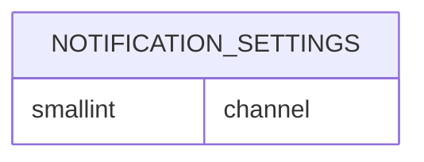
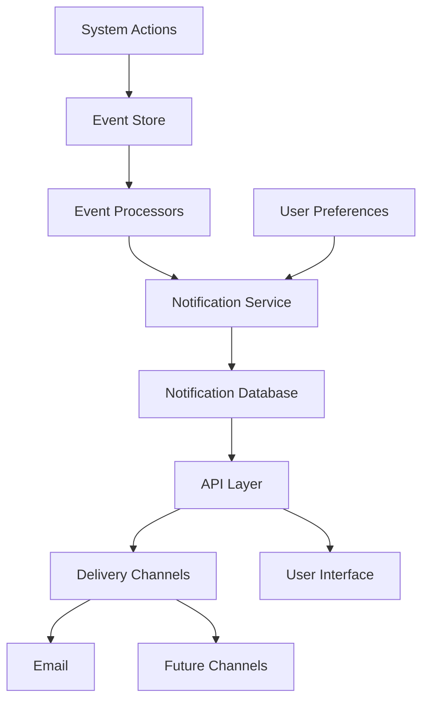

<!-- Design Documents often contain forward-looking statements -->
<!-- vale gitlab.FutureTense = NO -->

<!-- This renders the design document header on the detail page, so don't remove it-->

このページには今後予定されている製品・機能・機能性に関する情報が含まれています。ここに示す情報は参考目的のみです。購入・計画の決定にこの情報を使用しないでください。製品・機能・機能性の開発、リリース、タイミングは変更または延期される可能性があり、GitLab Inc. の独自の判断に委ねられています。

<table class="w-full text-sm border-collapse">
<thead>
<tr class="bg-gray-100 text-left">
<th class="px-3 py-2 border border-gray-300">Status</th>
<th class="px-3 py-2 border border-gray-300">Authors</th>
<th class="px-3 py-2 border border-gray-300">Coach</th>
<th class="px-3 py-2 border border-gray-300">DRIs</th>
<th class="px-3 py-2 border border-gray-300">Owning Stage</th>
<th class="px-3 py-2 border border-gray-300">Created</th>
</tr>
</thead>
<tbody>
<tr>
<td class="px-3 py-2 border border-gray-300">accepted</td>
<td class="px-3 py-2 border border-gray-300"><a href="https://gitlab.com/mksionek" class="text-blue-600 hover:underline">@mksionek</a></td>
<td class="px-3 py-2 border border-gray-300"><a href="https://gitlab.com/fabiopitino" class="text-blue-600 hover:underline">@fabiopitino</a></td>
<td class="px-3 py-2 border border-gray-300"><a href="https://gitlab.com/jtucker_gl" class="text-blue-600 hover:underline">@jtucker_gl</a>, <a href="https://gitlab.com/samdbeckham" class="text-blue-600 hover:underline">@samdbeckham</a></td>
<td class="px-3 py-2 border border-gray-300">~group::personal productivity</td>
<td class="px-3 py-2 border border-gray-300">2025-02-25</td>
</tr>
</tbody>
</table>

<!--
Don't add a h1 headline. It'll be added automatically from the title front matter attribute.

For long pages, consider creating a table of contents.
-->

## サマリー

現在の通知システムはメールをベースとしており、ユーザーは常に受信箱と GitLab の間を行き来する必要があります。同時に、通知と部分的に重複するが一般的にはそのサブセットのみを確立する ToDo システムがあります。ToDo はユーザーの設定によって制御されてもいません。

ユーザーエクスペリエンスを向上させ、ToDo とメール通知の間でパリティを作るために、GitLab 内に通知システムを作成することを提案します。これにより現在の ToDo の固定システムが置き換えられます。通知システムは、現在メール通知を処理する方法を基にします - ユーザーはメール通知の規則と GitLab の通知センターで表示される通知を定義できます。視覚的に、通知センターは現在の ToDo ページに似たものになります。

新しいシステムのニーズを定義する [Epic](https://gitlab.com/groups/gitlab-org/-/epics/13794)。

## 動機

私たちの目標は、ユーザーがメールの受信箱を確認する必要なく、GitLab 自体でグループやプロジェクトでのアクティビティに関する情報を受け取れるシステムを作ることです。これらの通知はパーソナライズ可能で、フィルタリングが容易で、完了/既読としてマークしやすいものであるべきです。私たちは通知の使用量を増やしたいと考えています（メトリクスは今後決定）。

内部的な動機は、拡張が容易でコードベースの他の部分と疎結合なシステムを作成することです。また、保守可能なデータベース負荷を可能にする明確な保持ポリシーを持つシステムを作りたいと考えています。さらに、コードベースへの新しい通知の追加が容易で、機能チームが自分でセルフサービスできるようにしたいと思います。

### 目標

- ユーザーが仕事をするために知る必要があるすべてを一か所で見られる包括的なエクスペリエンスを作成する
- 現在の ToDo と新しい通知センターの間で MAU（Monthly Active Users）メトリクスを向上させる
- より高い凝集性とより拡張可能なシステムを達成するためにコードをリファクタリングする

### 非目標

- ユーザーが受信箱から得られるすべての機能を置き換えること（例: すべての期間のすべてのメンションを検索する）。代わりに主に GitLab を使用した日常的なインタラクションに焦点を当てます。

## 提案

### サマリー

メール通知と ToDo という現在の断片化した通知システムを、イベント駆動アーキテクチャを使用した単一の凝集した通知センターに統合することを提案します。これによりユーザーエクスペリエンスが向上し、コードのメンテナンスが簡素化され、将来の拡張性が実現します。

### 提案されたソリューション

イベント駆動アーキテクチャに基づいた統一通知センターを作成します:

- すべての通知のバックボーンとして既存のイベントストアを使用する
- すべての通知タイプに対して単一のデータベースモデルを確立する
- デフォルトで 3〜6 ヶ月の適切な保持ポリシーを実装する
- ユーザーが重要な通知を無期限に保存できるようにする
- 内部と外部の統合の両方に対して一貫した API アクセスを提供する

#### メリットとデメリット

##### メリット

1. ユーザーエクスペリエンスの向上:
   - すべての通知を単一の場所で確認できる
   - 一貫したインターフェイスと動作
   - 通知設定に対するより大きな制御

2. 技術的なメリット:
   - 疎結合アーキテクチャにより独立したサービス開発が可能
   - 集中化された通知ロジックによりメンテナビリティが向上
   - イベント駆動設計により新しい通知タイプの追加が容易
   - コードの重複と複雑さの削減

3. 将来の柔軟性:
   - 新しい通知チャンネル（Web、モバイルプッシュなど）を追加するための簡単なパス
   - API ファーストアプローチによりサードパーティ統合が可能
   - 保持ポリシーによりデータベースの肥大化を防止

##### デメリット

1. 移行の複雑さ:
   - 既存の通知の慎重な処理が必要
   - ユーザー設定の思慮深い移行が必要
   - 移行中に一時的にシステムの複雑さが増す

2. システムの依存関係:
   - イベントストアの信頼性への依存度が増す
   - イベント処理のパフォーマンス管理が必要
   - より複雑な障害シナリオの可能性
   - より多くの通知が保存されることによるデータベース負荷の増大

3. リソース要件:
   - 重大なエンジニアリング作業
   - シームレスな移行を確保するための慎重なテストが必要

## 設計と実装の詳細

### データベーステーブル

新しい _notifications_ データベーステーブルに通知を永続化する必要があります。このテーブルには通知に関するデータが保存されます - 通知の種類、関連するリソース、その状態、ユーザーによって保存されているかどうかの情報などです。

テーブルスキーマ、モデル、サービス実装の例は [`001_database_schema.md`](adr/001_database_schema.md) にあります。

要件として、ほとんどの状況で `user_id` によって ToDo にアクセスし、可能なフィルタリングパターンは:

- プロジェクト別
- グループ別（特定のグループのプロジェクトからくるすべての通知）
- 作者別
- 通知に関連するリソース別
- アクション別（例: メンションされた/アサインされた/など）
- 状態別
- スヌーズされた状態別

その他の要件もあります:

- 非機能要件: 新しいデータベーステーブルは STI を使用してはなりません。
- 機能要件: ページネーションができる必要があります。

### 通知設定

現在の通知設定では、ユーザーがメール通知を受け取るタイミングについて高度にカスタマイズ可能なルールを定義できます。現在の ToDo とメールシステム間のパリティを作るために、ユーザーがメールのみ、メールと Web ベースの通知、または Web ベースの通知のみを受け取るかどうかを設定できる機能を追加する必要があります。

NOTE: 通知/メールの差別化の追加以外の通知設定システムへの変更は、このプロジェクトのスコープ外です。

`notification_settings` テーブルの新しいカラム:

これにより、現在のレコードに対して何も変更しないようにでき（`email` 値で `channel` カラムを追加）、Web ベースの通知に対しては最大の柔軟性を持って別の行を追加することができます。

### イベント

イベントシステムはこの提案のバックボーンです。GitLab イベントストアの実装は [こちら](https://docs.gitlab.com/development/event_store/) に説明されています。すべての通知レコードとすべての通知メールは、特定のイベントのサブスクライバーで処理される必要があります。

イベントストアはすべての通知トリガーイベントの唯一の情報源として機能します。このアプローチにはいくつかの主要な利点があります:

- 疎結合: システムアクションは、それらのイベントがどのように処理されるか、またはどの通知がトリガーされるかを知ることなくイベントを生成します。
- 一貫性: 単一のイベントソースを使用することで、すべての通知タイプが同じ一貫したデータから派生することが保証されます。

#### イベント処理パイプライン

- イベント発行: システムで関連するアクションが発生すると（アサイン、コメント、期日変更など）、イベントストアにイベントが公開されます。
- イベント処理: イベントプロセッサーが特定のイベントタイプにサブスクライブし、生のイベントを通知候補に変換します。
- 通知フィルタリング: 通知サービスがユーザー設定を適用して、通知を作成すべきかどうかを決定します。
- 通知ストレージ: 有効な通知が適切なメタデータとともに統一通知データベースに保存されます。
- 配信決定: ユーザー設定と通知タイプに基づいて、システムがどの配信チャンネルを使用するかを決定します（現在はメール）。

### REST API と GraphQL エンドポイント

新しい実装の重要な部分として、通知レコードと個別およびバッチ方式でインタラクションできる REST API と GraphQL エンドポイントを提供することです。ToDo 向けの REST API と GraphQL エンドポイントの現在の実装が、私たちが求めているものの例として使えます。

## 代替ソリューション

1. 現在のシステムを個別に強化する

メリット:

- 初期の開発作業が少ない
- 移行リスクが低い
- 段階的に実装できる

デメリット:

- 断片化したユーザーエクスペリエンスが維持される
- コードのメンテナンス問題が解決されない
- 将来の拡張性が限られる
- 共通機能のための重複した作業

1. イベントを使用せずに新しい設定で新しい通知システムを導入する

メリット:

- 設定側の柔軟性がより高い

デメリット:

- コードのメンテナンス問題が解決されない
- 将来の拡張性が限られる

1. STI パターンを使用しないために通知テーブルに [リードモデル](https://www.qlerify.com/event-storming-concepts/read-model) を導入する

メリット:

- 読み取りパターンに焦点を当て、読み取り速度を最適化する

デメリット:

- すべての変更が通知テーブルに確実に反映されるよう、広範なイベントシステム開発が必要

## アーキテクチャ決定レコード

データベース提案: [リンク](adr/001_database_schema.md)
