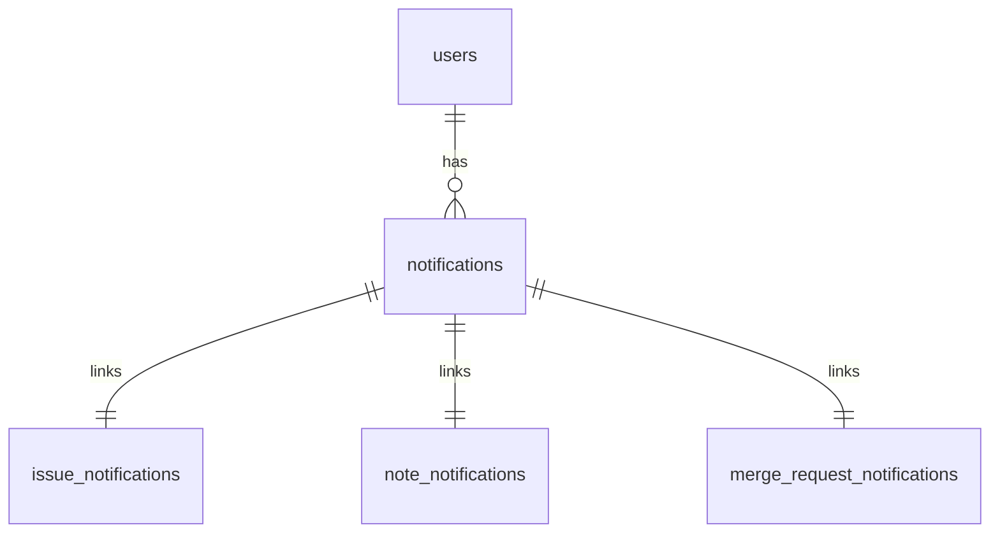

## データベース構造の提案

### 📄 技術提案: 通知システム設計

#### 🧠 目標

**ユーザー通知**を様々なタイプのリソース（Issue、ノート、マージリクエスト、エピック）について管理するための、柔軟で正規化されたデータベース構造を設計します。以下を回避します:

- 単一テーブル継承（STI）
- ポリモーフィック関連

### 🏗️ データベース設計の概要

#### 1. `notifications` テーブル（中央集権型）

ユーザーごとの通知を格納します。

```sql
CREATE TABLE notifications (
  id SERIAL,
  user_id BIGINT NOT NULL REFERENCES users(id),
  read BOOLEAN DEFAULT FALSE,
  created_at TIMESTAMP DEFAULT NOW(),
  updated_at TIMESTAMP DEFAULT NOW(),
  namespace_id BIGINT NOT NULL REFERENCES namespaces(id),
  snoozed_until TIMESTAMP,
  saved BOOLEAN DEFAULT FALSE,
  resolved_by_action SMALLINT,
  author_id BIGINT REFERENCES users(id),
  action SMALLINT,
  resource_type SMALLINT,
  PRIMARY KEY (id, user_id)
) PARTITION BY HASH (user_id);
```

このテーブルは[ハッシュベースのパーティショニング戦略](https://docs.gitlab.com/development/database/partitioning/)を使用してパーティション分割する必要があります。32個のパーティションを使用するべきです（これにより、このテーブルの将来的な成長に十分な余裕が生まれます）。最も一般的なユースケースである `user_id` での検索に最適化するため、`user_id` カラムをパーティションキーとして使用します。

#### 2. リソースリンクテーブル（リソースごとに1つ）

各通知は、専用のテーブルを介して正確に **1つの** リソースにリンクされます。

```sql
CREATE TABLE issue_notifications (
    notification_id BIGINT NOT NULL,
    resource_id BIGINT NOT NULL REFERENCES issues(id) ON DELETE CASCADE,
    namespace_id BIGINT NOT NULL REFERENCES namespaces(id) ON DELETE CASCADE,
    user_id BIGINT NOT NULL REFERENCES users(id) ON DELETE CASCADE,
    FOREIGN KEY (notification_id, user_id) REFERENCES notifications(id, user_id) ON DELETE CASCADE
);

CREATE TABLE note_notifications (
    notification_id BIGINT NOT NULL,
    resource_id BIGINT NOT NULL REFERENCES notes(id) ON DELETE CASCADE,
    namespace_id BIGINT NOT NULL REFERENCES namespaces(id) ON DELETE CASCADE,
    user_id BIGINT NOT NULL REFERENCES users(id) ON DELETE CASCADE,
    FOREIGN KEY (notification_id, user_id) REFERENCES notifications(id, user_id) ON DELETE CASCADE
);

CREATE TABLE merge_request_notifications (
    notification_id BIGINT NOT NULL,
    resource_id BIGINT NOT NULL REFERENCES merge_requests(id) ON DELETE CASCADE,
    namespace_id BIGINT NOT NULL REFERENCES namespaces(id) ON DELETE CASCADE,
    user_id BIGINT NOT NULL REFERENCES users(id) ON DELETE CASCADE,
    FOREIGN KEY (notification_id, user_id) REFERENCES notifications(id, user_id) ON DELETE CASCADE
);

CREATE TABLE ssh_keys_notification_links (
    notification_id BIGINT NOT NULL,
    resource_id BIGINT NOT NULL REFERENCES keys(id) ON DELETE CASCADE,
    namespace_id BIGINT NOT NULL REFERENCES namespaces(id) ON DELETE CASCADE,
    user_id BIGINT NOT NULL REFERENCES users(id) ON DELETE CASCADE,
    FOREIGN KEY (notification_id, user_id) REFERENCES notifications(id, user_id) ON DELETE CASCADE
)

CREATE TABLE commit_notifications (
    notification_id BIGINT NOT NULL,
    resource_id BIGINT NOT NULL,
    namespace_id BIGINT NOT NULL REFERENCES namespaces(id) ON DELETE CASCADE,
    user_id BIGINT NOT NULL REFERENCES users(id) ON DELETE CASCADE,
    FOREIGN KEY (notification_id, user_id) REFERENCES notifications(id, user_id) ON DELETE CASCADE
)
```

`namespace_id` カラムは参照先の `notifications` テーブルと同じ値を持ち、シャーディングキーとして使用します。
`issue_notifications` テーブルはエピックや OKR を含むすべての work_items タイプに対応します。`issues` テーブルの `work_item_type` フィールドでタイプを区別します。

クエリのサンプルとその実行計画は[このスニペット](https://gitlab.com/-/snippets/4840572)に記載されています。

### 🔍 エンティティ関係図



### ⚖️ バリデーション戦略

#### ✅ アプリケーションレベルのバリデーション（Rails）

```ruby
class Notification < ApplicationRecord
  belongs_to :user

  has_one :issue_notification
  has_one :note_notification
  has_one :merge_request_notification
  <etc>

  has_one :issue, through: :issue_notification
  has_one :note, through: :note_notification
  has_one :merge_request, through: :merge_request_notification
  has_one :epic, through: :issue_notification
  <etc>

  validate :only_one_resource_linked

  def only_one_resource_linked
    links = [
      issue_notification,
      note_notification,
      merge_request_notification
    ].compact

    errors.add(:base, "Only one resource can be linked to a notification") if links.size > 1
  end
end
```

### 通知作成サービス

リソースセーフな作成ロジックをカプセル化します:

```ruby
class NotificationCreator
  def self.create_for(resource:, user:)
    Notification.transaction do
      notification = Notification.create!(user: user)

      case resource
      when Issue
        IssueNotification.create!(notification: notification, resource: resource)
      when Note
        NoteNotification.create!(notification: notification, resource: resource)
      when MergeRequest
        MergeRequestNotification.create!(notification: notification, resource: resource)
      when Epic
        IssueNotification.create!(notification: notification, resource: resource) # it's because we would use work-item approach, where every epic has a row in issues table
      else
        raise ArgumentError, "Unsupported resource type"
      end

      notification
    end
  end
end
```

### 📦 Rails モデルのまとめ

各リンクテーブルには対応するモデルがあります。例:

```ruby
class IssueNotification < ApplicationRecord
  belongs_to :notification
  belongs_to :resource
end
```

`NoteNotification`、`MergeRequestNotification` 等についても同様に繰り返します。

---

### 📊 クエリ例

#### リソースタイプとともにすべてのユーザー通知を取得する

```sql
SELECT n.id, n.resource_type, i.title, n.read, n.created_at
FROM notifications n
JOIN issue_notifications l ON l.notification_id = n.id
JOIN issues i ON i.id = l.resource_id
WHERE n.user_id = :user_id

UNION ALL

SELECT n.id, n.resource_type, no.content, n.read, n.created_at
FROM notifications n
JOIN note_notifications l ON l.notification_id = n.id
JOIN notes no ON no.id = l.resource_id
WHERE n.user_id = :user_id

UNION ALL

SELECT n.id, n.resource_type, mr.title, n.read, n.created_at
FROM notifications n
JOIN merge_request_notifications l ON l.notification_id = n.id
JOIN merge_requests mr ON mr.id = l.resource_id
WHERE n.user_id = :user_id

UNION ALL

SELECT n.id, n.resource_type, e.title, n.read, n.created_at
FROM notifications n
JOIN issue_notifications l ON l.notification_id = n.id
JOIN epics e ON e.issue_id = l.resource_id
WHERE n.user_id = :user_id

ORDER BY created_at DESC;
```

### この設計の利点

- STI やポリモーフィック関連がない
- 外部キー制約による完全な参照整合性
- 責務の明確な分離
- 明示的なモデルによる Rails フレンドリーな設計
- より簡単なインデックス作成とパフォーマンス最適化
- 組み込みパーティショニングにより、現在より多くの行を格納できる

### この設計の課題

- 複数のテーブルを一度に JOIN する必要がある
- 非効率なクエリを避けるために慎重なクエリ構造が必要

### この設計の探求

このドメイン（通知）とは直接関係ありませんが、このアーキテクチャ設計の提案は[AI Catalog グループ](/handbook/engineering/ai/ai-catalog/)によって[マージリクエスト 194032](https://gitlab.com/gitlab-org/gitlab/-/merge_requests/194032)で探求されました。

上記で提案した[通知作成サービス](#通知作成サービス)の代わりに、以下を含む[コンサーン](https://gitlab.com/gitlab-org/gitlab/-/blob/98fab27d5b3d0f354c1ea93a86c18d0f37347b90/ee/app/models/concerns/ai/catalog/itemable.rb)を使用することを探求しました:

- `accepts_nested_attributes_for` - ネストされた属性の処理を有効化
- `after_initialize` コールバック - 汎用モデルを自動的に作成
- `delegate` と `assign_attributes` - 汎用属性の読み書きを処理

新しい通知アーキテクチャを実装する際には、このアプローチの評価を推奨します。
