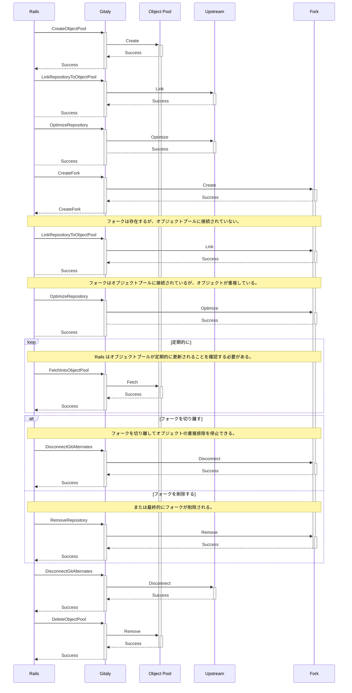
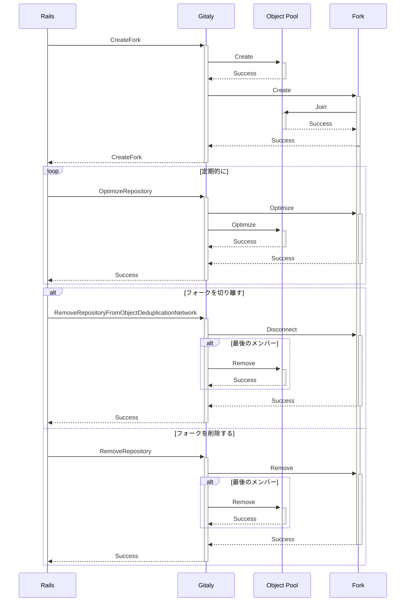



## 概要

リポジトリのフォークは、GitLab でホストされるプロジェクトの多くの現代的なワークフローの中心です。フォークとそのアップストリームプロジェクトの間のオブジェクトのほとんどは通常同じであるため、最適化の余地があります:

- アップストリームリポジトリの大部分を再利用できれば、理論的にはフォークの作成が非常に高速になります。

- 共有されるオブジェクトを重複排除することで、ストレージスペースを節約できます。

このアーキテクチャは現在、プライマリリポジトリのオブジェクトを保持するオブジェクトプールで実装されています。しかし、オブジェクトプールの設計は有機的に成長しており、現在その限界を示しています。

このブループリントでは、オブジェクトプールの設計を改善して長年の課題を修正する方法を探ります。さらに、オブジェクトプールの具体的な実装の詳細をより容易にイテレーションできる設計に到達することを目指します。

## 動機

オブジェクトプールの現在の設計は、様々な面でスケーラビリティの問題を示しています。問題の大部分は、オブジェクトプールが有機的に成長し、進みながら学んでいったという事実から来ています。

オブジェクトプールの全体的な設計を修正することが難しいのは、明確なオーナーシップが存在しないからです。Gitaly はオブジェクトプールを機能させるための低レベルな構成要素を提供していますが、実装の詳細をイテレーションできるほどの制御権を持っていません。

したがって、2つの主要な目標があります: 設計のイテレーションを容易にするためにオブジェクトプールのオーナーシップを取得すること、そしてイテレーションできるようになったらスケーラビリティの問題を修正することです。

### ライフサイクルのオーナーシップ

Gitaly はオブジェクトプールを管理するインターフェースを提供していますが、実際のライフサイクルはクライアントによって制御されています。オブジェクトプールの典型的なライフサイクルは次のようになります:

1. `CreateObjectPool()` でオブジェクトプールが作成されます。呼び出し元は、オブジェクトプールを作成するパスと、リポジトリを作成するオリジンリポジトリを指定します。

1. オリジンリポジトリは `LinkRepositoryToObjectPool()` を呼び出してオブジェクトプールに明示的にリンクされる必要があります。

1. オブジェクトプールは `FetchIntoObjectPool()` を介して定期的に更新される必要があります。これはプライマリプールメンバーからオブジェクトプールへすべての変更をフェッチします。

1. フォークを作成するには、クライアントが `CreateFork()` を呼び出してから `LinkRepositoryToObjectPool()` を呼び出す必要があります。

1. フォークのリポジトリは `DisconnectGitAlternates()` を呼び出してリンクを解除されます。これによりオブジェクトが再複製されます。

1. オブジェクトプールは `DeleteObjectPool()` で削除されます。

このライフサイクルは複雑で、実装の詳細を呼び出し元に多く漏らしています。これはもともと、Rails 側が Git オブジェクトの可視性を制御・管理できるようにするために行われました。GitLab プロジェクトの可視性ルールは複雑で、Gitaly の関心事ではありません。これらの詳細を公開することで、Rails はプールメンバーシップリンクがいつ作成・削除されるかを制御できます。現時点では、完全なシステムがどのように機能し、その限界が何かは明確に文書化されていません。

ライフサイクルの複雑さに加えて、プールメンバーシップについて複数の情報源も存在します。Gitaly はプールリポジトリのメンバーのセットを追跡しておらず、特定のリポジトリがそのプールの一部であることしか伝えられません。その結果、Rails はこの情報をデータベースで維持することを余儀なくされていますが、古くなることなくこの情報を維持するのは困難です。

### リポジトリのメンテナンス

ライフサイクルのオーナーシップの問題に関連するのが、リポジトリのメンテナンスの問題です。前述のように、オブジェクトプールを最新の状態に保つには `FetchIntoObjectPool()` を定期的に呼び出す必要があります。これは実装の詳細をクライアントに漏らしていますが、クライアントがプライマリリポジトリとオブジェクトプールの同期を制御できるようにするために行われました。この制御により、プライベートリポジトリがオブジェクトプールに同期せず、フォークネットワーク内の他のリポジトリにオブジェクトを漏らすことを防げます。

リポジトリのメンテナンスを Gitaly に移すことで、クライアントがディスク上の詳細を知る必要がなくなるという好成績を収めています。理想的には、オブジェクトプールのプライマリメンバーであるリポジトリでも同様のことができればよいでしょう: ディスク上の状態を最適化すると、オブジェクトプールも自動的に更新されます。

これを妨げる2つの問題があります:

- Gitaly はオブジェクトプールとそのメンバーの関係を知らない。

- オブジェクトプールの更新は高コストである。

Gitaly をオブジェクトプールメンバーシップの唯一の情報源にすることで、両方の問題を修正できる立場に立てます。

### 高速フォーキング

現在の実装では、Rails はまず `CreateFork()` を呼び出し、フォークリポジトリを生成するために完全な `git-clone(1)` が実行されます。続いて `LinkRepositoryToObjectPool()` でフォークをオブジェクトプールにリンクします。フォークリポジトリでハウスキーピングが実行されるまで、オブジェクトは重複排除されません。これは実装の詳細をクライアントに漏らすだけでなく、オブジェクトプールの潜在的なメリットを最大限に活かすことも妨げています。

特に、フォーキングの前に常にクローンが実行されるため、フォークの作成が可能な限り速くなりません。フォークの作成とプールリポジトリへのリンクのステップを統合すれば、初期クローンを回避できます。

### クラスター化されたオブジェクトプール

Gitaly Cluster とオブジェクトプールの開発は重なっていました。その結果、それらが互いにうまく機能しないことが知られています。Praefect は、オブジェクトプールを持つリポジトリがすべてのノードにそのオブジェクトプールが存在することを保証せず、オブジェクトプールが既知の状態にあることも保証しません。もしあったとしても、オブジェクトプールは偶然にしか機能しません。

現在の状態は、オブジェクトプールが欠落していたり、ノードごとに異なるコンテンツを持つケースにつながっています。これにより、オブジェクトプールメンバーで観測される状態が一貫せず、オブジェクトプールのコンテンツに依存する書き込みが失敗する可能性があります。

クラスター化された Gitaly でオブジェクトプールを処理する一つの方法は、プールリポジトリを、それに依存するリポジトリを含むノードに複製することです。これにより、フォークネットワークのメンバーが異なるノードに存在できるようになります。これを機能させるには、リポジトリの複製がオブジェクトプールを認識し、特定のノードに複製する必要があるときを知る必要があります。

## 要件

特定のソリューションに対して与えられなければならない一連の要件と不変条件があります。

### プライベートなアップストリームリポジトリはフォークにオブジェクトを漏らさないこと

プロジェクトがパブリックでない可視性設定を持っている場合、リポジトリ内のオブジェクトをオブジェクトプールにフェッチするべきではありません。オブジェクトプールには、かつてパブリックであったアップストリームリポジトリのオブジェクトのみを含めるべきです。これにより、プライベートなアップストリームリポジトリが共有オブジェクトプールを通じてフォークにオブジェクトを漏らすことを防ぎます。

### フォークはアップストリームプロジェクトにオブジェクトを密かに持ち込めないこと

フォークリポジトリにアップロードされたオブジェクトを、共有オブジェクトプールを介してアップストリームリポジトリからアクセス可能にすることはできません。そうでなければ、権限のないユーザーが単純にリポジトリをフォークすることで、リポジトリにオブジェクトを「密かに持ち込む」ことができてしまいます。

これは混乱を招くだけでなく、壊れていることが知られているオブジェクトを導入することで、アップストリームリポジトリを破壊するメカニズムとしても機能します。

### オブジェクトプールのライフタイムはアップストリームリポジトリのライフタイムを超えること

アップストリームリポジトリが削除された場合でも、フォークネットワーク内の他のリポジトリ間での共有オブジェクトの継続的な重複排除を提供するために、そのオブジェクトプールは保持されるべきです。したがって、オブジェクトプールのライフタイムはアップストリームリポジトリのライフタイムより長いと言えます。オブジェクトプールは、それを参照するリポジトリがなくなった場合にのみ削除されるべきです。

### オブジェクトのライフタイム

フォークネットワーク内でオブジェクトを重複排除することで、リポジトリはオブジェクトプールに依存するようになります。プールされたリポジトリ内のオブジェクトが欠落すると、フォークネットワーク内のリポジトリが破損する可能性があります。したがって、プールされたリポジトリ内のオブジェクトは、それを参照するリポジトリが存在する限り継続して存在しなければなりません。

プールされたオブジェクトが1つ以上のリポジトリによって参照されているかどうかを正確に判定するメカニズムがない場合、プールされたリポジトリ内のすべてのオブジェクトを保持しなければなりません。オブジェクトプールを参照するリポジトリが存在しなくなった場合にのみ、プールされたリポジトリとそのすべてのオブジェクトを削除できます。

### オブジェクトの共有

重複排除されたオブジェクトは、特定のリポジトリのすべてのフォークからアクセス可能になります。たとえそれがどのフォークでも到達可能でなかったとしても同様です。その結果、オブジェクトプールへの書き込みはそのすべてのメンバーに即座に影響を与えます。

オブジェクトプールに接続されたリポジトリが複製される際には、このプロパティに注意する必要があります。ユーザーが観測できる状態はすべてのレプリカで同じであるべきなので、リポジトリとそのオブジェクトプールが異なるノード間で一貫していることを確認する必要があります。

## 提案

現在の設計では、クライアントはオブジェクトプールの完全なライフサイクルを管理する必要があるため、オブジェクトプールの管理は主にクライアント側で行われています。これにより Rails はオブジェクトプールの関係を Rails データベースに格納し、オブジェクトプールのライフのすべてのステップを細粒度で管理し、冪等な Gitaly RPC を呼び出してSidekiq ジョブを定期的に実行して状態を強制する必要があります。この設計により、すでに複雑なメカニズムの複雑さがさらに増しています。

クライアント側でオブジェクトプールの完全なライフサイクルを処理する代わりに、このドキュメントでは Gitaly 内にオブジェクトプールのライフサイクル管理をカプセル化することを提案します。低レベルのアクションでオブジェクトプールを維持する代わりに、クライアントはリポジトリとそのオブジェクトプール間の更新された関係を Gitaly に伝えるだけでよくなります。

これにより複数の利点があります:

- ライフサイクル管理の固有の複雑さが単一の場所、つまり Gitaly にカプセル化されます。

- Gitaly は、将来的に「alternates」より優れたソリューションを見つけた場合に、オブジェクトプールの低レベルな技術設計をイテレーションするよりよい立場にあります。

- Gitaly Cluster、オブジェクトプール、リポジトリハウスキーピングの間のより良い連携を確保できます。

- Gitaly がオブジェクトプールの関係の唯一の情報源となり、より適切に管理できるようになります。

全体的な目標は、抽象化レベルを上げることで、クライアントが技術的な詳細をあまり心配する必要がなく、Gitaly がそれらをよりよくイテレーションできる立場に立てることです。

### プールのライフサイクル管理を Gitaly に移す

オブジェクトプールのライフサイクル管理は、実装の詳細をクライアントに漏らしすぎており、そうすることで物事を理解しにくく非効率にしています。

現在のソリューションは、リポジトリとそのオブジェクトプール間の関係を管理する細粒度の RPC セットに依存しています。代わりに、フォークの高レベルなコンセプトのみをクライアントに公開する簡略化されたアプローチを目指しています。これは3つの RPC の形で行われます:

- `ForkRepository()` は指定されたリポジトリのフォークを作成します。アップストリームリポジトリにまだオブジェクトプールがない場合、Gitaly はそれを作成します。次に新しいリポジトリを作成し、自動的にオブジェクトプールにリンクします。アップストリームリポジトリはオブジェクトプールのプライマリメンバーとして記録され、フォークはセカンダリメンバーとして記録されます。

- `UnforkRepository()` はリポジトリを接続されているオブジェクトプールから削除します。これによりオブジェクトの重複排除が停止します。プライマリオブジェクトプールメンバーの場合、これは Gitaly がオブジェクトプールへの新しいオブジェクトのプルを停止することも意味します。

- `GetObjectPool()` は指定されたリポジトリのオブジェクトプールを返します。プールの説明には、プールのプライマリオブジェクトプールメンバーとすべてのセカンダリオブジェクトプールメンバーに関する情報が含まれます。

さらに、以下の変更が実装されます:

- `RemoveRepository()` はリポジトリをそのオブジェクトプールから削除します。それが最後のオブジェクトプールメンバーであった場合、プールは削除されます。

- `OptimizeRepository()` は、プライマリオブジェクトプールメンバーで実行された場合、オブジェクトプールも更新・最適化します。

- `ReplicateRepository()` はオブジェクトプールを認識し、それらを正しく複製する必要があります。必要に応じてリポジトリをオブジェクトプールにリンクおよびリンク解除します。これは Praefect の世界を修正するための一歩ですが、いずれにせよ Praefect を廃止する計画があるため冗長に見えるかもしれませんが、この RPC 呼び出しはリポジトリの再バランスなど他のユースケースでも使用されています。

これらの変更により、Gitaly はオブジェクトプールのライフサイクルをより厳密に制御できるようになります。さらに、リポジトリのオブジェクトプールへのメンバーシップを追跡し始めることで、フォークネットワークの唯一の情報源となれます。

### オブジェクトプールの非効率なメンテナンスを修正する

オブジェクトプールを更新するために、Gitaly はプライマリオブジェクトプールメンバーからオブジェクトプールへ新しいオブジェクトのフェッチを実行します。このフェッチは、プライマリオブジェクトプールメンバーで新しいオブジェクトを不必要にネゴシエートする必要があるため非効率です。しかし、オブジェクトはプライマリオブジェクトプールメンバーですでに重複排除されているため、オブジェクトプールにまだ存在しないオブジェクトのみがそのオブジェクトデータベースにあるはずです。したがって、ネゴシエーションを完全にスキップして、代わりにソースリポジトリに存在するすべてのオブジェクトをオブジェクトプールにリンクできるはずです。

現在の設計では、これらのオブジェクトはちょうどフェッチされたオブジェクトへの参照を作成することで生き続けます。フェッチが参照を削除したり強制更新したりした場合、以前に参照されていたオブジェクトが参照されなくなる可能性があります。Gitaly はキープアラウンド参照を作成して、それらが削除されないようにします。さらに、これらの参照はオブジェクトプールを適切に複製するために必要です。複製は参照ベースで行われるためです。

これら2つの問題は異なる方法で解決できます:

- `preciousObjects` リポジトリ拡張を設定できます。これにより、この拡張を理解するすべてのバージョンの Git に、`git-prune(1)` や類似のコマンドが実行された場合でもオブジェクトを削除しないよう指示します。この拡張を理解しないバージョンの Git は、このリポジトリでの作業を拒否します。

- `git-fetch(1)` でオブジェクトプールを複製する代わりに、オブジェクトデータベースの一部であるすべてのオブジェクトを送信することで複製できます。

これらを合わせると、オブジェクトプールへの参照書き込みを完全に停止できます。これにより、単純にすべての新しいオブジェクトをリンクするだけでオブジェクトプールを効率的に更新でき、オブジェクトプール内の参照の無制限な増加で見られた問題も修正されます。

## 設計と実装の詳細

### 組み込みデータベースへのプールメタデータの格納

オブジェクトプールのメンバーシップを追跡するために、Gitaly は永続的なストアが必要です。プールメタデータは Gitaly サービスの再起動後も保持され、効率的にクエリできる必要があります。Gitaly が追跡する必要のあるプールメタデータには次のものが含まれます:

1. プールネットワークに属するすべてのメンバー
1. ソースリポジトリ（アップストリーム）
1. プールを参照するリポジトリの数

様々な組み込みデータベースとそのトレードオフを検討しました。
次の表は、Gitaly が回答しなければならないクエリに対する BadgerDB（キーバリュー）と SQLite（リレーショナル）のパフォーマンスを対比しています。

| クエリ | BadgerDB | SQLite |
| ------- | ---------- | -------- |
| **"プール X のすべてのメンバーをリスト"** | 前方インデックス `pool:{poolID}:member:{forkID} -> (empty)` でキー `pool:{poolID}:member:*` のプレフィックススキャン — O(n) イテレーション | `SELECT fork_id FROM pool_members WHERE pool_id = ?` — インデックス付きで O(log n) |
| **"フォーク Y が属するプール"** | 逆インデックス `fork:{forkID} -> {poolID}` — 関係ごとに2つのキーを維持する必要あり | `SELECT pool_id FROM pool_members WHERE fork_id = ?` — O(log n)、単一テーブル |
| **"プール X が属するアップストリーム"** | ルックアップ `pool:{poolID}:upstream` — O(1) だが維持する別のキーが必要 | `SELECT upstream FROM pools WHERE pool_id = ?` — O(log n)、プールレコードと一緒に格納 |
| **"プール X のメンバー数"** | 別に `pool:{poolID}:count` を格納・維持する必要あり、メンバーシップが変わるたびにデシンクのリスク | `SELECT COUNT(*) FROM pool_members WHERE pool_id = ?` — 常に正確 |
| **"プール X を削除できるか？"（count = 0）** | `pool:{poolID}:count` のルックアップ、プールのメンバーシップが変わるたびに同期が必要な追加キー | `SELECT COUNT(*) FROM pool_members WHERE pool_id = ?` — 常に正確、リアルタイム |
| **"メンバーを追加"** | 3つのキーをアトミックに更新する必要がある（メンバーキー、逆ルックアップ、カウント）。各操作は O(1) | `pool_members` への単一の `INSERT`。インデックスメンテナンス付きで O(log n) の単一 INSERT |
| **"メンバーを削除"** | 2つのキーをアトミックに削除し、カウントを更新 | `pool_members` からの単一の `DELETE`。インデックスメンテナンス付きで O(log n) の単一 DELETE |

SQLite が有利な理由:

1. **リレーショナルクエリはプール管理の核心** — 両方向（プール→メンバー、メンバー→プール）からのメンバーシップルックアップは第一級の操作です。
2. **カウントは常に正確** — 古い `count` キーがデシンクするリスクがありません。Badger は3つの操作が必要であるため、Gitaly で起こる必要がある3つの操作のトランザクション的側面を保証できません。これは SQLite を使用する場合の大きな一貫性の勝利です。
3. **唯一の情報源** — 双方向インデックスを手動で維持する必要がありません。Badger では前方インデックスと逆インデックスが必要でした。
4. **ホットパスクエリ** - 「プール X のすべてのメンバーをリスト」というクエリに答えるには、Badger でプレフィックスを使ったフルスキャンが必要になります。
5. **スケール** - gitlab-org/gitlab のような人気リポジトリには約 12,000 のフォークが含まれています。これを Badger に格納すると、逆インデックスに 12,000 エントリ、前方インデックスに 12,000 エントリ、カウントに 1、プールのアップストリームエントリに 1、合計約 24,002 エントリが必要です。このようなモノリポが 100 個あれば 24,002,000 エントリが必要になります。

### エピック

**[15741](https://gitlab.com/groups/gitlab-org/-/work_items/15741): Gitaly が管理するオブジェクトプールの状態が GitLab と同等になる**

このエピックは、Gitaly が Rails が現在 Gitaly 内に持っているオブジェクトプールの状態を持てるようにするための作業をカプセル化するために設計されています。また、適切なオブジェクトプールの状態を取得することを制限するバグも含まれており、Gitaly がパリティをチェックするために必要な Rails 側の RPC を公開します。

**[15742](https://gitlab.com/groups/gitlab-org/-/work_items/15742): プールライフサイクルの制御を Gitaly に移行する**

この作業は、Gitaly がオブジェクトプールライフサイクルに対してより多くのオーナーシップと制御を持てるようにするために必要な RPC への変更をキャプチャします。

### オブジェクトプールのライフサイクル管理を Gitaly に移す

前述のように、目標はオブジェクトプールのオーナーシップを Gitaly に移すことです。
理想的には、オブジェクトプールのコンセプトを呼び出し元にまったく公開しないようにする必要があります。代わりに、オブジェクトを重複排除するために相互にオブジェクトを共有するリポジトリのネットワークという、より高レベルなコンセプトのみを公開したいと思います。

以下のサブセクションでは、現在のオブジェクトプールベースのアーキテクチャをレビューし、新しいオブジェクト重複排除ネットワークベースのアーキテクチャを提案します。

#### オブジェクトプールベースのアーキテクチャ

現在のアーキテクチャでオブジェクトプールのライフサイクルを管理するには、多数の RPC 呼び出しが必要で、呼び出し側からの多くの知識が必要です。次のシーケンス図は、オブジェクトプールのライフサイクルの簡略化されたバージョンを示しています。1つのオブジェクトプールメンバーのみを考慮するという点で簡略化されています。

オブジェクトプールの作成には次のステップが含まれます:

1. オブジェクトプールは `CreateObjectPool()` を呼び出してアップストリームリポジトリから作成されます。作成時のアップストリームリポジトリが含むすべてのオブジェクトを含みます。
1. アップストリームリポジトリは `LinkRepositoryToObjectPool()` を呼び出してオブジェクトプールにリンクされます。そのオブジェクトは自動的に重複排除されません。
1. アップストリームリポジトリ内のオブジェクトは `OptimizeRepository()` を呼び出して重複排除されます。
1. フォークは `CreateFork()` を呼び出して作成されます。この RPC 呼び出しはアップストリームリポジトリのみを入力として受け取り、すでに作成されたオブジェクトプールについては知りません。したがって、オブジェクトの2回目の完全なコピーを実行します。
1. フォークとオブジェクトプールは `LinkRepositoryToObjectPool()` を呼び出してリンクされます。これにより追加のオブジェクトデータベースを認識するようにフォーク内の `info/alternates` ファイルが書き込まれますが、オブジェクトが重複排除されるわけではありません。
1. フォーク内のオブジェクトは `OptimizeRepository()` を呼び出して重複排除されます。
1. 呼び出し側は、アップストリームリポジトリからオブジェクトプールへ新しいオブジェクトをフェッチするために `FetchIntoObjectPool()` を定期的に呼び出すことが期待されます。フェッチされたオブジェクトはアップストリームリポジトリで自動的に重複排除されません。
1. フォークはオブジェクトプールから2つの方法で切り離せます:
   - `DisconnectGitAlternates()` を呼び出して明示的に切り離す。これにより `info/alternates` ファイルが削除されてすべてのオブジェクトが再複製されます。
   - `RemoveRepository()` を呼び出してフォーク全体を削除する。
1. オブジェクトプールが空になったら、`DeleteObjectPool()` を呼び出して削除しなければなりません。

ライフサイクル管理全体がうまく抽象化されておらず、クライアントがその複雑な点の多くを認識する必要があることは明らかです。さらに、オブジェクトプールのメンバーシップについて複数の情報源があり、それらが（実際に）乖離することがあります。

#### オブジェクト重複排除ネットワークベースのアーキテクチャ

提案された新しいアーキテクチャは、パブリックインターフェースからオブジェクトプールの概念を完全に削除することで、このプロセスを簡略化します。代わりに、Gitaly は「オブジェクト重複排除ネットワーク」という高レベルの概念を公開します。リポジトリはこれらのネットワークに2つの役割のいずれかで参加できます:

- 読み書き可能なオブジェクト重複排除ネットワークメンバーは、オブジェクト重複排除ネットワークの一部であるオブジェクトのセットを定期的に更新します。
- 読み取り専用のオブジェクト重複排除ネットワークメンバーはパッシブメンバーであり、オブジェクト重複排除ネットワークの一部であるオブジェクトのセットを更新しません。

オブジェクト重複排除ネットワークのメンバー間で重複排除できるオブジェクトのセットは、読み書き可能なメンバーからフェッチされたオブジェクトのみで構成されます。すべてのメンバーは役割に関係なく重複排除のメリットを享受します。通常:

- オリジナルのアップストリームリポジトリは、オブジェクト重複排除ネットワークの読み書き可能メンバーとして指定されます。
- フォークは読み取り専用のオブジェクト重複排除ネットワークメンバーです。

オブジェクト重複排除ネットワークには読み取り専用メンバーのみが含まれることも有効です。
その場合、ネットワークは新しい共有オブジェクトで更新されませんが、既存の共有オブジェクトは引き続き使用されます。

オブジェクトプールは引き続き基礎となるメカニズムですが、高いレベルの抽象化により、将来的に別のメカニズムに置き換えることができます。

Gitaly のクライアントがオブジェクトプールベースのアーキテクチャでオブジェクトプールの細粒度なライフサイクル管理を実行する必要がある一方で、オブジェクト重複排除ネットワークベースのアーキテクチャでは、オブジェクト重複排除ネットワークのメンバーシップを管理するだけでよくなります。次の図は、オブジェクト重複排除ネットワークベースのアーキテクチャにおける、オブジェクトプールベースのアーキテクチャと同等のフローを示しています:

主要な手順は次のとおりです:

1. フォークが作成され、リクエストにより Gitaly がアップストリームとフォークの両方のリポジトリをオブジェクト重複排除ネットワークに参加させます。アップストリームプロジェクトがすでにオブジェクト重複排除ネットワークの一部である場合、フォークはそのオブジェクト重複排除ネットワークに参加します。そうでない場合、Gitaly はオブジェクトプールを作成し、アップストリームリポジトリを読み書き可能メンバーとして、フォークを読み取り専用メンバーとして参加させます。フォークのオブジェクトはすぐに重複排除されます。Gitaly は両方のリポジトリのオブジェクトプールへのメンバーシップを記録します。
1. クライアントはアップストリームまたはフォークプロジェクトのいずれかで定期的に `OptimizeRepository()` を呼び出します。これはクライアントがすでに行うことを知っている操作です。動作はオブジェクト重複排除ネットワークメンバーの役割によって異なります:
   - 読み書き可能なオブジェクト重複排除ネットワークメンバーで実行された場合、ヒューリスティックのセットに基づいてオブジェクトプールが更新される場合があります。これにより、読み書き可能なオブジェクト重複排除ネットワークメンバーで新たに作成されたオブジェクトをオブジェクトプールにプルし、オブジェクト重複排除ネットワーク内のすべてのメンバーが利用できるようになります。
   - 読み取り専用のオブジェクト重複排除ネットワークメンバーで実行された場合、読み取り専用のオブジェクト重複排除ネットワークメンバーのみに存在するオブジェクトがメンバー間で共有されないように、オブジェクトプールは更新されません。ただし、必要に応じてオブジェクトを再パックするなど、オブジェクトプールはまだ最適化される場合があります。
1. アップストリームとフォークの両方のプロジェクトは、`RemoveRepositoryFromObjectNetwork()` を呼び出してオブジェクト重複排除ネットワークを離れることができます。これにより、すべてのオブジェクトが再複製され、リポジトリがオブジェクトプールから切り離されます。さらに、リポジトリが読み書き可能なオブジェクト重複排除ネットワークメンバーであった場合、Gitaly はプールを更新するためのソースとしてそれを使用することを停止します。

   または、フォークは `RemoveRepository()` の呼び出しで削除できます。

   どちらの呼び出しもオブジェクトプールのメンバーシップを更新して、リポジトリがそれを離れたことを反映します。Gitaly はメンバーがいなくなった場合にオブジェクトプールを削除します。

この提案されたフローでは、オブジェクトプールの作成、メンテナンス、および削除は Gitaly 内で不透明に処理されます。上記に加えて、2つの追加のサポート RPC が提供される場合があります:

- `AddRepositoryToObjectDeduplicationNetwork()` - 既存のリポジトリが指定された役割でオブジェクト重複排除ネットワークに参加できるようにする。
- `ListObjectDeduplicationNetworkMembers()` - リポジトリが属するオブジェクト重複排除ネットワークのすべてのメンバーとその役割をリストアップする。

#### オブジェクト重複排除ネットワークベースのアーキテクチャへの移行

オブジェクト重複排除ネットワークベースのアーキテクチャへの移行には、多くの小さなステップが含まれます:

1. Gitaly がプールのアップストリームリポジトリを見つけることを含むオブジェクトプールメンバーシップをクエリできるように、`object_pool_members` などの内部 Rails API を導入します。また、Rails が管理する現在のプール関係を発見することもできます。
1. `CreateFork()` が既存のオブジェクトプールに対して自動的にリンクを開始します。これにより高速フォーキングが可能になり、フォーク作成時の呼び出し元に対するオブジェクトプールの概念がなくなります。
1. `AddRepositoryToObjectDeduplicationNetwork()` と `RemoveRepositoryFromObjectDeduplicationNetwork()` を導入します。`AddRepositoryToObjectPool()` と `DisconnectGitAlternates()` を廃止し、Rails を新しい RPC に移行します。オブジェクト重複排除ネットワークはリポジトリを介して識別されるため、メンバーシップを処理する際のオブジェクトプールの概念が削除されます。さらに `IsUsingObjectDeduplication()` と `DisableObjectDeduplication()` を導入し、Rails がプール関係の基礎となる詳細を理解せずにオブジェクトプールと対話できるようにします。
1. `CreateFork()`、`AddRepositoryToObjectDeduplicationNetwork()`、`RemoveRepositoryFromObjectDeduplicationNetwork()` および `RemoveRepository()` でオブジェクト重複排除ネットワークのメンバーシップの記録を開始します。この情報により Gitaly がオブジェクトプールのライフサイクルを制御できるようになります。
1. Gitaly がオブジェクトプールのすべてのメンバーの最新のビューを持っていることを確認できるように移行を実装します。Gitaly がオブジェクトプールのライフサイクルを自動的に処理できるようにするためにこの移行が必要です:
   - `OptimizeRepository()` が読み書き可能なオブジェクトプールメンバーから自動的にオブジェクトをフェッチできるようにします。
   - Gitaly が空のオブジェクトプールを自動的に削除できるようにします。
1. `OptimizeRepository()` がリポジトリに接続されているオブジェクトプールも最適化するように変更します。これにより `FetchIntoObjectPool()` を廃止して最終的に削除できます。
1. `RemoveRepositoryFromObjectDeduplicationNetwork()` と `RemoveRepository()` を空のオブジェクトプールを削除するように変更します。
1. `CreateFork()` がオブジェクトプールを自動的に作成するように変更します。これにより `CreateObjectPool()` RPC を削除できます。
1. `ObjectPoolService` とオブジェクトプールの概念を Gitaly のパブリック API から削除します。
1. 孤立したプールのクリーンアップを実装します。ディスク上に存在するが Gitaly のメタデータストアにメンバーが記録されていないプールを検出してクリーンアップするメカニズムを追加します。歴史的に、ディスク上にあるものと Rails データベースに記録されているものの間でオブジェクトプールが同期していない問題が発生していました。これは非同期の問題を解消するための最終ステップです。
1. Rails からオブジェクトプールの複雑さを抽象化するために Gitaly の RPC インターフェースを簡略化します。
`CreateFork`、`LinkRepositoryToObjectPool`、`CreateObjectPool`、`DisconnectGitAlternates` などの RPC を廃止して以下で置き換えます:

- `CreateRepository` - オブジェクトプールの重複排除を処理するかどうかのヒントを含むようにリクエストを変更

- `DisableObjectDeduplication` - プールから切り離す

1. Gitaly がこの情報の管理を引き継ぐため、Rails 側のオブジェクトプール API をクリーンアップします。

この計画はもちろん変更される可能性があります。

### Gitaly Cluster の懸念事項

#### リポジトリの作成

リポジトリが初めてフォークされると、Rails は `CreateObjectPool()` RPC を介してオブジェクトプールを作成します。つまり、オブジェクトプールの作成は Gitaly の外部で処理されます。その後、オブジェクトプールはアップストリームとフォークのリポジトリにリンクされます。リポジトリに別のリポジトリにリンクする Git `alternates` ファイルが設定されている場合、これら2つのリポジトリは同じ物理ストレージ上に存在しなければなりません。

リポジトリとそのオブジェクトプールが同じ物理ストレージ上に存在することは、Praefect にとって特に重要です。これはリポジトリの複製係数に依存しているからです。複製係数は、Praefect の仮想ストレージでリポジトリが複製されるストレージの数を制御する設定です。デフォルトでは、複製係数は Praefect 内のストレージの数と等しいです。これは、デフォルトの複製係数を使用する場合、リポジトリはクラスター内のすべてのストレージで利用可能であることを意味します。カスタム複製係数が使用される場合、レプリカの数を減らしてリポジトリが Praefect 内のストレージのサブセットにのみ存在するようにできます。

Gitaly Cluster は Praefect の PostgreSQL データベースにリポジトリとそれに割り当てられたストレージを永続化します。データベースは仮想ストレージで新しいリポジトリが作成されると更新されます。新しいリポジトリが作成されると、複製係数によってリポジトリにランダムに割り当てられるストレージの数が指定されます。次のシナリオは、カスタム複製係数がオブジェクトプールにどのように問題になり得るかを概説しています:

1. 5つのストレージノードを持つ Gitaly Cluster に新しいリポジトリが作成されます。複製係数は3に設定されています。したがって、3つのストレージがランダムに選択され、Praefect 内のこの新しいリポジトリに割り当てられます。例えば、割り当てはストレージ 1、2、3 です。ストレージ 4 と 5 にはこのリポジトリのコピーがありません。
1. リポジトリが初めてフォークされるため、`CreateObjectPool()` RPC でオブジェクトプールリポジトリを作成する必要があります。複製係数が3に設定されているため、別のランダムに選択された3つのストレージが Praefect 内の新しいオブジェクトプールリポジトリに割り当てられます。例えば、オブジェクトプールリポジトリはストレージ 3、4、5 に割り当てられます。これらの割り当てはアップストリームリポジトリのものと完全には一致しないことに注意してください。
1. フォークされたリポジトリのコピーは `CreateFork()` RPC で作成され、ランダムに選択された3つのストレージに割り当てられます。例えば、フォークリポジトリにはストレージ 1、3、5 が割り当てられます。これらの割り当てもアップストリームとオブジェクトプールリポジトリのストレージ割り当てとは完全には一致しません。
1. アップストリームとフォークの両方のリポジトリは `LinkRepositoryToObjectPool()` の別々の呼び出しでオブジェクトプールにリンクされます。この RPC が成功するためには、オブジェクトプールがリンクしているリポジトリと同じストレージ上に存在しなければなりません。アップストリームリポジトリはストレージ 1 と 2 でのリンクに失敗します。フォークリポジトリはストレージ 2 でのリンクに失敗します。`LinkRepositoryToObjectPool()` RPC はトランザクションではないため、任意のストレージでの RPC の単一の失敗がクライアントにエラーとしてプロキシされます。したがって、このシナリオでは、アップストリームとフォークの両方のリポジトリの `LinkRepositoryToObjectPool()` は常にエラーレスポンスを返します。

この問題を修正するには、Praefect が常に `CreateObjectPool()` と `CreateFork()` RPC リクエストをアップストリームリポジトリと同じストレージのセットにルーティングするようにしなければなりません。これにより、これらのリポジトリは常に必要なオブジェクトプールリポジトリが利用可能であることが保証され、リンクが成功できます。

この主なデメリットは、オブジェクト重複排除ネットワーク内のリポジトリが同じストレージのセットに固定されることです。これはオブジェクト重複排除ネットワークが大きくなるにつれて個々のストレージに不均等なストレスを与える可能性があります。将来的には、Praefect が必要な場所にまだ存在しないオブジェクトプールをストレージ上に作成できるようになれば、これを完全に回避できます。

#### リポジトリの複製

`ReplicateRepository()` RPC はオブジェクトプールを認識しておらず、ソースリポジトリからのみ複製します。これは、オブジェクトプールリポジトリにリンクされているソースリポジトリを複製すると、Git `alternates` ファイルなしで、結果としてオブジェクトの重複排除なしにターゲットリポジトリが生成されることを意味します。

`ReplicateRepository()` RPC には2つの主な用途があります:

- GitLab API で実行されたストレージの移動は `ReplicateRepository()` RPC に依存して、あるストレージから別のストレージにリポジトリを複製します。この RPC は現在オブジェクトプールを認識していないため、ターゲットストレージ上の結果のレプリカは、ソースリポジトリから Git `alternates` ファイルを複製せず、オブジェクトプールも再作成しません。代わりに、レプリカは常にソースリポジトリの完全で自己完結したコピーです。その結果、Rails 内のリポジトリプロジェクトのオブジェクトプール関係も削除されます。オブジェクト重複排除ネットワーク内のリポジトリをあるストレージから別のストレージに移動する場合、複製されたリポジトリはターゲットストレージ上でオブジェクトの重複排除がなくなるため、ストレージ使用量が増加する可能性があります。
- Praefect でリポジトリのレプリカが古くなった場合、`ReplicateRepository()` RPC は Praefect 複製ジョブによって内部的に使用され、最新のレプリカから古いレプリカに複製します。複製ジョブは、レプリカが古くなったときに Praefect 複製マネージャーによってキューに入れられます。`ReplicateRepository()` RPC はオブジェクトプールを認識していませんが、複製ジョブはソースリポジトリがオブジェクトプールにリンクされているかどうかを確認します。ソースリポジトリがリンクされている場合、ジョブはターゲットリポジトリ上の対応する Git `alternates` ファイルを再作成します。ただし、現在のところ、ターゲットストレージ上にオブジェクトプールが存在しない可能性があります。これが発生した場合、レプリカは存在しないオブジェクトプールにリンクできないため、複製は常に失敗します。これは、レプリカが永久に古いままになる可能性があることを意味します。

ソースリポジトリが必要とするオブジェクトプールは、`ReplicateRepository()` RPC 中にリポジトリとともにターゲットストレージに複製されるべきです。これにより、オブジェクト重複排除ネットワーク内のリポジトリのオブジェクト重複排除が保持されます。GitLab API で実行されたストレージの移動はオブジェクトプールの関係を削除するため、ターゲットストレージ上にオブジェクトプールを再作成すると孤立したオブジェクトプールが生じます。この `ReplicateRepository()` RPC の新しいオブジェクトプール複製動作は、破壊的な変更を防ぐためにクライアントによって制御されるべきです。ストレージの移動のためのオブジェクトプール複製は、次のいずれかが実現した時点で有効にできます:

- Rails 側がオブジェクトプールの関係を保持するように更新される。
- オブジェクトプールのライフサイクルが Gitaly 内で管理される。

オブジェクトプールの複製に関しては、Praefect が処理できる必要があるシナリオがあります。これらのケースでは特別な考慮が必要で、Praefect が PostgreSQL データベースで管理するすべてのリポジトリを追跡し、最新の状態を維持できるようにします。

- オブジェクトプールにリンクされている外部ソースリポジトリを Gitaly Cluster に複製すると、ターゲット仮想ストレージの Praefect が新しいオブジェクトプールリポジトリを作成する必要が生じる場合があります。これを処理するには、ソースリポジトリがオブジェクトプールを使用しているかどうかを知る必要があります。そこから、Praefect の `repositories` データベーステーブルにオブジェクトプールリポジトリのエントリがあるかどうかを確認し、なければ作成できます。次に、オブジェクトプールの Praefect ストレージ割り当てを生成して `repository_assignments` データベーステーブルに永続化する必要があります。
- Praefect のターゲットリポジトリストレージが必要なオブジェクトプールをすでに含んでいることは保証できません。したがって、個々のストレージにオブジェクトプールを割り当てる必要がある場合があります。この新しい割り当ては、Praefect によるオブジェクトプールリポジトリでも追跡されなければなりません。これを処理するために、Praefect はターゲットストレージが必要なオブジェクトプールを含んでいないことを検出し、新しいストレージ割り当てを `repository_assignments` データベーステーブルに永続化する必要があります。

#### プールメタデータストレージ

スタンドアロン Gitaly デプロイでは、プールメタデータはノードにローカルな組み込み SQLite データベースに格納されます。簡略化と統一されたコードベースのために、Gitaly Cluster でも各ノードが独自のローカル SQLite データベースを維持します。

Praefect デプロイでは、投票メカニズムは Git 参照（ブランチ、タグ）が変更された場合にのみ有効化されます。これにより参照トランザクションフックがトリガーされ、投票に参加したすべての Gitaly ノードに RPC がルーティングされ、同期更新による強力な一貫性が提供されます。ただし、レプリカが正常でなく更新できなかった場合、書き込みは非同期になります。これによりノード間で一時的な不整合が生じる可能性があり、SQLite が同期していない可能性がある他のシナリオもあります:

- RPC で Praefect の投票がトリガーされない場合。例えば、`LinkRepositoryToObjectPool` は .git/objects/info/alternates ファイルのみを変更し（参照の変更なし）、`DisconnectGitAlternates` は alternates ファイルを削除（参照の変更なし）するため、一貫性を保証する投票メカニズムが得られず、Praefect はすべての Gitaly ノードに RPC をルーティングするだけです。一部のノードは成功し、他のノードは失敗する可能性があります。
- （複製係数 < 総ノード数）の場合、すべての Gitaly ノードが同じオブジェクトプールやプールメタデータを格納するわけではありません。つまり、Gitaly が管理するすべてのプール関係の完全な把握を得るために、複数のノード間でプールメタデータを集約する必要があります。

ノードを正常に戻すための調整戦略として、スケジュールされた `ReplicateRepository` RPC を拡張して、プールメタデータも更新し、ディスク上に存在するものとメタデータを検証するようにします。

Praefect の PostgreSQL データベースや他の分散 SQLite データベースの使用などの代替手段も検討されましたが、スタンドアロン Gitaly デプロイとは異なるコードパスが増えることと追加の複雑さが、これらを除外しました。

## 設計の問題点

前述のように、オブジェクトプールは完璧なソリューションではありません。このセクションでは最も重要な問題を説明します。

### ライフサイクル管理の複雑さ

オブジェクトプールのライフサイクルが Gitaly によって完全に所有されることで扱いやすくなるとはいえ、依然として複雑で多くの方法で考慮する必要があります。オブジェクトプールをそのリポジトリと組み合わせて処理することはアトミックな操作ではなく、あらゆるアクションが必然的に少なくとも2つの異なるリソースにまたがります。

### パフォーマンスの問題

オブジェクトプールがオブジェクトを重複排除する最終結果として、オブジェクトプールのメンバーは単一のパックファイルにオブジェクトの完全なクロージャを持てなくなります。これは通常、定義上オブジェクトプールのコンテンツと乖離できないプライマリオブジェクトプールメンバーにとっては問題ではありません。しかし、セカンダリオブジェクトプールメンバーはアップストリームリポジトリのオリジナルコンテンツから乖離することが多々あります。

これにより、セカンダリオブジェクトプールメンバーで到達可能なオブジェクトの2つの異なるセットが生じます。残念ながら、Git 自体の制限により、一部の最適化のサブセットが使用できなくなります:

- フェッチを処理する際、すでにデルタ化されたオブジェクトを処理するためにパックファイルを効率的に再利用できません。これにより、オブジェクトプールから乖離したオブジェクトプールメンバーでは、Git がその場でデルタを再計算する必要があります。

- パックファイルのビットマップは、これらのビットマップが複数のオブジェクトデータベースをカバーすることが不可能または容易ではないため、オブジェクトプールにのみ存在できます。これにより、Git は多くの操作、特にフェッチを処理する際に、オブジェクトグラフのより大きな部分をトラバースする必要があります。

### リポジトリ間の依存した書き込み

オブジェクトプールの設計は、すべてのリポジトリへの変更に書き込み前ログを使用する Raft の世界に大きな複雑さをもたらします。理想的なケースでは、Raft ベースの設計はリクエストを考慮する際に単一のリポジトリの書き込み前ログのみを気にする必要があります。しかしオブジェクトプールでは、プールされたリポジトリの読み取りと書き込みの両方が、そのオブジェクトプールへのすべての書き込みが適用されたことに依存していることを考慮せざるを得ません。

## 代替ソリューション

提案されたソリューションは明らかに最良の選択ではなく、複雑さ（ライフサイクルの管理）とパフォーマンス（プールメンバーへのフェッチが非効率に処理される）の両方に問題があります。

このセクションでは、オブジェクトプールの代替案と、それが新しいターゲットアーキテクチャとして選択されなかった理由を探ります。

### オブジェクトプールを完全に使用しない

すべての複雑さを避ける明白な方法は、オブジェクトプールを完全に使用しないことです。エンジニアリングの観点からはアーキテクチャを大幅に簡略化できるため魅力的ですが、効率的なフォーキングワークフローをサポートできないため、製品の観点からは実行可能なアプローチではありません。

### アップストリームリポジトリをオブジェクトプールとして使用する

明示的なオブジェクトプールリポジトリを作成する代わりに、アップストリームリポジトリをすべてのフォークの代替オブジェクトデータベースとして使用できます。これにより、少なくとも表面上はオブジェクトプールのライフタイム管理の複雑さの多くが回避されます。さらに、オブジェクトプールを更新する方法に関する問題も回避されます。常にアップストリームリポジトリのコンテンツと一致するためです。

ただし、いくつかのデメリットがあります:

- リポジトリが異なる状態を持つようになります。一部のリポジトリはオブジェクトをプルーニングできますが、他のリポジトリはできません。これにより不確実性の原因が生じ、リポジトリ内のオブジェクトを誤って削除し、そのフォークを破損させやすくなります。

- アップストリームリポジトリがプライベートになった場合、フォークネットワークのメンバー間で重複排除されるべきオブジェクトの更新を停止しなければなりません。これは、リポジトリがプライベートになった時点で重複排除されたオブジェクトのセットを凍結するために、最終的にオブジェクトプールを作成することを余儀なくされることを意味します。

- フォークによってリンクされているかどうかを考慮する必要があるため、リポジトリの削除がより複雑になります。

### 参照ネームスペース

`gitnamespaces(7)` により、Git は参照を異なるネームスペースのセットに分割するメカニズムを提供します。これにより、すべてのフォークをすべてのオブジェクトを含む単一のリポジトリから提供できます。

1つの優れた特性は、すべてのフォークによって参照されるオブジェクトのグローバルビューを単一のオブジェクトデータベースに持てることです。したがって、どのフォークにも使用されていないオブジェクトの削除を含め、すべてのフォークにわたって共有ハウスキーピングを一度に簡単に実行できます。オブジェクトに関しては、これが目指す最も効率的なソリューションである可能性が高いです。

ただし、再びいくつかのデメリットがあります:

- 使用量クォータの計算は、実際のオブジェクトの到達可能性を考慮する必要があり、計算が高コストです。これは障害になるものではありませんが、念頭に置くべきことです。

- 1つの要件として、フォークから他のリポジトリのオブジェクトに到達可能にすることができないことがあります。このプロパティは理論的には、到達可能なオブジェクトのみへのアクセスを許可することで強制できます。そうすれば、オブジェクトはその参照から到達可能な場合にのみ仮想リポジトリを通じてアクセスできます。到達可能性チェックは計算コストが高すぎて実用的ではありません。

- 参照は分割されていても、大規模なフォークネットワークはそれでも何百万もの参照を持つことになります。パフォーマンスへの影響は不明です。

- リポジトリレベルの攻撃による被害半径が大幅に増加します。自分のリポジトリだけでなく、すべてのフォークにも影響を与えることになります。

- カスタムフックは各仮想リポジトリで分離する必要があります。Git フックの実行は制御されているため、各ネームスペースでこれを処理することは可能です。

### ファイルシステムベースの重複排除

ファイルシステムレベルでオブジェクトを重複排除するというアイデアは、いくつかの時点で浮上しました。これを別のコンポーネントに委ねることができれば良いのですが、Git の動作の性質から実装が容易ではない可能性があります。

リポジトリサイズの最も重要な貢献要因は Git オブジェクトです。オブジェクトをルーズな表現で格納してそのレベルで重複排除することは可能ですが、実現不可能です:

- Git がオブジェクトをデルタ化できなくなります。これはディスク上のサイズを削減する非常に重要なメカニズムです。重複排除によるサイズ削減がデルタ化メカニズムによるサイズ削減を上回る可能性は低いです。

- ルーズオブジェクトはリポジトリへのアクセス時に大幅に非効率です。

- フェッチを処理するには、クライアントにパックファイルを送信する必要があります。通常、Git は既存のパックファイルの大部分を再利用でき、計算オーバーヘッドを大幅に削減します。

したがって、ルーズオブジェクトレベルでの重複排除は実現不可能です。

重複排除を試みる別の単位はパックファイルです。しかしパックファイルは Git によって決定論的に生成されず、リポジトリが互いに乖離し始めると異なってきます。したがって、パックファイルはファイルシステムレベルの重複排除には自然に適していません。

代替として、リポジトリ間でパックファイルのハードリンクを使用することができます。これにより、任意のリポジトリがオブジェクトの再パックを実行するたびにストレージスペースが複製されることになり、予測不可能で管理が困難になります。

### カスタムオブジェクトバックエンド

理論的には、フォーク間でオブジェクトを重複排除できる方法でオブジェクトを格納できるカスタムオブジェクトバックエンドを実装することが可能です。ただし、大規模なアップストリームへの投資なしにはこれを実現するいくつかの技術的なハードルがあります:

- Git は現在、オブジェクトに異なるバックエンドを持つように設計されていません。オブジェクトデータベースの一部であるファイルへのアクセスは、抽象化レベルなしにコードベース全体に散在しています。これは少なくとも何らかの抽象化レベルを持つ参照データベースとは対照的です。

- カスタムオブジェクトバックエンドを実装するには、おそらく Git プロジェクトのフォークが必要になります。そのためのリソースがあったとしても、アップストリームの変更との潜在的な非互換性により大きなリスク要因が生じます。バニラ Git を使用することが不可能になります。これは GitLab をパッケージングする Linux ディストリビューションのコンテキストでしばしば存在する要件です。

初期コストと継続的なメンテナンスの運用リスクの両方が、現時点ではこのアプローチを正当化するには高すぎます。将来的にはこのアプローチを再検討するかもしれません。
