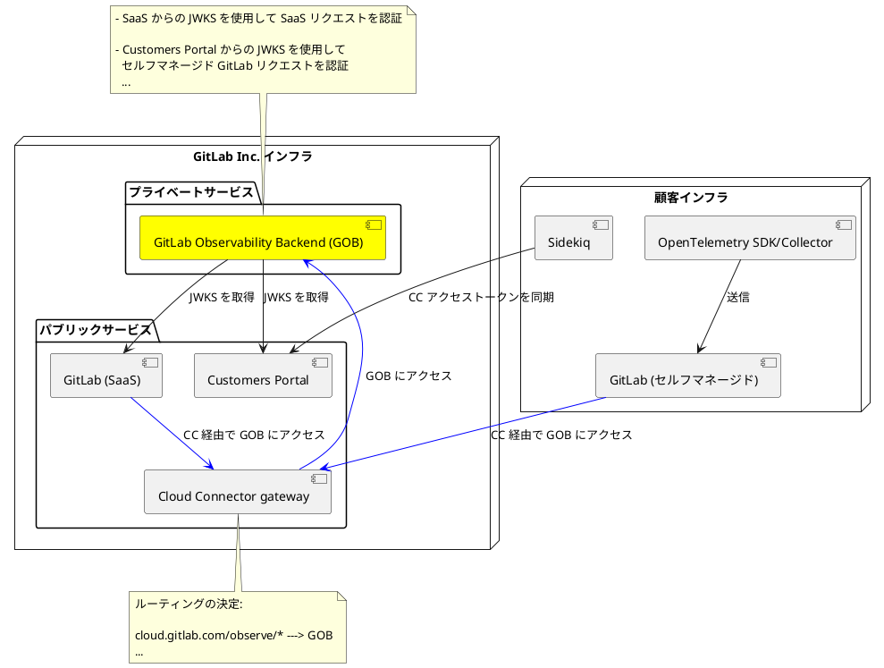
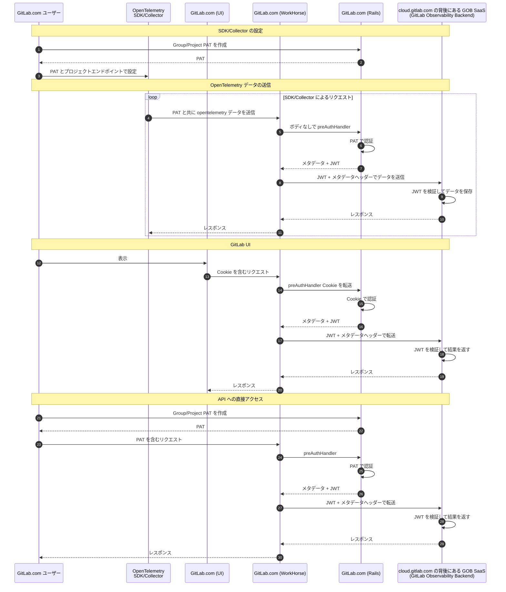
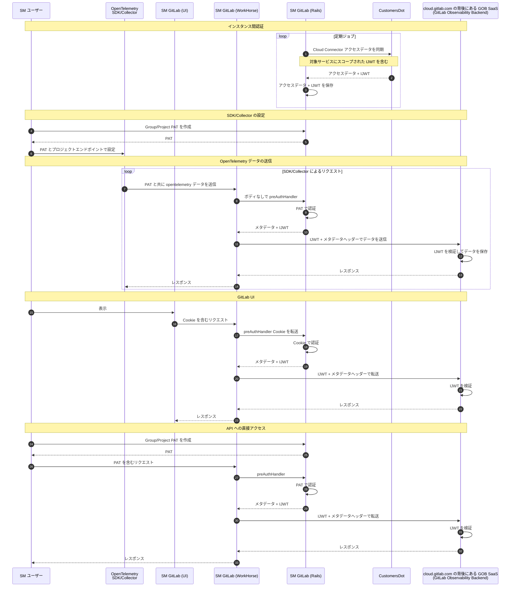

このページには今後予定されている製品・機能・機能性に関する情報が含まれています。ここに示す情報は参考目的のみです。購入・計画の決定にこの情報を使用しないでください。製品・機能・機能性の開発、リリース、タイミングは変更または延期される可能性があり、GitLab Inc. の独自の判断に委ねられています。

<table class="w-full text-sm border-collapse">
<thead>
<tr class="bg-gray-100 text-left">
<th class="px-3 py-2 border border-gray-300">Status</th>
<th class="px-3 py-2 border border-gray-300">Authors</th>
<th class="px-3 py-2 border border-gray-300">Coach</th>
<th class="px-3 py-2 border border-gray-300">DRIs</th>
<th class="px-3 py-2 border border-gray-300">Owning Stage</th>
<th class="px-3 py-2 border border-gray-300">Created</th>
</tr>
</thead>
<tbody>
<tr>
<td class="px-3 py-2 border border-gray-300">ongoing</td>
<td class="px-3 py-2 border border-gray-300"><a href="https://gitlab.com/mappelman" class="text-blue-600 hover:underline">@mappelman</a></td>
<td class="px-3 py-2 border border-gray-300"></td>
<td class="px-3 py-2 border border-gray-300"><a href="https://gitlab.com/sguyn" class="text-blue-600 hover:underline">@sguyn</a>, <a href="https://gitlab.com/nklick" class="text-blue-600 hover:underline">@nklick</a>, <a href="https://gitlab.com/mkaeppler" class="text-blue-600 hover:underline">@mkaeppler</a></td>
<td class="px-3 py-2 border border-gray-300">~devops::monitor</td>
<td class="px-3 py-2 border border-gray-300">2023-09-11</td>
</tr>
</tbody>
</table>

## 概要

GitLab のオブザーバビリティは[Cloud Connector を通じてセルフマネージドインスタンスで最初に利用可能になります](https://gitlab.com/groups/gitlab-org/opstrace/-/epics/95)。これにより、セルフマネージドユーザーはオブザーバビリティプラットフォームを管理する必要なく、GitLab Observability を活用できます。このドキュメントではそのアーキテクチャを説明します。

Cloud Connector を通じてセルフマネージドインスタンスで GitLab オブザーバビリティを利用可能にすることに加えて、GitLab.com で利用可能な GitLab オブザーバビリティも Cloud Connector を活用するようにアーキテクチャを再調整します。

以下のアーキテクチャ概要は、セルフマネージドの GitLab インスタンスと .com の GitLab インスタンスの両方に適用できます。

## 目標

- **セルフマネージドユーザーがスケーラブルで信頼性の高いオブザーバビリティシステムを管理する必要なく、シームレスなオブザーバビリティ機能を提供する。**
- **オブザーバビリティ API を GitLab の[プロジェクトリソース API](https://docs.gitlab.com/ee/api/api_resources.html#project-resources) に移す。**
- **.com とセルフマネージド GitLab 間で API の一貫性を維持する。**

## アーキテクチャ

GitLab Observability Backend（GOB）のデプロイは GitLab Inc. のインフラの一部として GitLab Inc. によって管理されます。GitLab.com とすべてのセルフマネージド GitLab インスタンスは、当初は現在存在する同じ GOB バックエンドを使用します。ただし、将来的にはリージョナルな GOB インスタンスや、必要に応じて顧客固有の GOB インスタンスをデプロイし、リクエストを目的の GOB インスタンスにルーティングすることもできます。

青い矢印は、GitLab SaaS とセルフマネージド GitLab インスタンスの両方から GOB へのリクエストパスを示しています。すべてのリクエストは[Cloud Connector Gateway](../cloud_connector/)パブリックサービスを通過し、プライベート GOB サービスに到達します。GitLab SaaS セルはすべてパブリック Cloud Connector Gateway にアクセスできます。

[Cloud Connector Gateway は単一エントリポイントのロードバランサーになります](../cloud_connector/authentication/decisions/auth_001_lb_entry_point.md)。

詳細なリクエストアーキテクチャは次のセクションで説明します。

## オブザーバビリティリクエストのウォークスルー

以下の2つの図は、GitLab.com の顧客とセルフマネージド GitLab の顧客のリクエストフローを示しています。
2つの間には小さな違いがあります:

1. GitLab.com リクエストで GOB に送信される JWT は Rails で作成されますが、セルフマネージドフローの JWT（IJWT とも呼ばれる）は CustomersDot から発行されます。
1. GitLab.com フローには CustomersDot JWT の同期がありません。

### GitLab.com で提供されるオブザーバビリティ

### セルフマネージド GitLab で提供されるオブザーバビリティ

## パフォーマンス

オブザーバビリティリクエストのボディが Rails/Puma に負荷をかけないようにすることが非常に重要です。Workhorse のすべての preAuthHandler は、ボディが Rails に転送されないことを確認し、認証が成功した場合にのみ GOB に転送します。

GitLab.com のオブザーバビリティに関する日々のデータ送受信を考慮し、それを同様の要求を持つ可能性のあるセルフマネージドの顧客に外挿すると、Workhorse と Cloud Connector を通過するデータ量の見当がつきます。GitLab.com は 1 億 5000 万以上のアクティブメトリクスシリーズを 30〜60 秒ごとにサンプリングし、1 日あたり 18〜22 TB のログを生成しています。

GitLab.com 上またはセルフマネージドインスタンス上の Ultimate ティアのルートレベルネームスペースが、同様の規模のデータを `cloud.GitLab.com` を通じて送信する可能性があると仮定できます。

リクエスト/秒とバイト/秒の観点からこれが何に相当するかを把握するために、次の基本的な例を見てみましょう。

**前提条件**:

- 圧縮: [オブザーバビリティデータタイプの圧縮率を示すこのチャートを使用](https://github.com/open-telemetry/opentelemetry-collector/blob/main/config/configgrpc/README.md#compression-comparison)
- メトリクスの例は生データで 396 バイトで、上記の圧縮テーブルの `md_metric_request` に変換されます:
  - `{__name__="cluster:namespace:pod_cpu:active:kube_pod_container_resource_limits", cluster="play-db-cluster", container="k6-grpc", instance="10.4.3.6:8080", job="integrations/Kubernetes/kube-state-metrics", namespace="play-backends", node="gke-raintank-dev-pla-raintank-dev-pla-3cd3aafc-hijt", pod="k6-grpc-5c74969fdc-6n2bn", resource="cpu", uid="56e073b7-ca28-4cf4-b3da-83dc97763bef", unit="core"}`
- トレースのボリュームはログのボリュームを容易に超えることがあり、各スパンにはログ行に見られるものと同様のコンテキストが添付されています。トレーシングはデバッグロギングに近いため、全体のボリュームを合理的なレベルに削減するためにサンプリングが使用されます。議論のため、サンプリング後のトレースボリュームはロギングボリュームと等しいと仮定します。
- 圧縮率については、`md_log_request`、`md_trace_request`、`md_metric_request` を想定

単一の大規模な Ultimate ティア組織（GitLab.com またはセルフマネージド経由）:

- **メトリクスボリューム**: 30 秒ごとにサンプリングされる 1 億 5000 万のアクティブメトリクスシリーズ
  - サンプル/秒 = 1 億 5000 万 / 30 = 500 万
  - バイト/秒 = 500 万 × 396B / 2.21 圧縮率 = 896MB/s

- **ログボリューム**: 18TB/日
  - バイト/秒（非圧縮）= 18e+12 / ( 24 × 60 × 60 ) = 208MB/s
  - バイト/秒（圧縮）= 208 / 1.35 圧縮率 = 154Mb/s

- **トレースボリューム**: 上記の前提条件から、ログボリュームと同じと仮定
  - バイト/秒（圧縮）= 208 / 1.57 圧縮率 = 132Mb/s

これを上限の前提条件として扱うと、Ultimate ティアの顧客からのデータインジェストの合計最大需要は 896 + 154 + 132 = 1.2GB/s になります。
データインジェストの需要は常にオブザーバビリティデータの読み返しより桁違いに高いため、この概算のためには読み取り負荷を無視できます。

1.2GB/s を提供する平均リクエスト/秒を考慮することも役立ちます。これにより、Rails に対する preAuthHandler リクエストの数を推測できます。

OpenTelemetry バッチプロセッサーは、設定可能なサイズのバッチでメトリクス、ログ、トレースを送信する推奨の方法です。デフォルトのバッチサイズは 8192 イベントです。
OpenTelemetry 圧縮比較の `md_log_request`、`md_trace_request`、`md_metric_request` の平均圧縮サイズと、上記で説明したメトリクス、ログ、トレースのボリュームを取り、デフォルトのバッチサイズを使用して平均リクエスト/秒を計算できます。

- **メトリクス req/s:**
  - 896MB/秒 / イベントあたり 145 圧縮バイト = 620 万イベント/秒
  - 620 万イベント/秒 / バッチあたり 8192 イベント = 760 req/s

- **ログ req/s:**
  - 154MB/秒 / イベントあたり 268 圧縮バイト = 57 万イベント/秒
  - 57 万イベント/秒 / バッチあたり 8192 イベント = 70 req/s

- **トレース req/s:**
  - 132MB/秒 / イベントあたり 288 圧縮バイト = 46 万イベント/秒
  - 46 万イベント/秒 / バッチあたり 8192 イベント = 56 req/s

デフォルトのバッチング使用時の合計リクエスト/秒は **1 億 5000 万のアクティブメトリクスシリーズ、18TB の日次ログ、18TB の日次トレースを持つ各大規模顧客あたり 890 リクエスト/秒** です。

### GitLab.com のオブザーバビリティ

この規模の GitLab.com の各顧客に対して、1.2GB/s の Workhorse への需要が発生します。

パフォーマンスと GitLab サービスの可用性を最大化するために、最近のコードサジェスチョン向けの追加と同様に、オブザーバビリティ専用の Web フリートを作成するべきです。`/api/v4/projects/:id/observability/` から始まるすべての受信リクエストパスは、.com の専用オブザーバビリティ Web フリートにルーティングできます。
これにより、オブザーバビリティリクエストがメインの GitLab Web フリートを飽和させるリスクが軽減され、需要に基づいてオブザーバビリティフリートを水平方向に自動スケーリングできます。

### セルフマネージドのオブザーバビリティ

この規模のデータに対するセルフマネージド Workhorse のスループットは 1.2GB/s になります。セルフマネージドの顧客は、リファレンスアーキテクチャドキュメントで適切な設定にアクセスできます。

## 認証と認可

リクエストフローで説明したように、GOB とのやり取りには2つの主要なリクエストレグがあります。

1. ユーザー/クライアントから GitLab インスタンスへ
1. GitLab インスタンスから GOB へ

すべてのレグ 1 リクエストでは、Workhorse の preAuthorizeHandler を活用して認証と認可が実施されます。このハンドラーは内部 Rails API を呼び出して、提供された PAT またはブラウザの Cookie を使用して認証と認可の両方を実行します。内部 Rails API はまず Workhorse/Rails JWT と共有署名シークレットを使用してリクエストを認証し、Workhorse によって発行されたことを確認します。成功した場合、エンドポイントは提供された PAT/ブラウザ Cookie に対して適切な認証チェックを実行します。成功した場合、Rails は Workhorse と websocket 認証データの類似した方法で、Workhorse がGOB に送信する必要のあるすべてのヘッダー（IJWT（インスタンスがセルフマネージドの場合）とメタデータを含む）を含むレスポンスを Workhorse に返します。

Workhorse は IJWT（セルフマネージド）または Workhorse JWT（SaaS）のいずれかを使用してリクエストを GOB に転送します。GOB はリクエストを認証するために JWT を検証します。

Rails と Workhorse の両方が同じシークレットを使用して JWT に署名するため、`https://gitlab.com/.well-known/openid-configuration` にある `jwks_uri` から利用可能な JWKS を使用して、Rails または Workhorse から作成された JWT の ID を検証できます。これにより GOB へのリクエストも Rails から送信できます。IJWT については、[JWKS はこれに従って取得できます](https://gitlab.com/gitlab-org/customers-gitlab-com/-/blob/d877b173ebe6a614d41ef34d9e2a6a0fe93dac07/doc/architecture/add_ons/code_suggestions/authorization_for_self_managed.md#L74-145)。

## 有効化

セルフマネージドユーザーは Customers Portal を通じて Cloud Connected GitLab Observability の使用を有効化します。関連するすべてのライセンスとサブスクリプション情報は IJWT にエンコードされ、Workhorse、Rails、GOB がアクセスを管理し、制限とクォータを実施するために使用します。

## レート制限とクォータ管理

GitLab Observability Backend にはすでに、サービス拒否攻撃を防ぐための API ゲートウェイでのレート制限があります。

これらの既存のレート制限に加えて、他の GitLab API がレート制限を管理する慣用的な方法と同様に、Workhorse/Rails にもレート制限を追加します。これにより、ダウンストリームサービスへの呼び出し前にエッジでの DOS 攻撃を軽減し、エッジでレート制限が確実に実施されるようにします。

GitLab Observability のクォータ管理は GOB で実施されます。GOB は顧客のライセンスに応じて、各トップレベルネームスペースのコンピュートクォータを設定します。さらに、ストレージを追跡し、新しいデータのスペースを確保するために古いデータを削除することで、顧客のライセンスに基づいて適切にストレージクォータを実施し、各トップレベルネームスペースのストレージが常に上限以下に保たれるようにします。
最終的に、このクォータ管理はトップレベルネームスペースではなく GitLab Organization 構成にマッピングされます。

GOB サービスのレート制限とクォータ管理が正しく実施されるよう、GOB は IJWT トークンを使用して顧客ライセンスに関する関連情報を抽出します。また、GOB がリクエストを処理し、クォータと制限を実施するために必要な追加情報を提供するメタデータヘッダーも、Workhorse から GOB へのリクエストレグの一部として送信されます。

## API

すべてのオブザーバビリティ API は Workhorse を経由してプロキシされ、GitLab の[プロジェクトリソース](https://docs.gitlab.com/ee/api/api_resources.html#project-resources)の下に配置されます。
HTTP は最初にサポートされ、gRPC は後日追加されます。

## システムモニタリング

GitLab Observability Backend にはすでに GitLab の集中メトリクスおよびロギングシステムに接続するシステムモニタリングが備わっています。ユーザー向け API の可視性とアラートを提供するために、Workhorse と Rails にも追加のメトリクスが取得されます。
