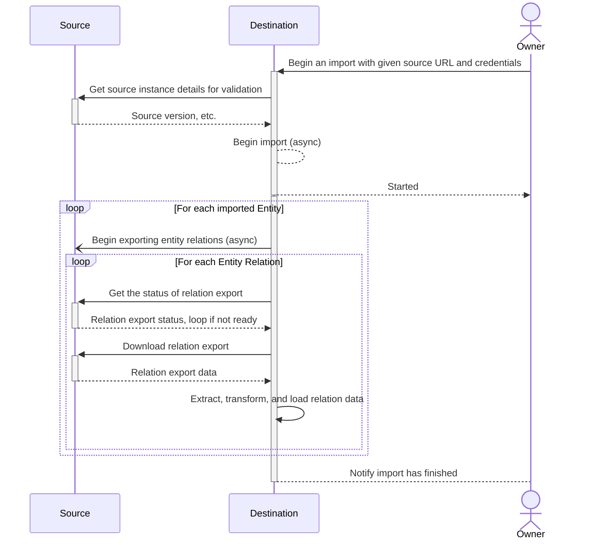
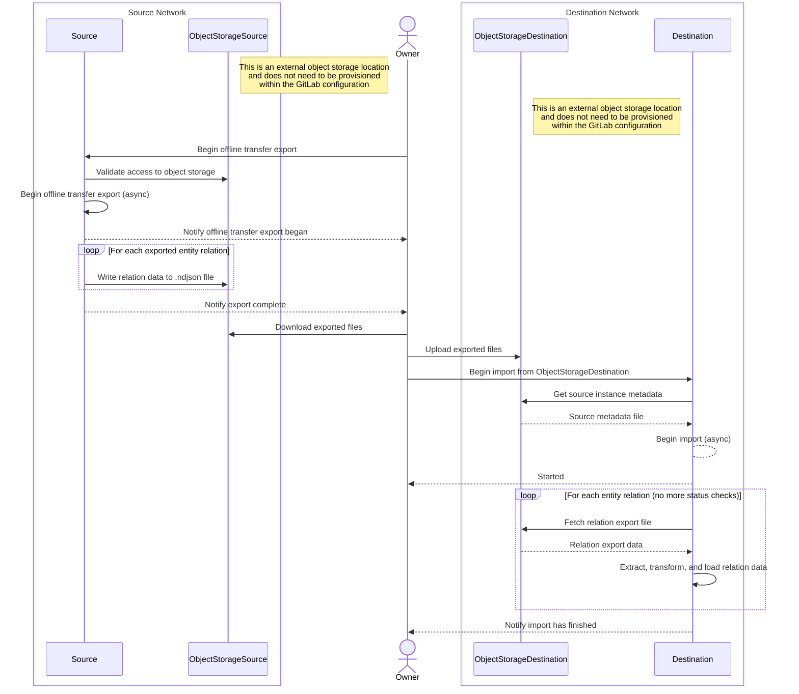
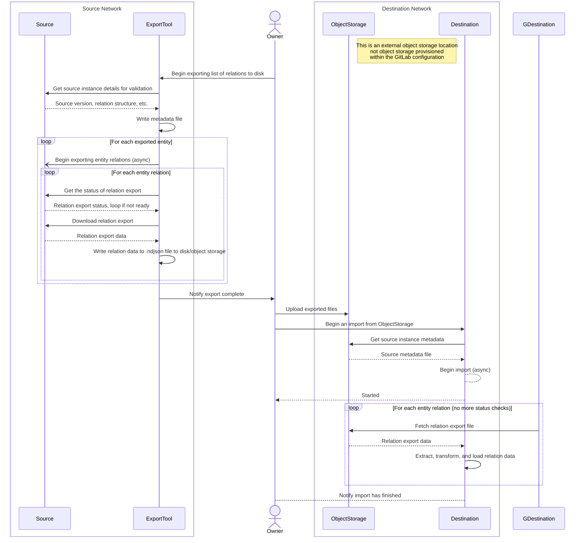
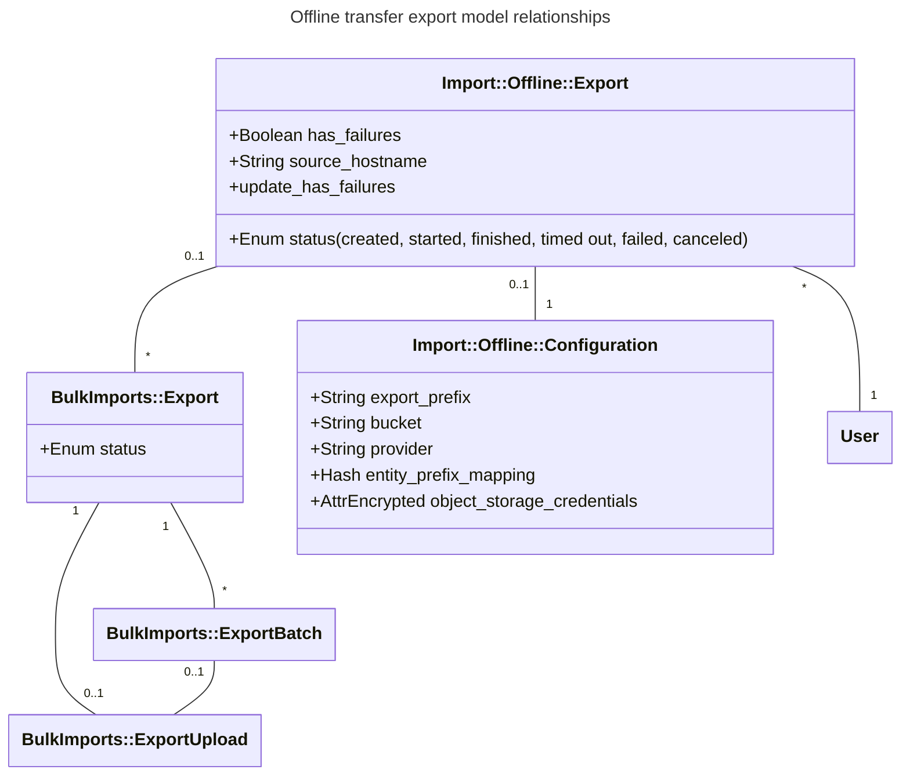

---
# This is the title of your design document. Keep it short, simple, and descriptive. A
# good title can help communicate what the design document is and should be considered
# as part of any review.
title: オフライン転送
status: proposed
creation-date: "2025-02-26"
authors: [ "@SamWord" ]
coaches: []
dris: [ "@SamWord" ]
owning-stage: "~devops::create"
participating-stages: []
# Hides this page in the left sidebar. Recommended so we don't pollute it.
toc_hide: true
upstream_path: "/handbook/engineering/architecture/design-documents/offline_direct_transfer_migrations/"
upstream_sha: "1e195b58b9f249ff10bd0e705106c320fee86141"
translated_at: "2026-05-14T00:00:00Z"
translator: claude
stale: false
---

<!-- Design Documents often contain forward-looking statements -->
<!-- vale gitlab.FutureTense = NO -->

<!-- This renders the design document header on the detail page, so don't remove it-->


<!--
Don't add a h1 headline. It'll be added automatically from the title front matter attribute.

For long pages, consider creating a table of contents.
-->

## サマリー

このブループリントは、ダイレクト転送に対する変更について説明します。新しいツール「オフライン転送」を構築し、ネットワーク接続なしで GitLab インスタンスからデータをエクスポートして、別のインスタンスにインポートできるようにします。

現在、ダイレクト転送は移行プロセス全体を通じて、ソースと宛先の GitLab インスタンス間のネットワーク接続を必要とします。この変更により、隔離された GitLab インスタンスで GitLab データをエクスポートし、手動で移動して、両端のネットワークポリシーに関係なく宛先インスタンスにインポートできるようになります。この変更はまた、それを活用できる人向けにダイレクト転送移行の機能性と効率性も維持します。

## 現在のステータス

18.1 のチーム再編成により、Import グループの優先事項は当面の間この機能から離れてシフトしました。しかし、これまでにこのトピックについて重要な協力があり、この提案をさらに洗練するためにいくつかの Issue が派生しています:

- GitLab プロジェクト内のオフライン転送エクスポートアーキテクチャの決定: https://gitlab.com/gitlab-org/gitlab/-/issues/536631
- オフライン転送でユーザー貢献マッピングをどのように実装するかの決定: https://gitlab.com/gitlab-org/gitlab/-/issues/545824

チームの優先事項がシフトする前のすべての議論については、この提案を実装した次のマージリクエストを参照して、この提案が中断された場所の全コンテキストを確認してください: https://gitlab.com/gitlab-com/content-sites/handbook/-/merge_requests/12056

これらのトピックが提案で対処された後、承認されれば、この提案を実装するために必要な作業を表す Issue を最終化できます。すでに作成された Issue には、ラベル `~"offline transfer:import"` または `~"offline transfer:export"` が付いています。

## 用語集

過去には、インポーター内で使用される用語について混乱がありました。一部の用語の意味を明確にするための用語集を以下に示します:

- **エアギャップネットワーク**: 公共インターネットから隔離されたネットワーク。詳細については、[オフライン GitLab ドキュメント](https://docs.gitlab.com/topics/offline/) を参照してください。オフライン転送の目的では、ソースと宛先の両方のインスタンスが 100% エアギャップであり、ソースと宛先のインスタンス間に接続を確立できないと想定する必要があります。しかし、この機能を使用するために顧客がエアギャップネットワーク上にある必要はありません。
- **宛先 (Destination):** グループまたはプロジェクトデータがインポートされるインスタンス。
- **エンティティ (Entity):** グループまたはプロジェクト。エンティティには、マイルストーン、ラベル、Issue、マージリクエストなど、多くのリレーションがあります。
- **エンティティ接頭辞 (Entity prefix)**: オブジェクトストレージ内で非常に長いファイルキーを避けるためのエンティティパスの置換文字列。
- **オフライン転送 (Offline transfer)**: 提案された機能の名前。これは、宛先インスタンスが通常のダイレクト転送を実行するためにソースに HTTP リクエストを行うことができない、GitLab インスタンス間の移行です。
- **リレーション (Relation):** 通常、エンティティに属するモデルなどのリソース。リレーションには、マイルストーン、ラベル、Issue、マージリクエストなどが含まれます。リレーションはまた、self relation (エンティティ自体の属性)、またはユーザー貢献などのより抽象的な概念にもなり得ます。
- **ソース (Source)**: グループまたはプロジェクトデータがエクスポートされるソースインスタンス。

## 動機

GitLab インスタンス間にネットワーク接続がない、または厳格なネットワークポリシーを持つ顧客は、ダイレクト転送を使用できません。これらの顧客はファイルベースのインポート/エクスポートを使用して、各グループを手動でエクスポートおよびインポートする必要があります。これは退屈なプロセスであり、[ファイルベースのグループ転送は非推奨](https://docs.gitlab.com/user/project/settings/import_export/#migrate-groups-by-uploading-an-export-file-deprecated) です。

### 目標

この機能により、以下の制限を持つ顧客が便利で半自動の移行を実行できるようになります:

- ネットワーク外への、またはネットワーク外からのアクセスが許可されていない
- ファイアウォールシステムに IP を迅速かつ容易に追加できない
- ネットワークに接続できる外部マシン上に存在するものに厳格な制限がある (この特定の VPN、ウイルス対策などを持つ必要がある)

#### 追加要件

- ユーザーは、ダイレクト転送 API を使用して、グループとプロジェクトをオブジェクトストレージの場所にエクスポートし、オブジェクトストレージの場所からグループとプロジェクトをインポートできるべきです。これは、UI の前に、最初に利用可能になるべきです。
- ユーザーは、UI を使用して移行したいグループとプロジェクトを選択できるべきです。これは、ダイレクト転送が一度に多くのグループとプロジェクトの移行をサポートする必要があることを意味します。
  - サブグループとプロジェクトを転送できるべきです。
- プロセスは完全に自動化することはできませんが、簡単で便利であるべきです。
- 最も厳格なセキュリティ要件 ("データはネットワークを離れることができない") を持つ顧客をサポートする必要があります。
- オプションの暗号化をサポートします。
- 組織のデータポリシーなどにより、サードパーティのオブジェクトストレージを使用できない顧客向けにオフライン転送をサポートします。

### 非目標

- 継続的な同期: ダイレクト転送は 1 回限りの移行をサポートしますが、ソースが変更されるたびに差分を同期することはサポートしません。これは顧客が要求したもう 1 つの機会ですが、このアーキテクチャの焦点ではありません。この作業はそれを妨げるべきではありませんが、この機能はスコープ外です。
- バックアップ/リストア: オフライン転送は「エクスポート」ファイルと考えられるものを作成しますが、これはデータバックアップソリューションでも、その他の災害復旧の形式でもありません。

### あれば便利

- 古いインスタンスのワークアラウンド: GitLab の古いバージョンはサポートされませんが、ワークアラウンドが可能な場合があります。詳細については、[互換性のある GitLab バージョン](#compatible-gitlab-versions) を参照してください。ダイレクト転送へのすべての変更と同様に、可能な場合は古いバージョンを考慮する必要があります。
- インポータープラットフォームのサポート: これは要件ではありませんが、アイデアとして議論されたものです。ダイレクト転送のインポート側が以前にエクスポートされたデータをサポートする必要があるようになったので、これは、エクスポートされたデータが特定のデータスキーマに適合する限り、任意のソースからのインポートを許可する機会です。この提案に基づいてこの機会を開くことは理想的ですが、複雑さがよりシンプルなオプションと比較して大幅に増加するという要件ではありません。

## 提案

オフライン転送では、ダイレクト転送のエクスポートとインポート側が 2 つの順次ステップに分離されます。エンティティをファイルにエクスポートし、それらのファイルを別のインスタンスにインポートします。ユーザーは、ソースがエクスポートで直接アップロードできない場合、ファイルを手動で外部オブジェクトストレージプロバイダーに移動できます。オフライン転送は、エンティティを同時にインポートおよびエクスポートするオンライン移行と同じ効率の恩恵を受けることはできませんが、それらが可能になります。

ダイレクト転送アーキテクチャに基づいてオフライン転送を構築することは、[ファイルエクスポートを使用した移行](https://docs.gitlab.com/user/project/settings/import_export/) に依存するよりもユーザーにより多くの価値を提供します。なぜなら、ファイルベースのグループのインポートとエクスポートは:

- 非推奨であり、ダイレクト転送ほど多くのグループ項目を移行することはできません。
- 一度に複数のグループとプロジェクトの一括移行をサポートしておらず、大きなグループまたはプロジェクトの転送はあまりスケールしません。ダイレクト転送アーキテクチャを適応させることで、スケーラビリティ、信頼性が向上し、よりスムーズな移行体験のためにより多くのデータが移行されます。
- プレースホルダーユーザーを使用した [ユーザー貢献マッピング](https://docs.gitlab.com/development/user_contribution_mapping/) をサポートしておらず、これは強化されたセキュリティを提供し、移行前のユーザー管理を必要としません。

**注意:** このドキュメントで指定されているモデル名、クラス名、ファイル名、および境界コンテキストは、実装中に変更される可能性があります。しかし、実装は `Import` 境界コンテキストを使用し、命名規則の一貫性を維持するよう努めるべきです。オフライン転送はダイレクト転送に非常に似ているため、実装は可能な場合、すでにダイレクト転送で使用されている命名パターンにも従うべきです。

### 提案されたユーザーフロー

1. ソースインスタンスのユーザーは、オフライン転送エクスポート API エンドポイントを呼び出して、グループとプロジェクトをオブジェクトストレージの場所にエクスポートします。
1. グループとプロジェクトは、提供されたオブジェクトストレージの場所へのエクスポートを開始します。ユーザーは、別の API エンドポイントを使用してエクスポートのステータスを確認できます。
1. エクスポートが完了したことをユーザーはメールで通知されます。
1. オブジェクトストレージの場所が宛先インスタンスからアクセスできない場合、ユーザーはエクスポートファイルを宛先がアクセスできる別のオブジェクトストレージの場所に移動します。このステップはオフライン転送によって自動化できず、組織のデータセキュリティポリシーに従ってユーザーによる手動のデータ転送が必要な場合があります。
1. 宛先で、ユーザーはアクセス可能なオブジェクトストレージの設定と認証情報を提供することで、API エンドポイント経由でオフライン転送インポートを開始します。彼らはまた、ソース上のエンティティへのパスのリスト、宛先名と名前空間も提供します。これは、API 経由でダイレクト転送を開始するのとまったく同じです。API パラメータで渡されるエンティティのすべてのエンティティリレーションファイルは、提供されたオブジェクトストレージバケットに存在する必要があり、インポートが開始される前にメタデータファイルでそれらのフルソースパスがマッピングされている必要があります。しかし、バケット内のすべてのエンティティをインポートする必要はありません。ディスクストレージを使用するユーザーは、エクスポートデータを各 Sidekiq ノードに対してローカルで利用可能にするための代替方法 (おそらくネットワークストレージ) が必要で、これはまだエクスポートされたファイルのためにローカルディスクを参照する API 呼び出しで決定されていません。
1. 一括インポートは、ソースインスタンスへの接続の代わりにオブジェクトストレージバケットを使用して処理を開始します。残りのユーザーフローは、オンラインのダイレクト転送移行と同じです。

**注意:** 外部オブジェクトストレージプロバイダーを使用できないユーザーのフローはまだ定義されていません。最初のイテレーションでは、焦点は AWS S3 互換オブジェクトストレージバケットへのインポートとエクスポートの実装にあります。詳細については、[ストレージプロバイダー](#storage-providers) を参照してください。

#### 現在のダイレクト転送プロセス

この図はダイレクト転送を大幅に簡略化していますが、ソースと宛先のインスタンスがネットワークリクエストを介してどれほど頻繁に通信するかを示しています。すべてのエンティティがリレーションファイルをダウンロードするわけではなく、一部はソースに対して GraphQL クエリまたは REST リクエストを代わりに行います。エンティティとそのリレーションは、オンライン移行で各ステージ内で同時に処理できます ([グループステージ](https://gitlab.com/gitlab-org/gitlab/-/blob/master/lib/bulk_imports/groups/stage.rb)、[プロジェクトステージ](https://gitlab.com/gitlab-org/gitlab/-/blob/master/lib/bulk_imports/projects/stage.rb))。



#### 提案されたオフライン転送プロセス

これも同様に簡略化されていますが、エクスポートとインポートのプロセスが分割され、どちらのインスタンスへのリクエストも不要であることを示しています。ソースと宛先の両方が同じオブジェクトストレージにアクセスできる場合、ユーザーはエクスポートデータを別のオブジェクトストレージの場所に手動で移動する必要はありません。しかし、オフライン転送は現在、同じ場所からエクスポートおよびインポートしている場合でも、エクスポートとインポートのプロセスを並列化することを意図していません。



### 互換性のある GitLab バージョン

**最小宛先バージョン**

オフライン転送インポートがサポートされる最も早い GitLab バージョン。

**最小ソースバージョン**

オフライン転送エクスポートがサポートされる最も早い GitLab バージョン。以前のバージョンとの互換性は、[Congregate](https://gitlab-org.gitlab.io/professional-services-automation/tools/migration/congregate/project_readme/) または外部スクリプトなどのエクスポートツールを使用して達成できる可能性がありますが、Import チームによって公式にはサポートされません。

このアーキテクチャのスコープ外ですが、Congregate は宛先インスタンスからの API 呼び出しの役割を置き換える、GitLab の以前のバージョンのエクスポートオーケストレーターとして機能するために更新できる可能性があります。Congregate またはその他のエクスポートツールを使用してオフラインエクスポートをオーケストレートする潜在的なフローは次のようになります:



## 設計と実装の詳細

### 新しいインポートアーキテクチャ

#### オフライン API 設計

データがソースインスタンスからエクスポートされたら、ユーザーはエクスポートされたデータを含むオブジェクトストレージインスタンスの認証情報を入力できるようになります。

- S3 設定からダウンロードする `BulkImports::FileDownloadService` と同様の、一括インポート用の新しいファイルダウンロードサービスを作成します。ファイルサイズ、タイプなどのリモートファイルに対する検証は、このサービスで実行できます。これらのサービスは、リレーションファイルを取得する作業をパイプライン自体から抽象化します。
- ユーザーが宛先でオフラインインポートを開始すると、次のパラメータで新しい API エンドポイントを呼び出してオフラインエクスポートを開始します:

  ```ruby
  # These params may change depending on object storage implementation
  requires :configuration, type: Hash, desc: 'Object storage configuration' do
    requires :access_key_id, type: String, desc: 'Object storage access key ID'
    requires :secret_access_key, type: String, desc: 'Object storage secret access key'
    requires :bucket_name, type: String, desc: 'Object storage bucket name where all files are stored'
  end
  requires :entities, type: Array, desc: 'List of entities to import' do
    requires :source_type,
    type: String,
    desc: 'Source entity type',
    values: %w[group_entity project_entity]
    requires :source_full_path,
    type: String,
    desc: 'Relative path of the source entity to import'
    requires :destination_namespace,
    type: String,
    desc: 'Destination namespace for the entity'
    optional :destination_slug,
    type: String,
    desc: 'Destination slug for the entity'
    optional :migrate_projects,
    type: Boolean,
    default: true,
    desc: 'Indicates group migration should include nested projects'
    optional :migrate_memberships,
    type: Boolean,
    default: true,
    desc: 'The option to migrate memberships or not'
  end
  ```

この新しい API の主な違いは、このエンドポイントがソースインスタンス設定の代わりにオブジェクトストレージバケットのパラメータを受け入れることです。これはまた、`BulkImports::CreateService` と大幅に異なる場合、オフラインインポート用の `BulkImport` レコードを作成するための新しいサービスを呼び出す可能性があります。

#### インポートメタデータファイル構造

オフライン転送は、エンティティソースパスをオブジェクトストレージ内のファイルキーにマッピングするためにメタデータファイルが必要です。オブジェクトストレージは常にフラット構造であり、ディスクストレージは常にネストされた構造であるため、エンティティをリンクする方法に関する情報を持つフラットなオブジェクトストレージを選ぶのが最も良いようです。

メタデータファイルには次の情報が含まれます:

- `instance_version`: ソースインスタンスのバージョン。
- `instance_enterprise`: ソースインスタンスがエンタープライズエディションだったかどうか。
- `export_prefix`: 現在のエクスポートに含まれるすべてのファイルの接頭辞。これにより、同じエンティティの複数のエクスポートが同時にオブジェクトストレージに存在できるようになります。
- `source_hostname`: ユーザーによって指定されたソースホスト名。
- `entities_mapping`: エンティティフルパスをキーとし、そのオブジェクトストレージエンティティ接頭辞をハッシュとして持つ。これにより、過度に長いオブジェクトストレージキーを避けるためにフルパスが短いキーに短縮されます。これは、エンティティがインポートされる順序やエンティティの階層には影響しません。エンティティ接頭辞はエンティティタイプとその ID (たとえば、`project_52` または `group_28`) です。

メタデータファイルの例:

```json
{
  "instance_version":"17.0.0",
  "instance_enterprise":true,
  "export_prefix":"export_2025-09-18_1hrwkrv",
  "source_hostname":"https://offline-environment-gitlab.example.com",
  "entities_mapping":
  {
    "top_level_group":"group_1",
    "top_level_group/group":"group_2",
    "top_level_group/group/first_project":"project_1",
    "top_level_group/group/second_project":"project_2",
    "top_level_group/another_group":"group_3"
  }
}
```

オブジェクトストレージファイルキーは、リレーションタイプとバッチでエクスポートされたかどうかに依存します。一般的な形式は `#{export_prefix}/#{entity_prefix}/#{relation_name}.#{extension}` で、リレーション名は `group/import_export.yml` と `project/import_export.yml` で定義されます。

例:

- `group_1/self.json` - `self` リレーション (JSON 形式)
- `group_1/milestones.ndjson` - tree リレーション、単一ファイル
- `project_1/issues/batch_1.ndjson` - tree リレーション、バッチ
- `project_1/repository.tar.gz` - アーカイブリレーション、単一ファイル
- `project_1/uploads/batch_1.tar.gz` - アーカイブリレーション、バッチ

#### オフライン転送とダイレクト転送でのユーザー貢献のインポート

`user_contributions` リレーションエクスポートファイルはダイレクト転送で実装されましたが、ダイレクト転送のインポートプロセスでは完全には使用されませんでした。このファイルは、ソースインスタンスへの API 呼び出しを行って不足しているソースユーザー属性を取得できないため、オフライン転送で必要になります。これは、ユーザー貢献データの取得がダイレクト転送とオフライン転送間で著しく異なることを意味します:

- `user_contributions` リレーションは、ダイレクト転送のエクスポートでは完全にスキップできます。
- `user_contributions` の新しいパイプラインがオフライン転送のために実装される必要があり、オフライン転送インポートでのみ実行する必要があります。
- `user_contributions.ndjson` からインポートする前にソースユーザーが作成されない限り、`SourceUsersAttributesWorker` はオフラインエクスポートでまったくエンキューする必要はありません。その場合、ワーカーはソースへの API 呼び出しを行う代わりに `user_contributions.ndjson` を参照する新しいサービスを実行する必要があります。

### エクスポートアーキテクチャ

#### 現在のエクスポートの制限

ダイレクト転送では、宛先インスタンスがエクスポートされているリレーションのステータスを定期的にクエリします。リレーションエクスポートがいつ完了し、宛先インスタンスがアクセスできるオブジェクトストレージの場所に転送する準備ができたかを判断するエクスポート側のプロセスはありません。エクスポートの進捗を追跡できるように、ユーザーがエクスポートの完了時に通知され、エクスポートエラーがよりよく追跡できるように、GitLab 内で新しいモデルを作成する必要があります。

#### 新しいオフライン転送モデルとリレーションシップ

2 つの新しいモデルを導入します:

- `Import::Offline::Export`
- `Import::Offline::Configuration`

`Import::Offline::Export` は、関連するすべての `BulkImports::Export` レコードを接続し、全体的なエクスポートステータスを判断します。`Import::Offline::Export` は、`metadata.json` に書き込まれるエクスポートメタデータをコンパイルするための信頼できる情報源としても機能します。

`Import::Offline::Configuration` は、オブジェクトストレージの認証情報と、`source_full_path` を `object_storage_file_prefix` に結びつけるマッピングのハッシュを格納します。これらのマッピングはメタデータファイルに保存されます。

`BulkImports::Export` と `BulkImports::ExportBatch` はオフラインエクスポートに引き続き使用されますが、`BulkImports::ExportUpload` レコードは作成されません。代わりに、圧縮されたエクスポートファイルは、`Import::Offline::Configuration` で設定されたオブジェクトストレージの場所に直接アップロードされます。



#### バックエンドエクスポートプロセス

リレーションをエクスポートするプロセスは、ダイレクト転送のエクスポートプロセスとほぼ同じです。しかし、ソースインスタンス上の新しいワーカーが、宛先インスタンスの代わりにエンティティのエクスポートをオーケストレートします:

1. ユーザーはオブジェクトストレージの認証情報、設定、エクスポートするエンティティのリストを使用して API エンドポイントを呼び出します。
1. API エンドポイントは、新しいサービス `Import::Offline::Export::CreateService` を実行して、`Import::Offline::Export` を作成します。
1. `Import::Offline::Export::CreateService` は、設定、エンティティに対するユーザーの権限、オブジェクトストレージプロバイダーへのアクセスを検証します。いずれかが無効な場合、ユーザーにエラーが返されます。
1. 検証に合格すると、`Import::Offline::Export::CreateService` は新しい `Import::Offline::Export` を作成します。新しい非同期ワーカー `Import::Offline::ExportWorker` を使用してエクスポートを開始し、成功メッセージをユーザーに返します。この新しいワーカーは、`BulkImportWorker` と同様に機能します。
1. `Import::Offline::ExportWorker` は、新しいサービス `Import::Offline::Export::ProcessService` を実行し、提供された各エンティティに対して `BulkImports::ExportService` を実行します。このワーカーは、エクスポートがまだ処理中の場合、自身を遅延付きで再エンキューします。
1. `BulkImports::Export` が作成され、ダイレクト転送のようにエクスポートされます。しかし、エクスポートファイルは、`BulkImports::ExportUpload` オブジェクトを作成する代わりに、設定されたオブジェクトストレージに書き込まれます。
1. エクスポートが完了すると、`Import::Offline::Export::ProcessService` は、`Import::Offline::Export` 属性、その `BulkImports::Export`、インスタンスメタデータ、`Import::Offline::Configuration` に基づいて `metadata.json` を書き込みます。`metadata.json` ファイルを書き込むには、新しいサービスが最良のアプローチかもしれません。
1. `Import::Offline::Export::ProcessService` は、`Import::Offline::Export` のステータスを `complete` に設定し、エクスポートしたユーザーに通知メールを送信します。

オフラインエクスポートプロセスは、予期せず失敗またはタイムアウトしたエクスポートのキャンセルと停止をサポートしています。ダイレクト転送には、これらのアクションのための確立されたパターンがあり、可能な場合は一貫性のためにそれに従う必要があります:

- ユーザーがオフライン転送エクスポートをキャンセルした場合、新しいリレーションエクスポートは開始しないでください。
- `BulkImport` レコードと同様に、24 時間以上更新されていない `Import::Offline::Export` レコードは古いと見なされ、クリーンアップされます。既存の `BulkImports::StaleImportWorker` を再利用してこれらのレコードをクリーンアップすることが可能かもしれません。
- 失敗する `BulkImport::Export` は、`Import::Offline::Export` 全体を自動的に失敗させるべきではありません。代わりに、`Import::Offline::Export` レコードで `has_failures` を `true` に設定する必要があります。`Import::Offline::Export` は、エクスポートされたすべてのリレーションが失敗した場合のみ `failed` と見なされます。

#### ストレージプロバイダー

オフライン転送は当初 AWS S3 をアップロードターゲットとしてサポートします。理由は次のとおりです:

- AWS S3 は十分に文書化され、広く採用されています。
- [MinIO](https://www.min.io/) のようなオープンソースのセルフホストオプションは同じインターフェースに互換性があり、最小の追加労力でそれらをサポートできるようにします。
- GitLab の [オブジェクトストレージ](https://docs.gitlab.com/administration/object_storage/) はすでに AWS S3 をサポートしているため、追加のライブラリは必要ありません。

私たちは主にオブジェクトストレージとのやり取りに [Fog](https://github.com/fog/fog) を使用しており、これは複数のクラウドプロバイダーのシンプルなインターフェースを提供することを目指しているため、GCP や他のプロバイダーをサポートする、またはローカルストレージをサポートするオーバーヘッドは減ります。Fog が適切でない場合、他のクライアントを使用できます。

ローカルストレージがどのように実装されるかの詳細は未定です。

### ユーザー貢献マッピング

[ユーザー貢献とメンバーシップマッピング](https://docs.gitlab.com/user/project/import/#user-contribution-and-membership-mapping) は、ソースホスト名に依存して実際のユーザーをプレースホルダーユーザーにマッピングします。現在のインポートプロセスでは、ソースホスト名は、グループとプロジェクトをインポートするために使用されるインポート URL のホストです。各インポーターは、インポートを完了するためにソースホストに対して繰り返し、成功した API 呼び出しを行う必要があります。しかし、オフライン転送はソースインスタンスに直接接触しないため、オンライン転送では懸念事項ではないユーザー貢献マッピングに固有の課題が生じます:

- 宛先インスタンスがソースインスタンスに直接接触しないため、エクスポートデータの出所を確実に判断することは不可能です。さらに、データは悪意を持って操作される可能性があります。
- 1 つのオブジェクトストレージの場所には、複数のホストからのデータが含まれている可能性があります。
- 不正確または曖昧なホスト名では、再割り当てされたユーザーが受け入れている可能性のある貢献に自信を持つことができず、悪用の機会が生まれます。
- ユーザー貢献マッピングではホスト名が必要で、空白にすることはできません。セキュリティまたはプライバシーの理由でソースホスト名を公開したくないユーザーは、ホスト名のエイリアスを選択する必要があります。

**提案された解決策:**

これらの課題を考えると、オフライン転送エクスポートを生成する際、エクスポートするユーザーはソースホスト名を提供する必要があります。便宜上、それは `metadata.json` に書き込まれるので、インポートするユーザーはそれを再指定する必要はありません。エクスポート UI は、実装する時が来たら、これがユーザーがプレースホルダーユーザー再割り当てを受け入れるときに宛先で表示されるホスト名であることをユーザーに警告する必要があります。後続のインポートで異なるホスト名を使用すると、ユーザーは 2 回プレースホルダー再割り当てを受け入れる必要があります。

さらに、ユーザー貢献を受け入れるメールは、ソースホスト名がユーザーによって手動で入力されたものであり、信頼すべきでないという警告を表示するように更新する必要があります。それはまた、インポートタイプがオフライン転送であったことを明示的にユーザーに伝える必要があります。これにより、悪意あるユーザーは、ソースホスト名が `https://github.com` のような信頼されたドメインに手動で設定されたオフライン転送から、ユーザーに再割り当てリクエストを送信できなくなります。

**潜在的なユーザーマッピングの強化:**

- オフライン転送移行が `source_hostname` をプレーン文字列として設定することを許可して、ソースインスタンスのホスト名を公開したくないユーザーが任意のエイリアスを使用できるようにします。
- 理想的には、個々のユーザーは、誰が自分に再割り当てリクエストを送信できるかを制限する (たとえば、特定のユーザーまたは信頼されたグループのオーナー) または完全にオプトアウトすることができるべきです。
- GitLab.com からのオフラインエクスポートでは、ホスト名を `https://gitlab.com` に設定し、UI でユーザーが編集できないようにします。ユーザーは常にエクスポートファイルを手動で編集できますが、通常のユーザーに少しの利便性と一貫性を提供できます。
- ソースホスト名の所有権を検証し、未検証のホストからのプレースホルダーユーザー再割り当てを防ぐメカニズムを実装します。これは実装が不可能な場合があります。

## イテレーション

**最初のリリースステップ:**

- メタデータとエクスポートファイル構造を定義し、文書化する。
- ソースでオフラインエクスポートを開始する API サポート付きで、グループとプロジェクトをオブジェクトストレージにエクスポートするために必要なコンポーネントを構築する。
- 現在ソースインスタンスへの API 呼び出しを使用して宛先にインポートされているデータを、オフライン転送でサポートされるようにファイルエクスポートに変換する。
- ファイル発見とメタデータ定義に従ってインポート側を更新する作業を開始する。オフライン転送インポートはオフライン転送エクスポートと並行して開発できますが、リレーション全体の一貫性を確保するために注意が必要です。

**最初のリリース後のイテレーション:**

- ユーザーエクスペリエンスを向上させるために、GitLab でグループをオフラインでエクスポートする UI を構築する。
- エクスポートアップロード場所の柔軟性を実装する。理論的には、宛先インスタンスがアクセスでき、ストレージ場所への接続が安全である限り、エクスポートファイルをどこから取得するかは重要ではありません。可能なサポートには次が含まれます:
  - AWS S3 以外のオブジェクトストレージプロバイダー
  - ネットワークストレージ (セルフマネージドのみ)
  - ローカルディスクストレージ (セルフマネージドのみ)
