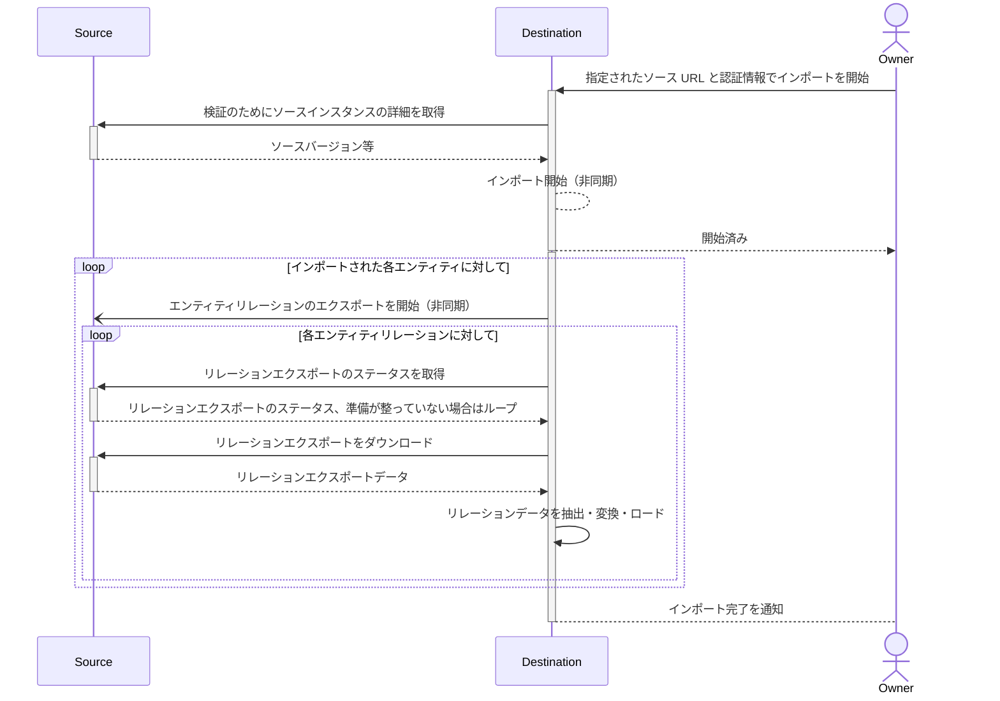
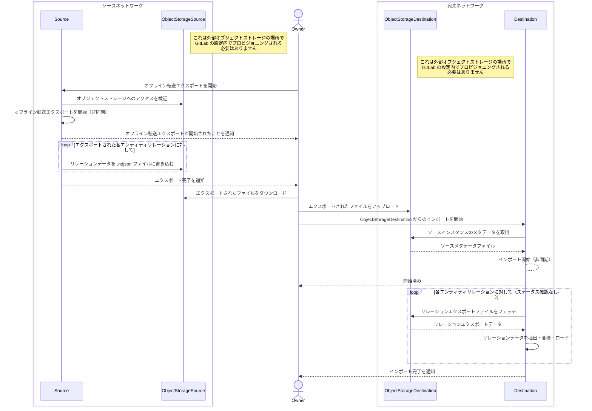
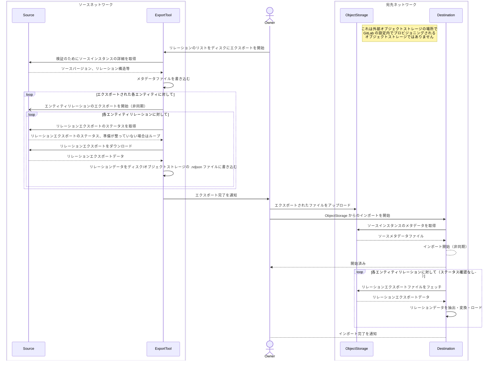
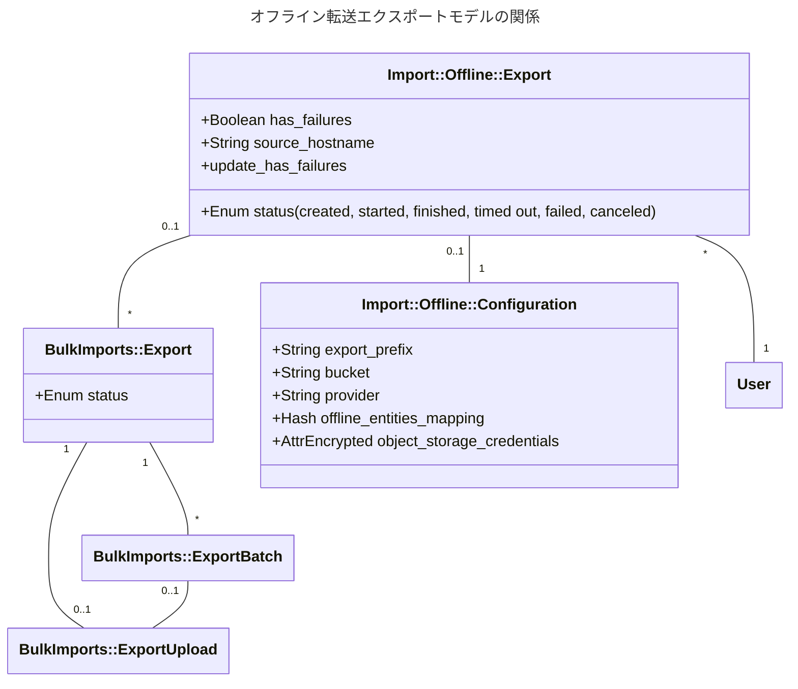

<!-- Design Documents often contain forward-looking statements -->
<!-- vale gitlab.FutureTense = NO -->

<!-- This renders the design document header on the detail page, so don't remove it-->

<div class="my-3 border-l-4 border-blue-500 bg-blue-50 px-4 py-3 rounded-r text-sm text-blue-800">
このページには今後予定されている製品・機能・機能性に関する情報が含まれています。ここに示す情報は参考目的のみです。購入・計画の決定にこの情報を使用しないでください。製品・機能・機能性の開発、リリース、タイミングは変更または延期される可能性があり、GitLab Inc. の独自の判断に委ねられています。
</div>

<div class="overflow-x-auto my-4">
<table class="w-full text-sm border-collapse">
<thead>
<tr class="bg-gray-100 text-left">
<th class="px-3 py-2 border border-gray-300">Status</th>
<th class="px-3 py-2 border border-gray-300">Authors</th>
<th class="px-3 py-2 border border-gray-300">Coach</th>
<th class="px-3 py-2 border border-gray-300">DRIs</th>
<th class="px-3 py-2 border border-gray-300">Owning Stage</th>
<th class="px-3 py-2 border border-gray-300">Created</th>
</tr>
</thead>
<tbody>
<tr>
<td class="px-3 py-2 border border-gray-300"><span class="inline-block rounded px-2 py-0.5 text-xs font-medium bg-gray-100 text-gray-700">proposed</span></td>
<td class="px-3 py-2 border border-gray-300"><a href="https://gitlab.com/SamWord" class="text-blue-600 hover:underline">@SamWord</a></td>
<td class="px-3 py-2 border border-gray-300"></td>
<td class="px-3 py-2 border border-gray-300"><a href="https://gitlab.com/SamWord" class="text-blue-600 hover:underline">@SamWord</a></td>
<td class="px-3 py-2 border border-gray-300"><span class="inline-block rounded px-2 py-0.5 text-xs font-medium bg-gray-100 text-gray-700">~devops::create</span></td>
<td class="px-3 py-2 border border-gray-300">2025-02-26</td>
</tr>
</tbody>
</table>
</div>


## 概要

このブループリントは、ダイレクト転送の変更について説明しています。新しいツール「オフライン転送」を構築するもので、GitLab インスタンス間のデータのエクスポートとインポートを、インスタンス間のネットワーク接続なしに行えるようにします。

現在、ダイレクト転送は移行プロセス全体を通じてソースと宛先の GitLab インスタンス間のネットワーク接続を必要とします。この変更により、孤立した GitLab インスタンスで GitLab データをエクスポートし、どちらのエンドのネットワークポリシーに関わらず、手動で移動して宛先インスタンスにインポートできるようになります。この変更は、ダイレクト転送移行の機能と効率性を活用できる人々のためにも維持されます。

## 現在の状況

18.1 でのチームの再編成により、Import グループの優先事項がしばらくの間この機能から離れています。ただし、これまでのところこのトピックに関する大幅なコラボレーションがあり、この提案をさらに洗練させるためのいくつかの Issue を生んでいます:

- GitLab プロジェクト内でのオフライン転送のエクスポートアーキテクチャを決定する: https://gitlab.com/gitlab-org/gitlab/-/issues/536631
- オフライン転送でのユーザー貢献マッピングの実装方法を決定する: https://gitlab.com/gitlab-org/gitlab/-/issues/545824

この提案を実装したマージリクエストを参照してください。チームの優先事項が変わる前のすべての議論の完全なコンテキストについて: https://gitlab.com/gitlab-com/content-sites/handbook/-/merge_requests/12056

これらのトピックが提案で対処された後、承認された場合、この提案を実装するために必要な作業を表す Issue を確定できます。すでに作成された Issue には `~"offline transfer:import"` または `~"offline transfer:export"` のラベルが付いています。

## 用語集

過去に、インポーターで使用される用語に関して混乱がありました。いくつかの用語の意味を明確にするための用語集です:

- **エアギャップネットワーク**: パブリックインターネットから隔離されたネットワーク。詳細については [オフライン GitLab ドキュメント](https://docs.gitlab.com/topics/offline/) を参照してください。オフライン転送の目的では、ソースと宛先インスタンスの両方が 100% エアギャップされており、ソースと宛先インスタンス間の接続が確立できないと仮定するべきです。ただし、この機能を使用するためにエアギャップネットワーク上にある必要はありません。
- **宛先**: グループまたはプロジェクトデータがインポートされるインスタンス。
- **エンティティ**: グループまたはプロジェクト。エンティティにはマイルストーン、ラベル、Issue、マージリクエストなど多数のリレーションがあります。
- **エンティティプレフィックス**: オブジェクトストレージ内のファイルキーが非常に長くなることを避けるために、エンティティパスの置換文字列。
- **オフライン転送**: 提案された機能の名前。これは GitLab インスタンス間の移行で、宛先インスタンスがソースへの HTTP リクエストを行えない場合のものです。
- **リレーション**: エンティティに属するリソース、一般的にモデル。リレーションにはマイルストーン、ラベル、Issue、マージリクエストなどがあります。リレーションはセルフリレーション（エンティティ自体の属性）や、ユーザー貢献などのより抽象的な概念でもあります。
- **ソース**: グループまたはプロジェクトデータがエクスポートされるソースインスタンス。

## 動機

GitLab インスタンス間のネットワーク接続がない顧客や厳格なネットワークポリシーを持つ顧客は、ダイレクト転送を使用できません。これらの顧客は、ファイルベースのインポート/エクスポートを使用して各グループを手動でエクスポート・インポートする必要があります。これは面倒なプロセスで、[ファイルベースのグループ転送は廃止されています](https://docs.gitlab.com/user/project/settings/import_export/#migrate-groups-by-uploading-an-export-file-deprecated)。

### 目標

この機能は、以下の制限を持つ顧客が便利な半自動化された移行を行えるようにするべきです:

- ネットワークへの外部アクセスまたはネットワークからの外部アクセスが禁止されている
- ファイアウォールシステムに IP を素早く簡単に追加できない
- ネットワークに接続できる外部マシン上に存在するものに厳格な制限がある（この特定の VPN、アンチウイルス等が必要）

#### 追加要件

- ユーザーはダイレクト転送 API を使用してグループとプロジェクトをオブジェクトストレージの場所にエクスポートし、オブジェクトストレージの場所からグループとプロジェクトをインポートできるべきです。これは UI の前に最初に利用可能にする必要があります。
- ユーザーは UI を使用して移行したいグループとプロジェクトを選択できるべきです。つまり、ダイレクト転送は一度に多くのグループとプロジェクトの移行をサポートするべきです。
  - サブグループとプロジェクトの転送が可能であるべきです。
- プロセスを完全に自動化することはできませんが、簡単で便利なものであるべきです。
- 「データがネットワークを離れてはならない」という最も厳格なセキュリティ要件を持つ顧客をサポートする必要があります。
- オプションの暗号化をサポートする。
- 組織のデータポリシー等によりサードパーティのオブジェクトストレージを使用できない顧客のためのオフライン転送をサポートする。

### 非目標

- 継続的な同期: ダイレクト転送は一度限りの移行をサポートするべきですが、ソースが変更されるにつれてdiffを同期することはサポートしません。これは顧客から要望されている別の機会ですが、このアーキテクチャの焦点ではありません。この作業はそれを妨げないようにするべきですが、この機能はスコープ外です。
- バックアップ/リストア: オフライン転送は「エクスポート」ファイルを作成しますが、これはデータバックアップソリューションや他の形式のディザスターリカバリーではありません。

### Nice-to-haves

- 古いインスタンスへの回避策: 古いバージョンの GitLab はサポートされませんが、回避策が可能かもしれません。詳細については [互換性のある GitLab バージョン](#互換性のある-gitlab-バージョン) を参照してください。ダイレクト転送へのすべての変更と同様に、可能な限り古いバージョンを考慮する必要があります。
- インポータープラットフォームのサポート: これは要件ではありませんが、アイデアとして浮上しています。ダイレクト転送のインポート側が以前にエクスポートされたデータをサポートする必要があるようになったため、エクスポートされたデータが特定のデータスキーマに適合している限り、あらゆるソースからのインポートを許可する機会があります。この機会をこの提案に基づいて開くことは理想的ですが、よりシンプルなオプションと比較して複雑さが大幅に増加するため、要件ではありません。

## 提案

オフライン転送では、ダイレクト転送のエクスポートとインポート側は2つの順次的なステップに分離されます: エンティティをファイルにエクスポートし、そのファイルを別のインスタンスにインポートします。ソースがエクスポート時にファイルを直接アップロードできない場合、ユーザーはファイルを外部のオブジェクトストレージプロバイダーに手動で移動できます。オフライン転送はエンティティのエクスポートとインポートを同時並行で行うオンライン移行と同じ効率性のメリットは得られませんが、これを可能にします。

ダイレクト転送アーキテクチャに基づいてオフライン転送を構築することで、[ファイルエクスポートを使用した移行](https://docs.gitlab.com/user/project/settings/import_export/)に頼るよりも多くの価値をユーザーに提供できます。ファイルベースのグループインポートとエクスポートは:

- 廃止されており、ダイレクト転送と同じ数のグループ項目の移行をサポートしていません。
- 複数のグループとプロジェクトの一括移行をサポートせず、大規模なグループやプロジェクトの転送はうまくスケールしません。ダイレクト転送アーキテクチャを適応させることで、より円滑な移行体験のためのスケーラビリティ、信頼性の向上と、より多くのデータの移行が提供されます。
- プレースホルダーユーザーを使用した[ユーザー貢献マッピング](https://docs.gitlab.com/development/user_contribution_mapping/)をサポートせず、強化されたセキュリティを提供し、移行前にユーザー管理を必要としません。

**注意:** このドキュメントで指定されているモデル名、クラス名、ファイル名、バウンデッドコンテキストは実装中に変更される場合があります。ただし、実装は `Import` バウンデッドコンテキストを使用し、命名規則の一貫性を維持するよう努めるべきです。オフライン転送はダイレクト転送と非常に似ているため、可能な場合はダイレクト転送ですでに使用されている命名パターンにも従うべきです。

### 提案されたユーザーフロー

1. ソースインスタンスのユーザーがオフライン転送エクスポート API エンドポイントを呼び出して、グループとプロジェクトをオブジェクトストレージの場所にエクスポートします。
1. グループとプロジェクトが提供されたオブジェクトストレージの場所へのエクスポートを開始します。ユーザーは別の API エンドポイントを使用してエクスポートのステータスを確認できます。
1. ユーザーにエクスポートが完了したことをメールで通知します。
1. オブジェクトストレージの場所が宛先インスタンスからアクセスできない場合、ユーザーはエクスポートファイルを宛先からアクセスできる別のオブジェクトストレージの場所に移動します。このステップはオフライン転送では自動化できず、組織のデータセキュリティポリシーに従ってユーザーによる手動のデータ転送が必要かもしれません。
1. 宛先で、ユーザーがアクセス可能なオブジェクトストレージの設定と認証情報を提供することで、API エンドポイントを通じてオフライン転送のインポートを開始します。また、ソース上のエンティティへのパスのリストと、API 経由でダイレクト転送を開始するのとまったく同様に宛先名とネームスペースも提供します。API パラメーターで渡されたエンティティのすべてのエンティティリレーションファイルは、提供されたオブジェクトストレージバケットに存在しなければならず、インポートが始まる前にメタデータファイルでその完全なソースパスがマッピングされている必要があります。ただし、バケット内のすべてのエンティティをインポートする必要はありません。ディスクストレージを使用するユーザーは、エクスポートデータを各 Sidekiq ノードにローカルで利用可能にするための代替手段（おそらくネットワークストレージ）が必要になります。これはエクスポートされたファイルのローカルディスクを参照するための API 呼び出しで決定される必要があります。
1. バルクインポートは、ソースインスタンスへの接続の代わりにオブジェクトストレージバケットを使用して処理を開始します。残りのユーザーフローはオンラインのダイレクト転送移行と同じになります。

**注意:** 外部オブジェクトストレージプロバイダーを使用できないユーザーのフローはまだ定義されていません。最初のイテレーションでは、AWS S3 互換のオブジェクトストレージバケットへのインポートの実装に焦点を当てます。詳細については [ストレージプロバイダー](#ストレージプロバイダー) を参照してください。

#### 現在のダイレクト転送プロセス

この図はダイレクト転送を大幅に簡略化していますが、ソースと宛先インスタンスがネットワークリクエストを通じてどれだけ頻繁に通信するかを示しています。すべてのエンティティがリレーションファイルをダウンロードするわけではなく、一部はソースへの GraphQL クエリや REST リクエストを行います。エンティティとそのリレーションは、オンライン移行の各ステージ内で同時並行で処理できます（[グループステージ](https://gitlab.com/gitlab-org/gitlab/-/blob/master/lib/bulk_imports/groups/stage.rb)、[プロジェクトステージ](https://gitlab.com/gitlab-org/gitlab/-/blob/master/lib/bulk_imports/projects/stage.rb)）。



#### 提案されたオフライン転送プロセス

これも同様に簡略化されていますが、エクスポートとインポートのプロセスが分割されており、どちらのインスタンスへのリクエストも不要であることを示しています。ソースと宛先の両方が同じオブジェクトストレージにアクセスできる場合、ユーザーはエクスポートデータを別のオブジェクトストレージの場所に手動で移動する必要はありません。ただし、オフライン転送は同じ場所からエクスポートとインポートを行う場合でも、エクスポートとインポートのプロセスを並列化することは現在意図されていません。



### 互換性のある GitLab バージョン

**最小宛先バージョン**

オフライン転送インポートがサポートされる最も早い GitLab バージョン。

**最小ソースバージョン**

オフライン転送エクスポートがサポートされる最も早い GitLab バージョン。以前のバージョンとの互換性は [Congregate](https://gitlab-org.gitlab.io/professional-services-automation/tools/migration/congregate/project_readme/) や外部スクリプトなどのエクスポートツールを通じて実現できる可能性がありますが、Import チームによる正式なサポートはありません。

このアーキテクチャのスコープ外ですが、Congregate を以前のバージョンの GitLab のエクスポートオーケストレーターとして機能するよう更新し、宛先インスタンスからの API 呼び出しの役割を置き換えることが可能です。オフラインエクスポートをオーケストレートするために Congregate や他のエクスポートツールを使用する潜在的なフローは次のようになります:



## 設計と実装の詳細

### 新しいインポートアーキテクチャ

#### オフライン API 設計

ソースインスタンスからデータがエクスポートされると、ユーザーはエクスポートされたデータを含むオブジェクトストレージインスタンスの認証情報を入力できます。

- `BulkImports::FileDownloadService` に似た S3 設定からダウンロードするバルクインポート用の新しいファイルダウンロードサービスを作成します。ファイルサイズ、タイプなどのリモートファイルの検証はこのサービスで行えます。これらのサービスは、パイプライン自体からリレーションファイルをフェッチする作業を抽象化します。
- ユーザーが宛先でオフラインインポートを開始する際、次のパラメーターでオフラインエクスポートを開始する新しい API エンドポイントをクエリします:

  ```ruby
  # これらのパラメーターはオブジェクトストレージの実装によって変わる可能性があります
  requires :configuration, type: Hash, desc: 'オブジェクトストレージ設定' do
    requires :access_key_id, type: String, desc: 'オブジェクトストレージアクセスキー ID'
    requires :secret_access_key, type: String, desc: 'オブジェクトストレージシークレットアクセスキー'
    requires :bucket_name, type: String, desc: 'すべてのファイルが格納されているオブジェクトストレージバケット名'
  end
  requires :entities, type: Array, desc: 'インポートするエンティティのリスト' do
    requires :source_type,
    type: String,
    desc: 'ソースエンティティタイプ',
    values: %w[group_entity project_entity]
    requires :source_full_path,
    type: String,
    desc: 'インポートするソースエンティティの相対パス'
    requires :destination_namespace,
    type: String,
    desc: 'エンティティの宛先ネームスペース'
    optional :destination_slug,
    type: String,
    desc: 'エンティティの宛先スラッグ'
    optional :migrate_projects,
    type: Boolean,
    default: true,
    desc: 'グループ移行にネストされたプロジェクトを含めるかどうかを示す'
    optional :migrate_memberships,
    type: Boolean,
    default: true,
    desc: 'メンバーシップを移行するかどうかのオプション'
  end
  ```

この新しい API の主な違いは、ソースインスタンスの設定の代わりにオブジェクトストレージバケットのパラメーターを受け入れることです。また、オフラインインポートの `BulkImport` レコードの作成を処理するために、`BulkImports::CreateService` と大幅に異なる場合は新しいサービスを呼び出す可能性があります。

#### インポートメタデータファイル構造

オフライン転送では、エンティティのソースパスをオブジェクトストレージのファイルキーにマッピングするためのメタデータファイルが必要です。オブジェクトストレージは常にフラット構造で、ディスクストレージは常にネストされた構造であるため、エンティティをリンクする方法に関する情報を持つフラットなオブジェクトストレージを選択することが最善のようです。

メタデータファイルには次の情報が含まれます:

- `instance_version`: ソースインスタンスのバージョン。
- `instance_enterprise`: ソースインスタンスがエンタープライズエディションであるかどうか。
- `export_prefix`: 現在のエクスポートに含まれるすべてのファイルのプレフィックス。これにより、同じエンティティの複数のエクスポートが同時にオブジェクトストレージに存在できます。
- `source_hostname`: ユーザーが指定したソースホスト名。
- `entities_mapping`: エンティティのフルパスをキーとしてオブジェクトストレージのエンティティプレフィックスにマッピングするハッシュ。これにより、フルパスを短いキーに短縮してオブジェクトストレージのキーが過度に長くなるのを避けます。エンティティのインポート順序やエンティティの階層には影響しません。エンティティプレフィックスはエンティティタイプとその ID です（例: `project_52` や `group_28`）。

メタデータファイルの例:

```json
{
  "instance_version":"17.0.0",
  "instance_enterprise":true,
  "export_prefix":"export_2025-09-18_1hrwkrv",
  "source_hostname":"https://offline-environment-gitlab.example.com",
  "entities_mapping":
  {
    "top_level_group":"group_1",
    "top_level_group/group":"group_2",
    "top_level_group/group/first_project":"project_1",
    "top_level_group/group/second_project":"project_2",
    "top_level_group/another_group":"group_3"
  }
}
```

オブジェクトストレージのファイルキーは、リレーションタイプとバッチでエクスポートされたかどうかによって異なります。一般的な形式は `#{export_prefix}/#{entity_prefix}/#{relation_name}.#{extension}` で、リレーション名は `group/import_export.yml` と `project/import_export.yml` で定義されています。

例:

- `group_1/self.json` - `self` リレーション（JSON 形式）
- `group_1/milestones.ndjson` - ツリーリレーション、単一ファイル
- `project_1/issues/batch_1.ndjson` - ツリーリレーション、バッチ
- `project_1/repository.tar.gz` - アーカイブリレーション、単一ファイル
- `project_1/uploads/batch_1.tar.gz` - アーカイブリレーション、バッチ

#### オフライン転送とダイレクト転送でのユーザー貢献のインポート

`user_contributions` リレーションエクスポートファイルはダイレクト転送で実装されましたが、ダイレクト転送のインポートプロセスでは完全には使用されていませんでした。このファイルはオフライン転送では必要です。ソースインスタンスへの API 呼び出しを行って欠落しているソースユーザー属性を取得できないためです。つまり、ユーザー貢献データのフェッチはダイレクト転送とオフライン転送で著しく異なります:

- `user_contributions` リレーションはダイレクト転送のエクスポートでは完全にスキップできます。
- `user_contributions` の新しいパイプラインをオフライン転送のために実装する必要があり、オフライン転送のインポートでのみ実行するべきです。
- `SourceUsersAttributesWorker` はオフラインエクスポートではまったくエンキューする必要はありません。ただし、`user_contributions.ndjson` からインポートする前にソースユーザーが作成される場合は除きます。その場合、ワーカーはソースへの API 呼び出しを行う代わりに `user_contributions.ndjson` を参照する新しいサービスを実行する必要があります。

### エクスポートアーキテクチャ

#### 現在のエクスポートの制限

ダイレクト転送では、宛先インスタンスがリレーションのエクスポートステータスを定期的にクエリします。リレーションのエクスポートがいつ完了して宛先インスタンスがアクセスできるオブジェクトストレージの場所に転送する準備ができているかを決定するエクスポート側のプロセスがありません。エクスポートの進捗を追跡し、エクスポートが完了したときにユーザーに通知し、エクスポートエラーをより適切に追跡できるよう GitLab 内に新しいモデルを作成する必要があります。

#### 新しいオフライン転送モデルと関係

2つの新しいモデルを導入します:

- `Import::Offline::Export`
- `Import::Offline::Configuration`

`Import::Offline::Export` は関連するすべての `BulkImports::Export` レコードを接続し、全体的なエクスポートステータスを決定します。`Import::Offline::Export` は `metadata.json` に書き込まれるエクスポートメタデータをコンパイルするための情報源としても機能します。

`Import::Offline::Configuration` はオブジェクトストレージの認証情報と、`source_full_path` を `object_storage_file_prefix` に結び付けるマッピングのハッシュを格納します。これらのマッピングはメタデータファイルに格納されます。

`BulkImports::Export` と `BulkImports::ExportBatch` はオフラインエクスポートに引き続き使用されますが、`BulkImports::ExportUpload` レコードは作成されません。代わりに、圧縮されたエクスポートファイルは `Import::Offline::Configuration` で設定されたオブジェクトストレージの場所に直接アップロードされます。



#### バックエンドのエクスポートプロセス

リレーションのエクスポートプロセスは、ダイレクト転送のエクスポートプロセスとほぼ同一になります。ただし、宛先インスタンスの代わりにソースインスタンス上の新しいワーカーがエンティティのエクスポートをオーケストレートします:

1. ユーザーがオブジェクトストレージの認証情報、設定、エクスポートするエンティティのリストを含む API エンドポイントを呼び出します。
1. API エンドポイントが新しいサービス `Import::Offline::Export::CreateService` を実行して `Import::Offline::Export` を作成します。
1. `Import::Offline::Export::CreateService` が設定、エンティティに対するユーザーの権限、オブジェクトストレージプロバイダーへのアクセスを検証します。いずれかが無効な場合、エラーがユーザーに返されます。
1. 検証が通ると、`Import::Offline::Export::CreateService` は新しい `Import::Offline::Export` を作成します。新しい非同期ワーカー `Import::Offline::ExportWorker` を使用してエクスポートを開始し、成功メッセージをユーザーに返します。この新しいワーカーは `BulkImportWorker` と同様に機能します。
1. `Import::Offline::ExportWorker` は新しいサービス `Import::Offline::Export::ProcessService` を実行し、提供された各エンティティに対して `BulkImports::ExportService` を実行します。このワーカーはエクスポートがまだ処理中の間、遅延をつけて自分自身を再エンキューします。
1. `BulkImports::Export` が作成されてダイレクト転送と同様にエクスポートされます。ただし、エクスポートファイルは `BulkImports::ExportUpload` オブジェクトを作成する代わりに、設定されたオブジェクトストレージに書き込まれます。
1. エクスポートが完了すると、`Import::Offline::Export::ProcessService` が `Import::Offline::Export` の属性、その `BulkImports::Export`、インスタンスメタデータ、`Import::Offline::Configuration` に基づいて `metadata.json` を書き込みます。`metadata.json` ファイルの書き込みには新しいサービスが最善のアプローチかもしれません。
1. `Import::Offline::Export::ProcessService` が `Import::Offline::Export` のステータスを `complete` に設定し、エクスポートしたユーザーに通知メールを送信します。

オフラインエクスポートプロセスは、予期せず失敗またはタイムアウトしたエクスポートのキャンセルと停止をサポートします。ダイレクト転送にはこれらのアクションに対して確立されたパターンがあり、可能な限り一貫性を保つためにそれらに従うべきです:

- ユーザーがオフライン転送エクスポートをキャンセルすると、新しいリレーションエクスポートは開始しないようにすべきです。
- `BulkImport` レコードと同様に、24 時間以上更新されていない `Import::Offline::Export` レコードは古くなっていると見なされてクリーンアップされます。これらのレコードをクリーンアップするために既存の `BulkImports::StaleImportWorker` を再利用できるかもしれません。
- `BulkImport::Export` の失敗は `Import::Offline::Export` 全体を自動的に失敗させるべきではありません。代わりに、`Import::Offline::Export` レコードに `has_failures` を `true` に設定するべきです。`Import::Offline::Export` はエクスポートされたすべてのリレーションが失敗した場合にのみ `failed` と見なされます。

#### ストレージプロバイダー

オフライン転送は当初 AWS S3 をアップロードターゲットとしてサポートします。理由は:

- AWS S3 はよくドキュメント化されており広く採用されています。
- [MinIO](https://www.min.io/) などのオープンソースのセルフホスト型オプションは同じインターフェースと互換性があり、最小限の追加作業でサポートできます。
- GitLab の[オブジェクトストレージ](https://docs.gitlab.com/administration/object_storage/)はすでに AWS S3 をサポートしているため、追加のライブラリは不要です。

複数のクラウドプロバイダーに対してシンプルなインターフェースを提供することを目的とした [Fog](https://github.com/fog/fog) を主に使用してオブジェクトストレージとやり取りするため、GCP などの他のプロバイダーのサポートやローカルストレージのサポートのオーバーヘッドは削減されます。Fog が適していない場合は、他のクライアントを使用できます。

ローカルストレージの実装方法の詳細はまだ未定義です。

### ユーザー貢献マッピング

[ユーザー貢献とメンバーシップマッピング](https://docs.gitlab.com/user/project/import/#user-contribution-and-membership-mapping)は、実際のユーザーをプレースホルダーユーザーにマッピングするためにソースホスト名に依存します。現在のインポートプロセスでは、ソースホスト名はグループとプロジェクトをインポートするために使用されたインポート URL のホストです。各インポーターはインポートを完了するためにソースホストへの繰り返しの成功した API 呼び出しを行う必要があります。しかし、オフライン転送はソースインスタンスに直接連絡することはなく、オンライン転送では問題にならないユーザー貢献マッピングの独自の課題を提起します:

- 宛先インスタンスはソースインスタンスに直接連絡しないため、エクスポートデータがどこから発信されたかを確実に決定することは不可能です。さらに、データは悪意を持って操作される可能性があります。
- 1つのオブジェクトストレージの場所に複数のホストからのデータが含まれる場合があります。
- 不正確または曖昧なホスト名は、再割り当てされたユーザーが受け入れている貢献に自信を持てないため、悪用の機会を開きます。
- ユーザー貢献マッピングではホスト名が必須で空白にできません。セキュリティやプライバシーの理由でソースホスト名を公開したくないユーザーは、ホスト名の何らかのエイリアスを選択する必要があります。

**提案されたソリューション:**

これらの課題を踏まえて、エクスポートするユーザーはオフライン転送エクスポートを生成する際にソースホスト名を提供する必要があります。利便性のために、`metadata.json` に書き込まれ、インポートするユーザーが再指定する必要がないようにします。UI が実装されるときには、このホスト名が宛先でのプレースホルダーユーザーの再割り当てを受け入れる際にユーザーに表示されることをユーザーに警告する必要があります。以降のインポートで異なるホスト名を使用すると、ユーザーは2回目のプレースホルダーユーザーの再割り当てを受け入れる必要があります。

さらに、ユーザー貢献を受け入れるメールは、ソースホスト名がユーザーによって手動で入力されたため信頼すべきではないという警告を表示するよう更新されるべきです。また、インポートタイプがオフライン転送であることを明示的にユーザーに伝えるべきです。これにより、悪意のあるユーザーがソースホスト名を `https://github.com` のような信頼されたドメインに手動で設定したオフライン転送から再割り当てリクエストを送信できなくなります。

**潜在的なユーザーマッピングの機能強化:**

- オフライン転送移行が `source_hostname` をプレーンな文字列として設定できるようにして、ソースインスタンスのホスト名を公開したくないユーザーが任意のエイリアスを使用できるようにします。
- 理想的には、個々のユーザーが再割り当てのリクエストを送信できる人（例えば特定のユーザーや信頼されたグループのオーナー）を制限したり、完全にオプトアウトできるようにするべきです。
- GitLab.com からのオフラインエクスポートの場合、ホスト名を `https://gitlab.com` に設定し、UI で編集できないようにします。ユーザーは常に手動でエクスポートファイルを編集できますが、通常のユーザーにとっての利便性と一貫性を提供できます。
- ソースホスト名のオーナーシップを検証し、確認されていないホストからのプレースホルダーユーザーの再割り当てを防止するメカニズムを実装します。これは実装不可能かもしれません。

## イテレーション

**最初のリリースステップ:**

- メタデータとエクスポートファイル構造を定義・ドキュメント化する。
- グループとプロジェクトをオブジェクトストレージにエクスポートするために必要なコンポーネントを構築し、ソース上でオフラインエクスポートを開始するための API サポートを行う。
- 現在ソースインスタンスへの直接 API 呼び出しを使用して宛先にインポートされるデータをファイルエクスポートに変換し、オフライン転送でサポートされるようにする。
- ファイルの発見とメタデータの定義に従ってインポート側を更新する作業を開始する。オフライン転送のインポートはオフライン転送のエクスポートと並行して開発できますが、リレーション間の一貫性を確保するために注意を払う必要があります。

**最初のリリース後のイテレーション:**

- より良いユーザー体験のために GitLab にグループをオフラインでエクスポートするための UI を構築する。
- エクスポートのアップロード場所の柔軟性を実装する。理論上、インポートがアクセスできてストレージの場所への接続が安全である限り、エクスポートファイルをどこからでもフェッチできます。可能なサポートには以下が含まれます:
  - AWS S3 以外のオブジェクトストレージプロバイダー
  - ネットワークストレージ（セルフマネージドのみ）
  - ローカルディスクストレージ（セルフマネージドのみ）
