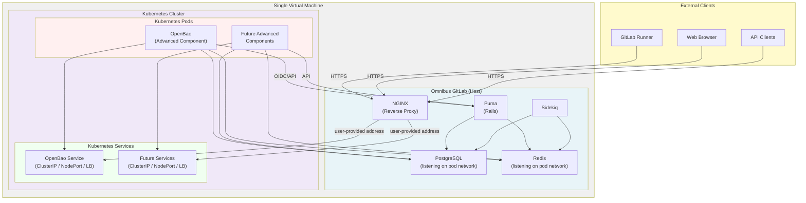

<!--
Document statuses you can use:

- "proposed"
- "accepted"
- "ongoing"
- "implemented"
- "postponed"
- "rejected"

-->

<!-- Design Documents often contain forward-looking statements -->
<!-- vale gitlab.FutureTense = NO -->



## サマリー

Omnibus-Adjacent Kubernetes (OAK) は、従来の Omnibus GitLab デプロイとクラウドネイティブ GitLab の間のギャップを橋渡しするために設計された過渡的アーキテクチャです。これは、セルフマネージド顧客が同じ仮想マシン上で Omnibus GitLab を軽量な Kubernetes ディストリビューションと一緒に実行できるようにし、完全なクラウドネイティブデプロイを必要とせずに、クラウドネイティブコンポーネント (OpenBao のシークレット管理など) を活用できるようにします。

この設計ドキュメントは、私たちの発見フェーズからの調査結果をキャプチャしています。そこでは、3 つの軽量 Kubernetes ディストリビューション (k3s、k0s、microk8s) が単一ノード上で Omnibus GitLab と統合できることを正常に検証しました。Kubernetes 上に OpenBao (シークレット管理ソリューション) をデプロイし、Omnibus GitLab のシークレットマネージャー機能と統合することで、エンドツーエンドの機能を実演しました。

OAK は、[Segmentation 提案](../selfmanaged_segmentation/_index.md) のステッピングストーンとして機能し、Omnibus の運用上のシンプルさを維持しながら、クラウドネイティブコンポーネントを必要とする高度な機能を Early Self-Managed 顧客が採用できるようにします。

## 動機

### 問題提起

GitLab のプロダクトロードマップには、クラウドネイティブデプロイのために設計されている高度な機能 (ネイティブシークレット管理など) が含まれています。しかし、多くのセルフマネージド顧客は、運用の複雑さ、コスト、またはインフラの制約により、フルクラウドネイティブセットアップへの移行の準備ができていません。これにより、顧客がフルアーキテクチャ全面刷新なしにこれらの高度な機能にアクセスできないギャップが生まれます。

さらに、Segmentation 提案は Early Self-Managed Advanced コンポーネントティアの顧客向けに過渡的な提供を必要とします。OAK は、顧客が同じインフラ上で Omnibus と Kubernetes の両方を実行できるようにすることでこの移行パスを提供し、クラウドネイティブコンポーネントを段階的に採用できるようにします。

### 目標

- **セルフマネージド顧客向けに高度な機能を有効にする**: フルクラウドネイティブデプロイを必要とせずに、顧客がクラウドネイティブ GitLab 機能 (シークレット管理など) を使用できるようにします。
- **明確な移行パスを提供する**: OAK を将来のクラウドネイティブ採用へのステッピングストーンとして確立し、移行を検討している顧客の摩擦を減らします。Omnibus コアコンポーネントは、クラウドプロバイダーへの最終的な移行の前に OAK で実行することもできます。
- **運用パターンを確立する**: 将来の実装を導くことができる、サービス相互接続、ネットワーク設定、デプロイ手順の実証済みパターンを文書化します。
- **Segmentation 提案をサポートする**: フルクラウドネイティブデプロイを行いたくない Omnibus ユーザー向けに実行可能なデプロイアーキテクチャを提供することで、Early Self-Managed Advanced ティアの提供を可能にします。

## 意思決定

- [ADR-001: Don't package or bless any kubernetes distributions](./decisions/001_dont_package_or_bless_kubernetes_distros.md)
- [ADR-002: OAK Testing and Integration Ownership](./decisions/002_oak_testing_and_integration_ownership.md)
- [ADR-003: Omnibus is agnostic to Kubernetes service exposure](./decisions/003_omnibus_agnostic_k8s_service_exposure.md)
- [ADR-004: Multi-node Omnibus support in OAK](decisions/004_multi_node_omnibus_support.md)
- [ADR-005: Zero-Downtime Upgrades](decisions/005_zero_downtime_upgrades.md)

## 提案

### アーキテクチャ概要

OAK は以下のコンポーネントで構成されます:

1. **Omnibus GitLab**: ホスト VM 上で実行され、コア GitLab アプリケーション、PostgreSQL、Redis、その他のサービスを提供します。
2. **軽量 Kubernetes ディストリビューション**: 同じ VM 上で実行され、クラウドネイティブコンポーネントのためのコンテナオーケストレーションプラットフォームを提供します。
    - ユーザーによってデプロイされます。
3. **クラウドネイティブコンポーネント**: Kubernetes 上にデプロイされる OpenBao などのサービスで、明確に定義された API を通じて Omnibus と統合されます。
4. **ネットワーク隔離**: Kubernetes サービスがホスト (localhost) からのみアクセス可能であることを確保し、外部アクセスを防ぐためのネットワークポリシーと kube-proxy 設定。

### 検証された Kubernetes ディストリビューション

私たちの発見作業に基づき、3 つの小規模 Kubernetes ディストリビューション (`k0s`、`k3s`、`microk8s`) がこの目的のために機能することを検証しました。

それぞれの調査結果の詳細については、[OAK milestone 1 epic](https://gitlab.com/groups/gitlab-com/gl-infra/software-delivery/-/work_items/30) を参照してください。

### サービス相互接続パターン

私たちの発見作業は、Kubernetes サービスを Omnibus と統合するための実証済みパターンを確立しました。Omnibus 自動化を追加する際、これらのパターンを考慮する必要があります:

1. **PostgreSQL の公開**: Omnibus PostgreSQL を Kubernetes ポッドネットワークインターフェース (たとえば CNI ブリッジ IP) でリッスンするように設定し、Kubernetes ポッドが認証情報を使用して接続できるようにします。
   - 異なる Kubernetes ディストリビューションは異なるネットワークインターフェースを提供します。`microK8s` は VXLAN をサポートし、`k3s` と `k0s` はブリッジをデプロイします。これらは異なる IP を使用するため、ユーザーはそれらについて Omnibus に通知する必要があります。
2. **サービスアクセス**: Omnibus は、Kubernetes サービスがどのように公開されるかに関して中立です。ユーザーはサービスにアクセスできるアドレス (IP、ホスト名、または `IP:port`) を提供します。これは ClusterIP (同一 VM 内デプロイ)、NodePort、または LoadBalancer の場合があります。[ADR-003](./decisions/003_omnibus_agnostic_k8s_service_exposure.md) を参照してください。
3. **NGINX リバースプロキシ**: Omnibus NGINX はリバースプロキシとして機能し、ユーザー提供のアドレスを使用して外部リクエストを Kubernetes サービスに転送します。
4. **認証**: OpenBao などのサービスは、GitLab を ID プロバイダーとして使用する OIDC/JWT 認証を使用します。

### ネットワークセキュリティモデル

- **Kubernetes サービスは直接外部に公開されません**: Omnibus NGINX は Kubernetes サービスへのトラフィックの唯一の外部エントリーポイントです。これらのサービスが内部でどのように公開されるか (ClusterIP、NodePort、LoadBalancer) はユーザーの選択であり、Omnibus 設定に影響しません。
- **Omnibus がゲートウェイとして機能**: Kubernetes サービスへのすべての外部トラフィックは Omnibus NGINX を流れ、追加のセキュリティ制御を適用できます。Omnibus 自動化を実装して、自動 NGINX 設定を提供する必要があります。
- **ポッドからホストへの通信**: Kubernetes ポッドは、ポッドネットワークインターフェースを通じて Omnibus サービス (PostgreSQL、Redis) と通信できます。
- **外部 Kubernetes API 公開なし**: Kubernetes API サーバーは外部に公開されません。管理は VM 上でローカルに行われます。
- **TLS**: 高度なコンポーネントへの外部通信をサポートするために、たとえば runner が直接 OpenBao と通信しようとする場合、ある程度の TLS をサポートする必要があります。これは Omnibus NGINX SSL オフローディングを設定することで達成できます。[コアコンポーネントで提供されている](https://docs.gitlab.com/omnibus/settings/ssl) のと同様に、Let's Encrypt 証明書の生成も考慮するべきです。

### マルチノード Omnibus サポート

OAK はマルチノード Omnibus デプロイをサポートします。ネットワーク設定とサービスの公開は顧客の責任です。Beta フェーズで計画されている自動化と、既存の Omnibus 設定を組み合わせることで、顧客が稼働するために必要なものをカバーします。それを超えるものはスコープ外です。Omnibus は自分自身のノードのみを管理し、デプロイの他のノードの知識や制御を持ちません。

マルチノード Omnibus デプロイは、既存の Omnibus ZDU 手順に従ってゼロダウンタイムアップグレードを可能にします。OAK の ZDU 戦略の詳細については、[ADR-005: Zero-Downtime Upgrades](decisions/005_zero_downtime_upgrades.md) を参照してください。

マルチノード Omnibus サポートの詳細については、[ADR-004: Multi-node Omnibus support in OAK](decisions/004_multi_node_omnibus_support.md) を参照してください。

### オフラインインストール

OAK は Omnibus レベルで新しいオフラインデプロイ要件を導入しません。[オフライン](https://docs.gitlab.com/topics/offline/) Omnibus インストールとオフライン Helm chart インストールは、既存のメカニズムを通じてすでにサポートされています。顧客は Omnibus と高度なコンポーネントが通信できるように独自のネットワークを設計し、このシナリオに対して Omnibus レベルの変更は期待されません。

### FIPS コンプライアンス

OAK は Omnibus レベルで新しい FIPS コンプライアンス要件を導入しません。Omnibus はすでに FIPS をサポートしており、OAK の一部として Omnibus に新しいコンポーネントは追加されていません。クラスタ内にデプロイされた高度なコンポーネント、およびクラスタ自体は、FIPS 要件を独立して満たす必要があります。

### Kubernetes ツール配布

OAK は `helm` や `kubectl` などの Kubernetes ツールを配布または管理しません。顧客はこれらのツールのインストールと管理に責任を持ちます。ツールの配布を導入すると、Omnibus がオーケストレーションロールに移行することになり、これは意図されたスコープ外です。

### Helm 自動化レベル

OAK は Helm chart のインストールを自動化しません。顧客は、Omnibus によって生成された Helm values ファイルを使用して chart を手動でインストールします。`helm install` を自動化すると、Omnibus がオーケストレーションレイヤーに拡張され、chart ライフサイクル管理のための暗黙のサポート契約が作成されます。これらはどちらも意図されたスコープ外です。

### サイジングガイダンス

OAK は別のサイジングガイドラインを定義しません。既存の Omnibus サイジング推奨事項が適用され、Kubernetes クラスタはデプロイされる高度なコンポーネントのリソース要件を満たす必要があります。Omnibus と Kubernetes クラスタが同じ基盤リソースを共有する単一ノードインストールの場合、最小サイジングは両方のリソースセットを考慮する必要があります。

### モニタリングとロギング

OAK デプロイのモニタリングとロギングは、既存のインフラパターンを通じて顧客が管理します。Omnibus レベルの変更は必要ありません。
既存の GitLab 設定と標準ツールにより、ユーザーは自分のインフラに合うソリューションを設計するための十分な柔軟性があります。

**モニタリング**: ユーザーは Omnibus の既存の `prometheus['scrape_configs']` を活用して、高度なコンポーネントからのメトリクスを統合できます。高度なコンポーネントは Prometheus 互換のメトリクスを公開します (たとえば、OpenBao は `/v1/sys/metrics` でメトリクスを公開します)。単一ノード (同居) デプロイでは、メトリクスは localhost でアクセス可能です。外部 Kubernetes クラスタを持つデプロイでは、ユーザーはメトリクスを外部に公開して (NodePort、LoadBalancer) `prometheus['scrape_configs']` でスクレイプするか、Kubernetes ネイティブパターン (PodMonitor、Prometheus Operator) を使用できます。

**ロギング**: GitLab はすでにロギング機能を提供しています。ユーザーは、インフラのニーズに基づいて、ログ集約ソリューション (Filebeat、Fluent Bit、ELK、Loki などのツールを選択) を設定する責任があります。Omnibus ログと Kubernetes ポッドログの両方は、標準の shipper/agent パターン (Kubernetes 用 DaemonSet、Omnibus 用 VM 上のエージェントなど) を使用して収集できます。

## Beta 実装提案

チームとの議論に基づき、以下は OAK の提案された Beta 実装を表しています。この Beta フェーズは、単一ノード顧客が高度なコンポーネントを採用できるようにする最小限の実行可能プロダクトを確立することに焦点を当てており、最終的にクラウドネイティブアーキテクチャへの移行を促すために意図的にいくつかの摩擦を導入しています。

### Beta 目標

- **高度なコンポーネントの採用を可能にする**: 単一ノード Omnibus 顧客が高度なクラウドネイティブコンポーネント (OpenBao のシークレット管理など) をデプロイして使用できるようにします。
- **運用パターンを確立する**: 実際の顧客でサービス相互接続パターンとデプロイワークフローを検証します。
- **顧客フィードバックを収集する**: 顧客の悩みのポイントと自動化レベルの好みを理解します。

### Beta スコープ: 含まれるもの

#### 1. Omnibus 自動化

Omnibus は OAK セットアップに対して **限定的で焦点を絞った自動化** を提供します:

- **NGINX 設定生成**: Omnibus は、公開された Kubernetes サービス (OpenBao など) のための NGINX リバースプロキシ設定を自動的に生成します。これは設定エラーの最も一般的な原因を減らす、最も価値の高い自動化です。
- **PostgreSQL ネットワーク公開**: OAK が有効になっている場合、Omnibus は PostgreSQL を Kubernetes ポッドネットワークインターフェース (ユーザー提供のネットワーク IP によって決定) でリッスンするように自動的に設定します。これにより、Kubernetes コンポーネントは手動設定なしでデータベースにアクセスできるようになります。
- **Helm values 生成**: Omnibus は高度なコンポーネントのために事前に設定された Helm values ファイルを生成します。これには次が含まれます:
  - データベース接続詳細 (ホスト、ポート、認証情報)
  - サービスノードポート割り当て
  - GitLab 統合エンドポイント (双方向通信用)
  - ネットワーク設定詳細

#### 2. デプロイワークフロー (順序付きステップ)

Beta 実装は、最小限の摩擦を導入しながら関心の明確な分離を維持する意図的な 3 ステップワークフローに従います:

**ステップ 1: ユーザーが Kubernetes をインストール**

- ユーザーは Omnibus と同じ VM 上に軽量 Kubernetes ディストリビューション (k3s、k0s、または microk8s) を選択してインストールします。
- ユーザーは Kubernetes ポッドネットワーク IP/CIDR を Omnibus に提供します (k3s の場合は `10.42.0.0/16` など)。
- このステップは意図的に手動です。ADR 001 で私たちが Kubernetes ディストリビューターにならないことが知らされているからです。

**ステップ 2: ユーザーが Omnibus を再設定**

- ユーザーは OAK が有効化され、Kubernetes ネットワーク情報を含む `omnibus-ctl reconfigure` を実行します。
- Omnibus は以下を自動的に実行します:
  - PostgreSQL を Kubernetes ポッドネットワークインターフェースでリッスンするように設定
  - Redis を Kubernetes ポッドネットワークインターフェースでリッスンするように設定 (高度なコンポーネントが必要な場合)
  - 各高度なコンポーネント用の NGINX 設定ファイルを生成
  - 各高度なコンポーネント用の Helm values ファイルを生成
- Omnibus は生成された Helm values ファイルを既知の場所 (`/etc/gitlab/oak/helm-values/` など) に出力します。

**ステップ 3: ユーザーが Helm chart を手動でインストール**

- ユーザーは生成された values ファイルを使用して Helm chart を手動でインストールします。
- 例: `helm install openbao gitlab/openbao -f /etc/gitlab/oak/helm-values/openbao.yaml`
- このステップは以下のために意図的に手動です:
  - ユーザーが Helm の基本を学ぶことを確保 (最終的なクラウドネイティブ移行に必要)
  - Omnibus と Kubernetes 管理間の明確な分離を維持
  - 最初は、Helm 自動化のための暗黙のサポート契約を作成することを避ける。将来の自動化のために検討する。

#### 3. Beta でのサービス相互接続

Beta では、サービス相互接続は以下のパターンに従います:

- **PostgreSQL アクセス**: Kubernetes ポッドは、ポッドネットワーク IP と標準の PostgreSQL 認証情報を使用して Omnibus PostgreSQL にアクセスします。OAK が有効な場合、Omnibus はポッドネットワークインターフェースで PostgreSQL を公開します。
- **Redis アクセス**: PostgreSQL と同様に、必要な場合 Redis はポッドネットワークインターフェースで公開されます。
- **外部サービスアクセス**: Omnibus NGINX は Kubernetes サービスへの外部トラフィックのリバースプロキシとして機能し、`gitlab.rb` でユーザーが提供したアドレスを使用します。Omnibus は、サービスが Kubernetes でどのように公開されるか (ClusterIP、NodePort、または LoadBalancer) に対して中立です。
- **双方向通信**: GitLab と通信する必要があるコンポーネント (OIDC など) のために、Omnibus は生成された Helm values で GitLab エンドポイント URL を提供します。

##### アーキテクチャ図

**主要なアーキテクチャ上のポイント:**

- **単一 VM**: Omnibus と Kubernetes の両方が同じ仮想マシン上で実行されます
- **NGINX が単一の外部ゲートウェイ**: Kubernetes サービスへのすべての外部トラフィックは Omnibus NGINX を流れます
- **NGINX ゲートウェイ**: Kubernetes サービスへのすべての外部トラフィックは Omnibus NGINX を流れます
- **ポッドネットワークアクセス**: Kubernetes ポッドはポッドネットワークインターフェース経由で Omnibus PostgreSQL と Redis にアクセスできます
- **双方向通信**: 高度なコンポーネントは認証と API 呼び出しのために GitLab (Puma) に通信できます

#### 4. NGINX 設定

Omnibus は以下を行う NGINX 設定ファイルを生成します:

- 特定のポートまたはサブドメイン (`openbao.gitlab.example.com` または `gitlab.example.com:8200` など) で Kubernetes サービスを公開します。
- ユーザーが提供したアドレス (`oak['address']` または `oak['components']['<name>']['address']` 経由のコンポーネントごとのオーバーライド) を使用して、Kubernetes サービスにトラフィックを転送します。
- 既存の Omnibus SSL 証明書管理を使用した TLS 終端をサポートします。
- 簡単な管理のために専用ディレクトリ (`/etc/gitlab/nginx/conf.d/oak-services.conf` など) に配置されます。

ユーザーは必要に応じてこれらの設定をカスタマイズできますが、Omnibus は妥当なデフォルトを提供します。

#### 5. Helm Values 生成

Omnibus は以下を含む Helm values ファイルを生成します:

- **データベース設定**: PostgreSQL/Redis アクセス用のホスト、ポート、ユーザー名、パスワード。
- **サービス設定**: NodePort 割り当て、サービスタイプ (NodePort)、および必要なノードセレクター。
- **GitLab 統合**: GitLab エンドポイント URL、認証トークン、その他の統合詳細。
- **ネットワーク設定**: ポッドネットワーク CIDR、必要なネットワークポリシー。

これらの values ファイルは以下に基づいて生成されます:

- ユーザーが提供した Kubernetes ネットワーク情報
- 高度なコンポーネントの要件 (コンポーネントチームによって決定)
- Omnibus 設定とシークレット

#### 6. ドキュメントとサポート

Beta ドキュメントには以下が含まれます:

- **ステップバイステップガイド**: OAK を使用して各高度なコンポーネントを有効にする方法について。
- **トラブルシューティングガイド**: 一般的な問題とそれらのデバッグ方法。
- **アーキテクチャ図**: サービス相互接続パターンを示します。
- **Helm chart ドキュメント**: 各高度なコンポーネントの公式 Helm chart ドキュメントへのリンク。

#### 7. オブジェクトストレージ要件

OAK にデプロイされた高度なコンポーネントには異なるストレージ要件がある場合があります:

- **ステートレスコンポーネント** (OpenBao など): これらのコンポーネントは Omnibus が提供する外部データベース (PostgreSQL、Redis) に状態を保存します。追加のオブジェクトストレージは必要ありません。
- **ディスクを必要とするステートフルコンポーネント**: 永続的なディスクストレージ (PostgreSQL/Redis に保存できる範囲を超える) を必要とする高度なコンポーネントは、オブジェクトストレージを使用する必要があります。そのようなコンポーネントをデプロイする Omnibus 管理者は、それ以外でローカルディスクに保存されるすべてのデータをオブジェクトストレージに移行する必要があります。

**主要な原則**: Kubernetes コンポーネントはローカルディスクストレージに依存すべきではありません。代わりに、以下のいずれかを行うべきです:

1. Omnibus 提供または PostgreSQL または Redis に状態を保存する
2. ファイルベースのデータには、オブジェクトストレージ (S3 互換、GCS、Azure Blob Storage など) を使用する

これにより、コンポーネントが将来適切にスケーリング、バックアップ、移行できるようになります。Omnibus 管理者は、データベースを超える永続的なデータストレージを必要とする高度なコンポーネントをデプロイする際に、オブジェクトストレージの採用を計画する必要があります。

### Beta スコープ: 含まれないもの

以下は明示的に Beta から延期され、将来のフェーズで対処されます:

- **自動 Helm インストール**: Omnibus は `helm install` コマンドを自動的に実行しません。ユーザーはこれを手動で行う必要があります。
- **エアギャップデプロイ**: Beta ではサポート/検証されていません。インターネットアクセスが必要です。
- **自動サービス検出**: サービスアドレスは `gitlab.rb` の値を介して静的に設定されます。
- **別 VM サポート**: Beta では Kubernetes は Omnibus と同じ VM 上で実行する必要があります。将来、Kubernetes が別 VM で実行されるシナリオを検証します。これにはネットワーク管理者によるネットワーク設定が必要です。
- **相互 TLS**: Beta では実装されていません。コンポーネントは mTLS なしで localhost 経由で通信します。Kubernetes が別ノード上にある場合、これが必要になります。
- **Kubernetes ツール配布**: ユーザーは Helm、kubectl、その他のツールを自分でインストールする必要があります。

### Beta 成功基準

Beta フェーズは以下が満たされた場合に成功と見なされます:

1. **機能性**: 単一ノード顧客が OAK で少なくとも 1 つの高度なコンポーネント (OpenBao) を正常にデプロイして使用できる。
2. **ドキュメント**: 以下のドキュメント成果物が作成されて公開される:
   - **Runbook**: OpenBao を含む OAK のステップバイステップデプロイガイド (k3s、k0s、microk8s をカバー)
   - **トラブルシューティングガイド**: 一般的な問題、エラーメッセージ、解決手順
   - **録画されたデモ**: エンドツーエンドインストールを示すビデオウォークスルー (Kubernetes ディストリビューション → Omnibus → OpenBao)
3. **顧客フィードバック**: セットアップエクスペリエンスと自動化レベルについて、少なくとも 2-5 名のベータ顧客からフィードバックを得ている。
4. **運用パターン**: サービス相互接続パターンが検証され、文書化されている。
5. **サポート準備**: サポートチームが以下にアクセスできる:
   - Runbook とトラブルシューティングガイド
   - 参考用の録画デモ
   - 顧客の質問に対処するために Beta 期間中にスケジュールされた 2 つの AMA (Ask Me Anything) セッション。オンデマンドでさらに AMA を開催することにオープンであること。
6. **セキュリティレビュー**: AppSec がアーキテクチャと実装をレビュー済みである。

### Beta から GA への移行

GA への道はまだ確定していません。事前に固定された GA スコープにコミットするのではなく、フィードバック駆動のアプローチを選択しました。Beta はアクティブな状態を維持しながら、GA が意味を成すかどうか、そしてどのような形で意味を成すかを判断するための実世界の顧客データを収集します。

#### Beta フィードバック期間

Beta は約 **6 か月** 実行され、その間に以下を目指します:

- **少なくとも 5 名のベータ顧客** からフィードバックを収集する。
- `gitlab.yml` 設定キーの計装を使用して採用を定量化する (たとえば、`oak['enabled']: true` のインスタンスの数をカウント)。
- 公開 Issue を通じて、また CS およびパートナーユーザーに Beta をアナウンスすることで、定性的なフィードバックを収集する。

#### フィードバック期間終了時の決定基準

フィードバック期間の終了時に、以下を評価します:

1. **十分なデータがあるか?** ない場合、Beta をより長く実行する選択肢があります。
2. **機能はよく受け入れられ、重大な改善は必要ないか?** → Beta をそのまま GA に切り替え、リリース前の追加の機能作業はなし。特定された "あれば便利" は将来の改善になります。
3. **GA 前に機能に改善が必要か?** → それらの改善が GA に必要か、または Beta を GA に切り替えてそれらを将来を見据えた作業として扱うかを決定します。
4. **機能はユーザーを引きつけることに失敗したか?** → GA に達する前に Beta から OAK を引退させるオプションを保持します。これにより、機能をきれいに削除する柔軟性が得られます。

#### GA 前にスコープ外

フィードバックがニーズを検証するまで、追加の自動化やインフラ作業に意図的に **投資しません**。元々 GA の前提条件としてスコープに含まれていた次の項目は、フィードバックデータが揃うまで保留されます:

- 自動化の拡張 (自動 Helm インストールなど)。
- Omnibus がすでに提供している以上の高度なエアギャップデプロイサポート。
- Kubernetes 関連ツールの配布。

これらは引き続き有効な将来の改善であり、顧客フィードバックが需要を示した場合に再検討されます。

### Beta アプローチの根拠

Beta アプローチは、いくつかの競合する懸念のバランスを取ります:

- **顧客体験**: NGINX と Helm values 生成のための Omnibus 自動化は、完全な手動設定と比較してセットアップの複雑さを大幅に減らします。
- **メンテナンス負担**: Helm インストールを手動にすることで、継続的なメンテナンスを必要とする複雑な自動化システムを作成することを避けます。
- **学習機会**: 手動の Helm インストールを必要とすることで、顧客が Kubernetes の基本を学ぶことが保証され、最終的なクラウドネイティブ移行に備えることができます。
- **明確な境界**: Omnibus と Kubernetes 管理を分離することで、明確な運用境界を維持し、サポート対象範囲を減らします。
- **フィードバック収集**: 手動ステップは、最も価値のある自動化について顧客がフィードバックを提供できる自然な地点を提供します。

## 次のステップ

### 即時アクション (設計ドキュメントフェーズ)

1. **ステークホルダーの整合**: 公開された質問について整合させるため、この設計ドキュメントをテクニカルリーダー、プロダクトマネージャー、エンジニアリングマネージャーに提示します。
2. **意思決定の文書化**: 公開された各質問について新しい ADR に意思決定を文書化し、それに応じてこの設計ドキュメントを更新します。後続のフォローアップ MR で行えます/行うべきです。これは、作業を分割し、各トピックに対してよりクリーンで焦点を絞った議論を提供するのに役立ちます。
3. **詳細な要件**: 意思決定に基づいて、実装フェーズの詳細な要件を作成します。
4. **アーキテクチャの洗練**: ステークホルダーのフィードバックと意思決定に基づいてアーキテクチャを洗練します。

### 実装フェーズ (設計ドキュメント承認後)

1. **Omnibus 自動化**: Beta 提案で説明されているとおり、OAK セットアップのための Omnibus 設定と自動化を実装します。
2. **Helm values 生成**: 高度なコンポーネントのための Helm values 生成システムを実装します。
3. **NGINX 設定**: 自動 NGINX 設定生成を実装します。
4. **ドキュメント**: OpenBao ドキュメントを拡張して、OAK でデプロイする方法をユーザーにガイドします。
5. **テストと検証**: 自動 CI パイプラインテストを持ちます。
6. **セキュリティレビュー**: アーキテクチャと実装の AppSec レビュー。
7. **Beta リリース**: 早期採用者向けのベータ機能として OAK をリリースします。

## 参考資料

- [Parent Epic: Omnibus Adjacent Kubernetes (OAK) - Operate Implementation](https://gitlab.com/groups/gitlab-com/gl-infra/software-delivery/-/work_items/22)
- [Completed Discovery Phase: Milestone 1](https://gitlab.com/groups/gitlab-com/gl-infra/software-delivery/-/work_items/30)
  - [k3s Discovery Issue](https://gitlab.com/gitlab-org/omnibus-gitlab/-/work_items/9525)
    - [k3s Documentation](https://docs.k3s.io/)
  - [k0s Discovery Issue](https://gitlab.com/gitlab-org/omnibus-gitlab/-/work_items/9526)
    - [k0s Documentation](https://docs.k0sproject.io/)
  - [microk8s Discovery Issue](https://gitlab.com/gitlab-org/omnibus-gitlab/-/work_items/9527)
    - [microk8s Documentation](https://canonical.com/microk8s)
- [Design Document Phase Epic](https://gitlab.com/groups/gitlab-com/gl-infra/software-delivery/-/work_items/33)
- [GitLab Segmentation Proposal](../selfmanaged_segmentation/_index.md)
