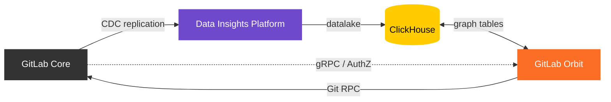



## 概要

GitLab Orbit（旧 GitLab Knowledge Graph）は、GitLab インスタンスのデータ（SDLC メタデータおよびコード構造）からプロパティグラフを構築し、ClickHouse SQL にコンパイルされる JSON ベースの Cypher 風 DSL を通じて公開する Rust サービスです。AI システム（MCP 経由）および人間のユーザー向けの統一コンテキスト API を提供します。

このサービスは 2 種類のデータをプロパティグラフ形式でインデックスします:

- **SDLC メタデータ**: Issue、マージリクエスト、CI パイプライン、ワークアイテム、グループ、プロジェクト、その他の GitLab エンティティを、Siphon CDC によって PostgreSQL から NATS を経由して ClickHouse にストリーミングする。
- **コード**: コールグラフ、定義、参照、リポジトリメタデータを Gitaly から取得し、ClickHouse のグラフテーブルにパースする。

## アーキテクチャ

## 設計ドキュメント

完全な設計ドキュメントは現在、[knowledge-graph リポジトリ](https://gitlab.com/gitlab-org/orbit/knowledge-graph/-/tree/main/docs/design-documents) のコードと並べて配置されています:

- [概要とアーキテクチャ](https://gitlab.com/gitlab-org/orbit/knowledge-graph/-/blob/main/docs/design-documents/README.md)
- [インデックス作成](https://gitlab.com/gitlab-org/orbit/knowledge-graph/-/tree/main/docs/design-documents/indexing)（SDLC およびコード）
- [クエリ](https://gitlab.com/gitlab-org/orbit/knowledge-graph/-/tree/main/docs/design-documents/querying)（グラフエンジン、クエリ言語）
- [データモデル](https://gitlab.com/gitlab-org/orbit/knowledge-graph/-/blob/main/docs/design-documents/data_model.md)
- [スキーマ管理](https://gitlab.com/gitlab-org/orbit/knowledge-graph/-/blob/main/docs/design-documents/schema_management.md)
- [セキュリティ](https://gitlab.com/gitlab-org/orbit/knowledge-graph/-/blob/main/docs/design-documents/security.md)
- [可観測性](https://gitlab.com/gitlab-org/orbit/knowledge-graph/-/blob/main/docs/design-documents/observability.md)

## リソース

| リソース | 場所 |
|---|---|
| リポジトリ | [gitlab-org/orbit/knowledge-graph](https://gitlab.com/gitlab-org/orbit/knowledge-graph) |
| メインエピック | [#19744](https://gitlab.com/groups/gitlab-org/-/work_items/19744) |
| プログラムページ | [内部ハンドブック](https://internal.gitlab.com/handbook/engineering/r-and-d-pmo/programs/knowledge-graph-ga/) |
