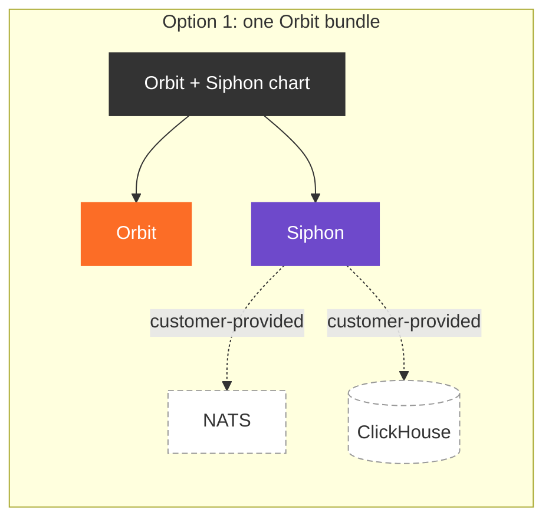
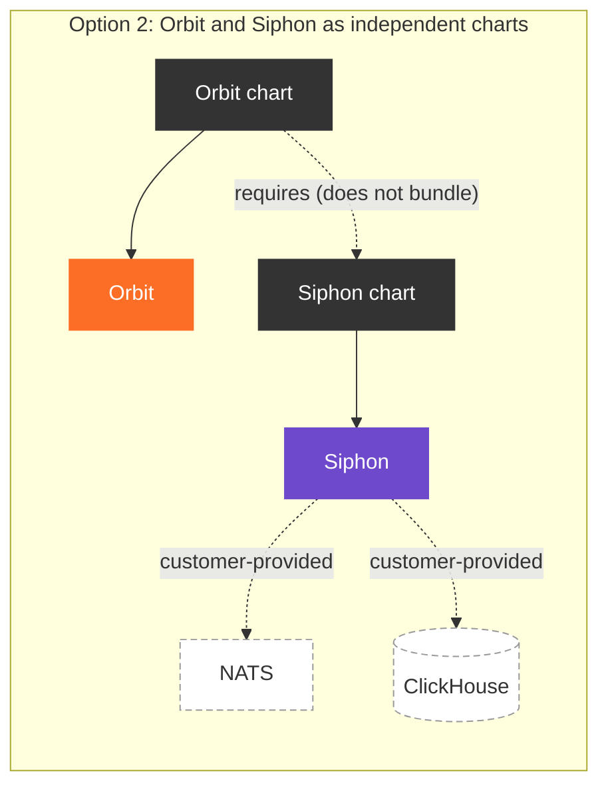
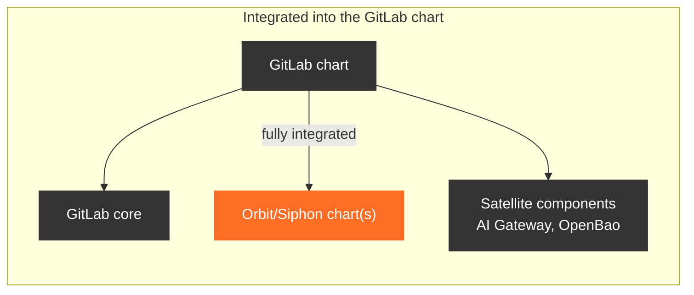
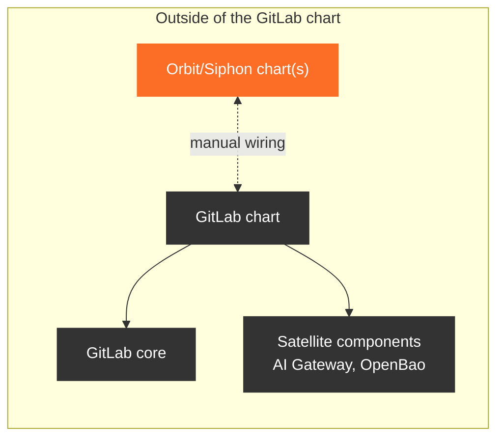

<!-- Design Documents often contain forward-looking statements -->
<!-- vale gitlab.FutureTense = NO -->

## ステータス

**提案中。**

## 背景

[GitLab Orbit](../)と [Data Insights Platform](../../data_insights_platform/)（DIP）は、
GitLab Self-Managed 向けに提供されます。Orbit は DIP に依存し、DIP は、現在ほとんどの
Self-Managed 環境で稼働していない 3 つのコンポーネントで構成されています。

1. [**Siphon**](https://gitlab.com/gitlab-org/analytics-section/siphon): GitLab の PostgreSQL データから ClickHouse へのレプリケーションを管理します。
1. [**NATS**](https://docs.nats.io/): レプリケートされた変更データを運ぶメッセージングシステムです。
1. [**ClickHouse**](https://clickhouse.com/docs): そのデータを保存するカラム指向データベース管理システムです。

これらのコンポーネントの提供方法は、いくつかの特性によって決まります。

1. Orbit と DIP の設定は複雑です。
1. Siphon は私たちのものですが、NATS と ClickHouse は独自のオペレーター、リリースサイクル、CVE 情報源を持つサードパーティシステムです。
1. ClickHouse は DIP 以外でも GitLab のオプション依存関係です。
1. NATS は DIP や Orbit 以外でも、GitLab コアのオプション依存関係になる予定です。（[作業項目 #17582](https://gitlab.com/groups/gitlab-org/-/work_items/17582)）
1. DIP は GitLab Rails の PostgreSQL マイグレーションと密接に結びついています。
1. GitLab と DIP をアップグレードするときに遵守すべき DIP のアップグレード制約があります。
1. 現時点では DIP も Orbit も [Theseus](../../theseus_platform_vision/)を使用していません。

Self-Managed の顧客が過度な労力をかけずに Orbit と DIP をインストール、設定、アップグレードできるようにするには、
3 つのことを決める必要があります。DIP が必要とするサードパーティシステムをどう扱うか、パッケージを
どのように構成するか、そしてそれらのパッケージをどのようにインストールするかです。

### サードパーティの依存関係

ClickHouse と NATS を配布することは、Self-Managed 向けのディストリビューターになることを意味します。つまり、アップストリームのリリースを追跡し、
私たちが開発していないソフトウェアの CVE をトリアージし、私たちが設計していないデプロイトポロジーをサポートすることになります。これは、
インストール環境が増えるたびに拡大する継続的な責任であり、
[Omnibus-Adjacent Kubernetes ADR 001](../../omnibus_adjacent_kubernetes/decisions/001_dont_package_or_bless_kubernetes_distros.md)が
Kubernetes 自体に対して引き受けないと決めたものと同じ責任です。

より差し迫った問題は、**どちらのシステムも DIP 固有ではない**ことです。ClickHouse はすでに DIP 以外でも GitLab の
オプション依存関係であり、NATS も間もなく GitLab コアのオプション依存関係になります。顧客は 1 つの ClickHouse と 1 つの NATS を
稼働させ、それらを必要とするすべての GitLab 機能で共有できるべきです。どちらかのシステムを DIP パッケージ内に同梱すると、
それは DIP の所有物になります。バージョン、トポロジー、アップグレード期間が DIP のリリースによって決まり、次の利用側は
無関係なパッケージが所有するインスタンスを共有するか、2 つ目のインスタンスを立ち上げることになります。

[Theseus プラットフォームビジョン](../../theseus_platform_vision/)では、Self-Managed に関する一般的な形がすでに
定まっています。チャートは意図的に
[「貧弱」です。Postgres や Redis などの依存関係は組み込まれていません](../../theseus_platform_vision/#55-deployment--fairway-and-the-release-framework)。
また、[Self-Managed プラットフォームバインディング](../../theseus_platform_vision/#4--one-platform-many-bindings)は、
「事実上何もしません。Helm または Helmfile のみで、顧客が独自のデータベース、Redis/Valkey、および同様の
サービスを用意します」。ClickHouse と NATS は、この説明における DIP 相当のものです。クラスター内にデータ
サービスをプロビジョニングする唯一のバインディングは、開発者ワークステーションの Caproni です。

一方で、「独自の ClickHouse を用意する」だけでは実用的な指示になりません。ClickHouse と
NATS はどちらも設定範囲が広く、そのうち DIP に重要なのはごく一部です。アップストリームのドキュメントだけを渡され、
自分で解決するよう指示された顧客は、構築にたどり着けないか、私たちが一度も実行したことのない設定に
たどり着くでしょう。したがって、決めるべきことは、これらのシステムを配布するかどうかだけでなく、顧客による
運用をどのように支援できるかでもあります。

### パッケージの規模

ClickHouse と NATS を顧客が用意する前提条件とした場合、パッケージ化するものとして残るのは Orbit と
Siphon です。未解決の問題は、これらを 1 つのバンドルとして提供するか、2 つとして提供するかです。つまり、
Orbit のコンテキスト外での DIP の需要と、両方を独立して提供することによる複雑さの増加を比較検討します。

この問いからすでに除外されたものに注目してください。分割後の DIP 側に残るコンポーネントは 1 つだけなので、
構築する DIP バンドルはありません。DIP の配布物は Siphon チャートです。

### インストール体験

[GitLab Helm chart](https://docs.gitlab.com/charts/)は、現在のクラウドネイティブな
顧客にとって事実上の提供方法であり、GitLab コアを AI Gateway や OpenBao などのオプションの
サテライトコンポーネントとともにバンドルしています。GitLab がよりモジュール化されたインストール体験へ移行する中で、
Orbit と Siphon のチャートをそのパターンに従わせるか、GitLab Helm chart の外部に置くかを決める必要があります。

### 分離とアップグレードの制約

Siphon は GitLab に結びつかない汎用データ処理コンポーネントとして設計されていますが、DIP のために行う
レプリケーションは GitLab Rails スキーマに追従します。Siphon にはそのスキーマに一致する変更データキャプチャ（CDC）の
設定が必要であり、DIP と GitLab のアップグレードを同期しなければなりません。

私たちは CDC テーブルマッピングを、Siphon が起動時に取得する独立したバンドルとして公開するため、マッピングを
Siphon 自体に同梱する必要はありません。それでも提供時には、2 つのことを保証する必要があります。Siphon が
インストール済みの GitLab バージョンに一致する CDC バンドルを参照することと、GitLab Rails の
マイグレーションが完了する前に Siphon が起動しないことです。

Siphon 自体のアップグレードは、上記の理由からよりシンプルです。ClickHouse も NATS も同梱しないため、
管理対象外のエンドポイントに対して設定することが、2 つのトポロジーのうちの 1 つではなく唯一のトポロジーになります。
アップグレードパスに「バンドルまたは外部」という分岐はなく、インストール環境ですでにいずれかの依存関係が
稼働している場合に何が起きるかという問題もありません。

## 決定

Orbit と DIP は **2 つの独立したチャート**として提供し、**どちらも GitLab Helm chart に統合せず**、
**どちらのチャートも ClickHouse や NATS を配布しません**。

ClickHouse と NATS を配布しないため、**DIP バンドルはありません**。DIP は Siphon チャートとして提供します。
2 つのチャートとは、Orbit チャートと Siphon チャートです。

これらのコンポーネントを GitLab のインストール環境に統合するには詳細なドキュメントが必要ですが、将来的には
[GitLab Kubernetes Operator](../../theseus_platform_vision/#622-the-gitlab-kubernetes-operator)や
[Bridge](../../theseus_platform_vision/#623-bridge)などのオーケストレーションツールを使用して自動化できます。
Omnibus ユーザーは、[Omnibus-Adjacent Kubernetes](../../omnibus_adjacent_kubernetes/)（OAK）を通じて
同じチャートを利用できるようになります。

### ClickHouse と NATS

私たちは **ClickHouse や NATS をいかなる形でも配布しません**。サブチャート、バンドルされたデプロイ、
私たちのチャート内に同梱するカスタムリソース、推奨オペレータービルドのいずれとしても配布しません。どちらも顧客が
用意する前提条件であり、Siphon はそれらを外部エンドポイントとして設定します。

主な理由は再利用です。どちらのシステムにも DIP 以外のユースケースがあります。ClickHouse はすでに DIP 以外の GitLab 機能で
利用されており、NATS は GitLab コアの依存関係になりつつあります。そのため、顧客は **すべての利用側で共有する 1 つの ClickHouse と
1 つの NATS** を稼働できるべきです。両方をチャートの外に置くことで、これが可能になります。どのパッケージも
インスタンス、そのバージョン、アップグレード期間を所有せず、すべての利用側が同じ方法で接続します。第 2 の理由は、これらを
配布すると、私たちのコンポーネントが稼働するデータインフラストラクチャーのディストリビューターに私たちがなるためです。これは、
[Omnibus-Adjacent Kubernetes ADR 001](../../omnibus_adjacent_kubernetes/decisions/001_dont_package_or_bless_kubernetes_distros.md)が
プラットフォームレイヤーで引き受けず、Theseus の Self-Managed バインディングもデータサービスで引き受けないものです。

配布の代わりに、私たちは **テストおよび文書化されたセットアップ手順**を提供します。

1. **各システムの最小限のリファレンス設定。** ClickHouse については、指定した ClickHouse オペレーター向けの最小限の
   カスタムリソースを用意します。NATS については、DIP が必要とする JetStream 設定を含む、アップストリームの NATS Helm chart 向けの
   最小限の値セットを用意します。それぞれ、DIP が必要とするものだけを含み、HA トポロジー、チューニング、
   ストレージに関する見解は含みません。これにより、そのまま全面採用するのではなく、読んで調整できるほど小さくなり、
   同じインスタンスを共有する別の利用側の要件とも競合しません。これはチャートのペイロードではなく
   ドキュメントであるため、オペレーターを指定することは、顧客のインストール環境が満たすべき契約ではなく、
   顧客が変更できるテスト済みの例となります。
1. **リファレンス設定の CI カバレッジ。** リファレンス設定は CI で Siphon に対してテストされるため、
   文書化したセットアップがテスト対象のセットアップになり、両者のずれはサポートチケットではなく
   失敗したパイプラインとして表面化します。
1. **宣言されたバージョン範囲。** 各 Siphon リリースでテストした ClickHouse と NATS のバージョン、および
   依存する ClickHouse の機能や JetStream の設定など、DIP がそれらに要求するものを公開します。これにより、
   顧客はすでに稼働しているインスタンスが適しているかどうかも確認できます。
1. **エンドツーエンドのセットアップドキュメント。** 前提条件、GitLab および Siphon に対するインストール順序、
   Siphon を生成されたエンドポイントに接続する値、レプリケーション開始前に接続を検証する方法を記載します。

リファレンス設定は出発点であり、サポート対象のデプロイではありません。オペレーターとチャートのインストールと
アップグレード、サイジング、ストレージ、HA トポロジー、バックアップ、および両システムの CVE 対応は、引き続き
顧客の責任です。すでに ClickHouse や NATS を稼働している顧客や、ClickHouse Cloud などのマネージドサービスを
使用する顧客は、Siphon をそのインスタンスに接続し、リファレンス設定を完全にスキップします。これは例外ではなく通常の
利用方法です。

ClickHouse のパフォーマンスは、私たちの管理外の要因にも左右されます。最も顕著なのは、そのボリュームを支える
ストレージクラスのパフォーマンスです。リファレンス設定はチューニング済みのデプロイではなく動作するベースラインを
目指すため、サイジングとストレージのチューニングは顧客の責任となります。

### Theseus

どちらのチャートも **現時点では手書きとし、Theseus で生成しません**。Orbit も DIP も Theseus に
オンボーディングされておらず、それを待つと Self-Managed への提供が遅れます。

独立したチャートにより、置き換えの選択肢を維持できます。Orbit と Siphon が Theseus にオンボーディングされたとき、
生成されたチャートは手書きのチャートをその場で置き換えるのではなく、並べて公開できます。そのため、顧客は
自分のペースで移行でき、GitLab Helm chart のリリースと移行を調整する必要はありません。各コンポーネントは
それぞれのスケジュールで移行することもできます。置き換えの時期と方法は、そのオンボーディングが計画された段階で、
独自の ADR として記録するフォローアップの決定事項です。

ClickHouse と NATS をチャートから除外することで、その道のりは短くなります。Theseus で生成したチャートは、
Fairway マニフェストで抽象的な依存関係を宣言し、プロビジョニングをプラットフォームバインディングに委ねます。これは、
これらのチャートが最初から依存関係をバンドルしていなければ、すでに備えている形です。

## 影響

### 良い影響

1. **1 つの ClickHouse と 1 つの NATS ですべての利用側に対応できます。** どちらのインスタンスも GitLab パッケージに
   所有されないため、DIP、既存の ClickHouse ベースの機能、将来のコア NATS は、それぞれ独自に用意するのではなく
   同じデプロイを共有します。
1. **私たちはサードパーティのデータインフラストラクチャーのディストリビューターにはなりません。** ClickHouse と NATS の
   アップストリームリリース、CVE、デプロイトポロジーは、それぞれのプロジェクトと、それらを運用する顧客が担当します。
1. **Siphon の依存関係トポロジーは 2 つではなく 1 つです。** すべてが外部エンドポイントに対して稼働するため、
   文書化、テスト、サポートする設定範囲は 1 つです。
1. **NATS が GitLab コアの依存関係になっても、破壊的変更にはなりません。** Siphon チャートは独自の NATS を
   同梱しないため、顧客はコアのインスタンスが利用可能になったとき、非推奨化の期限が設けられたバンドル版から
   移行するのではなく、Siphon をコアのインスタンスに接続します。
1. **DIP は Orbit 以外でも利用できます。** グラフなしで ClickHouse へのレプリケーションを求める顧客は、
   Siphon チャートを単独でインストールできます。分割は、この需要を見越したものです。
1. **チャート内部へのロックインがありません。** Orbit と Siphon は、設定形式やセレクターラベルなどの
   変更不可のフィールドの変更をまたいでユーザーを移行させることなく、Theseus で生成したチャートに移行できます。
1. **アップグレードの順序を設定できます。** DIP と GitLab Rails マイグレーションとの結びつきは、
   バンドルリリースを最も遅いコンポーネントに合わせて保留するのではなく、チャートを順番にアップグレードすることで尊重されます。
1. **GitLab Helm chart は肥大化しません。** 顧客がすべてを含む 1 つのバンドルを受け取るのではなく、
   必要なコンポーネントを選択する、よりモジュール化されたインストール体験への移行を継続できます。

### 悪い影響

1. **インストール手順が長くなります。** 顧客は Siphon をインストールする前に 2 つのサードパーティシステムを
   立ち上げるため、すでに実行しているチャートで値を有効にするよりも手間がかかります。
1. **ドキュメントとリファレンス設定自体が配布物になります。** これらが古くなれば、インストール手順も
   古くなります。リファレンス設定を CI でテストすることで軽減しますが、サンプルスニペットではなく
   プロダクトコードと同様に保守する必要があります。
1. **共有インスタンスは影響範囲も共有します。** この決定によって可能になる再利用は、ClickHouse または
   NATS の停止、アップグレード、誤設定がすべての利用側に影響し、DIP だけでなく全利用側を考慮して
   キャパシティプランニングを行う必要があることも意味します。
1. **「テスト済み」の境界が必要です。** CI でテストされるリファレンス設定は、その結果生じるデプロイを私たちが
   サポートすると解釈されかねません。ドキュメントでは、顧客の ClickHouse や NATS のインストール環境ではなく、
   Siphon との統合をテストしていることを明示する必要があります。
1. **バージョンマトリクスを保守する必要があります。** 各リリースでテストする ClickHouse と NATS のバージョンを
   宣言するということは、どちらも同梱しないにもかかわらず、アップストリームのリリースを追跡し、時間の経過とともに
   CI マトリクスを拡大することを意味します。
1. **チャート間でバージョンのずれが生じる可能性があります。** 顧客が、スキーマをサポートしない Siphon vM に対して
   Orbit vN を実行することを構造的に防ぐものはありません。バンドルリリースであれば構造上防止できます。したがって、
   公開された互換性マトリクス、または各 GitLab リリースに GitLab バージョンを含む Siphon と Orbit のチャートリリースが
   それぞれ厳密に 1 つ存在する、揃えたバージョニングのいずれかが必要です。どちらを採用するかはフォローアップの決定事項です。
1. **顧客が Orbit と Siphon を自分で接続します。** 共有バンドルなら受け渡される設定は、オーケストレーションツールが
   提供されるまで手動で指定する必要があります。最も注目すべき例は、DIP がデータストリーミングを正しく設定するために
   必要とする GitLab バージョンです。
1. **既存のチャートユーザーにとって、初期体験の満足度が下がります。** Orbit を有効にするには、顧客がすでに実行している
   チャートで 1 つの値を設定するだけでは済みません。2 つの依存関係をプロビジョニングし、さらに 2 つのチャートを
   インストールして接続する必要があります。
1. **Theseus へのオンボーディングまでチャートを手動で保守します。** 現在の [Orbit](https://gitlab.com/gitlab-org/orbit/orbit-helm-charts)と
   [DIP](https://gitlab.com/gitlab-org/cloud-native/charts/gitlab-deps)のチャートは Theseus で生成されていませんが、
   Theseus の代替物が確立された段階で置き換えられます。
1. **ClickHouse のパフォーマンスの一部は私たちの管理外です。** ストレージクラスのパフォーマンスとクラスターの
   サイジングは顧客の責任であるため、低速な ClickHouse がサポート時に DIP や Orbit の問題に見える可能性があります。

## 検討した代替案

### 代替案: ClickHouse と NATS を DIP チャートにバンドルする

#### アプローチ

Siphon、ClickHouse、NATS を含む DIP チャートをデフォルトでデプロイし、いずれかの依存関係をすでに
稼働させているインストール環境向けに、外部エンドポイントをオプトアウトとして利用できるようにします。

#### 採用しなかった理由

これは最初のインストール体験として最良です。1 回の `helm install` で DIP が稼働します。しかし、最初の
インストール後のあらゆる点で失敗します。

決定的な問題は再利用です。ClickHouse にはすでに DIP 以外の GitLab ユースケースがあり、NATS はコアの
依存関係になりつつあります。そのため、バンドルすると共有インスタンスは DIP 所有となり、バージョンとアップグレード期間が DIP の
リリースで決まり、次の利用側は自分と無関係なパッケージに依存するか、2 つ目のインスタンスを実行することになります。
また、私たちは 2 つのサードパーティデータシステムについて、アップグレードパス、CVE 対応、すべての Self-Managed
インストール環境で稼働し続ける限りのサポート負担を引き受けることになります。これは、顧客が独自のデータサービスを用意し、
チャートを貧弱な状態に保つ Theseus の Self-Managed バインディングと矛盾します。そのため、後に Theseus で生成した
チャートへ移行するには、依存しているインストール環境からバンドル済みのデプロイを削除する必要があります。

オプトアウトを設けても責任は軽減されません。バンドル型と外部型の両方のトポロジーをサポートすると、
バンドル型への責任を残したまま、設定範囲とテストマトリクスが 2 倍になります。また、NATS が
GitLab コアに移行すると、バンドル版を実行しているすべてのインストール環境で移行が必要になります。

### 代替案: ClickHouse のカスタムリソースを提供し、顧客のオペレーターを必須にする

#### アプローチ

ClickHouse 自体は提供せず、Siphon チャート内に事前設定済みのカスタムリソースを同梱し、
顧客の ClickHouse オペレーターが実行中のインスタンスとして調整します。

#### 採用しなかった理由

これは中間案のように見えますが、避けたい部分が残ります。チャート内に同梱したカスタムリソースは私たちのものです。
そのスキーマは特定のオペレーターとオペレーターのバージョンに結びつくため、私たちがそのオペレーターのアップグレードパスと
破壊的変更を引き継ぎます。また、別のオペレーター、マネージド ClickHouse、既存のインスタンスを実行している顧客は
まったく利用できません。そのチャートは、他の GitLab 機能と共有することを意図したインスタンスも調整するため、
バンドル型の所有権問題が 1 レイヤー下で生じます。1 つの ClickHouse デプロイの責任を私たちのチャートと顧客の
オペレーターに分割し、調整に失敗したときに誰が責任を負うかが不明確になります。

同じ設定をテスト済みで文書化されたリファレンス資料として公開すれば、後からバージョン管理する必要のある
オペレーターとの契約をチャートに埋め込まずに、同一の出発点を顧客に提供できます。

### 代替案: Orbit と Siphon を含む 1 つのバンドル

#### アプローチ

Orbit と Siphon の両方を含む 1 つのパッケージを提供します。

#### 採用しなかった理由

これは最も分かりやすい提供方法で、Orbit ユーザーにとって最良の体験ですが、Orbit を通じてしか DIP を
利用できなくなります。Orbit のコンテキスト外でも DIP の需要が見込まれるため、顧客がインストールした後に
バンドルを分解しなければならなくなります。

### 代替案: Orbit と Siphon を GitLab Helm chart に統合する

#### アプローチ

AI Gateway や OpenBao と同様に、Orbit と Siphon をオプションコンポーネントとして GitLab Helm chart に追加し、
既存のチャートユーザーが他に何もインストールせずに有効化できるようにします。

#### 採用しなかった理由

この統合には 2 つの魅力があります。既存のチャートユーザーは、別々のチャートを接続せずに Orbit と DIP を
有効にできます。また、DIP がデータストリーミングに必要とする GitLab バージョンなど、GitLab Helm chart で
定義された設定をユーザー操作なしで共有できます。

この 2 つの利点よりも、ロックイン効果の方が大きな問題です。すべてのコンポーネントを 1 つのチャートに
バンドルすると、破壊的変更への対応やコンポーネントの置き換えが難しくなります。Orbit と DIP が Theseus へ
移行する中で、顧客向けバンドル内の手書きチャートを生成されたチャートに置き換えること自体が破壊的変更になります。
生成されたチャートは異なる設定形式を使用するためです。

チャートを独立させることで、これを回避します。手書きのチャートと Theseus で生成されたチャートは共存でき、顧客は
私たちのドキュメントとガイダンスの支援を受けながら、自分のペースで移行できます。

## 参考資料

1. [GitLab Orbit](../): この決定が属する設計ドキュメントです。
1. [Data Insights Platform](../../data_insights_platform/):
   Orbit が依存し、Siphon チャートとして提供されるプラットフォームです。
1. [Siphon](../../siphon/): レプリケーションコンポーネント、および
   GitLab Rails スキーマとの結びつきについて説明します。
1. [Omnibus-Adjacent Kubernetes](../../omnibus_adjacent_kubernetes/):
   Omnibus ユーザーが Kubernetes 専用コンポーネントを利用する方法について説明します。
1. [Omnibus-Adjacent Kubernetes ADR 001: Kubernetes ディストリビューションをパッケージ化または推奨しない](../../omnibus_adjacent_kubernetes/decisions/001_dont_package_or_bless_kubernetes_distros.md):
   私たちのコンポーネントが稼働するプラットフォームレイヤーを配布しないという前例です。
1. [Theseus プラットフォームビジョン](../../theseus_platform_vision/):
   Orbit と DIP が移行するコンポーネント単位のチャートモデル、および GitLab Kubernetes Operator と
   Bridge の情報源です。
1. [Theseus: デプロイ — Fairway とリリースフレームワーク](../../theseus_platform_vision/#55-deployment--fairway-and-the-release-framework):
   Self-Managed の顧客が独自のデータサービスを用意する、貧弱なチャートモデルについて説明します。
1. [Theseus ADR 004: GitLab.com 向けの独立したコンポーネント単位のデプロイ、Self-Managed 向けのバンドルリリース](../../theseus_platform_vision/decisions/004_independent_vs_bundled_releases.md):
   この ADR が従うリリース形態の決定です。
