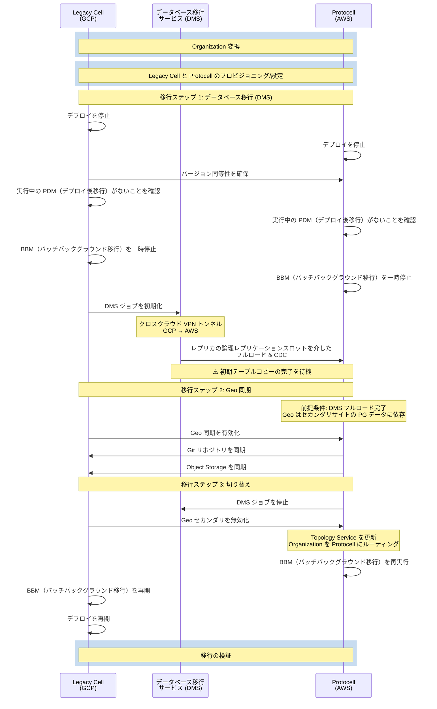

## 概要

コホート 0 は、Legacy Cell から Protocell への 100 のトップレベルグループ（TLG）の初期移行を表します。まず 100 の TLG が Organization に変換され（1:1 マッピング）、次にこれらの Organization が Protocell に移行されます。
このコホートは、後続のコホートで使用される移行パターンを確立・検証するための基盤として機能します。

**注意**: コホート 0 にはテストアカウントとテストユーザーのみが含まれるため、ロールバック計画や Legacy Cell に戻す計画はありません。移行は前進のみの繰り返し可能なプロセスとして設計されており、複数回テストできます（プロビジョニング、移行、削除）。ロールバック戦略は本番データを含む後続のコホートで評価されます。

## 移行プロセス

## 移行フェーズ

### 準備ステップ 1: Organization 変換（移行の十分前）

このステップでは、選択したトップレベルグループを Organization に変換し、Organization スコープの移行機能を有効にします。100 の新規作成されたテスト TLG を 1:1 マッピングで 100 の Organization に変換します。

手順:

1. **100 TLG を 100 Organization に変換（1:1 マッピング）** - Organization 変換プロセスの詳細については、[../organization/index.md](../organization/index.md) を参照してください。

### 準備ステップ 2: Protocell のプロビジョニングと設定（移行の十分前）

このステップでは、Protocell をプロビジョニングし、移行のために両方の Cell で Geo を設定します。これは移行ウィンドウよりも十分前に完了します。

1. **DDL ロック日付範囲を設定** [`database_upgrade_ddl_lock.yml`](https://gitlab.com/gitlab-org/gitlab/blob/22cc389a054b0920a6182f2a58b242f97fa6f948/config/database_upgrade_ddl_lock.yml) で移行ウィンドウ中の DDL ステートメントを防ぐ

**Protocell:**

1. **Protocell をプロビジョニング** Geo（Geo トラッキング DB と DMS）付きで
1. **DMS フィルタークエリを設定** 転送される Organization に対して
1. **Protocell ノード名を設定**: `gitlab.yml` で `gitlab_rails['geo_node_name'] = '<site_name_here>'` を確認する
1. **db_key_base を設定**: `db_key_base` が Protocell で設定され、Legacy Cell と同じ値に設定されていることを確認する
1. **Protocell フィーチャーフラグを設定**:
   - `geo_selective_sync_by_organizations`
   - `org_migration_target_cell`

**Legacy Cell:**

1. **Legacy Cell フィーチャーフラグを設定**: `geo_selective_sync_by_organizations`
1. **メトリクスワーカーとチェックサミングを有効化** 本番環境で[フィーチャーフラグを使用](https://gitlab.com/groups/gitlab-org/-/work_items/16643)
1. **main、CI、sec データベースのレプリカをプロビジョニング** 移行プロセスをサポートするため
1. **専用データベースレプリカ（プライマリではない）に論理レプリケーションスロットを作成** このレプリカはロードバランシングに使用されず本番トラフィックを受け取りませんが、DMS レプリケーション専用となります
1. **セカンダリサイトを追加**（API または管理者経由）しますが、まだ Geo 同期は有効化しません
1. **Organization リストを追加**（API または管理者経由）しますが、まだ Geo 同期は有効化しません

### 移行ステップ 1: データベース移行（DMS）（移行ウィンドウ）

AWS Database Migration Service（DMS）を使用して、Legacy Cell から Protocell に PostgreSQL データを転送します。
この移行は GCP（Legacy Cell）と AWS（Protocell）間のクロスクラウド VPN 接続を介して行われます。

手順:

1. **両方の Legacy と Protocell で自動デプロイを停止**
1. **バージョン同等性を確認**: 両方の Cell が同じアプリケーションバージョンであることを確認し、必要に応じてデプロイして一致させる
1. **両方の Cell でデプロイ後移行（PDM）が未完了でないことを確認**
1. **両方の Cell でバッチバックグラウンド移行（BBM）を一時停止**
1. **DMS ジョブを初期化** Legacy から Protocell DB へのデータベースの同期を開始する
1. **DMS ダッシュボードを監視** ジョブの状態とエラーのため
1. **移行ステップ 2 に進む前に DMS 初期テーブルコピーの完了を待機**

主要な側面:

- 選択的移行のための Organization レベルフィルタリング
- 3 つのデータベースクラスター（main、ci、sec）を移行 - これらの DB は Rails モノリスが使用
- レプリカの論理レプリケーションスロットを使用したフルロード（フィルタリングを含む）と継続的なレプリケーション（CDC）
- クロスクラウド VPN が安全な暗号化トンネルを提供（GCP HA VPN → AWS Transit Gateway）
- 目標スループット: 6-9 MB/s
- 並行テーブル読み込み（16 テーブルを同時）
- データは移行プロセスを通じてコピーされる
- **Geo 同期は移行ステップ 2 で開始する前に初期テーブルコピーが完了している必要がある**

DMS 移行戦略の詳細については、DMS ブループリント（文書化予定）を参照してください。

### 移行ステップ 2: Geo 同期（移行ウィンドウ）

[Geo 機能](https://docs.gitlab.com/administration/geo/)を活用して、Git リポジトリと Object Storage データを Protocell に選択的に同期します。

手順:

1. **移行ステップ 1 の DMS 初期テーブルコピーが完了していることを確認**
1. **Legacy Cell で以前追加されたサイトの Geo 同期を有効化**
1. **ステータスとエラーのために Geo ダッシュボードを監視**
1. **Legacy Cell でのすべてのチェックサムエラーを解決** 参考: [Geo 同期と検証のトラブルシューティング](https://docs.gitlab.com/administration/geo/replication/troubleshooting/synchronization_verification)

主要な側面:

- Git リポジトリデータを Protocell に同期
- Object Storage（アップロード、アーティファクトなど）を Protocell に同期
- カットオーバーまで増分同期が継続
- **注意**: Container Registry はコホート 0 のスコープ外です。テスト Organization は Container Registry イメージをアップロードしないでください。

### 移行ステップ 3: 切り替え（移行ウィンドウ）

移行を完了し、Protocell にトラフィックをルーティングするための最終手順。

手順:

1. **DMS ジョブを停止** して Protocell での PG データのレプリケーションを終了
1. **Geo セカンダリを無効化** して Geo レプリケーションを停止（Legacy Cell の管理インターフェースまたは API 経由）
1. **Topology Service を更新** して、転送された Organization が Protocell にルーティングされるように Organization マッピングを変更
1. **Protocell で バッチバックグラウンド移行（BBM）を再実行**
1. **Legacy Cell で BBM を再開**
1. **Legacy Cell でデプロイを再開**

### 検証

移行が成功したことを確認します。

手順:

1. **テスト Organization の手動テスト**: Git リポジトリアクセスとプロジェクト機能、アップロード、エクスポートなど。
1. **アカウントアクセスとログイン**: ルーティングを検証

## モニタリング

### PostgreSQL データレプリケーション（DMS）

AWS DMS は CloudWatch を通じてモニタリング機能を提供します。これらのメトリクスをテナント Grafana インスタンスで利用可能にし、ダッシュボードを作成するために、[GitLab Dedicated Instrumentor CloudWatch エクスポーター設定](https://gitlab.com/gitlab-com/gl-infra/gitlab-dedicated/instrumentor/-/blob/main/aws/jsonnet/kube-stack-chart-mixins/cloudwatch-exporter.libsonnet?ref_type=heads)を更新します:

- **レプリケーションメトリクス**:
  - `CDCLatencySource`: ソースとレプリケーション間のラグ（秒）
  - `CDCLatencyTarget`: レプリケーションとターゲット間のラグ（秒）
  - `FullLoadThroughputBandwidthTarget`: データ転送スループット（KB/s）
  - `FullLoadThroughputRowsTarget`: 行転送レート（行/s）
- **タスクメトリクス**:
  - タスクの状態と進捗
  - テーブル統計（ロード済み、ロード中、キュー済み、エラー）
  - レプリケーションスロットラグ（論理レプリケーションの場合）

### Git & Object Storage レプリケーション（Geo）

Geo は複数のインターフェースを通じて包括的なモニタリングを提供します:

#### 管理 UI ダッシュボード

- プライマリサイトの管理エリア（管理 > Geo > サイト）
- リアルタイムの同期ステータス
- Organization ごとのレプリケーション進捗

#### Geo ダッシュボード（Grafana）

Prometheus メトリクスを使用して Geo ダッシュボードを作成します:

- **一般的な Geo メトリクス**:
  - `geo_cursor_last_event_id`: 最後に処理されたイベントログ ID
  - `geo_cursor_last_event_timestamp`: 最後に処理されたイベントのタイムスタンプ
  - `geo_db_replication_lag_seconds`: データベースレプリケーションラグ
- **データタイプごとのメトリクス**（例: `project_repositories`、`lfs_objects`）:
  - `geo_<type>`: プライマリ上の合計数
  - `geo_<type>_synced`: 正常に同期された数
  - `geo_<type>_failed`: 失敗した同期数
  - `geo_<type>_verified`: 正常に検証された数

## 成功基準

コホート 0 は以下の場合に成功とみなされます:

1. すべての 100 TLG が正常に Organization に変換されている
2. コホート 0 の Organization のすべての Git リポジトリと Object Storage データが Protocell に同期されている
3. コホート 0 の Organization のすべての PostgreSQL データがゼロデータ損失で移行されている
4. データ整合性の検証が通過している（行数、チェックサム）
5. すべてのバッチバックグラウンド移行が Protocell で正常に完了している
6. Organization が Protocell で運用されている
7. 移行結果が将来のコホートのために文書化されている

## 参考資料

- [Organization 移行概要](index.md)
- [Organization 変換プロセス](../organization/index.md)
- DMS 移行ブループリント（文書化予定）
