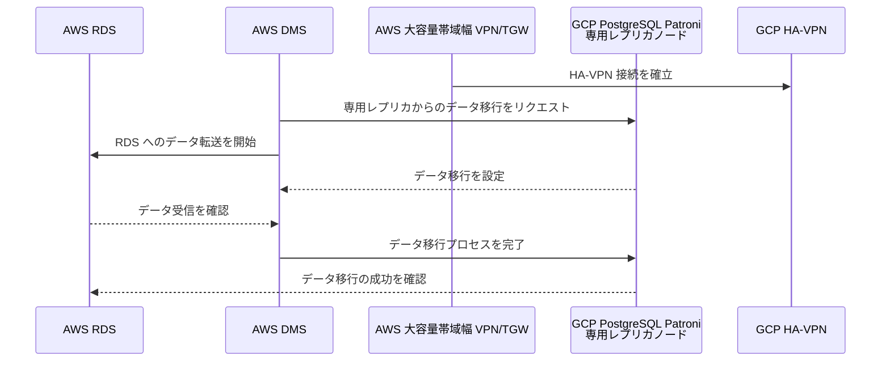
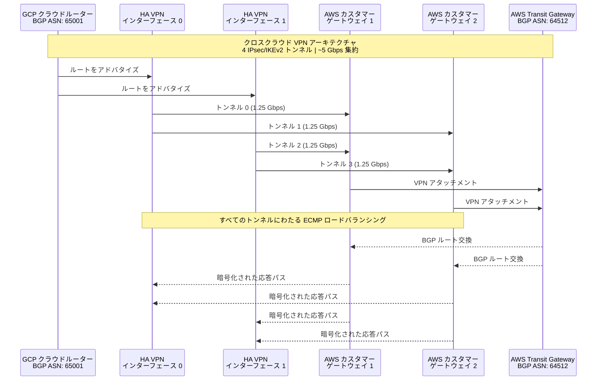
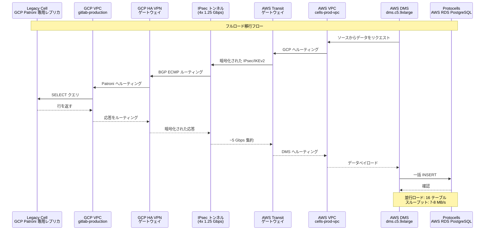

## 概要

このブループリントは、Google Cloud Platform（GCP）の Legacy Cell から Amazon Web Services（AWS）上で動作する新しい Cell アーキテクチャへ GitLab の Organization データを移行するコホート A の戦略を概説します。GCP の Patroni クラスターに追加された専用レプリカノードから Protocells（AWS RDS インスタンス）に PostgreSQL データを移行します。移行には AWS Database Migration Service（DMS）を活用します。これは、データ転送のための安全な暗号化トンネルを提供する、GCP と AWS 間ですでに確立されたクロスクラウド VPN 接続によって可能となります。

> [!note]
> **レプリケーション戦略:** 当初は[スタンバイレプリカ](https://gitlab.com/gitlab-com/gl-infra/tenant-scale/tenant-services/team/-/work_items/351)での論理レプリケーションスロットを評価しましたが、`hot_standby` バキュームの肥大化の懸念と、DDL の変更が移行されないという制限（DMS はレプリカに監査テーブルを作成できない）に直面しました。次に[プライマリノードでの論理レプリケーション設定](https://gitlab.com/gitlab-org/database-team/team-tasks/-/work_items/585)を検討し、その評価とフォローアップ分析（[注](https://gitlab.com/gitlab-org/database-team/team-tasks/-/issues/585#note_3105418538)）に基づき、論理レプリケーションに専用の Patroni スタンバイレプリカを使用することに収束しました。現在の計画は、既存の Patroni クラスターに専用レプリカノードを追加し、そのレプリカで CDC 用の論理レプリケーションスロットを設定することです。これにより、`hot_standby` の問題を回避しながら、レプリケーショントラフィックとスロット管理を本番プライマリから隔離できます。このアプローチの一環として、DMS 経由の DDL レプリケーションには**依存しません**。代わりに、移行ウィンドウ中に移行する Organization の DDL フリーズを強制し、DML 書き込みは継続して論理レプリケーション経由でキャプチャできるようにします。

このドキュメントは、最初のコホートの Organization データ移行の基礎的な参考資料として機能し、後続のコホートに適用できる繰り返し可能なパターンを確立します。将来の移行には Siphon などの代替ツールも評価していますが、コホート A には DMS が選択されたアプローチです。

## ゴール

この移行の主要な目標は以下のとおりです:

- 専用 GCP Patroni レプリカノードから AWS Protocells RDS インスタンスに PostgreSQL データを正常に移行する
- データを安全に転送するために既存のクロスクラウド VPN インフラ（AWS Transit Gateway に接続された GCP HA VPN）を活用する
- フルロードフェーズ中に約 6-9 MB/s の一貫したデータ転送レートを達成する。この見積もりは、単一の VPN トンネルを使用して 20GB を 2 時間で転送した（〜2.78 MB/s）PoC 結果に基づいています。大型 VPN へのアップグレード（ECMP ロードバランシングなしの 2 トンネルから 4 トンネルへ）により、すべてのネットワークホップと ECMP ロードバランシングを考慮すると、スループットが 6-9 MB/s に増加すると見積もっています。
- 将来のコホート移行に使用できる繰り返し可能かつ十分に文書化された移行パターンを作成する
- 転送中のデータ損失または破損がないことを確保するために、移行前と移行後の両方でデータ整合性を検証する

### スコープ

このブループリントは以下の領域をカバーします:

- クロスクラウドネットワークの構造（AWS Large VPN/Transit Gateway に接続する GCP HA VPN）
- AWS DMS を設定して移行を実行する方法
- 移行のためのソースデータベース（専用 GCP Patroni レプリカノード）とターゲットデータベース（AWS RDS）の両方の準備方法
- 移行プロセスのモニタリング、結果の検証、移行完了の判断方法

### スコープ外

このブループリントはカバーしません:

- マルチクラウド操作に必要なアプリケーションレベルの変更
- DNS カットオーバーと新しいインフラへのトラフィックルーティング
- PostgreSQL 以外の Organization データストアの移行

## 要件

この移行を成功させるために、いくつかの主要な要件を満たす必要があります:

**ネットワークとパフォーマンス**: データを効率的に移動するために、GCP と AWS 間で最低 3-5 Gbps の持続スループットが必要です。クラウド間 VPN インフラがこの容量を処理できる必要があります。

**時間ウィンドウ**: フルロード移行を完了するために 12-18 時間のウィンドウがあります。この見積もりは[PoC 結果](https://gitlab.com/gitlab-com/gl-infra/tenant-scale/tenant-services/team/-/work_items/329#note_2986582882)と計画されたインフラのアップグレードから導出されています:

- PoC ベースライン: dms.c5.xlarge を使用して 20GB を 2 時間で移行 = 10GB/時間（〜2.78 MB/s）
- dms.c5.9xlarge へのアップグレードにより 12Gbps のネットワークベースラインが提供されますが、クロスクラウド VPN は〜5 Gbps に制限されています（4 トンネル × 1.25 Gbps 各）
- 期待される改善: dms.c5.9xlarge で〜3x スループット増加、〜9 MB/s を実現
- 追加の最適化: MaxFullLoadSubTasks をデフォルトの 8 から 16 に増加することで、8 テーブルの代わりに 16 テーブルを同時にロードでき、移行時間をさらに短縮
- 組み合わされた最適化により、12-18 時間のウィンドウ内に移行を完了できるはず

**データ整合性**: すべてのデータ行が正確に転送される必要があります。転送中に何も破損または損失していないことを確認するために、ソースとターゲット間でチェックサムが一致することを検証します。

**ソースの隔離**: 移行は、本番プライマリや本番トラフィックを処理している既存のレプリカからではなく、移行目的のために Patroni クラスターに追加された専用レプリカノードから読み取る必要があります。この専用レプリカノードにより、一貫したデータソースを提供しつつ、本番トラフィックには影響を与えないことを確保します。DBRE チームは、パフォーマンスと飽和の懸念から本番プライマリを使用しないことを推奨しています。このレプリカで CDC 用の論理レプリケーションスロットを設定します。

**移行する Organization の DDL フリーズ**: フルロード + CDC 移行ウィンドウ中に、DML 書き込みは論理レプリケーション経由でキャプチャ・レプリケーションできるよう継続しながら、ソース上の影響を受ける Organization に対して DDL フリーズ（スキーマ変更なし）を強制します。

**並行 Organization 転送**: DMS タスクごとにいくつの Organization を同時に転送できるかを決定する必要があります。[分析](https://gitlab.slack.com/archives/C06TF40SAG4/p1769172175936049)に基づき、まだ戦略を最終決定しています。定義が必要な主な制約は、DMS ジョブあたりの組織の最大数とジョブあたりのプロジェクトの最大数です。

**シャーディングキー**: Organization データ移行のコンテキストでは、4 つのシャーディングキータイプが重要です:

- `organizations` ID（コホートあたりちょうど 1 つ）
- `namespaces` ID（Organization あたり 1〜無制限）
- `projects` ID（名前空間あたり 1〜無制限）
- `users` ID（Organization あたり 1〜無制限）

これらのキーは、移行フィルタリングのためのデータのセグメント化方法（例えば、どのプロジェクトと名前空間が特定の Organization に属するか）と、爆発半径と並行性の制限について推論する方法を決定します。

最適化戦略にはさらに以下が含まれます:

- バッチ選択のための org/project ID を含むフィルターテーブルを使用した事前移行ステージング
- 1 つの大きなフィルタリングされたタスクの代わりに複数の小さな DMS タスクを使用したパーティション化された移行
- 大規模な IN 句の代わりに連続した ID に対して `WHERE project_id BETWEEN x AND y` を使用した範囲ベースのフィルタリング

これらの制限は、本番移行の前に実際のデータ量でテストして検証する必要があります。

**セキュリティ**: クラウド間を渡るすべてのデータは VPN トンネルを使用して暗号化される必要があります。暗号化されていないデータがインターネットを通過してはなりません。

**モニタリング**: 移行の進捗、スループット、発生したエラーのリアルタイムの可視性が必要です。

**繰り返し可能性**: 車輪の再発明なしに後続のコホートで繰り返せるよう、プロセスが十分に文書化されている必要があります。

## 非ゴール

私たちが明示的に達成しようとしていないこと:

- Change Data Capture（CDC）によるゼロダウンタイム移行（確かではありませんが、_将来の考慮事項になるかもしれません_）
- クラウド間の双方向または継続的なレプリケーション
- 本番プライマリデータベースからの直接移行

---

## アーキテクチャ概要

### 移行フローの理解

技術図面に入る前に、移行中に高レベルで何が起こるかを理解しましょう。AWS DMS がオーケストレーターとして機能します。VPN トンネルを通じて専用の GCP Patroni レプリカノードに接続し、複数のテーブルからデータを並行して読み取り、そのデータを AWS RDS インスタンスに書き込みます。VPN は、すべてのデータがクラウド間を移動するための安全な暗号化パスを提供します。DMS は、ソースからの読み取り、必要に応じたデータの変換、最適化された方法でのターゲットへの書き込みの複雑さを処理します。

### 高レベルの移行アーキテクチャ

この図は移行に関与する主要なコンポーネントとそれらの通信方法を示しています:



### クロスクラウド VPN アーキテクチャ

GCP と AWS 間のネットワーク接続は、高度な VPN セットアップ上に構築されています。GCP のクラウドルーター（ルーティングを管理するために [BGP](https://en.wikipedia.org/wiki/Border_Gateway_Protocol) を使用）は、4 つの別々の [IPsec](https://en.wikipedia.org/wiki/IPsec) トンネルを通じて AWS の Transit Gateway に接続します。これらのトンネルは GCP 側の 2 つの HA VPN インターフェースと AWS 側の 2 つのカスタマーゲートウェイに分散されます。この冗長性により、1 つのトンネルが失敗しても、トラフィックは自動的に他のトンネルを通じて再ルーティングされます。ECMP（Equal-Cost Multi-Path）ルーティングを持つ BGP はすべての 4 つのトンネルにわたってトラフィックを負荷分散し、トンネルあたり約 1.25 Gbps、合計 5 Gbps の集約容量が得られます。



**主要な VPN 設定の詳細:**

GCP 側には、[BGP](https://en.wikipedia.org/wiki/Border_Gateway_Protocol) ASN 65001 を使用してルートをアドバタイズするクラウドルーターを持つ HA VPN ゲートウェイがあります。AWS 側には、BGP ASN 64512 と冗長性のための 2 つのカスタマーゲートウェイを持つ Transit Gateway があります。4 つのトンネルは高可用性を提供し、1 つが失敗しても他のトンネルは動作を継続します。すべてのトラフィックは AES-256-GCM を使用した IKEv2 で暗号化され、強力な暗号化標準です。ECMP を持つ BGP は利用可能なすべてのトンネルにわたってトラフィックを自動的に分散し、5 Gbps の最大容量を得られます。

### AWS DMS 移行フロー

この図は、専用の GCP Patroni レプリカノードから AWS RDS インスタンスまでの完全なデータパスを示しています。DMS がデータを必要とする際、VPN トンネルを通じてクエリを送信します。データは同じ暗号化されたトンネルを通じて戻ってきて RDS に書き込まれます。DMS は複数のテーブルから並行して読み取ることができ（16 テーブルを同時に使用）、スループットを最大化し、複数のトンネルを通じてトラフィックを流すことで全体的な移行を高速化します。データセット全体がこのパスを通過し、DMS がオーケストレーションと最適化を担当します。



---

## 設計と実装の詳細

### ソースデータベース: 専用 Patroni レプリカノード

本番プライマリデータベースや本番トラフィックを処理している既存のレプリカから直接移行しません。代わりに、移行目的専用のレプリカノードを既存の Patroni クラスターに追加します。このアプローチにはいくつかの重要なメリットがあります:

1. **本番の隔離**: 専用レプリカノードは本番読み取りトラフィックを処理するレプリカとは別であり、移行 I/O が本番システムに影響しないことを確保します
2. **論理レプリケーション設定**: 本番プライマリや他のレプリカに影響を与えることなく、この専用レプリカで論理レプリケーションを設定できます
3. **柔軟性**: 専用ノードは移行ワークロードに適したサイズに設定でき、移行完了後に廃止できます
4. **既存インフラへの影響なし**: Patroni クラスターに新しいレプリカを追加することで、プライマリや既存のレプリカへの変更は不要です

専用レプリカノードは既存の Patroni クラスターに追加され、他のレプリカと同様にプライマリからデータをストリームします。GCP VM 上で動作し、DMS からの読み取りワークロードを処理するのに十分なメモリがあります。ストレージは最適な読み取りパフォーマンスのために SSD でプロビジョニングされ、GCP VPC 内のプライベートネットワークに存在します。DMS 移行ユーザーのみがこのレプリカにアクセスでき、そのユーザーは読み取り専用権限を持ちます。移行コホートが完了したら、この専用レプリカをクラスターから削除できます。

### ターゲットデータベース: AWS Aurora PostgreSQL

ターゲットは AWS で動作する RDS PostgreSQL クラスターです。RDS は高可用性と自動スケーリングを提供するマネージドデータベースサービスです。DMS からの一括挿入を処理するのに十分なコンピューティングとメモリを提供するインスタンスクラスを決定する必要があります。RDS のストレージは自動スケールするため、すべてのストレージを事前に割り当てる必要はありません。高可用性のためにマルチ AZ デプロイメントを有効にしており、クラスターは cells-prod-vpc 内のプライベートサブネットに存在します。

### DMS タスク設定

DMS タスクは移行の動作方法を定義します。これは一回限りのコピーで継続的なレプリケーションはないため、フルロード移行タイプを使用しています。DMS を設定して最大 16 テーブルを並行してロードし、DMS インスタンス（c5.9xlarge）のリソース制限内でスループットを最大化します。テキストフィールドなどの大きなオブジェクト（LOB）には、パフォーマンスと大きなデータの適切な処理のバランスを取るために、64KB しきい値の制限モードを使用します。複数の挿入をグループ化して書き込みパフォーマンスを向上させるバッチ適用を有効にします。移行開始前に pg_dump を使用してスキーマを事前に作成するため、ターゲットテーブルの準備は DO_NOTHING に設定します。最後に、一括挿入に最適化された 50,000 行のコミットレートを設定します。

**データフィルタリング戦略:**

DMS ソースフィルターにより、特定の Organization を選択的に移行できます。主な考慮事項:

1. **単一タスクに複数組織 vs 組織ごとに 1 タスク**: 単一タスクに複数の Organization を使用する（IN 句または複数のフィルター条件経由）と、管理するタスクが少なく、レプリケーションインスタンスのオーバーヘッドが低くなりますが、単一障害点が生じます。つまり、タスクが失敗すると、そのバッチのすべての組織が影響を受けます。Organization ごとに 1 タスクにすると、個々の組織を独立して一時停止、再開、または再試行できる詳細な制御が得られますが、管理オーバーヘッドが増加します。

2. **フィルター実行位置**: フィルターはデータ転送後ではなく、ソースクエリレベルで適用されます。DMS は SELECT クエリに WHERE 句を追加し、フィルター条件がインデックスを使用するほど選択的であれば、すべてのデータを転送するよりもパフォーマンスが大幅に向上します。

3. **クエリロジックの制限**: フィルタリングが最適に適用されない場合があります。特に複雑なクエリや特定のデータタイプで発生します。範囲ベースのフィルタリング（`WHERE project_id BETWEEN x AND y`）は、連続した ID の大規模な IN 句よりも通常パフォーマンスが良くなります。

4. **フィルター設定の例**: Organization ベースのフィルタリングでは、タスク設定に以下を含む場合があります:

```json
{
  "rules": [
    {
      "rule-type": "selection",
      "rule-id": "1",
      "rule-name": "org-filter",
      "object-locator": {
        "schema-name": "public",
        "table-name": "projects"
      },
      "rule-action": "include",
      "filters": [
        {
          "filter-type": "source",
          "column-name": "organization_id",
          "filter-conditions": [
            {
              "filter-operator": "ste",
              "value": "100"
            }
          ]
        }
      ]
    }
  ]
}
```

### 移行中の DDL の処理

この移行では、DMS を通じた DDL レプリケーションに意図的に依存しません。DMS は一部の DDL ステートメントをレプリケートできますが、サポートは不完全であり、サポートされていないまたはフィルタリングされた DDL が移行の途中で適用された場合にターゲット上のスキーマの状態が一致しなくなる可能性があります。代わりに:

- PostgreSQL データ移行を DML のみのフルロード + CDC として扱います。
- 移行ウィンドウ中、移行する Organization に**DDL フリーズ**を適用します（移行対象のオブジェクトに影響する `CREATE TABLE`、`ALTER TABLE`、`DROP TABLE`、その他のスキーマ変更はなし）。
- DML 書き込み（INSERT/UPDATE/DELETE）は移行する Organization で継続を許可します。これらは専用の Patroni レプリカの論理レプリケーションスロット経由でキャプチャされ、ターゲットに適用されます。

このアプローチにより、移行の爆発半径が縮小し、スキーマの進化が明示的かつ制御されたものになり、[!17967](https://gitlab.com/gitlab-com/content-sites/handbook/-/merge_requests/17967#note_3106206581) の DDL/CDC の議論で文書化された決定と整合します。

### 移行前チェックリスト

移行を開始する前に、ソースとターゲットの両方のデータベースを準備し、ネットワークの準備ができているかを確認する必要があります。以下では**自動化**と**手動**の手順を区別します。

**ソース（専用 GCP Patroni レプリカノード）- 混合:**

Patroni クラスターへの専用レプリカノードの追加は、移行開始時間に可能な限り近いタイミングで実行されます。レプリカはプライマリからデータをストリームし、移行の準備が整うまで同期を維持します。次に、すべてのテーブルへの SELECT 権限を持つ専用の DMS 移行ユーザーを作成します。このユーザーはセキュリティのために最小限の権限を持つべきです。論理レプリケーションを使用する場合、この専用レプリカで必要なレプリケーションスロットを設定します。DMS インスタンスが VPN トンネルを通じてレプリカに実際に到達できることを接続をテストして確認します。最後に、すべてのテーブルの行数を文書化し、同じ数の行がターゲットに届いていることを検証できるようにします。

**ターゲット（AWS Protocells RDS）- 混合:**

RDS クラスターは適切なセキュリティグループとサブネット設定（自動化）を使用して Terraform 経由で作成されます。DMS がデータの書き込みを開始する前に、テーブル構造、インデックス、制約がすでに適切な場所にあることを確保するために、ソースデータベースからフラグ -s（スキーマのみ）で pg_dump を使用して手動でスキーマを事前に作成します。外部キー制約とトリガーは、一括挿入を遅くしてデータが順序外に到着した場合にエラーを引き起こす可能性があるため、移行中に無効化します。すべてのテーブルへの書き込み権限を持つ DMS 移行ユーザーを作成します。

**ネットワーク検証 - 混合:**

GCP と AWS 間のクロスクラウド VPN ピアリングには、コンソールを通じた手動の介入または調整が必要な場合があります。インフラの大部分を自動化していますが、手動で対応が必要なエッジケースがある場合があります。セットアップでは GCP BGP 動的ルーティング（GCP HA VPN に必要）を使用しており、静的ルーティングアプローチとは異なります。Dedicated チームの IPSec VPN セットアップが GCP に適応できるかどうかを検討しており、Instrumentor でのクロスクラウドピアリングが簡素化されます。

すべての 4 つの VPN トンネルが UP 状態であることを確認します。両側から BGP ルートが正しくアドバタイズされていることを確認します。利用可能な実際の帯域幅をテストするために iperf3 を実行します。5 Gbps を目標としていますが、_実際の帯域幅は約 3-5 Gbps になる可能性があります。_ 最後に、DMS インスタンスが接続をテストしてソースとターゲットの両方のデータベースに到達できることを確認します。

---

## DMS 移行前評価

- データベースサイズとテーブルごとの分布を取得する
- 5 Gbps の帯域幅を検証する（GCP <> AWS）
- 1-2 の小さいテーブルで移行をテストして接続とスループットを確認する
- 専用レプリカノードが DMS 読み取り負荷の容量があることを確認する
- ターゲットスキーマが事前作成され、FK 制約とトリガーが無効化されていることを確認する

---

## 検証戦略

### 移行中

移行が実行中の間、DMS の CloudWatch メトリクスを継続的にモニタリングして進捗を追跡します。スループット（1 秒あたりの行数と MB）をウォッチして、12-18 時間のウィンドウ内に完了するペースであることを確認します。ネットワーク問題を検出するためにレイテンシを監視します。データの破損や接続の問題を示す可能性があるテーブルの失敗やエラーをウォッチします。スループットが予想されるレベルを下回った場合やエラーが発生した場合にすぐに警告するように CloudWatch アラームを設定します。

DMS のモニタリングを観測スタックと統合するために、CloudWatch メトリクスを Prometheus に配信する CloudWatch エクスポーターが必要になります。これにより、既存のテナントモニタリングとともに Grafana ダッシュボードで可視化できます。CloudWatch メトリクスを観測プラットフォームにブリッジするためのカスタムツールが必要になる場合があります。

完了したテーブルと進行中のテーブルを追跡します。テーブルが失敗した場合、DMS は通常中断した場所から再起動できますが、これを注意深く監視する必要があります。ソースとターゲットデータベースがボトルネックになっていないかリソース不足になっていないかもモニタリングします。

### 移行後

移行が完了したら、データ整合性を確認するための包括的な検証クエリを実行します。

まず、ソースとターゲットの両方で行数の検証を実行します:

```sql
-- 行数の検証（ソースとターゲットの両方で実行）
SELECT schemaname, relname, n_live_tup 
FROM pg_stat_user_tables 
ORDER BY n_live_tup DESC;
```

このクエリは各テーブルの生きた行数を示します。ソースとターゲット間でカウントが一致すれば、移行は成功です。

大きなテーブルについては、データが破損していないことを確認するためにチェックサムの検証を実行します:

```sql
-- チェックサムの検証（大きなテーブルをサンプリング）
SELECT md5(string_agg(md5(t::text), '')) 
FROM (SELECT * FROM table_name ORDER BY id LIMIT 100000) t;
```

このクエリはデータのチェックサムを計算します。ソースとターゲット間でチェックサムが一致すれば、データは同一です。

ビジネスの観点からデータが意味をなすことを確認するために、アプリケーションレベルの検証も実行します。例えば、すべての外部キー関係が intact であること、シーケンスが正しい値にあること、計算された列やビューが期待された結果を返すことを確認します。

検証が完了して移行が成功したら、Patroni クラスターから専用レプリカノードを削除できます。

### モニタリング

移行を通じていくつかの主要なメトリクスを追跡します:

**FullLoadThroughputRowsSource**: このメトリクスは DMS がソースから 1 秒あたり何行読み取っているかを示します。少なくとも 1000 行/秒を期待しています。これを下回った場合、ネットワークまたはソースデータベースの問題を調査します。

**FullLoadThroughputRowsTarget**: このメトリクスは DMS がターゲットに 1 秒あたり何行書き込んでいるかを示します。ソースのスループットと一致することを期待しています。低い場合は、ターゲットデータベースがボトルネックになっている可能性があります。

**VPN トンネルの状態**: 4 つの VPN トンネルすべての状態をモニタリングします。トンネルが DOWN になった場合、すぐに調査して移行の再起動が必要かもしれません。

**DMS タスクの状態**: DMS タスクの全体的な状態をモニタリングします。エラー状態に入った場合、調査して再起動が必要かもしれません。

**ネットワークスループット**: GCP と AWS 間の実際のネットワークスループットをモニタリングして、期待される 3-5 Gbps を達成していることを確認します。

### ロールバック戦略

DMS には「ロールバック」の概念が実質的にはありません。ロールバックするものがなく、ソースが最初から変更されていないためです。
DMS はソースから何も削除しません。専用の Patroni レプリカノードは、移行が完了した後もすべてのデータを完全に intact なまま維持します。
単にソースから読み取り、ターゲットに書き込むだけで、本質的に「移動」操作ではなくレプリケーションツールとして機能します。

---

## セキュリティの考慮事項

クラウド間でデータを移動する際のセキュリティは最重要です。すべてのクロスクラウドトラフィックは IKEv2 暗号化を使用した [IPsec](https://en.wikipedia.org/wiki/IPsec) VPN トンネルを使用して暗号化されます。DMS インスタンスはパブリックインターネットアクセスのないプライベートサブネットで実行されるため、VPN トンネリングを通じてのみソースとターゲットに到達できます。データベースの認証情報は、AWS 側の AWS Secrets Manager と GCP 側の GCP Secret Manager に安全に保存できます。DMS 移行ユーザーは必要最小限の権限を持ち、ソースへの読み取り専用とターゲットへの書き込み専用です。本番データベースの認証情報を使用せず、代わりに制限された権限を持つ専用の移行ユーザーを作成します。

また、専用レプリカノードが本番トラフィックから隔離され、DMS インスタンスのみがアクセスできることを確保します。移行ユーザーアカウントへのすべてのアクセスをモニタリングして、不正なアクティビティを検出します。

---

## 将来の考慮事項

この移行は後続のコホートに再利用するパターンを確立します。DMS タスクの作成を自動化する Terraform モジュールを構築する計画であり、将来のコホートの移行をより速く容易にします。次のコホートのための代替移行ツールとして [Siphon](/handbook/engineering/architecture/design-documents/siphon/) も評価しており、特定のシナリオでより良いパフォーマンスや機能を提供する可能性があります。

非常に大きな移行については、VPN よりも高い帯域幅と低いレイテンシを提供する AWS Dedicated Interconnect へのアップグレードを検討するかもしれません。

**論理レプリケーションサポート**: [プライマリノード評価](https://gitlab.com/gitlab-org/database-team/team-tasks/-/work_items/585)とフォローアップ分析（[注](https://gitlab.com/gitlab-org/database-team/team-tasks/-/issues/585#note_3105418538)）に基づき、将来のイテレーションでは、移行ウィンドウ中に移行する Organization のソース側に明示的な DDL フリーズを設けながら、CDC（Change Data Capture）に専用レプリカノードで設定された PostgreSQL 論理レプリケーションスロットを使用するパターンを構築します。

---

## 参考資料

- [AWS DMS ドキュメント](https://docs.aws.amazon.com/dms/latest/userguide/Welcome.html)
- [GCP HA VPN ドキュメント](https://cloud.google.com/network-connectivity/docs/vpn/concepts/ha-vpn)
- [AWS Transit Gateway ドキュメント](https://docs.aws.amazon.com/vpc/latest/tgw/what-is-transit-gateway.html)
- [内部: 移行 PoC 結果](https://gitlab.com/gitlab-com/gl-infra/tenant-scale/tenant-services/team/-/issues/329)
- [内部: クロスクラウドピアリング VPN セットアップ](https://gitlab.com/gitlab-com/gl-infra/tenant-scale/tenant-services/team/-/issues/335)
- [内部: スタンバイレプリカ評価](https://gitlab.com/gitlab-com/gl-infra/tenant-scale/tenant-services/team/-/work_items/351)
- [内部: プライマリノード評価](https://gitlab.com/gitlab-org/database-team/team-tasks/-/work_items/585)
