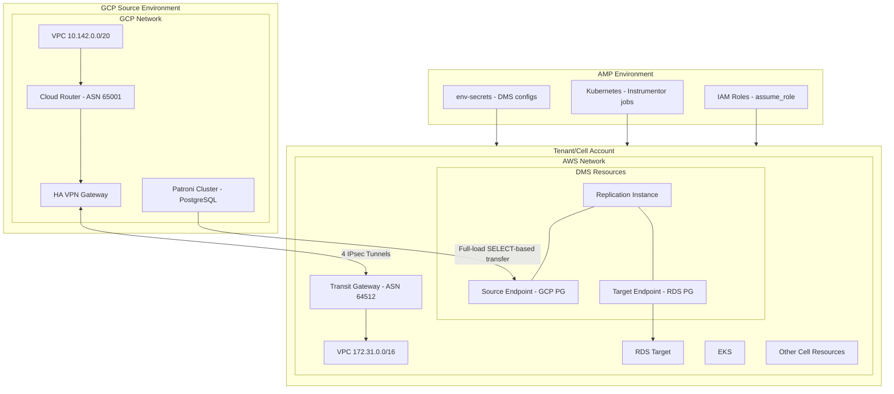

## 概要

この設計ドキュメントでは、AWS Database Migration Service（DMS）をGitLab Dedicatedのインフラツール（[Instrumentor](https://gitlab.com/gitlab-com/gl-infra/gitlab-dedicated/instrumentor)、[AMP](https://gitlab.com/gitlab-com/gl-infra/gitlab-dedicated/amp)、[Tenant Model Schema](https://gitlab.com/gitlab-com/gl-infra/gitlab-dedicated/tenant-model-schema)）に統合し、GCPホストのPatroniクラスターからAWSホストのCellsへのOrganizationデータベースレプリケーションを自動化することを提案します。

> [!note]
> このドキュメントでは、「Cell」とは複数の顧客が単一テナントを通じてサービスを受けるGitLab.comの一部として構成されたGitLabインスタンスを指します。CellはDedicatedテナントインフラ上に構築されており、すべてのCellはテナントです。一貫性のために、このドキュメント全体を通じて「Cell」を使用します。Cellsの用語詳細については、[Cellsグロッサリー](../cells/goals.md#glossary)を参照してください。

## 動機

[Cellsアーキテクチャ](../cells/index.md)では、ユーザーと[Organizations](../cells/goals.md#organizations)を[Legacy Cell](../cells/goals.md#legacy-cell)（GCP上のPatroniクラスター/レプリカをソースとする）からAWS上のCellsへ移行する必要があります。私たちには以下の要件を満たす自動化されたデータベースレプリケーション機構が必要です。

1. 標準のCellデプロイワークフローを通じてプロビジョニング（[Cell Deployment Process](../cells/index.md#deployment-process)および[Instrumentor Stages](../cells/infrastructure/deployments.md)を参照）
2. ソース固有のパラメーターをCell単位で設定可能
3. 既存の[Instrumentor](https://gitlab.com/gitlab-com/gl-infra/gitlab-dedicated/instrumentor)ステージ経由で管理可能
4. Self-ManagedからDedicated Commercialへのインバウンドマイグレーションなど、他のシナリオでも再利用可能

AWS DMSはこの要件に適しています。GCPのVM上のPatroniクラスターを含むPostgreSQLソースからAWS上のRDS PostgreSQLターゲットへのフルロードデータ転送が可能で、従来のpgdump/restoreワークフローの代替として機能します。

Organizationマイグレーションの詳細については、[Organization Migration設計ドキュメント](/handbook/engineering/architecture/design-documents/organization-data-migration/)を参照してください。

## 目標

1. **自動化されたDMSプロビジョニング**: [Instrumentor](https://gitlab.com/gitlab-com/gl-infra/gitlab-dedicated/instrumentor)ステージを通じてCellデプロイの一部として、DMSリソース（レプリケーションインスタンス、エンドポイント、タスク）を自動的にプロビジョニングします。

2. **設定の柔軟性**: Tenant Model（Cell固有の設定）または[AMP env-secrets](https://gitlab.com/gitlab-com/gl-infra/gitlab-dedicated/amp/-/tree/main/modules/aws/env-secrets)（環境全体で共有する設定）のどちらかを通じてDMS設定をサポートします。

3. **再利用性**: CellsとDedicated Commercial（インバウンドGeoマイグレーション）の両方に対応できるよう、設計を十分に汎用的に保ちます。

4. **関心の分離**: DMSのTerraformリソースを外部モジュール（`tenant-observability-stack`と同様）として構築し、Instrumentorから独立してバージョン管理・利用できるようにします。

> [!note]
> **レプリケーション戦略:** 当初は[スタンバイレプリカ](https://gitlab.com/gitlab-com/gl-infra/tenant-scale/tenant-services/team/-/work_items/351)上の論理レプリケーションスロットを評価しましたが、`hot_standby`のバキュームブロート問題と、DDL変更が移行されないという制限（DMSはレプリカ上に監査テーブルを作成できない）が判明しました。現在は[プライマリノードへの論理レプリケーション設定](https://gitlab.com/gitlab-org/database-team/team-tasks/-/work_items/585)を調査中です。この評価が完了するまで、スタンバイレプリカ上のレプリケーションスロット、プライマリノード上のレプリケーションスロット、または論理レプリケーションスロットを使用しないSELECTベースのフルロード転送のどれを採用するかは未確定です。

### 将来の考慮事項

当面の焦点はLegacy CellからAWSホストのCellsへのOrganizationsの移行ですが、DMS統合は将来のユースケースに対しても柔軟性を持つように設計されています。

- **CellsからDedicatedへの移行**: GitLab.com上のOrganizations（レガシーまたはCells）は、同じDMSインフラを使用してDedicatedインスタンスに移行できる可能性があります
- **クロスプラットフォームのOrganizationポータビリティ**: 長期ビジョンは、[ADR-007: Self-MangedとDedicatedの単一Organization](/handbook/engineering/architecture/design-documents/organization/decisions/007_self_managed_dedicated_single_organization/)で説明されているように、異なるGitLabオファリング（Dedicated、.com、Cells、Self-Managed）間でシームレスなOrganization移行を可能にすることと一致しています

これらの将来の機能は初期実装のスコープには含まれませんが、柔軟性を維持するための設計上の意思決定に影響します。

## 対象外

1. **DMSタスク管理**: DMSレプリケーションタスクの開始、停止、監視などの運用面は別途処理します。別途DMSブループリントを用意しています。

2. **スキーママイグレーション**: DMSはデータ転送を担当します。スキーママイグレーションとアプリケーションレベルの変更はスコープ外です。

## 提案

### アーキテクチャ概要



DMSには、GCPホストのPatroniクラスター（ソース）とAWSホストのCell（ターゲット）間のネットワーク接続が必要です。これはハイブリッドクラウドVPNセットアップで実現されます。

**GCP側:**

- VPC: 専用CIDRレンジ（例: 10.142.0.0/20）でPatroniクラスターをホスト
- Cloud Router: 動的ルート交換のために[BGP](https://en.wikipedia.org/wiki/Border_Gateway_Protocol) ASN 65001で設定
- HA VPN Gateway: 高可用性のための冗長VPNトンネルを提供

**AWS側:**

- Transit Gateway: [BGP](https://en.wikipedia.org/wiki/Border_Gateway_Protocol) ASN 64512で設定されたネットワーク接続のセントラルハブ
- VPC: DMS、RDS、EKSを含むCellリソースをホスト（例: 172.31.0.0/16）

**接続性:**

- GCP HA VPN GatewayとAWS Transit Gateway間の4つの[IPsec](https://en.wikipedia.org/wiki/IPsec)トンネルが冗長で暗号化された接続を提供
- [BGP](https://en.wikipedia.org/wiki/Border_Gateway_Protocol)がクラウド間の動的ルートアドバタイズに使用される
- このセットアップにより、DMSがデータ転送のためにPatroniクラスターのプライベートIPに到達できる（論理レプリケーションスロット経由）

> [!note]
> **ネットワーク互換性:** 調査により、Dedicated AWS環境とGitLab.com GCP環境間でCIDRレンジの重複がないことが確認されており（[分析を参照](https://gitlab.com/gitlab-com/gl-infra/tenant-scale/tenant-services/team/-/issues/352#note_3057804063)）、アドレス競合なくVPN接続を確立できます。

### コンポーネント設計

#### 1. 外部Terraformモジュール: `tenant-dms`

[`tenant-observability-stack`](https://gitlab.com/gitlab-com/gl-infra/terraform-modules/observability/tenant-observability-stack)で確立されたパターンに従い、`gitlab-com/gl-infra/terraform-modules/tenant-services/tenant-dms`に新しいモジュールを作成します。

**モジュール構造:**

```plaintext
tenant-dms/
├── main/
│   ├── main.tf           # Main module composition
│   ├── variables.tf      # Input variables
│   ├── outputs.tf        # Output values
│   └── versions.tf       # Provider requirements
├── modules/
│   ├── aws/
│   |    ├── replication-instance/
│   |    ├── endpoints/
│   |    └── tasks/
|   └── aws-vpn/
|        ├── main.tf       # AWS VPN resources
|        ├── variables.tf  # Input variables (from GCP)
|        └── outputs.tf    # Tunnel IPs for GCP
└── README.md
```

マイグレーションの場合のソースはconfig-mgmtで管理される.com環境であるため、GCP側のVPN設定は[config-mgmt](https://ops.gitlab.net/gitlab-com/gl-infra/config-mgmt)の一部となります。

**主要リソース:**

- [`aws_dms_replication_subnet_group`](https://registry.terraform.io/providers/hashicorp/aws/latest/docs/resources/dms_replication_subnet_group) - DMSインスタンスのサブネットグループ
- [`aws_dms_replication_instance`](https://registry.terraform.io/providers/hashicorp/aws/latest/docs/resources/dms_replication_instance) - レプリケーションインスタンス本体
- [`aws_dms_endpoint`](https://registry.terraform.io/providers/hashicorp/aws/latest/docs/resources/dms_endpoint)（ソース） - GCP Patroni/PostgreSQLへの接続
- [`aws_dms_endpoint`](https://registry.terraform.io/providers/hashicorp/aws/latest/docs/resources/dms_endpoint)（ターゲット） - RDS PostgreSQLへの接続
- [`aws_dms_replication_task`](https://registry.terraform.io/providers/hashicorp/aws/latest/docs/resources/dms_replication_task) - フルロードマイグレーション用のタスク設定
- [`aws_security_group`](https://registry.terraform.io/providers/hashicorp/aws/latest/docs/resources/security_group) - DMS用のネットワークセキュリティ

#### 2. Instrumentor統合

適切な[Instrumentor](https://gitlab.com/gitlab-com/gl-infra/gitlab-dedicated/instrumentor)ステージにDMSモジュールの利用を追加します。

```hcl
module "tenant_dms" {
  source = "gitlab.com/gitlab-com/tenant-services/tenant-dms"

  count = var.dms.enabled ? 1 : 0

  enabled                    = var.dms.enabled
  prefix                     = var.prefix
  vpc_id                     = local.vpc_id
  subnet_ids                 = local.dms_subnet_ids
  replication_instance_class = var.dms.replication_instance_class
  allocated_storage          = var.dms.allocated_storage
  multi_az                   = var.dms.multi_az
  kms_key_arn                = module.kms_alias_resolver.key_ref["rds"]

  source_endpoint = var.dms.source_endpoint
  target_endpoint = {
    server_name   = module.get.rds_postgres_host
    port          = module.get.rds_postgres_port
    database_name = var.dms.target_database_name
    # Credentials from secrets
  }
}
```

#### 3. Tenant Model Schemaの変更

個別のトップレベル`dms`スキーマを作成する代わりに、既存の[`GeoInboundMigrationConfigSchema`](https://gitlab.com/gitlab-com/gl-infra/gitlab-dedicated/tenant-model-schema/-/blob/main/json-schemas/tenant-model.json#L1811)を拡張してDMS設定を含めます。このアプローチは以下の利点があります。

- 既存のインバウンドマイグレーション設定との重複フィールドを避ける
- `vpn_migration`で既に定義されているVPN設定を再利用する
- DMSをGeoインバウンドマイグレーションの特殊なバリアントとして扱う
- 既存のDedicatedツールパターンとの一貫性を維持する

**提案されるスキーマ拡張:**

```json
{
  "GeoInboundMigrationConfigSchema": {
    "type": "object",
    "description": "Schema for inbound migration configuration.",
    "properties": {
      "external_db_replica_host": {
        "type": "string",
        "description": "The endpoint for the external primary streaming replica."
      },
      "external_db_replica_port": {
        "type": "integer",
        "description": "The port for the external primary streaming replica."
      },
      "dms": {
        "type": "object",
        "description": "AWS DMS configuration for database migration (alternative to streaming replication).",
        "properties": {
          "enabled": {
            "type": "boolean",
            "default": false,
            "description": "Enable AWS DMS for database replication instead of streaming replication"
          },
          "replication_instance_class": {
            "type": "string",
            "default": "dms.t3.medium",
            "description": "DMS replication instance class"
          },
          "allocated_storage": {
            "type": "integer",
            "default": 50,
            "description": "Allocated storage in GB"
          },
          "multi_az": {
            "type": "boolean",
            "default": false,
            "description": "Enable Multi-AZ deployment"
          },
          "migration_type": {
            "type": "string",
            "enum": ["full-load", "full-load-and-cdc"],
            "default": "full-load",
            "description": "DMS migration type"
          },
          "target_database_name": {
            "type": "string",
            "default": "gitlabhq_production",
            "description": "Target database name for DMS replication"
          }
        }
      },
      "vpn_migration": {
        "$ref": "#/$defs/VpnMigrationSchema"
      }
    }
  }
}
```

#### 4. 設定ソース

Tenant ModelとAmpの環境シークレットという2つの設定ソースがあります。[マルチテナント環境でのSMTP認証情報の動作](https://gitlab.com/gitlab-com/gl-infra/gitlab-dedicated/team/-/blob/main/runbooks/custom-smtp.md#sharing-smtp-credentials-in-a-multi-tenant-environment)と同様に、DMSには両方を使用します。

- **Tenant Model**: DMSの有効化フラグ、インスタンスサイジング、Cell固有のソースエンドポイントオーバーライド、Cell固有の設定
- **AMP env-secrets**: 機密認証情報（パスワード）と環境全体のデフォルトのソースエンドポイント設定

これにより、環境全体のデフォルトを維持しながら、必要に応じてCell固有のオーバーライドが可能になります。

**ソースA: Tenant Model（Cell固有の設定）**

Cellごとに異なる設定については、Tenant Modelスキーマを拡張します。

```json
{
  "dms": {
    "enabled": true,
    "replication_instance_class": "dms.r5.large",
    "allocated_storage": 100,
    "multi_az": true,
    "endpoints": [
      {
        "engine_name": "postgres",
        "region": "us-east-1",
        "endpoint_id": "source-main-db",
        "endpoint_type": "source",
        "database_name": "gitlabhq_production",
        "secret_name": "main-db-qeHamH"
      },
      {
        "engine_name": "postgres",
        "region": "us-east-1",
        "endpoint_id": "source-ci-db",
        "endpoint_type": "source",
        "database_name": "gitlabhq_production",
        "secret_name": "ci-db-qeHamH"
      },
      {
        "engine_name": "postgres",
        "region": "us-east-1",
        "endpoint_id": "target-main-db",
        "endpoint_type": "target",
        "database_name": "gitlabhq_production",
        "secret_name": "main-db-qeHamH"
      },
      {
        "engine_name": "postgres",
        "region": "us-east-1",
        "endpoint_id": "target-ci-db",
        "endpoint_type": "target",
        "database_name": "gitlabhq_production",
        "secret_name": "ci-db-qeHamH"
      }
    ]
  }
}
```

**注意:** [secrets_manager_access_role_arn](https://registry.terraform.io/providers/hashicorp/aws/latest/docs/resources/dms_endpoint#secrets_manager_access_role_arn-1)はinstrumentorの一部とし、`secret_name`は[secrets_manager_arn](https://registry.terraform.io/providers/hashicorp/aws/latest/docs/resources/dms_endpoint#secrets_manager_arn-1)の構築に使用されます。

**ソースB: Ampの環境シークレット（環境全体の設定）**

環境内のすべてのCellで共有される設定（例）:

```yaml
# In AMP env-secrets
dms_source_main_db_secret_name: "main-db-qeHamH"
dms_source_ci_db_secret_name: "ci-db-qeHamH"
```

DBシークレット名はCell間で共有されます。

### 実装フェーズ

#### フェーズ1: 外部モジュール開発

1. `tenant-dms`リポジトリの作成
2. コアDMS Terraformリソースの実装
3. セマンティックバージョニングのCI/CDセットアップ

#### フェーズ2: Tenant Model Schemaの更新

1. DMS設定で[Tenant Modelスキーマ](https://gitlab.com/gitlab-com/gl-infra/gitlab-dedicated/tenant-model-schema)を更新
2. 設定オプションのドキュメント作成
3. スキーマ変更の検証

#### フェーズ3: AMP env-secretsの更新

1. [AMP env-secretsモジュール](https://gitlab.com/gitlab-com/gl-infra/gitlab-dedicated/amp/-/tree/main/modules/aws/env-secrets)にDMSシークレット変数を追加
2. 環境全体のDMSデフォルト設定
3. シークレット管理手順のドキュメント作成

#### フェーズ4: Instrumentor統合

1. [Instrumentor](https://gitlab.com/gitlab-com/gl-infra/gitlab-dedicated/instrumentor)にDMS変数を追加
2. Tenant Modelの変換用Jsonnetヘルパーを作成
3. 適切なステージにDMSモジュール参照を追加
4. DMSパーミッション用のIAMポリシーを更新

#### フェーズ5: ターゲットCell環境へのデプロイ

1. CellsDev [AMP](https://gitlab.com/gitlab-com/gl-infra/gitlab-dedicated/amp)環境でDMS設定を行う（シークレット値を渡してデプロイ）
2. DMS有効化でテストCellをプロビジョニング
3. ステージングGCPソースからのフルロード転送を検証

### セキュリティの考慮事項

1. **暗号化**: すべてのDMSリソースはKMS暗号化（該当する場合はカスタマーキー）を使用
2. **ネットワーク分離**: DMSインスタンスはプライベートサブネットにのみデプロイ
3. **認証情報管理**: ソースデータベースの認証情報（PostgreSQLのユーザー名/パスワード）はAMP env-secrets経由でAWS Secrets Managerに保存。DMSはIAM認証ではなく、VPN経由の標準データベース認証を使用してPostgreSQLに接続します。
4. **IAM最小権限**: IAMパーミッションはデータベース接続ではなく、AWSサービスレベルの操作に必要です。具体的には:
   - **DMS Service Role**: DMSがVPC内でネットワークインターフェースを作成し、ロギング/メトリクスのためにCloudWatchにアクセスし、保存時の暗号化にKMSキーを使用することを許可
   - **Instrumentor Execution Role**: TerraformがDMSリソース（レプリケーションインスタンス、エンドポイント、タスク、セキュリティグループ、事前マイグレーション評価）をプロビジョニングすることを許可
5. **SSL/TLS**: すべてのエンドポイント接続でSSLを強制

### 検討した代替案

#### 代替案1: Instrumentorへの直接実装

外部モジュールを使わず、DMSリソースをInstrumentorに直接実装します。

**メリット:**

- 初期実装がシンプル
- 外部依存関係管理が不要

**デメリット:**

- 独立したバージョン管理とテストが困難
- 確立されたパターン（tenant-observability-stack）に従わない
- 異なるユースケースへの再利用性が低い

**決定:** 関心の分離と再利用性を高めるため、外部モジュールを採用して却下されました。

#### 代替案2: スタンドアロンDMSツール

Instrumentorとは独立した、独自のデプロイパイプラインとインフラ管理を持つ完全に別のDMS管理ツールを作成します。

**メリット:**

- Dedicatedツールからの完全な独立
- 実装の柔軟性

**デメリット:**

- Instrumentorで既に確立されたインフラ管理パターンを重複させる
- 既存のCellプロビジョニングワークフローと統合しない（[Cell Deployment Process](../cells/index.md#deployment-process)を参照）
- 別個のツール管理のための追加の運用オーバーヘッド
- 集中化されたツールという[Cell Architecture and Tooling](../cells/infrastructure/cell_arch_tooling.md)の哲学と一致しない

**決定:** DMSは自動化されたCellプロビジョニングワークフローの一部であるべきため、却下されました。

### 参考資料

- [AWS DMSドキュメント](https://docs.aws.amazon.com/dms/latest/userguide/Welcome.html)
- [Instrumentorリポジトリ](https://gitlab.com/gitlab-com/gl-infra/gitlab-dedicated/instrumentor)
- [AMPリポジトリ](https://gitlab.com/gitlab-com/gl-infra/gitlab-dedicated/amp)
- [Tenant Model Schema](https://gitlab.com/gitlab-com/gl-infra/gitlab-dedicated/tenant-model-schema)
- [Tenant Observability Stack](https://gitlab.com/gitlab-com/gl-infra/terraform-modules/observability/tenant-observability-stack)（参照実装）
- [Cells Networkingブループリント](../cells/infrastructure/networking.md)
- [GeoInboundMigrationConfigSchema](https://gitlab.com/gitlab-com/gl-infra/gitlab-dedicated/tenant-model-schema/-/blob/main/json-schemas/tenant-model.json#L1811)
- [ADR-007: Self-MangedとDedicatedの単一Organization](/handbook/engineering/architecture/design-documents/organization/decisions/007_self_managed_dedicated_single_organization/)
- [CIDRレンジ調査](https://gitlab.com/gitlab-com/gl-infra/tenant-scale/tenant-services/team/-/issues/352)
- [ADR-016: クロスクラウド依存関係](../cells/decisions/016_cross_cloud_dependecies.md)
- [Dedicatedアーキテクチャ](https://gitlab-com.gitlab.io/gl-infra/gitlab-dedicated/team/architecture/Architecture.html)
- [インバウンドGeoマイグレーション](https://gitlab-com.gitlab.io/gl-infra/gitlab-dedicated/team/engineering/inbound-geo-migrations.html)
- [コンポーネントオーナーシップモデル](/handbook/engineering/infrastructure-platforms/production/component-ownership-model/)
- [Cell Architecture and Tooling](../cells/infrastructure/cell_arch_tooling.md)
- [Cellsインフラ](../cells/infrastructure/index.md)
- [Organizationマイグレーション](/handbook/engineering/architecture/design-documents/organization-data-migration/)
- [ADR Issue](https://gitlab.com/gitlab-com/gl-infra/tenant-scale/tenant-services/team/-/work_items/339)
