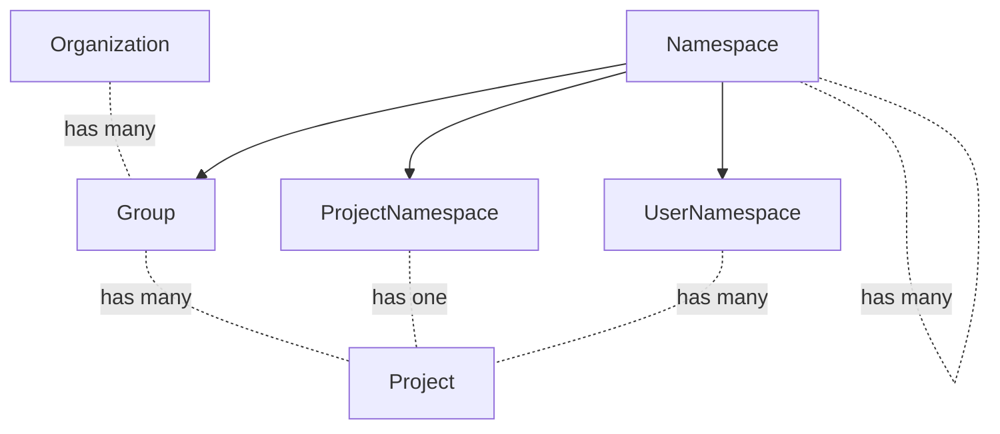
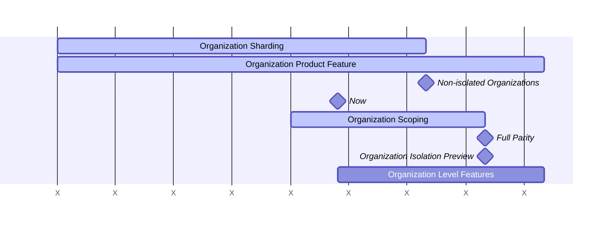



このドキュメントは作成途中であり、Organization 設計の現状を表しています。

## Glossary

- User: ユーザーアカウント。
- Member: ロールによって表現される一連の権限を持つエンティティに属する User。User は 1 つの Organization の Member となり、その Organization 内の多数の Group や Project の Member になることができます。
- Top-level Group: 他のすべての Group の最上位に位置する Group に与えられる名前。Group と Project は top-level Group の下にネストされます。
- Organization: Organization は 1 つまたは複数の top-level Group を入れるコンテナです。Organization どうしは互いに分離されています。
- Organization Member: Organization には Member と呼ばれる多数の User が所属します。Organization Member だけが Organization を見ることができます。User を Organization 内の Group や Project に追加すると、その User は Organization Member になります。
- Default Organization: すべての GitLab インスタンスにシードされる `ID = 1` の Organization。

## Summary

GitLab.com は GitLab ソフトウェアの公開された共有インストールです。これは GitLab を便利な SaaS として提供しますが、いくつかの重要な点で完全な GitLab 体験には及びません。

1. パリティ: GitLab.com と Self Managed で顧客に提供される機能は異なります。たとえば GitLab.com では、顧客は管理者権限を受け取りません。この権限は機能のかなりの部分を占めています。
2. 分離: GitLab.com では、Self Managed のインストールのように、顧客が他の顧客から独立して存在することはできません。

Organization は、すべてのプラットフォームに共通するコンテナとなることで、これらの問題を解決します。Organization コンテナを作成することで、分離の境界を強制し、すべての最上位機能に共通するエンティティを提供できます。

実質的に、Organization は Self Managed の機能をコンテナにラップし、この体験を他のすべての GitLab プラットフォームにもたらします。

分離のソリューションは [Cells プロジェクト](https://docs.gitlab.com/ee/architecture/blueprints/cells/index.html) の前提条件でもあります。これは [Organizations and Cells](cells.md) で Organization との関係において説明されています。

## Frequently Asked Questions

具体的な質問がある場合は、[FAQ](faq.md) で回答が見つかるかもしれません。あるいは、「Organization Blueprints」を参照しながら [GitLab Duo Chat](https://docs.gitlab.com/user/gitlab_duo_chat/examples/) に問い合わせてみることもできます。

### Splitting the GitLab.com Platform

GitLab.com プラットフォームは 2 つの異なる体験に分割されます。

現在、顧客は default organization 内の top-level group として GitLab.com に参加します。この体験は、共有のユーザープールがオープンソースプロジェクトに貢献できるようにするためなどの理由で、今後も無期限に維持されます。

GitLab.com は今後、プライベートな企業向け Organization のソリューションを提供することで、その提供範囲を拡大します。これらの企業向け Organization は、default organization を含む他のすべての Organization から完全に分離された状態で運用されます。

最終的には、顧客が default organization から自身のプライベートな Organization へ移行できるようになります。

## Fundamentals of Organizations

- Organization はほぼすべての GitLab 機能をラップします。
- Organization 間でデータを読み書きすることはできません。詳細は [Organization Isolation](isolation.md) を参照してください。
- 多くのプロダクト機能は変わりませんが、ほとんどのインスタンスレベルの機能は下位へ、その他の機能は Organization レベルへ移動します。レベルの変更については [後述](#level-structure) で詳しく説明します。
- User は単一の Organization の Member にしかなれません。
- User はその Organization のオーナーになることも、単なる標準メンバーになることもできます。
- 将来的には、User が複数の Organization の Member になれる機能を検討します。
- Organization のオーナーは、ユーザーアカウントを削除する機能など、自身の Organization 内で管理者スタイルの権限を持ちます。詳細は [後述](#roles-and-permissions) を参照してください。
- これらの変更は、GitLab.com、Self Managed、Dedicated を含むすべての GitLab プラットフォームで発生します。

## Organization Isolation

GitLab における Organization のすべてのデータと機能は分離されます。分離とは、データと機能が Organization の境界を決して越えられないことを意味します。これについては [Organization Isolation](isolation.md) でさらに詳しく説明します。

GitLab.com では、top-level group が Default Organization から段階的に移行するのをサポートするため、Organization は **非分離 (non-isolated)** の状態で始まります。Organization スコープのデータに依存する機能は、Organization の境界ルールを強制する前に、現在の Organization が非分離か分離済みかを確認する必要があります。詳細は [ADR 008: Non-isolated organizations on GitLab.com](decisions/008_non_isolated_organizations_gitlab_com.md) を参照してください。

## Impact of the Organization on Other Domains

Organization がシステムの他の部分にどのように影響するかをより詳しく説明するページの一覧です（随時追加されます）。

- [Billing](billing.md)
- [Cells](cells.md)
- [Settings](settings.md)
- [Lifecycle](lifecycle.md)
- [Users](users.md)
- [Login](login.md)
- [OAuth - GitLab as SP](oauth_client_auth.md)

## Level Structure

Organization は、ほとんどのインスタンスレベル機能と top-level Group のすべての機能を組み合わせた新しいレベルを形成します。

インスタンスレベルは、インフラストラクチャレベルの設定のために予約されます。GitLab.com では、インスタンスレベルにあたるものはセルローカルでのみ動作します。ほとんどのインスタンスレベルの機能と設定は、Organization レベルへ移動されるべきです。インスタンスレベルをセルローカルのままにすると、チームがセルごとに手動で設定を行うよう求められる可能性があり、これは効率的ではありません。

セルが存在せず Organization が 1 つしかない self-managed では、インスタンスレベルは問題になりません。

GitLab.com では、現在 top-level group が Organization レベルの機能（billing、settings など）のコンテナとして機能しています。これらの機能は Organization レベルへ移動します。その後、top-level group は通常の group やサブグループと同じように機能するようになり、「擬似レベル」という区別はなくなります。これにより、GitLab.com はこの区別がもともと存在しなかった Self-Managed と整合します。

以下は、GitLab における現在および将来の階層レベルを示したものです。

| Current Hierarchy         | Future Hierarchy |
| ------------------------- | -----------------|
| Instance Level            | ほとんどの設定が Organization へ移動 |
|                           | Organization Level |
| Top Level Group           | 特別なステータスを失い、通常の group になる |
| Group                     | Group（変更なし） |
| Project                   | Project（変更なし） |

Organization のローンチ前に、コア機能のみが Organization へ移動されます。ローンチ後には、残りのすべての機能が Organization レベルへ移動します。

以下はこれらのレベルのエンティティ図です。

## User Management

Organization 内で User がどのように管理されるかの詳細については、[Organization Users](users.md) を参照してください。

## Visibility

Organization はパブリックまたはプライベートにできます。パブリックな Organization は誰でも見ることができます。パブリックな Organization は、パブリックとプライベートの Group および Project を含むことができます。プライベートな Organization は、その Organization のメンバーだけが見ることができます。プライベートな Organization は、プライベートな Group および Project のみを含むことができます。

将来的には、Organization は Group と Project に対する内部 (internal) の可視性設定が追加されます。これにより、その Organization に含まれる User だけが見ることのできる内部 Organization を導入できるようになります。これは、Organization に属する User だけが次のものを見られることを意味します。

- Organization URL にアクセスした際の 404 ではなく、Organization のフロントページ
- Organization の名前
- Organization の説明
- Activity ページ、Groups、Projects、Users の概要などの Organization ページ。これらのページの内容は、各 User の特定の Group や Project へのアクセス権によって決まります。たとえば、プライベートな Project は Project 概要でこの Project のメンバーにのみ表示されます。
- 内部 Group および Project

最終目標として、次のシナリオを提供する予定です。

| Organization visibility | Group/Project visibility | Who sees the Organization? | Who sees Groups/Projects? |
| ------ | ------ | ------ | ------ |
| public | public | 全員 | 全員 |
| public | internal | 全員 | Organization メンバー |
| public | private | 全員 | Group/Project メンバー |
| private | private | Organization メンバー | Group/Project メンバー |

## Roles and Permissions

Organization には Owner ロールがあります。他の Organization Member と比べて、Owner は次のアクションを実行できます。

| Action | Owner | Member |
| ------ | ------ | ----- |
| Organization 設定を表示 | ✓ |  |
| Organization 設定を編集 | ✓ |  |
| Organization を削除 | ✓ |  |
| User を削除 | ✓ |  |
| Organization フロントページを表示 | ✓ | ✓ |
| Groups 概要を表示 | ✓ | ✓ (1) |
| Projects 概要を表示 | ✓ | ✓ (1) |
| Users 概要を表示 | ✓ |  |
| Organization の Activity ページを表示 | ✓ | ✓ (1) |
| 両方の Owner である場合に top-level Group を Organization に移管 | ✓ |  |

(1) Member はアクセス権を持つものだけを見ることができます。

Group および Project レベルの [ロール](https://docs.gitlab.com/ee/user/permissions.html) は、現在のままです。

## Relationship between Organization Owner and Instance Admin

（インスタンス）Admin ロールを持つ User は、現在 [self-managed の GitLab インスタンスを管理](https://docs.gitlab.com/ee/administration/index.html) できます。機能が Organization レベルへ移動するにつれて、Organization の Owner は、現在 Admin のみがアクセスできる機能により多くアクセスできるようになります。当社の SaaS プラットフォームでは、これにより企業が、現在 GitLab チームメンバーであるインスタンス Admin に依存せずに、自身の Organization をより効率的に管理できるようになります。SaaS では、インスタンス Admin と Organization の Owner は別々のユーザーになると想定しています。self-managed のインスタンスは一般に単一の organization にスコープされるため、この場合は両方のロールが同一人物によって担われる可能性があります。User がシステムを悪用している場合など、インスタンス Admin による介入が必要となる状況もあります。その場合、インスタンス Admin が取るアクションは Organization の Owner のアクションに優先します。たとえば、インスタンス Admin は Organization の Owner に代わって User を禁止または削除できます。

## Organization Space

非分離のものを含むすべての Organization は、[isolation](isolation.md) や Cell の配置とは独立して、それぞれ独自のスコープ付きの space を占有します。これにより各 Organization は独自の namespace を持ち、Cell の移動をまたいでもパスが安定し、Organization レベルの機能の置き場所を提供できます。その理由については [ADR 012: Organization is a scoped space](decisions/012_organization_space.md) を参照してください。

### Routing

現在、`https://gitlab.com/<path>/-/` 上でグローバルな一意性が必要なルーティング可能なエンティティと見なされるのは、Users、Projects、Namespaces、コンテナイメージのみです。既存のグローバルスコープのルートを許可するようにルーティングルールを更新し、新たに並行する Organization スコープのルートのセットを導入します。グローバルスコープのルートは、既存のルートとの後方互換性を維持し、また単一の Organization を持つ可能性が高い GitLab.com 以外のプラットフォームではパスの冗長性も削減します。URL の仕組みは [ADR 004](decisions/004_path_scope.md) で決定されており、[Current Organization](current_organization.md) にさらに詳細があります。

## Organization Development

以下は Organization の大まかな開発ロードマップです。このプロジェクトは複雑で、多くのエンジニアリングチーム間の調整が必要です。これを受けて、ロードマップは次の大きなフェーズに分割されています。

### Work Streams

#### Organization Context and Isolation

少数の例外を除き、テーブルは Organization に関連付けられるべきです。Organization のテーブルには `organization_id`、`namespace_id`、または `project_id` のカラムが必要であり、これによりすべてのテーブルが直接または間接的に Organization に属するようになります。この作業は現在、次のエピックにあります: https://gitlab.com/groups/gitlab-org/-/work_items/11670 。`organization_id` 外部キーを持つすべてのテーブルは、NOT NULL の外部キー制約付きで定義されます。すべてのコードパスは正しい `organization_id` の値を書き込んでおり、デフォルト値に依存していません。

- また、[読み取りが Organization の境界を越えて広がることを防ぐ](https://gitlab.com/groups/gitlab-org/-/epics/17388) ことも目指しています。
- group および project の作成の主要ページと、users のダッシュボードに重点を置きます。

#### Organization Product Feature

Organization のメンバーシップ管理やダッシュボードを含む、Organization のユーザーインターフェイスを構築します。

最初の Organization のターゲットには、次の一連の機能を含めます。場合によっては、意図的に問題のスコープを制限し、後でソリューションを拡張する予定です。

- **作成**
  - インストールプロセス中に default organization がシードされます。
  - GitLab.com では、Organization はユーザー登録時にのみ作成できます。
  - Self Managed と Dedicated では、登録時に Organization を作成するオプションは提供されません。
  - admin の設定で Organization の作成機能を制御します。この設定は GitLab.com では有効で、それ以外では無効です。
  - admin の設定に加えて、フィーチャーフラグで Organization の作成機能を制御します。GitLab.com では、このフィーチャーフラグは GitLab チームメンバーに対してのみ有効になります。それ以外では、このフィーチャーフラグはデフォルトで無効です。有効にしないよう警告しますが、self-managed のインスタンスがそうするのを防ぐことはできません。
- **編集**
  - Organization は **Settings > General** セクションで編集できます。フォームのフィールドには name、ID（読み取り専用）、description、avatar、visibility が含まれます。Organization の Owner のみがアクセスできます。
  - Organization のスラッグは **Settings > General** セクションで変更できます。Organization の Owner のみがアクセスできます。
- **可視性**
  - Organization はパブリックまたはプライベートにできます。
  - Default Organization はパブリックです。
  - `/explore` のような Organization 固有でないエンドポイントへのリクエストは、default organization にデフォルト設定されます。
  - パブリックな Organization は誰でも見ることができます。パブリックとプライベートの Group および Project を含むことができます。
  - プライベートな Organization は、その Organization に属する User だけが見ることができます。プライベートまたは内部の Group および Project のみを含むことができます。
- **ユーザー**
  - [ロールと権限](#roles-and-permissions)
  - Organization の作成により、作成した User が Organization の Owner に任命されます。
  - Organization の Owner は、ユーザーの既存のロールを User から Owner へ、またはその逆へ更新できます。
  - Organization ごとに少なくとも 1 名の Organization オーナーが必要です。
  - User は 1 つの Organization にしか所属できません。User が所属したい Organization ごとに、新しいアカウントを作成する必要があります。
  - Organization の Owner は、自身の Organization 内のユーザーを削除できます。
  - ユーザーが group または project のメンバーになると、そのユーザーは Organization のメンバーとしても追加されます。ユーザーは Organization に追加されたことを知らせるメールを受け取ります。
  - 最後の group または project からユーザーを削除しても、そのユーザーは Organization から削除されません。
  - ユーザーは自身のアカウントを削除できます。ユーザーが Organization の最後の Owner である場合、そのアカウントを削除することはできません。
- **Groups**
  - 既存のすべての top-level Group は default Organization の一部です。
  - Group は Organization 内に作成できます。
  - Group は Organization の Owner が編集できます。
  - Group は Organization の Owner が削除できます。
  - Organization のメンバーは、Groups 概要でアクセス権を持つ group を閲覧できます。group の一覧はソートおよび検索できます。
- **Projects**
  - GitLab.com 上の既存のすべての Project は default Organization の一部です。
  - Project は Organization 内に直接作成することはできず、代わりに Organization に属する group 内に作成されます。
  - Project は Organization の Owner が編集できます。
  - Project は Organization の Owner が削除できます。
  - Organization のメンバーは、Projects 概要でアクセス権を持つ project を閲覧できます。project の一覧はソートおよび検索できます。
- **Activity**
  - Organization のメンバーは、Organization の Activity ページにアクセスできます。
- **Admin**
  - 作成されたすべての Organization は、Admin Area の `Organizations` セクションに一覧表示されます。
  - Admin は新しいユーザーに Owner または User ロールを割り当てられます。
  - Admin はユーザーの既存のロールを更新できます。
  - Admin はユーザーを削除でき、そのユーザーの Organization との関連付けについて警告を受け取ります。Admin は最後の Organization Owner を削除することはできません。先に新しい Owner を割り当てる必要があります。
- **ナビゲーション**
  - 現在の Organization のコンテキストがナビゲーションサイドバーに表示されます。

#### Organization Level Features

機能はインスタンスレベルと top-level Group から Organization レベルへ移動します。新しい機能が Organization レベルで構築される場合もあります。最初は認証や billing などのコア機能から始めます。

このワークストリームには 2 つのフェーズがあります。最初のフェーズは、Organization を実用可能にする重要な機能を移行することです。Organization のリリース後の 2 番目のフェーズは、残りのすべての機能を Organization レベルへもたらすことです。

## Data Exploration

最初の [data exploration](https://gitlab.com/gitlab-data/analytics/-/issues/16166#note_1353332877) から、Users と Organizations について次の情報を取得しました。

- organization に接続されているユーザーのうち、大多数（98%）は単一の organization にのみ関連付けられています。これは、複数の Organization をまたいで移動する必要がある User は約 2% と見込まれることを意味します。
- ユーザーの大多数（78%）は単一の top-level Group のみの Member です。
- 現在の top-level Group の 25% は organization にマッチングできます。
  - これらの top-level Group のほとんど（83%）は、複数の top-level Group を持つ organization に関連付けられています。
  - 複数の top-level Group を持つ organization では、top-level Group の数の（中央値の）平均は 3 です。
  - 複数の top-level Group を持つ organization にマッチングされたほとんどの top-level Group は、単一の organization にまとめられることを意図していると想定されます（82%）。
  - 複数の top-level Group を持つ organization にマッチングされたほとんどの top-level Group は、単一の価格帯のみを使用しています（59%）。
- 現在の top-level Group のほとんどは public の可視性に設定されています（85%）。
- 0.5% 未満の top-level Group が、別の top-level Group と Group を共有しています。これらの group は、解決策を見つけるまで Organization へ移行できません。

この分析に基づき、Organizations を展開する際にも同様の挙動が見られると見込んでいます。

## Decisions

- 2023-05-15: [Organization route setup](https://gitlab.com/gitlab-org/gitlab/-/issues/409913#note_1388679761)
- [001: Organization context resolution](decisions/001_organization_context_resolution.md)
- [004: Organization path scope](decisions/004_path_scope.md)
- [005: Organization login](decisions/005_organization_login.md)
- [006: Administration and Settings](decisions/006_administration_and_settings.md)
- [007: Self-managed and Dedicated Single Organization](decisions/007_self_managed_dedicated_single_organization.md)
- [008: Non-isolated organizations on GitLab.com](decisions/008_non_isolated_organizations_gitlab_com.md)
- [009: State machine for organization lifecycle](decisions/009_state_machine.md)
- [010: Organization Read-Only Mode](decisions/010_organization_read_only_mode.md)
- [011: Universal Onboarding Workflow](decisions/011_onboarding.md)
- [012: Organization is a scoped space](decisions/012_organization_space.md)
- [013: Warn when creating a Top-Level-Group inside an organization](decisions/013_warn_on_tlg_creation.md)

## Links

- [Organization epic](https://gitlab.com/groups/gitlab-org/-/epics/9265)
- [Organization Isolation](isolation.md)
- [Organization: Frequently Asked Questions](faq.md)
- [Organization development guidelines](https://docs.gitlab.com/development/organization/)
- [Enterprise Users](https://docs.gitlab.com/ee/user/enterprise_user/index.html)
- [Cells blueprint](../cells/_index.md)
