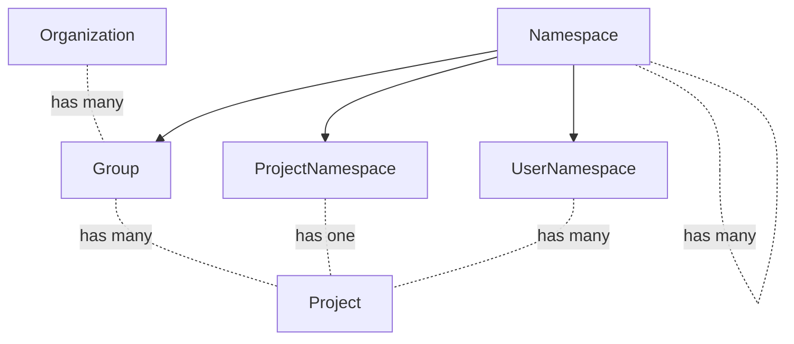
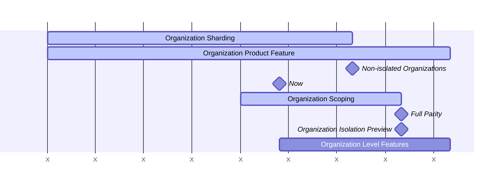

このページには今後予定されている製品・機能・機能性に関する情報が含まれています。ここに示す情報は参考目的のみです。購入・計画の決定にこの情報を使用しないでください。製品・機能・機能性の開発、リリース、タイミングは変更または延期される可能性があり、GitLab Inc. の独自の判断に委ねられています。

<table class="w-full text-sm border-collapse">
<thead>
<tr class="bg-gray-100 text-left">
<th class="px-3 py-2 border border-gray-300">Status</th>
<th class="px-3 py-2 border border-gray-300">Authors</th>
<th class="px-3 py-2 border border-gray-300">Coach</th>
<th class="px-3 py-2 border border-gray-300">DRIs</th>
<th class="px-3 py-2 border border-gray-300">Owning Stage</th>
<th class="px-3 py-2 border border-gray-300">Created</th>
</tr>
</thead>
<tbody>
<tr>
<td class="px-3 py-2 border border-gray-300">ongoing</td>
<td class="px-3 py-2 border border-gray-300"><a href="https://gitlab.com/lohrc" class="text-blue-600 hover:underline">@lohrc</a>, <a href="https://gitlab.com/alexpooley" class="text-blue-600 hover:underline">@alexpooley</a></td>
<td class="px-3 py-2 border border-gray-300"><a href="https://gitlab.com/ayufan" class="text-blue-600 hover:underline">@ayufan</a>, <a href="https://gitlab.com/tkuah" class="text-blue-600 hover:underline">@tkuah</a></td>
<td class="px-3 py-2 border border-gray-300"><a href="https://gitlab.com/jblack7" class="text-blue-600 hover:underline">@jblack7</a>, <a href="https://gitlab.com/mandrewsgl" class="text-blue-600 hover:underline">@mandrewsgl</a></td>
<td class="px-3 py-2 border border-gray-300">~devops::tenant scale</td>
<td class="px-3 py-2 border border-gray-300">2023-04-05</td>
</tr>
</tbody>
</table>

このドキュメントはOrganization設計の現状を表す作業中のものです。

## グロッサリー

- User: ユーザーアカウント。
- Member: ロールで表現された一連の権限を持つエンティティに属するUser。Userは1つのOrganizationのMemberになれ、そのOrganization内の多くのGroupsとProjectsのMemberになれます。
- Top-level Group: 他のすべてのGroupの最上位にあるGroupの名称。GroupsとProjectsはTop-level Groupの配下にネストされます。
- Organization: 1つまたは複数のTop-level Groupsのコンテナー。Organizationsは互いに隔離されています。
- Organization Member: OrganizationsにはMemberと呼ばれる多くのUsersがいます。Organization MembersのみがOrganizationの可視性を持ちます。Organization内のGroupまたはProjectにUserを追加すると、そのUserはOrganization Memberになります。
- Default Organization: すべてのGitLabインスタンスにシードされた`ID = 1`のOrganization。

## 概要

GitLab.comはGitLabソフトウェアの公開共有インストールです。これはGitLabを便利なSaaSとして提供しますが、重要な点でGitLabの完全な体験に達していません。

1. パリティ: GitLab.comとSelf Managedで顧客に提供される機能が異なります。例えば、GitLab.comでは顧客は管理者権限を受け取らず、これが多くの機能を占めています。
2. 隔離: GitLab.comでは、顧客はSelf Managedインストールのように他の顧客から独立して存在できません。

Organizationsは、すべてのプラットフォームにまたがる共通コンテナーとなることでこれらの問題を解決します。Organizationコンテナーの作成により、隔離境界を強制し、すべてのトップレベル機能の共通エンティティを提供できます。

実質的に、OrganizationはSelf Managed機能をコンテナーにラップし、この体験を他のすべてのGitLabプラットフォームに提供します。

この隔離ソリューションは、[OrganizationとのCells](cells.md)で説明されている[Cellsプロジェクト](https://docs.gitlab.com/ee/architecture/blueprints/cells/index.html)の前提条件でもあります。

## よくある質問

特定の質問がある場合は、[FAQ](faq.md)内で回答されているかもしれません。また、「Organization Blueprints」を参照しながら[GitLab Duo Chat](https://docs.gitlab.com/user/gitlab_duo_chat/examples/)に問い合わせることもできます。

### GitLab.comプラットフォームの分割

GitLab.comプラットフォームは2つの異なる体験に分割されます。

今日の顧客はデフォルトOrganization内のTop-level GroupとしてGitLab.comに参加しています。
この体験は、オープンソースプロジェクトに貢献できる共有ユーザープールを維持するために無期限に存続します。

GitLab.comはプライベートエンタープライズOrganizationsのソリューションでオファリングを拡大します。
これらのエンタープライズOrganizationsは、デフォルトOrganizationを含む他のすべてのOrganizationsから完全に隔離して運営されます。

最終的には、顧客がデフォルトOrganizationから自分のプライベートOrganizationに移行できるようになります。

## Organizationsの基本原則

- Organizationはほぼすべてのの GitLab機能をラップします。
- Organizations間でデータの読み書きは行えません。詳細は[Organization Isolation](isolation.md)を参照してください。
- 多くの製品機能は変わりませんが、ほとんどのインスタンスレベル機能は Organization レベルに移動します。レベル変更については[以下](#level-structure)で詳しく説明します。
- Usersは単一のOrganizationのMemberにのみなれます。
- Organizationのオーナーになることも、標準メンバーになることもできます。
- 将来、UsersがMemberになれるOrganizationsの数を複数に拡張することを検討します。
- Organizationオーナーは、ユーザーアカウントを削除できる能力など、Organization内で管理者スタイルの権限を持ちます。詳細は[以下](#roles-and-permissions)を参照してください。
- これらの変更はGitLab.com、Self Managed、Dedicatedを含むすべてのGitLabプラットフォームで行われます。

## Organization Isolation

GitLab内のすべてのOrganizationデータと機能は隔離されます。
隔離とは、データと機能がOrganizationの境界を越えることができないことを意味します。
詳細については[Organization Isolation](isolation.md)を参照してください。

GitLab.comでは、Default OrganizationからTop-level Groupsを段階的に移行するために、Organizationsは**非隔離**状態で始まります。
Organization範囲のデータに依存する機能は、現在のOrganizationが非隔離か隔離かを確認してから、Organization境界ルールを適用する必要があります。
詳細については[ADR 008: GitLab.com上の非隔離Organizations](decisions/008_non_isolated_organizations_gitlab_com.md)を参照してください。

## Organizationが他のドメインに与える影響

以下は、OrganizationがシステムのNother部分にどのように影響するかを詳しく説明するページの一覧です。

- [Billing](billing.md)
- [Cells](cells.md)
- [Settings](settings.md)
- [Users](users.md)
- [Login](login.md)
- [OAuth - GitLab as SP](oauth_client_auth.md)

## レベル構造 {#level-structure}

OrganizationはInstance Levelのほとんどの機能とTop Level Groupのすべての機能を組み合わせた新しいレベルを形成します。

Instance Levelはインフラレベルの設定のために予約されます。
GitLab.comでは、Instance Levelはセル単位でのみ動作します。
ほとんどのInstance Level機能と設定はOrganization Levelに移動するべきです。
Instance Levelをセルローカルのままにすると、チームは各Cellに対して手動設定を行うよう求められる可能性があり、効率的ではありません。

Instance LevelはSelf Managedにとっては問題ではありません。Cellsがなく、Organizationが1つだけだからです。

GitLab.comでは、Top-level Groupsは現在、Organizationレベルの機能（請求、設定など）のコンテナーとして機能しています。これらの機能はOrganization Levelに移動します。Top-level GroupsはそれでGitLab.com上にあっていつもと同じ通常のGroupsやSubGroupsとして機能し、「疑似レベル」の区別がなくなります。これにより、GitLab.comはSelf-Managedと同じになります。Self-Managedでは、この区別は存在したことがありませんでした。

以下はGitLab内の現在と将来の階層レベルの表です。

| 現在の階層         | 将来の階層 |
| ------------------------- | -----------------|
| Instance Level            | ほとんどの設定はOrganizationに移動 |
|                           | Organization Level |
| Top Level Group           | 特別な状態を失う。通常のGroupになる |
| Group                     | Group（変更なし） |
| Project                   | Project（変更なし） |

Organization発売前は、コア機能のみがOrganizationに移動されます。
発売後、残りのすべての機能がOrganizationレベルに移動されます。

以下はこれらのレベルのエンティティ図です。

## User管理

Organization内でのUserの管理方法については、[Organization Users](users.md)を参照してください。

## 可視性

Organizationsはパブリックまたはプライベートにできます。パブリックOrganizationsはすべての人が見ることができます。パブリックおよびプライベートなGroupsとProjectsを含むことができます。プライベートOrganizationsはOrganizationメンバーのみが見ることができます。プライベートまたは内部のGroupsとProjectsのみを含むことができます。

将来、OrganizationsはGroupsとProjectsに追加の内部可視性設定を取得します。これにより、含まれるUsersのみが見ることができる内部Organizationsを導入できます。つまり、Organizationの一部であるUsersのみが以下を見ることができます。

- Organization URLに移動したときに404ではなくOrganizationフロントページ
- Organizationの名前
- Organizationの説明
- Activity ページ、Groups、Projects、UsersオーバービューなどのOrganizationページ。これらのページの内容は、特定のGroupsとProjectsへの各Userのアクセスによって決まります。例えば、プライベートProjectsはProjectのメンバーのみがプロジェクト概要で見ることができます。
- 内部GroupsとProjects

最終目標として、以下のシナリオを提供する予定です。

| Organization可視性 | Group/Project可視性 | Organizationを見る人は? | Groups/Projectsを見る人は? |
| ------ | ------ | ------ | ------ |
| public | public | 全員 | 全員 |
| public | internal | 全員 | Organizationメンバー |
| public | private | 全員 | Group/Projectメンバー |
| private | private | Organizationメンバー | Group/Projectメンバー |

## ロールと権限 {#roles-and-permissions}

OrganizationsにはOwnerロールがあります。他のOrganization Membersと比べて、以下の操作を実行できます。

| アクション | Owner | Member |
| ------ | ------ | ----- |
| Organization設定を表示 | ✓ |  |
| Organization設定を編集 | ✓ |  |
| Organizationを削除 | ✓ |  |
| Usersを削除 | ✓ |  |
| Organizationフロントページを表示 | ✓ | ✓ |
| Groupsオーバービューを表示 | ✓ | ✓ (1) |
| Projectsオーバービューを表示 | ✓ | ✓ (1) |
| Usersオーバービューを表示 | ✓ |  |
| Organizationアクティビティページを表示 | ✓ | ✓ (1) |
| 両方のOwnerであればTop-level GroupをOrganizationに移管 | ✓ |  |

(1) Membersは自分がアクセス権を持つものだけを見ることができます。

GroupおよびProjectレベルでの[ロール](https://docs.gitlab.com/ee/user/permissions.html)は現在と同様です。

## Organization OwnerとInstance Adminの関係

（Instance）Adminロールを持つUsersは現在、[Self-ManagedのGitLabインスタンスを管理](https://docs.gitlab.com/ee/administration/index.html)できます。
機能がOrganizationレベルに移動するにつれて、Organization OwnerはAdminsにのみアクセス可能だった多くの機能にアクセスできるようになります。
SaaSプラットフォームでは、これは企業がInstance Adminに依存せずに自分のOrganizationをより効率的に管理できるようにする助けになります。Instance Adminは現在GitLabチームメンバーです。
SaaSでは、Instance AdminとOrganization Ownerは異なるユーザーになることが期待されます。
Self-managedインスタンスは一般的に単一のOrganizationに限定されるため、この場合は両方のロールが同一人物によって果たされる可能性があります。
ユーザーがシステムを悪用している場合など、Instance Adminによる介入が必要な状況があります。
その場合、Instance Adminが取るアクションはOrganization Ownerのアクションを上書きします。
例えば、Instance AdminはOrganization Ownerに代わってUserをバンまたは削除できます。

## ルーティング

今日、Users、Projects、Namespaces、コンテナーイメージのみが`https://gitlab.com/<path>/-/`でグローバルな一意性を必要とするルーティング可能なエンティティとみなされます。
私たちはルーティングルールを更新して、既存のグローバルスコープのルートを許可し、新しい並列のOrganizationスコープのルートセットを導入します。
グローバルスコープのルートは既存のルートとの後方互換性を維持し、単一のOrganizationを持つ可能性が高いGitLab.com以外のプラットフォームのパスの冗長性も削減します。
[Current Organization](current_organization.md)に詳細があります。

## Organization開発

以下はOrganizationsの高レベル開発ロードマップです。
プロジェクトは複雑で、多くのエンジニアリングチームにわたる調整が必要です。
それに応じて、ロードマップは以下の広範なフェーズに分割されています。

### 作業ストリーム

#### OrganizationのコンテキストとIsolation

テーブルは、少数の例外を除き、Organizationに関連している必要があります。
Organizationテーブルには、すべてのテーブルが直接または間接的にOrganizationに属するように`organization_id`、`namespace_id`、または`project_id`列が必要です。
この作業は現在このエピック内にあります: https://gitlab.com/groups/gitlab-org/-/work_items/11670。
`organization_id`外部キーを持つすべてのテーブルは、nullでない外部キー制約で定義されます。
すべてのコードパスは正しい`organization_id`値を書き込み、デフォルト値に頼りません。

- また[Organizationの境界を越えた読み取りを防ぐ](https://gitlab.com/groups/gitlab-org/-/epics/17388)ことも目指しています。
- 焦点はGroupとProjectの作成のためのプライマリページ、およびUsersダッシュボードに置かれます。

#### Organization製品機能

Organization Membershipの管理とダッシュボードを含むOrganizationのユーザーインターフェースを構築します。

初期Organizationターゲットに以下の機能セットを含める予定です。場合によっては意図的に問題の範囲を制限し、後で解決策を拡張する予定です。

- **作成**
  - デフォルトOrganizationはインストールプロセス中にシードされます。
  - GitLab.comでは、Organizationsはユーザー登録時にのみ作成できます。
  - Self ManagedとDedicatedは登録時にOrganizationを作成するオプションを提供しません。
  - Admin設定はOrganizationsを作成する機能を制御します。この設定はGitLab.comで有効になり、他では無効になります。
  - Admin設定に加え、機能フラグがOrganizationsを作成する機能を制御します。GitLab.comでは、この機能フラグはGitLabチームメンバーのみに有効になります。それ以外では、この機能フラグはデフォルトで無効になります。有効化に対して警告しますが、Self-managedインスタンスがそうすることを防ぐことはできません。
- **編集**
  - Organizationsは**Settings > General**セクションで編集できます。フォームフィールドには名前、ID（読み取り専用）、説明、アバター、可視性が含まれます。Organization Ownersのみアクセス可能。
  - Organizationスラッグは**Settings > General**セクションで変更できます。Organization Ownersのみアクセス可能。
- **可視性**
  - Organizationsはパブリックまたはプライベートにできます。
  - Default Organizationはパブリックです。
  - `/explore`などのOrganization固有でないエンドポイントへのリクエストはデフォルトOrganizationにデフォルトします。
  - パブリックOrganizationsは全員が見ることができます。パブリックおよびプライベートなGroupsとProjectsを含むことができます。
  - プライベートOrganizationsはOrganizationの一部であるUsersのみが見ることができます。プライベートまたは内部のGroupsとProjectsのみを含むことができます。
- **Users**
  - [ロールと権限](#roles-and-permissions)
  - Organizationの作成はOrganization Ownerとして作成者Userを任命します。
  - Organization OwnersはUserの既存ロールをUserからOwnerへ、またはその逆に更新できます。
  - Organization当たり少なくとも1人のOrganization Ownerが必要です。
  - UserはOrganizationの1つにのみ所属できます。Userが所属したいOrganizationごとに新しいアカウントを作成する必要があります。
  - Organization Ownersは自分のOrganization内のUsersを削除できます。
  - UserがGroupまたはProjectのメンバーになると、Organization Memberとしても追加されます。Organizationに追加されたことを通知するメールを受け取ります。
  - Userを最後のGroupまたはProjectから削除してもOrganizationから削除されるべきではありません。
  - Usersは自分のアカウントを削除できます。Usersが自分がOrganizationの最後のOwnerである場合はアカウントを削除できないようにするべきです。
- **Groups**
  - 既存のすべてのTop-level GroupsはDefault Organizationの一部です。
  - GroupsはOrganizationに作成できます。
  - GroupsはOrganization Ownerが編集できます。
  - GroupsはOrganization Ownerが削除できます。
  - Organization MembersはGroupsオーバービューでアクセス権を持つGroupsを表示できます。Groupsのリストはソートおよび検索できます。
- **Projects**
  - GitLab.comの既存のすべてのProjectsはDefault Organizationの一部です。
  - ProjectsはOrganization内に直接作成できません。代わりにOrganizationに属するGroupに作成されます。
  - ProjectsはOrganization Ownerが編集できます。
  - ProjectsはOrganization Ownerが削除できます。
  - Organization MembersはProjectsオーバービューでアクセス権を持つProjectsを表示できます。Projectsのリストはソートおよび検索できます。
- **Activity**
  - Organization MembersはOrganizationのActivityページにアクセスできます。
- **Admin**
  - 作成されたすべてのOrganizationsはAdmin Areaセクション`Organizations`に一覧表示されます。
  - Adminsは新しいユーザーにOwnerまたはUserロールを割り当てられます。
  - AdminsはUserの既存ロールを更新できます。
  - AdminsはUserを削除でき、そのUserのOrganization関連付けについて警告を受け取ります。Adminsは最後のOrganization Ownerを削除できません。まず新しいOwnerを割り当てる必要があります。
- **ナビゲーション**
  - 現在のOrganizationコンテキストはナビゲーションサイドバーに表示されます。

#### Organization Levelの機能

機能はInstance LevelとTop Level GroupからOrganization Levelに移動します。新しい機能もOrganization Levelで構築される可能性があります。焦点は認証と請求などのコア機能から始まります。

この作業ストリームには2つのフェーズがあります。最初のフェーズは、Organizationを実用可能にするクリティカルな機能を移行することです。Organization発売後の第2フェーズは、残りのすべての機能をOrganizationレベルに持ち込むことです。

## データ調査

初期の[データ調査](https://gitlab.com/gitlab-data/analytics/-/issues/16166#note_1353332877)から、UsersとOrganizationsに関する以下の情報を取得しました。

- Organizationに接続されているUsersのうち、大多数（98%）は単一のOrganizationにのみ関連付けられています。つまり、複数のOrganizationsをナビゲートする必要があるUsersは約2%と予想されます。
- 大多数のUsers（78%）は単一のTop-level Groupのみのメンバーです。
- 現在のTop-level Groupsの25%はOrganizationに一致させることができます。
  - これらのTop-level Groupsのほとんど（83%）は複数のTop-level Groupsを持つOrganizationに関連付けられています。
  - 複数のTop-level Groupsを持つOrganizationsのTop-level Groupsの（中央値）平均数は3です。
  - 複数のTop-level Groupsを持つOrganizationsに一致するTop-level Groupsのほとんどは、単一のOrganizationに統合することを意図していると想定されます（82%）。
  - 複数のTop-level Groupsを持つOrganizationsに一致するTop-level Groupsのほとんどは、単一の価格ティアのみを使用しています（59%）。
- 現在のTop-level Groupsのほとんどはパブリック可視性に設定されています（85%）。
- Top-level Groupsの0.5%未満が別のTop-level GroupとGroupsを共有しています。
  これらのGroupsは、解決策を決定するまでOrganizationに移行できません。

この分析に基づいて、Organizationsを展開する際に同様の動作が見られると予想されます。

## 決定

- 2023-05-15: [Organizationのルートセットアップ](https://gitlab.com/gitlab-org/gitlab/-/issues/409913#note_1388679761)
- [001: Organizationコンテキスト解決](decisions/001_organization_context_resolution.md)
- [004: Organizationパススコープ](decisions/004_path_scope.md)
- [005: Organizationログイン](decisions/005_organization_login.md)
- [006: 管理と設定](decisions/006_administration_and_settings.md)
- [007: Self-ManagedとDedicatedの単一Organization](decisions/007_self_managed_dedicated_single_organization.md)
- [008: GitLab.com上の非隔離Organizations](decisions/008_non_isolated_organizations_gitlab_com.md)

## リンク

- [Organization epic](https://gitlab.com/groups/gitlab-org/-/epics/9265)
- [Organization Isolation](isolation.md)
- [Organization: よくある質問](faq.md)
- [Organization開発ガイドライン](https://docs.gitlab.com/development/organization/)
- [Enterprise Users](https://docs.gitlab.com/ee/user/enterprise_user/index.html)
- [Cellsブループリント](../cells/index.md)
