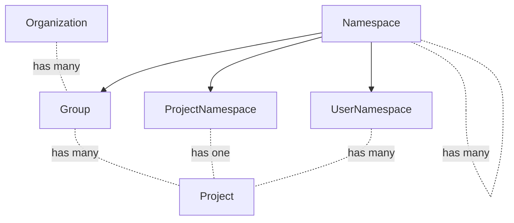
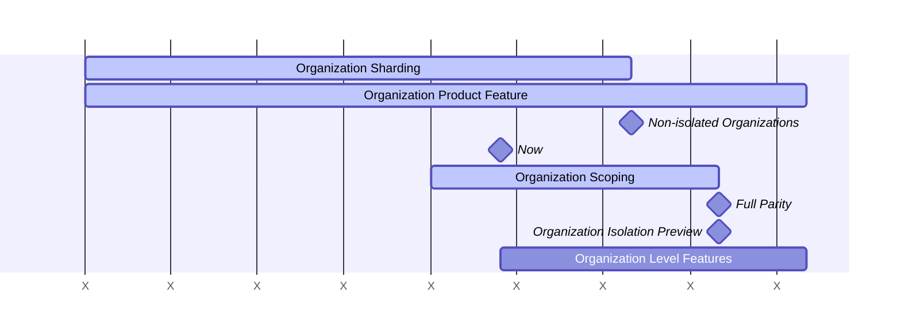



このドキュメントは作業中であり、Organization 設計の現状を反映しています。

## 用語集

- User: ユーザーアカウント。
- Member: ロールで表される権限のセットを持つエンティティに所属する User。User は 1 つの Organization のメンバーであり、その Organization 内の多数の Group と Project のメンバーになることができます。
- Top-level Group: トップレベルグループは、他のすべてのグループの最上位グループに付けられる名前です。グループとプロジェクトはトップレベルグループの下にネストされます。
- Organization: Organization は、1 つまたは複数のトップレベルグループのコンテナです。Organization は互いに隔離されています。
- Organization Member: Organization には Members と呼ばれる多数の User がいます。Organization のメンバーだけが、その Organization を見ることができます。User を Organization 内の Group や Project に追加すると、その User は Organization Member になります。
- Default Organization: すべての GitLab インスタンスにシードされる `ID = 1` の Organization。

## サマリー

GitLab.com は、GitLab ソフトウェアの公開された共有インストールです。これにより GitLab を便利な SaaS として提供できますが、いくつかの重要な点で完全な GitLab 体験には及びません。

1. パリティ: GitLab.com と Self Managed で顧客に提供される機能は異なります。たとえば GitLab.com では、顧客は管理者権限を受け取りません。この権限はかなりの量の機能を担っています。
2. 隔離: GitLab.com では、Self Managed インストールのように、顧客が他の顧客から独立して存在することはできません。

Organization は、すべてのプラットフォームに共通するコンテナとなることで、これらの問題を解決します。Organization コンテナを作成することで、隔離の境界を強制し、すべてのトップレベル機能に対して共通のエンティティを提供できます。

実質的に、Organization は Self Managed の機能をコンテナにラップし、この体験を他のすべての GitLab プラットフォームにもたらします。

この隔離ソリューションは、[Cells プロジェクト](https://docs.gitlab.com/ee/architecture/blueprints/cells/index.html)の前提条件でもあります。Cells プロジェクトについては、Organization との関連で [Organizations and Cells](cells.md) で説明しています。

## よくある質問

具体的な質問がある場合は、[FAQ](faq.md) で回答が見つかるかもしれません。あるいは、「Organization Blueprints」を参照しながら [GitLab Duo Chat](https://docs.gitlab.com/user/gitlab_duo_chat/examples/) に問い合わせてみることもできます。

### GitLab.com プラットフォームの分割

GitLab.com プラットフォームは、2 つの異なる体験に分割されます。

現在、顧客はデフォルト organization 内のトップレベルグループとして GitLab.com に参加します。
この体験は、共有されたユーザープールがオープンソースプロジェクトに貢献できるようにするため、無期限に存続します。

GitLab.com は今後、プライベートなエンタープライズ Organization 向けのソリューションで提供内容を拡張します。
これらのエンタープライズ Organization は、デフォルト organization を含む他のすべての Organization から完全に隔離された状態で運用されます。

最終的には、顧客がデフォルト organization から抜け出して、自身のプライベートな Organization に移行できるようになります。

## Organization の基本原則

- Organization はほぼすべての GitLab 機能をラップします。
- Organization 間でデータを読み書きすることはできません。[Organization Isolation](isolation.md) で詳しく説明しています。
- 多くのプロダクト機能は変更されませんが、ほとんどのインスタンスレベルの機能は下位に、その他の機能は Organization レベルに上位移動します。レベルの変更については[以下](#level-structure)で詳しく説明します。
- User は 1 つの Organization のメンバーにのみなれます。
- User は Organization のオーナーにも、単なる標準メンバーにもなれます。
- 将来的には、User が複数の Organization のメンバーになれるようにすることを検討します。
- Organization のオーナーは、ユーザーアカウントを削除する機能など、自身の Organization 内で管理者スタイルの権限を持ちます。詳細は[以下](#roles-and-permissions)で説明します。
- これらの変更は、GitLab.com、Self Managed、Dedicated を含むすべての GitLab プラットフォームで行われます。

## Organization Isolation

GitLab におけるすべての Organization のデータと機能は隔離されます。
隔離とは、データと機能が Organization の境界を越えられないことを意味します。
これについては [Organization Isolation](isolation.md) で詳しく説明しています。

GitLab.com では、トップレベルグループがデフォルト Organization から段階的に移行するのをサポートするため、organization は **非隔離（non-isolated）** 状態で始まります。
organization スコープのデータに依存する機能は、Organization の境界ルールを強制する前に、現在の organization が非隔離か隔離済みかを確認しなければなりません。
詳細は [ADR 008: GitLab.com 上の非隔離 organization](decisions/008_non_isolated_organizations_gitlab_com.md) を参照してください。

## Organization が他のドメインに与える影響

Organization がシステムの他の部分にどのように影響するかをより詳しく説明するページのリストです。今後も増えていきます。

- [Billing](billing.md)
- [Cells](cells.md)
- [Settings](settings.md)
- [Lifecycle](lifecycle.md)
- [Users](users.md)
- [Login](login.md)
- [OAuth - GitLab as SP](oauth_client_auth.md)

## レベル構造

Organization は、ほとんどのインスタンスレベルの機能とトップレベルグループのすべての機能を組み合わせた、新しいレベルを形成します。

インスタンスレベルは、インフラストラクチャレベルの設定のために予約されます。
GitLab.com では、インスタンスレベルにあたるものはセルローカルでのみ動作します。
ほとんどのインスタンスレベルの機能と設定は、Organization レベルに下げるべきです。
インスタンスレベルをセルローカルのまま残すと、チームが各セルに対して手動の設定を行うよう求められる可能性があり、効率的ではありません。

self-managed にはセルがなく、organization も 1 つしかないため、インスタンスレベルは問題になりません。

GitLab.com では、トップレベルグループが現在、organization レベルの機能（請求、設定など）のコンテナとして機能しています。これらの機能は Organization レベルに移動します。その後、トップレベルグループは通常のグループやサブグループとまったく同じように機能し、「疑似レベル」という区別はなくなります。これにより GitLab.com は、この区別がもともと存在しなかった Self-Managed と足並みが揃います。

以下は、GitLab における現在と将来の階層レベルを示したものです。

| 現在の階層         | 将来の階層 |
| ------------------------- | -----------------|
| インスタンスレベル            | ほとんどの設定が Organization に移動 |
|                           | Organization レベル |
| トップレベルグループ           | 特別な地位を失う。通常のグループになる |
| グループ                     | グループ（変更なし） |
| プロジェクト                   | プロジェクト（変更なし） |

Organization のローンチ前には、コア機能のみが Organization に移動します。
ローンチ後、残りのすべての機能が Organization レベルに移動します。

以下は、これらのレベルのエンティティ図です。

## ユーザー管理

Organization 内で User がどのように管理されるかの詳細については、[Organization Users](users.md) を参照してください。

## 可視性

Organization はパブリックまたはプライベートにできます。パブリックな Organization は誰もが見ることができます。パブリックおよびプライベートな Group と Project を含めることができます。プライベートな Organization は、その Organization のメンバーだけが見ることができます。プライベートな Group と Project のみを含めることができます。

将来的には、Organization は Group と Project に対する内部（internal）可視性設定を追加で持つようになります。これにより、それを含む User だけが見られる内部 Organization を導入できます。これは、Organization に属する User だけが次のものを見られることを意味します。

- Organization の URL に移動したときに 404 ではなく Organization のフロントページ
- Organization の名前
- Organization の説明
- Activity ページ、Group、Project、User の概要などの Organization ページ。これらのページの内容は、各 User の特定の Group や Project へのアクセス権によって決まります。たとえばプライベートな Project は、Project 概要ではこの Project のメンバーだけが見られます。
- 内部の Group と Project

最終目標として、私たちは次のシナリオを提供する予定です。

| Organization の可視性 | Group/Project の可視性 | Organization を見られる人 | Group/Project を見られる人 |
| ------ | ------ | ------ | ------ |
| public | public | 誰でも | 誰でも |
| public | internal | 誰でも | Organization メンバー |
| public | private | 誰でも | Group/Project メンバー |
| private | private | Organization メンバー | Group/Project メンバー |

## ロールと権限

Organization には Owner ロールがあります。他の Organization Member と比較して、Owner は次のアクションを実行できます。

| アクション | Owner | Member |
| ------ | ------ | ----- |
| Organization 設定の表示 | ✓ |  |
| Organization 設定の編集 | ✓ |  |
| Organization の削除 | ✓ |  |
| User の削除 | ✓ |  |
| Organization フロントページの表示 | ✓ | ✓ |
| Group 概要の表示 | ✓ | ✓ (1) |
| Project 概要の表示 | ✓ | ✓ (1) |
| User 概要の表示 | ✓ |  |
| Organization アクティビティページの表示 | ✓ | ✓ (1) |
| 両方の Owner である場合にトップレベル Group を Organization に転送 | ✓ |  |

(1) Member はアクセス権を持つものだけを見られます。

Group および Project レベルの[ロール](https://docs.gitlab.com/ee/user/permissions.html)は、現在のままです。

## Organization Owner とインスタンス Admin の関係

（インスタンス）Admin ロールを持つ User は、現在 [self-managed の GitLab インスタンスを管理](https://docs.gitlab.com/ee/administration/index.html)できます。
機能が Organization レベルに移動するにつれて、Organization Owner は現在 Admin のみがアクセスできる機能により多くアクセスできるようになります。
私たちの SaaS プラットフォームでは、これによりエンタープライズが、現在は GitLab チームメンバーであるインスタンス Admin に依存せず、自身の Organization をより効率的に管理できるようになります。
SaaS では、インスタンス Admin と Organization Owner は異なるユーザーであることを想定しています。
self-managed インスタンスは一般に単一の organization にスコープされるため、この場合は両方のロールが同じ人物によって果たされる可能性があります。
たとえば User がシステムを悪用しているときなど、インスタンス Admin による介入が必要な状況もあります。
その場合、インスタンス Admin が取るアクションは Organization Owner のアクションに優先します。
たとえばインスタンス Admin は、Organization Owner に代わって User を禁止または削除できます。

## Organization Space

非隔離のものを含むすべての Organization は、[isolation](isolation.md) と Cell 配置から独立した、それ自身のスコープされた空間を占有します。これにより、それぞれが独自の名前空間を持ち、Cell 移動をまたいでパスを安定させ、Organization レベルの機能の居場所を提供できます。根拠については [ADR 012: Organization is a scoped space](decisions/012_organization_space.md) を参照してください。

### ルーティング

現在、グローバルに一意であることが `https://gitlab.com/<path>/-/` 上で要求されるルーティング可能なエンティティとして扱われるのは、User、Project、Namespace、コンテナイメージのみです。
私たちは、既存のグローバルスコープのルートを許可するようルーティングルールを更新し、新たに並行する Organization スコープのルート群を導入します。
グローバルスコープのルートは既存のルートとの後方互換性を維持し、また GitLab.com 以外で単一の Organization を持つ可能性が高いプラットフォームに対してはパスの冗長性を減らします。
URL の仕組みは [ADR 004](decisions/004_path_scope.md) で決定されており、さらに詳しい情報は [Current Organization](current_organization.md) にあります。

## Organization の開発

以下は、Organization の大まかな開発ロードマップです。
このプロジェクトは複雑で、多くのエンジニアリングチーム間の調整が必要です。
これに対応して、ロードマップは次の大まかなフェーズに分割されています。

### ワークストリーム

#### Organization のコンテキストと隔離

テーブルは、少数の例外を除いて、Organization に関連付けられるべきです。
Organization のテーブルには `organization_id`、`namespace_id`、または `project_id` のいずれかのカラムが必要であり、すべてのテーブルが直接または間接的に Organization に属するようにします。
この作業は現在、このエピックに含まれています: https://gitlab.com/groups/gitlab-org/-/work_items/11670。
`organization_id` 外部キーを持つすべてのテーブルは、NOT NULL の外部キー制約で定義されます。
すべてのコードパスは正しい `organization_id` の値を書き込み、デフォルト値に依存しません。

- 私たちはまた、[読み取りが Organization の境界を越えて広がるのを防ぐ](https://gitlab.com/groups/gitlab-org/-/epics/17388)ことも目指しています。
- 私たちの焦点は、グループとプロジェクトの作成のための主要なページ、およびユーザーダッシュボードに置かれます。

#### Organization Product Feature

Organization のメンバーシップ管理とダッシュボードを含む、Organization のユーザーインターフェースを構築します。

最初の Organization のターゲットには、次の機能セットを含めます。一部のケースでは、意図的に問題の範囲を制限しており、後でソリューションを拡張する予定です。

- **作成**
  - インストールプロセス中にデフォルト organization がシードされます。
  - GitLab.com では、Organization はユーザー登録時にのみ作成できます。
  - Self Managed と Dedicated では、登録時に Organization を作成するオプションは提供されません。
  - 管理者設定が Organization を作成する機能を制御します。この設定は GitLab.com では有効になっており、それ以外では無効になっています。
  - 管理者設定に加えて、フィーチャーフラグが Organization を作成する機能を制御します。GitLab.com では、このフィーチャーフラグは GitLab チームメンバーに対してのみ有効になります。それ以外では、このフィーチャーフラグはデフォルトで無効です。私たちは有効化しないよう警告しますが、self-managed インスタンスがそうするのを防ぐことはできません。
- **編集**
  - Organization は **Settings > General** セクションで編集できます。フォームフィールドには、名前、ID（読み取り専用）、説明、アバター、可視性が含まれます。Organization Owner のみがアクセスできます。
  - Organization のスラッグは **Settings > General** セクションで変更できます。Organization Owner のみがアクセスできます。
- **可視性**
  - Organization はパブリックまたはプライベートにできます。
  - Default Organization はパブリックです。
  - `/explore` のような Organization 固有でないエンドポイントへのリクエストは、デフォルトで default organization になります。
  - パブリックな Organization は誰もが見ることができます。パブリックおよびプライベートな Group と Project を含めることができます。
  - プライベートな Organization は、その Organization に属する User だけが見ることができます。プライベートまたは内部の Group と Project のみを含めることができます。
- **ユーザー**
  - [ロールと権限](#roles-and-permissions)
  - Organization を作成すると、作成した User が Organization Owner に任命されます。
  - Organization Owner は、ユーザーの既存のロールを User から Owner へ、またはその逆に更新できます。
  - Organization ごとに少なくとも 1 人の Organization Owner が必要です。
  - User は 1 つの Organization にのみ所属できます。User が所属したい Organization ごとに、新しいアカウントを作成する必要があります。
  - Organization Owner は、自身の Organization 内のユーザーを削除できます。
  - ユーザーがグループやプロジェクトのメンバーになると、Organization メンバーとしても追加されます。Organization に追加されたことを知らせるメールを受け取ります。
  - ユーザーを最後のグループまたはプロジェクトから削除しても、Organization からは削除されないようにします。
  - ユーザーは自身のアカウントを削除できます。ユーザーが Organization の最後の Owner である場合は、自身のアカウントを削除できないようにします。
- **グループ**
  - 既存のすべてのトップレベル Group は default Organization に属します。
  - Group は Organization 内で作成できます。
  - Group は Organization Owner が編集できます。
  - Group は Organization Owner が削除できます。
  - Organization メンバーは、Groups 概要でアクセス権を持つグループを表示できます。グループのリストはソートおよび検索できます。
- **プロジェクト**
  - GitLab.com 上の既存のすべての Project は default Organization に属します。
  - Project は Organization 内で直接作成できず、代わりに Organization に属するグループ内で作成されます。
  - Project は Organization Owner が編集できます。
  - Project は Organization Owner が削除できます。
  - Organization メンバーは、Projects 概要でアクセス権を持つプロジェクトを表示できます。プロジェクトのリストはソートおよび検索できます。
- **アクティビティ**
  - Organization メンバーは、Organization の Activity ページにアクセスできます。
- **管理**
  - 作成されたすべての Organization は、Admin Area セクションの `Organizations` に一覧表示されます。
  - Admin は新しいユーザーに Owner または User ロールを割り当てられます。
  - Admin はユーザーの既存のロールを更新できます。
  - Admin はユーザーを削除でき、そのユーザーの Organization との関連について警告を受け取ります。Admin は最後の Organization Owner を削除できません。先に新しい Owner を割り当てる必要があります。
- **ナビゲーション**
  - 現在の Organization のコンテキストは、ナビゲーションサイドバーに表示されます。

#### Organization レベルの機能

機能はインスタンスレベルとトップレベル Group から Organization レベルに移動します。新しい機能が Organization レベルで構築されることもあります。焦点は、認証や請求などのコア機能から始まります。

このワークストリームには 2 つのフェーズがあります。最初のフェーズは、Organization を実用可能にする重要な機能を移行することです。Organization リリース後の 2 番目のフェーズは、残りのすべての機能を Organization レベルにもたらすことです。

## データ探索

最初の[データ探索](https://gitlab.com/gitlab-data/analytics/-/issues/16166#note_1353332877)から、User と Organization について次の情報を取得しました。

- organization に接続されているユーザーのうち、大多数（98%）は単一の organization にのみ関連付けられています。これは、複数の Organization を横断する必要がある User は約 2% であると予想されることを意味します。
- 大多数の User（78%）は、単一のトップレベル Group のメンバーにすぎません。
- 現在のトップレベル Group の 25% は、organization に一致させることができます。
  - これらのトップレベル Group のほとんど（83%）は、複数のトップレベル Group を持つ organization に関連付けられています。
  - 複数のトップレベル Group を持つ organization のうち、トップレベル Group の数の（中央値）平均は 3 です。
  - 複数のトップレベル Group を持つ organization に一致するトップレベル Group のほとんどは、単一の organization に統合されることを意図していると想定されます（82%）。
  - 複数のトップレベル Group を持つ organization に一致するトップレベル Group のほとんどは、単一の価格帯のみを使用しています（59%）。
- 現在のトップレベル Group のほとんどは、パブリックの可視性に設定されています（85%）。
- 0.5% 未満のトップレベル Group が、別のトップレベル Group と Group を共有しています。
  これらのグループは、解決策を決定するまで Organization に移行できません。

この分析に基づいて、Organization を展開する際にも同様の挙動が見られると予想します。

## 決定

- 2023-05-15: [Organization ルートのセットアップ](https://gitlab.com/gitlab-org/gitlab/-/issues/409913#note_1388679761)
- [001: Organization コンテキストの解決](decisions/001_organization_context_resolution.md)
- [004: Organization パススコープ](decisions/004_path_scope.md)
- [005: Organization ログイン](decisions/005_organization_login.md)
- [006: 管理と設定](decisions/006_administration_and_settings.md)
- [007: Self-managed と Dedicated の単一 Organization](decisions/007_self_managed_dedicated_single_organization.md)
- [008: GitLab.com 上の非隔離 organization](decisions/008_non_isolated_organizations_gitlab_com.md)
- [009: organization ライフサイクルのステートマシン](decisions/009_state_machine.md)
- [010: Organization 読み取り専用モード](decisions/010_organization_read_only_mode.md)
- [011: Universal Onboarding Workflow](decisions/011_onboarding.md)
- [012: Organization is a scoped space](decisions/012_organization_space.md)
- [013: Warn when creating a Top-Level-Group inside an organization](decisions/013_warn_on_tlg_creation.md)

## リンク

- [Organization エピック](https://gitlab.com/groups/gitlab-org/-/epics/9265)
- [Organization Isolation](isolation.md)
- [Organization: よくある質問](faq.md)
- [Organization 開発ガイドライン](https://docs.gitlab.com/development/organization/)
- [Enterprise Users](https://docs.gitlab.com/ee/user/enterprise_user/index.html)
- [Cells blueprint](../cells/_index.md)
