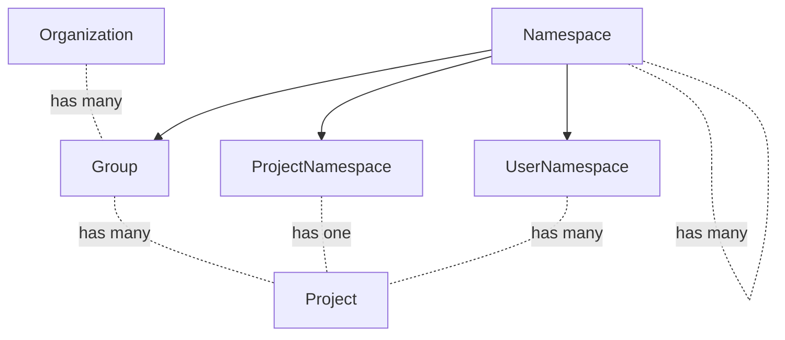
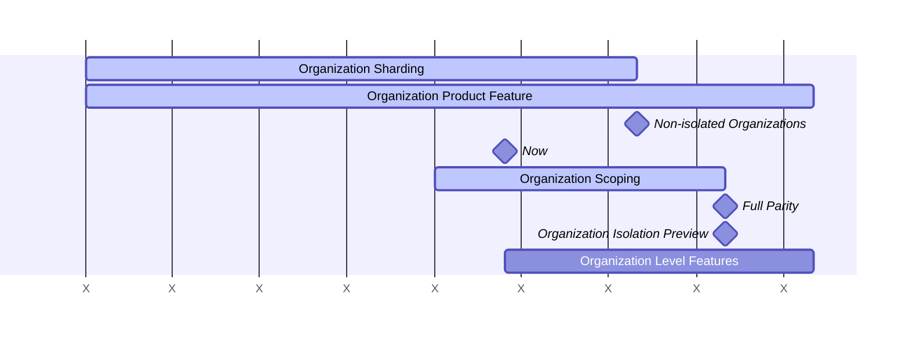



このドキュメントは作業中であり、Organization 設計の現状を反映しています。

## 用語集

- User: ユーザーアカウント。
- Member: ロールで表される権限のセットを持つエンティティに所属する User。User は 1 つの Organization のメンバーであり、その Organization 内の多数の Group と Project のメンバーになることができます。
- Top-level Group: トップレベルグループは、他のすべてのグループの最上位グループに付けられる名前です。グループとプロジェクトはトップレベルグループの下にネストされます。
- Organization: Organization は、1 つまたは複数のトップレベルグループのコンテナです。Organization は互いに隔離されています。
- Organization Member: Organization は Member と呼ばれる多数のユーザーを持ちます。Organization Member のみが Organization の可視性を持ちます。Organization 内のグループまたはプロジェクトにユーザーを追加すると、そのユーザーは Organization Member になります。
- Default Organization: すべての GitLab インスタンスにシードされる `ID = 1` を持つ Organization。

## サマリー

GitLab.com は GitLab ソフトウェアの公開共有インストールです。これは便利な SaaS として GitLab を提供しますが、重要な点でフル機能の GitLab エクスペリエンスには及びません:

1. パリティ: GitLab.com と Self Managed で顧客に提供される機能は異なります。たとえば、GitLab.com では顧客に管理者権限が付与されず、それは機能のかなりの量を占めます。
2. 隔離: GitLab.com では、Self Managed インストールのように、顧客が他の顧客から独立して存在することはできません。

Organization は、すべてのプラットフォームで共通のコンテナとして機能することにより、これらの問題を解決します。Organization コンテナの作成を通じて、隔離境界を強制し、すべてのトップレベル機能のための共通エンティティを提供できます。

実質的に、Organization は Self Managed の機能をコンテナにラップし、このエクスペリエンスを他のすべての GitLab プラットフォームにもたらします。

隔離ソリューションは、[Cells プロジェクト](https://docs.gitlab.com/ee/architecture/blueprints/cells/index.html) の前提条件でもあり、これは [Organization と Cells](cells.md) で Organization との関係で説明されています。

## よくある質問

特定の質問がある場合は、[FAQ](faq.md) 内で答えが見つかるか、または "Organization Blueprints" を参照する [GitLab Duo Chat](https://docs.gitlab.com/user/gitlab_duo_chat/examples/) にクエリを試すこともできます。

### GitLab.com プラットフォームの分割

GitLab.com プラットフォームは、2 つの異なるエクスペリエンスに分割されます。

顧客は今日 GitLab.com にデフォルト組織内のトップレベルグループとして参加します。
このエクスペリエンスは、オープンソースプロジェクトに貢献するための共有ユーザープールを可能にするために、無期限に存続します。

GitLab.com は、プライベートエンタープライズ Organization のソリューションで提供を拡大します。
これらのエンタープライズ Organization は、デフォルト組織を含む他のすべての Organization から完全に隔離されて運営されます。

最終的に、顧客はデフォルト組織から自分自身のプライベート Organization に移行することができるようになります。

## Organization の基本

- Organization は GitLab のほぼすべての機能をラップします。
- Organization 間でデータを読み書きすることはできません。詳細は [Organization の隔離](isolation.md) を参照してください。
- 多くのプロダクト機能は変更されませんが、ほとんどのインスタンスレベルの機能は下位に移動し、他の機能は Organization レベルに上位に移動します。レベルの変更については [下記](#level-structure) で詳述されています。
- ユーザーは 1 つの Organization のメンバーにのみなれます。
- ユーザーは Organization のオーナーまたは標準メンバーになることができます。
- 将来的には、ユーザーが複数の Organization のメンバーになる機能を検討します。
- Organization のオーナーは、ユーザーアカウントを削除する機能など、自分の Organization 内で管理者スタイルの権限を持ちます。詳細は [下記](#roles-and-permissions) を参照してください。
- これらの変更は、GitLab.com、Self Managed、Dedicated を含むすべての GitLab プラットフォームで発生します。

## Organization の隔離

GitLab のすべての Organization データと機能は隔離されます。
隔離は、データと機能が Organization の境界を越えることが決してできないことを意味します。
これは [Organization の隔離](isolation.md) でさらに詳しく説明されています。

GitLab.com では、Organization はトップレベルグループのデフォルト組織からの段階的な移行をサポートするために **非隔離** 状態で開始されます。
Organization スコープのデータに依存する機能は、Organization 境界ルールを強制する前に、現在の Organization が非隔離か隔離されているかをチェックする必要があります。
完全な詳細は [ADR 008: GitLab.com 上の非隔離 Organization](decisions/008_non_isolated_organizations_gitlab_com.md) を参照してください。

## Organization が他のドメインに与える影響

Organization がシステムの他の部分にどのように影響するかを詳しく説明するページの増え続けるリストは以下のとおりです。

- [Billing](billing.md)
- [Cells](cells.md)
- [Settings](settings.md)
- [Lifecycle](lifecycle.md)
- [Users](users.md)
- [Login](login.md)
- [OAuth - GitLab as SP](oauth_client_auth.md)

## レベル構造 {#level-structure}

Organization は、ほとんどのインスタンスレベルの機能とすべてのトップレベルグループ機能を組み合わせた新しいレベルを形成します。

インスタンスレベルは、インフラレベルの設定のために予約されます。
GitLab.com では、インスタンスレベルは Cell ローカルベースでのみ動作します。
ほとんどのインスタンスレベルの機能と設定は、Organization レベルに下げる必要があります。
インスタンスレベルを Cell ローカルのままにすることは、チームが各 Cell に対して手動設定を実行するように求められる可能性があることを意味し、これは効率的ではありません。

セルフマネージドの場合、Cell が存在せず、Organization も 1 つしかないため、インスタンスレベルは問題になりません。

GitLab.com では、現在トップレベルグループが Organization レベルの機能 (billing、settings など) のコンテナとして機能しています。これらの機能は Organization レベルに移動します。トップレベルグループはその後、通常のグループおよびサブグループとまったく同じように機能します - 「擬似レベル」の区別がなくなります。これにより、GitLab.com は、この区別が存在したことのない Self-Managed と整合します。

以下は、GitLab 内の現在および将来の階層レベルの図示です。

| 現在の階層 | 将来の階層 |
| ------------------------- | -----------------|
| インスタンスレベル | ほとんどの設定が Organization に移動 |
|                           | Organization レベル |
| トップレベルグループ | 特別な状態を失う。通常のグループになる |
| グループ | グループ (変更なし) |
| プロジェクト | プロジェクト (変更なし) |

Organization のリリース前には、コア機能のみが Organization に移動されます。
リリース後、残りのすべての機能は Organization レベルに移動します。

以下は、これらのレベルのエンティティ図です:

## ユーザー管理

Organization 内でユーザーがどのように管理されるかの詳細については、[Organization のユーザー](users.md) を参照してください。

## 可視性

Organization は公開 (public) または非公開 (private) にすることができます。公開 Organization は誰でも見ることができます。これらには公開および非公開のグループとプロジェクトを含めることができます。非公開 Organization は、その Organization メンバーのみが見ることができます。これらには非公開グループとプロジェクトのみを含めることができます。

将来、Organization はグループとプロジェクトのための追加の内部 (internal) 可視性設定を取得します。これにより、含まれるユーザーのみが見られる内部 Organization を導入できるようになります。これは、Organization の一部であるユーザーのみが以下を見られることを意味します:

- Organization URL に移動した時の 404 の代わりに、Organization のフロントページ
- Organization の名前
- Organization の説明
- Activity ページ、Groups、Projects、Users の概要などの Organization ページ。これらのページの内容は、各ユーザーの特定のグループとプロジェクトへのアクセスによって決定されます。たとえば、非公開プロジェクトはプロジェクト概要でそのプロジェクトのメンバーのみが見られます。
- 内部グループとプロジェクト

最終目標として、私たちは以下のシナリオを提供する予定です:

| Organization の可視性 | Group/Project の可視性 | Organization を誰が見るか? | Groups/Projects を誰が見るか? |
| ------ | ------ | ------ | ------ |
| public | public | 全員 | 全員 |
| public | internal | 全員 | Organization メンバー |
| public | private | 全員 | Group/Project メンバー |
| private | private | Organization メンバー | Group/Project メンバー |

## ロールと権限 {#roles-and-permissions}

Organization は Owner ロールを持ちます。他の Organization メンバーと比較して、以下のアクションを実行できます:

| アクション | Owner | Member |
| ------ | ------ | ----- |
| Organization 設定を表示 | ✓ |  |
| Organization 設定を編集 | ✓ |  |
| Organization を削除 | ✓ |  |
| ユーザーを削除 | ✓ |  |
| Organization フロントページを表示 | ✓ | ✓ |
| Groups 概要を表示 | ✓ | ✓ (1) |
| Projects 概要を表示 | ✓ | ✓ (1) |
| Users 概要を表示 | ✓ |  |
| Organization アクティビティページを表示 | ✓ | ✓ (1) |
| 両方の Owner の場合、トップレベルグループを Organization に転送 | ✓ |  |

(1) メンバーはアクセス権のあるものだけを見ることができます。

[ロール](https://docs.gitlab.com/ee/user/permissions.html) はグループおよびプロジェクトレベルで現状のままです。

## Organization Owner とインスタンス管理者の関係

(インスタンス) 管理者ロールを持つユーザーは、現在 [セルフマネージド GitLab インスタンスを管理](https://docs.gitlab.com/ee/administration/index.html) できます。
機能が Organization レベルに移動されるにつれて、Organization Owner は現在管理者のみがアクセスできる機能にアクセスできるようになります。
当社の SaaS プラットフォームでは、これは現在 GitLab チームメンバーであるインスタンス管理者に依存せずに、エンタープライズが独自の Organization をより効率的に管理できるようにするのに役立ちます。
SaaS では、インスタンス管理者と Organization Owner は異なるユーザーであることを期待します。
セルフマネージドインスタンスは一般的に単一の組織にスコープされているため、この場合、両方のロールが同じ人物によって満たされる可能性があります。
インスタンス管理者による介入が必要となる状況もあります。たとえば、ユーザーがシステムを悪用している場合などです。
そのような場合、インスタンス管理者が取るアクションは Organization Owner のアクションを上書きします。
たとえば、インスタンス管理者は Organization Owner に代わってユーザーを禁止または削除できます。

## ルーティング

今日、ユーザー、プロジェクト、名前空間、コンテナイメージのみが `https://gitlab.com/<path>/-/` でグローバルな一意性を必要とするルーティング可能なエンティティと見なされます。
私たちはルーティングルールを更新して、既存のグローバルスコープのルートを許可し、新しい並列の Organization スコープのルートのセットを導入します。
グローバルスコープのルートは、既存のルートとの後方互換性を維持するとともに、おそらく単一の Organization を持つ GitLab.com 以外のプラットフォームのパスの冗長性を削減します。
[Current Organization](current_organization.md) にさらに詳細があります。

## Organization の開発

以下は、Organization の高レベル開発ロードマップです。
プロジェクトは複雑で、多くのエンジニアリングチーム間の調整が必要です。
これに応えて、ロードマップは以下の広範なフェーズに分割されています。

### ワークストリーム

#### Organization コンテキストと隔離

少数の例外を除き、テーブルは Organization に関連している必要があります。
Organization 関連のテーブルには `organization_id`、`namespace_id`、または `project_id` 列が必要であり、すべてのテーブルが直接または間接に Organization に属するようにします。
この作業は現在、このエピックに位置しています: https://gitlab.com/groups/gitlab-org/-/work_items/11670。
`organization_id` 外部キーを持つすべてのテーブルは、NOT NULL 外部キー制約付きで定義されます。
すべてのコードパスは正しい `organization_id` 値を書き込んでおり、デフォルト値に依存していません。

- 私たちはまた、[読み取りが Organization の境界を超えて拡張するのを防ぐ](https://gitlab.com/groups/gitlab-org/-/epics/17388) ことを目指しています。
- 主な焦点は、グループおよびプロジェクト作成のための主要ページ、およびユーザーダッシュボードに置かれます。

#### Organization プロダクト機能

Organization メンバーシップ管理とダッシュボードを含む、Organization のユーザーインターフェースを構築します。

初期 Organization ターゲットには、以下の機能のセットを含めます。場合によっては、問題のスコープを意図的に制限しており、後でソリューションを拡張する予定です。

- **作成**
  - インストールプロセス中にデフォルト組織がシードされます。
  - GitLab.com では、Organization はユーザー登録時にのみ作成できます。
  - Self Managed および Dedicated は登録時に Organization を作成するオプションを提供しません。
  - 管理者設定で Organization を作成する機能を制御します。この設定は GitLab.com では有効、その他では無効です。
  - 管理者設定に加えて、フィーチャーフラグが Organization を作成する機能を制御します。GitLab.com では、このフィーチャーフラグは GitLab チームメンバーに対してのみ有効になります。その他では、このフィーチャーフラグはデフォルトで無効になります。有効化に対しては警告しますが、セルフマネージドインスタンスがそうすることを防ぐことはできません。
- **編集**
  - Organization は **Settings > General** セクションで編集できます。フォームフィールドには名前、ID (読み取り専用)、説明、アバター、可視性が含まれます。Organization Owner のみがアクセスできます。
  - Organization slug は **Settings > General** セクションで変更できます。Organization Owner のみがアクセスできます。
- **可視性**
  - Organization は公開または非公開にできます。
  - デフォルト組織は公開です。
  - `/explore` などの Organization 固有でないエンドポイントへのリクエストは、デフォルト組織にデフォルト設定されます。
  - 公開 Organization は誰でも見ることができます。これには公開および非公開のグループとプロジェクトを含めることができます。
  - 非公開 Organization は、Organization の一部であるユーザーのみが見ることができます。これには非公開または内部のグループとプロジェクトのみを含めることができます。
- **ユーザー**
  - [ロールと権限](#roles-and-permissions)
  - Organization の作成は、作成ユーザーを Organization Owner として任命します。
  - Organization Owner はユーザーの既存のロールを User から Owner、またはその逆に更新できます。
  - Organization ごとに少なくとも 1 人の Organization Owner が必要です。
  - User は 1 つの Organization のみの一部にしかなれません。User が一部になりたい Organization ごとに新しいアカウントを作成する必要があります。
  - Organization Owner は自分自身の Organization 内のユーザーを削除できます。
  - ユーザーがグループまたはプロジェクトのメンバーになると、彼らも Organization メンバーとして追加されます。Organization に追加されたことを通知するメールを受け取ります。
  - ユーザーを最後のグループまたはプロジェクトから削除しても、Organization からは削除されません。
  - ユーザーは自分自身のアカウントを削除できます。ユーザーが Organization の最後の Owner である場合、自分のアカウントを削除できてはなりません。
- **グループ**
  - 既存のトップレベルグループはすべてデフォルト組織の一部です。
  - グループは Organization 内で作成できます。
  - グループは Organization Owner によって編集できます。
  - グループは Organization Owner によって削除できます。
  - Organization メンバーは、アクセス権のあるグループを Groups 概要で表示できます。グループのリストは並べ替えと検索が可能です。
- **プロジェクト**
  - GitLab.com の既存のすべてのプロジェクトはデフォルト組織の一部です。
  - プロジェクトは Organization 内で直接作成できません。代わりに、Organization に属するグループ内で作成されます。
  - プロジェクトは Organization Owner によって編集できます。
  - プロジェクトは Organization Owner によって削除できます。
  - Organization メンバーは、アクセス権のあるプロジェクトを Projects 概要で表示できます。プロジェクトのリストは並べ替えと検索が可能です。
- **アクティビティ**
  - Organization メンバーは Organization の Activity ページにアクセスできます。
- **管理者**
  - 作成されたすべての Organization は、管理エリアセクション `Organizations` にリストされます。
  - 管理者は新しいユーザーに Owner または User ロールを割り当てることができます。
  - 管理者はユーザーの既存のロールを更新できます。
  - 管理者はユーザーを削除し、ユーザーの Organization 関連付けに関する警告を受け取ることができます。管理者は最後の Organization Owner を削除できません。最初に新しい Owner を割り当てる必要があります。
- **ナビゲーション**
  - 現在の Organization コンテキストは、ナビゲーションサイドバーに示されます。

#### Organization レベルの機能

機能はインスタンスレベルとトップレベルグループから Organization レベルに移動します。新しい機能も Organization レベルで構築される可能性があります。最初は認証や課金などのコア機能から焦点を当てます。

このワークストリームには 2 つのフェーズがあります。最初のフェーズは、Organization を実行可能にするための重要な機能を移行することです。Organization のリリース後の 2 番目のフェーズは、残りのすべての機能を Organization レベルにもってくることです。

## データ探索

最初の [データ探索](https://gitlab.com/gitlab-data/analytics/-/issues/16166#note_1353332877) から、ユーザーと Organization について以下の情報を取得しました:

- 組織に接続されているユーザーの大多数 (98%) は、単一の組織にのみ関連付けられています。これは、約 2% のユーザーが複数の Organization 間を移動する必要があると予想されることを意味します。
- ユーザーの大多数 (78%) は、単一のトップレベルグループのメンバーのみです。
- 現在のトップレベルグループの 25% は組織に一致させることができます。
  - これらのトップレベルグループのほとんど (83%) は、複数のトップレベルグループを持つ組織に関連付けられています。
  - 複数のトップレベルグループを持つ組織のうち、トップレベルグループの (中央値) 平均数は 3 です。
  - 複数のトップレベルグループを持つ組織に一致するほとんどのトップレベルグループは、単一の組織に統合されることが意図されていると想定されます (82%)。
  - 複数のトップレベルグループを持つ組織に一致するほとんどのトップレベルグループは、単一の価格帯のみを使用しています (59%)。
- 現在のトップレベルグループのほとんどは公開可視性に設定されています (85%)。
- トップレベルグループの 0.5% 未満が別のトップレベルグループとグループを共有しています。
  これらのグループは、ソリューションを決定するまで Organization に移行できません。

この分析に基づいて、Organization のロールアウト時にも同様の動作が見られることが予想されます。

## 意思決定

- 2023-05-15: [Organization route setup](https://gitlab.com/gitlab-org/gitlab/-/issues/409913#note_1388679761)
- [001: Organization context resolution](decisions/001_organization_context_resolution.md)
- [004: Organization path scope](decisions/004_path_scope.md)
- [005: Organization login](decisions/005_organization_login.md)
- [006: Administration and Settings](decisions/006_administration_and_settings.md)
- [007: Self-managed and Dedicated Single Organization](decisions/007_self_managed_dedicated_single_organization.md)
- [008: Non-isolated organizations on GitLab.com](decisions/008_non_isolated_organizations_gitlab_com.md)

## リンク

- [Organization epic](https://gitlab.com/groups/gitlab-org/-/epics/9265)
- [Organization Isolation](isolation.md)
- [Organization: Frequently Asked Questions](faq.md)
- [Organization development guidelines](https://docs.gitlab.com/development/organization/)
- [Enterprise Users](https://docs.gitlab.com/ee/user/enterprise_user/index.html)
- [Cells blueprint](../cells/_index.md)
