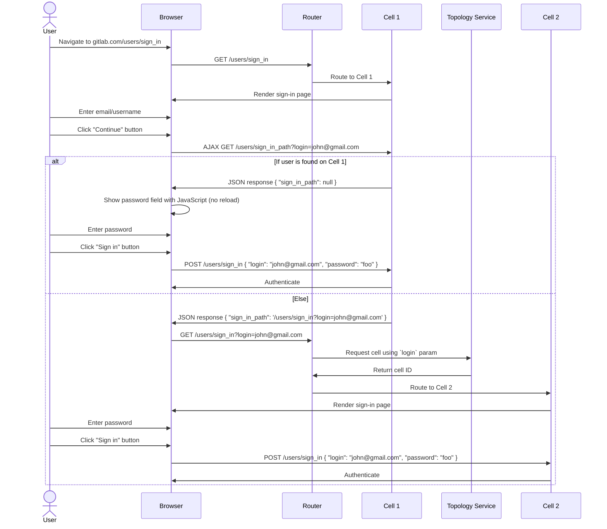
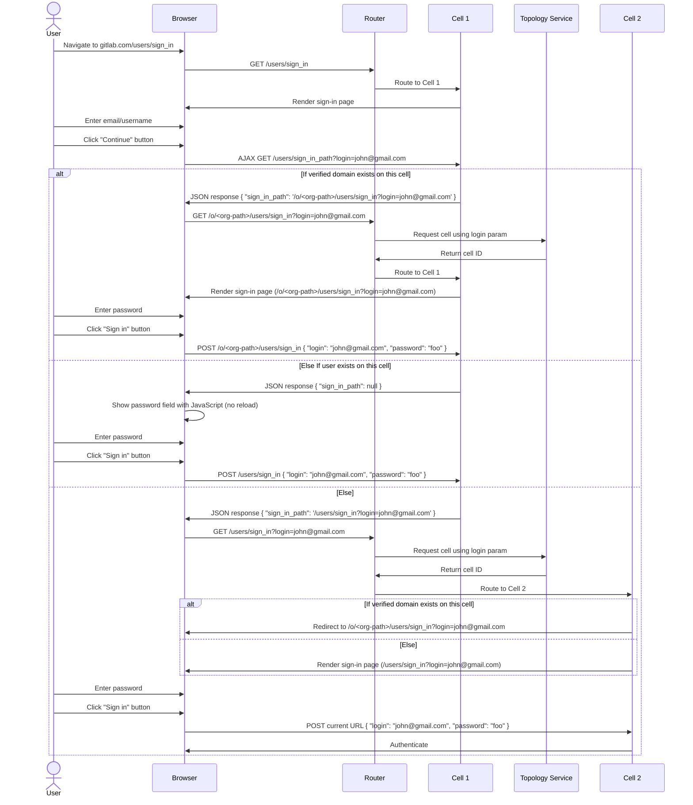

## コンテキスト

GitLabは現在、ユーザーがメール/ユーザー名とパスワードを同一ページで入力するシングルステップ認証プロセスを使用しています。このアプローチにはいくつかの制限があります。

- Organization固有のブランドや認証ポリシーがない
- Organization固有の認証方法（SAML、カスタムIdP）のサポートが限られている
- ユーザーのOrganizationコンテキストに基づくルーティングがない
- すべてのユーザーが同じ汎用エンドポイントを通じて認証される

Google Workspace、Slack、Microsoft 365などの現代的なエンタープライズアプリケーションは、まずユーザーのOrganizationコンテキストを識別してから、Organization固有の認証体験にルーティングするマルチステップ認証フローを使用しています。これにより、ブランドのサインインページ、Organization固有の認証方法、より良いユーザー体験が実現できます。

GitLabへのOrganizationsの導入に伴い、既存ユーザーとの後方互換性を維持しながらOrganization固有の認証をサポートする同様のパターンを実装する必要があります。

## 決定

ユーザーの識別と認証を分離するマルチステップ認証フローを実装します。

### ステップ1: ユーザー識別

ユーザーはグローバルサインインページ（`/users/sign_in`）でサインインフローを通過し、`login`クエリパラメーターを使用してTopology Serviceによって正しいCellにルーティングされます。将来、OrganizationsがVerified Domainsをサポートするようになったら、[verified domains](https://docs.gitlab.com/user/project/pages/custom_domains_ssl_tls_certification)を持つユーザーはブランドのOrganizationサインインページ（例: `/o/<org-path>/users/sign_in`）にリダイレクトされます。

#### Verified Domainsなしの場合



#### Verified Domainsありの場合

OrganizationsがVerified Domainsをサポートするようになったら、Verified Domainを持つユーザーをブランドのOrganizationサインインページ（例: `/o/<org-path>/users/sign_in`）にリダイレクトします。



#### AJAX GET /users/sign_in_path

##### リクエスト

```http
GET /users/sign_in_path
Host: gitlab.com
Content-Type: application/json

{
  "login": "john@gmail.com",
}
```

##### レスポンス

###### ユーザーが現在のCellに存在する場合

**ステータス:** `200 OK`

**JSONボディ:**

```json
{
  "sign_in_path": null
}
```

###### ユーザーが現在のCellに存在しない場合

**ステータス:** `200 OK`

**JSONボディ:**

```json
{
  "sign_in_path": "/users/sign_in?login=john@gmail.com"
}
```

###### ユーザーがVerified Domainを持つOrganizationに所属する場合

**ステータス:** `200 OK`

**JSONボディ:**

```json
{
  "sign_in_path": "/o/<organization>/users/sign_in?login=john@example.com"
}
```

#### OmniAuth

現在のCellにいないユーザーは、OmniAuthオプション（Google、SAMLなど）が機能する前に、まずメール/ユーザー名を入力する必要があります。メール/ユーザー名を入力する前にOmniAuthオプションを使用しようとすると、エラーメッセージが表示されます。エラーメッセージを調整して、まずメール/ユーザー名を入力する必要があることを説明します。

これは[OpenID/OAuth Client](../oauth_client_auth.md)に置き換えられます。

#### パスキーでのサインイン

パスキーはサインインしているCellに保存されるため、まずユーザーをサインインしているCellにルーティングする必要があります。「パスキーでサインイン」ボタンは、ユーザーがメール/ユーザー名を入力し、サインインしているCellにルーティングされた後に表示されます。

Self-ManagedとDedicatedでは、メール/ユーザー名を入力せずにパスキーが使用できます。

### ステップ2: Organization固有の認証

- ユーザーはOrganizationで設定された方法（パスワード、SAMLなど）を使用して認証します
- Organizationのブランドと特定の認証ポリシーが適用されます
- 2FAが必要な場合は、一次認証後の別画面として表示されます

### 後方互換性

- ユーザー名ベースのログインはレガシーの`/users/sign_in`ページで引き続き機能します
- 既存のOAuthおよびSAMLコールバックパスはすべて保持されます
- `gitlab.com/o/<org-path>/users/sign_in`経由の直接Organizationアクセスがサポートされます

### メールの一意性

- 各メールアドレスはすべてのGitLabインスタンスにわたって正確に1つのOrganizationに属します
- メールドメインを特定のOrganizationsに制限できます
- Topology Serviceはメールドメインマッピングに基づいて決定論的ルーティングを提供します

### 代替アクセス

- ユーザーは`gitlab.com/o/<org-path>/users/sign_in`経由でOrganizationのサインインページに直接アクセスできます
- プライベートOrganizationsは匿名ユーザーをサインインページにリダイレクトします
- パブリックOrganizationsはサインインオプションとともにすぐにページを表示します

## 結果

### ポジティブな結果

- **Organizationのブランディング**: Organizationsはカスタムロゴとスタイリングでブランドのサインイン体験を提供できます
- **柔軟な認証**: OrganizationsはOrganization固有の認証方法（SAMLのみ、パスワード+2FAなど）を設定できます
- **スケーラブルなアーキテクチャ**: Organization固有の認証ポリシーを持つ分散Cellアーキテクチャをサポートします

### 技術的な結果

- **Legacy Cell互換性**: `/users/sign_in`ページはLegacy Cellまたはそれ以降のCellによって引き続き提供されます
- **Topology Service統合**: メール分類とOrganizationルーティングのためにRails統合が必要です
- **コールバックの保持**: 既存のOAuth（`/oauth/callback`）とSAML（`/groups/my-group/-/saml/callback`）のすべてのコールバックパスは変更されません
- **ユーザー名サポート**: ユーザー名ベースの認証は後方互換性のために引き続き機能します
- **パスワードマネージャー**: 現在のCellにいないOrganizationにサインインする場合、メール/ユーザー名を入力した後でサインインページを再読み込みする必要があります。これにより、一部のパスワードマネージャーは第2ステップでパスワードを入力するのに追加クリックが必要になる場合があります。現在のCellにいるユーザーはページの再読み込みを必要としません。

## 代替案

### サブドメインベースのルーティング

Organization固有のサインインに`acme.gitlab.com`のようなサブドメインの使用を評価しました。これは以下の理由で却下されました。

- 複雑なDNS管理とSSL証明書の要件
- すべてのGitLabサービス（SSH、APIエンドポイント）と互換性がない
- 既存の統合やブックマークを壊す可能性がある
- すべてのデプロイメントモデル（SaaS、Self-Managed、Dedicated）にわたって実装が困難

## 実装注記

### URLパターン

- Organizationサインイン: `gitlab.com/o/<org-path>/users/sign_in`
- レガシーサインイン: `gitlab.com/users/sign_in`（変更なし）
- Organizationページ: `gitlab.com/o/<org-path>`（プライベートOrganizationsはサインインにリダイレクト）

### 将来の機能強化

- カスタムエイリアスドメイン: Organizationページへのルーティングを行う`gitlab.company.com`
- OrganizationスコープのSAMLコールバック: `gitlab.com/o/org-path/-/saml/callback`
- 強化されたOrganizationのブランディングとカスタマイズオプション
